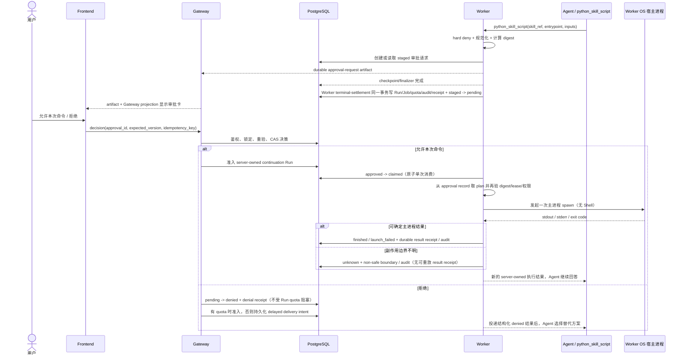
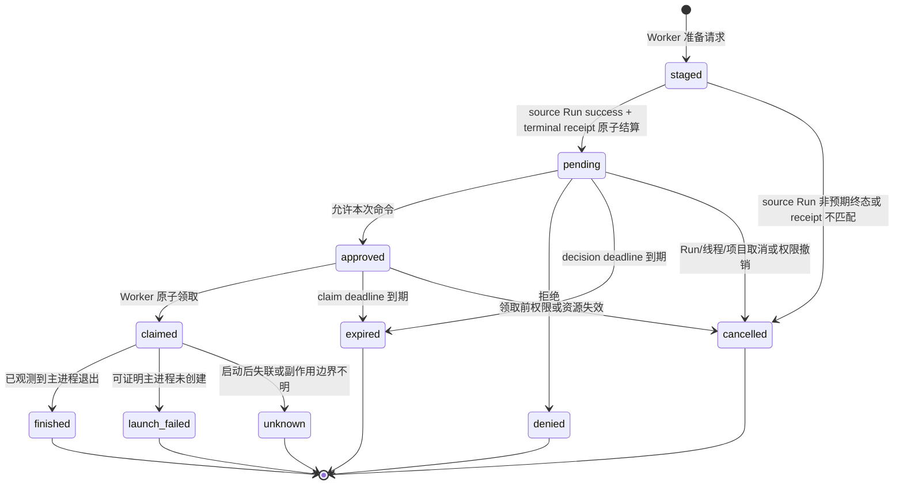

# Local Provider 本机命令单次审批方案

> 状态：设计提案，尚未实现。
> 决策日期：2026-08-14。
> 适用范围：Web 交互式 Private Run、`LocalSandboxProvider`、单用户可信本机部署。
> 产品决策：只支持“允许本次命令”和“拒绝”；不提供会话级、线程级或永久授权。

## 1. 摘要

本方案为 `LocalSandboxProvider` 增加一条显式、可审计、单次消费的本机命令
审批链。Agent 想运行已发布 Skill 中的 Python 脚本时，系统先冻结解释器、完整
Skill 执行包、输入 snapshot 和启动参数并暂停当前对话步骤；用户在界面查看准确
启动计划和风险后，只能选择：

- **允许本次命令**：仅允许当前执行计划执行一次；
- **拒绝**：不执行命令，Agent 收到结构化拒绝结果后继续寻找替代方案。

审批解决的是“用户是否授权”，不会把 Local Provider 变成隔离沙箱。获批脚本
仍直接以 ActWeave Worker 所在 OS namespace 和系统账号权限运行；native macOS
开发部署中，这就是运行 Worker 的 Mac 账号。脚本可以访问该账号能访问的文件、
进程、凭据和网络，也可以把读取到的数据经 stdout 返回给 Agent/远程模型服务。
界面必须明确展示这一事实。

MVP 不审批现有 `task(subagent_type="bash")`。Bash 子代理可在一次任务中自主产生
多条尚未确定的命令，并且当前子代理图没有持久化 checkpointer；在子代理启动前
点击一次“允许”，实际会授权一组未知命令，不满足“精确命令一次”的产品约束。
MVP 新增一个无 Shell 解析的窄工具 `python_skill_script`，仅运行冻结的已发布
Skill 执行包，并继续保持 Bash 子代理和通用宿主命令关闭。

核心安全不变量：

1. 部署策略为 `disabled` 时，任何 UI 操作都不能开启本机执行；
2. 用户批准的是服务端保存的冻结启动计划，不是模型描述或浏览器回传的命令；
3. 执行前必须重新校验用户、项目、线程、资产版本、文件版本和审批有效期；
4. 一次授权只能原子消费一次；冻结包、输入、启动参数或上下文任何变化都必须
   重新审批；这不承诺脚本启动后的行为可被 Local Provider 约束；
5. 宿主进程可能已产生副作用后 Worker 崩溃时，禁止自动重试，状态收敛为
   `unknown` / `SIDE_EFFECT_STATE_UNKNOWN`；
6. 高危硬拒绝规则先于用户审批，用户不能覆盖平台 hard deny；
7. 自动化、Webhook、IM 等无人实时交互渠道一律 fail closed。

## 2. 背景和现状

### 2.1 已确认事实

当前实现具有以下行为：

- `config.yaml` 使用 `LocalSandboxProvider`，且
  `sandbox.allow_host_bash: false`；
- `deerflow/sandbox/security.py` 通过一个进程级布尔配置决定本机 Bash
  是否可用；
- `deerflow/sandbox/tools.py` 和 `tools/builtins/task_tool.py` 在调用前直接
  拒绝本机 Bash 或 Bash 子代理，没有“等待审批”状态；
- `deerflow/sandbox/local/local_sandbox.py` 最终通过宿主 Shell 的 `-c`
  参数启动命令。当前路径检查在源码中也明确只是 best-effort，不是安全隔离边界；
- `deerflow/subagents/executor.py` 创建子代理图时使用 `checkpointer=False`，
  因此不能在 Bash 子代理内部某条具体命令处可靠暂停、进程重启后再原地恢复；
- 当前 `ask_clarification` 可以产生持久化交互卡片并结束本轮，随后由新 Run
  续接；但其回复通过隐藏聊天消息提交，且非交互渠道会提示 Agent“按最佳判断继续”。
  这种语义不能用作执行权限；
- 前端目前不会投影通用 LangGraph interrupt，`HumanInputCard` 只适用于普通
  问答。执行审批需要独立的服务端状态、API 和卡片；
- 当前审计中间件仅记录 Bash 命令摘要和风险结论到日志，不具备持久化的
  请求、决策、单次消费和执行结果审计链。

### 2.2 本次故障暴露出的相邻问题

这次 Python 统计流程先后暴露了三个不同问题，不能把它们混成一个审批功能：

1. 已启用 Skill 的只读挂载没有完整进入工具运行上下文，`read_file` 将其误判为
   disabled；
2. Agent 随后改派 Bash 子代理，因 `allow_host_bash: false` 被安全门禁拒绝；
3. 另有 Private File finalizer 的 PostgreSQL 排序与 Python 排序不一致问题，
   可能在模型已生成回复后把 Run 终态改成失败。

审批只解决第 2 类“是否允许本机执行”的产品能力。第 1、3 类是独立缺陷，应在
启用审批功能前修复，见 §18。

### 2.3 合理假设

MVP 按以下部署前提设计：

- ActWeave Worker 以用户自己的 native macOS 账号运行，并持有 §6.3 的唯一
  server-owned host execution domain；doctor 只做诊断，运行时持续复验 domain、
  allowed owner 和 Worker topology；
- 用户通过 Web 页面实时参与审批；
- 当前登录用户是 Private Thread owner，且具备服务端签发的审批 capability；
- 运营者明确选择 `approval_required`，理解命令将在宿主机执行；
- 首个落地场景是运行已发布 Skill 中的 Python 脚本并读取项目工作区文件。

不满足这些前提时保持禁用，而不是自动降级为无审批执行。

## 3. 目标与非目标

### 3.1 目标

- 在界面展示实际将执行的结构化命令、工作目录、输入脚本和风险；
- 支持“允许本次命令”和“拒绝”两个确定决策；
- 刷新、active projection 轮询和 Worker 重启后仍能恢复待审批卡片；批准/拒绝后的
  continuation Run 通过既有 durable SSE 重连恢复；
- 审批与项目、owner、线程、来源 Run、工具调用和冻结资产版本严格绑定；
- 一次批准只允许原子消费一次，系统最多发起一次主进程 spawn 尝试，并对并发
  点击、重复请求和重放保持幂等；
- 拒绝、过期或失效后，Agent 可以继续使用不需要本机执行的替代方案；
- 不在等待审批期间占用 Worker lease 或项目并发 Run 配额；
- 提供不含命令原文、输出和秘密值的持久化安全审计；
- 不改变 AIO、BoxLite、E2B 等隔离 Sandbox 的既有行为。

### 3.2 非目标

- 不把 Local Provider 宣称为安全沙箱；
- 不提供“本次对话允许”“30 分钟内允许”或“总是允许”；
- 不允许用户从 UI 突破部署级 `disabled`；
- 不审批任意 `bash -c`、管道、重定向、命令拼接或后台进程；
- 不在 MVP 中审批 Bash 子代理；
- 不保证宿主机外部副作用 exactly-once；
- 不允许普通聊天文字“允许”“继续”产生执行权限；
- 不为无人值守 Automation、Webhook 或 IM Run 自动批准；
- 不用浏览器 localStorage/sessionStorage 保存任何授权材料。

## 4. 核心产品选择：冻结 Skill 脚本，而不是任意 Shell

### 4.1 新工具契约

MVP 新增直接工具 `python_skill_script`，建议模型参数为：

```json
{
  "description": "运行已发布中文统计 Skill 的字符统计脚本",
  "skill_ref": "skill:project:chinese-statistics:v1",
  "entrypoint": "scripts/count_chars.py",
  "args": ["/mnt/user-data/workspace/article.txt"],
  "input_paths": ["/mnt/user-data/workspace/article.txt"],
  "cwd": "/mnt/user-data/workspace",
  "timeout_seconds": 60
}
```

`description` 只用于对话解释，不参与授权判断。`skill_ref` 必须解析到当前 Run
已经冻结的已发布 Skill version。服务端从该版本构造完整的 content-addressed
执行包，digest 覆盖包内每个文件，而不是只覆盖主 `.py`。`input_paths` 必须解析
到版本化 Private File snapshot；MVP 不支持模型刚写入但尚未成为权威 snapshot
的 workspace 脚本。

Worker 使用受信任的固定 Python launcher，把解释器、stdlib/runtime manifest、
launcher 和完整 Skill 包一并钉住。实际启动形态等价于：

```text
<pinned-python> -I -S -B <trusted-launcher> \
  --bundle <content-addressed-skill-snapshot> \
  --entry scripts/count_chars.py \
  --input <versioned-private-file-snapshot>
```

Launcher 显式设置只包含 stdlib 和冻结 Skill bundle 的 import path，禁止 user-site、
`.pth`、`sitecustomize`、cwd import 和 `PYTHONPATH`。服务端把 argv 数组直接传给
`subprocess`；不能把它们重新拼成字符串交给 Shell。

建议配置使用显式程序映射：

```yaml
sandbox:
  use: deerflow.sandbox.local:LocalSandboxProvider
  allow_host_bash: false
  host_execution_approval:
    mode: approval_required
    deployment_mode: trusted_single_user_native_darwin
    execution_domain_id: "operator-enrolled-domain-uuid"
    allowed_owner_user_id: "local-owner-user-id"
    request_ttl_seconds: 300
    max_timeout_seconds: 120
    python_runtime:
      executable: /usr/bin/python3
      expected_code_sign_identity: "operator-pinned-identity"
```

MVP 进一步限制：

- 模型不能提供解释器 flags、launcher 路径或任意 executable；
- 禁止 `-c`、stdin 代码、`-m`、pip、workspace 脚本和未发布 Skill；
- 执行包只允许有界数量/大小的普通 `.py` 与数据文件，拒绝 symlink、device、
  `.so`、`.dylib`、`.pyc` 和其他 bundle 内原生/预编译代码；
- digest 覆盖完整 Skill bundle、trusted launcher、Python runtime manifest、所有
  非秘密环境键值和输入 snapshot；
- MVP 只允许 `required_credential_slots=[]` 的 Skill，runner 不注入任何 governed
  Credential 或其他 secret；credential-bearing Skill 直接 hard deny；
- 允许读取的虚拟路径仍需通过现有 authority 校验，但明确不把该校验当作隔离边界。

这些约束只能让用户批准的**初始代码包和启动上下文**与实际 spawn 尝试一致。
Python 一旦启动仍是任意宿主代码，可以主动打开未列入计划的主机文件、动态加载
系统库、联网或创建子进程；Local Provider 无法保证运行时行为等同于静态计划。

### 4.2 为什么不直接给 `bash` 加两个按钮

任意 Shell 命令具有以下问题：

- 一条显示文本可包含多个命令、子 Shell、命令替换、管道和重定向；
- `nohup`、`&`、`setsid` 等可以让子进程脱离当前 Run；
- 引号、环境变量、glob 和字符编码让“看见的命令”与“实际执行的命令”难以
  建立稳定的一一对应；
- Bash 子代理启动时还没有后续每条具体命令，无法满足精确审批；
- 当前 Bash 子代理没有 durable checkpointer，无法在内部命令边界安全续跑。

因此 MVP 只支持无 Shell 的 `python_skill_script`。如果未来要支持任意 Bash 或
通用 `program + argv`，必须作为独立二期设计，实现子代理持久化、逐命令审批和
新的风险模型，不能扩大本方案的授权范围。

## 5. 架构与信任边界

### 5.1 组件职责

| 组件                  | 职责                                                |
| --------------------- | --------------------------------------------------- |
| Agent / harness       | 产生结构化执行意图；不得产生授权                    |
| HostExecutionPolicy   | 确定性预检、hard deny、规范化执行计划和风险等级     |
| ExecutionApprovalPort | harness 使用的窄接口；不让 harness 依赖 app ORM     |
| Gateway               | 鉴权、读取审批、处理决策、CAS、续接 Run 准入        |
| PostgreSQL            | 审批请求、决策、版本、消费状态和审计的唯一权威      |
| Worker                | 唯一可消费批准并启动宿主进程的服务                  |
| Frontend              | 展示服务端投影并提交 decision；不持有执行 authority |

Gateway 仍不执行 Agent 图，也不执行宿主命令。用户点击批准后，Gateway 只写入
权威决策并准入 continuation Run；真正的进程启动仍只发生在 Worker。

### 5.2 主流程



### 5.3 审批是工具执行屏障

当一个模型响应包含需要审批的 `python_skill_script` 时，该调用构成执行屏障。
普通 `wrap_tool_call` 已经处于 ToolNode 的逐调用 handler 内，不能阻止 sibling
并发开始；屏障必须实现为 `after_model` / pre-ToolNode 的**整批检查**：

- 在任何 tool handler 启动前，同时检查规范化 `AIMessage.tool_calls` 与 provider
  raw/structured tool-call 表示，二者不一致直接 fail closed；
- 若一批不只有唯一一个 `python_skill_script`，拒绝整批并为所有 call 生成稳定的
  cancelled/replan 结果，让模型下一轮单独重发；不能先执行 sibling，也不能仅从
  一种表示里删掉 sibling；
- 只有批内唯一调用为 `python_skill_script` 时才进入 staged handler；
- 每个线程 MVP 最多存在一个 `staged|pending|approved|claimed` active 请求；
- `pending|approved|claimed` 期间 composer 和普通新 Run admission 都禁用，只有
  当前 approval 的 server-owned continuation 可以穿过；用户要改变方向必须先
  拒绝仍为 pending 的请求。

这避免“用户看到审批卡时，同批其他工具已经改变了工作区”的竞态。

首轮 handler 只创建 staged 内部记录和 snapshot，必须在同一事务验证 source
Job/Run lease，并在工具分类中标为 trusted idempotent。它不能触发现有通用
`before_tool_call` 的 `retry_safety=unknown`；真正的外部副作用 fence 只发生在
批准后的 §9.2 原子 claim + spawn 边界。

## 6. 部署策略与配置兼容

### 6.1 新配置

`host_execution_approval.mode` 只允许：

| 值                  | 行为                                                                |
| ------------------- | ------------------------------------------------------------------- |
| `disabled`          | 默认值；不向 Agent 暴露 `python_skill_script`，所有请求 fail closed |
| `approval_required` | 暴露窄化的 `python_skill_script`，每个冻结启动计划都必须单次审批    |

不增加 `always` 或 thread/session grant。用户已经明确要求只允许精确命令一次。

### 6.2 与 `allow_host_bash` 的关系

- `allow_host_bash` 保留为既有高风险兼容开关，但不属于本审批功能；
- 使用 `host_execution_approval.mode: approval_required` 时必须要求
  `allow_host_bash: false`；两者同时开启应在启动时配置失败；
- `python_skill_script` 不调用现有 Bash 工具，也不把批准转成
  `allow_host_bash: true`；
- `make doctor` 应显示当前 provider、审批模式、允许程序和醒目的宿主执行警告；
- 多用户、生产或共享 Worker 部署应维持 `disabled`，并提示使用隔离 Sandbox。

### 6.3 Host execution domain authority

一次批准必须绑定用户实际审阅的那台主机/系统账号。共享数据库中的任意 Worker
不能领取宿主执行 Job。新增 operator-enrolled `host_execution_domains` 权威：

- 稳定 domain UUID、用户可识别 label、host public-key fingerprint；
- native Darwin platform identity、effective uid/user boundary；
- 唯一 `allowed_owner_user_id`、policy/config digest、status、heartbeat/revoked_at；
- Worker 必须使用 Secure Enclave 或等价的 device-bound、non-exportable Keychain
  私钥；只支持可复制 secret file 的主机不能声称“同一台 Mac”，MVP readiness
  直接失败；私钥不进 YAML、数据库、备份或日志；
- continuation Job 持久化 `execution_domain_id`，Job claim SQL 只允许能完成该
  domain challenge 的 Worker 领取；domain id/fingerprint/euid 进入 execution digest；
- 每次 claim challenge 使用服务端随机 nonce，canonical payload 绑定 domain、
  approval、continuation Job/Run、精确 attempt、lease token hash/expiry、execution
  digest 和 challenge expiry；签名 proof 默认 30 秒过期，在 claim 事务中与
  `approved -> claimed`、Job `retry_safety=unknown` 一起原子单次消费，禁止重放；
- 同一数据库出现第二个不同 domain、相同 domain 不同 key、不同 OS 账号或拓扑
  冲突时，运行时立即 fail closed，取消未 claimed 请求，claimed 按边界收敛；
- 同一主机重启可用相同 domain/key 恢复 approved（未 claim）或 receipt delivery，
  另一台 Mac 即使复制配置且 Python/runtime hash 相同，也因没有 device-bound key
  不能执行。

`make doctor` 只是诊断，不能充当运行时 authority。Gateway 的 request/decision 和
Worker 的 claim 都必须查询 active domain、allowed owner 和最新 heartbeat/policy；
账号、Worker 拓扑或 domain 状态变化时自动禁用新请求。MVP 要求整个部署恰好一个
enrolled host-exec domain；不满足时 `approval_required` readiness 失败。

### 6.4 可用性投影

工具目录必须只向模型展示当前真实可用能力：

- `disabled`：不展示 `python_skill_script` 和 Bash 子代理；
- 只有 Local Provider、`approval_required`、交互式 Web Chat、当前 thread owner
  同时具备 `private_work.create` 与 `private_work.approve_host_execution` 时，
  才向 **Lead Agent** 展示 `python_skill_script`；
- MVP 不向 general-purpose/Bash 等 child Agent 暴露 `python_skill_script`，避免审批请求
  产生在前端不可见的子代理 namespace；
- 非交互 Run：不展示 `python_skill_script`；
- Bash 子代理在 MVP 中始终不展示；
- 配置、provider 或 capability 变化时，下一次 Run 使用新的 server-owned snapshot；
- capability 在 pending 期间被撤销时，服务端立即把请求收敛为 `cancelled`，
  而不是留下本人不能批准、Admin 又因不是 owner 不能代批的死请求。

这样不会再出现“工具说明说可以，执行时必然被拒绝”的契约漂移。

## 7. 审批状态机



状态语义：

| 状态            | 说明                                                                  |
| --------------- | --------------------------------------------------------------------- |
| `staged`        | Worker 已准备请求，但尚未由 source Run 成功结算激活；不可见、不可决策 |
| `pending`       | 等待 owner 决策，尚未授权                                             |
| `approved`      | 决策已写入，但尚未启动进程                                            |
| `claimed`       | Worker 已原子消费单次授权，进程可能已经启动                           |
| `finished`      | 已观测到主进程退出并记录 exit code；不表示无副作用或无逃逸后代        |
| `launch_failed` | 可以证明目标主进程没有被创建                                          |
| `unknown`       | 进程可能执行过，不能安全判断副作用状态                                |
| `denied`        | 用户拒绝，永不执行                                                    |
| `expired`       | TTL 到期，必须重新发起新请求                                          |
| `cancelled`     | 上下文失效或管理员在执行前取消                                        |

禁止从任何终态回到 `approved`。想再次执行必须生成新的 approval id 和 digest，
再次由用户点击批准。

## 8. 持久化模型

建议新增 `execution_approval_requests` 表。实现时必须同步 ORM、fresh
`full_schema.sql`、迁移链、列注释、catalog 签名和 schema parity 测试。

| 字段                        | 类型             | 说明                                            |
| --------------------------- | ---------------- | ----------------------------------------------- |
| `id`                        | UUID PK          | 服务端生成的 approval id                        |
| `project_id`                | UUID             | 项目作用域                                      |
| `owner_user_id`             | VARCHAR(36)      | 与既有 `users.id` 一致的 Private Thread owner   |
| `thread_id`                 | VARCHAR(64)      | 与既有 `threads_meta.thread_id` 一致            |
| `source_run_id`             | VARCHAR(64)      | 产生请求的 Run                                  |
| `source_job_id`             | UUID             | 产生 staged 请求的精确 private_run Job          |
| `source_attempt_id`         | UUID             | 创建 staged 的精确 `job_attempts.id`            |
| `source_tool_call_id`       | VARCHAR(128)     | 原始 `python_skill_script` 调用                 |
| `source_checkpoint_id`      | VARCHAR(128)     | 含请求 artifact 的锁定 checkpoint               |
| `source_checkpoint_digest`  | CHAR(64)         | checkpoint/tool-call 边界摘要                   |
| `interaction_receipt_id`    | UUID NULL        | Worker success settlement 写入的 typed receipt  |
| `terminal_receipt_digest`   | CHAR(64) NULL    | success 结算时写入的 interaction receipt        |
| `kind`                      | VARCHAR(32)      | MVP 固定 `local_python_skill`                   |
| `provider`                  | VARCHAR(64)      | 固定为解析后的 Local Provider 标识              |
| `execution_domain_id`       | UUID             | §6.3 operator-enrolled host domain              |
| `execution_plan_json`       | JSONB            | 服务端规范化的私有执行计划，不含 secret value   |
| `execution_digest`          | char(64)         | 执行计划和上下文的 canonical SHA-256            |
| `risk_level`                | VARCHAR(32)      | 服务端确定的风险等级                            |
| `policy_version`            | VARCHAR(64)      | 生成请求时的策略版本                            |
| `status`                    | VARCHAR(20)      | §7 状态机                                       |
| `version`                   | BIGINT           | 乐观并发/CAS 版本                               |
| `staged_expires_at`         | TIMESTAMPTZ      | staged 孤儿收敛截止                             |
| `decision_expires_at`       | TIMESTAMPTZ      | pending 决策截止，默认激活后 5 分钟             |
| `claim_expires_at`          | TIMESTAMPTZ NULL | approved 后领取截止，默认决策后 60 秒           |
| `activated_at`              | TIMESTAMPTZ NULL | staged 经可靠 success 结算变为 pending 的时间   |
| `decided_by_user_id`        | VARCHAR(36) NULL | 决策者                                          |
| `decision_at`               | TIMESTAMPTZ NULL | 决策时间                                        |
| `decision_idempotency_key`  | VARCHAR(64) NULL | 决策请求幂等键                                  |
| `decision_request_digest`   | CHAR(64) NULL    | decision body + expected version 指纹           |
| `decision_auth_receipt_id`  | UUID NULL        | allow 决策消费的短时 step-up receipt；deny 为空 |
| `continuation_run_id`       | VARCHAR(64) NULL | 决策后续接 Run                                  |
| `claimed_by_job_id`         | UUID NULL        | 原子消费授权的 Worker Job                       |
| `claimed_by_attempt_id`     | UUID NULL        | 领取授权的精确 `job_attempts.id`                |
| `claimed_at`                | TIMESTAMPTZ NULL | 进入副作用边界的时间                            |
| `finished_at`               | TIMESTAMPTZ NULL | 执行结束时间                                    |
| `exit_code`                 | INTEGER NULL     | 已知进程退出码                                  |
| `result_digest`             | CHAR(64) NULL    | 结果关联摘要，不保存输出原文                    |
| `result_receipt_id`         | UUID NULL        | owner-private durable execution result          |
| `denial_delivery_status`    | VARCHAR(20)      | deny 后续接投递状态                             |
| `created_at` / `updated_at` | TIMESTAMPTZ      | 审计时间                                        |

关键约束：

- 复合外键 `(project_id, owner_user_id, thread_id, source_run_id)` 指向既有
  `runs` 私有作用域唯一键，不能只按客户端提供的 run id 关联；
- `(source_job_id, project_id, owner_user_id, source_run_id)` 复合外键指向
  `jobs(id, project_id, owner_user_id, run_id)`，staged 请求不能脱离来源 lease；
- `source_attempt_id` 指向 source `job_attempts.id`；`create_staged` 在同一事务锁
  source Job/Run，验证 attempt、lease token hash/expiry、Run running 和
  tool-call/checkpoint 坐标后才写 staged；
- `interaction_receipt_id` 以 scope/run/checkpoint 复合关系指向 typed
  `run_interaction_receipts`，不能只保存一个无来源 digest；
- 复合外键 `(project_id, owner_user_id, thread_id)` 指向 `threads_meta`；
- `continuation_run_id` 非空时同样以 project/owner/thread 复合外键指向 `runs`；
- `decided_by_user_id` 指向 `users`；`claimed_by_job_id` 不能只做单列 FK，必须用
  `(claimed_by_job_id, project_id, owner_user_id, continuation_run_id)` 复合外键指向
  `jobs(id, project_id, owner_user_id, run_id)`；
- `decision_auth_receipt_id` 以 user/auth-session/approval/purpose 复合关系指向
  §14.1 的一次性 step-up receipt；`allow_once` 必须存在且已在同一事务消费，
  `deny` 必须为空；
- `claimed_by_attempt_id` 指向 `job_attempts.id`，并通过 Job/lease token hash 验证
  当前 attempt；Job id 跨 retry attempt 复用，不能单独充当 claim identity；
- `result_receipt_id` 指向当前 approval 唯一的 execution result receipt；
- `execution_domain_id` 指向 active `host_execution_domains`，并与 continuation Job
  affinity 字段组成可验证关系；
- 唯一 `(project_id, owner_user_id, source_run_id, source_tool_call_id)`；
- 每个 owner/thread 仅一个
  `status IN ('staged','pending','approved','claimed')` 的 active 部分唯一索引；
- `continuation_run_id` 非空唯一；decision idempotency key 与
  `decision_request_digest` 共同证明 same-key/same-body；
- `approved -> claimed` 必须用带 `status/version/claim_expires_at` 条件的单条原子
  更新，并在同一事务验证精确 continuation Job/Run lease；
- `decided_by_user_id` 必须等于 thread owner，且决策时具备审批 capability；
- `execution_plan_json` 是 owner-private 数据，不进入公共项目审计、日志或错误响应；
- 定期清除已结束请求中的私有 plan，保留 digest 和非敏感审计元数据。

数据库 CHECK 必须至少覆盖：

- `kind='local_python_skill'`、`provider='local'` 和 §7 完整 status 枚举；
- `version >= 1`，所有 digest 匹配 `^[0-9a-f]{64}$`；
- `created_at <= staged_expires_at`，激活后
  `activated_at < decision_expires_at`，批准后 `decision_at < claim_expires_at`；
- staged 不得有 decision/continuation/claim/result 字段，pending 必须有 receipt 和
  activated_at，approved 必须有 decision、step-up receipt、continuation 和 claim
  deadline；
- claimed 必须成对拥有 continuation Run、Job、attempt 和 claimed_at；
- finished/launch_failed 必须有 result receipt；unknown 必须有 finished_at 但不能
  伪造可重放的成功 receipt；denied/expired/cancelled 的字段组合各自封闭；
- raw JSON 不能绕过 typed service 写入不可解释状态。

MVP 不需要单独的长期 grant 表。`approved` 请求行本身就是一次性 grant，领取后
立即变为 `claimed`。

### 8.1 Typed Run interaction receipt

新增通用 `run_interaction_receipts`（或等价一等模型），而不是把
`interaction_required` 塞进未建模的 Run JSON：

- scope：project/owner/thread/source Job/source Run；
- `kind='execution_approval'`、approval id、source tool call id；
- checkpoint id/digest、approval artifact digest、terminal stream sequence/digest；
- Worker terminal-settlement actor、创建时间；
- `(project, owner, thread, run, kind, approval_id)` 唯一和完整复合 FK。

`PrivateRunExecutionJobHandler` 在 Worker 完成 harness finalizer 并确定 success 后，
必须在同一个可靠终态事务中完成 Run/Job 终态、quota、audit、receipt 和
`staged -> pending`。Gateway 不拥有这一步。失败 settlement 在同一收敛路径把
staged 取消。Decision 只能批准带匹配 typed receipt 的 pending 请求。

### 8.2 Approval snapshot bytes

`execution_plan_json` 只保存 manifest，不足以在刷新/重启后提供稳定字节。新增
`execution_approval_snapshot_files` 子表（或复用具有同等 owner-scope、版本和
retention 约束的内容寻址存储）：

- approval id、snapshot file id、ordinal、logical path、source kind；
- Skill/version/file 或 Private File/version 的 provenance；
- media type、size、sha256、content-addressed blob locator；
- 只存冻结 Skill bundle 和显式 input snapshot，不存 secret value；
- 数量/总大小计入 owner/project 临时存储 quota。

Staged 创建事务从数据库权威字节生成 snapshot 和 manifest；claim 时从 snapshot
重新 materialize 丢弃式目录，不读取当前 Skill catalog 或 workspace path。普通
continuation admission 也不能重新解析 current closure：它必须克隆 source Run 的
exact Agent/Skill/model/runtime/Credential version closure，同时复验当前成员权限、
资产未 revoked、绑定仍允许使用，以及 continuation Agent 自身已有 Credential
grant 未 revoked；但 `python_skill_script` 目标 Skill 必须没有 credential slot，
host runner 永远不继承该 Agent closure 中的 secret。

“查看脚本”读取这份 snapshot。Host 临时目录永远不是持久 authority。

### 8.3 Durable execution result receipt

新增 owner-private `execution_approval_result_receipts`：

- approval id 唯一、result kind (`finished|launch_failed`)；
- exit code、bounded/redacted stdout、stderr、truncation flags；
- structured result、result digest、创建时间；
- delivery status (`pending|delivered|delivery_failed`)、delivery checkpoint id/digest、
  delivered_at；
- 不进入项目公共 audit 或普通日志。

新增 owner-scoped `job_execution_recovery_boundaries` typed link，至少保存 source
Job scope、spawn attempt、approval id、result receipt id 和固定
`mode='approval_receipt_only'`；对 Job 唯一，并用 Job/approval/receipt 的复合 FK
约束。`JobClaim`/claim SQL 必须投影该 mode 和 receipt 坐标，不能从幂等 key 反解。

进程主结果可确定后，Worker 在一个事务中写 result receipt、approval terminal、
result digest、上述 recovery boundary，并把当前 Job `retry_safety` 从 `unknown`
改回 `safe`。这组写入必须满足封闭谓词：approval 为 `finished|launch_failed`、receipt
属于同一 approval 且 `delivery_status=pending`、boundary 的 Job/Run/scope/attempt
匹配；任一不成立整笔回滚。`unknown` 不得拥有 result receipt 或 receipt-only
boundary，Job 保持 non-safe/dead。

Job 领取/handler 入口在任何 approval claim 或 spawn 分支前检查 recovery mode：
`approval_receipt_only` 只能按复合坐标读取并投递已有 receipt，禁止重新进入
`approved -> claimed` 或 executor；checkpoint 写入按 receipt digest 幂等。若在
receipt 前崩溃，保持 unknown，绝不 respawn；若在 receipt 后、Agent checkpoint
前崩溃，恢复逻辑只重放 receipt，再从新 checkpoint 继续 Agent，绝不再次执行进程。
新的 server-owned continuation result 必须来自该 receipt。

删除和 retention 使用显式顺序并保持 active 行 RESTRICT：先取消/结算 active，
再解除 delivery checkpoint 引用，清理 result receipt 和 snapshot blobs，删除
approval，最后删除 interaction receipt/Run/Thread。不能依赖跨作用域 CASCADE
静默删除未结算 authority。

## 9. 冻结启动计划与摘要

### 9.1 Canonical 计划

服务端生成的 canonical JSON 至少包含：

```json
{
  "version": 1,
  "provider": "local",
  "tool_kind": "python_skill_script",
  "execution_domain": {
    "domain_id": "operator-enrolled-domain-uuid",
    "host_public_key_fingerprint": "...",
    "platform": "darwin",
    "effective_uid": 501,
    "allowed_owner_user_id": "..."
  },
  "python_runtime": {
    "executable_realpath": "/usr/bin/python3",
    "executable_sha256": "...",
    "code_sign_identity": "...",
    "runtime_manifest_digest": "...",
    "trusted_launcher_sha256": "...",
    "flags": ["-I", "-S", "-B"]
  },
  "skill_bundle": {
    "skill_id": "...",
    "skill_version_id": "...",
    "archive_digest": "...",
    "file_manifest_digest": "...",
    "entrypoint": "scripts/count_chars.py"
  },
  "tool_args_utf8": ["/mnt/user-data/workspace/article.txt"],
  "virtual_cwd": "/mnt/user-data/workspace",
  "timeout_seconds": 60,
  "referenced_files": [
    {
      "file_id": "...",
      "virtual_path": ".../article.txt",
      "version": "3",
      "sha256": "..."
    }
  ],
  "asset_closure_digest": "...",
  "mount_manifest_digest": "...",
  "non_secret_environment": {
    "HOME": "<disposable-execution-home>",
    "LANG": "C.UTF-8",
    "PATH": "<operator-fixed-minimal-path>",
    "PYTHONNOUSERSITE": "1"
  },
  "credential_bindings": [],
  "network_profile": "host-default",
  "guardrail_policy_version": "...",
  "host_policy_version": "local-python-skill-v1"
}
```

摘要是上述 canonical UTF-8 JSON 的 SHA-256。不得进行 Shell 语义归一化，
不得信任浏览器或模型提供的 digest。

### 9.2 执行前重验

请求创建时的顺序必须是：authorization → 既有 configured GuardrailMiddleware →
HostExecutionPolicy → approval。Configured guardrail 和 host hard deny 都先于用户
审批，批准不能覆盖任何 block。

Worker 在 `approved -> claimed` 的同一数据库事务中重新验证：

- 当前用户仍是 thread owner，项目、成员、线程均可运行；
- `private_work.approve_host_execution` 和 `private_work.create` 仍有效；
- provider 仍是 Local，部署策略仍为 `approval_required`；
- active host execution domain id/key/euid/allowed owner 与 plan 和当前 continuation
  Job affinity 完全一致；其他 Worker/domain 不可领取；
- approval 未超过 claim deadline，版本和状态匹配；
- 当前 continuation Job/Run、server-issued private scope、lease token hash、lease
  有效期与 approval 的复合关联完全匹配；
- Python executable 仍是运营者钉住的 root-owned/当前账号不可写文件，内容
  SHA-256 或 macOS code-sign identity 与 runtime manifest 均匹配；
- trusted launcher、完整 frozen Skill bundle、Agent/Skill closure 和 Private File
  input snapshot 均未漂移；
- cwd 和所有显式路径仍在允许的虚拟命名空间；
- 所有非秘密环境键值一致，target Skill 的 credential bindings 仍为空；
- target Skill/version 仍 published + active、未 revoked，binding/activation 仍允许
  当前项目执行；continuation Agent closure 中的既有 Credential grant/version 仍有效，
  但不得注入 host runner；
- configured guardrail 与 host policy version 未变化，hard deny 仍通过；
- 运行时重新计算的 digest 与批准 digest 完全一致。

验证成功后，该事务必须同时：

1. 将 continuation Job `retry_safety` 从 `safe` 置为 `unknown`；
2. 写入 approval `claimed`、精确 `claimed_by_attempt_id` 和 claimed_at；
3. 写 claim audit/boundary receipt；
4. 提交后才允许调用操作系统 spawn。

不能先 claim approval、后调用现有 `before_sandbox_exec` 再另事务修改 Job。现有
stale-lease/Job-terminal reconciler 看到 non-safe Job 时，必须把同一 claimed
approval 收敛为 unknown，并保持 `SIDE_EFFECT_STATE_UNKNOWN`、禁止 successor
respawn。只有 §8.3 的 durable result receipt 已原子落库，才可把 Job 标成“重试
只允许投递 receipt”的 safe recovery 状态。

任一项不一致都不执行，状态变为 `cancelled` 或 `expired`，并让 Agent 生成新的
审批请求。不能“尽量接近”地执行旧批准。

### 9.3 TOCTOU 边界

Local Provider 无法消除宿主文件系统在检查与使用之间的竞态。上述 identity、
版本和哈希重验只能降低风险，不能提供容器或虚拟机级隔离。实现应从冻结 Skill
版本和 Private File version 生成每 approval 的 content-addressed **丢弃式 snapshot**，
并在 spawn 前最后一次校验；不能把同一 macOS 用户可写的临时目录称为不可变安全
边界。解释器应尽可能通过已验证 file descriptor 执行；平台不支持时必须承认路径
在最终校验与 spawn 之间仍有竞态。

计划钉住的是初始 launcher/runtime/bundle/input/env。脚本仍可在运行时主动读取
其他宿主文件、动态加载库、联网、启动或持久化子进程；只有容器/VM 销毁才能提供
更强边界。

## 10. Gateway API

### 10.1 读取投影

审批状态的唯一权威是 PostgreSQL 中的 approval projection。ToolMessage artifact 只
负责在对话时间线中提供不可变锚点和 `approval_id`，不能携带会变化的权威状态。

MVP 提供两个有界读取端点：

```http
GET /api/projects/{project_id}/private-work/threads/{thread_id}/execution-approvals/active
GET /api/projects/{project_id}/private-work/threads/{thread_id}/execution-approvals/{approval_id}
```

`active` 只返回当前 thread 唯一的 `pending|approved|claimed` 请求或 `null`，不返回
无界历史列表。历史卡片按其 artifact 中的 id 使用第二个端点按需读取。两者都只
返回当前 owner 可见的非敏感投影：

```json
{
  "schema_version": 1,
  "server_time": "2026-08-14T16:15:00Z",
  "approval": {
    "approval_id": "uuid",
    "source_run_id": "run-id",
    "source_tool_call_id": "tool-call-id",
    "status": "pending",
    "version": "1",
    "execution_domain": {
      "label": "Jiangfeng Mac",
      "public_key_fingerprint": "SHA256:...",
      "effective_user_label": "local-user"
    },
    "command_preview": "/usr/bin/python3 -I -S -B <trusted-launcher@sha256:...> --bundle <approval-bundle@sha256:...> --entry scripts/count_chars.py --input <article.txt@sha256:...>",
    "process_review": {
      "executable": {
        "path": "/usr/bin/python3",
        "sha256": "...",
        "code_sign_identity": "..."
      },
      "argv": [
        { "kind": "literal", "value": "-I" },
        { "kind": "literal", "value": "-S" },
        { "kind": "literal", "value": "-B" },
        { "kind": "trusted_launcher", "sha256": "..." },
        { "kind": "literal", "value": "--bundle" },
        {
          "kind": "snapshot_bundle",
          "manifest_digest": "...",
          "file_count": 5
        },
        { "kind": "literal", "value": "--entry" },
        { "kind": "literal", "value": "scripts/count_chars.py" },
        { "kind": "literal", "value": "--input" },
        {
          "kind": "snapshot_file",
          "snapshot_file_id": "opaque-input-id",
          "sha256": "..."
        }
      ]
    },
    "bundle": {
      "manifest_digest": "...",
      "file_count": 5,
      "total_size_bytes": 7364
    },
    "cwd_preview": "/mnt/user-data/workspace",
    "timeout_seconds": 60,
    "source_agent": { "kind": "lead", "label": "Project Assistant" },
    "script_source": {
      "kind": "approval_snapshot_file",
      "snapshot_file_id": "opaque-id",
      "path": "scripts/count_chars.py",
      "sha256": "...",
      "provenance": {
        "skill_id": "uuid",
        "skill_version_id": "uuid",
        "asset_label": "chinese-statistics v1"
      }
    },
    "referenced_files": [
      {
        "kind": "private_file",
        "file_id": "uuid",
        "version": "3",
        "virtual_path": "/mnt/user-data/workspace/article.txt",
        "sha256": "..."
      }
    ],
    "risk_level": "host_execution",
    "warning_code": "LOCAL_PROCESS_RUNS_ON_HOST",
    "decision_expires_at": "2026-08-14T16:20:00Z",
    "remaining_ttl_seconds": 300,
    "can_decide": true,
    "continuation_run": null
  }
}
```

`command_preview` 和 `process_review` 由 Gateway 从最终 process plan 确定性生成，
必须展示固定 flags、trusted launcher identity、bundle/entry/input 映射和目标
execution domain，不能伪装成“python 直接运行脚本”。执行时绝不解析 preview；
typed snapshot ref 在 Worker 内一对一映射到私有 host path。环境变量值、宿主真实
工作区路径和模型私有上下文不得返回浏览器。`script_source` 指向 approval record
对应的冻结 snapshot，
“查看脚本”通过以下 owner-scoped 端点读取批准时的准确字节并复验 SHA，不能读取
当前路径、从 virtual path 拼 URL，或在 Skill 更新后展示另一版本：

```http
GET /api/projects/{project_id}/private-work/threads/{thread_id}/execution-approvals/{approval_id}/snapshot-files/{snapshot_file_id}
```

卡片必须允许审阅 bundle 的全部文件，而不只 entrypoint。目录端点有界分页，
`limit <= 128`，客户端验证 cursor 前进、无重复且最终 file count/manifest digest
与 projection 一致：

```http
GET /api/projects/{project_id}/private-work/threads/{thread_id}/execution-approvals/{approval_id}/snapshot-files?cursor=...&limit=128
```

目录响应使用 strict JSON，不把路径当 locator：

```json
{
  "schema_version": 1,
  "manifest_digest": "sha256-hex",
  "items": [
    {
      "snapshot_file_id": "opaque-id",
      "relative_path": "scripts/count_chars.py",
      "kind": "utf8_text",
      "media_type": "text/x-python",
      "byte_size": "2048",
      "sha256": "sha256-hex"
    }
  ],
  "next_cursor": null
}
```

`kind` 只允许 `utf8_text | binary`；cursor 是最长 256 字节的 server-opaque token，
绑定 approval/scope/manifest，客户端不得解析。单文件端点返回有界
`application/octet-stream` bytes，并设置 `X-Content-Type-Options: nosniff`、可信
byte size/SHA 元数据和 restrictive `Content-Disposition`。前端必须先按原始 bytes
复算 SHA，再把 `utf8_text` 以 plain read-only text 显示；binary/non-UTF8 只显示
元数据和有界 hex，不作为 HTML/Markdown/SVG/图片执行。Active approval 的 snapshot
不得被 retention 清理；历史 snapshot 已清理时返回稳定
`EXECUTION_APPROVAL_SNAPSHOT_GONE`（410），卡片保留审批/审计状态但明确无法复审内容。

公共 projection 使用 versioned discriminated union：

| 服务端状态              | 必需的条件字段                                               |
| ----------------------- | ------------------------------------------------------------ |
| `pending`               | `decision_expires_at`、`remaining_ttl_seconds`、`can_decide` |
| `approved`              | `decision_at`、`claim_expires_at`、`continuation_run`        |
| `claimed`               | `claimed_at`、`continuation_run`                             |
| `finished`              | `finished_at`、`exit_code`、`result_summary_code`            |
| `launch_failed`         | `finished_at`、`reason_code`，且确认主进程未创建             |
| `unknown`               | `finished_at`、`warning_code=HOST_EXECUTION_STATE_UNKNOWN`   |
| `denied`                | `decision_at`、`can_decide=false`、`continuation_run`        |
| `expired` / `cancelled` | `finished_at`、`reason_code`                                 |

所有 approval payload 顶层固定 `schema_version=1`；`status` 只允许上表枚举；
`warning_code`、`reason_code`、`denial_delivery_status` 也使用后端注册的封闭枚举。
`denial_delivery_status` 只允许
`not_required | pending | admitted | delivered | failed`。`continuation_run` 是 strict
`{run_id, status}` 或 `null`，status 复用公开 Private Run 枚举。
`process_review.argv` 是以下封闭 union：`literal{value}`、
`trusted_launcher{sha256}`、`snapshot_bundle{manifest_digest,file_count}`、
`snapshot_file{snapshot_file_id,sha256}`；各 variant 禁止额外字段并使用 policy 的
数量/长度上限。

数据库 `BIGINT version` 和 Private File version 在 JSON 中使用十进制字符串，
避免 JavaScript number 精度漂移。API 对 command 总长度、argv 数量、单参数长度、
文件数量和所有字符串设置与后端 policy 一致的硬上限；前端 Zod 也镜像这些上限。

MVP 不向已经终态的 source Run SSE 追加 approval 状态。`active` 端点只用于发现
当前 active id；时间线中的每张卡以 by-id projection 为权威并按 id 有界轮询
（建议 1 秒）。当 active 从对象变为 `null` 时，客户端必须对最后的 approval id
再做一次 by-id refetch，不能把 `claimed` 本地状态直接当终态。只有 by-id 已到
终态，且 `denial_delivery_status != pending`、存在的 continuation Run 已 attach 或
已终态时才停止轮询。这样 `claimed -> finished/unknown` 和 quota 满时
`denied + delayed continuation` 都能收敛并接流。缓存只接受相同
project/owner/thread/approval id 且数值更大的 `version`。如果未来增加审批 SSE，
它也只能作为触发 refetch 的 hint，不能覆盖 Gateway projection。

### 10.2 决策端点

```http
POST /api/projects/{project_id}/private-work/threads/{thread_id}/runs/{source_run_id}/execution-approvals/{approval_id}/decision
Content-Type: application/json
```

请求：

```json
{
  "schema_version": 1,
  "decision": "allow_once",
  "expected_version": "1",
  "idempotency_key": "client-generated-uuid",
  "step_up_receipt_id": "opaque-server-issued-id"
}
```

`decision` 只允许 `allow_once | deny`。请求不能携带 program、argv、cwd、digest
或任何 execution plan 字段。`allow_once` 必须携带当前 auth session 为该 approval
刚取得的 `step_up_receipt_id`；`deny` 必须省略该字段。

服务端事务锁顺序遵守项目既有约定，建议：

```text
Project -> Membership -> Thread -> Job -> Run -> ApprovalRequest
```

Decision、claim、cancel、过期清理和 retention 都必须使用同一个全局顺序。
Decision 先锁 source Job/Run 再锁 Approval；claim 先锁精确 continuation Job/Run，
验证 lease 后再锁 Approval。新 continuation Job/Run 行在上述既有行验证完成后创建，
不能在另一条路径改成先锁 Approval。

当前 `PrivateRunAdmissionService.admit()` 自己创建 session/transaction，不能从
Decision 事务内直接调用。实现必须抽出共享的 `admit_in_session` / admission
composer：接收已经锁定和鉴权的 session/context，完整执行 snapshot、quota、
Run、Job、idempotency 和 audit 写入。普通 admission 外壳与 approval decision
共同调用这一实现；禁止复制一套缩水准入逻辑，也禁止 approval 先提交后再用另一
事务补建 continuation。

事务内完成：

1. 执行现有 CSRF/Origin 防护和登录会话鉴权；`allow_once` 额外要求短窗口
   recent-auth/step-up，`deny` 不要求 step-up；
2. capability 复验；
3. 校验 owner、project、thread、source Run 和 approval 的复合归属；
4. 复验 source Run success、interaction receipt、tool-call/checkpoint digest；
5. 校验 `status=pending`、`version=expected_version`、decision deadline 未过；
6. `allow_once`：CAS 写 approved、设置短 claim deadline，并通过
   `admit_in_session` 原子 reserve quota 和创建 continuation；任一步失败整笔回滚
   为 pending；
7. `deny`：CAS 写 denied 和 server-owned denial result/delivery intent 必须先成功，
   不受并发 Run quota 影响；同事务有容量时可准入 continuation，无容量时
   `denial_delivery_status=pending`，由可靠 reconcile Job 稍后投递；
8. 写持久化安全审计；
9. 返回最新权威投影和可空 continuation admission。

相同幂等键和相同请求重放返回同一结果；不同决策或不同 body 使用同一幂等键返回
409。多标签页并发决策只允许一个成功，失败方收到 409 并刷新权威状态。

Allow 成功响应必须在最新 approval projection 内返回 continuation admission：

```json
{
  "schema_version": 1,
  "server_time": "2026-08-14T16:15:05Z",
  "approval": {
    "approval_id": "uuid",
    "status": "approved",
    "version": "2",
    "continuation_run": {
      "run_id": "run-id",
      "status": "pending"
    }
  }
}
```

响应只在 `approval.continuation_run` 保留一个权威位置，禁止顶层重复字段。
`continuation_run` 使用与普通 Private Run admission 相同的公开标识和 durable
replay 契约。前端新增按 `run_id` attach/join 的能力，收到 decision 响应后立即
接入该 Run。
若 decision 已提交但响应在网络中丢失，相同幂等键重试必须返回同一个 run id；
刷新时 `active`/按 id projection 也必须暴露同一 continuation run，前端据此恢复
running Run 或读取已完成历史。Deny 响应的 approval projection 可以返回
`continuation_run: null, denial_delivery_status: "pending"`；拒绝决策已经生效
并解除 active gate，后续投递有容量后仍使用同一 Run attach 契约。

### 10.3 建议错误码

| 稳定错误码                             |     HTTP | 场景                                 |
| -------------------------------------- | -------: | ------------------------------------ |
| `EXECUTION_APPROVAL_NOT_FOUND`         |      404 | 不存在、跨项目、跨 owner，统一塌缩   |
| `EXECUTION_APPROVAL_FORBIDDEN`         |      403 | 已定位当前 owner 资源但缺 capability |
| `EXECUTION_APPROVAL_CONFLICT`          |      409 | 状态/version/幂等决策冲突            |
| `EXECUTION_APPROVAL_EXPIRED`           |      409 | 请求已过期                           |
| `EXECUTION_APPROVAL_STALE`             |      409 | 资产、文件、策略或 executable 漂移   |
| `EXECUTION_APPROVAL_SNAPSHOT_GONE`     |      410 | 历史冻结文件已按 retention 清理      |
| `EXECUTION_APPROVAL_POLICY_DISABLED`   |      409 | 部署策略已关闭                       |
| `EXECUTION_APPROVAL_VALIDATION_FAILED` |      422 | 决策 body 非法                       |
| `HOST_EXECUTION_STEP_UP_REQUIRED`      |      401 | allow 缺少有效近期认证 receipt       |
| `HOST_EXECUTION_HARD_DENIED`           |      422 | 不可被用户覆盖的安全拒绝             |
| `HOST_EXECUTION_STATE_UNKNOWN`         | 409/终态 | 进程可能已运行，禁止自动重试         |

公共错误只包含稳定 code、可安全展示的 message 和 request id，不返回异常文本、
命令原文或宿主路径。

## 11. Run 续接语义

### 11.1 请求审批

`python_skill_script` 在没有匹配单次 grant 时：

1. 完成 configured guardrail、hard deny、snapshot 和规范化；
2. 通过 app 注入的 `ExecutionApprovalPort` 幂等创建 `staged` 请求；
3. 返回带 versioned `execution_approval_request` artifact 的 ToolMessage；
4. 通过 `Command(goto=END)` 正常结束当前图；
5. 可靠结算 handler 只有在 checkpoint、Private File finalizer、精确 terminal
   artifact/checksum 和 source Run success 同时成立时，才在同一事务把
   `staged -> pending` 并写 `interaction_required=execution_approval` receipt；
6. source Run 非 success、receipt 不匹配或结算失败时，把 staged 请求收敛为
   cancelled，用户不能批准孤儿请求。

Artifact wire contract 固定为最小 strict JSON；它只锚定卡片，不携带命令、风险
描述或动态状态：

```json
{
  "schema_version": 1,
  "kind": "execution_approval_request",
  "approval_id": "server-uuid",
  "source_run_id": "run-id",
  "source_tool_call_id": "tool-call-id"
}
```

`approval_id` 必须是规范 UUID；run/tool-call id 分别限制为 64/128 字节；未知字段、
未知版本或 artifact 坐标与当前 ToolMessage 不一致时不渲染可操作卡，只显示安全的
“审批数据不可用”并 refetch by id。Artifact 不能直接生成 decision authority。

这可以复用 clarification 的“当前 Run 结束、后续新 Run 继续”模式，同时不增加
长期占用 lease 的 `waiting` Job 状态。Decision 事务仍必须锁定并复验 source Run
success、interaction receipt 和 tool-call/checkpoint digest，不能只相信 pending 行。

### 11.2 允许后续接

批准时，Gateway 生成 server-owned continuation input。浏览器不能构造该字段，
模型文本也不能产生 authority。续接 Run 的 runtime context 只包含当前 approval
的 opaque id、来源边界和 server-issued lease 关系。

MVP **不让模型重新生成命令**。Worker 在 continuation bootstrap 中按全局锁序
锁定 scope/Job/Run/approval，直接从 owner-private approval record 读取已批准 plan，
原子 `approved -> claimed` 后发起一次主进程 spawn 尝试。执行结果作为一条新的
server-owned continuation result 输入 Agent，再开始下一次 LLM 调用。原始
`python_skill_script` ToolMessage 已经以 pending 结果完成，不能向同一旧
tool_call_id 再写第二个 ToolMessage。

这既避免模型近似重写参数，也让批准的 plan 与实际 spawn 参数具有单一来源。

### 11.3 拒绝后续接

拒绝同样由 Gateway 准入一个 server-owned continuation，注入新的结构化结果，
而不是修改旧 ToolMessage：

```json
{
  "status": "denied",
  "approval_id": "...",
  "reason_code": "USER_DENIED_HOST_EXECUTION"
}
```

Agent 应继续提供安全替代方案，例如使用现有文件读取能力手工处理，或说明需要
切换到隔离 Sandbox。拒绝不是 Run terminal failure。MVP 可向 Agent 提示不要立即
重复同一 digest；如果产品要求服务端强制抑制重复卡，必须另存
`thread + digest + policy_version` 的短 TTL denial receipt，不能假设现有唯一键
天然提供该能力。

### 11.4 崩溃与重试

- `staged` 后 Worker 崩溃：只有可靠结算确认 source success 才能激活；否则清理为
  cancelled，不能显示可批准卡；
- `approved` 但尚未 `claimed`：同一精确 continuation Job 可在 claim deadline 前
  恢复，其他 Job/Run 不得领取；
- `claimed` 后可证明主进程没有创建：收敛为 `launch_failed`；
- 已观测主进程退出（包括非零 exit）：收敛为 `finished` 并记录 exit code；这不
  表示脚本没有产生副作用；
- `claimed` 后无法证明进程未启动或无法确定副作用：收敛为 `unknown`；
- `unknown` 永不自动重放，UI 提示用户检查宿主机状态后重新发起；
- 撤销只能阻止尚未 claimed 的请求；对运行中主进程和仍在原 process group 的
  后代只能 best-effort 终止。Python 可以 `setsid()`、调用 launchd 或以其他方式
  留下逃逸后代；Local Provider 不能保证全部停止，也不能撤销文件或网络副作用。

## 12. Worker 执行边界

### 12.1 进程启动

建议新增专用 `LocalPythonSkillExecutor`：

- 使用 `subprocess.Popen([...], shell=False, start_new_session=True)` 或等价 API；
- executable、trusted launcher 和 flags 来自运营配置，不接受模型覆盖，也不使用
  动态 `$PATH` 搜索；
- argv 是 UTF-8 字符串数组，拒绝 NUL 和控制字符；
- cwd、Skill bundle 和输入文件映射到该 approval 的丢弃式 execution snapshot；
- 使用 plan 中完整的显式最小非秘密环境，剔除模型供应商、数据库、Gateway、
  用户 HOME 和其他平台秘密；
- target Skill 有任何 Credential dependency 即 hard deny；host runner 的 env 不注入
  governed Credential、channel token 或其他 request-scoped secret；
- stdout/stderr 分别限长并经过秘密值、本机路径和身份信息脱敏；
- timeout 时先 TERM 后 KILL，best-effort 终止仍在原 process group 的进程；
- 主进程退出后标记 `finished`，但明确不证明无逃逸后代；
- 输出和 exit code 通过新的 server-owned continuation result 返回。

### 12.2 Hard deny

下列情况在创建审批前直接拒绝，UI 不显示“仍可批准”：

- provider 不是 Local，或部署模式不是 `approval_required`；
- active host execution domain、allowed owner、Worker affinity/heartbeat 或
  operator attestation 任一无效；`make doctor` 的一次诊断结果不能替代运行时权威；
- Python runtime/launcher 不匹配运营者钉住的 manifest、哈希或 code-sign identity；
- 模型请求任意 program/flags、Shell、`sudo`、包管理器、`-c`、stdin 或 `-m`；
- Skill 未发布、未进入当前 Run closure，或完整 bundle 无法冻结；
- Skill 声明任何 Credential slot、secret injection 或需要宿主凭据；
- Skill bundle 含 symlink、特殊文件、原生扩展、预编译字节码或超出数量/大小上限；
- 请求 workspace 脚本，或输入无法解析为版本化 Private File snapshot；
- cwd/显式路径越过当前虚拟 workspace 或冻结 Skill 命名空间；
- 命令、参数、数量、总长度、超时超过策略限制；
- 同批存在不允许并发的副作用工具；
- active Skill/Agent closure 或 Private File authority 不完整；
- 请求来自无人实时交互渠道；
- argv 匹配已知 governed secret 或明确 secret carrier。未知宿主秘密无法可靠检测，
  不能把该规则描述为通用 DLP。

既有 configured GuardrailMiddleware 必须先执行并可 hard deny；随后才进入新的
typed HostExecutionPolicy。现有 SandboxAudit 的分类规则可以提取复用，但不能
通过把 argv 拼成 Shell 字符串来复用旧解析器。

### 12.3 Local Provider 的不可消除风险

即使完成所有校验，获批 Python 脚本本身仍可以：

- 读取或修改 Worker 账号可访问的其他文件，包括 SSH key、浏览器资料、ActWeave
  配置和本地凭据；
- 发起网络请求；
- 启动或持久化脱离原 process group 的子进程；
- 读取不慎保留在进程环境或用户目录中的数据；
- 把主机数据写到 stdout/stderr，再由 Agent 发送给远程模型服务；
- 利用宿主解释器或依赖中的漏洞。

所以审批卡必须使用确定性文案，而不是模型自述：

> 该脚本将直接在 ActWeave Worker 所在 OS namespace 中执行；native macOS
> 部署时即使用你的 Mac 账号权限。这不是隔离沙箱。脚本可读取该账号能访问的
> 文件和凭据、联网、留下后台进程，并可把输出发送给 Agent/模型服务。仅在你
> 信任冻结的 Skill 包、输入和启动参数时允许。

现有 secret mask 只能覆盖平台已知的 governed 值，不是主机数据防泄漏系统。
把 Python 列入唯一允许入口只是缩小审批表面，不表示 Python 权限低于宿主 RCE。

## 13. 前端方案

### 13.1 独立组件和数据域

新增：

- `core/execution-approvals/types.ts`：strict Zod schema；
- `core/execution-approvals/api.ts`：active/by-id 读取和 decision API；
- `core/execution-approvals/hooks.ts`：scope-aware 安全投影查询、轮询和 Run attach；
- `core/execution-approvals/decisions.ts`：不进 query cache 的 imperative step-up/decision；
- `ExecutionApprovalCard`：专用审批卡；
- MessageList 中的 `assistant:execution-approval` extractor/group。

Extractor 只接受 versioned strict artifact，将它作为时间线锚点并从 approval API
读取动态状态；同一 `python_skill_script` ToolMessage 不再同时显示普通 process disclosure，
避免重复。MVP 只允许 Lead Agent 产生该 artifact，child namespace 的调用在后端
已被禁用。

可以复用 `HumanInputCard` 的卡片外壳、按钮、Badge 和 pending/error 视觉，但不能
复用以下语义：

- 隐藏 human chat message；
- 普通 `sendMessage`；
- “最新一个问题”的推断；
- 浏览器构造 response 作为服务端权限；
- `ask_clarification` 的 noninteractive fallback。

### 13.2 卡片内容

Pending 卡片至少展示：

- 标题：`请求在本机执行命令`；
- 红/橙色固定风险提示；
- 只读、完整的命令预览；
- Program、argv、虚拟 cwd、timeout；
- 来源 Agent、Skill 名称和冻结版本；
- Python 脚本路径、SHA-256 和“查看脚本”入口；
- 显式引用的输入文件和版本；
- 过期倒计时；
- 按钮：`允许本次命令`、`拒绝`。

不提供“本次会话允许”复选框，也不提供可编辑命令输入框。

命令不能通过 Markdown 渲染。使用 plain `<pre><code>` 或逐 argv 参数表，显式
展示参数边界，并转义换行、ANSI、双向文本控制符和不可见字符；超长字段按服务端
硬上限拒绝，而不是在安全关键内容中静默截断。“查看脚本”读取 approval 对应的
冻结 snapshot file，并校验响应 SHA 与卡片 SHA 一致，不能读取当前 Skill/workspace
路径或按显示路径猜测资源。

### 13.3 UI 状态

服务端状态包括：

- `pending`：可决策；
- `approved`：已批准、等待 Worker；
- `claimed`：正在本机执行；
- `finished`：显示 exit code 和安全摘要，同时提示“主进程结束不代表无副作用或
  无后台后代”；
- `launch_failed`：明确主进程没有创建；只能让 Agent 产生新 plan，浏览器没有
  “沿用旧授权重试”按钮；
- `unknown`：强警告，禁止一键重试；
- `denied` / `expired` / `cancelled`：只读终态。

`submitting`、`retryable_error`、`loading` 和 `stale` 是浏览器本地 mutation/query
状态，不得伪装成数据库状态。decision 网络超时后回到 pending + retryable error，
用相同 idempotency key 查询/重试；409 永远刷新权威 projection。倒计时以响应的
`server_time` 和 `remaining_ttl_seconds` 校准，后台标签页计时到零时先 refetch，
不能仅凭客户端时钟把卡片判定为可批准或已过期。

### 13.4 Composer 与多 Surface

- 当前 thread 存在 `pending|approved|claimed` 请求时禁用普通 composer；pending
  只保留卡片的“拒绝”操作，approved/claimed 只显示状态；
- Sidecar 是独立 thread：关闭面板不取消 pending，重新打开后按 thread id 恢复；
  删除/freeze Sidecar thread 才由服务端将请求收敛为 cancelled；
- capability 被撤销后的 owner 只能看到当前/历史卡片的只读安全投影；正常情况下
  无 capability 的 owner 不会获得 `python_skill_script`，因此不会新建 pending；
- Automation、Webhook、IM 等无审批 UI 的 surface 不产生 pending 卡，直接
  fail closed；
- Query key 必须位于
  `privateWorkQueryKey(scope, "execution-approvals", threadId, ...)` 根下，thread id
  必须入 key；API 转发 `AbortSignal`，响应写缓存前复验 active scope generation；
- 同项目快速切 thread、项目/账号切换或 scope teardown 时，迟到 GET、mutation
  和 Run SSE 都不能把旧 project/thread 的卡片或 continuation 写进当前页面。

### 13.5 Continuation Run 接流

现有 `thread.submit()` 才会让前端知道新 Run；审批 decision 是另一条 mutation，
因此必须新增显式 `attachPrivateRun(run_id)`/等价内部能力：

1. decision 成功后使用响应中的 continuation run id 接入普通 durable Run SSE；
2. attach 前先校验 project、owner、thread scope，复用既有 replay cursor 和去重；
3. decision 响应丢失时，用相同 idempotency key 重试或从 approval projection 发现
   continuation run id；
4. 刷新时如果 continuation 正在运行则重新 attach，已经终态则读取历史；
5. 多标签页可以 attach 同一 Run，但不能重复 admission 或执行；
6. allow 和 deny continuation 走同一恢复契约。

Approval artifact、approval projection 和 continuation Run 各有唯一职责：artifact
锚定卡片位置，Gateway projection 决定审批状态，普通 Run SSE 只传 continuation
的 Agent 输出。三者不能相互猜测或用低版本状态覆盖高版本权威数据。

## 14. 授权模型

新增 server-issued capability：

```text
private_work.approve_host_execution
```

MVP 建议只授予 Project Admin，并且决策者必须同时满足：

- 是当前 Private Thread owner；
- 具备 `private_work.create`；
- 具备 `private_work.approve_host_execution`；
- 项目、成员、线程、来源 Run 均仍有效；
- 部署策略为 `approval_required`。

普通项目成员、浏览器传入的 capability、模型输出或请求 metadata 都不能产生
权限。若未来要让 Runner 审批，应通过明确的服务器角色/策略变更评审，不在 MVP
中自动把 capability 加入 `_PRIVATE_OWN`。

### 14.1 近期重新认证（step-up）

现有长期登录 session/JWT 的签发时间不能充当本机执行的近期认证。MVP 新增专用
`host_execution_step_up_receipts`（名称可调整）和认证端点：

```http
POST /api/auth/step-up/host-execution
```

请求是 strict discriminated union：

```json
{
  "schema_version": 1,
  "approval_id": "server-uuid",
  "method": "local_password",
  "password": "ephemeral-form-value"
}
```

或 `{schema_version:1, approval_id, method:"sso"}`。本地密码成功响应为
`{schema_version:1,status:"verified",step_up_receipt_id,expires_at}`；SSO start 响应为
`{schema_version:1,status:"redirect_required",flow_id,authorization_url}`。SSO callback
只用带 PKCE/签名 state 的服务端 flow 更新认证状态，receipt 不得出现在 URL；原页面
通过同源、owner-scoped `GET /api/auth/step-up/host-execution/{flow_id}` 读取
`pending | verified | failed | expired`，verified 时才得到 receipt id。IdP 必须请求
强制重新认证，而不是复用已有 IdP session 后静默成功。

- 本地账号重新验证密码；SSO 必须触发 IdP 强制重新认证。部署无法提供可靠
  re-auth challenge 时，`approval_required` readiness 失败，不能静默降级；
- 成功后服务端生成 owner-private receipt 并只向当前页面内存返回 opaque id，绑定
  user id、当前 auth session、
  approval id、purpose=`host_execution_allow_once`、认证方式和策略版本；
- receipt 使用服务端 nonce/HMAC，默认 5 分钟过期、单次消费，不写浏览器存储，
  不把密码或 IdP token 传给 decision API；
- “允许本次命令”先完成 step-up，再由 decision 事务锁定并原子消费 receipt；
  receipt 过期、已消费、auth session 更换或 approval 不匹配时 fail closed；
- “拒绝”永远不要求 step-up，避免高风险请求因认证或配额问题无法被安全关闭；
- UI 只在 allow 流程弹出重新认证，认证失败仍保持 approval 为 pending，并允许拒绝。

Step-up start/callback/status 和 decision 均执行 CSRF/Origin/state 校验、限流与统一
错误收敛。密码只存在于本地表单 state 和一次 imperative authenticated request，
提交完成立即清空；password、SSO token、flow secret 和 `step_up_receipt_id` 都不得
进入 TanStack query/mutation cache、query key、浏览器存储、日志、toast 或 devtools。
Frontend 的 query cache 只保存安全 approval projection；step-up 和 decision 使用
自管 pending/error 的 imperative 调用。若 decision 已提交但网络响应丢失，服务端
先按 idempotency key + request digest 返回原事务结果，再检查 receipt 是否已消费；
因此同 body 可安全恢复，不同 body 不能重用已消费 receipt。

Step-up 证明的是当前用户刚刚重新确认身份，不证明 Skill 安全，也不能覆盖
configured guardrail、host hard deny、capability 或 execution-domain 校验。

## 15. 审计与隐私

新增 typed audit actions：

```text
host_execution.requested
host_execution.approved
host_execution.denied
host_execution.expired
host_execution.cancelled
host_execution.claimed
host_execution.finished
host_execution.launch_failed
host_execution.unknown
```

项目安全审计只记录：

- approval、project、thread、source run、tool call 使用仓库统一的
  domain-separated HMAC 标识，不写 raw private id；原 approval UUID 只留在
  owner-private 表；
- actor、时间、provider、policy version、risk level；
- `HMAC(HKDF(audit-root-key, project-hmac-id), execution_digest)`、状态迁移、exit
  code 类别；每个项目使用独立派生 key，同一 raw digest 在不同项目必须得到不同
  pseudonym；raw execution digest 只留在 owner-private approval/receipt；
- 不含 raw command、argv、stdout/stderr、宿主路径、模型 prompt、文件内容或 secret。

准确 execution plan 只保存在 owner-private 审批记录中，用于显示和执行，并按
retention policy 清除。日志继续只允许 bounded metadata。审批相关错误也必须走
public error registry，不能把异常或命令原文暴露到 API。

## 16. 非交互渠道

执行审批不能复用 clarification 当前“无人响应时按最佳判断继续”的逻辑。规则是：

- Automation：不暴露 `python_skill_script`，工具调用 fail closed；
- Webhook/IM/Channel：不暴露 `python_skill_script`，不得创建无限等待请求；
- API-only caller：除非未来定义专门的受认证审批客户端，否则 fail closed；
- 前端离线：Pending 请求可保留至 TTL，到期自动 expired，不执行；
- 任何普通文本“同意”“允许”都只是一条聊天内容，不改变审批状态。

## 17. 并发、取消和恢复

- 决策使用 `expected_version` + CAS；
- 同一请求只接受一次决策；
- 同一 thread 只允许一个 `staged|pending|approved|claimed` active host execution；
- source Run 在 staged 阶段出现非 success 终态，或项目暂停、成员移除、thread
  删除/冻结、continuation 取消时，将未 claimed 请求收敛为 cancelled；
- Decision、claim、cancel、过期和 retention 全部遵守
  `Project -> Membership -> Thread -> Job -> Run -> Approval`，避免 ABBA；claim
  必须在同一事务验证 continuation Job lease token/expiry 和 Run 关系；
- `claimed` 后取消只 best-effort kill 原 process group，并按可观测边界落
  finished/unknown；逃逸后代可能继续存在；
- Worker lease 丢失后不能由另一 Worker 自动再次执行同一 approval；
- Pending 不占 Worker lease；批准后创建新的 continuation Job，遵守正常配额；
- 拒绝或过期后默认向 Agent 提示不要立即重复同一 digest；如果需要服务端强制
  抑制，使用 §11.3 的短 TTL denial receipt，不能依赖模型自觉或现有唯一键。

过期/孤儿收敛由 Worker reliability 域负责，不交给 Automation Scheduler。每次
进入 staged、pending、approved 或 delayed-denial 阶段时，创建带 `available_at`
和 phase/version 幂等键的 durable `execution_approval_reconcile` Job；旧 phase Job
只做 no-op。幂等 key 是不可逆摘要，不能充当 handler 坐标；新增 owner-scoped
`execution_approval_reconcile_job_links`，持久化 Job id、project/owner/thread、
approval id、phase、expected approval version 和 deadline，以 Job/approval 复合 FK
和 `(approval_id, phase, expected_version)` 唯一键约束。创建/更新 approval phase 与
enqueue Job/link 必须在同一事务完成；Job claim 明确投影该 typed link，未知/缺失
link 的 reconcile Job fail closed，handler 只能按 link 锁定目标并遵守全局锁序。

Reconciler 和普通 admission 的 lazy convergence 共用同一
`converge_in_session`：

- staged deadline 到期且 source 没有 success receipt → cancelled；
- pending decision deadline 到期 → expired，释放 active gate；
- approved claim deadline 到期 → 在同一事务取消 continuation Job/Run、释放 quota、
  approval → expired 并审计；
- claimed Job lease dead/non-safe → approval → unknown，禁止 successor spawn；
- denial delivery pending → 有 quota 时只准入结果投递 continuation。

普通 Run admission 遇到 active 行时先按全局锁序收敛已经到期的状态，再决定
409；这样即使 reconcile Job 延迟，隐藏 staged 也不会永久锁死 thread。

## 18. 上线前置修复

### 18.1 Run-scoped Skill mount 信任信息

`backend/packages/harness/deerflow/runtime/runs/worker.py` 当前仅在
`not private_files.enabled` 时把 `run_read_only_mounts` 放入 ToolRuntime context，
而 `backend/packages/harness/deerflow/sandbox/tools.py` 只依赖该 context 判断
`/mnt/skills/*` 是否可信。这会把已进入 Run 的 active Skill 误报为 disabled。

上线审批前必须：

- 让 file authority 与 exact read-only Skill mount authority 同时进入 runtime；
- 保持 run id、Skill closure 和 mount manifest 的 server-owned 绑定；
- 增加 Private Run + active project Skill + Local Provider 的回归测试；
- 确认 `read_file`、`python_skill_script` 和 Skill bundle snapshot 使用同一冻结版本。

### 18.2 Private File finalizer 排序一致性

`backend/app/private_work/file_finalizer.py` 当前把 PostgreSQL
`ORDER BY logical_path, id` 的结果与 Python `sorted` 结果逐列表比较。包含
`.tool-results/...` 与 `article.txt` 时，数据库 collation 和 Python Unicode 排序
可能不同，从而在内容完全一致时错误抛出 `PrivateWorkUnavailable`。

上线审批前必须让 current/expected 两侧使用同一个应用层规范排序，并增加真实
PostgreSQL 回归测试。否则命令执行成功后仍可能在文件 finalization 阶段被标记为
`SIDE_EFFECT_STATE_UNKNOWN`，造成误导和不安全重试。

### 18.3 终态错误的前端处理

普通无附件消息目前可能丢弃 `sendMessage` promise，Run 失败时在 Next 开发环境
出现未处理 rejection；同时 generic “Agent 未能生成回复”在已经有部分回复时并不
准确。审批功能上线前应避免这类前端异常泄漏，并把文案调整为“运行未正常完成，
当前结果可能不完整”。

## 19. 分阶段实施

以下 P 序号表示开发依赖，不代表可以把不兼容 contract 分开发版。前端
`CAPABILITIES` 使用 strict enum；后端一旦在 project response 返回新 capability，
旧前端会拒绝整个响应。因此 capability 枚举、项目响应 schema 和前端 strict enum
必须同批兼容：先发布能解析但功能仍 disabled 的前端/后端 contract，再开启后端
投影，最后才允许运营启用 `approval_required`。

### P0：稳定既有 Run 边界

- 修复 §18.1 Skill mount authority 传递；
- 修复 §18.2 finalizer 排序；
- 修复终态 promise 泄漏和误导文案；
- 验证当前 Python 统计在不审批的安全替代路径下终态一致。

### P1：配置、领域模型和审计

- 扩展 `SandboxConfig` 和 `config.example.yaml`；
- 增加 config 互斥校验、operator-enrolled host execution domain、Worker affinity
  readiness 和 `make doctor` 诊断；
- 新增 Approval、interaction/result/snapshot/step-up receipt ORM，full schema、迁移、
  注释、字段 CHECK 和 parity；
- 新增 host execution domain/challenge、reconcile Job link 和 receipt-only recovery
  boundary 持久化模型及复合约束；
- 新增 capability、错误注册和 typed audit actions；同批更新前端 strict capability
  enum 和项目响应解析回归测试，但保持功能 flag disabled；
- 实现 owner-scoped repository/service 与状态机 CAS。

### P2：harness 与 Worker

- 定义不依赖 app 的 `ExecutionApprovalPort` protocol；
- 在 app executor 中注入 request/claim authority；
- 新增窄化的 `python_skill_script` 和 `HostExecutionPolicy`；
- 新增 frozen bundle/runtime launcher 和 `LocalPythonSkillExecutor`，保持
  `allow_host_bash: false`；
- 实现 staged artifact、pre-ToolNode 整批执行屏障、从 approval record 直接执行、
  source terminal settlement 中原子 `staged -> pending`、原子领取、durable result
  receipt、receipt-only recovery、unknown settlement 和 approval reconciler；
- 实现 device-bound domain challenge 的 exact Job/Run/attempt/lease 绑定与单次消费；
- 更新工具可用列表，MVP 移除 Bash 子代理描述。

### P3：Gateway 与续接

- 新增读取、decision API 和 strict request/response schema；
- 抽取普通准入与审批共用的 `admit_in_session` composer；实现统一
  Project/Membership/Thread/Job/Run/Approval 锁序和幂等；
- 实现 allow/deny server-owned continuation admission；
- 实现 step-up、active/by-id projection 和 continuation Run discovery；MVP 不向
  终态 source Run SSE 追加审批状态；
- 取消、过期、权限撤销和项目生命周期收敛。

### P4：Frontend

- 新增 `core/execution-approvals` strict contract；
- 新增 `ExecutionApprovalCard` 和 i18n；
- 接入 active polling、continuation Run attach/replay、刷新、双击/多标签页冲突；
- Active approval 时禁用 composer 和普通 Run admission；
- Sidecar 和无 capability 的只读行为。

### P5：验证与灰度

- 完成 §21 测试矩阵；
- 更新 `CONFIGURATION.md`、`API.md`、运维和支持包文档；
- 默认 `disabled` 发布；
- 仅在明确的单用户本机测试环境手动启用；
- 观察审批、拒绝、过期、unknown 和脱敏指标后再扩大范围。

## 20. 预期代码落点

具体命名可在实现时调整，但职责建议保持如下：

| 模块                                          | 预期改动                                                                        |
| --------------------------------------------- | ------------------------------------------------------------------------------- |
| `deerflow/config/sandbox_config.py`           | 新审批配置和互斥校验                                                            |
| `deerflow/sandbox/security.py`                | provider/policy 判定，不再只有 Bash bool                                        |
| `deerflow/sandbox/host_execution.py`          | frozen bundle/runtime plan、digest、policy、executor                            |
| `deerflow/sandbox/tools.py`                   | 注册 `python_skill_script`，保留既有 bash gate                                  |
| `deerflow/agents/middlewares/`                | 审批屏障与 typed audit                                                          |
| `app/private_work/`                           | Approval、snapshot/result/interaction receipt、repository/service/API/admission |
| `app/projects/capabilities.py`                | 新 capability，MVP Admin-only                                                   |
| `app/reliability/`                            | Job/Run settlement、staged 激活、result receipt、unknown、reconciler            |
| `app/gateway/auth/`                           | host execution step-up challenge 与一次性 receipt                               |
| Job claim / Worker enrollment                 | execution-domain affinity、heartbeat 和 runtime challenge                       |
| `frontend/src/core/execution-approvals/`      | strict schemas、API、hooks                                                      |
| `frontend/src/components/workspace/messages/` | Approval card 和消息投影                                                        |
| `backend/docs/CONFIGURATION.md`               | 运营配置和风险提示                                                              |
| `backend/docs/API.md`                         | API、错误码、approval projection 和 continuation replay contract                |

## 21. 测试方案

### 21.1 后端单元测试

- canonical JSON 和 digest 对 key 顺序稳定；
- 参数任一字节、cwd、timeout、provider、完整 Skill bundle、helper module、Python
  runtime/stdlib/launcher、非秘密环境值或 input snapshot 变化导致新 digest；
- command preview 不参与执行；
- 模型请求 program/flags、workspace script、`-c`、stdin、`-m`、pip、Shell 永久
  hard deny；symlink/native extension/pyc/special file bundle 也拒绝；launcher 固定
  `-I -S -B` 且 import path 只含 runtime 与 frozen bundle；
- target Skill 有 credential slot 时拒绝；已知 governed secret/secret carrier 出现
  在参数时拒绝；所有非秘密环境键值进入 digest，runner 不注入 secret；
- configured guardrail 先于 HostExecutionPolicy，任一 block 都不能被 approval 覆盖；
- ToolNode 调度前整批扫描；同批含 `python_skill_script` 与 write/MCP 等 sibling 时，
  所有 sibling handler 的调用次数必须为 0；
- staged/pending/approved/claimed/finished/launch_failed/unknown/terminal 状态转换；
- decision TTL、claim TTL、取消、权限撤销、policy/runtime 漂移；
- 相同请求幂等，不同 body 重用幂等键冲突；
- allow once 精确消费一次，重复 claim 失败；
- deny 不产生执行 grant；
- owner 无审批 capability 时工具不进入 snapshot；capability 撤销取消 active 请求；
- CSRF/Origin、本地密码/SSO step-up、receipt 过期/重放/跨 session/跨 approval、
  allow 原子消费和 deny 无 step-up 的契约；
- noninteractive 必须 fail closed；
- projection 的 decimal-string version、状态 discriminated union 和尺寸上限。

### 21.2 PostgreSQL 集成测试

- approve vs deny 并发只有一个 CAS 成功；
- 双 approve、双 claim、跨 Worker claim；
- 两个不同 execution domain/host key/euid 的 Worker 不能领取同一 continuation；
  domain/allowed owner/heartbeat 撤销会取消未 claim 请求；challenge proof 绑定精确
  Job/Run/attempt/lease/digest/nonce/TTL，重复 proof 不能 claim；
- 跨 project/owner/thread/source run id 均塌缩拒绝；
- stale source Job attempt/lease 不能创建 staged；staged 孤儿到期可见 gate 被收敛；
- source Run success + terminal receipt 与 staged -> pending 原子结算；checkpoint、
  finalizer 或 settlement 失败留下的 staged 只能 cancelled，不能批准；
- Project/Membership/Thread/continuation 取消与 decision/claim 并发；
- partial unique index 保证每 thread 只有一个 staged/pending/approved/claimed active；
- active 期间普通 Run admission 被拒，只有匹配 approval 的 server-owned continuation
  可穿过；
- 全路径遵守 Project -> Membership -> Thread -> Job -> Run -> Approval 锁序；
- claimed Job/Run 复合 FK、lease token/expiry 与 approval 原子验证；
- approved 到期时 continuation Job/Run 和 quota 原子释放；项目 quota 已满时 deny
  仍可提交，delivery 后续补偿；
- 主进程退出后、Agent checkpoint 前崩溃时仅重放 durable result receipt，不 respawn；
- receipt-only boundary/Job/approval/receipt 复合坐标不匹配时 fail closed；generic
  safe retry 不能进入 host executor；unknown 不得伪造 receipt-only safe marker；
- reconcile Job 从 typed link 取得 approval/phase/version；缺 link、跨 scope link、旧
  phase/version 和重复 enqueue 均不收敛错误目标；
- migration upgrade、fresh schema、列注释和 catalog parity；
- retention 清理 plan 后 audit pseudonym 仍完整；相同 execution digest 在两个项目
  产生不同 audit HMAC。

### 21.3 Worker 与执行测试

- 无 grant 时进程绝不启动；
- Worker 从 approval record 直接执行，不要求模型重试或重建 tool call；
- 受控 fake executor 断言每 grant 最多一次 claim 和一次主进程 spawn 调用；
- Python executable/runtime/launcher、Skill bundle 任一文件或 input snapshot 漂移时
  不执行；
- 最小环境不含数据库、模型和平台秘密；
- stdout/stderr 限长、路径和秘密脱敏；
- timeout best-effort 杀死仍在原 process group 的进程，并明确逃逸后代不可控；
- 主进程非零退出仍为 finished + exit code，不错误宣称无副作用；明确 spawn 失败
  才是 launch_failed；
- crash before claim 只允许同一 continuation Job 恢复；
- crash after claim 收敛 unknown 且不自动重试；
- allow/deny 都通过新的 server-owned continuation result 使 Agent 继续，不向旧
  tool_call_id 写第二个 ToolMessage；
- approval snapshot script 可读、可执行，canonical Skill 资产不被修改；
- 模拟 `setsid`/逃逸后代，验证 UI/audit 不声称已全部终止。

### 21.4 前端单元测试

- strict/redacted API schema；
- capability strict enum 与 project response 同批兼容；
- pending、submitting、approved、claimed、finished、launch_failed、unknown、denied、
  expired、cancelled 以及 loading/retryable_error/stale 本地状态；
- 两个按钮及只读状态；
- allow 触发 step-up、过期/失败后保持 pending，deny 不触发 step-up；
- 双击幂等、多标签页 409 刷新；
- ToolMessage artifact 只锚定 id，Gateway projection 单调 version 合并；旧/重复响应
  不能回滚终态；
- decision 后 attach continuation Run；响应丢失、幂等重试、刷新时 running/terminal
  discovery、allow/deny replay；
- active poll loading/error/malformed、server clock skew、后台标签过期；
- 同项目快速切 thread、project/account scope 切换和迟到响应隔离；
- owner 无 capability 时工具不暴露；撤销后卡片只读且 active cancelled；
- Active 时主 composer 和 Sidecar composer 禁用；关闭/重开 Sidecar 恢复卡片；
- 浏览器不渲染 env value、Credential、真实 host path 或秘密；
- plain preview 正确转义 HTML、ANSI、换行、Unicode bidi/不可见字符并展示参数边界；
- “查看脚本”读取 approval frozen snapshot 并核对 SHA；
- bundle viewer 覆盖完整分页、重复/不前进 cursor、file_count/manifest mismatch、
  SHA mismatch、helper 文件、binary/non-UTF8、注入内容和 snapshot 410；
- deny 后对话继续且不显示 terminal failure，浏览器无旧授权重试按钮。

### 21.5 浏览器 E2E

使用无害 fixture，例如读取固定文件并输出字符数：

1. Lead Agent 请求 `python_skill_script(chinese-statistics v1, count_chars.py,
article.txt snapshot)`；
2. UI 显示准确命令和宿主执行警告；
3. 在批准前断言 fixture marker 不存在；
4. 点击“允许本次命令”，由 Worker 直接读取批准 record 执行；fake executor 断言
   单次 claim/spawn 并返回结果；
5. 重放 decision、丢失 mutation 响应、刷新和 continuation SSE reconnect 均发现
   同一 run id，不重复 admission/执行；
6. 新请求点击拒绝，断言进程未启动，Agent 给出替代说明；
7. 修改 Skill bundle 中 helper 或输入 snapshot 后，旧批准失效并要求重新审批；
8. 模拟 Worker 在 claim 后中断，断言 unknown、无自动 retry；
9. owner 无 capability 时工具不出现；批准后发送普通消息被 server admission gate
   拒绝，直至 active approval 终态；
10. approval script viewer 显示批准 snapshot 字节而不是更新后的当前 Skill 文件。
11. 不同 execution domain 的 Worker 尝试领取时 fail closed，UI 显示稳定的失效原因；
12. allow 要求短时 step-up，receipt 重放失败；deny 在 step-up 不可用时仍成功。
13. `claimed -> terminal` 后 active 返回 null 仍会 by-id 收敛；quota 满时 deny 的
    delayed continuation 后续出现后自动 attach，不依赖刷新。
14. Bundle 目录全部文件可审阅，helper/SHA/manifest 不一致时禁止批准。

真实宿主进程 E2E 只在受控本机测试环境运行；常规测试优先使用记录 spawn 次数的
fake executor，避免测试本身产生宿主副作用。

## 22. 验收标准

功能必须同时满足：

- 默认和部署 `disabled` 时行为保持当前 hard deny；
- UI 批准前，命令从未启动；
- UI 只提供“允许本次命令”和“拒绝”；
- 一次批准只产生一次原子 claim，系统不对该 grant 发起第二次主进程 spawn 尝试；
- 执行只能发生在审批卡显示并由运营者登记的同一 host execution domain/OS 账号；
- frozen runtime/bundle/input/env/启动参数任一变化必须重新审批；
- 用户拒绝后命令不执行，Agent 能继续；
- 刷新能从 Gateway projection 恢复权威卡片，continuation Run SSE 重连能恢复
  Agent 后续输出；
- 非 owner、无 capability、跨 project/thread 的请求不能读取或决策；
- owner 无 capability 时工具根本不暴露，active approval 阻止普通 Run admission；
- 普通聊天文字不能改变审批；
- `claimed` 后不确定状态不自动重试；
- UI 明确告知脚本可访问主机凭据、发送输出给模型并留下逃逸后台进程；
- 审计能回答谁、何时、对哪个 digest 做了什么决策，但不泄漏敏感内容；
- AIO/BoxLite/E2B 与现有 Bash 行为不受影响；
- Bash 子代理在 MVP 中仍不可用；
- §18 的 Skill mount 和 finalizer 回归测试通过。

## 23. 运行和灰度建议

1. 功能以 `disabled` 默认发布；
2. `make doctor` 对 Local + approval 明确输出宿主 RCE 风险；
3. 只在单用户本机环境启用 `approval_required`；
4. 首个 runner 只支持 Python frozen Skill bundle，并钉住解释器、runtime manifest、
   trusted launcher 和完整非秘密环境；
5. 只允许冻结 Skill 脚本和版本化 Private File 输入；
6. 先收集 requested/approved/denied/expired/unknown 指标，不收集命令原文；
7. unknown 比率、脱敏失败或跨 scope 拒绝异常时由运维告警并人工把权威配置改回
   `disabled`、审计并重启/重载；MVP 不设计未经授权的自动改配置机制；
8. 多用户或服务器部署继续推荐 AIO/BoxLite/E2B 等隔离 Provider。

## 24. 后续可选方向

以下能力不纳入 MVP，必须单独评审：

- 持久化子代理图并对 Bash 子代理内部每条命令逐条审批；
- 任意 Shell、管道和重定向的可视化 AST 审批；
- AIO Sandbox 中低风险的 Run 级临时 grant；
- 支持 workspace 脚本或其他解释器的独立窄 runner；
- 将 continuation bootstrap 执行拆为专用 Worker Job，并保持同一 lease/claim 边界；
- 审批收件箱、移动端通知和组织级策略。

在这些能力实现前，不应通过放宽 `allow_host_bash` 或增加“会话允许”按钮绕过
本方案的单次、精确和 fail-closed 边界。
