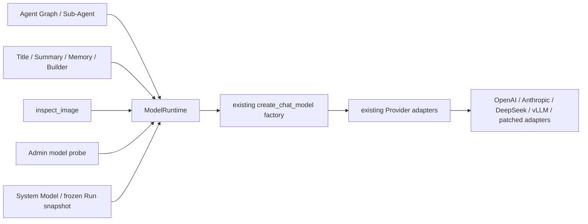
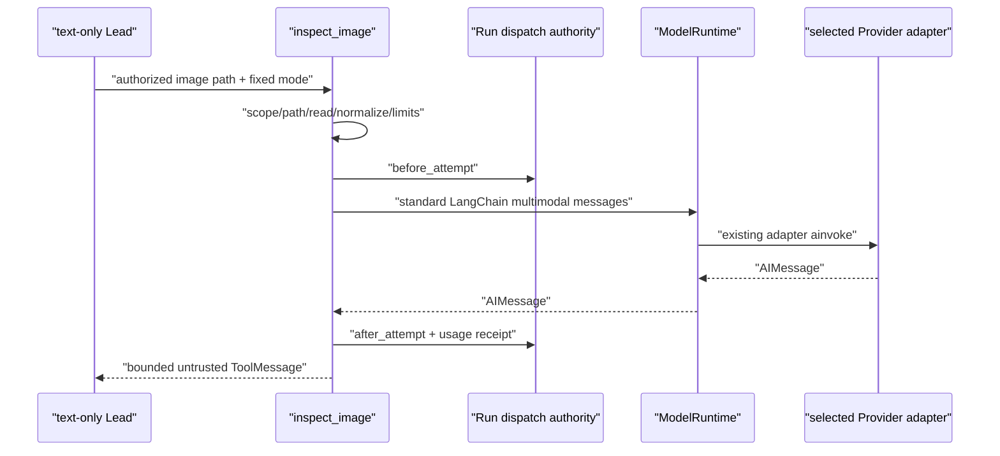

# Vision Bridge 架构收敛改造方案

> 状态：统一调用架构和主要生产路径已实现；当前目标数据库的 legacy 引用只读盘点为
> 0，旧专用 Provider client 已删除；OpenAI Responses 真实视觉调用、完整后端/前端测试和
> 浏览器端 text-only lead 到 `inspect_image` 的端到端链路已验证。其他计划启用的真实
> Provider 仍需各部署环境单独验收。
> 旧版 Bridge 专用协议、`vision.evidence.v1` 和历史实现背景见
> [TEXT_MODEL_VISION_BRIDGE_PLAN.md](TEXT_MODEL_VISION_BRIDGE_PLAN.md)。

本文是当前方案和实施状态的唯一说明。核心结论是：

> Vision Bridge 不是 Provider adapter，也不是第二套模型调用系统。
> `inspect_image` 使用所选系统多模态模型已有的 Provider adapter，并与 Agent、Builder、
> Title、Memory 和管理端探针共同经过唯一的 `ModelRuntime`。

本文使用以下状态：

- **已实现**：当前生产调用链已经采用，且有聚焦测试覆盖；
- **待验证**：实现已存在，但尚缺当前 checkout 的完整环境或真实 Provider 证据；
- **兼容读取**：只为历史持久化数据读取保留，不是可调用的 adapter 或新写契约。

## 1. 已确认的架构边界

当前实现遵守以下边界：

- System Model、不可变模型版本、Credential 和 Runtime Policy 的权威来源仍是
  PostgreSQL；
- 所有生产 Provider 模型构造都经过 `deerflow.models.ModelRuntime`；独立单次调用由
  `ModelRuntime.ainvoke()` 执行，已绑定或 graph 内辅助 Runnable 由
  `ainvoke_runnable()` / `invoke_runnable()` 执行；LangGraph 主图和有状态 tool loop 使用
  Runtime 构造的模型，由各自 orchestration 执行 streaming、tool binding 和 checkpoint；
- Provider SDK、Endpoint、认证、请求序列化和响应解析继续由已有 Provider adapter
  负责；
- `inspect_image` 不解析 adapter 名称，不选择 Chat Completions 或 Responses，也不构造
  Provider URL、headers 或原始 HTTP body；
- Vision Bridge policy 继续选择系统模型 UUID，Run 准入继续冻结
  `purpose="vision"` 的精确模型版本和 Credential 引用；
- `inspect_image` 只负责图片授权、读取与规范化、固定任务提示、调用编排、结果限额和
  安全 ToolMessage；
- 原生视觉 lead model 继续使用 `view_image`，不会同时注册 `inspect_image`；
- `vision_openai_compatible_v1` 不在生产 registry，`vision_bridge_fake` 只允许作为测试依赖；
- 本次改造不增加模型用途字段，也不拆分 Agent Builder generation model 与 Agent
  runtime model。

“任意视觉模型可选”的准确含义是：当前版本 active、使用仍可新绑定的通用 adapter，且
声明 `supports_vision=true` 的系统模型都可以被 Vision Bridge policy 选择。模型名称、厂商
或 Luna 身份都不是门禁；Luna 只是新安装的默认选择。

管理员仍应对目标模型执行多模态连接测试。该测试是部署验证，不是另一个 Provider
adapter、用途字段或可由管理员伪造的能力契约。

## 2. 当前架构：唯一 ModelRuntime



`ModelRuntime` 位于 `deerflow.models.runtime`。当前公共调用面是：

```python
runtime = ModelRuntime(app_config=runtime_app_config)

model = runtime.build_chat_model(
    profile=ModelRuntimeProfile.AGENT_GRAPH,
    model_name=model_ref,
)

message = await runtime.ainvoke(
    messages,
    profile=ModelRuntimeProfile.SENSITIVE_MULTIMODAL,
    model_name=vision_model_ref,
    deadline_monotonic=deadline,
    abort_event=server_abort,
)

# graph 内已绑定/辅助 Runnable；同步入口只允许 AGENT_GRAPH profile
message = await ModelRuntime.ainvoke_runnable(
    bound_model,
    prompt,
    profile=ModelRuntimeProfile.AGENT_GRAPH,
    config=parent_runnable_config,
    abort_event=server_abort,
)
```

`create_chat_model()` 仍是已有 Provider factory，但已经收进 `ModelRuntime` 边界。生产业务
模块不再直接调用它；架构测试会扫描 `backend/app` 和 harness production package，阻止
新的直接导入或调用。

### 2.1 闭合调用 profile

Runtime 只接受平台定义的闭合 profile：

| Profile                | 用途                                                                           | 中央策略                                                                             |
| ---------------------- | ------------------------------------------------------------------------------ | ------------------------------------------------------------------------------------ |
| `AGENT_GRAPH`          | lead、subagent、Title、Summary、Skill Builder、embedded client                 | graph root 负责 tracing，Provider 内部重试关闭                                       |
| `PRIVATE_ONESHOT`      | Builder 设计生成、Goal evaluator、输入润色、建议、Memory Dream、Skill 安全扫描 | 禁内容 tracing，保留受限 one-shot 重试                                               |
| `SENSITIVE_MULTIMODAL` | `inspect_image`                                                                | 禁 inherited/model tracing，Provider 内部重试为 0，服从 Run deadline 和 server abort |
| `ADMIN_PROBE`          | 管理端模型连接测试                                                             | 禁 tracing 和 Provider 内部重试，一次受限探针调用                                    |

业务调用方不能传入任意 tracing 或重试策略。`ModelRuntime` 统一把 profile 转换成 factory
override，并在 `ainvoke()` 周围处理绝对 deadline、异步取消和任务回收。非 graph profile
即使调用方未提供更严格的业务 deadline，也由 Runtime 应用 600 秒总上限；该值与当前系统
模型的标准 Provider 请求时限一致，不会把已有的 120 秒 Builder、20 秒连接探针或
`inspect_image` Run deadline 放宽，调用方提供的绝对 deadline 始终优先。

同步 `invoke_runnable()` 仅服务 LangGraph 的同步 middleware 路径，并且只接受
`AGENT_GRAPH`。需要 Runtime 自有 deadline、callback 隔离或可取消 Provider task 的
profile 必须走异步入口；实现不会用 `asyncio.run()` 嵌套事件循环，也不会把同步 Provider
调用遗留在不可回收的后台线程中。

### 2.2 已迁移的模型调用

以下生产路径已使用同一个 Runtime：

- lead model 和 output-limit recovery model；
- delegated Sub-Agent；
- Title、Summarization 和 Goal evaluator；
- embedded `DeerFlowClient`；
- Agent/Skill Builder 设计生成和 Skill Builder Agent graph；
- Memory Dream 和 Skill security scanner；
- Gateway database-backed one-shot 调用；
- 管理端文本/多模态连接探针；
- `inspect_image`。

`run_oneshot_llm()` 继续作为 Prompt 与文本提取便利函数存在，但其模型调用已经委托给
`ModelRuntime`。

## 3. `inspect_image` 的当前生产调用链



### 3.1 Provider-neutral multimodal message

工具发送 LangChain 标准多模态 content block，而不是 Provider 原始 body：

```python
[
    SystemMessage(content=INSPECT_IMAGE_SYSTEM_PROMPT),
    HumanMessage(
        content=[
            {"type": "text", "text": fixed_mode_prompt},
            {
                "type": "image",
                "base64": normalized_base64,
                "mime_type": normalized_mime_type,
            },
        ]
    ),
]
```

同一个 block 由现有 LangChain adapter 分别序列化为 OpenAI Chat、OpenAI Responses、
Anthropic Messages 或其他已支持 Provider 的请求。Bridge 不知道也不判断具体 wire
protocol。

### 3.2 工具只拥有领域安全责任

`inspect_image` 保留：

- private Run scope 和安全虚拟路径校验；
- 有界读取、图片魔数/格式验证和规范化；
- 固定的 system prompt 与六种 mode；
- Run 剩余 deadline 和 server abort 传递；
- durable dispatch `before_attempt` / `after_attempt`；
- `AIMessage` 唯一文本、refusal、tool call、finish reason 和 usage 校验；
- 确定性限长、错误映射和 inline-only ToolMessage；
- 把视觉文本明确标记为不可信数据。

Provider 终态元数据使用闭合判定：OpenAI Responses 只接受
`status=completed`，OpenAI Chat 只接受 `finish_reason=stop`，Anthropic 只接受
`stop_reason=end_turn|stop_sequence`。为兼容不提供终态元数据的合法 LangChain fake/adapter，
三个键全部缺失时仍可按正文合同继续校验；任一键一旦出现，未知值、空值、截断、工具调用或
`pause_turn` 等可继续状态一律失败关闭，拒答/内容过滤映射为内容阻断。

它不再拥有：

- Provider adapter 或 protocol resolver；
- Chat Completions / Responses client；
- Provider URL、认证头、HTTP payload 或 response parser；
- 独立于 Runtime 的 tracing、SDK retry 或 timeout 体系。

### 3.3 v2 结果

新调用由服务端把普通 `AIMessage` 文本包装为：

```json
{
  "ok": true,
  "schema_version": "inspect_image.result.v2",
  "content_type": "untrusted_image_analysis",
  "mode": "describe",
  "text": "有界的视觉模型文本",
  "truncated": false
}
```

成功正文经过 neutralize 和 output-budget 保护。空结果、refusal、tool call、无法接受的结束
原因或 Provider 异常只产生服务端控制的稳定错误，不把 Provider body 暴露给模型、日志或
公共 API。

`vision.evidence.v1` 只为历史 checkpoint/ToolMessage 双读兼容保留；新
`inspect_image` 调用写 `inspect_image.result.v2`。

## 4. System Model、选择器与连接探针

管理端“添加模型”只允许通用 Provider adapter：

- `openai`；
- `patched_openai`；
- `anthropic`；
- `deepseek`；
- `patched_deepseek`；
- `vllm`。

系统运行策略保存系统模型 UUID，不保存 Provider protocol。写入 Vision Bridge 选择时，
后端验证：

1. 当前系统模型为 active；
2. current version 的 adapter 仍可用于新绑定；
3. current version 声明 `supports_vision=true`。

公共模型目录的 `supports_vision_bridge` 是 `supports_vision` 的兼容投影，不是第二个独立
能力开关。

管理端连接测试也经过 `ModelRuntime`。普通模型发送文本探针；声明视觉能力的模型发送平台
生成的 64×64 PNG 和固定问题。探针使用相同 Provider adapter，不读取项目图片或会话数据。
探针成功只证明当次连接与多模态请求可用；完整质量、限流和供应商数据政策仍需目标环境
验收。

## 5. 冻结快照与 durable authority 保持不变

统一 Provider 调用没有放宽原有治理：

- text-only lead 且 policy 选择视觉模型时，Run 准入冻结精确
  `purpose="vision"` snapshot；
- native vision lead 不冻结辅助 vision snapshot；
- Worker 只使用准入 snapshot 物化出的隔离 `AppConfig`，工具参数不能更换模型、Endpoint
  或 Credential；
- retry/resume 使用同一冻结模型版本，不读取当前默认模型作为回退；
- 每次可能外发前由 durable authority 重验 Run/Job lease、模型与 Credential 状态并预留
  资源；
- 调用结束后以 usage receipt 结算；已外发但无法确定结果的调用保持
  `usage_unknown=true`，不自动重放；
- 暂停模型或撤销 Credential 会阻断后续调用，但不能召回已经在途的请求。

`vision.bridge.v1` 仍作为现有 Runtime Policy/Run snapshot 的控制契约版本保留。它不再
表示 OpenAI 专用 wire protocol，也不要求 Provider 生成 ActWeave 自定义 evidence JSON。

## 6. Legacy adapter 状态

### 已实现

- legacy adapter ID 没有生产 descriptor/class path，不能新建、更新、重新激活、设为默认、
  绑定新的 Runtime Policy 或物化执行；
- 管理端写契约和“添加模型”下拉框不再展示两个 `vision_*` adapter；
- 历史未知 provider 字符串可由管理端只读展示，但不进入可写 selector；
- `vision_bridge_fake` 不在生产 builtin adapter registry，只能由测试进程显式注入；
- 新 `inspect_image` 和管理端 probe 都不调用 `build_vision_evidence_client()` 或
  `deerflow.vision.openai_compatible`；旧 `vision/client.py`、`compatibility.py`、
  `openai_compatible.py` 和对应专用协议测试已物理删除；
- 当前目标数据库只读盘点中，legacy versions、current/active/default models 和 Run
  snapshots 均为 0。

`vision.evidence.v1` 的纯 ToolMessage 解析仍保留，用于历史 checkpoint 双读；这不是 Provider
adapter 或调用协议。其他部署升级前仍必须做同样的只读 legacy 引用盘点；若存在引用，应先
按不可变版本规则迁移或完成旧 Run，不能原地改写历史版本。

## 7. 明确不做的模型体系改造

本次不改变 Agent Builder 和 Chat 的既有模型语义：

- Builder 对话继续使用 `generation_model_ref`；
- 生成的 Agent 蓝图继续使用 `blueprint.model_ref`；
- Agent runtime 继续从已发布 Agent 版本和 Run admission 取得模型；
- 不新增通用 `purpose`、用途数组或按用途拆分的公共模型 API；
- selector 只执行各自现有业务过滤，不形成各模块自己的 adapter/factory。

“统一 ModelRuntime”统一的是 Provider 构造和调用 profile；数据库锁、Run snapshot 与
Credential 解密仍由 app 层各自的授权边界负责。它不是把所有业务 Prompt、tool graph、
checkpoint 或结果 Schema 合并成一个业务函数，也不是绕开 LangGraph 的中央 HTTP 代理。

## 8. 当前实施状态

| 工作项                                         | 状态             | 当前事实                                                        |
| ---------------------------------------------- | ---------------- | --------------------------------------------------------------- |
| 唯一 `ModelRuntime` 与闭合 profile             | 已实现           | graph、私有 one-shot、敏感多模态和 admin probe 共用一个实现     |
| 普通模型调用点迁移                             | 已实现           | production 不再直接调用 `create_chat_model()`；架构测试防回退   |
| `inspect_image` 使用已有 adapter               | 已实现           | 发送标准 LangChain 图片 block，接收普通 `AIMessage`             |
| `inspect_image.result.v2`                      | 已实现           | 服务端包装、限长、neutralize；v1 仅双读                         |
| 管理端多模态 probe                             | 已实现           | 使用同一 Runtime 和平台合成图片                                 |
| legacy adapter 删除                            | 已实现           | legacy 无生产 descriptor/class path，fake test-only             |
| frozen vision snapshot                         | 已实现           | `purpose="vision"` 和精确版本/Credential 语义保留               |
| durable dispatch/settlement                    | 已实现           | 调用前后 authority 与 usage receipt 保留                        |
| OpenAI Chat/Responses、Anthropic block 序列化  | 已实现的单元证据 | 现有 adapter conformance test 覆盖这三种请求形态                |
| DeepSeek、patched adapter、vLLM 真实多模态调用 | 待验证           | 需要目标 Provider/endpoint staging，不根据 adapter 名称推断质量 |
| 当前数据库 legacy 引用盘点                     | 已验证           | versions/current/active/default/Run snapshots 均为 0            |
| 全量 PostgreSQL、前端和浏览器深度回归          | 已验证           | 后端临时 PostgreSQL 全量、前端全量及真实浏览器主链路均通过      |
| 旧专用 HTTP/client 文件删除                    | 已实现           | client、protocol resolver、response parser 及专用测试均已删除   |

当前浏览器主链路使用 text-only DeepSeek lead 与所选 GPT 5.6 Luna
OpenAI Responses 视觉模型，实际只调用一次 `inspect_image`，生成
`inspect_image.result.v2`，并在持久化 Run 中记录一次 durable dispatch reserve 和一次
`vision.usage`。这证明的是该目标环境中的真实链路，不代表尚未 staging 的 DeepSeek、patched
adapter 或 vLLM 多模态 endpoint 已通过。

## 9. 验收矩阵

最终交付至少需要以下当前 checkout 证据。

### ModelRuntime

- production AST 门禁证明 Runtime/factory 外没有 `create_chat_model()` 调用；
- graph model 保留 streaming、tool binding、callbacks、usage 和 checkpoint 行为；
- private one-shot 的 tracing 策略不会泄露私有 Prompt；
- sensitive/admin profile 清空 inherited callbacks，Provider 内部重试为 0；
- deadline、server abort 和 caller cancellation 都能取消并回收 Provider task。

### 多模态与工具

- OpenAI Chat、OpenAI Responses、Anthropic 以及计划启用的其他 adapter 均验证标准图片
  block；
- `auto`、`describe`、`ocr`、`document`、`chart`、`ui` 六种 mode；
- 空响应、refusal、tool call、超长文本、Provider timeout、取消和未知 usage；
- 非图片、越权路径、过大图片、像素超限和规范化失败；
- text-only lead、native vision lead、未选择 Bridge、模型暂停、Credential 撤销、lease
  丢失和 retry/resume；
- ToolMessage 为合法有界 v2 JSON，且图片内容、路径和完整视觉正文不进入日志、审计或
  tracing。

### 管理端与历史

- 添加模型下拉框只展示通用 active adapters；
- 未知历史 provider 字符串可读，但没有 descriptor 时不能重新激活、设为默认或新绑定；
- 任意 active + `supports_vision=true` 的可绑定模型能进入 Bridge selector；
- 文本和多模态连接探针都经过同一 Runtime；
- 旧 v1 ToolMessage 仍能读取，新调用只写 v2；
- 桌面和移动布局、成功/失败/取消状态及多会话隔离通过浏览器验证。

## 10. 最终完成标准

架构改造只有在以下条件同时满足后才能标记完成：

1. 所有生产模型调用经过唯一 `ModelRuntime`；
2. 新 `inspect_image` 不进入任何 Bridge 专用 Provider client；
3. 添加模型不存在 `vision_*` 专用选项，fake 只能由测试注入；
4. 任意 active、`supports_vision=true` 且 adapter 可新绑定的系统模型都能被选择；
5. v2 不可信 ToolMessage、frozen vision snapshot、durable dispatch、取消和 usage 边界均无
   回归；
6. Agent Builder 与 Agent runtime 既有模型语义未被顺带重构；
7. 目标数据库 legacy 引用已盘点并按不可变版本规则处理；
8. 聚焦测试、完整后端与 PostgreSQL、前端、浏览器和批准的真实 Provider staging 都有
   当前 checkout 证据；
9. 旧专用 HTTP/client 不存在，部署前 legacy 引用盘点不依赖自动改写历史数据。
