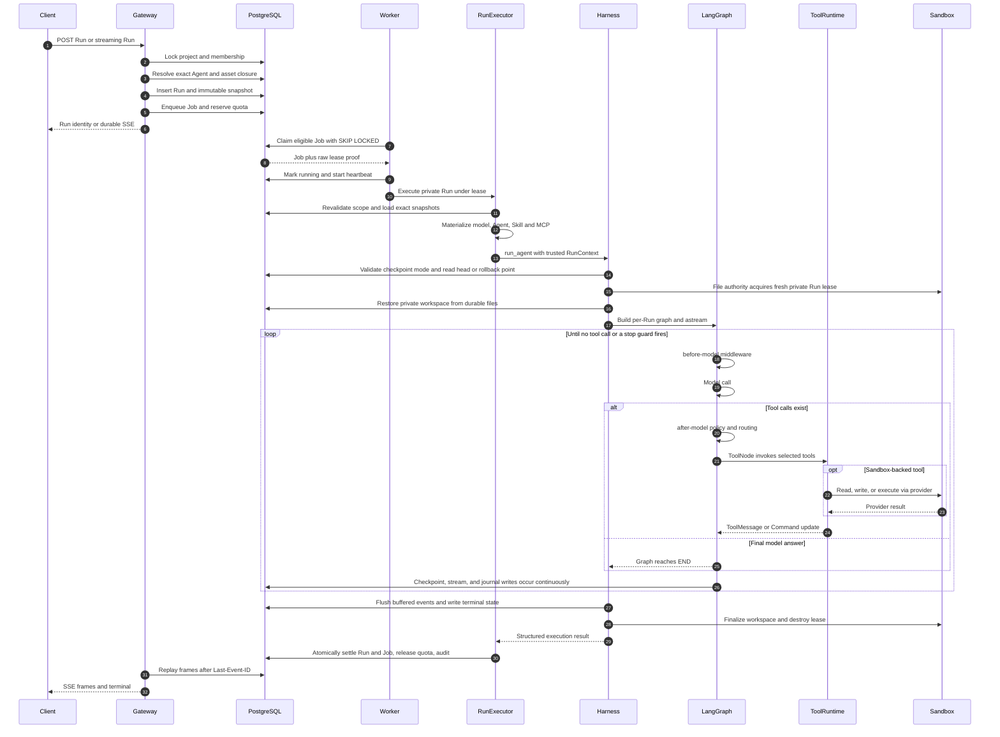
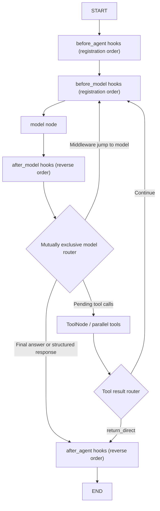
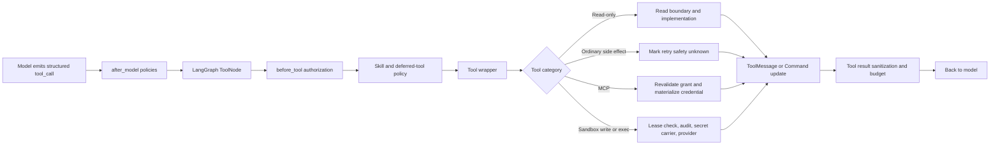
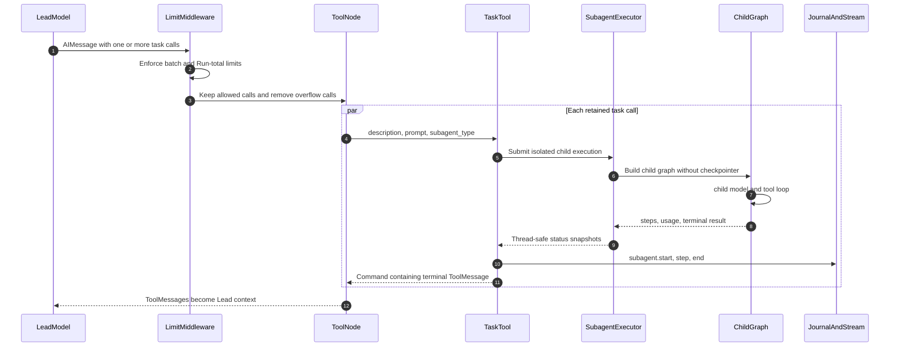

# ActWeave Agent Harness 全链路执行分析

> 分析基线：`dev` 分支，提交 `105d7e1f6fd14741aa742bbee7e80e82b73c97d8`，2026-08-01。
>
> 分析范围：生产多租户 Project Run 主链路，覆盖 Gateway 准入、Worker 租约、Harness/LangGraph、工具调用、命令与 Sandbox、Skill/MCP、Subagent、持久化、流式输出和故障恢复。
>
> 方法：静态源码审计，并以仓库锁定依赖和针对性测试作为交叉验证。本文中的“private Run”指服务端认证、项目/所有者隔离的生产 Run，不是 Python 可见性概念。

## 0. 执行摘要

ActWeave 的生产 Agent 不是“HTTP 请求里直接调用一个模型”，也不是一个简单的 `while model -> tool` 循环。它是一个由数据库准入、租约执行、每 Run 精确物化、状态图循环和多重副作用边界共同组成的 durable runtime：

```text
Gateway 事务准入并冻结 Run 世界
  → PostgreSQL durable Job
  → Worker 领取带 lease 的 Job
  → RunAgentPrivateExecutor 恢复精确策略、模型、Agent、Skill、MCP 和权限
  → run_agent 构造本 Run 独立 LangGraph
  → middleware → model → ToolNode → middleware 循环
  → checkpoint、durable stream、journal、文件最终化
  → Run/Job/额度/审计事务收口
```

最重要的结论有十二条：

1. **只有 Worker 执行 Agent graph。** Gateway 负责认证、事务准入、查询和 durable SSE；Scheduler 只准入到期 Automation，不执行图。
2. **一次 Run 执行的是准入时冻结的世界。** 模型、Agent 版本、Prompt、tool groups、Skill/MCP 版本、grant、Credential 引用和数据库运行策略都被精确快照；执行时不允许用“当前默认值”悄悄替换。
3. **生产 graph 按 Run 构造。** 它绑定 project/owner scoped checkpointer、授权对象、文件权限和精确资产，不是跨项目共享的可变 graph 单例。
4. **模型不会直接执行命令。** 模型只输出结构化 tool call；LangGraph `ToolNode` 调用注册工具，`bash` 工具再经过授权、审计、secret 注入和 Sandbox provider。
5. **工具集合是动态的。** YAML 工具、内建工具、精确 MCP、Skill policy 和 deferred `tool_search` 共同决定每一轮真正 `bind_tools` 给模型的 schema。
6. **Sandbox 是 provider 抽象，不等于所有 provider 都有安全隔离。** 默认 `LocalSandboxProvider` 提供路径映射和私有文件权威，但宿主 bash 明确不是安全隔离边界，默认关闭。
7. **生产 private workspace 是 Run 级新鲜 lease。** 开始时从 PostgreSQL 文件对象恢复，结束时扫描、校验、分块提交；精确 Skill 以只读 Run mount 注入。
8. **Subagent 是 `task` 工具内的隔离子图，不是独立服务或独立 Job。** 它共享父 Run 的受控 Sandbox/权限/精确资产，拥有独立上下文和 graph、没有独立 checkpointer；标准内建配置禁止递归委派，所有 child 共用一个与父 loop 隔离的 executor loop。
9. **授权不是只在入口检查一次。** 模型调用、工具、MCP、Sandbox 写/执行、checkpoint、stream 和文件最终化前都会结合成员资格与当前 Job lease 重新校验。
10. **至少有五类持久状态，不能混为一谈：** Run/Job、LangGraph checkpoint、durable stream、journal/read model、private files/artifacts。
11. **崩溃恢复以副作用可判定性为前提。** 一旦执行过普通工具、MCP、Sandbox 写或命令，lease 失效后的副作用状态会标为 unknown，系统宁可失败也不盲目重放。
12. **配置生效边界分层。** Sandbox、数据库、Worker、checkpoint mode 等启动基础设施需要重启；数据库 Agent Runtime Policy 对新 Run 生效且在准入时冻结；已准入 Run 不随后台设置变化而漂移。

## 1. 代码分层与责任边界

### 1.1 生产进程拓扑

根启动脚本会拉起 Gateway、必需的 Worker、可选 Scheduler、Frontend 和 Nginx；后端角色通过 `run_runtime.py` 导入非 provider 环境变量、移除 ambient 模型 provider key，再 `exec` 到具体进程：

- 根命令编排：[Makefile](../Makefile#L171-L184)、[serve.sh](../scripts/serve.sh#L562-L593)
- 后端角色命令：[backend/Makefile](../backend/Makefile#L3-L18)
- 角色环境装配：[run_runtime.py](../backend/scripts/run_runtime.py#L37-L78)

| 进程 | Agent 执行职责 | 主要职责 |
| --- | --- | --- |
| Gateway | **不执行 graph** | 认证、项目/成员授权、Run 事务准入、查询、取消入口、durable SSE replay |
| Worker | **唯一 graph executor** | Claim Job、持有 lease、物化精确 Run、调用 Harness、提交终态 |
| Scheduler | **不执行 graph** | 找到到期 Automation，原子准入 occurrence、Run、snapshot、Job |
| Harness `deerflow.*` | 被 Worker 调用 | Agent 构图、中间件、工具、Sandbox 抽象、Subagent、checkpoint/stream 驱动 |
| App `app.*` | 生产业务与授权层 | PostgreSQL repository、准入、精确资产、租约、配额、审计、文件权威 |

模块依赖方向是 `app.* -> deerflow.*`。Harness 通过协议和受信 context 接收 app 提供的授权、文件、Memory 和精确资产能力，不能反向依赖业务层。生产适配器入口是 [RunAgentPrivateExecutor](../backend/app/reliability/execution.py#L1033)，Harness 主驱动是 [run_agent](../backend/packages/harness/deerflow/runtime/runs/worker.py#L594)，Lead graph 工厂是 [make_lead_agent](../backend/packages/harness/deerflow/agents/lead_agent/agent.py#L523)。

### 1.2 两个“命令执行”概念

本项目里“命令如何执行”有两层含义：

- **服务进程命令**：`make dev/start` 由 shell 编排 Gateway/Worker/Scheduler 等 OS 进程。
- **Agent 生成的 shell 命令**：模型发出 `bash` tool call，最终由 Sandbox provider 的 `execute_command()` 执行。

二者没有直接捷径。HTTP 请求不会将用户文本拼成宿主 shell；Agent 命令必须先经过模型结构化输出、ToolNode、授权/策略和 Sandbox 工具链。

## 2. 端到端主时序



这条链路包含三个不同粒度的循环：

1. **Worker 外循环**：持续 claim Job、续租、执行、settle。
2. **Run 外层循环**：一次正常 graph invocation 完成后，durable goal evaluator 最多可触发隐藏 continuation。
3. **LangGraph 内循环**：`model -> tools -> model`，直到无 tool call 或 guard 强制结束。
4. **Subagent 内循环**：每个 `task` 工具内部又运行一个无 checkpointer 的独立子 graph。

## 3. Gateway：事务准入而非图执行

### 3.1 HTTP 输入清洗

创建 Run 和创建流式 Run 都先进入 Gateway private work router；HTTP runtime 会：

- 建立/清洗持久化 config；
- 保留 graph input 或服务端支持的 `Command`；
- 规范化 stream modes；
- 生成 `origin_trace_id`；
- 把调用交给统一准入服务。

入口见 [private_work.py](../backend/app/gateway/routers/private_work.py#L1321-L1371) 和 [http_runtime.py](../backend/app/private_work/http_runtime.py#L46-L126)。

### 3.2 一个事务冻结 Run 世界

准入过程在一个数据库事务中完成，核心步骤见 [run_admission.py](../backend/app/private_work/run_admission.py#L320-L538)：

1. 必须存在 server-issued account/project/membership/owner context；客户端不能自报这些私有字段。
2. 按固定顺序锁 Project 和 Membership，再验证 inbound authority/thread。
3. 处理幂等键和同线程冲突的 active Run。
4. 解析精确 Agent 版本及其模型、Prompt、tool groups。
5. 创建 Run 和不可漂移的 Run snapshot。
6. 创建 durable Job，并把 Job 关联回 Run。
7. 预留项目额度。
8. 写入审计记录并提交。

snapshot 不只是保存一个 agent ID。它展开并校验完整闭包：

- 精确模型版本和模型配置；
- 数据库 Agent Runtime Policy；
- Agent 版本、Prompt、tool groups；
- Skill 版本/checksum；
- MCP 版本、工具和 grant；
- Skill/MCP Credential **引用**，而非明文 secret；
- 安全、递归、流式等服务端准入结果。

见 [snapshot_repository.py](../backend/app/private_work/snapshot_repository.py#L450-L732)。因此管理员在 Run 准入后修改默认模型、禁用 Skill 或调整 runtime policy，不会让这次 Run 中途换世界；需要影响的是之后的新 Run。

## 4. Worker：Job lease、并发与 settle

### 4.1 Claim 与租约

Worker 初始化 PostgreSQL、checkpointer/store、durable event store、`RunAgentPrivateExecutor` 和 Job handlers，然后进入容量驱动的轮询循环，见 [worker/app.py](../backend/app/worker/app.py#L61-L209)。

Job claim 使用 `FOR UPDATE SKIP LOCKED`，按 priority/available time 选择任务；在 claim 中仍遵守 Project -> Membership 的锁顺序，并处理过期 lease 和 retry safety。数据库只保存 lease token 的 hash，raw lease proof 只返回给当前 Worker，见 [jobs/sql.py](../backend/packages/harness/deerflow/persistence/jobs/sql.py#L515-L703)。

`WorkerService` 为每个已领取任务并行运行 handler 与 heartbeat：

- heartbeat 保持 lease；
- lease 丢失时取消 handler；
- handler 结束后 settle；
- 按配置并发数补满空位；
- shutdown 时停止新 claim，并有界等待/回收当前任务。

见 [worker/service.py](../backend/app/worker/service.py#L251-L418)。

### 4.2 执行前恢复与执行后收口

`PrivateRunJobHandler` 的 `_begin()` 会重新验证项目、成员资格和 capability，加载精确 snapshot，并判断是否存在可恢复 checkpoint 或已写入的 durable terminal，见 [execution.py](../backend/app/reliability/execution.py#L1501-L1900)。

执行完成后，settlement 在事务中同步完成：

- Run terminal 状态；
- Job terminal 状态；
- quota release；
- 审计；
- 失败分类及 retry/dead 判定。

这避免“Run 成功但 Job 仍 running”或“额度永远占用”等跨表撕裂。

## 5. RunAgentPrivateExecutor：App 与 Harness 的生产边界

`RunAgentPrivateExecutor._execute_with_trace()` 是生产 private Run 的唯一适配层。它在 Harness 构图前恢复准入时冻结的世界：

1. 校验 Job claim 与 Run 的 trace、project、owner、lease authority。
2. 从 snapshot 物化精确数据库运行策略和模型；缺失、漂移或不可解析时 fail closed。
3. 物化精确 Agent、Skill、MCP、grant 和 Credential 引用闭包。
4. 建立只读 Skill mount、private file authority、private Memory authority。
5. 创建 project/owner scoped checkpointer 和 lease-authorized event store。
6. 创建 `PrivateRunExecutionBoundary`，将成员授权和 Job lease 合并为统一副作用门卫。
7. 绑定 owner/project ContextVars，构造 `RunContext` 并调用 `run_agent()`。
8. 不论成功或失败，都清理 private runtime、临时 Skill tree 和文件 authority。

关键源码：

- 策略与模型物化：[execution.py](../backend/app/reliability/execution.py#L1178-L1287)
- 文件、Memory、checkpointer 与 RunContext：[execution.py](../backend/app/reliability/execution.py#L1289-L1381)
- 调用 Harness 与结果映射：[execution.py](../backend/app/reliability/execution.py#L1382-L1498)
- 精确资产物化：[asset_runtime.py](../backend/app/private_work/asset_runtime.py#L1630-L1857)

### 5.1 三类 graph 输入

适配器把输入规范化为三种形式，见 [execution.py](../backend/app/reliability/execution.py#L1113)：

- checkpoint takeover/resume：graph input 为 `None`，从已持久化状态继续；
- 已准入 `command`：转成 LangGraph `Command`；
- 普通 turn：深拷贝后把 message dict 转成 LangChain message。

客户端不能通过 config 覆盖受信 `project_id`、`owner_user_id`、`run_id`、授权对象、精确工具或 secret provider；这些只由 Worker 注入。

## 6. `run_agent()`：一次 Run 的完整生命周期

`run_agent()` 远不只是 `await graph.astream()`。其生命周期可以分为七个阶段。

### 6.1 前序最终化与 journal

- 等待同一 thread 上一次 private 文件最终化完成，避免两个 Run 争用投影目录；
- 创建 RunJournal，标记 running；
- 注入 Worker 决定的 checkpoint mode、root namespace 和 thread ID；
- 拒绝与当前 checkpoint mode 不兼容的历史 selector。

见 [worker.py](../backend/packages/harness/deerflow/runtime/runs/worker.py#L594-L895)。

### 6.2 工作区与 rollback point

- 捕获精确 pre-run checkpoint，作为兼容 rollback 基点；
- private Run 从 PostgreSQL 文件记录恢复 `workspace/uploads/outputs`；
- 非 private/嵌入式路径使用兼容 workspace snapshot；
- 发布初始 SSE metadata。

### 6.3 受信 Runtime Context

`RunContext` 携带服务端身份和能力：[worker.py](../backend/packages/harness/deerflow/runtime/runs/worker.py#L370-L393)。随后 `_build_runtime_context()` 将这些能力变成 `ToolRuntime` 可读取、但客户端不能伪造的 context：

- project/owner/run/thread scope；
- authorization boundary；
- file/memory authority；
- exact prompt/skill/MCP；
- Skill secret provider；
- readonly mounts；
- stream/journal callbacks。

见 [worker.py](../backend/packages/harness/deerflow/runtime/runs/worker.py#L290-L350) 和 [worker.py](../backend/packages/harness/deerflow/runtime/runs/worker.py#L896-L1032)。

### 6.4 每 Run 构图

Harness 在线程池中调用 Lead graph factory，随后把 project-scoped saver/store 绑定到本 Run graph。生产 graph 不是带可变 saver 的全局单例，这一点是租户隔离的关键。

### 6.5 流式执行

`_stream_once()` 调用 `agent.astream()`，支持 `values`、`updates`、`checkpoints`、`tasks`、`debug`、`messages` 和 `custom`；API 的 `messages-tuple` 会映射到 LangGraph 的 `messages`。`events` 不是有效 `astream` mode，会被跳过。多 mode 或 `subgraphs=True` 时，它解析 `(namespace, mode, chunk)`，child namespace 不会伪装成 root 消息。见 [worker.py](../backend/packages/harness/deerflow/runtime/runs/worker.py#L1128-L1280)。

大 `write_file`/`str_replace` 参数 delta 会批处理；Subagent custom step event 也先有界缓冲后批量持久化，避免 stream 热路径产生过多小事务。

### 6.6 Goal 外层 continuation

图到达 END 不一定立即结束 Run。如果 thread 有 durable goal，Worker 会读取最新 checkpoint，用独立 evaluator 判断是否完成；只有 `goal_not_met_yet` 才会追加隐藏 HumanMessage 并再调用一次 `astream()`：

- 最多 8 次 continuation；
- 相同可见 assistant 证据连续 2 次无进展即停止；
- `missing_evidence`、`needs_user_input`、`run_failed`、`external_wait` 不自动继续；
- 每次 continuation 清除旧 checkpoint selector，接最新 root checkpoint；
- 更新 goal 使用 expected checkpoint ID 和 thread lock，用户竞争更新优先。

见 [goal.py](../backend/packages/harness/deerflow/runtime/goal.py#L33-L357) 和 [worker.py](../backend/packages/harness/deerflow/runtime/runs/worker.py#L1262)。这与提高 `recursion_limit` 不同：它是在一次图调用完全结束后启动下一次隐藏 invocation。

### 6.7 终态与清理

graph 流结束后仍要完成：

- 根据 abort、authorization、LLM fallback 和正常结束计算 provisional status；
- finalize 或销毁 private workspace；
- 要求本轮新建/修改的 `outputs/` 文件通过可信 `present_files` 形成 current-run artifact；
- flush Subagent events、workspace changes、journal 和 token usage；
- 清理 private runtime、Skill 临时树、file authority、mount；
- 清理失败可把 provisional success 降级为 error；
- 只有最终 success 才同步 thread title；
- 发布 durable terminal。

见 [worker.py](../backend/packages/harness/deerflow/runtime/runs/worker.py#L1282-L1603)。

## 7. Lead Agent 构图与真实 LangGraph 拓扑

### 7.1 `_make_lead_agent()` 做了什么

Lead factory 会：

1. 冻结 process-wide checkpoint mode 和 delta snapshot frequency；
2. 合并 request configurable 与受信 runtime context，后者优先；
3. 解析 thinking/reasoning/model/plan/subagent；
4. private Run 强制关闭 plan mode；
5. 只有 admitted Agent tool groups 含 `task` 才打开 Subagent，private 单批并发固定为 3；
6. 精确解析冻结模型，private 路径不允许静默 fallback；
7. 组装 builtin、YAML、Memory、exact MCP、Skill、deferred 工具；
8. 构造系统 prompt、ThreadState schema 和 middleware；
9. 调用 LangChain `create_agent()` 编译图。

见 [agent.py](../backend/packages/harness/deerflow/agents/lead_agent/agent.py#L523-L802)。仓库锁定 LangChain 1.3.14、LangGraph 1.2.9；版本基线见 [uv.lock](../backend/uv.lock)。

### 7.2 模型/工具循环

结合 `create_agent()` 的锁定版本语义，实际拓扑可以概括为：



几个容易遗漏的细节：

- `before_agent`/`before_model` 按注册顺序，`after_model`/`after_agent` 按逆序；
- hook 才是 graph node，`wrap_model_call`/`wrap_tool_call` 是嵌套包装，不各自生成图节点；
- 同一 AIMessage 中多个未执行 tool calls 会转成多个 `Send("tools", ...)`，由 ToolNode 并行调度；
- 工具结果通常以 `ToolMessage` 写回 state，再回到 `before_model`；
- 每轮包装器完成消息、系统提示、模型和工具过滤后，才执行 `model.bind_tools(final_tools)`；
- 因此 Skill policy/deferred promotion 改变的是模型本轮真实可见 schema，而不是 UI 装饰；
- 无 tool call 是经典自然结束条件；structured response 或 middleware `Command(jump_to=...)` 由 model router 互斥路由，而 `return_direct` 是 ToolNode 已执行工具后的退出判断。

### 7.3 ThreadState

主状态定义见 [thread_state.py](../backend/packages/harness/deerflow/agents/thread_state.py#L419-L621)，包含：

| Channel | 作用 |
| --- | --- |
| `messages` | Human/AI/Tool/System 消息历史 |
| `sandbox` | Sandbox ID、Run 关联与可恢复信息 |
| `thread_data` | workspace/uploads/outputs 的虚拟目录上下文 |
| `title` | 对话标题 |
| `artifacts` | 已可信呈现的输出文件 |
| `todos` / `goal` | 计划兼容状态与 durable goal |
| `uploaded_files` / `viewed_images` | 受作用域约束的文件/图片引用 |
| `promoted` | 与 catalog hash 绑定的 deferred tool promotion |
| `delegations` | Subagent dispatch/终态 ledger |
| `skill_context` | 有界 Skill 引用和简述，不保存 Skill 正文 |
| `summary_text` | 压缩后的持久摘要 |

Reducer 还执行安全不变量：同一 Run 不能悄悄换 Sandbox；promotion 的 catalog hash 变化即失效；delegation 终态不可回退；图片只保存 digest/引用，不持久化 base64。

checkpoint 支持 full 和 delta message channel。delta 使用 `DeltaChannel` 合并增量并周期性写 full snapshot；mode/frequency 是进程冻结配置。full 进程遇到 delta thread 会拒绝读取，而不是猜测兼容，见 [checkpoint_mode.py](../backend/packages/harness/deerflow/runtime/checkpoint_mode.py#L24)。

### 7.4 System Prompt 也是分层构造的

模型收到的 system context 不是一份固定大字符串，而是多层合成：

1. framework-owned 平台规则、工具/文件/Sandbox 使用说明；
2. admitted Agent version 的 exact profile bundle；
3. exact Skill 索引、deferred tool/MCP routing 提示和 Subagent 并发说明；
4. 每次 graph invocation 的 `DynamicContextMiddleware.before_agent` 注入/更新日期和可选 Project Memory；
5. `DurableContextMiddleware` 恢复的 summary、delegation ledger 和 Skill references；
6. 最后由 `SystemMessageCoalescingMiddleware` 合并为一个开头 SystemMessage。

exact Agent profile 可包含 `AGENTS.md`、`SOUL.md`、`IDENTITY.md`、`USER.md`，项目可配置优先级为 `AGENTS > SOUL > IDENTITY > USER`，但它们不能覆盖更高层的平台安全、授权、隔离和保密规则。Skill 索引不会预先把所有正文塞入 checkpoint；slash 激活注入也保持 request-only。不过，模型若显式用 `read_file` 读取 `SKILL.md`，完整正文会成为 ToolMessage，随 `messages` channel 进入 checkpoint，并可被 RunJournal 记录。见 [prompt.py](../backend/packages/harness/deerflow/agents/lead_agent/prompt.py#L795-L827) 和 [prompt.py](../backend/packages/harness/deerflow/agents/lead_agent/prompt.py#L886-L981)。

## 8. Middleware：执行顺序与责任

通用前半链在 [tool_error_handling_middleware.py](../backend/packages/harness/deerflow/agents/middlewares/tool_error_handling_middleware.py#L222-L352)，Lead 后半链在 [agent.py](../backend/packages/harness/deerflow/agents/lead_agent/agent.py#L278-L476)。有效注册顺序如下；after hook 的观察顺序相反。

| 顺序 | Middleware | 主要责任 |
| ---: | --- | --- |
| 1 | `InputSanitization` | 中和用户输入中的伪 system/framework/instruction 标签 |
| 2 | `ToolOutputBudget` | 大结果外置/截断，控制上下文预算 |
| 3 | `ToolResultSanitization` | 清洗 first-party web、Worker 注册的 project-private MCP、规范 upload read 等不可信结果 |
| 4 | `ThreadData` | 注入虚拟 workspace/uploads/outputs 上下文 |
| 5 | `Uploads` | 恢复上传并注入可信文件信息 |
| 6 | `Sandbox` | 普通路径首次 Sandbox 工具时懒获取；private 路径读取 file authority 已获取的 ID |
| 7 | `DanglingToolCall` | 修补没有配对 ToolMessage 的历史 tool call |
| 8 | `LLMErrorHandling` | 重试、熔断和稳定 fallback |
| 9 | `SandboxAudit` | 审查 bash 等命令并记录 digest 审计 |
| 10 | `ReadBeforeWrite`（可选） | 改已有文件前要求已读取当前内容 |
| 11 | `ToolProgress`（可选） | 跟踪工具进度、频次和阻断 |
| 12 | operator `Guardrail`（可选） | 部署方附加策略 |
| 13 | `ToolErrorHandling` | 每次模型/工具前重新授权；普通异常转稳定 ToolMessage；为可信 Skill 文件读取盖章 |
| 14 | `DynamicContext` | 每次 graph invocation 的 `before_agent` 注入/更新日期和可选 Project Memory |
| 15 | `SkillActivation` | 直接处理 `/skill-name` 激活并规划 secret sources |
| 16 | `SkillToolPolicy`（private exact Skill） | 认证已盖章的 `read_file(SKILL.md)` 证据，同时过滤模型 schema 和真实执行 |
| 17 | `DurableContext` | 恢复 summary、delegation ledger、Skill 引用 |
| 18 | `Summarization`（可选） | 超阈值压缩历史，保留尾部和 `summary_text` |
| 19 | `TodoList`（plan mode） | 计划工具；private Run 被强制关闭 |
| 20 | `TokenUsage`（可选） | 消息级 token 归因 |
| 21 | `Title` | 生成/更新标题候选 |
| 22 | `Memory` | `after_agent` 过滤对话并异步排队 Project Memory 更新；不负责注册搜索工具 |
| 23 | `ViewImage` | 清理旧 base64；视觉模型才注入图像 |
| 24 | `McpRouting`（可选） | deferred MCP 路由 |
| 25 | `DeferredToolFilter` | promotion 前隐藏 schema 并拒绝直接执行 |
| 26 | `SystemMessageCoalescing` | 合并为单个开头 SystemMessage |
| 27 | `SubagentLimit`（有 `task` 时） | 强制单批并发和 Run 总委派数 |
| 28 | `LoopDetection`（可选） | 重复工具模式预警/硬停止 |
| 29 | `TokenBudget`（可选） | Run token 预警/硬停止 |
| 30 | custom middleware | 部署方扩展 |
| 31 | `SafetyFinishReason`（可选） | 最先看到原始 safety finish reason，清理未完成 tool calls |
| 32 | `Clarification` | 最后注册；交互时用 `Command(goto=END)` 结束当前 Run，非交互时返回 ToolMessage |

`ToolErrorHandling` 的关键语义是：

- 模型调用和工具调用前都重新检查授权；
- 只把规范化的 Memory search/list uploads 等识别为 read-only；
- private MCP 有额外 dispatch boundary；
- 普通工具异常变成模型可读、已脱敏的 `ToolMessage`，模型可修正参数；
- `AuthorizationRevoked` 和 LangGraph control-flow 异常不被吞掉；
- LLM fallback 即使让图正常到 END，Worker 仍检查标记并把 Run 判为 error。

## 9. 工具系统：发现、暴露和执行

### 9.1 工具来源与去重优先级

硬编码 builtin 只有 `present_files`、`ask_clarification`、`list_uploaded_files`，按条件增加 `task` 和 `view_image`；`bash`、`ls`、`read_file`、`write_file`、`str_replace`、web 工具主要来自 YAML 反射注册。见 [tools.py](../backend/packages/harness/deerflow/tools/tools.py#L21-L174) 和 [config.example.yaml](../config.example.yaml#L17-L78)。

`get_available_tools()` 内部的同名去重优先级为：

```text
YAML configured tools > hard-coded builtins > MCP tools > ACP tools
```

YAML `module:object` 通过反射加载，且必须解析为 LangChain `BaseTool`，见 [resolvers.py](../backend/packages/harness/deerflow/reflection/resolvers.py#L25-L68)。Agent 版本的 `tool_groups` 决定哪些 configured tool group 可进入候选集；`allow_host_bash=false` 时还会移除不被允许的本地 bash。

该优先级不能泛化为 production private Lead 的最终工具表：private 路径调用 `get_available_tools(include_mcp=False, include_acp=False)` 后，才追加 Run-local exact MCP proxies 和 project Memory 工具，再交给 deferred-tool assembler；这一步没有重新应用上述名字优先级。见 [agent.py](../backend/packages/harness/deerflow/agents/lead_agent/agent.py#L699-L723)。因此 exact asset admission 应保证名称闭包无冲突；Subagent 路径遇到 private MCP 与已有工具同名则显式失败，见 [task_tool.py](../backend/packages/harness/deerflow/tools/builtins/task_tool.py#L580-L591)。

### 9.2 一次工具调用的完整路径



`PrivateRunExecutionBoundary` 把当前成员授权与 raw Job lease proof 结合起来，覆盖模型、只读工具、普通工具、MCP、Sandbox 写/执行、checkpoint、stream、finalization，见 [execution.py](../backend/app/reliability/execution.py#L768-L995)。普通副作用工具在真正执行前会把 retry safety 标为 unknown；这样 Worker 崩溃后不会误认为可安全重放。

### 9.3 Skill 激活和工具 policy

Lead 的 Skill 权限不是“Prompt 里提到了 Skill 就算激活”：

- `/skill-name` 是显式激活证据；
- 成功读取准入版本的精确 `SKILL.md` 后，`ToolErrorHandling` 为真实注册工具结果盖章，`SkillToolPolicy` 再认证为激活证据；
- 普通自然语言提及不授予工具；
- 路径、版本、checksum 或证据异常时 fail closed；
- 模型 schema 和真实 tool execution 两个边界都过滤；
- `tool_search` 返回和 promotion 也要再次过 Skill policy。

见 [skill_activation_middleware.py](../backend/packages/harness/deerflow/agents/middlewares/skill_activation_middleware.py#L381-L613) 和 [skill_tool_policy_middleware.py](../backend/packages/harness/deerflow/agents/middlewares/skill_tool_policy_middleware.py#L63-L513)。

### 9.4 Deferred MCP `tool_search`

开启 deferred tool search 后，MCP 工具对象仍注册到 ToolNode，但完整 schema 初始不暴露给模型。promotion 有两条路径：模型显式调用 `tool_search`；或者 `McpRoutingMiddleware` 根据最新真实用户文本匹配 `mode=prefer` 的 routing keywords，按 priority 自动提升 top-k。两种路径都写入与 catalog hash 绑定的 promotion；未 promotion、hash 漂移、schema 异常都拒绝执行。见 [tool_search.py](../backend/packages/harness/deerflow/tools/builtins/tool_search.py#L63-L335)、[mcp_routing_middleware.py](../backend/packages/harness/deerflow/agents/middlewares/mcp_routing_middleware.py#L28-L137) 和 [deferred_tool_filter_middleware.py](../backend/packages/harness/deerflow/agents/middlewares/deferred_tool_filter_middleware.py#L29-L112)。

这个设计同时解决两个问题：大量 MCP schema 不必每轮占满上下文；模型也不能绕过检索直接猜工具参数。

## 10. 命令如何执行

### 10.1 从模型到 `Sandbox.execute_command()`

模型看到的是 `bash` 的结构化 schema，并返回 command 字符串。随后：

仓库当前没有独立的 `python` 或 `shell` tool；运行 Python、Git、构建或测试，本质上都是 `bash(command="python ...")`、`bash(command="git ...")` 等同一个执行通道。

1. `SandboxAuditMiddleware` 检查和审计命令；
2. `ToolErrorHandlingMiddleware` 调用 `before_tool_call`；
3. `bash` wrapper 获取/验证当前 Sandbox；
4. private boundary 调用 `before_sandbox_exec`，再次验证项目成员和 lease；
5. 根据当前激活 Skill 计划，一次性物化允许的 Credential；
6. 清洗继承环境，再将授权 secret 作为 `env` 结构化字段注入；
7. Local provider 还必须通过 `allow_host_bash` 双重 gate、路径扫描和虚拟路径映射；
8. 调用 `sandbox.execute_command(command, env=...)`；Local 额外传配置 timeout，其他 provider 使用各自超时语义；
9. 对输出做 secret masking 和字符数截断；
10. 清空 secret carrier，把结果作为 ToolMessage 返回模型。

核心实现在 [sandbox/tools.py](../backend/packages/harness/deerflow/sandbox/tools.py#L1567-L1730)。抽象接口明确要求 env key 符合 POSIX 名称，并通过结构化 env 传递而不是拼接进命令，见 [sandbox.py](../backend/packages/harness/deerflow/sandbox/sandbox.py#L99-L123) 和 [sandbox.py](../backend/packages/harness/deerflow/sandbox/sandbox.py#L234-L260)。

### 10.2 LocalSandbox 命令语义

`LocalSandboxProvider` 是当前示例配置默认 provider，但源码明确把宿主 bash 视为**非安全隔离边界**：[security.py](../backend/packages/harness/deerflow/sandbox/security.py#L6-L45)。因此默认 `allow_host_bash: false`；只有 operator 明确 opt-in 才可运行。

允许后，LocalSandbox 会：

- 将 `/mnt/user-data/workspace` 等虚拟路径映射到 thread/run scoped 本地路径；
- 对 command 中可识别的绝对路径做 best-effort 扫描和替换；
- 以 workspace 物理目录作为 cwd；
- 通过 `subprocess` 执行，并设置进程组；
- 使用 wall-clock timeout，超时终止进程组；
- 同时 drain stdout/stderr，内存捕获有上限；
- 返回标准化输出。

实现见 [local_sandbox.py](../backend/packages/harness/deerflow/sandbox/local/local_sandbox.py#L32-L73) 和 [local_sandbox.py](../backend/packages/harness/deerflow/sandbox/local/local_sandbox.py#L1174)。需要强调：命令字符串路径扫描是 UX/防误用机制，源码明确不是 shell 语义完备的安全 parser，也不能把 LocalSandbox 描述成容器级隔离。

### 10.3 远程/隔离 provider

`SandboxProvider` 是可插拔抽象，支持 acquire/get/release、异步包装、Run 级只读 mount 和 private fresh lease，见 [sandbox_provider.py](../backend/packages/harness/deerflow/sandbox/sandbox_provider.py#L63-L351)。AIO、BoxLite、E2B 等 provider 负责把相同虚拟目录和结构化命令请求映射到各自的容器/VM API。

对 production private file authority，仅“能启动容器”还不够。provider 必须显式支持：

- 新鲜且 scope-bound 的 private Run lease；
- no-link-following 的 secure list/read/write/remove；
- 精确 Run ID 的只读 mount；
- release 时销毁而不是放回普通 warm pool；
- capability preflight 失败即拒绝运行。

基类的 private acquire 会实际调用 `list_secure_files()` 探测 secure metadata boundary，再注册 lease；不支持者直接 fail closed，见 [sandbox_provider.py](../backend/packages/harness/deerflow/sandbox/sandbox_provider.py#L75-L243)。

当前实现的关键差异如下：

| Provider/Backend | 普通模式 | production private Run | 命令隔离和需要注意的边界 |
| --- | --- | --- | --- |
| `LocalSandboxProvider` | 按 user/thread 缓存路径映射对象 | 有独立 private projection 和 secure file API | bash 直接在 Worker 宿主执行；不是隔离边界 |
| `AioSandboxProvider` + local Docker/Apple Container | 支持 discover/warm pool | 每 Run 随机 fresh container，退出即销毁 | 有容器边界，但 ActWeave 启动参数未主动禁网/降权，Docker 使用 `seccomp=unconfined` |
| `AioSandboxProvider` + Remote Provisioner | 普通 Run 可远程建 Pod | **当前明确拒绝 private acquire** | 远端 backend 不具备精确只读 mount/private secure-file 契约 |
| `BoxliteProvider` | 按 user/thread 复用并支持 warm pool | 每 Run 新建 micro-VM，精确只读 volume，结束时严格销毁 | 独立 guest kernel 的硬件虚拟化；provider 统一拥有一个 loop 线程；依赖 BoxLite 和 KVM/Hypervisor.framework |
| `E2BSandboxProvider` | 支持远端 discover/warm pool | 每 Run 新 VM，完成后 cloud kill | 创建非 root 用户，探测 capability/NoNewPrivs/sudo 和只读树；网络由 E2B template/control plane 决定 |

#### Local 的一个重要组合限制

Local 可以用 `dirfd + O_NOFOLLOW` 提供很强的 private 文件边界，但宿主 shell 可以绕开工具层虚拟只读 mount。为避免把 `/mnt/skills` 的“工具层只读”误当成 OS 只读，只要 Run 带精确 Skill mount 且 `allow_host_bash=true`，mount capability preflight 就返回 `LOCAL_HOST_BASH_READ_ONLY_MOUNTS_UNSUPPORTED`，见 [local_sandbox_provider.py](../backend/packages/harness/deerflow/sandbox/local/local_sandbox_provider.py#L446-L470)。所以 production private Run 不能靠 Local provider 同时获得精确只读 Skill mount 和宿主 bash；需要真正隔离的 provider。

#### AIO local container 的边界

AIO private 路径生成不可 discover、不可 warm 的随机 container ID，并拒绝 runtime socket、重叠 user-data/ACP mount 以及可绕过只读语义的 mount，见 [aio_sandbox_provider.py](../backend/packages/harness/deerflow/community/aio_sandbox/aio_sandbox_provider.py#L680-L760)。

但 local backend 当前生成的 Docker 命令没有 `--network none`、`--cap-drop`、只读 rootfs 或显式 non-root，且 Docker 使用 `--security-opt seccomp=unconfined`，见 [local_backend.py](../backend/packages/harness/deerflow/community/aio_sandbox/local_backend.py#L536-L590)。这意味着它提供了比 Local 更真实的文件/进程隔离，但网络 egress、容器用户、capability 和 rootfs hardening 仍要由部署环境补齐，不能仅凭“在 Docker 中”判定已达到强隔离。

#### Remote Provisioner 的当前断点

配置 `provisioner_url` 后，AIO 切到 Remote backend；Remote create 不传递 `extra_mounts`，而 private acquire 明确拒绝 `RemoteSandboxBackend`，见 [remote_backend.py](../backend/packages/harness/deerflow/community/aio_sandbox/remote_backend.py#L157-L177) 和 [aio_sandbox_provider.py](../backend/packages/harness/deerflow/community/aio_sandbox/aio_sandbox_provider.py#L680-L695)。按当前静态链路，任何必须使用 `PrivateRunFileAuthority` 的 project-private Run 都会在 acquire 阶段 fail closed，而不会进入 Provisioner Pod。

这与 Helm values 中 `AioSandboxProvider + provisioner_url` 的默认组合形成必须做真实目标环境验证的部署边界，见 [values.yaml](../deploy/helm/deer-flow/values.yaml#L279-L290)。此外，Provisioner Pod 虽有限额，但当前 container security context 为 `privileged=False`、`allow_privilege_escalation=True`，仓库内这里也未创建 per-sandbox NetworkPolicy，见 [provisioner/app.py](../docker/provisioner/app.py#L413-L495)。这些结论只说明当前清单生成代码，不替代集群层 admission policy/CNI 的实际审计。

#### BoxLite private boundary

BoxLite 在 Linux 上使用 libkrun/KVM、在 macOS 上使用 Hypervisor.framework，以任意 OCI image 启动带独立 guest kernel 的 daemonless micro-VM；它是可选依赖，宿主还必须具备相应硬件虚拟化能力，见 [boxlite/__init__.py](../backend/packages/harness/deerflow/community/boxlite/__init__.py#L1-L31)。provider 为所有 BoxLite handle 维护一个专用 asyncio loop 线程，把同步 Sandbox contract 安全地桥接到 loop-affine SDK，而不是为每个 VM 新建 loop，见 [provider.py](../backend/packages/harness/deerflow/community/boxlite/provider.py#L79-L118)。

普通 Run 可按 user/thread 回收 warm VM；private Run 的 ID 则混入 project/owner/thread/run 和随机值，每次 fresh boot，只挂载准入闭包内的精确只读 volume，release 必须调用 `close_private()` 严格停止且不得回到 warm pool，见 [provider.py](../backend/packages/harness/deerflow/community/boxlite/provider.py#L378-L426)。命令在 guest 内通过 `sh -lc` 执行，request-scoped env 和 timeout 只绑定本次调用；private 文件访问通过固定 guest helper、结构化 JSON/base64 请求和 secure reader/writer contract 完成，见 [box.py](../backend/packages/harness/deerflow/community/boxlite/box.py#L206-L297)。这提供了比宿主 Local bash 更强的进程/内核边界，但网络策略和 OCI image hardening 仍需要部署侧验证。

#### E2B private boundary

E2B private 模式把 project/owner/thread/run 写入 VM metadata，每 Run 新建 VM；创建 `deerflow_agent` 非 root 用户，命令经 `setpriv --no-new-privs` 执行。启动探针验证 UID、特权组、effective capabilities、NoNewPrivs 和 sudo，并从 shell API 与 file API 两条路径验证精确 Skill tree 只读，见 [e2b_sandbox_provider.py](../backend/packages/harness/deerflow/community/e2b_sandbox/e2b_sandbox_provider.py#L257-L426)。release 调用 cloud `kill()`，不进入 warm pool。该 adapter 没有 egress policy 参数，网络边界仍由 E2B template/control plane 定义。

### 10.4 环境变量和 Credential

宿主继承环境会移除名称匹配 `KEY/SECRET/TOKEN/PASS/CREDENTIAL/DSN` 以及已知数据库 URL 的变量；只有本次执行被授权的 env 再覆盖注入，见 [env_policy.py](../backend/packages/harness/deerflow/sandbox/env_policy.py#L1-L98)。

Credential 约束是：

- 不进入 Prompt；
- 不进入 tool args；
- 不拼进 command 字符串；
- 只在单次调用期间存在于 opaque carrier 和子进程 env；
- 调用结束清空；
- 结果做已知明文 masking。

masking 是纵深防御，不是完整 DLP；如果工具把 secret 编码、哈希、分片或写文件，单纯字符串 masking 不能证明没有外泄。因此真正边界仍是最小授权、一次性 materialization、隔离 provider 和执行前复核。

还要区分 `sandbox.environment`：它是 operator 配置、在 provider 创建 container/VM 时注入的生命周期级环境，不是上述 request-scoped Skill Credential。放入其中的值可能被该 Sandbox 生命周期内任意命令读取，不应承载只允许某个 Skill/某次调用使用的平台 secret，见 [sandbox_config.py](../backend/packages/harness/deerflow/config/sandbox_config.py#L33-L85)。

### 10.5 超时、输出与文件工具限制

- Local 单命令默认/示例配置超时 600 秒，POSIX 下创建独立进程组，超时终止整个组；stdout/stderr 各自只保留前 10 MiB，见 [local_sandbox.py](../backend/packages/harness/deerflow/sandbox/local/local_sandbox.py#L32-L73)。
- AIO 的结构化 `bash.exec` 使用自己的 600 秒 hard timeout；E2B 只有调用者显式传 timeout 才覆盖 SDK 默认。当前 `bash` wrapper 的配置超时只传给 Local 分支，不能假定 `sandbox.bash_command_timeout` 已统一控制所有 provider，见 [aio_sandbox.py](../backend/packages/harness/deerflow/community/aio_sandbox/aio_sandbox.py#L141-L181)、[e2b_sandbox.py](../backend/packages/harness/deerflow/community/e2b_sandbox/e2b_sandbox.py#L155-L193) 和 [sandbox/tools.py](../backend/packages/harness/deerflow/sandbox/tools.py#L1650-L1705)。
- 最终 `bash` ToolMessage 默认限制 20,000 字符；`read_file` 默认 50,000；`ls` 默认 20,000，见 [sandbox_config.py](../backend/packages/harness/deerflow/config/sandbox_config.py#L85-L105)。
- 命令 stdout/stderr **不会逐行实时流到模型或浏览器**；provider 等命令完成后返回一个字符串。模型 token 和 tool-call 参数可以流式，命令结果本身是完成后的一次 ToolMessage。
- `read_file(start_line/end_line)` 在当前实现里先读取完整文件再做行切片，行范围只减少返回内容，不减少底层读取量，见 [sandbox/tools.py](../backend/packages/harness/deerflow/sandbox/tools.py#L1962)。
- `write_file` 非 append 单次默认上限 80 KiB；append 不受这个单次 cap；写入和 `str_replace` 使用 per-file lock，见 [sandbox/tools.py](../backend/packages/harness/deerflow/sandbox/tools.py#L2061-L2191)。
- 已存在文件可受 `ReadBeforeWriteMiddleware` 约束：必须先读当前版本，写后旧读取证据失效。
- 一般工具结果超过 externalize 阈值时，private authority 路径写入 workspace 的 `.tool-results`；普通/legacy 路径写入 `/mnt/user-data/outputs/.tool-results`，然后只把预览和路径放回上下文。若外置失败，只有结果继续超过 `fallback_max_chars` 才做 head/tail 截断；默认处于 externalize 阈值与 fallback 上限之间的内容可能原样返回，见 [tool_output_budget_middleware.py](../backend/packages/harness/deerflow/agents/middlewares/tool_output_budget_middleware.py#L368-L500)。

## 11. Sandbox 与 private workspace 生命周期

### 11.1 获取时机

当前 Lead 和 Subagent 都以 `lazy_init=True` 构造 `SandboxMiddleware`。普通/嵌入式路径即使带 run-scoped mount，也只是先做 capability 校验，仍到首次 Sandbox 工具调用时才 acquire。production private Run 则不同：`PrivateRunFileAuthority.restore()` 在构图前独立 acquire fresh lease 并恢复文件，`SandboxMiddleware.before_agent` 只读取 authority 已拥有的唯一 sandbox ID，不负责 eager acquire，也不在普通 `after_agent` 中释放它。见 [agent.py](../backend/packages/harness/deerflow/agents/lead_agent/agent.py#L324)、[sandbox_files.py](../backend/app/private_work/sandbox_files.py#L271-L331) 和 [sandbox/middleware.py](../backend/packages/harness/deerflow/sandbox/middleware.py#L129-L185)。

provider 的 async acquire/release 包装会把可能阻塞的 Docker/provisioner 操作放入线程，避免卡住 Worker event loop。

### 11.2 虚拟目录

Agent 统一看到：

```text
/mnt/user-data/workspace   # 可工作的项目空间
/mnt/user-data/uploads     # 用户上传投影
/mnt/user-data/outputs     # 需要显式呈现的输出
/mnt/skills/...            # 本 Run 精确 Skill，只读
/mnt/acp-workspace         # ACP 兼容工作区
```

物理位置由 provider 决定；模型和工具不应依赖宿主绝对路径。durable file rows 和 Local projection root 的持久身份是 `(project_id, owner_user_id, thread_id)`；`run_id` 进一步限定本次临时 lease、Sandbox、staging rows、artifact 和 finalization 尝试，而不是为每个 Run 创建一份新的 durable workspace。

### 11.3 恢复

`PrivateRunFileAuthority` 获取 lease 后，从 PostgreSQL file/chunk 记录恢复工作区。恢复过程：

- 验证逻辑路径；
- 验证 chunk 顺序、大小和 digest；
- 只通过 secure regular reader/atomic writer API；
- 每次 I/O 以 1 MiB bounded chunk 进行；
- 临时写完后原子 publish；
- 遇到 symlink、special file、目录替换或 inode 竞态 fail closed。

见 [sandbox_files.py](../backend/app/private_work/sandbox_files.py#L171-L331)、[sandbox.py](../backend/packages/harness/deerflow/sandbox/sandbox.py#L126-L232)。Local provider 的 private projection 使用 `O_NOFOLLOW`、dirfd 和 inode 重检，见 [local_sandbox.py](../backend/packages/harness/deerflow/sandbox/local/local_sandbox.py#L100-L290)。

### 11.4 最终化

成功路径的文件最终化不是简单 `cp -r`：

1. secure scan workspace/outputs；
2. 限制最多 2,000 files、10,000 entries，并受上传大小配置约束；
3. 与恢复时基线比较，识别新增/修改/删除；
4. 为每个变化文件创建随机 staging file row，并在多个有界事务中逐块写 chunk；
5. 再次扫描并重哈希，防止扫描与晋升间被替换；
6. 最终单一事务锁定并比对恢复时的 in-memory `AuthorityManifest` 基线，交换 file quota，把 staging row 晋升为 ready、旧版本标 deleted；
7. 同一最终事务只为本 Run `present_files` 记录的 current outputs 创建 artifact，并更新 `finalization_status`/audit；
8. 释放/销毁 private Sandbox lease。

见 [file_finalizer.py](../backend/app/private_work/file_finalizer.py#L44-L85)、[file_finalizer.py](../backend/app/private_work/file_finalizer.py#L671-L770)、[sandbox_files.py](../backend/app/private_work/sandbox_files.py#L481-L520) 和 [present_file_tool.py](../backend/packages/harness/deerflow/tools/builtins/present_file_tool.py#L107-L149)。

这里没有单独的持久 `manifest` row；`AuthorityManifest` 是恢复时捕获、最终事务用于乐观一致性比较的内存基线。Finalizer 只晋升 `workspace` 和 `outputs` 的变化；`uploads` 是用户输入投影，Run 内即使被工具修改，也不会由该路径创建新的 durable 文件版本。

普通 cancel/interrupt 会先尝试 finalize private files，再把 Run 标为 interrupted，因此取消前已写入的 workspace 变化可能被保留。rollback、authorization revoked、LLM fallback/execution failure 等明确 abort 路径才不提交投影，见 [worker.py](../backend/packages/harness/deerflow/runtime/runs/worker.py#L1282-L1370)。

## 12. MCP、Skill 与 secret 的生产边界

### 12.1 精确 Skill tree

Worker 从 snapshot 解析每个精确 Skill 版本/checksum，在临时目录生成 `public/<name>` 或 `custom/<uuid>` tree，校验归档路径和 `SKILL.md`，并把 mount 标记为只读。临时目录只服务于本 Run，清理时删除，见 [asset_runtime.py](../backend/app/private_work/asset_runtime.py#L526-L812)。

`skill_context` channel 本身只保存有界引用，不复制 Skill 正文；slash 激活注入是 request-only。但如果模型使用 `read_file` 读取精确 `SKILL.md`，其完整内容会进入 ToolMessage/messages，因此可能进入 checkpoint 和 RunJournal。允许工具和 Credential 仍需通过当前激活证据与 snapshot 闭包相交。

### 12.2 私有 MCP 代理

旧的全局 MCP cache 当前是 fail-closed tombstone，private Run 只使用 Worker 从 snapshot 构造的 Run-local `StructuredTool` 代理，见 [mcp/cache.py](../backend/packages/harness/deerflow/mcp/cache.py#L1-L19) 和 [asset_runtime.py](../backend/app/private_work/asset_runtime.py#L1001-L1049)。

需要区分 **schema discovery** 和 **真实 dispatch**：

- Run 构建期的 `discover_mcp_tools()` 已会重新验证 exact closure、一次性解密 Credential、创建短生命周期 client 并复制远端 schema 到 Run-local proxy；这里只走 `before_mcp_call`，不消费工具 dispatch quota，也不把 retry safety 标为 unknown。
- 模型真正调用某个 proxy 时，再次验证同一 exact closure、再次一次性物化 Credential、创建 client 并找到准入工具；就在调用选中远端工具前，`before_mcp_tool_dispatch` 才消费 quota、验证 lease 并设置副作用 fence。
- Credential 不是“使用当前最新版本”。持久 grant、Run snapshot 和本次解析得到的 `credential_version_id` 必须精确一致；轮换到新版本导致 closure 不一致时 fail closed，而不是让旧 Run 静默切换。
- MCP 明文会在 Python 侧形成一次性 header/query（系统资产还可能含 OAuth）client 配置，不经过 Sandbox subprocess env；返回前检查不得直接回显 admitted value、URL 编码衍生值或 materialized URL。

见 [asset_runtime.py](../backend/app/private_work/asset_runtime.py#L1002-L1049)、[asset_runtime.py](../backend/app/private_work/asset_runtime.py#L1154-L1265) 和 [asset_runtime.py](../backend/app/private_work/asset_runtime.py#L1384-L1616)。

### 12.3 Project-authored MCP 的受限安全子集

项目自行创建的 MCP 定义不是任意 MCP 配置：

- transport 只允许 `http`/`sse`；
- 完整 endpoint 必须命中 operator 的 exact allow policy；
- 定义本身的 `env`、`headers`、`oauth` 必须为空；
- Credential slot 只允许受限 header/query 名称，禁止 Host、Proxy-Authorization、Content-Length 等 hop/control headers，也不能覆盖 URL 既有 query；
- HTTP client 固定 `follow_redirects=False`、`trust_env=False`，忽略 adapter timeout，使用 operator 1–300 秒 ceiling；controlled-egress 打开时经 operator proxy。

见 [mcp_definition_policy.py](../backend/packages/harness/deerflow/mcp_definition_policy.py#L74-L142) 和 [http_security.py](../backend/packages/harness/deerflow/mcp/http_security.py#L15-L51)。这套 policy 约束 MCP HTTP 通道，不自动约束 Sandbox 自己的网络。

### 12.4 Subagent 上的 MCP

private MCP proxy 绑定父 Worker owner event loop；所有 Subagent 共享另一个与父 loop 隔离的进程级 child event-loop 线程，所以 `task` 工具会使用受信包装器把 MCP 调用调度回 owner loop，并只接受带 private marker 的代理。它不会回退到全局 MCP。见 [task_tool.py](../backend/packages/harness/deerflow/tools/builtins/task_tool.py#L54-L165)。

## 13. Subagent 如何委派

### 13.1 它是什么、又不是什么

Subagent 是 Lead 在同一 Run 中调用 `task` 工具后创建的隔离子 Agent：

- **不是**独立 HTTP 请求；
- **不是**独立 PostgreSQL Run/Job；
- **不是**独立长期服务；
- **不是**Lead graph 的持久 child checkpoint；
- 它共享父 Run 的受控 Sandbox、文件/授权边界和精确资产；
- 它有独立 prompt/messages 和独立 graph，但所有 child 共用一个与父 Worker loop 隔离的进程级 executor event loop；
- 最终结果以 ToolMessage 回到 Lead。

### 13.2 委派时序



### 13.3 `task` 能否出现

private Run 不接受客户端自报 `subagent_enabled` 或并发数。服务端只看准入 Agent version 的 `tool_groups` 是否包含 `task`；存在时 private 单批并发固定为 3，见 [runtime_context.py](../backend/app/private_work/runtime_context.py#L30-L55) 和 [agent.py](../backend/packages/harness/deerflow/agents/lead_agent/agent.py#L564-L572)。

Prompt 会告知模型并发上限，但真正强制执行的是 `SubagentLimitMiddleware`：

- 单批配置范围 1–4；
- private 实际为 3；
- 整个 Run 总委派默认 6，数据库 runtime policy 可在 1–50 范围覆盖；
- 只保留 `min(本批调用数, 并发上限, Run 剩余额度)`；
- 被裁剪的调用会同时从标准 tool calls 和 provider 原始 metadata 中移除；
- private 计数绑定 `(project_id, owner_user_id, run_id)`，歧义时 fail-restrictive。

见 [subagent_limit_middleware.py](../backend/packages/harness/deerflow/agents/middlewares/subagent_limit_middleware.py#L87-L305) 和 [subagents_config.py](../backend/packages/harness/deerflow/config/subagents_config.py#L11-L45)。

一个细节：非 private 嵌入式配置可允许单批 4，但全局 `SubagentExecutor` 线程池固定 3 workers，因此第 4 个会排队；private 固定 3，不存在这个偏差。见 [executor.py](../backend/packages/harness/deerflow/subagents/executor.py#L317-L323)。

### 13.4 子 Agent 的构造

`task` 公开参数是 `description`、`prompt`、`subagent_type`；`runtime` 和 `tool_call_id` 由框架注入。它会：

1. 验证子类型和模型；
2. 检查 `bash` 子类型当前是否真有命令能力；
3. 提取父 Sandbox、ThreadData、trace、授权/文件/mount；
4. 将子 Skill 白名单与父 Run exact admitted Skills 取交集；
5. 继承父 tool groups，但强制 `subagent_enabled=False`；
6. private 路径禁用 global MCP/ACP，只传 Run-local exact MCP proxies；
7. 创建 `thinking=False`、`checkpointer=False` 的新 Agent；
8. 以合并 SystemMessage 和一个委派 HumanMessage 为初始状态。

见 [task_tool.py](../backend/packages/harness/deerflow/tools/builtins/task_tool.py#L414-L656) 和 [executor.py](../backend/packages/harness/deerflow/subagents/executor.py#L440-L870)。

内建子类型：

| 类型 | 默认工具/能力 | 配置名为 `max_turns` 的 graph superstep cap |
| --- | --- | ---: |
| `general-purpose` | 继承后过滤；拒绝 `task`、`ask_clarification`、`present_files` | 150 |
| `bash` | 仅 `bash`、`ls`、`read_file`、`write_file`、`str_replace` | 60 |

见 [general_purpose.py](../backend/packages/harness/deerflow/subagents/builtins/general_purpose.py#L5-L60) 和 [bash_agent.py](../backend/packages/harness/deerflow/subagents/builtins/bash_agent.py#L5-L49)。`subagent_enabled=False` 会阻止框架内建 `task` 再注册，两个内建子类型也显式 deny `task`，所以**标准配置**不可递归委派；但这不是不可绕过的代码级不变量。YAML configured tools 优先，若 operator 自行注册同名 `task` 且自定义子类型移除 denylist，当前没有基于 `is_subagent` 的统一 fail-closed 检查，可能重新暴露入口。

### 13.5 子 Agent 的 Middleware 不是 Lead 全量复制

子链保留通用输入/工具结果清洗、ThreadData、lazy Sandbox、dangling tool repair、LLM error handling、Sandbox audit、read-before-write、progress/guardrail、ToolErrorHandling；再增加 ViewImage、可选 MCP routing/deferred filter、loop/token/safety guards。

它**不包含** Lead 的 Uploads、DynamicContext、动态 SkillActivation/SkillToolPolicy、DurableContext、Summarization、Lead TokenUsage、Title、Memory、SystemMessageCoalescing、SubagentLimit、Clarification 或 Lead custom middleware。部署方不能假设给 Lead 加 custom middleware 会自动继承到 child。源码见 [tool_error_handling_middleware.py](../backend/packages/harness/deerflow/agents/middlewares/tool_error_handling_middleware.py#L365-L459) 和 [executor.py](../backend/packages/harness/deerflow/subagents/executor.py#L606-L659)。

### 13.6 调度、轮询与状态机

`SubagentExecutor` 维护：

- 线程安全结果表；
- 3-worker 调度线程池；
- 一个进程级、由所有 Subagent 共享、但与父 Worker loop 隔离的长期 asyncio event-loop 线程；
- 复制的父 ContextVars，但清除父 child-stream runnable config，防止原始子模型帧泄漏到父流；
- first-writer-wins 的终态状态机。

```text
PENDING -> RUNNING -> COMPLETED
                   -> FAILED
                   -> CANCELLED
                   -> TIMED_OUT
```

`task` tool call 每 5 秒轮询一次，转换新 AIMessage/ToolMessage 为 step event，携带累计 token；完成后返回 `Command(update={messages: [ToolMessage]})`。所以“后台执行”只表示子图运行在独立 executor；当前 Lead ToolNode 仍等待该调用终态。见 [task_tool.py](../backend/packages/harness/deerflow/tools/builtins/task_tool.py#L658-L889)。

### 13.7 子 Skill 与 secret 的差异

Subagent 不复制 Lead 的完整动态 Skill activation 生命周期。创建子图时，它只选 exact admitted 且该子类型允许的 Skills：

- 若所有已加载 Skill 都未声明 `allowed-tools`，保持 legacy allow-all；
- 只要至少一个 Skill 显式声明，就只取所有显式声明的联集，未声明的 Skill 不贡献工具；
- `describe_skill`、`read_file`、`tool_search` 三个 framework tools 始终保留。

见 [tool_policy.py](../backend/packages/harness/deerflow/skills/tool_policy.py#L13-L66)。

当前标准 Subagent context 虽传递 opaque secret provider/carrier，却没有传 `__active_skill_secret_sources`，子 middleware 链也没有 `SkillActivationMiddleware`。因此静态加载 Skill 不会建立 secret source plan；private bash 形成的 provider request 为空，当前实现实际不会为标准 child 物化该 Skill Credential。这是比“按条件继承 secret”更严格的现状，见 [executor.py](../backend/packages/harness/deerflow/subagents/executor.py#L930-L950) 和 [secret_context.py](../backend/packages/harness/deerflow/runtime/secret_context.py#L148-L216)。

### 13.8 事件、ledger 和 token

Subagent 事件转换为：

```text
task_started -> subagent.start
task_running -> subagent.step
terminal     -> subagent.end
```

step payload 去重并限制文本/参数大小；Worker 对 root custom event 以 25 条为批次写 durable stream，终态强制 flush，失败时按原顺序放回。见 [step_events.py](../backend/packages/harness/deerflow/subagents/step_events.py#L50-L245) 和 [worker.py](../backend/packages/harness/deerflow/runtime/runs/worker.py#L527-L591)。

durable delegation ledger 从结构化 task dispatch 与终态 ToolMessage metadata 配对，不解析展示文本；以 project/owner/run/tool-call occurrence 为身份，持久化在 ThreadState 并有界回注模型，见 [delegation_ledger.py](../backend/packages/harness/deerflow/agents/middlewares/delegation_ledger.py#L102-L202)。

开启 RunJournal token tracking 时，Subagent external usage 会计入 `subagent_tokens`；开启 Lead `TokenUsageMiddleware` 时，还会按 `tool_call_id` 归因回触发 task 的 Lead AIMessage。external usage 路径不增加 `_llm_call_count`，所以即使 tracking 开启，journal 的 `llm_call_count` 也不等于 Lead + 所有 Subagent 的物理模型调用总数。见 [journal.py](../backend/packages/harness/deerflow/runtime/journal.py#L840-L890) 和 [token_usage_middleware.py](../backend/packages/harness/deerflow/agents/middlewares/token_usage_middleware.py#L275-L313)。

### 13.9 子 Agent 的停止与错误

- 名为 `max_turns` 的配置直接作为子 graph `recursion_limit`，实际限制 LangGraph supersteps，不等于纯 LLM turn 数；middleware/tool 节点也会消耗额度。默认每个子 Agent 另有 2,000,000 token budget、70% warning threshold。
- `GraphRecursionError` 时，已有可用 AI 文本可返回 `completed + turn_capped`；没有可用结果才 failed。若 token/loop guard 先触发，则保留 `token_capped`/`loop_capped`。
- 子 Agent 专用 LLM fallback 只终止该子 Agent，不应把父 Run 的 root fallback 标记污染为失败。
- general-purpose 子类型收到明确命令任务、但过滤后没有命令能力时，会在调用模型前稳定失败，避免只凭语言声称“已执行”。
- 父协程取消时，`task` 会通知 executor、记录最后 usage、清理后重新抛出；但仍是 cooperative cancellation，长工具不会被 Python 任意抢占。
- executor 真正超时的结果状态是 `timed_out`；若 `task` 轮询超过“执行超时 + 60 秒”安全线，ToolMessage metadata 是 `polling_timed_out`，而 durable event 仍归一为 `timed_out`。审计应优先看结构化 metadata，不只解析展示文本。

见 [subagents_config.py](../backend/packages/harness/deerflow/config/subagents_config.py#L34-L45)、[executor.py](../backend/packages/harness/deerflow/subagents/executor.py#L820-L1093) 和 [task_tool.py](../backend/packages/harness/deerflow/tools/builtins/task_tool.py#L830-L889)。

## 14. 持久化、stream、journal 与 checkpoint

### 14.1 五类状态必须分开

| 状态面 | 主要内容 | 粒度/用途 |
| --- | --- | --- |
| Run/Job | admitted/running/success/error、lease、retry safety、quota | 一次执行的业务生命周期 |
| LangGraph checkpoint/store | messages、sandbox、goal、summary、delegations、promotion 等 | thread durable Agent state |
| durable stream | `stream.*` 和带 cursor 的 frames | 客户端 SSE replay |
| Run journal/read models | `message`、`trace`、tool、usage、model invocation | 审计、历史与运营查询 |
| private files/artifacts | staging/ready file rows、chunks、current-run artifacts | durable workspace 和交付物 |

“写过 checkpoint”不代表 SSE 已发给客户端；“已有 terminal stream”也不等于 Job settle 事务已经完成。这些面通过恢复逻辑最终收敛，而不是假设单事务覆盖所有外部执行。

### 14.2 Checkpointer 的多租户边界

`ProjectScopedCheckpointer` 绑定 server-issued context，在 checkpoint metadata 中写 project/owner marker；每次 read/write 都重新验证 Thread scope，并在必要时加锁，见 [checkpointer.py](../backend/app/private_work/checkpointer.py#L77-L229)。Harness 通过抽象 saver 使用它，不自行拼 SQL。

### 14.3 Store-first durable stream

`PostgresStreamBridge` 先在数据库事务中写 event，再 best-effort notify；notify 只是唤醒优化，丢失不会丢数据。消费者总能按 cursor 从数据库读取，见 [stream.py](../backend/packages/harness/deerflow/runtime/events/stream.py#L72-L193)。

Gateway SSE：

- 以 `Last-Event-ID` 为 canonical cursor；
- 按 cursor 读取，而非依赖内存队列；
- 默认短轮询约 0.25 秒；
- 约 15 秒心跳；
- 客户端断连可以请求取消，但不会破坏已存帧；
- Run 已 settle 但 terminal frame 缺失时可修复 terminal。

见 [private_work.py](../backend/app/gateway/routers/private_work.py#L683-L853)。Worker 写每一帧和 terminal 都必须提供当前 raw lease proof，见 [execution.py](../backend/app/reliability/execution.py#L630-L766)。

### 14.4 Journal

RunJournal callbacks 记录：

- root run start/end；
- 首次符合条件的 Lead HumanMessage；它不会把每次模型调用的完整 prompt/messages 原样持久化；
- 模型选中的输出、latency 和 usage；Lead AIMessage 归为 `message`，真正挂载同一 callback 的非 Lead 模型输出才归为 `trace`；
- Lead ToolMessage 归为 `message`；真正挂载同一 callback 的非 Lead tool result 才归为 `trace`；
- middleware 的有意义状态变化归为独立 `middleware` category，而不是笼统归为 `trace`；
- tool 错误、Run 错误、完成摘要和聚合 usage；
- 标准生产 Subagent executor 不继承父 graph 的 RunJournal callback，而只挂自己的 token collector 和 tracing callbacks；child step 通过 durable `subagent.*` stream events 持久化，结束后再把 external token usage 汇总回父 journal。

见 [journal.py](../backend/packages/harness/deerflow/runtime/journal.py#L214-L438)、[journal.py](../backend/packages/harness/deerflow/runtime/journal.py#L679-L690)、[journal.py](../backend/packages/harness/deerflow/runtime/journal.py#L840-L917)、[executor.py](../backend/packages/harness/deerflow/subagents/executor.py#L866-L895) 和 [worker.py](../backend/packages/harness/deerflow/runtime/runs/worker.py#L535-L583)。可见 SSE、持久消息、middleware audit 和内部 trace 是不同展示/治理面，也不能从父 journal 推断 child 每一步完整模型输入。

## 15. 授权与副作用边界

`PrivateRunExecutionBoundary` 将两个条件同时作为执行许可：

1. 当前 project/membership/owner/capability 仍有效；
2. 当前 Worker 仍持有这个 Job 的 raw lease proof。

它覆盖：

| 操作 | 执行前行为 |
| --- | --- |
| model call | 重新授权和租约检查 |
| read-only tool | 使用只读路径，不把 retry safety 标 unknown |
| ordinary tool | 授权后把副作用状态标 unknown |
| MCP call/dispatch | 重新授权、额度/lease、grant/secret 复核 |
| sandbox write | 授权、lease、标记副作用 unknown |
| sandbox exec | 授权、lease、标记副作用 unknown |
| checkpoint read/write | project scope + lease boundary |
| stream/journal write | raw lease proof |
| file finalization | 当前授权和 lease |

项目成员资格校验逻辑见 [authorization.py](../backend/app/private_work/authorization.py#L156-L233)，组合边界见 [execution.py](../backend/app/reliability/execution.py#L768-L995)。这样即使管理员在长 Run 中撤销成员资格，下一次模型/工具/副作用边界也会 fail closed，而不是等 Run 自然结束。

## 16. 失败、取消、重试与崩溃恢复

### 16.1 错误分层

| 层级 | 典型错误 | 行为 |
| --- | --- | --- |
| 普通 tool implementation | 参数、网络、文件不存在 | 稳定、脱敏 ToolMessage，模型可修正 |
| 授权/lease | membership revoked、lease lost | `AuthorizationRevoked`/取消，越过普通工具恢复 |
| LangGraph control flow | interrupt、Command、bubble-up | 保留控制流，不转普通错误文本 |
| LLM retry exhausted | provider 异常后的 fallback | graph 可结束，但 Worker 最终判 error |
| 持久化不变量 | snapshot drift、scope mismatch、checksum | fail closed，稳定公开错误码 |
| Worker/process | 崩溃、heartbeat 失败 | 由 lease expiration 和 retry safety 判定恢复/死亡 |

Lead 的有效 `recursion_limit` 不是任意客户端值：准入时先把非法/非正值回落到默认值，再受冻结的 PostgreSQL `agent_runtime.max_recursion_limit` 上限约束；Worker 构造 private config 时还执行绝对上限校验。该值计算的是 LangGraph supersteps，模型、middleware 和 tool 节点都会消耗，不等同于纯 LLM 轮数，见 [snapshot_repository.py](../backend/app/private_work/snapshot_repository.py#L154-L171) 和 [runtime_context.py](../backend/app/private_work/runtime_context.py#L123-L158)。Lead 超限没有专门的 partial-success 语义，会进入 `run_agent` 通用失败路径。Subagent 则显式捕获 `GraphRecursionError`：已有可用 AI 文本时可返回 `completed + turn_capped`，否则 failed；token/loop guard 若先触发则保留相应 stop reason。

### 16.2 取消

当前 private cancel API 是 interrupt 语义，见 [private_work.py](../backend/app/gateway/routers/private_work.py#L1520-L1563)。Worker 在 stream chunk/边界观察 abort；普通取消会先 finalize private files 再把 Run 置 interrupted，authorization revoked 才 abort file authority、销毁而不提交。

Harness 内仍保留“abort + rollback 到 pre-run checkpoint”的兼容分支，但当前 private HTTP cancel 路由不开放 rollback；不能把内部兼容能力描述成现有多租户 API 功能。

取消主要是 cooperative：如果一个 provider/工具正在长时间阻塞且没有自己的 timeout/cancel API，必须等它返回或超时后才能观察取消。bash 因此有单命令 wall-clock timeout；Subagent 也在每个 `astream` chunk 之间检查取消。

### 16.3 Lease takeover 与副作用 unknown

过期 lease 的 Job 只有在仍被证明 retry-safe 时才能 takeover，并用 graph input `None` 从 checkpoint 继续。普通工具、MCP、Sandbox 写和命令一旦开始，系统将副作用状态标为 unknown；若 Worker 随后失联，Job 不能被另一 Worker 盲目重放，而会进入 `SIDE_EFFECT_STATE_UNKNOWN` 一类 dead/failure 结果。

这是有意的 at-most-once 倾向：它牺牲自动重试率，避免重复发邮件、重复提交外部请求、重复执行命令。

### 16.4 两个 crash window 的修复

- **Harness 已写 `stream.end`，但 Worker 尚未 settle Run/Job 就崩溃**：下一次 `_begin()` 发现 durable terminal，直接完成 settlement，不重跑 graph。
- **Run/Job 已 settle，但 terminal frame 尚未写入就崩溃**：Gateway durable SSE consumer 根据 settled Run 修复 terminal。

因此客户端最终看到的 terminal 与数据库业务终态可以收敛，同时避免把 notify 当作可靠消息队列。

### 16.5 文件清理失败

graph 正常完成不等于最终 success。private runtime、mount 或 file authority 清理失败，可以把 provisional success 降为 error。其原则是：无法证明敏感临时资源已按契约释放时，不对外声称完整成功。

## 17. 配置权威与生效边界

理解 Harness 必须区分“启动配置”“当前数据库策略”“准入快照”和“安全请求参数”。

| 配置层 | 典型内容 | 何时读取 | 生效边界 |
| --- | --- | --- | --- |
| `config.yaml` / process env | database、sandbox provider、Worker lease/concurrency、checkpoint mode、工具注册、路径、部署安全 | 进程启动 | 大多需要重启对应进程 |
| PostgreSQL Agent Runtime Policy | recursion、summary、Memory、tool search/output、loop、read-before-write、safety、Subagent 总量 | Run 准入并物化 | 对新 Run 生效，准入后冻结 |
| PostgreSQL Agent/asset catalog | 精确模型、Prompt、tool groups、Skill/MCP 版本与引用 | Run 准入 | 该 Run 精确冻结 |
| request turn config | stream modes、受限 recursion、safe per-turn options | 每次准入 | 先清洗/截断，不得覆盖受信 context |
| ContextVars/RunContext | project/owner/run、lease、auth、file/memory/secret provider | Worker 执行 | 仅本 Run，客户端不可构造 |

`reload_boundary.py` 是启动边界的源码权威：database engine/checkpointer、sandbox singleton、logging、MCP security、channels、scheduler 和 worker 都捕获一次，修改 YAML 后需要重启相关进程，见 [reload_boundary.py](../backend/packages/harness/deerflow/config/reload_boundary.py#L1-L73)。checkpoint mode/delta frequency同样进程冻结。

数据库 runtime policy 的物化见 [app_config.py](../backend/packages/harness/deerflow/config/app_config.py#L598-L645) 和 [materializer.py](../backend/app/system_runtime_settings/materializer.py#L89-L145)。这里的关键不是“能否从数据库读到新值”，而是**哪个消费者何时重新构造**：新 Run 会获取新策略；正在运行和已准入 Run 使用自己的 exact snapshot；Sandbox/Worker/checkpointer 等启动单例不会因策略查询刷新而重建。

当前 checkout 还有一处可复现的配置契约漂移：`tests/test_tool_search.py` 仍断言 `config.example.yaml` 存在顶层 `tool_search: {enabled, auto_promote_top_k}`，但当前 HEAD 的 example 已无该区块，而架构文档和 DB-owned allowlist 又把 tool search 归入 Agent Runtime Policy。这里应先统一“测试仍在保护旧 YAML 契约”还是“example 遗漏新配置”的 source of truth；不能为了让单测通过就直接把运行时策略重新放回 YAML。见 [test_tool_search.py](../backend/tests/test_tool_search.py#L38-L71) 和 [app_config.py](../backend/packages/harness/deerflow/config/app_config.py#L136-L148)。

## 18. 生产路径与嵌入式/SDK 路径不能混用

Harness 还提供简化 factory 和嵌入式 client，适合测试或单进程集成。它们可直接传模型、工具和 checkpointer，某些路径还会缓存 graph；简化 factory 明确不承担 production delta persistence。见 [agents/factory.py](../backend/packages/harness/deerflow/agents/factory.py#L66)。

这些入口没有自动提供生产 Worker 的全部保证：

- PostgreSQL Run/Job admission；
- exact snapshot 和 asset closure；
- raw lease authority；
- project/owner scoped checkpointer；
- private file authority/finalization；
- quota/audit settlement；
- durable SSE repair。

因此不能用“SDK 里 graph 可以直接 invoke”推导 Gateway 也可直接执行 graph，也不能把嵌入式单例行为套到 production private Run。

## 19. 安全与可靠性评价

### 19.1 设计强项

- **准入与执行分离**：Gateway 无 graph 执行权，缩小公网进程的副作用面。
- **exact snapshot**：消除长 Run 中模型/Skill/MCP 配置漂移。
- **lease + current authorization 双门卫**：进程所有权和业务权限缺一不可。
- **副作用 unknown fail closed**：避免外部副作用的无脑重放。
- **store-first stream**：SSE 断线和 notify 丢失不丢 durable event。
- **private fresh Sandbox + secure file primitives**：把“容器分配”与“文件权威”分开验收。
- **Credential just-in-time**：框架控制的 carrier 不直接写入 prompt/tool args/checkpoint；Sandbox secret 只以单次 env、MCP secret 只以单次 client 配置存在。
- **工具 schema 与执行双层 policy**：不仅隐藏工具，还阻止绕过模型直接执行。
- **标准 Subagent 配置禁递归且有 Run 总量**：避免通常路径上的委派爆炸，同时保留对 operator 自定义同名工具的显式风险说明。

### 19.2 需要明确接受的限制

- `LocalSandboxProvider` 的宿主 bash 不是安全隔离；只适合明确可信 operator opt-in 或开发环境。
- command path scanner 是 best-effort，不是 shell parser；真正隔离依赖 provider。
- secret masking 不是 DLP，不能阻止编码/变换后的外泄。
- “carrier 不直接持久化”不等于能保证 checkpoint 永无 secret：命令可把 secret 写入文件，后续 `read_file` 不做 secret-value masking，其 ToolMessage 可能进入 checkpoint/journal。
- MCP controlled-egress policy 只约束 project remote MCP，不自动约束 Sandbox 内 `curl`、`pip`、`npm` 等命令的网络；Sandbox egress 必须在 provider/集群层另行限制。
- cooperative cancellation 无法立即抢占所有外部 SDK/长工具。
- Subagent 没有独立 checkpoint，Worker 崩溃时不能从子图中间状态精确恢复。
- Subagent total token 会计入 Run，但 `llm_call_count` 统计口径不等于物理总调用数。
- 非 private 单批并发可配置 4，而 executor 实际 workers 为 3；第 4 个排队。
- Lead recursion overflow 与 Subagent turn cap 的公开语义不同，运营告警不能只看一个统一“超限”标签。

## 20. 常见误解校正

| 误解 | 实际情况 |
| --- | --- |
| Gateway 收到消息后直接调用模型 | Gateway 只准入；Worker 才执行 graph |
| Agent 就是一段 prompt 加 while 循环 | 还有 middleware graph、ToolNode、lease、checkpoint、stream、files 和 settlement |
| 模型直接执行 shell | 模型只生成 tool call；Sandbox 工具链执行 |
| 所有注册工具每轮都给模型 | Skill policy、deferred promotion 和运行模式会动态过滤 schema |
| 工具异常必然使 Run 失败 | 普通异常多转 ToolMessage；授权/持久化/控制流异常才越过恢复层 |
| Sandbox 一定等于容器隔离 | Provider 抽象；Local 宿主 bash明确不是安全边界 |
| Subagent 是独立 Job/服务 | 它是父 Run 的 `task` 工具内子 graph |
| Subagent 有自己的持久对话 | `checkpointer=False`，只有终态/ledger/事件回到父 Run |
| Subagent 可以继续调用 Subagent | 标准内建子图关闭框架 `task` 注册并 deny 同名工具；operator 自定义同名 `task`/denylist 时没有统一的 `is_subagent` fail-closed 不变量 |
| checkpoint 只是聊天记录 | 还包含 Sandbox、goal、summary、promotion、delegation、Skill 引用等 |
| goal continuation 就是提高 recursion | 它是在 graph END 后重新 evaluator 并发起隐藏 invocation |
| 改配置后运行中 Agent 自动换 Sandbox/checkpoint mode | 启动单例需重启；已准入 Run 使用冻结 snapshot |
| Run graph 是全局单例 | production private graph 每 Run 构造并绑定 scoped saver/authority |

## 21. 排障阅读顺序

遇到一次 Run 异常，建议按以下顺序定位：

1. **准入失败**：检查 Gateway public error、project/membership、Agent closure、quota；从 [run_admission.py](../backend/app/private_work/run_admission.py#L320-L538) 开始。
2. **一直 queued**：检查 Worker 是否运行、Job `available_at`、claim/lease 和 Worker capacity；看 [worker/service.py](../backend/app/worker/service.py#L251-L418)。
3. **running 后无模型帧**：检查 executor snapshot/materialization、Sandbox mount preflight、checkpoint mode；看 [execution.py](../backend/app/reliability/execution.py#L1033-L1498)。
4. **模型能答但工具不可用**：检查 Agent tool groups、Skill activation、deferred promotion、Local host bash gate；看 [tools.py](../backend/packages/harness/deerflow/tools/tools.py#L51-L174)。
5. **命令失败**：先区分 Local path mapping/host bash gate、provider command timeout、secret env、lease revoked；看 [sandbox/tools.py](../backend/packages/harness/deerflow/sandbox/tools.py#L1567-L1730)。
6. **Subagent 没启动**：检查 `task` 是否 admitted、Run 总额度、子类型命令能力、Skill intersection；看 [task_tool.py](../backend/packages/harness/deerflow/tools/builtins/task_tool.py#L414-L656)。
7. **客户端断流但 Run 仍执行**：按 `Last-Event-ID` 重连；检查 durable stream，而不是 Worker 内存队列。
8. **Run terminal 与 Job 不一致**：检查 crash window 修复和 settlement；不要直接手工改表。
9. **文件未交付**：检查 finalizer 和本 Run `present_files` artifact，不要只看 Sandbox 里是否存在文件。
10. **配置改了没生效**：先查 [reload_boundary.py](../backend/packages/harness/deerflow/config/reload_boundary.py#L44-L73)，再判断是重启、下一个 Run 还是当前 Run snapshot 边界。

## 22. 核心源码索引

| 主题 | 入口 |
| --- | --- |
| Gateway Run API | [private_work.py](../backend/app/gateway/routers/private_work.py#L1321-L1371) |
| 事务准入 | [run_admission.py](../backend/app/private_work/run_admission.py#L320-L538) |
| Run snapshot | [snapshot_repository.py](../backend/app/private_work/snapshot_repository.py#L450-L732) |
| Worker composition | [worker/app.py](../backend/app/worker/app.py#L61-L209) |
| Worker claim/heartbeat | [worker/service.py](../backend/app/worker/service.py#L251-L418) |
| SQL Job lease | [jobs/sql.py](../backend/packages/harness/deerflow/persistence/jobs/sql.py#L515-L703) |
| App-to-Harness executor | [execution.py](../backend/app/reliability/execution.py#L1033-L1498) |
| Harness Run lifecycle | [runtime/runs/worker.py](../backend/packages/harness/deerflow/runtime/runs/worker.py#L594-L1603) |
| Lead graph | [lead_agent/agent.py](../backend/packages/harness/deerflow/agents/lead_agent/agent.py#L523-L802) |
| ThreadState | [thread_state.py](../backend/packages/harness/deerflow/agents/thread_state.py#L419-L621) |
| 工具注册 | [tools.py](../backend/packages/harness/deerflow/tools/tools.py#L21-L174) |
| Sandbox 抽象 | [sandbox.py](../backend/packages/harness/deerflow/sandbox/sandbox.py#L126-L260) |
| Sandbox provider | [sandbox_provider.py](../backend/packages/harness/deerflow/sandbox/sandbox_provider.py#L63-L351) |
| BoxLite provider | [provider.py](../backend/packages/harness/deerflow/community/boxlite/provider.py#L159-L426) |
| bash 工具 | [sandbox/tools.py](../backend/packages/harness/deerflow/sandbox/tools.py#L1567-L1730) |
| private files | [sandbox_files.py](../backend/app/private_work/sandbox_files.py#L171-L520) |
| exact assets/MCP | [asset_runtime.py](../backend/app/private_work/asset_runtime.py#L713-L1857) |
| Subagent task | [task_tool.py](../backend/packages/harness/deerflow/tools/builtins/task_tool.py#L414-L889) |
| Subagent executor | [executor.py](../backend/packages/harness/deerflow/subagents/executor.py#L317-L1257) |
| durable stream | [stream.py](../backend/packages/harness/deerflow/runtime/events/stream.py#L72-L193) |
| Run journal | [journal.py](../backend/packages/harness/deerflow/runtime/journal.py#L165-L438) |
| 配置重启边界 | [reload_boundary.py](../backend/packages/harness/deerflow/config/reload_boundary.py#L44-L73) |

仓库已有的 [dev/main 代码分析目录](dev-main-code-analysis/README.md) 可作为历史模块对照；本文以当前 `dev` checkout 的生产 private Run 主路径为准，重点补齐最新的 PostgreSQL 准入、Worker-only graph、exact assets、lease authority 与 private file 生命周期。

## 23. 本次验证记录与边界

完成静态审计后，使用当前 checkout 的锁定依赖运行了三组定向测试：

```text
uv run pytest \
  tests/test_harness_boundary.py \
  tests/test_m6_worker_service.py \
  tests/test_subagent_limit_middleware.py \
  tests/test_task_tool_core_logic.py \
  tests/test_sandbox_env_policy.py \
  tests/test_local_sandbox_provider_mounts.py \
  tests/test_worker_subgraph_streaming.py -q

结果：181 passed
```

```text
uv run pytest \
  tests/test_private_asset_runtime.py \
  tests/test_private_file_finalizer.py \
  tests/test_private_sandbox_files.py \
  tests/test_remote_private_sandbox_contract.py \
  tests/test_private_run_admission.py -q -rs

结果：147 passed, 50 skipped
跳过原因：未提供 POSTGRES_TEST_URL，真实 PostgreSQL 用例按仓库契约主动跳过
```

另为复核 deferred MCP、Skill policy 和 ToolResultSanitization 运行：

```text
uv run pytest \
  tests/test_mcp_routing_auto_promote.py \
  tests/test_mcp_routing_config.py \
  tests/test_mcp_routing_metadata.py \
  tests/test_mcp_routing_prompt.py \
  tests/test_run_journal.py \
  tests/test_skill_tool_policy_middleware.py \
  tests/test_tool_result_sanitization_middleware.py \
  tests/test_tool_search.py \
  tests/test_upload_tool_result_sanitization.py -q

结果：178 passed, 1 failed
失败：test_config_example_tool_search_block
原因：当前 HEAD 的 config.example.yaml 无测试仍要求的顶层 tool_search 区块
```

该失败不是报告文件引入的变更；`config.example.yaml` 和该测试在本次工作前均未修改。它作为上文记录的当前 checkout 配置契约漂移保留，不在这次“生成分析报告”的授权范围内顺带修改。

另外已验证本文所有相对源码链接存在，所有 `#L...` 锚点均未超过目标文件当前行数，并通过 `git diff --check`。

本次没有声称完成以下目标环境验证：

- 真实 PostgreSQL M1-M7 gate（需要专用随机测试库和 `POSTGRES_TEST_URL`）；
- Docker/Apple Container 的实际 capability、网络和只读 mount 行为；
- BoxLite/KVM/Hypervisor.framework 的真实 micro-VM、mount 与 egress 行为；
- Kubernetes Provisioner/Helm 的真实 project-private Run；
- E2B control plane/template 的真实隔离与 egress；
- 外部模型、MCP endpoint 和 Credential provider 的端到端调用。

因此本文对控制流、权限契约和静态部署边界的结论由源码与无外部依赖测试支持；涉及容器、Kubernetes、云 Sandbox、真实数据库和外部网络的结论应继续以目标环境 release gate 验证。

## 24. 总结

ActWeave Harness 的本质，是把一个非确定、会调用外部工具的模型循环，嵌入一个可授权、可审计、可恢复但对未知副作用保持保守的多租户执行系统中。

可以用四个同心层理解它：

1. **最内层：LangGraph 推理循环**——middleware、model、ToolNode 和状态 reducer。
2. **第二层：Harness Run runtime**——checkpoint、stream、journal、goal continuation、Sandbox 和 Subagent。
3. **第三层：App execution boundary**——exact snapshot、project/owner authority、Job lease、quota、files、MCP/Credential。
4. **最外层：Gateway/Worker/Scheduler durable control plane**——准入、排队、领取、心跳、settle、SSE replay 和崩溃修复。

只看最内层，会误判命令权限、配置热更新、Subagent 持久性和失败恢复；只看最外层，又看不懂工具为何被动态隐藏、普通错误为何能被模型自愈。四层一起看，才是这个项目当前 Agent 执行 Harness 的完整逻辑。
