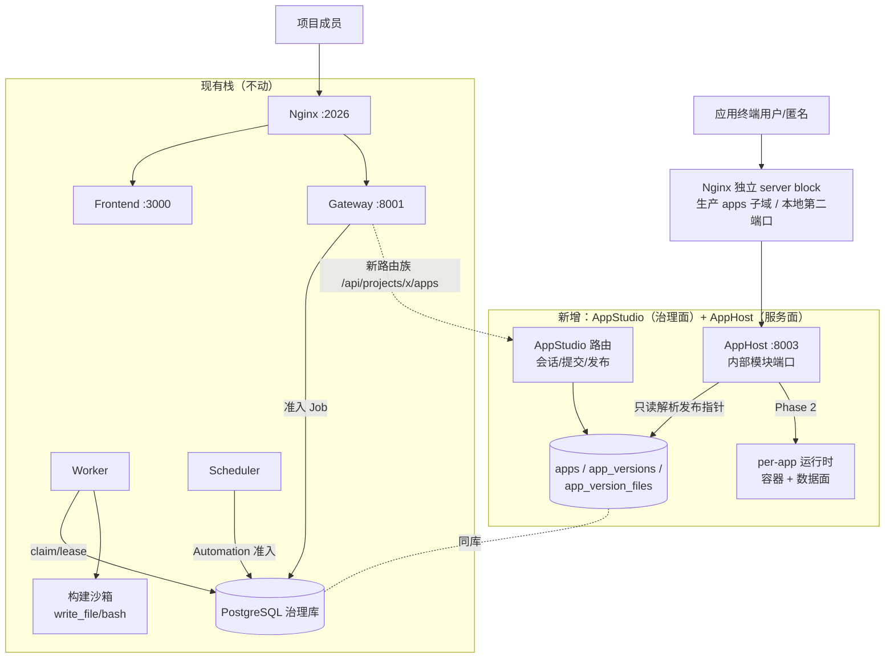
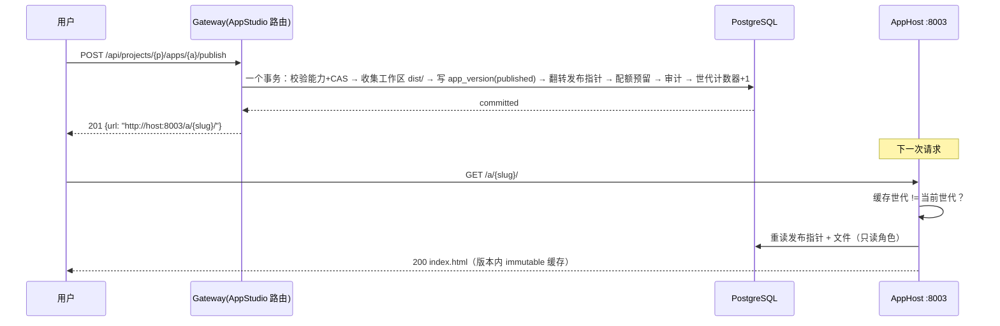
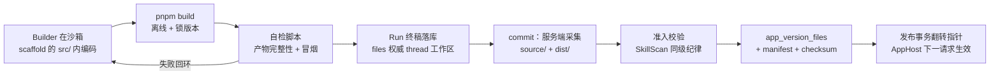

# 妙搭式应用搭建平台：可行性评估与总体设计（AppStudio / AppHost）

> 状态：**设计提案，尚未实施**
> 基线：2026-08-13 当前工作区。结论来自四路并行代码探查（沙箱、拓扑路由、持久化资产、Worker 运行时），引用形如 `path:line` 的位置均对应当前 checkout；产品对标资料来自飞书官方渠道（附录 A）。
> 范围：在 ActWeave 中实现飞书【妙搭】式产品能力——对话式构建应用、独立模块、独立端口提供服务、应用发布后立即可访问。
> 非目标：不改变 Gateway/Worker/Scheduler 现有职责边界与安全不变量；本文不表示任何新表、路由、服务已经存在；实施时须按 ORM、完整 schema、迁移链、契约测试逐项落地。

---

## 总体结论

**可以实现，且"独立模块、独立端口、发布即访问"三个预设恰好都是本架构下的正确解。**

- **构建侧约 70% 现成**：无时长上限的持久化 Run、checkpoint 断点续跑、SSE 游标回放、沙箱文件/命令工具链、"资产 + 不可变版本 + 发布指针"模式、设计会话模式、定时任务准入模式，全部可直接复用或照抄。
- **托管侧接近于零**：沙箱只是构建环境，浏览器不可达；Nginx 无动态路由；平台今天刻意禁止渲染用户生成的 HTML。"发布后立即访问"需要净新增一个 **AppHost** 服务——这正是"独立模块、独立端口"的落点。
- **一个必须前置决策的问题**：用户应用自己的业务数据（Agent 为应用建的表）与"运行时禁止 DDL、单库单 schema、无 RLS"的治理红线正面冲突，必须为已发布应用建立独立于治理库的数据面。

分三期落地：Phase 1 纯前端应用闭环（对话生成 → 发布 → 立即访问），Phase 2 全栈应用（应用数据面 + 长驻运行时 + 终端用户认证），Phase 3 生态能力（自动化任务、插件、协作、报表）。

---

## 一、产品对标：妙搭的能力拆解

对标飞书妙搭（2025-07 随飞书开发套件发布，2026-01 大版本更新），其产品设计可拆为六层，右列为本方案的映射与取舍：

| # | 妙搭能力层 | 核心机制 | 本方案映射 |
|---|---|---|---|
| 1 | 双模式入口 | 灵感探索（纯前端，分钟级）/ 应用构建（全栈，约 30 分钟），单向一键升级 | Phase 1 只做"灵感探索"等价物；Phase 2 补全栈 |
| 2 | 对话式产研流程 | 开发计划（需求分析/技术方案/任务清单）作为可编辑对象；消息队列排队执行；选中元素/报错作为上下文 | 复用 Run + 设计会话；消息队列为新增项（见 3.4） |
| 3 | 运行时架构 | 多 Agent 协作；每应用独立容器；Serverless PostgreSQL + Data as Git | Builder Agent 资产 + 现有子代理；数据面见 4.7 |
| 4 | 能力扩展 | 插件中心（AI + 飞书能力）；自动化任务（NL→Cron，执行应用内代码文件） | 插件≈现有 Skill/MCP 体系；自动化任务 Phase 3 |
| 5 | 生产化治理 | 集成数据库管理、三层日志与链路、运营报表、行级数据权限 | Phase 2/3 渐进补齐 |
| 6 | 发布与访问 | 组织内 / 互联网公开双通道；公开应用可配置免登录；内置认证服务 | AppHost 独立 origin + `access_mode` 字段（见 4.6） |

MVP（Phase 1）验收标准一句话：**用户在对话里描述需求 → Builder Agent 在沙箱里生成一个多文件前端应用 → 用户点"发布" → 数秒内通过独立端口的 URL 匿名可访问。**

---

## 二、现状架构盘点

### 2.1 构建侧运行时——就绪度高

妙搭"对话 30 分钟生成应用"的工作负载，Worker 今天就能承载：

- **Run 无时长上限**：lease 90 秒无限续租 + 心跳（`backend/app/worker/service.py:341-367`，`worker_config.py:25-49`）；订阅浏览器断开不取消 Run（重连端点 `cancel_on_disconnect=False`，`private_work.py:1491`）。
- **重启可恢复**：LangGraph PostgreSQL checkpoint + `prepare_checkpoint_takeover` 恢复时抑制输入重放（`backend/app/reliability/execution.py:1829-1863`），失败尝试有完整回滚机制（`runs/worker.py:2205-2630`）。
- **流式规模化**：`run_events` 按月分区、文本增量 75ms 合帧、LISTEN/NOTIFY 唤醒 + 轮询兜底、SSE 游标断线重放（`events/store/db.py`、`private_work.py:804-902`）。
- **构建工具链完整**：`write_file`/`str_replace`/`bash`/`glob`/`grep` 对 `/mnt/user-data/workspace` 全套可用，bash 工具文档明确支持后台长驻进程（`sandbox/tools.py:1646-1656`）；每次写入/执行都过授权边界（`execution.py:866-990`）。
- **Agent Profile 是数据不是代码**：`agent_versions` 携带 soul、instructions、identity、tool_groups、Skill/MCP 绑定（`persistence/shared_assets/agent_model.py:93-116`）；新增"App Builder"是资产操作。且已有两个聊天式构建器先例：`project_agent_builder.py`、`project_skill_builder.py`。
- **打包技能可直接喂给 Builder**：bootstrap 目录中已有 `frontend-design-v1`、`web-design-guidelines-v1`、`chart-visualization-v1` 等系统技能，正好是应用生成质量的领域知识来源。

### 2.2 资产与持久化——版本化模式可照抄

- **"资产 + 不可变版本 + 发布指针"是成熟模式**：`skills`（`full_schema.sql:734-755`）/ `skill_versions`（`1153-1183`，`draft → pending_approval → published → rejected` 状态机）/ `skill_version_files`（`1551-1564`，`content BYTEA`，单文件上限 100 MiB）。发布不可变性由数据库触发器保证，且触发器按 `TG_TABLE_NAME` 分发（`full_schema.sql:1987-1996`、`1801-1900`）——新表族只需加 CASE 分支。
- **设计会话模式即"妙搭开发会话"**：`skill_design_sessions`（`2429-2477`，durable、可恢复、乐观修订、状态机 `interviewing → generating → … → completed`）+ `skill_design_operations`（幂等轮次）+ `skill_design_draft_files`（草稿文件 BYTEA），结构上就是"Agent 生成代码 → 用户多轮迭代 → commit 产出不可变版本"。
- **配额已打通**：Skill 版本发布/删除已接 `storage_bytes` 预留与释放（`skill_service.py:1162-1188`），应用版本照做。
- **文件字节 100% 在 PostgreSQL**：无任何对象存储（全库 grep 无 boto3/minio/s3）；`files` 表硬绑定 thread 与 owner（`full_schema.sql:1330-1365`），**不适合**直接充当可共享的应用产物存储——应用需要自己的表族。
- **无任何数据隔离机制**：单库单 schema，无 RLS、无 `CREATE SCHEMA`、无动态 search_path；隔离完全靠 `project_id` 列 + 复合外键 + 服务端签发上下文（`backend/AGENTS.md` 明示）。

### 2.3 沙箱子系统——合格的构建环境，托管能力为零

- 四个 Provider（Local / AIO 容器 / AIO+K8s Provisioner / BoxLite / e2b），抽象接口只有 7 个能力：执行命令 + 文件六件套（`sandbox/sandbox.py`）。**接口中没有任何端口、网络、服务、URL 概念。**
- 容器端口写死：只发布沙箱控制 API 的 8080（`community/aio_sandbox/local_backend.py:555-575`），宿主侧默认绑 127.0.0.1；K8s Pod/Service 同样只有这一个口（`docker/provisioner/app.py:438-444`）。**浏览器今天无法触达沙箱内任何进程**——全库无 preview/proxy/tunnel/ingress 机制，`sandbox_url` 的唯一消费者是 Worker。
- 生命周期与"应用"错配：身份为 `sha256(user_id:thread_id)`（`aio_sandbox_provider.py:313-320`），turn 结束即归还温池，闲置 600 秒回收，3 副本软上限；private-Run 沙箱一次性销毁且**明确拒绝 K8s Provisioner 后端**（`aio_sandbox_provider.py:680-711`）。
- 需要记账的安全面：容器带 `seccomp=unconfined`，K8s Pod `allow_privilege_escalation=True`，沙箱出网无限制（`url_safety.py` 只管服务端 Web 工具的 SSRF，不约束沙箱自身 egress）。

### 2.4 服务拓扑与路由——加服务有模板，公网服务无先例

- **加一个独立端口服务是熟路**：Provisioner 即模板（独立 FastAPI + 纯环境变量配置，`docker/provisioner/app.py:57-77`）。需要触碰的点：`scripts/serve.sh`（`run_service` 帮助函数 `:515-542`；端口回收清单 `:146`、`:299-301` 必须同步加，否则 `make stop` 遗孤）、两份 compose、两份 nginx conf、`scripts/deploy.sh:358-371` 与 `scripts/docker.sh:236-245` 的显式服务清单。
- **Nginx 无通配/动态能力**：单一 `server_name _` 监听 2026，路由表全静态（`docker/nginx/nginx.conf:40-49`、`62-159`）；两份 conf 手工同步且无 parity 测试。
- **匿名访问无先例**：AuthMiddleware fail-closed，公开路径仅 health/docs/auth 引导/签名 webhook（`backend/app/gateway/auth_middleware.py:29-53`）；邀请链接也不是匿名读。
- **平台今天主动拒绝渲染用户 HTML**：所有活性内容 MIME 强制 `Content-Disposition: attachment` + `nosniff`（`backend/app/private_work/file_streaming.py:36-72`）；前端预览仅限单文件 HTML 的 Blob URL + 沙箱化 iframe（`artifact-file-detail.tsx:501-534`）。这不是欠缺，而是**同源安全的正确防线**——见 3.2。

### 2.5 就绪度总表

| 子系统 | 妙搭所需 | 现状 | 就绪度 |
|---|---|---|---|
| 构建 Agent 运行时 | 长时 Run、断点恢复、流式进度 | 完整 | ★★★★★ |
| 构建工具链 | 沙箱写文件/执行/装依赖 | 完整 | ★★★★★ |
| 应用资产模型 | 版本、发布指针、不可变性 | Skill 模式照抄 | ★★★★☆ |
| 开发会话 | 多轮迭代草稿 + 提交 | Skill Builder 模式照抄 | ★★★★☆ |
| 定时任务 | Cron 准入 | Scheduler 模式复用 | ★★★☆☆ |
| 应用托管与访问 | 发布即公网可访问 | **不存在** | ☆☆☆☆☆ |
| 应用数据面 | Agent 为应用建表 | **与治理红线冲突** | ☆☆☆☆☆ |
| 消息队列 | 排队执行指令 | 硬 409 拒绝 | ★☆☆☆☆ |

---

## 三、差距分析

### 3.1 缺口一：托管层不存在（净新增的主体）

"发布后立即访问"需要一条从公网到应用产物/进程的完整链路，现状为零。但按应用形态拆分后，第一阶段的实现可以非常薄：

- **纯前端应用**（Phase 1）：发布 = 构建产物（多文件 bundle）写入 `app_version_files` 并翻转发布指针；AppHost 是"按 slug 解析发布指针 → 从 PostgreSQL 读文件 → 带缓存地 serve"的静态服务。无进程管理、无冷启动，"立即访问"退化为一次指针读取，天然成立。
- **全栈应用**（Phase 2）：需要 per-app 运行时（独立容器/进程）+ 按需拉起（闲置停机、请求冷启动数秒）+ AppHost 反向代理。这是妙搭"每应用独立容器 + Serverless PG"的等价物，成本高一个数量级，不进 MVP。

### 3.2 缺口二：同源安全——统一 Nginx 入口下的 origin 隔离

**拓扑决策：AppHost 的独立端口只是内部模块端口，不对外发布；一切浏览器访问统一经 Nginx。** 这与现有部署姿态一致（Nginx 是唯一暴露面）。但 Nginx 用什么形态接入应用流量，安全性差异巨大——约束不是"是否经过 Nginx"，而是**应用流量必须落在与主站不同的 origin、且生产环境必须不同 host**：

| Nginx 接入形态 | JS 同源隔离（DOM/存储/fetch） | Cookie 隔离 | 结论 |
|---|---|---|---|
| 2026 默认 server 下路径前缀 `/a/…` | ❌ 与主站同源 | ❌ 完全共享 | **禁止** |
| 第二监听端口（同 host，如 `:2027`） | ✅ 端口参与 origin 判定 | ❌ **cookie 按 host 匹配、忽略端口**：应用 JS 可读主站 `csrf_token`；same-site 判定同样忽略端口，`SameSite=Strict` 拦不住同站请求 | 仅限本地开发 |
| `apps.<domain>` 独立 server block | ✅ | ✅ 主站 cookie 为 host-only，对子域既不发送也不可读 | **生产基线** |
| 独立注册域（如 `*.example-apps.com`） | ✅ | ✅ 连 site 级也隔离 | 远期（`vercel.app` / `github.io` 同款惯例） |

两个容易被忽略的浏览器事实决定了上表：cookie 作用域按 host（+path）匹配、**不含端口**；same-site 判定按可注册域、**同样不含端口**。所以"同 host 异端口"只隔离了 DOM/存储/fetch，没有隔离 cookie jar——本地开发可接受（攻击面是自己生成的应用），生产必须走独立 host。

防御纵深再加三层：应用 server block 在 `proxy_pass` 前**剥离 `Cookie` 头**（AppHost 永远收不到主站 cookie，服务端纵深，不解决 `document.cookie` 的客户端可读性）；AppHost 永不对主站 host 执行 `Set-Cookie`，应用终端用户会话（Phase 2）用 AppHost 自有的按应用隔离体系；**主站 cookie 必须保持 host-only（不设 `Domain` 属性）**——这是子域隔离成立的前提，须固化为不变量（见第五节）。应用间串扰：MVP 单 host 承载多应用时不提供任何跨应用可读的存储凭据并带保守 CSP，正式版演进为每应用一个子域（`{slug}.apps.<domain>`）实现浏览器级隔离。

### 3.3 缺口三：应用数据面与 DDL 治理红线冲突

治理红线：运行时进程永不对应用 schema 执行 DDL；单库单 schema 无 RLS；schema 变更走全套治理仪式。而妙搭式产品必然要"Agent 给应用建表"。**用户应用的表绝不能进治理 schema**，必须独立数据面：

| 方案 | 机制 | 优点 | 缺点 | 结论 |
|---|---|---|---|---|
| A. 每应用一个 SQLite | 文件随应用运行时挂卷，定期快照回 PG | 实现最简；备份=拷文件；零供给成本 | 并发弱；跨实例难 | **Phase 2 起步方案** |
| B. 每应用独立 PG database | AppHost 供给器 `CREATE DATABASE`，专用低权角色 | 真隔离；DDL 在应用自己库里发生，不触碰治理库；可演进 Data-as-Git | 需要供给/回收/备份运维 | **Phase 2 后期/生产方案** |
| C. 共享库 + 每应用 schema | 动态 search_path | 省实例 | 隔离最弱；非超级用户角色下权限管理复杂；与现有单 schema 纪律冲突 | 排除 |

注意边界表述：红线管的是**治理库**的 schema 权威；应用数据面是独立于治理库的运行数据，其元信息（归属、版本、配额、备份状态）仍以治理库为权威记录——这与 `backend/AGENTS.md`"文件/工件字节可以在配置的存储中，但身份/版本/范围以数据库为权威"的既有表述同构。

### 3.4 次级摩擦点（记账，不阻塞）

1. **无消息队列**：同 thread 第二条消息在准入处硬 409（`run_admission.py:662-666`），全 schema 无排队表。妙搭式"排队执行"需新增 pending-message 表在 turn 边界 drain；MVP 可先由前端 hold-and-resend 兜底。
2. **工作区 thread 级且逐文件恢复**：每次 Run 从 PG 恢复文件到临时沙箱（`private_file_lifecycle.py:101-143`），`node_modules` 级目录树会显著拖慢；需要构建缓存策略（如产物只进 `dist/`、依赖装在温池镜像里）或应用级持久工作区。
3. **Job 类型是闭合契约**：`ck_jobs_type` CHECK（`full_schema.sql:74`）+ 授权形状约束；新增类型 = 全套 schema 治理。Phase 1 尽量不加新 job 类型（构建复用 `private_run`）。
4. **`write_todos` 在 project Run 被强制关闭**（`lead_agent/agent.py:581-583`）：妙搭式"开发计划/任务清单"面板需要有条件重启这个面。
5. **K8s Provisioner 不支持 private-Run 沙箱**：构建环境走本地容器/BoxLite/e2b 路线。
6. **两份 nginx conf 手工同步、无 CI**：所有验证为本地门禁。

---

## 四、总体设计

### 4.1 架构总览



模块切分原则：**AppStudio 是治理面**（应用资产的创建、迭代、发布，挂在 Gateway 现有路由族与授权模型下）；**AppHost 是服务面**（独立进程、独立内部端口、独立信任边界，只消费"已发布版本"这一种权威状态，统一经 Nginx 的独立 server block 接入）。两者只通过 PostgreSQL 交接，AppHost 不持有任何主站会话概念。

### 4.2 AppHost 服务

- **进程形态**：独立 FastAPI 服务，端口 `8003`（沿用 Provisioner 的纯环境变量配置先例，Phase 1 不进 `config.yaml` 治理面，避免 config_version 联动）。
- **数据库角色**：专用**只读**角色，仅授予 `apps`/`app_versions`/`app_version_files` 的 SELECT——AppHost 被攻破也无法触碰治理库其余 80 张表。
- **请求路径**（Phase 1）：`GET /a/{slug}/{path...}` → 解析 `apps.slug → current_published_version_id`（进程内缓存，见 4.5）→ 读 `app_version_files` → 按扩展名给 Content-Type，目录请求回退 `index.html`（SPA fallback）→ 版本内文件以 `immutable` 缓存头下发（版本不可变性由触发器背书）。
- **响应安全头**：保守 CSP（默认 `default-src 'self'; script-src 'self' 'unsafe-inline'` 起步，后续按需放宽）、`X-Content-Type-Options: nosniff`、`Referrer-Policy`；绝不 `Set-Cookie` 主站域 cookie。
- **暴露方式**：`8003` 仅为内部模块端口，compose **不发布到宿主**；一切访问统一经 Nginx。两份 nginx conf 各加一个**独立 server block** 反代 `apphost:8003`：生产用 `server_name apps.<domain>`（含 TLS），本地开发用第二监听端口（如 `listen 2027`）；server block 内以 `proxy_set_header Cookie ""` 剥离主站 cookie。本地 `serve.sh` 增加 `run_service "AppHost" … 8003`，端口回收清单同步补 `8003` 与本地 `2027`。
- **开发预览**：Studio 内 iframe 指向 AppHost 的预览路径 `GET /preview/{session_id}/{path...}`，以**短时效签名 token**（query 参数，AppHost 本地验签）授权读取草稿文件——不引入主站会话，隔离等级与已发布应用相同。

### 4.3 数据模型（照抄 Skill 三件套 + 设计会话）

新表族进治理 schema，走全套治理仪式（ORM 注册 → `full_schema.sql` → 中文注释 → 迁移链 `full_schema_v11` → 签名/digest → parity 测试）：

```sql
apps (
  id, project_id, slug,             -- slug 全局唯一（URL 是全局的），沿用 3-63 小写约束
  display_name, description,
  status,                            -- active / archived / suspended
  access_mode,                       -- public_anonymous / public_login(Phase2) / project_members(Phase2)
  current_published_version_id,      -- 发布指针，触发器禁止回退
  version,                           -- 乐观锁
  created_by, created_at, updated_at
)
app_versions (
  id, app_id, version_number,        -- 连续递增
  workflow_status,                   -- draft / published（应用无需审批态，做窄比 Skill 简单）
  entry_path,                        -- 默认 index.html
  payload_checksum, supersedes_version_id,
  created_by_session_id, published_at, ...
)
app_version_files (
  app_version_id, path, content BYTEA, content_type, sha256, size_bytes
)
app_design_sessions / app_design_operations   -- 镜像 skill_design_sessions 状态机与幂等轮次
```

复用要点：三个共享触发器函数（状态机、payload 不可变、已发布子行冻结）按 `TG_TABLE_NAME` 加分支即可；发布时走 `storage_bytes` 配额预留；`asset_catalog_state` 世代计数器模式复用为 AppHost 缓存失效信号。能力位新增 `Capability.APP_EDIT` / `APP_PUBLISH`（代码内角色映射，无 schema 成本）；审计动作扩展 `app.version.published` 等闭合契约。

**草稿文件的取舍**：MVP 不单独建 `app_design_draft_files`，草稿即 Builder 线程的沙箱工作区（thread 级 `files` 表已有持久化）；commit 端点在事务内从工作区收集 `source/` 与 `dist/` 写成 `app_versions` 草稿行并立即发布（管线与校验细节见 4.10）。若后续需要"多人协作编辑草稿"，再引入独立草稿表。

### 4.4 构建链路

1. **App Builder 以打包系统 Agent 资产交付**（同 `project-assistant-v1.agent.json` 的 bootstrap 路径）：soul/instructions 内置"需求澄清 → 生成开发计划 → 分任务实现 → 自检预览"的流程约束，绑定 `frontend-design-v1`、`web-design-guidelines-v1` 等现有系统技能。
2. **开发会话 = 现有 Thread + Run**：用户与 Builder 的多轮对话直接复用私有工作流（准入、SSE、断点恢复全部现成）；`app_design_sessions` 行仅记录会话与 app 的绑定、状态机与幂等操作。
3. **需求澄清**复用 `ask_clarification` 中断/续跑机制；**开发计划**沿用对话内容呈现，Phase 3 再评估重启 `write_todos` 面板。
4. **构建自检**：Builder 在沙箱内 `python -m http.server` 或构建工具 serve 后用 `bash` 探活/抓取自检（沙箱内自访问可行），不依赖外部预览。

### 4.5 发布与"立即访问"机制



- 发布的原子性完全落在治理库单事务内（与 Skill publish 同构），**没有跨服务协调**——这是"发布即生效"能干净成立的原因。
- AppHost 缓存失效两级：请求时对比世代计数器（一次极轻量 SELECT，可再加 1-2 秒 TTL 钝化）；后续可选 LISTEN/NOTIFY 主动失效。最坏情况生效延迟 = TTL，满足"立即访问"。

### 4.6 访问与安全模型

| 维度 | Phase 1 | 演进 |
|---|---|---|
| Origin 隔离 | Nginx 独立 server block：本地第二端口，生产 `apps.<domain>` 子域（host 级 cookie 隔离） | 通配子域 `{slug}.apps.…`，每应用一个 origin |
| 终端用户身份 | 仅 `public_anonymous` | AppHost 自有会话体系；`public_login` / `project_members` 模式 |
| 应用间隔离 | 同 host 多应用：无凭据可窃 + 保守 CSP | 子域化后浏览器级隔离 |
| 滥用防护 | Nginx `limit_req` + AppHost 层限速（per-IP/per-app）、响应体积上限、慢请求超时 | 带宽/流量配额进 quota 维度 |
| 主站防护 | AppHost 无主站 cookie、无治理库写权限 | 不变 |
| 供应链 | Builder 沙箱出网现状无限制——发布物是静态文件，风险收敛在构建期 | 收紧沙箱 egress 白名单（独立议题） |

### 4.7 应用数据面（Phase 2）

- 起步：**每应用一个 SQLite**。应用运行时容器挂载专属卷；AppHost 供给器负责创建/快照（快照序列化回治理库或对象存储，元信息以治理库为权威）。
- 生产：**每应用独立 PG database**（专用实例或独立于治理库的实例），供给器用维护角色 `CREATE DATABASE app_{id}` 并授予应用专属低权角色；应用内 DDL 由 Agent 在**应用自己的库**里执行，治理库红线不被触碰。
- 远期对标妙搭的 Data-as-Git（分支/回退），可评估 Neon 类自托管方案，不在本文范围。

### 4.8 自动化任务（Phase 3）

务实路线：**不新增 job 类型**。应用的定时任务建模为"到点对应用自身的 HTTP 端点发起签名调用"——AppHost 内置一个轻量 cron 执行器（或复用 Scheduler 的 advisory-lock 轮询模式独立实现），任务定义/执行记录存新表族。这样把"执行应用代码"收敛在应用运行时自己的信任边界内，避免 Worker 执行非 Agent-graph 工作负载的越界。

### 4.9 生成应用的技术栈选型

选型准则按权重排序：① **LLM 一次成型率**（训练语料密度：React/Tailwind/Express 系最高，零构建 HTML 是可靠性天花板）；② **构建确定性**（3.4-2 的工作区逐文件恢复现实要求依赖预烘焙进沙箱镜像、锁版本、可离线构建）；③ **产物匹配 AppHost**（Phase 1 必须纯静态 `dist/`、文件少、兼容 `/a/{slug}/` 前缀与将来子域）；④ **运行时脚印**（Phase 2 单进程单容器、冷启动秒级、适配按需拉起）；⑤ **数据面匹配**（迁移文本化、SQLite→PG 可平移）；⑥ **安全面**（供应链窗口最小化；能不执行任意后端代码就不执行）。

**Phase 1 双轨**（对应妙搭"灵感探索/应用构建"的轻重分层）：

| 轨道 | 栈 | 适用 | 关键约束 |
|---|---|---|---|
| A 零构建 | 多文件 HTML + Tailwind（模板内置预编译 CSS，不依赖外网 CDN）+ 原生 JS/Alpine | 官网、活动页、原型、小游戏 | 无 npm、无构建步骤，`dist/` 即源码，秒级发布 |
| B 标准栈 | Vite + React + TypeScript + Tailwind + shadcn/ui（组件以源码拷贝进模板） | 交互较重的工具、看板 | `base: './'` + Hash 路由（子域化后迁 BrowserRouter）；依赖经 pnpm 离线 store 预烘焙进沙箱镜像 |

**脚手架即治理资产**：提供 1–2 个版本化锁定的 scaffold 模板（随沙箱温池镜像烘焙，配套 system skill 描述约定），Builder 只在 `src/` 内工作、禁改工程配置；模板内置自检脚本（构建 + 死链/控制台错误检查），发布前必跑；模板升级 = 新版本，存量应用不受影响——与 Run 冻结闭包同一哲学。

**Phase 2 后端形态按能力阶梯推进**，不一次选死：

| 阶梯 | 形态 | 承担场景 | 备注 |
|---|---|---|---|
| ① 平台数据服务（优先） | 应用仍为静态前端；声明式数据模型 + 平台多租户 Data API（CRUD/查询/行级策略）+ 内置认证 | 表单、CRUD 管理系统、看板 | **不执行任意后端代码**：无 per-app 常驻进程，托管与安全成本最低；Data API 消费 4.7 的应用数据面；行级策略对标妙搭数据权限 |
| ② 单容器全栈 | Node 单进程：Hono/Express + Drizzle ORM + SQLite（→独立 PG） | 自定义业务逻辑、外部集成 | 冷启动快；Drizzle 迁移是文本文件，适合 Agent 在应用自己的数据面内自助 DDL |
| ③ 函数级扩展（远期） | 平台托管的沙箱化 server functions | 自动化任务执行体、Webhook | 与 4.8 合流 |

**明确不选**：Next.js 不作为生成目标（构建重、冷启动慢、SSR 扩大攻击面、Agent 调试链路长——继续作为平台自身前端框架）；Python 后端不作为生成目标（生成应用将需要 Node 构建链 + Python 运行时的双语言容器，复杂度不划算）。

### 4.10 构建与打包管线

端到端管线（轨道 B；轨道 A 无构建步，源码即产物）：



**沙箱内构建约定**：

- **依赖目录必须在工作区持久化边界之外**：`node_modules` 经符号链接指向沙箱镜像内预烘焙位置（或 pnpm 虚拟 store 固定于镜像路径），绝不落入 `/mnt/user-data/workspace`——否则 Run 终稿的逐文件落库与下次恢复会被依赖树击穿（3.4-2 的现实约束）。工作区内只保留 `src/`、锁定配置与 `dist/`。
- **离线确定性构建**：`pnpm install --offline --frozen-lockfile`；MVP 依赖集封闭于 scaffold 的 lockfile，新增能力走 shadcn 式源码 vendor 而非装新包；后续再开"依赖白名单 + store 刷新管线"。
- **超时与失败回环**：构建经 `bash` 工具执行，受 `bash_command_timeout`（默认 600s）约束；Vite 全量构建应控制在 30–60s 量级，失败输出回喂 Builder 自修。
- **自检清单**（模板内置脚本，发布前必跑）：构建退出码；`dist/index.html` 存在；产物文件数/单文件/总体积上限；相对路径检查（禁止以 `/` 开头的资源引用，保证前缀与子域两种接入都成立）；本地起静态服务抓首页冒烟（无 5xx、无致命控制台错误）；**禁外网资源引用**——脚本/样式/字体一律随包，适配内网部署姿态。

**产物契约**：版本内容 = `source/`（完整源码树 + lockfile，供续改、审计、"回滚开新版"）+ `dist/`（AppHost 只 serve 此前缀）+ `manifest.json`（entry、逐文件 sha256 映射、scaffold 版本与构建元信息）。回滚遵循既有不可变哲学：发布指针不回退，"恢复到 vN" = 以 vN 的 `source/` 开新草稿版本重新构建发布——与 Skill restore 语义一致。

**服务端准入校验**（commit 事务内，对齐 SkillScan 纪律）：路径安全复用 `files.logical_path` 反穿越约束；文件数/单文件/总体积上限沿用 Skill 先例（100 MiB / 16384 文件）另设 `dist/` 总量上限；扩展名/MIME 白名单（html/css/js/json/svg/png/jpg/webp/woff2/wasm 等 Web 资产类型）；逐文件 sha256 + 版本级 `payload_checksum`；`storage_bytes` 配额预留同事务完成。

**存储与服务格式**：沿用 `skill_version_files` 的 **per-file 行**而非 zip 归档——AppHost 按路径单条 SELECT 直出、无解包步骤、可按文件缓存；版本不可变 + `immutable` 缓存头使热文件收敛为一次读。压缩策略：Phase 1 serve 时 gzip 并缓存压缩结果；预压缩变体（br/gzip 列）与跨版本内容寻址去重（按 sha256 复用文件行，抑制 BYTEA 膨胀）列为存储优化项。

**Phase 2 打包形态**：全栈应用**不做 per-app 镜像构建**（本仓库无镜像仓库与构建器基建）——采用"模板运行时容器 + 版本代码挂载"：供给器以固定 runtime 镜像启动容器，把版本 `source/` 物化到容器卷、离线安装依赖后启动；应用升级 = 切换挂载版本重启。规避 registry 运维与镜像膨胀，也让运行时镜像的安全补丁与应用代码解耦。

---

## 五、必须遵守的不变量（实施检查单）

1. AppStudio 路由的一切授权来自服务端签发的 `ProjectContext`/能力位；slug、app_id 等不从请求体接受 authority。
2. 发布事务内完成：能力与 CAS 复验、指针翻转、配额预留、审计追加——任一失败整体回滚。
3. `app_versions` 发布后不可变（触发器）；发布指针永不回退；重新发布 = 新版本。
4. 新表族一次性完成治理仪式：ORM 注册、`full_schema.sql`、中文注释（`generate_schema_comments.py --check`）、`full_schema_v11` 迁移、签名/digest、`test_schema_migration_parity.py` 双路径一致。
5. AppHost 进程使用只读数据库角色；不持有、不签发、不透传主站 cookie/token；应用 server block 转发前剥离 `Cookie` 头；主站 cookie 保持 host-only（不设 `Domain` 属性），此为子域隔离的前提；日志不含内容与私有标识。
6. 用户应用的业务表永不进入治理 schema；治理库只存应用数据面的元信息。
7. 沙箱构建产物经由现有 Run 文件权威（`files` 表）进入发布事务；不从沙箱直接旁路发布。
8. 每个新路由族补齐成功/外部人/错 owner/缺能力/陈旧修订/回滚测试；`make test` 零跳过。

---

## 六、分阶段实施路线

### Phase 1：纯前端应用闭环（对标"灵感探索"）

| # | 工作项 | 主要触点 | 量级 |
|---|---|---|---|
| 1 | `apps`/`app_versions`/`app_version_files`/`app_design_sessions` 表族 + 触发器分支 + 全套治理仪式 | persistence、migrations、tests | 大 |
| 2 | AppStudio 路由族（创建应用、绑定会话、commit+publish、列表/详情）+ 产物采集与准入校验（4.10） | `app/gateway/routers/`、`app/shared_assets/` 新域服务 | 中 |
| 3 | AppHost 服务（静态 serve + 世代缓存 + 预览签名 + 安全头 + 限速） | 新 `backend/app/apphost/` 或独立目录 | 中 |
| 4 | App Builder 系统 Agent 资产 + 双轨 scaffold 模板（烘焙进沙箱镜像，见 4.9）+ bootstrap 目录扩展 | `app/shared_assets/bootstrap/`、catalog 生成、沙箱镜像 | 小 |
| 5 | 拓扑接线：serve.sh（含端口回收三处）、两份 compose（8003 不发布宿主）、deploy.sh/docker.sh 服务清单、两份 nginx conf 各加独立 server block（本地第二端口 / 生产 apps 子域，剥离 Cookie 头） | `scripts/`、`docker/` | 小 |
| 6 | Studio 前端：应用列表、构建会话页（复用聊天组件）、iframe 预览、发布按钮与 URL 展示 | `frontend/src/` | 中 |

**里程碑验收**：对话生成多文件前端应用 → 发布 → 匿名浏览器数秒内经 Nginx 应用入口访问（本地 `:2027/a/{slug}/`，生产 `apps.<domain>/a/{slug}/`）；重发布即时生效；回归 `make test` 零跳过。

### Phase 2：全栈应用

per-app 运行时（容器 + 按需拉起 + AppHost 反代）、应用数据面（SQLite → 独立 PG database 供给器）、终端用户认证与 `access_mode` 完整实现、应用日志面板。后端形态按 4.9 能力阶梯推进：先平台数据服务（多数 CRUD 应用无需 per-app 常驻进程），确需任意逻辑再上单容器全栈。前置决策：运行时供给建立在现有沙箱 Provider 之上扩展（需给 Provider 契约加端口/网络概念）还是 AppHost 自管容器（推荐后者，避免污染构建沙箱抽象）。

### Phase 3：生态能力

自动化任务（4.8）、消息队列（pending-message 表 + turn 边界 drain）、多人协作（复用成员/能力模型）、运营报表（访问计数聚合）、插件面（复用 Skill/MCP 体系向 Builder 暴露）。

---

## 七、风险与开放问题

| # | 风险/问题 | 影响 | 缓解 |
|---|---|---|---|
| 1 | PostgreSQL BYTEA 直出静态文件的吞吐 | 热应用下 DB 压力 | 版本不可变 → AppHost 进程内/磁盘缓存收敛为一次读；后续前置 nginx 缓存 |
| 2 | 公网匿名流量打在自托管栈上 | 资源滥用、扫描攻击 | 限速、体积上限、`access_mode` 默认非公开、发布需 `APP_PUBLISH` 能力 |
| 3 | slug 抢注与内容滥用 | 治理问题 | slug 全局唯一 + 项目归属审计；管理员 suspend 通道（`apps.status` 已留） |
| 4 | 构建期供应链（npm 等）风险，沙箱出网无限制 | 生成物被注入 | Phase 1 产物为静态文件、风险窗口在构建期；独立议题推进 egress 白名单 |
| 5 | 治理仪式的固定成本（每次加表全套联动） | 迭代速度 | 表族设计一次到位（本文 4.3 覆盖 Phase 1 全部需求），Phase 2 前再评审一次 |
| 6 | 工作区逐文件恢复对大依赖树的性能 | 构建体验 | 依赖预装进沙箱镜像；产物只收集 `dist/`；必要时应用级工作区（开放问题） |
| 7 | 两份 nginx conf 无 parity 验证 | 环境漂移 | 顺手补一个静态比对脚本进本地门禁（低成本） |
| 8 | 妙搭级"消息队列/可视化选中元素"体验 | 产品完成度 | 明确列为 Phase 3；MVP 不承诺 |
| 9 | 本地开发的第二监听端口与主站同 host，cookie jar 共享（应用 JS 可读 `csrf_token`） | 仅开发环境暴露 | 明确只在开发环境接受；生产强制 `apps.<domain>` 子域；剥离 Cookie 头作为服务端纵深 |

开放问题：① 应用数据面快照的备份权威与恢复演练放在哪个运维文档轨道；② 子域化后的证书与 DNS 自动化归属；③ `write_todos` 在 project Run 重启的范围与守卫；④ 应用访问计数是否进 `project_usage_*` 现有配额维度还是独立表。

---

## 附录 A：产品对标资料

- [飞书妙搭：AI 原生系统搭建工具（核心功能）](https://www.feishu.cn/content/article/7592171136612306139)
- [飞书妙搭功能上新（灵感探索/插件中心/协作/运维）](https://www.feishu.cn/content/article/7597741503372512473)
- [实战教程：妙搭 + Gemini 三天开发播客平台](https://www.feishu.cn/content/article/7601073061411966158)
- [火山 PostgreSQL Serverless 助力妙搭（Data as Git / Scale-to-Zero）](https://zone.ci/secarticles/wx/557548.html)
- [InfoQ：飞书开发套件发布（多 Agent 架构表述）](https://www.infoq.cn/article/k15fqifoauslo95dt1g9)
- [飞书 AI 版本权益与额度消耗规则（计费模型）](https://www.feishu.cn/hc/zh-CN/articles/629644238181)

## 附录 B：关键代码证据索引

| 结论 | 证据位置 |
|---|---|
| Run 无时长上限、lease 续租 | `backend/app/worker/service.py:341-367`、`config/worker_config.py:25-49` |
| checkpoint 接管恢复 | `backend/app/reliability/execution.py:1829-1863` |
| 同 thread 第二条消息硬 409 | `backend/app/private_work/run_admission.py:662-666` |
| 沙箱端口写死 8080、宿主绑环回 | `community/aio_sandbox/local_backend.py:555-575`、`142-169` |
| 沙箱身份 thread 级、闲置回收 | `community/aio_sandbox/aio_sandbox_provider.py:313-320`、`371-408` |
| private-Run 拒绝 K8s 后端 | `community/aio_sandbox/aio_sandbox_provider.py:680-711` |
| HTML 强制 attachment（同源防线） | `backend/app/private_work/file_streaming.py:36-72` |
| 公开路径白名单（fail-closed 鉴权） | `backend/app/gateway/auth_middleware.py:29-53` |
| Skill 三件套 + 触发器不可变 | `persistence/full_schema.sql:734-755`、`1153-1183`、`1551-1564`、`1801-1900`、`1987-1996` |
| 设计会话状态机 | `persistence/full_schema.sql:2429-2523`、`app/gateway/routers/project_skill_builder.py:371-505` |
| Job 类型闭合契约 | `persistence/full_schema.sql:74`（`ck_jobs_type`） |
| `files` 表 thread 级绑定 | `persistence/full_schema.sql:1330-1365` |
| 发布配额预留先例 | `app/shared_assets/skill_service.py:1162-1188` |
| Agent 资产字段（soul/tool_groups） | `persistence/shared_assets/agent_model.py:93-116` |
| plan mode 在 project Run 关闭 | `agents/lead_agent/agent.py:581-583` |
| 新服务配置先例（纯环境变量） | `docker/provisioner/app.py:57-77` |
| serve.sh 端口回收三处 | `scripts/serve.sh:146`、`299-301`、`515-542` |
| compose 服务显式清单 | `scripts/deploy.sh:358-371`、`scripts/docker.sh:236-245` |
