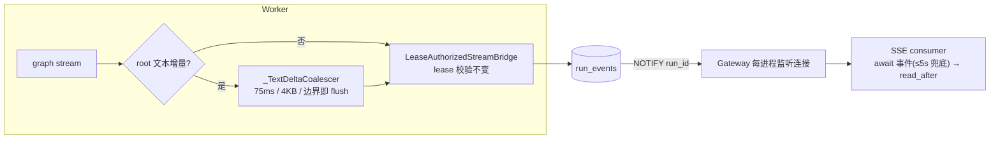

# DeerFlow 核心运行时九项升级方案

- 立项日期：2026-08-07
- 状态：九项代码改造已实施；当前 checkout 全量核心门禁已通过（2026-08-09）
- 评审来源：2026-08-07 全仓架构评审（harness / 会话 / subagent / 记忆 / Skill / MCP /
  工具装配 / 工具调用 / 模型配置九项核心链路）
- 前置依赖：[记忆系统三层化与可用性改造方案](memory-three-tier-upgrade-plan.zh-CN.md)
  （已在工作区落地，本文不重复其范围）
- 适用范围：backend 运行时主干——schema 生命周期、durable 流式管线、项目 MCP 执行、
  Agent 装配一致性、上游依赖防线、SNIP 压缩语义、Skill 激活策略、subagent 等待、
  记忆检索观测
- 本文性质：全部改造均在既有不变量（准入冻结、边界重验证、低权威注入、fail-closed、
  `app.* -> deerflow.*` 单向依赖）之内的增量升级，不推翻任何架构决策

> **明确排除**：产品与运营缺口（项目级 token 开销配额、项目 BYO 模型、平台 metrics
> 体系）不在本方案范围内，另行立项。

## 1. 背景：改造项清单与优先级

| 编号 | 档位 | 问题 | 后果 |
|---|---|---|---|
| U1 | 战略债 | schema 变更 = 空库重建，无增量迁移路径 | 第一个持有真实数据的生产部署后，任何 schema bump 都要求用户 dump/restore |
| U2 | 战略债 | 每个流帧一次 `run_events` INSERT（事务内含 lease 重验证），文本增量逐帧落库；Gateway SSE 轮询读表 | 并发 Run 增多后 PostgreSQL 同时承受写放大与轮询读压力，成为吞吐天花板 |
| U3 | 战略债 | 项目 MCP 代理每次工具调用重新物化密钥 + initialize + 调用 + 拆连接 | 高频 MCP 交互的 Run 每次调用都白付一轮握手，延迟成倍放大 |
| U4 | 可维护性 | `make_lead_agent` / `factory.py` / `client.py` 三条装配路径静默漂移（factory 内注释已失真） | 中间件链分叉不可见，SDK 行为与生产行为渐行渐远 |
| U5 | 可维护性 | 约 30 个中间件深度依赖 LangChain/LangGraph 钩子语义（含 `after_model` 逆序、`checkpoint_patches.py` 上游补丁） | 上游一次 minor 升级即高风险事件，且无金丝雀 |
| U6 | 可维护性 | SNIP 输出"一鱼两吃"：≤1000 字符打标行既当 Thread 续航摘要又当记忆原料 | 长任务压缩后续航上下文过薄，任务连续性掉档 |
| U7 | 语义修订 | verified-read 激活证据 Run 内永久有效，任一激活 Skill 声明 `allowed-tools` 即收窄整个 lead 工具集 | 一次"顺手读取"可能让 Agent 中途丢失完成主任务所需的工具，且对用户不可解释 |
| U8 | 语义修订 | `task` 工具固定 5 秒轮询子代理状态 | 短子任务平白多付最多 5 秒尾延迟；轮询计数与线程池超时存在竞态边角 |
| U9 | 语义修订 | `recall_memory` 的 `pg_trgm` 检索对中文短查询/同义改写偏弱，且无质量数据 | 无法用数据决定何时启动 D9 预留的 embedding 旁表扩展点 |

### 1.1 实施状态（2026-08-09）

| 编号 | 状态 | 当前实现证据 |
|---|---|---|
| U1 | 已实施 | 冻结 v5 链根、v6 → v7 → v8 Alembic 链、统一 schema mutation advisory lock、fresh/chain catalog parity 与显式 `make upgrade-db` |
| U2 | 已实施 | Phase 0 只读画像、Phase 1 75ms/4KiB 文本微批、Phase 2 事务内 NOTIFY + 断线轮询、Phase 3 月分区 + 全局 guard + 单调 retention 水位 |
| U3 | 已实施 | 真正缓存 initialized adapter session，而不是缓存每次调用仍建 session 的 tool wrapper；Run 终止和 idle 均清理 |
| U4 | 已实施 | 四条链 exact golden 已钉住，共享 composer 统一装配，lead/SDK 差异显式化 |
| U5 | 已实施 | 依赖上界、wrapper/逆序/checkpoint patch 行为合同与升级 playbook 已落地 |
| U6 | 已实施 | packaged SNIP 使用 continuity + tagged 双段；custom prompt 保持单段；packaged 摘要输出预算下限为 4096 tokens |
| U7 | 已实施 | read 证据 TTL、slash 豁免、秘密同步过期、真实剩余窗口提示和内容无关 RunJournal 进入/退出 trace |
| U8 | 已实施 | 跨线程事件、1 秒防抖、5 秒心跳、monotonic deadline、终态即时唤醒和 cleanup 事件化 |
| U9 | 已实施 | 闭合 recall 审计动作、结果/命中阶段/查询长度分桶、事务内内容无关写入，以及 durable 单 Run 审计硬上限 |

上述“已实施”表示代码与聚焦门禁已闭环；本次 checkout 的全量、零 skip 结果见 §17。
任何后续改动仍须重跑 checkout-sensitive 门禁，不能拿本次历史结果替代。

## 2. 决策记录（不再反复讨论）

### D1：`full_schema.sql` 仍是唯一全量事实源（U1）

迁移链只服务存量库升级；空库新装继续一次执行 `full_schema.sql`。两条路径的等价性由
CI 契约强制（两库分别走两条路径后 digest 必须相等），谁漂移谁红灯。

### D2：基线 revision 复用现有 marker，存量库零回填（U1）

`full_schema.sql` 最初向 `alembic_version` 写入 `full_schema_v5`，该 marker 继续作为
冻结的迁移链根；当前全新安装直接 stamp 在链头 `full_schema_v9`。把迁移链根 revision
id 直接命名为最初 marker，使既有 v5 库无需回填即可由 Alembic 接管，后续只走显式
增量迁移。

### D3：升级永远是显式操作，不支持 downgrade（U1）

`make upgrade-db`（备份提示 + 确认）是唯一升级入口；Gateway/Worker/Scheduler 永不
自动迁移。`make check-db` 三态：`current` / `behind`（给出升级指引）/ `unknown`
（维持现状 fail-closed）。迁移脚本只写显式 DDL、禁止 import ORM 模型，防止"迁移
结果随当前代码漂移"。

### D4：文本增量微批不改安全模型（U2）

合并后的帧仍走 `LeaseAuthorizedStreamBridge` 原路径——每帧一次的 lease + membership
校验随帧数一起下降，而不是被绕过。批处理只发生在 Worker 进程内存中，durable 帧的
含义（可重放、单调 seq、单终态）不变。

### D5：NOTIFY 只是闹钟（U2）

`LISTEN/NOTIFY` 仅用于唤醒 SSE 消费循环；读路径、cursor 语义、终态去重逻辑一字不动。
NOTIFY 丢失的最坏后果是退化为现状的轮询延迟，不存在正确性影响。

### D6：MCP 会话复用只省传输握手，授权边界不动（U3）

"每个 **Run** 新鲜 discovery"与"每次调用前重验证快照"两条受门禁合同原样保留——
省掉的只是每次调用的网络 initialize。代价是密钥在 Worker 内存的存活期从"每调用
即弃"延长为"Run 内"（与模型 API key 现状一致），该变化必须写进 AGENTS.md 明示。

### D7：先用 golden 测试锁死现状，再收敛 factory（U4）

装配漂移的第一优先级是"从静默变红灯"，收敛是第二步。golden 链测试落地后，
`_assemble_from_features` 才改为委托 `build_middlewares()` 的薄适配层。

### D8：上游契约测试钉行为而非签名，不做 facade（U5）

我们赖以为生的是上游**行为**（`after_model` 逆序、钩子嵌套方向、checkpoint 内部
结构），测试直接验证行为。`create_agent` 的四个生产调用点已由 U4/U5 收敛并逐一钉住，
再包一层抽象
是过度设计。

### D9：SNIP 双段中 tagged 段对记忆管线字节级兼容（U6）

`memory_history_entries` / Dream / episodes 收到的输入一个字节不变：回执只喂 tagged
段，`_VALID_SNIP_LINE` 文法、1000 字符界、`(nothing)` 语义、source digest 域全部
保留。continuity 段只流向 `summary_text`。双段解析仅对打包 SNIP 提示词生效；部署
自定义 `summarization.summary_prompt` 维持现状单段语义。

### D10：read 证据 TTL 只收窄授权寿命，不产生新权限（U7）

`allowed-tools` 只收窄、不授予。TTL 过期 = 回到"未激活默认全集"，即本来就是
Run 起点的状态；秘密绑定消费同一证据、随之过期，语义自洽。slash 来源代表显式
用户意图，不受 TTL。

### D11：事件驱动保留 5 秒心跳为上界（U8）

`task_running` 步进事件的节拍语义（每轮至多一批、UI 心跳）不变：等待从
`sleep(5)` 改为 `wait_for(event, timeout=5)`，事件让终态传播降到毫秒级，超时兜底
保持现状节奏。加 1 秒防抖防事件风暴。

### D12：recall 埋点走既有审计合同，embedding 由数据触发（U9）

新增闭合审计动作，metadata 内容无关；审计量不把管理员可修改的 loop detection 当作
权威边界，而是在已锁定的 canonical Job/Run 事务内读取 durable audit rows，并复用
`REMEMBER_RUN_LIMIT=5` 作为单 Run 硬上限。达到上限后 recall 搜索结果仍正常返回，只
跳过后续审计 append；loop detection 的默认 `hard_limit=10` 仅保留为行为保护。
embedding 旁表是三层记忆方案 D9 预留的扩展点，由 30 天 zero-rate 数据触发立项，
启动前先做 pg_bigm/zhparser spike（廉价一个量级的中间态）。

## 3. U1：增量迁移链

### 3.1 改动清单

1. `backend/migrations/`：`env.py`（经 `scripts/run_runtime.py` 同一套 env 纪律读
   `DATABASE_URL`，绝不隐式 dotenv）+ `versions/<marker>_baseline.py`（空操作链根，
   revision id = 发布时的 schema marker）。
2. `Makefile` / `backend/Makefile`：新增 `make upgrade-db`（备份提示 + 确认 +
   `alembic upgrade head` + 升级后重算 digest 校验）。
3. `deerflow/persistence/bootstrap.py`：`CURRENT_SCHEMA_REVISION` 语义改为"链头
   revision id"；`scripts/check_postgres.py` 输出三态（见 D3）。
4. CI 等价契约：`.github/workflows/project-saas-release-gates.yml` 增加一步——
   两个一次性库，A 执行 `full_schema.sql`，B 执行基线 + `alembic upgrade head`，
   复用 `persistence/final_schema_digest.py` 的 digest 计算函数断言相等。
5. "Add a PostgreSQL table" 配方新增第 7 步"编写迁移脚本"；此后每次 schema 变更 =
   ORM + `full_schema.sql` + 迁移脚本三处同改，由第 4 条契约保证一致。

### 3.2 验收

- 对当前 marker 的库做一次演练变更（加一列）：`upgrade-db` 后 digest 与全新安装
  完全一致；
- behind 库的 `check-db` 输出可操作指引；unknown/legacy marker 维持 fail-closed；
- 空库新装路径行为零变化；从开发环境 `DATABASE_URL` 派生随机测试库执行 `make test`，零 skip。

### 3.3 时机

绑定"第一个数据不可丢的正式发布"**之前**合入。之后每多一次共用 bump，就多一段
无法回补的断代。

## 4. U2：`run_events` 写放大治理（四阶段）



### 4.1 Phase 0：测量（半天）

只读脚本 `backend/scripts/analyze_run_events.py`：对现库统计每 Run 帧数分布
（p50/p95/max）、按事件类型分桶、字节量、峰值插入速率。数据已在表里，无需埋点。
产出决定 Phase 1 参数与 Phase 3 是否立项。

2026-08-09 使用根 `.env` 的开发 `DATABASE_URL` 做 30 天只读实测：585 帧 / 2 Runs，
内容共 1,139,466 bytes；帧数 p50=292、p95=504、max=528，内容字节 p50=569,733、
p95=1,027,482、max=1,078,343；`stream/messages` 占 420 帧（71.8%），峰值为 59
帧/秒。样本只含 2 个 Run，不用于外推生产容量，但足以确认文本流帧是当前写放大的
主项：75ms 保留可感知的流式反馈，4KiB 提供独立硬上界，二者任一先到即 flush。
Phase 3 的立项依据还包括 append-only 表随运行时长无界增长及按时间回收需要，而不是
把这 2 个 Run 伪装成容量压测。

### 4.2 Phase 1：文本增量微批

- 位置：`deerflow/runtime/runs/worker.py`，与 `_LargeFileToolChunkBatcher` 并列新增
  `_TextDeltaCoalescer`，只作用于 root 命名空间、messages 模式、同一 message id 的
  连续 AI 文本增量；命名空间（子图）帧维持现状。
- 刷新边界（照抄文件批处理器纪律）：时间窗到期（新配置
  `worker.stream.text_delta_flush_ms`，默认 `75`，`0` = 关闭回退现状）；累计 4KB；
  消息身份/模式切换；**任何非文本帧到来先 flush 再放行**（保持帧间顺序）；
  finish/error/终态必 flush。
- SSE 下游收到"更粗的增量"，前端消费逻辑天然兼容；75ms 窗口对打字机效果无感。

### 4.3 Phase 2：LISTEN/NOTIFY 唤醒

- 独立回滚开关：`worker.stream.run_event_notify_enabled`，默认 `true`；设为 `false`
  后写端不调用 `pg_notify`，Gateway 不启动 LISTEN，SSE 完整恢复 cursor 读取 + 固定节奏
  轮询。该开关为启动期配置，Gateway 与 Worker 必须一致并同时重启。
- Worker 侧：`DbRunEventStore.append_stream_frame` 事务内 `pg_notify('run_events',
  run_id)`（随 commit 送达）。
- Gateway 侧：每进程一条专用监听连接 + 进程内分发表 `run_id → set[asyncio.Event]`；
  `_durable_private_sse_consumer` 循环改为"await 事件（2–5s 超时兜底）再
  `read_after`"。监听连接断开重连后全量唤醒一次防漏。

### 4.4 Phase 3：分区与保留（已随 U1 的 `full_schema_v8` 落地）

`run_events` 按 UTC 月 RANGE 分区。全局按时间保留通过生产入口
`make prune-run-events ARGS="--before YYYY-MM-01T00:00:00Z"` 传入显式 cutoff；命令默认
只读预览，只有追加 `--yes` 才执行，且只
DROP 上界不晚于 cutoff 所在 UTC 月初的完整受控分区；project/account/owner 隐私
retention 仍按精确作用域逐行 DELETE，绝不能 DROP 混有其他租户数据的整月分区。
`run_event_invariants` 以窄全局账本保持跨月 event id、Thread/private seq 与单终态
不变量；singleton `run_event_partition_state.retained_from` 记录只增不减的 UTC 月初
水位。建分区与写入均拒绝水位之前的月份，避免已 DROP 数据被 ORM/store 复活；显式
DROP 拒绝未来 cutoff，并在同一父表锁内推进水位、清理 guard、补齐当前月与下月。
已有目标分区走无父表锁 fast-path，缺失时才加锁后二次校验。readiness 要求至少一个
合法月分区、完整启用的 child trigger clone 和唯一合法状态行，但不把“当前月/下月
名称”写入 catalog 合同，避免自然月滚动将健康库误判为 schema drift。

### 4.5 验收与回滚

- Phase 1：100-token 确定性 burst 样例的 durable 文本帧下降至少一个量级；重组文本
  与原输入字节级相等，75ms 与 4KiB 均为真实硬边界。Replay fixture 继续以录制的
  `AIMessage` 为内容权威，并为其中一个纯文本 turn 明示
  `provenance=derived_from_recorded_output` 的逐字符测试分片；provider 校验这些分片可无损
  重组，不把它们冒充历史传输帧。真实 Gateway + Worker Replay 在终态后从 cursor 0
  重读 PostgreSQL durable SSE，断言除必须即时发送的 leading-edge 外，burst 尾帧至少
  下降一个量级且文本字节完全一致；
- Phase 2：空闲流的 DB 查询次数趋近零；真实 PostgreSQL LISTEN backend 被终止后，
  waiter 先被唤醒，再重连并收到后续 NOTIFY；
- Phase 3：跨月 id/seq/terminal、旧月复活、水位单调、DROP/写竞态、scope DELETE、
  child trigger 漂移、自然跨月和 v7 → v8 非空保数均由真实 PostgreSQL 覆盖；
- 前两阶段各带配置开关，可独立回退到现状行为；Phase 3 是 v8 schema 合同，只能通过
  显式迁移进入，不提供 downgrade。

## 5. U3：项目 MCP Run 级会话复用

### 5.1 设计

- 新增 `McpRunSessionCache`（`app/private_work/mcp_run_sessions.py`），由
  `PrivateAgentRuntime` 的 materialized 作用域（`app/private_work/asset_runtime.py`）持有：
  - key = `(version_id, payload_checksum, grant_closure_digest)`；
  - value = 已 initialize 的会话 + per-session `asyncio.Lock`（MCP 会话不保证并发
    安全，串行化调用；子代理调用本就 marshal 回 owner loop，天然同循环）。
- `_invoke_exact_mcp` 改为：DB 侧重验证（原样保留）→ 取/建缓存会话（无则一次
  握手）→ 调用。传输错误：弃会话、重建一次重试，再失败走现有错误路径。
- 空闲 5 分钟主动关闭；Run 结束随 materialized 作用域统一关连接、清密钥。
- 覆盖范围：仅项目 `http`/`sse` 一次性客户端路径；stdio 系统 MCP 已有
  `mcp/session_pool.py` 池化，不动。
- 开关：`mcp_security.run_session_reuse: true`（该配置节本就 startup-only）。

### 5.2 验收

- 真正的 in-process FastMCP Streamable HTTP server 经 Run admission、生产
  `PrivateAssetRuntime.materialize`、MCP SDK/adapter 和 run-local proxy 连续调用 5 次：
  复用路径 `initialize=1`、`tools/list=1`、`tools/call=5`；关闭复用后的 discovery +
  one-shot 对照分别为 11、11、5；
- 缓存键漂移（checksum/grant digest 变化）不复用；
- 断连后恰好重建一次；Run 结束连接关闭、密钥清理有断言；
- 测试给每次 initialize 加确定性 20ms 成本，one-shot 总耗时比复用路径至少多 150ms；
  该证据覆盖真实 SDK/adapter/生产 invoke 与 Run-scoped cache，完整外部网络和模型准入
  不在本地确定性测试中冒充已验证。

## 6. U4：装配一致性

### 6.1 第一步：golden 链测试（先锁现状）

新增 `tests/test_agent_assembly_golden.py`，分别构建四条链——私有 lead、非私有
lead、`factory.py` SDK、`client.py` 嵌入——并断言：

1. 每条链的**精确中间件类名序列**（golden list 写死在测试里，改链必须显式改测试）；
2. 共享基座子集在四条链中的相对顺序一致；
3. 三条既有顺序断言（Clarification 最后、Progress/Guardrail 在 ErrorHandling 外、
   McpRouting 在 DeferredToolFilter 前）在每条链上成立。

其中 private / non-private lead 均调用真实生产 `_make_lead_agent()` 并在最终
`langchain.agents.create_agent` 边界截获 middleware；embedded 走真实
`DeerFlowClient._ensure_agent()`。测试不是在旁路 helper 中拼类名列表。

### 6.2 第二步：收敛 factory

`_assemble_from_features` 改为薄适配层：把 feature 开关映射为
`build_runtime_middlewares()` / `assemble_agent_middlewares()` 参数后**委托**，删除
手写序列与已失真的 "14 middlewares matching make_lead_agent" 注释。SDK 链的刻意
差异（无沙箱审计等）写进模块 docstring，并让 golden 测试显式记录
"仅 lead 有 / 仅 SDK 有"。

## 7. U5：LangChain/LangGraph 升级防线

1. **版本上界**：`backend/packages/harness/pyproject.toml` 给 `langchain` / `langgraph` /
   `langchain-core` 加 `<下一 minor` 上界（lock 已锁精确版，上界防整体
   `uv lock --upgrade` 手滑）。
2. **上游行为契约测试** `tests/test_langchain_contract.py`：
   - `after_model` 按注册逆序执行（两个记录型中间件的微型图验证）；
   - `wrap_model_call` / `wrap_tool_call` 嵌套方向（外层先行、可短路）；
   - 源码级枚举四个生产 `create_agent` 调用点，并由真实上游逐一接受 lead、SDK、
     subagent 与 embedded（含 optional checkpointer）全部精确参数形态；
   - `checkpoint_patches.py` 保存真实 upstream `InMemorySaver` 方法，在真实 checkpoint /
     pending-write 数据上复现补丁前丢写、补丁后同步与异步均恢复，同时冻结方法签名。
3. **升级 playbook** `docs/langgraph-upgrade-playbook.zh-CN.md`：升级步骤、金丝雀
   清单（上面这组 + `test_create_deerflow_agent` + clarification + delta checkpoint +
   subagent detach）、`checkpoint_patches.py` 每个补丁对应的上游行为与"何时可删"
   条件、full/delta 双模式验证矩阵。

## 8. U6：SNIP 双段输出（续航摘要与记忆原料分离）

### 8.1 输出合同

仍是单次模型调用（至多两次含修复重试，合同不变），输出双段：

```text
<continuity>
自由体任务续航摘要：当前目标、已完成、进行中、关键决定与理由、下一步。
≤ 2000 字符。
</continuity>
- [permanent|durable|ephemeral|correction|skip] 事实行...
（或 (nothing)）
```

- 新常量 `MAX_CONTINUITY_CHARS = 2000`（纳入 AGENTS.md 数值门禁）；
- packaged SNIP 模式把模型声明输出预算的下限提升到
  `MIN_SNIP_SUMMARY_OUTPUT_TOKENS = 4096`；显式 custom prompt 保留调用方原预算；
- `SNIP_ARCHIVE_PROMPT_VERSION` → `snip-archive-prompt-v2`；
  `SNIP_RETRY_REINFORCEMENT` 重写为双段合同；
- `MEMORY_ARCHIVE_RECEIPT_VERSION` 不动（回执结构无变化）。

### 8.2 改动清单

1. `deerflow/agents/memory/snip.py`：新增
   `parse_snip_dual_output(raw) -> (continuity, tagged_text)`——continuity 非空、
   有界、strip；tagged 段沿用 `validate_snip_output`（`(nothing)`、行文法、1000
   字符界全保留）。`build_memory_archive_receipt` 签名不变，只喂 tagged 段。
2. `prompts/snip_archive.md`：v2 正文（双段格式说明 + continuity 写作指引）。
3. `middlewares/summarization_middleware.py`：`_summarize_with` /
   `_asummarize_with` 返回结构体；`summary_text` = continuity；回执用 tagged；
   任一段非法触发同一次修复重试；摘要模型调用的输出 token 上限相应调大。
4. 连带效应（已核对）：触发计数把 summary 计入 token——更长摘要更早触发下次压缩，
   合理；`compute_snip_source_digest` 的 `previous_summary` 变为 continuity 文本，
   digest 域语义不破。
5. **落地时核对两处**：history 行 `snip_prompt_version` 列若有 CHECK 钉死 v1 需扩；
   自定义 `summarization.summary_prompt` 分支维持单段语义（D9）。
6. 兼容：旧 Thread 的 `summary_text` 为 tagged 行格式，无需迁移，下次压缩自然替换。

### 8.3 验收

- 长对话压缩后 `summary_text` 为散文续航摘要、history 行仍是纯 tagged 行；
- `/compact`、idle seal、`/Dream` 前置排空复用同一路径自动受益；
- `(nothing)` 分支仍无回执但有 continuity 摘要；两段各自非法均触发同一次修复重试；
- `test_memory_snip_compaction.py` 覆盖 packaged/custom provenance、双段边界、修复重试与
  4096 输出预算；`test_memory_archive_receipt_postgres.py` 以随机 PostgreSQL 库经真实
  HTTP `/compact`、生产 `ProjectChatControlService`、checkpoint commit 与 history 激活，
  把 8-turn 长对话分多批排空，并断言 Thread 仅留 continuity、每批 history 仅留 tagged；
- 既有真实 PostgreSQL `test_direct_dream_endpoint_drains_real_thread_and_activates_before_admission`
  与 `test_memory_seal_real_postgres_scheduler_worker_and_archive_closure` 分别覆盖 `/Dream`
  前置排空与 idle seal → Dream 闭环。`test_memory_dream_api.py`、
  `test_memory_dream_worker.py` 在本轮前已因相邻并发改造存在工作树变更，因此不虚报原设计
  所写的“零改动”；这里只记录当前 checkout 回归结果。

## 9. U7：Skill `allowed-tools` 语义修订

1. **verified-read 证据轮次 TTL**：`runtime/skill_context_authority.py` 的证据条目
   记录录入时的 lead 模型调用序号；`SkillToolPolicyMiddleware` 只消费最近 K 次调用
   内的证据（新配置 `skills.read_evidence_ttl_calls`，默认 `12`，`0` = 现状永久）。
   slash 来源不受 TTL（D10）。
2. **拦截消息可解释**：策略拒绝执行的 ToolMessage 写明是哪个激活 Skill 的
   `allowed-tools` 在限制、以及"重新 read 该 SKILL.md 或用 /slash 可刷新激活；
   当前每个 verified-read Skill 还剩 N 次 lead 模型调用后自动过期"——这里的 N 是按
   当前调用序号计算的真实剩余窗口，不是配置总 TTL。schema 过滤对模型不可见，这条
   错误文本是它唯一的自救线索。
3. **决策可观测**：限制进入或退出时各写一条内容无关的 RunJournal trace（激活来源、
   Skill 名 + version id + 允许集大小）；相同限制的重复模型调用不重复写，排查"Agent
   中途变笨"有据可查。

验收：中间件测试补 TTL 内限制生效 / 过期恢复默认全集 / slash 不过期 / 秘密绑定随
证据过期四个核心场景，并断言拒绝消息的剩余窗口逐调用递减、进入/退出 trace 各写一次
且无路径或允许工具名。AGENTS.md "Runtime Skill activation policy" 段补 TTL 语义，默认
值进数值门禁。

## 10. U8：subagent 事件驱动等待

现状锚点（已核对）：`tools/builtins/task_tool.py` 主循环 `await asyncio.sleep(5)`
（约 862 行）、`_await_subagent_terminal` 5 秒步进（251–259 行）、
`max_poll_count = (timeout+60)//5`（698 行）。

1. `subagents/executor.py`：`SubagentResult` 增加唤醒机制——父侧在 worker loop
   创建 `asyncio.Event`，把 `loop.call_soon_threadsafe(event.set)` 注册为 notifier；
   executor 在隔离循环上每次 append step / 更新 token 快照 / 写终态后调用
   （跨线程安全）。
2. `task_tool.py`：主循环改 `await asyncio.wait_for(event.wait(), timeout=5)` +
   clear + 照旧 drain——终态传播从最多 5 秒降到毫秒级，5 秒超时保留为
   `task_running` 心跳节拍（D11）；drain 后 1 秒防抖。
3. 轮询上限从计数改为 deadline（start + timeout + 60s），消除"轮询计数先于线程池
   超时耗尽"的 `polling_timed_out` 边角；`_await_subagent_terminal` 与
   `_deferred_cleanup_subagent_task` 同样事件化。

验收：新增时序断言——子任务 200ms 完成 → ToolMessage 亚秒返回；心跳节拍与步进
事件量与现状等价（防抖生效）。

## 11. U9：recall 质量监控埋点（内容无关）

1. 新审计动作 `memory.recall.executed`（闭合合同进 `app/audit/models.py` +
   `app/audit/sinks.py`）：metadata 仅
   `result_bucket ∈ {0, 1-2, 3+}`、`matched_stage ∈ {exact, similarity, none}`、
   `tags_filtered: bool`、`query_len_bucket ∈ {1-4, 5-16, 17-64, 65-200}`。
   `query_len_bucket` 按 `strip()` 后查询的 Unicode code point 数计算；查询合同本身限制
   为 1..200，因此词表闭合。量级安全：sink 在已锁定的 canonical Job/Run 事务内按
   已提交审计行计数，直接复用既有 `REMEMBER_RUN_LIMIT=5`，使同一 Run 在 Worker 重试
   或并发 recall 下最多写 5 条该动作；达到上限后搜索仍返回，只跳过审计 append。
   loop detection 默认 `hard_limit=10` 只是可调行为保护，不是审计量权威。
2. 写入点：`app/private_work/memory_authority.py` 的 `search_episodes` 返回前，
   与 remember 审计同一模式（Worker actor、Run target、内容无关）。
3. **决策规则（写在这里，不写在代码里）**：30 天窗口 zero-rate（bucket=0 占比）
   > 30% 且样本 > 100 → 启动三层记忆方案 D9 预留的 embedding 旁表立项；启动前先做
   一天 pg_bigm/zhparser spike。治理侧用现有 audit 检索算比率，不新建 API；该比率是
   “每个 Run 最多前 5 次 recall”的有界审计样本，不代表被 cap 跳过的全部调用，报表与
   决策记录必须明示这个抽样边界。

## 12. Schema 与配置变更汇总

| 类别 | 变更 | 归属 |
|---|---|---|
| schema | `full_schema_v8`：新增窄技术表 `run_event_invariants` 与 singleton `run_event_partition_state`，`run_events` 按 UTC 月 RANGE 分区 | U2 Phase 3（已实施） |
| schema chain | 冻结 v5 基线经 v6 → v7 → v8 显式升级；fresh 与 chain catalog digest 等价 | U1（已实施） |
| schema（核对项） | `snip_prompt_version` 的既有 CHECK 与 U6 双段语义兼容，无需新增业务列 | U6（已核对） |
| config | `worker.stream.text_delta_flush_ms`（默认 75，0=关） | U2 |
| config | `worker.stream.run_event_notify_enabled`（默认 true，false=纯轮询） | U2 |
| config | `mcp_security.run_session_reuse`（默认 true） | U3 |
| config | `skills.read_evidence_ttl_calls`（默认 12，0=现状） | U7 |
| 依赖 | `langchain*` / `langgraph` 版本上界 | U5 |

`text_delta_flush_ms`、`run_session_reuse`、`read_evidence_ttl_calls` 三个键已由
`config_version` 36 一次带齐；Phase 2 独立回滚键随后以 `config_version` 37 加入。
所有字段都有向后兼容的 typed 默认值，`make config-upgrade` 会从示例配置补齐展示值。

## 13. 受门禁文档语句

`backend/AGENTS.md` 中以下受 `test_agents_md_constants.py` 门禁的表述必须与代码
同 PR 更新，否则门禁先红：

| 现语句（摘要） | 动作 | 归属 |
|---|---|---|
| "there is no Alembic revision chain or incremental upgrade path" | 重写为"链根 = 发布基线 marker，`make upgrade-db` 显式升级，新装仍走 full_schema" | U1 |
| "A legacy or unknown marker ... fails closed" | 保留；补充"behind 已知 marker 可显式升级" | U1 |
| "normal text and meaningful metadata still stream immediately" | 改为"普通文本在有界刷新窗口（默认 75ms）内合并后发布，metadata 仍即时" | U2 |
| "every Run still performs fresh discovery ..."（MCP inventory 段） | **原样保留**（复用不违反该合同） | U3 |
| 项目 MCP 密钥段 | 新增一句：会话复用期间密钥在 Worker 内存存活至 Run 结束 | U3 |
| "A valid output has the five ordered tagged sections and is bounded to 1,000 characters." | 重写为双段合同（continuity ≤ 2000 + tagged ≤ 1000） | U6 |
| "The exact same text becomes the Thread `summary_text` and a checkpoint-carried archive receipt." | 改为"tagged 段成为回执与 history，continuity 段成为 `summary_text`" | U6 |
| "at most two summarization-model calls per compaction attempt" | **原样保留** | U6 |
| Runtime Skill activation policy 段 | 补 TTL 语义与默认值 | U7 |
| 数值门禁新增 | `MAX_CONTINUITY_CHARS=2000`、`MIN_SNIP_SUMMARY_OUTPUT_TOKENS=4096`、`read_evidence_ttl_calls=12`、`text_delta_flush_ms=75`、NOTIFY/MCP 默认开关等 | U2/U3/U6/U7 |

## 14. 分批执行计划（历史拆分与完成状态）

以下 PR 编号是实施前的逻辑拆分，不代表当前工作树必须存在同名 Git PR；所列九项现均
已落地并通过各自聚焦门禁。本次 checkout 也已满足 `ruff format` 干净、基于开发环境
`DATABASE_URL` 的 `make test` 零 skip；精确结果见 §17。

### 第一批（互不依赖的小 PR，可并行）

| PR | 内容 | 验收要点 |
|---|---|---|
| PR1 | U4 第一步：golden 链测试 | 四条链精确序列钉住；三条顺序断言逐链成立 |
| PR2 | U5：契约测试 + 版本上界 | 逆序/嵌套/参数/补丁结构四组行为断言通过 |
| PR3 | U9：recall 审计埋点 | 审计合同闭合；零结果/命中阶段分桶正确；内容无关 |
| PR4 | U8：subagent 事件驱动 | 200ms 子任务亚秒返回；心跳节拍不变；deadline 替代计数 |

### 第二批（各一个中型 PR）

| PR | 内容 | 验收要点 |
|---|---|---|
| PR5 | U2 Phase 0+1：测量脚本 + 文本微批 | 帧数降一个量级；重组文本字节级相等；Replay 从录制输出透明派生 burst 并断言真实 durable replay；开关回退可用 |
| PR6 | U3：MCP Run 级会话复用 | 同 Run 单次 initialize；键漂移不复用；断连单次重建；Run 终清理 |
| PR7 | U6：SNIP 双段 | SNIP + Dream 相邻回归通过；双段/custom/budget 边界样例齐备 |
| PR8 | U7：Skill TTL | TTL 生效/过期/slash 豁免/秘密绑定过期四场景 |

### 第三批

| PR | 内容 | 验收要点 |
|---|---|---|
| PR9 | U2 Phase 2：NOTIFY 唤醒 | 空闲流 DB 查询趋近零；断监听或关开关均退化为纯轮询 |
| PR10 | U4 第二步：factory 收敛 + U5 playbook 文档 | golden 测试证明委托后序列不变 |

### 里程碑绑定

- **PR11（U1 迁移链）**：已完成；冻结 v5 根与 v6 → v7 → v8 链由 digest parity 门禁；
- **U2 Phase 3（分区）**：已随 `full_schema_v8` 完成，含跨月不变量、显式全局 cutoff
  DROP、单调 retention 水位、防旧月复活、scope purge 逐行 DELETE 与 v7 → v8 非空
  迁移测试。

## 15. 测试矩阵

新增（命名对齐现有约定）：

```text
tests/test_agent_assembly_golden.py              # U4：四条链 golden 序列 + 顺序断言
tests/test_langchain_contract.py                 # U5：上游行为契约
tests/test_run_event_text_batching.py            # U2 Phase 1：微批、字节等价、回滚开关
tests/test_replay_provider_streaming.py           # U2 Phase 1：录制输出派生分片的来源与字节等价
tests/test_run_event_notify_wakeup.py             # U2 Phase 2：通知唤醒与纯轮询回退
tests/test_run_event_partitioning_postgres.py    # U2 Phase 3：分区、保留、迁移（真实 PG）
tests/test_run_event_partition_retention.py      # U2 Phase 3：生产 CLI 预览/执行边界
tests/test_mcp_run_session_reuse.py               # U3：握手、键漂移、重连、Run 清理
tests/test_memory_snip_compaction.py              # U6：双段、custom provenance、预算与回执
tests/test_memory_archive_receipt_postgres.py     # U6：真实 /compact 多批 + /Dream 排空与 tagged history
tests/test_memory_seal_postgres.py                # U6：真实 idle seal → history → Dream 闭环
tests/test_memory_recall.py                       # U9：审计合同、分桶与 recall 路径
tests/test_memory_recall_audit_postgres.py        # U9：durable 单 Run 上限、并发与搜索可用性（真实 PG）
tests/test_task_tool_event_wakeup.py              # U8：时序与心跳等价
tests/support/task_tool_event_probe.py            # U8：跨进程子代理事件探针
tests/test_skill_policy_ttl.py                    # U7：TTL 四场景
tests/test_schema_migration_parity.py             # U1：fresh vs 基线+链 digest（真实 PG）
tests/test_analyze_run_events.py                  # U2 Phase 0：字节统计 SQL 合同
scripts/analyze_run_events.py                     # U2 Phase 0（只读脚本，非测试）
```

已更新的既有门禁：`test_agents_md_constants.py` 覆盖 §13 语句与新数值；
`test_agent_assembly_golden.py` 覆盖收敛后的四链签名。Replay E2E fixture 的模型内容仍是
原录制 `AIMessage`，新增的测试分片带显式派生来源；独立浏览器门禁同时验证最终 DOM 和
真实 PostgreSQL durable replay 的文本行数/字节合同。

## 16. 非目标

- 不含第三档产品与运营缺口：项目级 token 开销配额、项目 BYO 模型/Credential、
  平台 metrics 体系——另行立项；
- 不引入向量数据库、embedding 服务或新基础设施（沿用三层记忆方案 D9；U9 只产出
  触发数据）；
- 不做 LangChain facade / 抽象层（D8）；
- 不支持 schema downgrade、不做运行时自动迁移（D3）；
- 不改变准入冻结、边界重验证、低权威注入、fail-closed、作用域授权任何一条既有
  合同；U2 不改变 durable 重放合同，U3 不改变"每 Run 新鲜 discovery"合同；
- 不重构 `run_events` 为消息队列/外部总线——PostgreSQL 仍是唯一权威。

## 17. 当前 checkout 验收记录（2026-08-09）

- 根 `.env` 的开发 `DATABASE_URL` 只作为 PostgreSQL 实例与权限来源；核心门禁创建并
  回收严格随机命名的 `deerflow_test_*` 数据库，pytest 进程中的应用可见 URL 被替换为
  不存在的测试目标，避免 import-time Gateway 接触开发业务库；
- 后端完整核心门禁：从仓库根目录直接执行 `make test`，结果为
  `1378 passed, 0 failed, 0 skipped`（99.84 秒）；
- U1/U2 真实 PostgreSQL 聚焦合并覆盖迁移、画像 SQL、文本微批、通知、分区与生产
  retention CLI，结果为 `92 passed, 0 skipped`；其中 Phase 3 独立套件 `23 passed`，
  fresh / v5→v8 parity `10 passed`；
- Phase 3 独立竞态复核：12 轮生产 `DbRunEventStore` 历史写入与 retention 交替定序，
  写先提交或水位先拒绝两种顺序均闭环，最终旧分区不存在且过期行数为 0；
- U3/U7/U8/U9 聚焦合并为 `112 passed, 0 skipped`，包含真实 admitted Run 的 MCP
  五调用、Skill TTL、subagent 时序与 recall durable 并发上限；U3 端到端用例使用测试
  keyring 注入真实 resolver，不读取根 `.env` 的 Credential 密钥；
- U4/U5/U6 在补齐生产入口与长对话证据后的相邻非数据库回归为 `395 passed`；U6 使用
  随机 `deerflow_test_*` 库合并验证多批 `/compact`、自动阈值压缩、`/Dream` 前置排空
  与 idle seal → history → Dream 四条真实 PostgreSQL 闭环为 `4 passed`；
- Replay E2E 使用派生的 `deerflow_test_replay_*` 一次性库，真实 Gateway + Worker +
  Next.js + Chromium 门禁为 `1 passed`（39.8 秒）；除 DOM 外，还从 cursor 0 重放
  PostgreSQL durable SSE，验证录制文本的派生 burst 尾帧至少下降一个量级且字节等价；
- 前端完整单元门禁为 `247 passed, 0 skipped`；`pnpm check` 为 0 errors（共享 admin
  types 保留 5 个既有 warning）；
- `backend/.venv/bin/ruff check .`、`ruff format --check .`（782 files）、
  `uv lock --check` 与 `git diff --check` 全部通过；全仓旧测试 URL 变量引用为 0；
- 测试结束后 PostgreSQL 系统目录中 `deerflow_test_*` 残留为 0。开发库只读检查在测试
  前后均为 `full_schema_v5` / `upgrade_required`，证明本轮未对开发库执行升级或 schema
  写入；生产升级仍必须先备份再显式运行 `make upgrade-db`。

本记录不是外部模型、生产部署、Helm 目标或负载容量认证。Phase 3 首次遇到缺失月份时
仍需短暂 `ACCESS EXCLUSIVE` 建分区，已有月份走无该锁的 fast-path；全局 age retention
由默认只读、`--yes` 才执行的显式 CLI 包装 SQL helper。自动调度与持续预建仍是后续
运维/性能优化，不是本轮已验证的正确性缺口。
