# 全局运行配置迁移验证记录

验证时间：2026-07-31（Asia/Shanghai）

## 迁移边界

本次只迁移需要由 system admin 统一治理、且必须在运行中及时生效的全局业务策略：

| 数据库 section  | 从 YAML 删除的配置                                                                                                                                                                                                                                                                                        | 生效边界                                  |
| --------------- | --------------------------------------------------------------------------------------------------------------------------------------------------------------------------------------------------------------------------------------------------------------------------------------------------------- | ----------------------------------------- |
| `agent_runtime` | `token_usage`、`token_budget`、`max_recursion_limit`、`title`（不含 prompt）、`suggestions`、`input_polish`、`summarization`（不含 prompt）、`memory`、`tool_search`、`tool_output`（不含存储目录）、`loop_detection`、`read_before_write`、`safety_finish_reason.enabled`、`subagents.max_total_per_run` | 后续请求和新 Run；已准入 Run 保留精确快照 |
| `auth`          | `auth.local.allow_registration`                                                                                                                                                                                                                                                                           | 后续请求                                  |
| `quotas`        | 全部 `quotas.*` 默认值                                                                                                                                                                                                                                                                                    | 下次权威配额校验                          |

部署、基础设施和不可热切换配置仍保留在 YAML，例如数据库连接、Worker/Scheduler、Sandbox、工具注册、`title.prompt_template`、`summarization.summary_prompt` 和 `tool_output.storage_subdir`。模型定义与 Credential 继续由既有 PostgreSQL 模型目录管理。

## 实施结果

- `config_version` 已升级到 `34`；`config.yaml`、`config.example.yaml` 和 Helm 内置配置均已删除上述托管叶。
- 老配置经 `make config-upgrade` 会删除这些路径并保留 `.bak`；新版本加载器会拒绝重新写回的托管路径，避免数据库和 YAML 出现双重权威。
- `make setup-db` 在空库中初始化 `agent_runtime`、`auth`、`quotas` 三个 v1 策略；运行时不会自动迁移或修补旧库。
- 管理入口为 `/admin/settings/system`。三组策略独立 CAS 保存，冲突返回 `409` 并保留页面草稿；每次成功更新写入不可变版本和脱敏审计记录。
- 新 Run 准入时冻结 Agent 策略版本、schema 版本及 checksum；Worker 只按该精确快照执行。

## 独立环境实际验证

验证使用独立数据库 `deerflow_test_system_settings_evidence_019fb7fc`。根 `.env` 原有业务数据库未执行建表、更新或删除。

在管理员页面完成三次真实修改：

| section                               |  v1 值 | 页面保存值 | 数据库 revision | checksum                                                           |
| ------------------------------------- | -----: | ---------: | --------------: | ------------------------------------------------------------------ |
| `agent_runtime.max_recursion_limit`   | `1000` |      `777` |             `2` | `e41933423cc876fb552ca75dee36d557de943b603426b9a7ec93197ae10e4848` |
| `auth.allow_registration`             | `true` |    `false` |             `2` | `7df3a367175cb1902ae62def32bd9872321b1e3f28f03e72d7f8b4cdba6d2dab` |
| `quotas.default_concurrent_run_limit` |    `3` |        `4` |             `2` | `893e90050a690fbfd5b3f4d6f5c509892e67207b05614da9bebdd557d4dff809` |

最终 catalog revision 为 `4`，三条 `system_setting.updated` 审计记录均为 `success`，effect scope 分别为 `new_requests_and_runs`、`new_requests`、`next_authoritative_check`。

实际行为验证：

1. 关闭注册后，不重启 Gateway，立即请求 `POST /api/v1/auth/register`，返回 `403` 和 `registration_disabled`；随后查询目标邮箱数量为 `0`。
2. 配额从 `3` 改为 `4` 后，不重启 Gateway，立即读取默认项目 `/usage`，`policy.effective.concurrent_run_limit` 与 `dimensions.concurrent_runs.limit` 均为 `4`。
3. 真实 PostgreSQL 测试在同一个 Run 快照上验证 v1 `1000`，更新后新 Run 使用 v2 `77`，旧 Run 仍保持 v1；同时验证精确外键、不可变版本、CAS 和审计脱敏。

关键响应摘录：

```json
{
  "detail": {
    "code": "registration_disabled",
    "message": "Self-registration is disabled on this deployment"
  }
}
```

```json
{
  "policy": { "effective": { "concurrent_run_limit": 4 } },
  "dimensions": [{ "dimension": "concurrent_runs", "limit": 4 }]
}
```

## 截图

管理员系统配置页（catalog 与三个独立 section）：

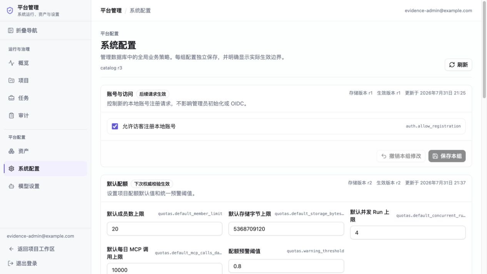

Agent 策略保存为 r2，`max_recursion_limit=777`：

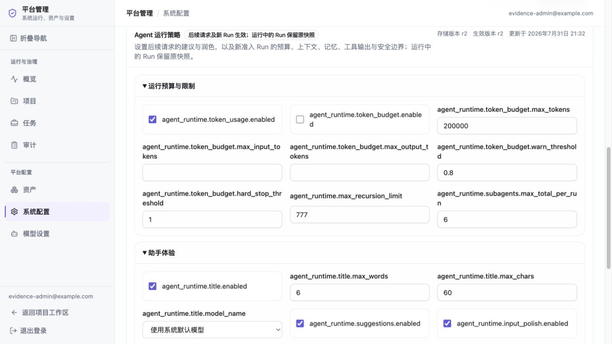

配额保存为 r2，页面显示“无需等待进程刷新”，并发 Run 默认上限为 `4`：

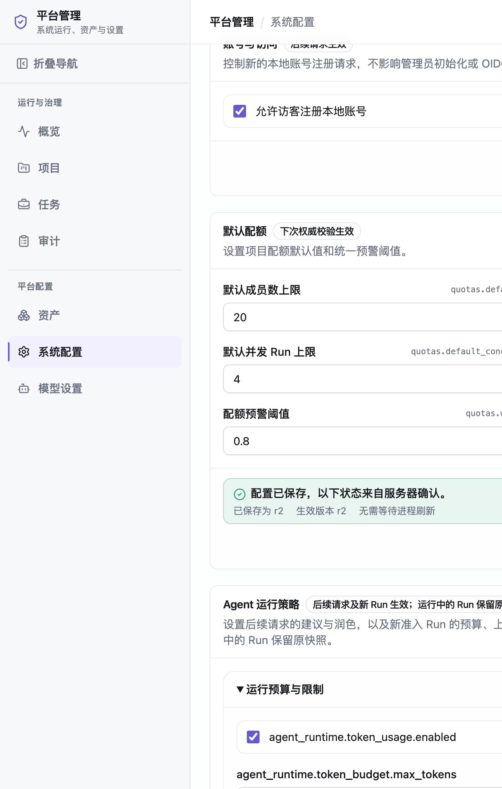

注册策略刷新后为 r2，开关已关闭：


管理员审计页展示三条成功更新及其分区、revision、checksum 和生效范围：

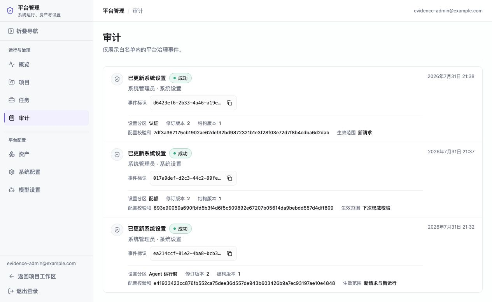

### 管理页可用性改版

改版前，三个 section 在同一长页面中连续展开，Agent 配置直接显示数据库字段名、原始数值和枚举值：

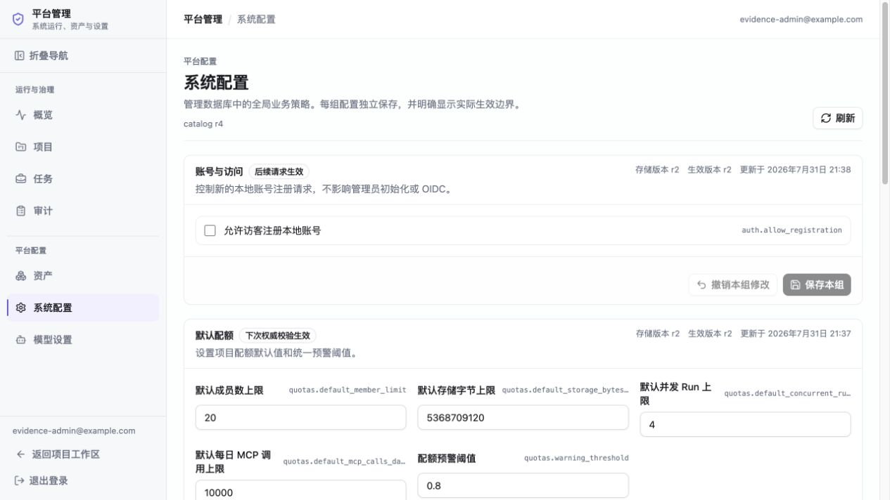

改版后，第一层按管理员任务切换，只呈现当前要处理的一类配置；字段改为中文业务名称、说明、单位和清晰的保存状态：

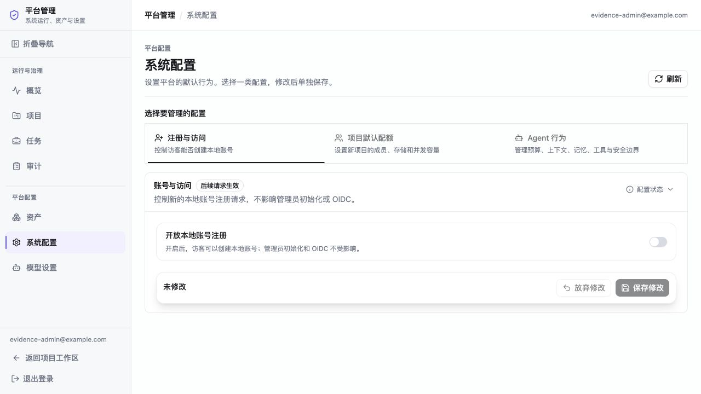

Agent 策略进一步拆为六个分类，每次只显示一个分类，并在底部固定显示本分类的修改状态与保存动作：


上下文配置不再暴露 `agent_runtime.*`、`tokens`、`messages`、`fraction` 等内部名称，关联开关关闭时对应控件会禁用：

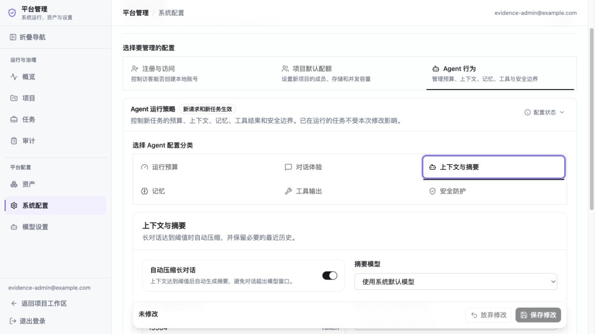

配额页面将原始字节和小数分别换算为 `GiB` 与 `%`，同时补充每个字段的业务含义：

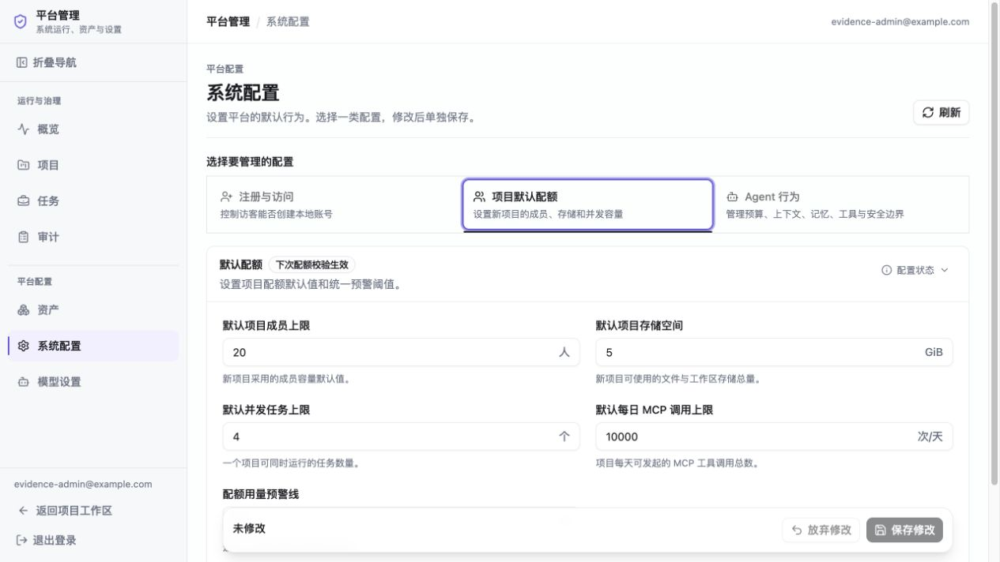

390px 视口下任务导航、表单和保存栏纵向排列；实测 `scrollWidth=clientWidth=375`，没有横向溢出：


浏览器交互验证还覆盖：切换顶层任务和 Agent 分类后草稿不丢失；关闭 Token 预算后预算字段立即禁用；放弃修改会恢复数据库值；产生新修改后不再显示旧的成功提示。

### 对齐与栅格重排

第二轮审查确认，顶层任务和 Agent 分类使用了两层同形 Tab，表单字段又按两列自动流入，导致导航层级、语义配对、提示高度和保存栏基线互相冲突：


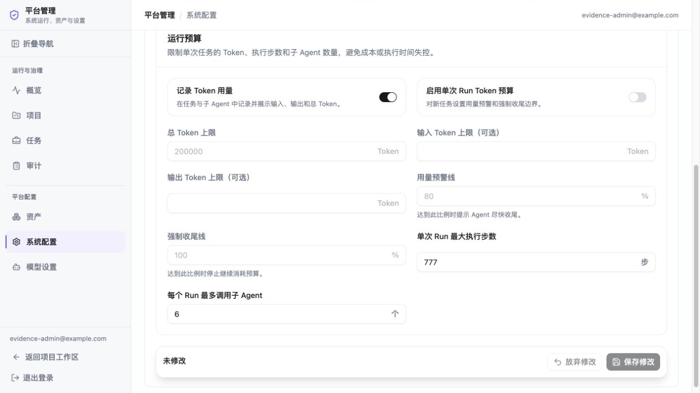

重排后改为单一设置工作台：桌面端使用一个 240px 本地导航，注册、配额和六类 Agent 配置扁平列出；右侧始终只有一个内容面板：


普通字段统一为“名称和说明在左、固定宽度控件在右”的整行布局，不再按 DOM 顺序自动拼成两列：

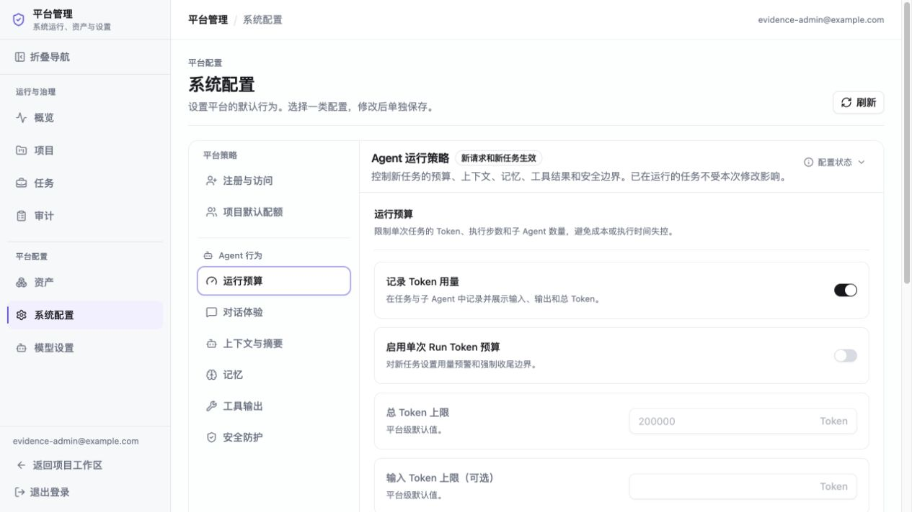

保存区改为贴合主面板左右边界的底部 footer。实测桌面端工作台宽 `977px`、内容面板宽 `735px`、字段左右边界为 `525–1220px`、保存 footer 为 `505–1240px`，其 `20px` 内边距与字段边界精确对齐：


配额与上下文配置使用相同的字段行和控件列，不再出现不同 section 各自排版：

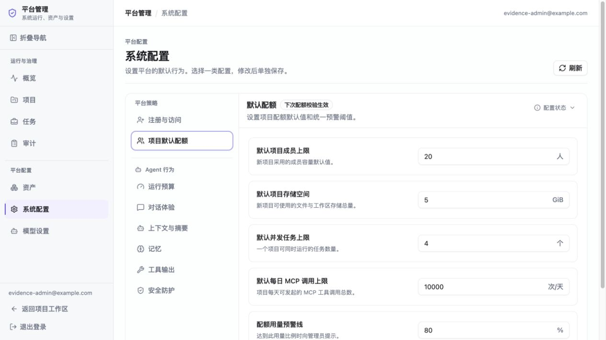

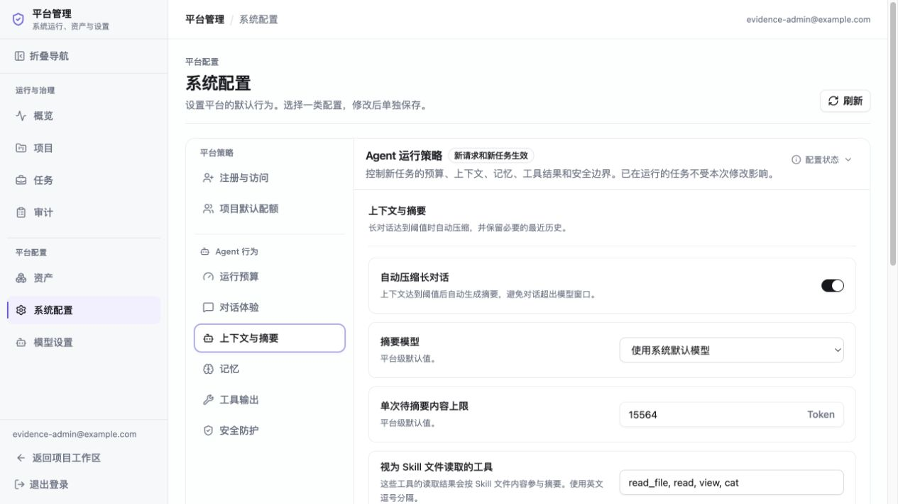

移动端不再显示纵向或多行 Tab，改用一个原生分类选择器；390px 视口实测 `scrollWidth=clientWidth=390`，没有横向溢出：


本轮真实交互还验证：移动端可直接切换到 Agent 运行预算；启用预算后所有依赖字段立即解除禁用；切换到“对话体验”后未保存草稿仍保留；点击“放弃修改”恢复数据库值且未产生保存请求。

## 可复现检查

```bash
bash scripts/check_config_version.sh

cd backend
uv run pytest tests/test_system_runtime_settings.py \
  tests/test_system_runtime_settings_api.py \
  tests/test_system_runtime_settings_postgres.py -q

cd ..
POSTGRES_TEST_URL="$POSTGRES_ADMIN_URL" make test-project-foundation-postgres

cd frontend
pnpm test
pnpm check
pnpm build
```

真实 PostgreSQL 测试只允许使用随机或明确命名的 `deerflow_test_*` 数据库；不得将 `POSTGRES_TEST_URL` 指向业务库。

本次最终执行结果：

- M1-M7 真实 PostgreSQL 发布门禁：`280 passed, 0 failed, 0 skipped`（219.07 秒）。
- 新增系统运行策略 PostgreSQL 聚焦测试：`1 passed`。
- 配置删除、source-absence 与升级契约：`214 passed`；配置版本检查为 `34 / 34`。
- 前端完整单测：`203` 个文件、`1456 passed`、`0 skipped`；`pnpm check` 与 `pnpm build` 均通过。
- `git diff --check` 通过。
