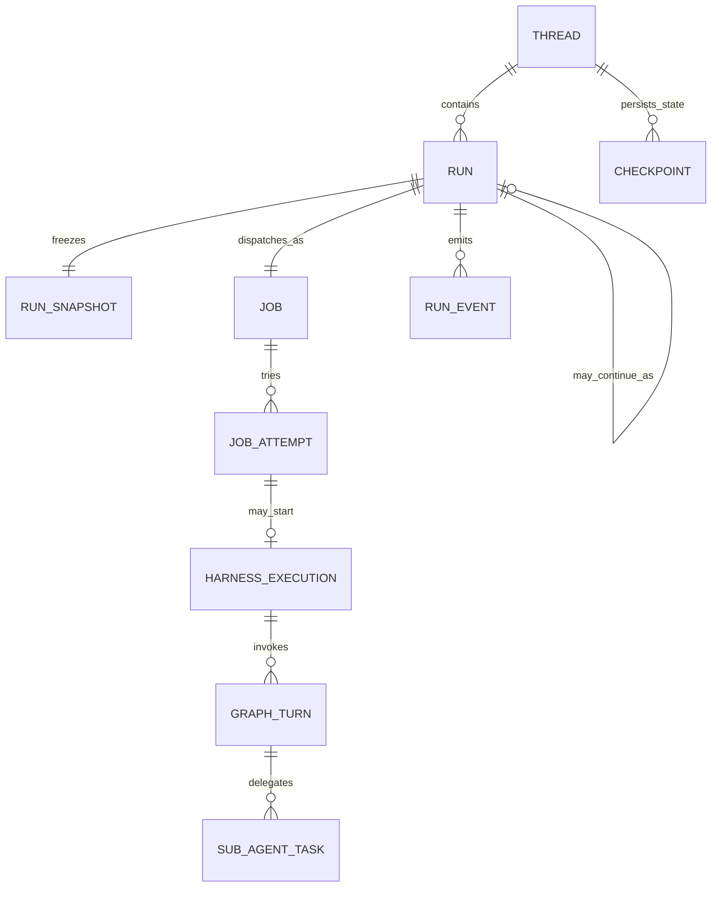
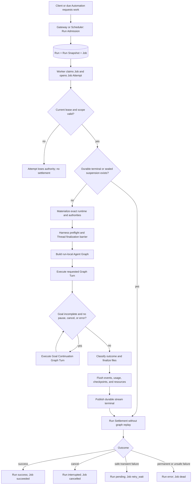

# Harness Execution Model

This document describes the complete execution path for an ActWeave chat or
Automation Run, including the platform boundaries immediately before and after
the harness itself. It follows the domain terms in [`CONTEXT.md`](../CONTEXT.md).

## Scope boundary

The word "harness" is easy to overextend. In this repository there are three
different lifecycles:

1. **Run lifecycle** — interactive or scheduled admission through authoritative
   settlement.
2. **Job lifecycle** — queueing, Worker lease, Job Attempts, retry, and
   dead-letter state.
3. **Harness Execution** — the in-process runtime materialization, Agent Graph
   execution, streaming, checkpointing, and resource finalization performed by
   one Job Attempt.

The harness proper starts when `RunAgentPrivateExecutor` materializes the
admitted Run and invokes `run_agent()`. Admission and Worker settlement are
included below because the harness cannot be understood safely without the
authority they establish and consume.

`private_run` and `automation_run` Jobs share this path. Skill Builder Runs use
the same execution shell with a different Agent factory. Retention, MCP
discovery, and Memory Jobs are other Worker job kinds; they do not execute this
Agent harness.

## Evidence status

- **Confirmed facts**: the identities, state transitions, authority checks, and
  recovery paths below were traced through the current checkout's admission,
  Worker, executor, harness, persistence, and settlement code.
- **Domain interpretation**: the boundaries and preferred names in
  [`CONTEXT.md`](../CONTEXT.md) are a modeling synthesis of those code paths.
- **Not live-verified**: this documentation change did not execute a model,
  PostgreSQL Run, browser stream, external MCP server, or host command. It does
  not claim runtime performance or target-environment availability.

## Identity and cardinality

Two qualifications matter:

- A Job Attempt may recover an already durable terminal or suspension marker
  and settle without starting another Harness Execution.
- A retry creates another Job Attempt for the same Job, Run, and Run Snapshot.
  A human-input or host-execution continuation instead admits a new Run and
  Job linked to the source Run.

## End-to-end control flow

## Phase 1: Run Admission

Run Admission is a platform boundary, not part of the harness proper. Gateway
owns interactive chat, Skill Builder, and approval-continuation admission;
the Automation dispatcher owns Automation occurrence admission, and Scheduler
invokes it for due occurrences. Both paths converge on the same Run Snapshot,
Run, and Job execution contract. In one authoritative decision, the applicable
admission path:

- revalidates the issued Project context and required capabilities;
- locks the Thread and rejects a conflicting active Run;
- strips client-supplied authority while preserving graph input as data;
- resolves the exact Lead Agent dependency closure;
- freezes Agent, model, Skill, MCP, domain-secret Generation, runtime policy,
  and current-upload inputs into the Run Snapshot;
- creates the pending Run and queued Job, reserves concurrent-run quota, and
  records admission audit state; and
- links an approved host-execution or human-input continuation when applicable.

The key invariant is that later execution uses the Run Snapshot, not whatever
configuration happens to be current when a Worker starts.

Primary code:

- `PrivateRunAdmissionService.admit()` in
  [`backend/app/private_work/run_admission.py`](../backend/app/private_work/run_admission.py)
- `AutomationSchedulerService` and `AutomationDispatcher` in
  [`backend/app/scheduler/service.py`](../backend/app/scheduler/service.py) and
  [`backend/app/automations/dispatcher.py`](../backend/app/automations/dispatcher.py)
- `RunRow` in
  [`backend/packages/harness/deerflow/persistence/run/model.py`](../backend/packages/harness/deerflow/persistence/run/model.py)
- `JobRow` and `JobAttemptRow` in
  [`backend/packages/harness/deerflow/persistence/jobs/model.py`](../backend/packages/harness/deerflow/persistence/jobs/model.py)

## Phase 2: Job claim and Execution Lease

The Worker claims only Job kinds it has a registered handler for and, when
required, only work matching its execution-domain affinity. Claiming creates a
Job Attempt and a lease token. The Worker then:

1. marks the Job running;
2. starts a lease heartbeat task;
3. starts the Job handler task; and
4. stops heartbeating before committing the handler's settlement.

The Execution Lease is active authority, not just liveness metadata. Every
Run, checkpoint, stream, file, Memory, secret, and governed side-effect
mutation is ultimately constrained by the same attempt scope. If heartbeat or
lease validation fails, the Worker cancels the handler and the stale Attempt is
not allowed to settle.

Primary code:

- `WorkerService._execute_claim_with_trace()` in
  [`backend/app/worker/service.py`](../backend/app/worker/service.py)
- `JobLeaseAuthority` in
  [`backend/app/worker/service.py`](../backend/app/worker/service.py)

## Phase 3: begin, recover, or take over

`PrivateRunJobHandler` is the sole adapter from a claimed `private_run` or
`automation_run` Job to Agent execution. Before invoking the executor it locks
and revalidates the current Project membership, attaches the Job lease to the
Run, and loads the frozen snapshot.

This phase prefers durable proof over graph replay:

- If the Run event stream already has a terminal frame, the Attempt recovers
  that outcome.
- If a checkpoint-safe host-execution suspension marker exists but its public
  terminal frame was lost, the Attempt recovers the marker and repairs the
  terminal during settlement.
- If a Skill Builder terminal transaction already committed, the Attempt
  recovers it instead of asking the model to repeat the operation.
- If a previous Attempt advanced the checkpoint before losing its lease, the
  new Attempt takes over from the current checkpoint and supplies no duplicate
  graph input.

Only when none of these cases applies does the handler construct a
`PrivateRunExecution` for the executor.

Primary code:

- `PrivateRunJobHandler._begin()` in
  [`backend/app/reliability/run_execution/handler.py`](../backend/app/reliability/run_execution/handler.py)
- `PrivateRunExecution` in
  [`backend/app/reliability/run_execution/contracts.py`](../backend/app/reliability/run_execution/contracts.py)

## Phase 4: runtime materialization

`RunAgentPrivateExecutor` converts the persisted Run Snapshot into live,
attempt-scoped runtime objects. It does not re-resolve user intent. It:

- verifies that Run and Job trace identities match;
- creates one execution boundary for authorization, lease, cancellation, and
  side-effect ambiguity;
- materializes the frozen runtime policy and exact Lead, delegated, title,
  summarization, Memory, and Vision model execution snapshots needed by the Run;
- materializes the admitted Agent prompt bundle, Skills, MCP tools, delegated
  Agent catalog, and short-lived Skill-secret provider;
- creates Project-scoped checkpoint, file, Memory, Vision, and host-execution
  authorities;
- registers an attempt-local `RunRecord`; and
- invokes `run_agent()` through lease-authorized stream and event adapters.

A snapshot mismatch is a deterministic stale-definition failure. It is not
silently replaced with a current asset or model.

Primary code:

- `RunAgentPrivateExecutor._execute_with_trace()` in
  [`backend/app/reliability/run_execution/executor.py`](../backend/app/reliability/run_execution/executor.py)
- private runtime materialization in
  [`backend/app/private_work/asset_runtime.py`](../backend/app/private_work/asset_runtime.py)

## Phase 5: harness preflight

`run_agent()` is the harness execution engine. Before building the graph it:

1. enters the Run's finalization barrier and waits for any earlier Run on the
   same Thread to release its resources;
2. creates the Run Journal and marks the attempt-local Run running;
3. stamps the Worker-owned checkpoint mode and root Thread namespace;
4. validates current and selected historical checkpoint representations;
5. captures the pre-Run rollback point and message boundary;
6. restores the private file projection and records a pre-Run workspace
   baseline where required;
7. publishes Run metadata through the durable stream; and
8. installs trusted runtime context, including scope, models, Skills, MCP tools,
   delegated Agents, file and Memory authorities, channel identity, and the Run
   Journal.

A host-execution Continuation Run is special: its already-approved frozen
command executes before graph construction. The graph receives only the
bounded, durably settled command result; it cannot rewrite the approved plan.

Primary code:

- `run_agent()` in
  [`backend/packages/harness/deerflow/runtime/runs/worker.py`](../backend/packages/harness/deerflow/runtime/runs/worker.py)
- `PrivateFileLifecycle` in
  [`backend/packages/harness/deerflow/runtime/runs/worker.py`](../backend/packages/harness/deerflow/runtime/runs/worker.py)

## Phase 6: run-local Agent Graph construction

The Agent Graph is built once per Harness Execution, off the main event loop,
then bound to the scoped checkpointer and store. Its effective definition comes
from the materialized Run Snapshot.

The Lead Agent factory assembles:

- the exact Lead model and immutable prompt bundle;
- built-in tools allowed by runtime policy;
- admitted MCP tools, with deferred tool discovery where configured;
- immutable Run Skills and Skill-scoped secret access;
- the delegated Agent catalog and `task`-style delegation tools;
- optional Memory and Vision capabilities; and
- the middleware chain.

The shared middleware spine has distinct semantic layers:

1. untrusted-content sanitation and tool-output budgeting;
2. Thread, sandbox, and upload infrastructure;
3. transcript repair and stable model-error translation;
4. request shaping, Skill activation, context management, summarization, and
   execution budgets; and
5. the tool-call boundary: host-approval barriers, sandbox audit,
   read-before-write, progress, guardrails, and stable tool-error handling.

Registration order is security-sensitive because middleware wrappers nest.
The canonical assembly validates ordering invariants instead of relying on
individual callers to reproduce them.

Primary code:

- Lead Agent factory in
  [`backend/packages/harness/deerflow/agents/lead_agent/agent.py`](../backend/packages/harness/deerflow/agents/lead_agent/agent.py)
- canonical middleware assembly in
  [`backend/packages/harness/deerflow/agents/middlewares/assembly.py`](../backend/packages/harness/deerflow/agents/middlewares/assembly.py)
- mode-aware checkpoint binding in
  [`backend/packages/harness/deerflow/runtime/checkpoint_state.py`](../backend/packages/harness/deerflow/runtime/checkpoint_state.py)

## Phase 7: Graph Turns, models, tools, and Sub-Agent Tasks

For each Graph Turn the harness drives `agent.astream(...)`:

1. the Lead model receives materialized Thread state shaped by middleware;
2. a final assistant message ends the model/tool loop;
3. tool calls pass through the complete tool boundary before execution;
4. tool results return as graph messages and may lead to another model call;
5. graph state is checkpointed at LangGraph durability boundaries; and
6. requested stream modes are converted to durable Run Event frames.

Large file-tool chunks are batched and text deltas may be coalesced before
publication, but this changes transport granularity rather than graph state or
business outcome.

### Sub-Agent Tasks

A Lead Agent may delegate through a Sub-Agent Task. The Sub-Agent:

- creates its own graph, model loop, middleware instances, turn limit, token
  collector, and result state;
- filters tools and Skills to the delegated Agent profile;
- may execute on an isolated event loop with bounded process-wide concurrency;
- reports start, step, result, stop reason, and token usage back to the Lead
  path; and
- inherits the parent `run_id`, Thread/sandbox projection, private scope,
  authorization boundary, file authority, immutable Skill snapshot, and
  host-execution approval port.

Therefore a Sub-Agent Task is nested execution inside the same Run. It does not
create a Job, Job Attempt, or independent Run terminal.

Primary code:

- `SubagentExecutor` in
  [`backend/packages/harness/deerflow/subagents/executor.py`](../backend/packages/harness/deerflow/subagents/executor.py)
- persisted Sub-Agent step shaping in
  [`backend/packages/harness/deerflow/subagents/step_events.py`](../backend/packages/harness/deerflow/subagents/step_events.py)

### Goal Continuations

After the requested Graph Turn becomes quiescent, the harness may evaluate an
active goal. If the goal is incomplete, it supplies a hidden continuation input
and invokes the same Agent Graph again. This is another Graph Turn inside the
same Run, Job Attempt, checkpoint lineage, event stream, and usage total.

Goal Continuation stops when the goal completes, the evaluator declines to
continue, cancellation occurs, an error fallback is observed, or host-execution
approval is staged.

## Phase 8: four persistence planes

The execution path intentionally does not overload one persistence mechanism
with every responsibility.

| Plane | Authority | Purpose | It is not |
| --- | --- | --- | --- |
| Run, Job, Job Attempt | PostgreSQL business rows | User outcome, scheduling, lease, retry, usage, terminal settlement | Graph state |
| Run Snapshot | PostgreSQL version references and governed assets | Exact executable definition | Current configuration |
| Checkpoint | Project-scoped LangGraph saver | Materialized messages and graph channels for resume or rollback | UI event log |
| Run Event | Ordered PostgreSQL event sequence | Durable stream replay, progress, traces, Sub-Agent steps, workspace summaries | Executable graph state |

Stream publication is store-first: the event commits before best-effort
notification. Notification reduces latency; replay reads the durable sequence.
Every private stream mutation is also lease- and scope-authorized.

The Run Journal adds lifecycle, model, tool, message, latency, and token-usage
observations to the Run Event store. It also produces attempt-local usage that
Run Settlement adds to the Run's cumulative totals.

Primary code:

- store-first streaming in
  [`backend/packages/harness/deerflow/runtime/events/stream.py`](../backend/packages/harness/deerflow/runtime/events/stream.py)
- ordered event persistence in
  [`backend/packages/harness/deerflow/runtime/events/store/db.py`](../backend/packages/harness/deerflow/runtime/events/store/db.py)
- lease-authorized stream adapter in
  [`backend/app/reliability/run_execution/stream_authority.py`](../backend/app/reliability/run_execution/stream_authority.py)
- Run Journal in
  [`backend/packages/harness/deerflow/runtime/journal.py`](../backend/packages/harness/deerflow/runtime/journal.py)

## Phase 9: outcome classification and resource finalization

An assistant message is not by itself a successful Run. After the graph stops,
the harness applies business outcome rules:

- cancellation with rollback restores the pre-Run checkpoint and rejects file
  publication;
- ordinary interruption may finalize safe file changes, while authorization
  revocation fails closed;
- a model fallback or typed public execution error classifies the Run as error;
- normal completion must finish File Finalization and satisfy any required
  output-delivery obligation before success; and
- a staged host approval may terminate the source Run successfully only after
  its checkpoint-safe suspension marker can be sealed.

The `finally` path flushes Sub-Agent events, workspace-change observations, the
Run Journal, and attempt usage; releases file authority, the private runtime,
and read-only mounts; updates Thread metadata best-effort; seals an approval
suspension before the public success terminal; and publishes the durable stream
terminal.

There are two deliberately different failure boundaries:

- Failure during required File Finalization prevents success.
- Failure in best-effort resource teardown after the response, checkpoint, and
  file result are already durable does not rewrite a completed success into an
  execution error. The finalization barrier remains closed for safety and the
  Worker logs the cleanup failure.

## Phase 10: authoritative Run Settlement

The executor converts the attempt-local `RunRecord` plus execution-boundary
state into `AgentExecutionResult`. The Job handler then re-locks the current
scope and commits one authoritative settlement while the lease is still valid.

Settlement converges:

- Run status and error;
- Job status and current Job Attempt outcome;
- cumulative token usage by caller and model;
- concurrent-run quota and audit terminal state;
- host-execution approval or continuation output-delivery state;
- Skill Builder operation state where applicable; and
- repair of a missing successful stream terminal when durable proof exists.

The main status relationships are:

| Situation | Run | Job | Current Job Attempt |
| --- | --- | --- | --- |
| Admitted, not claimed | `pending` | `queued` | none |
| Executing | `running` | `running` | open |
| Successful settlement | `success` | `succeeded` | `succeeded` |
| Cancelled settlement | `interrupted` | `cancelled` | `cancelled` |
| Safe retryable failure with attempts left | `pending` | `retry_wait` | `retry` |
| Permanent, exhausted, or unsafe failure | `error` | `dead` | `dead` |
| Execution Lease lost | unchanged until takeover/reconciliation | lease expires or is reclaimed | `lease_lost` or later reconciliation |

A transient error is retried only when Retry Safety remains `safe` and the Job
has attempts remaining. If an external side effect may have happened but cannot
be proven, settlement changes Retry Safety to `unknown`; the Job is dead-lettered
instead of blindly replaying the action.

Primary code:

- result classification in
  [`backend/app/reliability/run_execution/executor.py`](../backend/app/reliability/run_execution/executor.py)
- atomic handler settlement in
  [`backend/app/reliability/run_execution/handler.py`](../backend/app/reliability/run_execution/handler.py)
- Run/Job convergence in
  [`backend/app/private_work/run_repository.py`](../backend/app/private_work/run_repository.py)
- retry/dead decision in
  [`backend/packages/harness/deerflow/persistence/jobs/sql.py`](../backend/packages/harness/deerflow/persistence/jobs/sql.py)

## Edge-case tests for the model

These scenarios distinguish concepts that otherwise look interchangeable:

| Scenario | Correct domain interpretation |
| --- | --- |
| The provider fails before any governed side effect. | The Job may enter `retry_wait`; a new Job Attempt resumes the same Run and Run Snapshot. |
| The Worker loses its lease after an external call whose outcome is unknown. | The stale Attempt cannot settle. If ambiguity is confirmed, Retry Safety becomes `unknown` and automatic replay is prohibited. |
| The graph checkpoint committed, then the Worker died before Run Settlement. | The next Attempt takes over from the checkpoint or recovers a durable terminal; it does not re-admit the Run. |
| A Sub-Agent performs three model/tool steps. | Those are nested steps of one Sub-Agent Task in the parent Run, not three Runs or Jobs. |
| An active goal needs two additional passes. | The Run contains three Graph Turns: the requested turn plus two Goal Continuations. |
| A host command needs approval. | The source Run seals a Host Execution Suspension and terminates. Approval later admits a distinct Continuation Run and Job. |
| The model produced an answer but required file publication failed. | File Finalization is incomplete, so the Run is an error despite visible assistant text. |
| Resource teardown fails after response, checkpoint, and files are durable. | The successful Run remains successful; the finalization barrier and Worker log carry the operational fault. |
| Cancellation arrives after a sealed approval suspension marker. | The durable checkpoint-safe marker wins; settlement recovers success and preserves the exact continuation boundary. |

## Non-negotiable invariants

1. Client input is data, never execution authority.
2. A Run executes its frozen Run Snapshot, never silently substituted current
   assets or policy.
3. Only the live Execution Lease may mutate or settle the Run.
4. Run, Job, Job Attempt, Graph Turn, and Sub-Agent Task remain distinct
   identities.
5. Checkpoints drive execution; Run Events describe execution.
6. Durable recovery proof is preferred over replay.
7. Automatic retry requires both a retryable failure and safe replay.
8. User-visible success requires business finalization, not merely a model
   response.
