# DeerFlow 记忆系统重构执行计划

- 日期：2026-08-05
- 状态：核心重构 PR1—PR8 已完成；PR9—PR12 代码与离线测试完成，PR13 待执行，真实环境终验待完成
- 基线分支：`dev`
- 设计依据：[记忆系统改造方案](./memory-system-refactor-plan.zh-CN.md)
- 后续计划：[Memory v2 稳定化与个性化执行计划](./memory-system-refactor-stabilization-execution-plan.zh-CN.md)
- 实施范围：Owner-private Project Memory

## 1. 这份计划解决什么问题

本计划把记忆系统改造拆成可以逐个实现、逐个测试、逐个回滚的小 PR。

目标流程是：

```text
成功 Run
  → 保存可处理的用户消息
  → Worker 提取候选记忆
  → 定时整理候选
  → 生成带版本的正式事实
  → 后续 Run 只召回已生效事实
```

借鉴 nanobot 的内容只有“两阶段记忆”思想：先形成候选，再整理成长期记忆。
DeerFlow 继续使用 PostgreSQL、现有 Job/Worker、Project + Owner 隔离和低权限 Memory
注入，不照搬 nanobot 的 Markdown、Workspace 全局记忆或 Dream 修改 Skill 的做法。

## 2. 必须遵守的执行纪律

### 2.1 一次只做一个 PR

每个 PR 都按以下顺序执行：

1. 从上一阶段已经提交且工作区干净的分支开始；
2. 先补本阶段失败测试；
3. 只修改本阶段列出的文件和职责；
4. 跑完本阶段验证；
5. 检查 diff，确认没有跨阶段实现；
6. 提交当前 PR 后，才能进入下一阶段。

禁止把多个 PR 长时间堆在同一个未提交工作区中。

### 2.2 不擅自扩大范围

以下内容不属于本轮实施：

- 防伪、签名回执、证据权威、外部评审身份体系；
- 为评测单独建设服务、数据库框架或复杂审计链；
- 新建微服务、Kafka、Redis、向量数据库；
- 跨项目 Personal Memory；
- 团队共享知识库；
- 让聊天自动修改 Agent、Prompt、Skill 或系统策略；
- 重新设计 LangGraph checkpoint 或 Thread 消息存储；
- 为假设性风险增加不可达的安全抽象。

如果实现时发现范围外问题：

- 能证明当前调用链会导致数据泄露、越权或数据丢失：停止当前 PR，报告事实和最小修复；
- 只有理论可能、当前没有入口：记录到 PR 说明，不写代码；
- 需要新增表、服务、状态机或跨模块协议：先修改计划并取得确认，不能自行加入。

### 2.3 单一写入者

同一时间只允许一个执行者修改代码。并行任务只能做只读检查或代码审查，不能同时修改共享工作区。

### 2.4 每个 PR 都要有可核对结果

每个 PR 完成时必须报告：

- 实际修改的文件；
- 新增和删除的代码规模；
- 执行过的测试及结果；
- 未执行的环境验证；
- 是否满足退出标准；
- 下一阶段是否允许开始。

## 3. 不变的产品和架构边界

### 3.1 五类信息保持分离

| 信息 | 本轮处理方式 |
|---|---|
| Thread Context | 继续使用现有 PostgreSQL checkpoint、消息和 Thread 摘要 |
| Owner-private Project Memory | 本轮重构对象，范围固定为 Project + Owner + namespace |
| Personal Memory | 不实现 |
| Shared Project Knowledge | 不实现 |
| Agent Policy / Skill | 不允许从聊天自动修改 |

Thread 摘要只帮助当前 Thread 延续任务，不作为长期记忆候选。长期记忆从成功 Run 的受限用户消息独立产生。

### 3.2 基本安全边界

本轮只实现必要的基本安全：

1. 每次数据库读写都绑定 `project_id + owner_user_id + namespace`；
2. Gateway 只负责准入，Memory 模型只在 Worker 中执行；
3. 第一版只从用户明确消息提取，排除 System、隐藏消息、assistant 自述和任意 Tool 输出；
4. 密码、token、Credential 和明显敏感内容在调用模型前过滤；
5. Candidate 在成为 active Fact 前不能进入自动注入或 `memory_search`；
6. Memory 正文不写入通用日志、审计字段和公开运维接口；
7. 权限撤销和 hard forget 必须在下一次模型调用前生效。

除此之外，不继续深挖新的安全体系。

### 3.3 数据库边界

- PostgreSQL 仍是唯一权威存储；
- 复用现有 `jobs`、Worker lease、heartbeat、retry 和 dead 状态；
- 不增加第二套任务状态机；
- 分支基线 `dev` 使用 `full_schema_v1`；PR2 加入完整 Memory v2 表后一次性升级为 `full_schema_v2`；
- 仓库不提供增量迁移，因此旧数据库不能执行临时 `ALTER` 或手工改 marker；
- PostgreSQL 测试只使用随机 `deerflow_test_*`，不连接正常开发数据库；
- 是否重建正常开发数据库必须单独确认，不能由测试命令顺带执行。

## 4. 最终运行形态

```mermaid
flowchart LR
    A["成功 Run"] --> B["Source Batch + Source Items"]
    B --> C["memory_extract Job"]
    C --> D["Worker Extractor"]
    D --> E["Candidates"]
    E --> F["定时 memory_consolidate Job"]
    F --> G["Worker Consolidator"]
    G --> H["Facts + Revisions + Evidence"]
    H --> I["Run Memory Snapshot"]
    I --> J["自动注入 / memory_search"]
```



Scheduler 只定时创建 `memory_consolidate` Job；真正的整理始终由 Worker 执行。

Candidate 整理完成后不立即物理删除：

- `accepted`、`rejected`、`superseded` 保留 30 天用于查看和排错；
- 到期后由 retention job 清除 Candidate 正文；
- Fact Revision 和 Evidence 保留长期来源关系；
- `pending` Candidate 不因定时任务自动丢弃；
- hard forget 立即按用户请求清除相关正文。

## 5. PR 总览

| PR | 目标 | 是否改变正式召回 |
|---|---|---|
| PR1 | 修复现有 Memory 正确性问题 | 否 |
| PR2 | 一次性加入完整 Memory v2 Schema 和 Job 契约 | 否 |
| PR3 | 成功 Run 原子创建 Source Batch 和 Extract Job | 否 |
| PR4 | Worker 生成影子 Candidate | 否 |
| 检查点 A | 用固定样例验证提取质量和可靠性 | 否 |
| PR5 | 定时 Consolidator 生成 Fact Revision | 否 |
| PR6 | 管理 API、Retention、Export 和 Hard Forget | 否 |
| PR7 | Run Snapshot 和 v2 Recall 切换 | 是，可回退 |
| PR8 | 新版 Memory 页面和旧链路清理 | 是 |

依赖关系固定为：

```text
PR1 → PR2 → PR3 → PR4 → 检查点 A → PR5 → PR6 → PR7 → PR8
```

不得跳过检查点 A 直接进入 PR5。

### 5.1 执行记录

| 阶段 | 状态 | 提交 | 当前检出验证 |
|---|---|---|---|
| PR1 | 完成 | `29bbf77d` | 旧 Memory 聚焦测试 45 passed；随机 PostgreSQL 1 passed |
| PR2 | 完成 | `7c2a4030` | 后端全量 714 passed、27 skipped；随机 PostgreSQL 5 passed、0 skipped；前端全量 121 passed；Python lint/format 与前端 lint/typecheck 通过 |
| PR3 | 完成 | `82f111da` | 后端核心门禁 756 passed、0 skipped；PR3 聚焦单元测试 6 passed；PR3 随机 PostgreSQL 9 passed；Python lint/format 通过 |
| PR4 | 完成 | `22609495` | 后端核心门禁 781 passed、0 skipped；PR4 聚焦单元测试 17 passed；PR4 随机 PostgreSQL 8 passed；Python lint/format 通过 |
| 检查点 A | 完成 | `f25b2a4b` | 固定样例 64 条/8 Batch；precision 100%；recall 100%；secret、scope、duplicate、batch error 均为 0；PR2—PR4 随机 PostgreSQL 21 passed；后端核心 787 passed、0 skipped |
| PR5 | 完成 | `220eb6f8` | PR5 聚焦单元测试 20 passed；PR2—PR5 与精确版本随机 PostgreSQL 36 passed；后端核心 821 passed、0 skipped；Python lint/format 通过 |
| PR6 | 完成 | `23bde1b8` | PR6 API/轮换聚焦单元测试 18 passed；PR6 管理/隐私随机 PostgreSQL 9 passed；PR1—PR6 随机 PostgreSQL 44 passed；后端核心 848 passed、0 skipped；Python lint/format 通过 |
| PR7 | 完成 | `28195187` | PR7 运行时聚焦测试 10 passed；PR7 随机 PostgreSQL 5 passed；PR1—PR7 随机 PostgreSQL 49 passed；后端核心 863 passed、0 skipped；Python lint/format 通过 |
| PR8 | 完成 | 本次 PR8 提交 | 后端聚焦 177 passed；PR1—PR8 随机 PostgreSQL 50 passed；后端核心 866 passed、0 skipped；前端 unit 135 passed、核心 E2E 1 passed、静态 E2E 2 passed；生产构建、前端 check/format、Python lint/format 与 `git diff --check` 通过 |

PR2 没有注册 Memory Worker handler、没有接入 Run settlement、没有调用模型、没有启用
`shadow`，因此正式召回仍完全使用 v1。外部模型、容器和部署环境不属于 PR2 验证范围。

执行 PR3 完整门禁时同时修复了两个独立基线问题并单独提交为 `2edcfc6e`：System Skill
文件重放比较不再依赖 PostgreSQL 排序规则，checkpoint 参数化测试不再共享进程冻结状态。
该提交没有包含 Memory PR3 功能代码。

PR4 只注册 `memory_extract`：Worker 从对应 Generation 的 Source Items 构造固定 JSON 输入，
使用来源 Run 冻结的 Memory/Lead 模型版本执行无工具、无正文 tracing 的严格提取，并在同一
事务中写入稳定 ID 的 pending Candidate、更新 `candidate_committed_at` 和结算 Job。模型调用后
发生 suppression、权限撤销或 lease 丢失时不会落 Candidate；空结果会正常完成，Candidate 仍不
进入 v1 召回。PR4 没有创建 Fact、管理 API、Gate、签名或新的调用账本；真实外部模型质量留给
检查点 A 验证。当前平台的持久 token usage 只归属于 Run，因此 PR4 不把后台 Shadow 调用伪写
进已经完成的来源 Run。PR4 Extractor 与 PR5 Consolidator 在本次重构中明确归为平台成本：不扣
用户 token budget、不占 Project Run quota，也不新增专用调用账本；检查点报告只记录模型、
调用次数、延迟和供应商侧可得成本。以后若需要按用户或 Project 计费，再单独立项。

PR5 复用现有 Scheduler、Worker 和 `jobs`：Scheduler 只按当前策略冻结精确 Policy Revision
与 Model ID/Version/Checksum，按 `project + owner + namespace` 幂等准入最多 20 条到期
Candidate；Worker 才执行固定、无工具、无 tracing 的 Consolidator。相同事实只新增 Evidence
并刷新确认时间，补充和纠正创建新 Revision，证据不足保持 pending，敏感或治理变更标记
rejected；Candidate 决策、Fact/Revision/Evidence 和 Job 结算处于同一事务。Revision 漂移会回滚
并由原 Job 有界重试；瞬时错误耗尽尝试后由 Scheduler 最多自动接续一次同一冻结 Generation，确定性错误
保持 dead；运营暂停会释放未处理绑定且保留 backlog。`memory_retention_purge` 持久化准入时的
精确截止时间，且只在该截止时间前的 terminal Candidate 上执行；它不依赖整理模型可用。该 Job 只在保留期
后擦除 terminal Candidate 正文，不处理 pending，也不删除 Fact/Revision/Evidence。PR5 没有新增
服务、表、签名、调用账本、管理 API 或 v2 Recall，正式召回仍只使用 v1。

PR6 在保留全部 v1 路由的同时新增 `/memory/v2/*` 管理面：用户可以查看 Fact、Revision、
Evidence 和 Candidate，以时间戳或版本 CAS 接受、拒绝、编辑、disable、restore 和 hard forget，
并以 owner-scoped NDJSON 导出 v2 数据。Thread/Run 删除会先擦除 Source/Candidate 正文、断开
Evidence/Revision locator、写 source suppression 并取消相关 Memory Job；活跃 Run 存在时拒绝
删除 Thread，避免结算竞态重新产生来源。hard forget 额外擦除 Fact Revision、Summary 和 Recall
Snapshot 正文，且 retained HMAC key 仍参与 suppression 匹配。Run 因不可删除的 Job 关系保留
不可见的脱敏 shell，同时显式删除 RunEvent、Feedback、Artifact 等正文子项。Owner/project
retention 与 Privacy Center export 已覆盖全部 v2 表。PR6 没有新增表、服务、capability 或模型调用，
也没有切换正式召回；v1 仍是唯一生产召回来源。

PR7 不修改 Schema：Run 第一次读取 v2 Memory 时，在原有 Run-bound authority 的同一授权事务
内创建唯一 Recall Snapshot，并按 `guaranteed category → confidence → revision sequence → fact ID`
冻结最多 500 条 active exact Revision。自动注入按冻结 token budget 渲染 ordered items，
`memory_search` 对同一组 items 继续使用 Unicode/CJK 词法排序；空 Snapshot 的 ceiling 为 `0`。
同一 Run 的 retry/resume 不跟随新 Fact 或新 Revision，新 Run 才读取最新事实。每次模型边界会
重验 authority，并从原 items 应用 disable/hard-forget overlay；渲染在线程中执行，外层 5 秒
超时保持有效。隐藏 Memory 仍是 HumanMessage，新 Run 原位替换旧 Memory，不累加历史正文。
冻结模式为 `off`、`shadow` 或 `consolidate` 时继续使用 v1；从 v2 回退时只看最新权威 marker，
跨午夜也不会重复注入。PR7 没有增加 pgvector、新表、服务、Job 或新的安全框架。

## 6. PR1：修复现有 Memory 正确性问题

### 6.1 目标

在不增加新表、不增加新 Job、不改变召回语义的前提下，先解决现有链路已经确认的问题。

### 6.2 实施内容

- 旧进程内队列的串行键从 `project + owner + namespace + thread` 收紧为
  `project + owner + namespace`；
- 旧 updater 遇到乐观锁冲突时重新读取最新 Memory，并最多重试 3 次；
- 读取不存在的 Memory 时返回虚拟空结果，不创建数据库行；
- Memory 注入失败不能与 date reminder 共用“已处理”状态，下一 turn 可以重试；
- API `updatedAt` 使用数据库更新时间，不使用请求时间；
- import/export 使用严格 schema、字段长度和事实数量上限；
- 删除没有实际效果的 reload 行为，或者让 API 明确返回不支持。

### 6.3 主要文件

- `backend/packages/harness/deerflow/agents/memory/queue.py`
- `backend/packages/harness/deerflow/agents/memory/updater.py`
- `backend/packages/harness/deerflow/agents/memory/storage.py`
- `backend/packages/harness/deerflow/agents/middlewares/dynamic_context_middleware.py`
- `backend/packages/harness/deerflow/persistence/private_work/memory_repository.py`
- `backend/app/private_work/memory_service.py`
- `backend/app/gateway/routers/project_memory.py`
- 对应 `backend/tests/test_private_memory_*` 和 `test_project_memory_*`

### 6.4 明确不做

- 不修改 `full_schema.sql`；
- 不增加 Candidate、Fact 或 durable Memory Job；
- 不修改前端页面；
- 不改变现有 Memory JSON 对外结构。

### 6.5 退出标准

- 两个 Thread 并发更新同一份 Memory 不再静默丢失；
- CAS 冲突会成功重试或返回明确失败；
- GET、自动注入和 `memory_search` 不会创建空 Memory 行；
- 注入失败后下一 turn 能重试；
- 现有 Memory 聚焦测试全部通过。

## 7. PR2：完整 Schema 与运行契约

### 7.1 目标

一次性冻结后续阶段需要的表和 Job 类型，避免每个 PR 继续改变 Schema。

### 7.2 新增表

本 PR 只增加以下必要表：

- `memory_source_batches`
- `memory_source_items`
- `memory_extraction_generations`
- `memory_candidates`
- `memory_consolidation_generations`
- `memory_facts`
- `memory_fact_revisions`
- `memory_fact_evidence`
- `memory_context_summaries`
- `memory_suppressions`
- `run_memory_context_snapshots`
- `run_memory_context_items`

不增加评测回执、评审身份、证据签名、专用模型调用账本等表。

### 7.3 状态和 Job 类型

Candidate 状态固定为：

```text
pending → accepted | rejected | superseded
```

Fact 状态固定为：

```text
active → disabled | superseded | deleted
disabled → active
```

新增 Job 类型：

- `memory_extract`
- `memory_consolidate`
- `memory_retention_purge`

Pipeline 模式固定为：

| 模式 | 行为 |
|---|---|
| `off` | 不创建新的 Source Batch |
| `shadow` | 生成 Candidate，仍由 v1 召回 |
| `consolidate` | 生成 Candidate 和 Fact，仍由 v1 召回 |
| `v2` | v2 Fact 成为召回来源 |

默认值必须是 `off`，每次 Run 准入时冻结实际模式。

### 7.4 主要文件

- `backend/packages/harness/deerflow/persistence/full_schema.sql`
- `backend/packages/harness/deerflow/persistence/bootstrap.py`
- `backend/packages/harness/deerflow/persistence/final_schema_contract.py`
- `backend/packages/harness/deerflow/persistence/private_work/model.py`
- `backend/packages/harness/deerflow/persistence/jobs/model.py`
- `backend/packages/harness/deerflow/persistence/jobs/sql.py`
- `backend/app/final_schema.py`
- `backend/app/reliability/workers.py`
- `backend/app/reliability/operations.py`
- `backend/scripts/setup_postgres.py`
- `backend/scripts/check_postgres.py`

### 7.5 明确不做

- 不接入 Run settlement；
- 不注册 Worker handler；
- 不调用模型；
- 不启用 `shadow`；
- 不尝试升级旧数据库。

### 7.6 退出标准

- 新空库可以通过 `make setup-db` 完整创建 `full_schema_v2`；
- `make check-db` 能识别完整 v2 Schema；
- `full_schema_v1` 和未知 marker 被只读拒绝；
- 复合作用域外键覆盖 Project + Owner + namespace；
- Job 类型、状态约束和 ORM/SQL 定义一致；
- 随机 PostgreSQL Schema 测试 0 skip。

## 8. PR3：Source Batch 原子准入

### 8.1 目标

成功 Run 结算时，把允许处理的消息和 `memory_extract` Job 一起可靠写入 PostgreSQL。

### 8.2 实施内容

- 只处理最终成功的 Run attempt；
- 第一版 Source Item 只接收明确的用户消息；
- 普通 Run 读取 `input.messages`；Command Run 按真实执行优先级只读取
  `command.update.messages`，不把 resume payload 当作来源；
- `non_interactive` Run 不创建长期记忆来源；
- 排除 System、隐藏框架消息、assistant 消息和全部 ToolMessage；
- 对明显密码、token、Credential 和上传包装执行确定性过滤；
- 在 Run 成功 settlement 的同一事务中创建：
  - 一个幂等 Source Batch；
  - 有序且不可变的 Source Items；
  - 第一条 Extraction Generation；
  - 一个 `memory_extract` Job；
- `off` 模式不创建任何 Memory v2 数据；
- 重复 settlement 依赖唯一键返回原结果，不重复入队。

### 8.3 幂等身份

Source Batch 身份只由以下内容决定：

```text
project + owner + namespace + run + successful attempt + ordered source item identity
```

模型、Prompt 和 Extractor 版本属于 Extraction Generation，不进入 Source Batch 身份。

### 8.4 主要文件

- `backend/app/reliability/execution.py`
- `backend/app/reliability/jobs.py`
- 新增 `backend/packages/harness/deerflow/persistence/private_work/memory_v2_repository.py`
- 新增 `backend/app/private_work/memory_source_admission.py`
- 对应 Source admission 单元测试和 PostgreSQL 测试

### 8.5 明确不做

- 不执行 `memory_extract` Job；
- 不调用模型；
- 不创建 Candidate；
- 不读取当前长期 Memory；
- 不修改召回。

### 8.6 退出标准

- 成功 Run 原子产生完整 Batch/Items/Generation/Job；
- 失败或取消 Run 不产生 Batch；
- 重放相同 settlement 不产生重复数据；
- Source Items 顺序稳定且只来自允许的用户消息；
- 任一插入失败会回滚整个 settlement 事务；
- 不同 Project、Owner、namespace 无法错误关联。

## 9. PR4：Shadow Extractor 与 Candidate

### 9.1 目标

让 Worker 使用现有 Job 机制处理 Source Batch，只生成影子 Candidate，不影响正式召回。

### 9.2 实施内容

- 注册 `memory_extract` Worker handler；
- 使用现有 `claim_next`、lease、heartbeat、retry 和 settlement；
- 使用专用固定 Prompt 和严格 Pydantic 输出；
- Extractor 只能读取本 Generation 的 Source Items；
- 不加载当前 Memory、Thread Summary、Skills 或普通 Agent 工具；
- 模型调用前、结果提交前再次检查作用域、lease、Pipeline 模式和 suppression；
- Candidate 使用稳定幂等键，重试不会重复写入；
- Candidate 保存来源 Source Item、类型、内容、置信度和状态；
- 模型输入输出正文不进入通用日志、audit 或 tracing；
- 复用现有模型目录和 Credential，不新增专用调用账本；现有持久 token usage 只归属于 Run；
  非 Run Extractor/Consolidator 明确归为平台成本，不扣用户 token budget 或 Project Run quota，
  也不污染已完成来源 Run。

### 9.3 主要文件

- 新增 `backend/packages/harness/deerflow/agents/memory/extractor.py`
- 新增 `backend/app/worker/memory_extract.py`
- `backend/app/worker/app.py`
- `backend/app/worker/service.py`
- `backend/app/reliability/workers.py`
- Memory v2 repository 和对应测试

### 9.4 明确不做

- 不自动接受 Candidate；
- 不创建 Fact；
- 不增加 Candidate 管理 API；
- 不改变自动注入和 `memory_search`；
- 不建设 Gate、签名、回执或外部审核系统。

### 9.5 退出标准

- 正常处理能生成可追溯 Candidate；
- Worker 在模型调用前退出时可以重试；
- Worker 在模型调用后、提交前退出时允许再次调用模型，但 Candidate 只提交一次；
- 两个 Worker 竞争同一 Job 时只有一个有效提交；
- lease 丢失后旧 Worker 不能提交结果；
- Candidate 不会进入任何召回路径；
- 相关单元测试和随机 PostgreSQL 测试通过。

## 10. 检查点 A：简单质量验证

检查点 A 是一次发布判断，不是需要长期维护的新平台。

### 10.1 产物

只允许增加：

- 一个固定 JSONL 样例文件；
- 一个简单评测脚本；
- 一份普通 JSON 或 Markdown 结果报告。

不增加数据库表、签名、回执、身份验证器、证据 authority、专用执行器或复杂 runbook。

### 10.2 样例

准备不少于 50 条中文和英文样例，覆盖：

- 应记住的项目偏好和约束；
- 用户明确纠正；
- 不应记住的一次性任务；
- assistant 自己的推断；
- 密码、token 和 Credential；
- 不同 Project/Owner 的隔离；
- 重复输入。

样例直接保存期望 Candidate，不需要双人签名或外部审批。

### 10.3 通过标准

| 指标 | 标准 |
|---|---|
| 跨 Project/Owner/namespace 错记 | 0 |
| 密码、token、Credential 进入 Candidate | 0 |
| 同一 Batch 重放产生重复 Candidate | 0 |
| Candidate precision | ≥ 95% |
| 应记稳定事实 recall | ≥ 85% |
| Candidate 被正式召回 | 0 |

只需一名开发者或产品负责人查看误判样例并确认结果合理。不计算复杂置信区间，不建设外部评审流程。

### 10.4 结论

- 全部达标：可以进入 PR5；
- 任一项不达标：只调整 Extractor Prompt、过滤规则或 typed output，然后重跑；
- 模型或环境不可用：记录“未验证”，停止，不为此建设替代基础设施。

### 10.5 本次执行结果

检查点 A 已使用数据库模型目录中的 `deepseek-v4` 完成真实无 tracing 调用，结果见
[memory-extractor-checkpoint-a-report.json](./memory-extractor-checkpoint-a-report.json)：

- 固定中英文样例 64 条，按作用域组成 8 个 Batch；
- 期望 Candidate 35 条，匹配 35 条，无额外 Candidate；
- precision 100%，recall 100%；
- secret 泄漏、跨作用域词泄漏、重复 Candidate、批次错误均为 0；
- 8 次调用总耗时 45.875 秒；当前非 Run one-shot 接口不返回持久 token usage，报告明确记为 unavailable，没有伪写为 0；
- PR2—PR4 随机 PostgreSQL 结构与可靠性证据 21 passed、0 skipped，覆盖作用域、重放幂等和 Candidate 不进入 v1 召回；当前后端核心门禁 787 passed、0 skipped。

首轮 Prompt v1 未达质量线；只按本节允许范围补充类型定义和负例规则，并把固定采样温度设为
0，形成 `memory-extract-prompt-v2` / `memory-extractor-v2` 后达标。没有增加表、服务、Gate、
签名、外部审核或专用调用账本，因此允许进入 PR5。

## 11. PR5：定时 Consolidator 与 Fact Revision

### 11.1 目标

定时整理 pending Candidate，生成可以长期使用、带版本和来源的正式事实。

### 11.2 调度方式

- 默认每 2 小时扫描一次；
- 每个 Job 最多处理 20 条 Candidate；
- Scheduler 只创建幂等 `memory_consolidate` Job；
- Worker 才读取 Candidate、调用模型并提交结果；
- 同一个 `project + owner + namespace` 同时只允许一个 Consolidator Job 生效；
- 暂停时保留 backlog，不推进处理位置、不删除 Candidate。

### 11.3 整理规则

- 相同事实：增加 Evidence，刷新 `last_confirmed_at`；
- 补充事实：创建新 Revision；
- 明确纠正：新 Revision supersede 旧 Revision；
- 证据不足或可能冲突：保持 pending；
- 敏感或禁止类型：标记 rejected；
- Agent、Skill、共享知识：直接 rejected，不生成治理变更。

Candidate 处理结果和 Fact/Revision/Evidence 写入必须在同一事务提交。

### 11.4 Candidate 清理

- pending：持续保留；
- accepted/rejected/superseded：保留 30 天；
- 30 天后由 `memory_retention_purge` 清除 Candidate 正文；
- Fact Revision 和 Evidence 保留 Candidate ID 和来源关系；
- hard forget 不等待 30 天，立即清除相关正文并写 suppression。

### 11.5 主要文件

- 新增 `backend/app/worker/memory_consolidate.py`
- 新增 Memory consolidator 模块
- `backend/app/scheduler/` 中的定时 Job admission
- `backend/app/worker/app.py`
- Memory v2 repository
- retention handler 和对应测试

### 11.6 明确不做

- 不切换召回；
- 不实现跨项目 Personal Memory；
- 不自动修改 Agent 或 Skill；
- 不增加新的调度服务。

### 11.7 退出标准

- 定时任务能幂等创建 Consolidator Job；
- Scheduler 不执行模型；
- 重复、补充和纠正产生正确 Revision；
- 两个 Worker 并发不会丢失或重复更新 Fact；
- 整理失败保留 Candidate，下一次可以重试；
- terminal Candidate 按保留期清理，pending 不被误删；
- v1 仍是唯一正式召回来源。

## 12. PR6：管理 API、Retention 与 Hard Forget

### 12.1 目标

让用户可以查看和控制新记忆，同时让现有 Privacy Center、导出和删除流程覆盖 v2 数据。

### 12.2 API

- 查看 active/disabled Facts；
- 查看 pending/accepted/rejected Candidates；
- 查看单个 Fact 的 Revision 和 Evidence；
- 接受或拒绝 pending Candidate；
- 编辑 Fact，生成用户 Revision；
- disable/restore Fact；
- hard forget；
- 导出自己的 Memory v2 数据。

所有 API 复用现有 ProjectContext、PrivateWorkContext 和 capability，不创建新的授权体系。

### 12.3 Retention 和删除

- Thread/Run 删除前先处理 Source Item/Evidence 关联；
- 来源正文被擦除后，Evidence 显示 `source_erased`；
- hard forget 清除 Source Item、Candidate、Fact Revision、Summary 和 Recall Snapshot 正文；
- suppression 防止旧 Run 重放后重新学习同一内容；
- 通用 audit 只记录 ID、动作和计数，不记录正文。

### 12.4 主要文件

- `backend/app/gateway/routers/project_memory.py`
- `backend/app/private_work/memory_service.py`
- `backend/app/private_work/privacy_center.py`
- `backend/app/private_work/retention_purge.py`
- Memory v2 repository、API schema 和测试

### 12.5 退出标准

- 用户只能读取和修改自己的 Project Memory；
- 编辑不会覆盖旧 Revision；
- disable 可恢复，hard forget 不可恢复；
- export、retention、owner 删除覆盖所有 v2 表；
- 越权、错 Project、错 Owner 返回现有统一错误语义；
- API 聚焦测试和随机 PostgreSQL 测试通过。

## 13. PR7：Recall Snapshot 与 v2 切换

### 13.1 目标

让 active Fact 成为新的自动注入和 `memory_search` 来源，并保证一个 Run 内看到稳定版本。

### 13.2 实施内容

- Run 第一次读取 Memory 时创建 `run_memory_context_snapshot` 和 ordered items；
- 只选择 active Fact Revision；
- Candidate、rejected、disabled、superseded、deleted 内容全部排除；
- 自动注入继续使用隐藏 HumanMessage，不提升为 SystemMessage；
- `memory_search` 继续使用现有 Run-bound authority 和 CJK 词法排序；
- 同一 Run retry/resume 使用相同 Snapshot；
- 权限撤销和 hard forget 在下一次模型边界覆盖已冻结 Snapshot；
- Pipeline 从 `consolidate` 切到 `v2` 时才启用新读取路径。

不增加 pgvector。只有后续真实检索质量证明词法检索不够时，才单独立项。

### 13.3 回滚

把 Pipeline 从 `v2` 调回 `consolidate`：

- 停止从 v2 Fact 召回；
- 恢复 v1 召回；
- 保留已经生成的 Candidate、Fact 和 Revision；
- 不反向删除 v2 数据。

### 13.4 主要文件

- `backend/packages/harness/deerflow/agents/middlewares/dynamic_context_middleware.py`
- `backend/packages/harness/deerflow/agents/memory/manager.py`
- `backend/packages/harness/deerflow/persistence/private_work/memory_v2_recall.py`
- `backend/app/private_work/memory_authority.py`
- `backend/app/reliability/execution.py`
- Recall Snapshot PostgreSQL 与模型边界测试

### 13.5 退出标准

- 同一 Run 恢复时读取相同 Revision；
- 自动注入和 `memory_search` 使用相同 Snapshot ceiling；
- 非 active 内容永不召回；
- 中文和英文聚焦检索不低于当前词法基线；
- 切回 `consolidate` 后 v1 立即恢复；
- 权限撤销和 hard forget 立即覆盖 Snapshot。

## 14. PR8：新版 Memory 页面与旧链路清理

### 14.1 页面

新版页面只提供四个区域：

- 长期记忆：active/disabled Facts；
- 待整理：pending Candidates；
- 修改历史：Fact Revisions 和来源状态；
- 设置：只读 Pipeline 状态、search/injection 开关、自动整理周期和保留期。

Facts 支持服务端搜索、分类/状态筛选和有界 `limit/offset` 分页；Candidates 同样使用有界分页。
Candidate 接受/拒绝提交精确 `updatedAt`，Fact 编辑、disable、restore 和 hard forget 提交当前
Fact version。并发冲突返回 `409` 并刷新当前作用域，不做静默覆盖。设置区域只读取
`GET /api/projects/{project_id}/memory/v2/status`，不在项目页面修改系统策略。

### 14.2 旧链路清理边界

PR3—PR7 已把新写入和召回链路落到 durable Source/Job、Scheduler、Worker 和 Run Snapshot。
PR8 删除以下不再承担生产职责的旧写入路径：

- 内置 `MemoryMiddleware`；
- 旧进程内 Memory queue/updater/message processing；
- summarization hook 对长期 Memory 更新的依赖；
- Worker shutdown 的 queue flush；
- v1 import、Fact create/update/delete API 和 repository/storage 写方法；
- 旧前端 v1 workbench。

继续保留：

- Source → `memory_extract` → Candidate → 定时 `memory_consolidate` → versioned Fact 主链路；
- v2 Fact/Candidate/Revision/Evidence 管理与 NDJSON export；
- v1 scoped list/status/export、固定返回 `501` 的无写入 reload 兼容入口，以及 `off`、`shadow`、
  `consolidate` 的只读回退召回。

v1 aggregate 不再有自动或人工写入口；它只作为回滚窗口中的只读数据源。Thread summarization
只维护 Thread Context，不再触发长期 Memory 写入。

### 14.3 主要文件

- `frontend/src/components/projects/private-work/memory/memory-v2-workbench.tsx`
- `frontend/src/components/projects/private-work/project-memory-page.tsx`
- `frontend/src/core/private-work/memory.ts`
- 前端 i18n、unit test 和 E2E
- `backend/app/gateway/routers/project_memory.py`
- `backend/app/private_work/memory_service.py`
- 旧 backend middleware/queue/updater/summarization hook、Worker flush 入口及对应测试

### 14.4 退出标准

- 用户能完成查看、编辑、确认、拒绝、恢复和删除；
- 空态、加载、错误和分页状态完整；
- 前端不缓存 secret-bearing 输入；
- 旧 queue/updater 没有运行时引用；
- 全量后端和前端测试通过；
- 文档和 `AGENTS.md` 与最终实现一致。

### 14.5 最终验证结果

PR8 完成以下门禁：后端聚焦测试 177 passed；PR1—PR8 随机 PostgreSQL 记忆测试 50 passed；
后端核心门禁 866 passed、0 skipped；前端单元测试 135 passed；核心 Memory E2E 1 passed；
静态模式 E2E 2 passed。生产构建、前端 ESLint/TypeScript/Prettier、Python Ruff
check/format 和 `git diff --check` 全部通过。

对应复验命令：

```bash
POSTGRES_TEST_URL=... make test
cd frontend && pnpm test
cd frontend && pnpm check
cd frontend && pnpm format
cd frontend && pnpm test:e2e
cd frontend && pnpm test:e2e:static
cd frontend && pnpm build:production
cd backend && make lint
git diff --check
```

## 15. 数据库部署与存量数据

### 15.1 本地和测试环境

- 测试始终创建随机 `deerflow_test_*`；
- 本地正常开发库需要从 `full_schema_v1` 切换到 `full_schema_v2` 时，必须先取得明确删除授权；
- 获得授权后使用仓库标准 `make setup-db` 重建，不能手工 patch Schema。

### 15.2 已有重要数据的环境

本计划不擅自实现全平台数据库迁移器。

如果目标环境存在必须保留的业务数据，PR2 完成后先停止部署，并单独制定“完整数据库逻辑迁移计划”。该计划必须覆盖账户、项目、Thread、Run、资产、Credential envelope、Job、audit、quota 和 Memory，不能只复制 Memory 表。

这是独立部署任务，需要再次确认范围后执行；不能在某个 Memory PR 中顺手增加。

### 15.3 旧 Memory 转换原则

需要迁移时，只做保守转换：

- 每个现有 fact 生成一个 v2 Fact 和初始 Revision；
- 原系统无法提供精确来源时标记 `source_unknown`，不编造 Evidence；
- 旧 summary 仅作为可再生成投影，不当作权威 Fact；
- 转换前后按 Project + Owner + namespace 核对数量；
- 无法转换的数据进入 rejection report，不静默丢弃。

## 16. 测试与验证命令

### 16.1 每个后端 PR

先运行本阶段聚焦测试，再运行受影响回归：

```bash
cd backend
uv run pytest -q <本阶段测试文件>
uv run ruff check <本阶段 Python 文件>
uv run ruff format --check <本阶段 Python 文件>
```

PR 完成前运行：

```bash
cd backend
uv run pytest -q
uv run ruff check .
uv run ruff format --check .
```

### 16.2 PostgreSQL

只使用仓库随机测试数据库：

```bash
POSTGRES_TEST_URL="$POSTGRES_TEST_URL" make test-project-foundation-postgres
```

新增 release-critical PostgreSQL 测试时，加入根 `Makefile` 现有有序 gate，不新建重复 workflow。

### 16.3 前端

PR8 执行：

```bash
cd frontend
pnpm test
pnpm check
pnpm test:e2e
pnpm build
```

### 16.4 通用检查

```bash
git diff --check
git status --short
```

测试通过只能证明对应源码和测试环境。外部模型、容器、Helm/Kubernetes 和真实部署仍需在目标环境单独验证，不用单元测试替代。

## 17. 每个 PR 的完成报告模板

```text
PR：PRN - 名称
状态：完成 / 未完成

本次修改：
- 文件和职责

未做：
- 明确排除的范围

验证：
- 命令：结果
- PostgreSQL：结果或未执行原因
- 外部环境：结果或未执行原因

退出标准：
- [x] 已满足
- [ ] 未满足

结论：
- 可以进入下一 PR / 停止并修复当前 PR
```

## 18. 最终完成标准

只有以下条件全部满足，记忆系统重构才算完成：

1. Worker 重启不会丢失待处理记忆；
2. 同一 Run 重放不会重复产生 Candidate 或 Fact；
3. 两个 Thread、两个 Worker 并发时不丢更新；
4. 每条 Fact 都有 Revision，能定位可用来源；
5. Candidate 和非 active Fact 不会进入召回；
6. 定时整理失败会保留 backlog，并能重试；
7. terminal Candidate 按保留期清理，pending 不误删；
8. Thread Context 与长期 Memory 仍是两套独立数据；
9. Project + Owner + namespace 隔离测试通过；
10. hard forget 覆盖所有 Memory 派生正文；
11. 一个 Run 内召回结果稳定；
12. `off`、`shadow`、`consolidate` 可读取 v1 只读回退，但不存在 v1 自动或人工写链路；
13. 后端、前端和随机 PostgreSQL gate 全部通过；
14. 每个 PR 均已独立提交，没有未说明的范围扩展。

一句话总结：

> 先把现有更新做正确，再把候选做可靠，然后定时整理成事实，最后才切换召回和界面；安全做到必要边界，不为不存在的威胁建设新系统。
