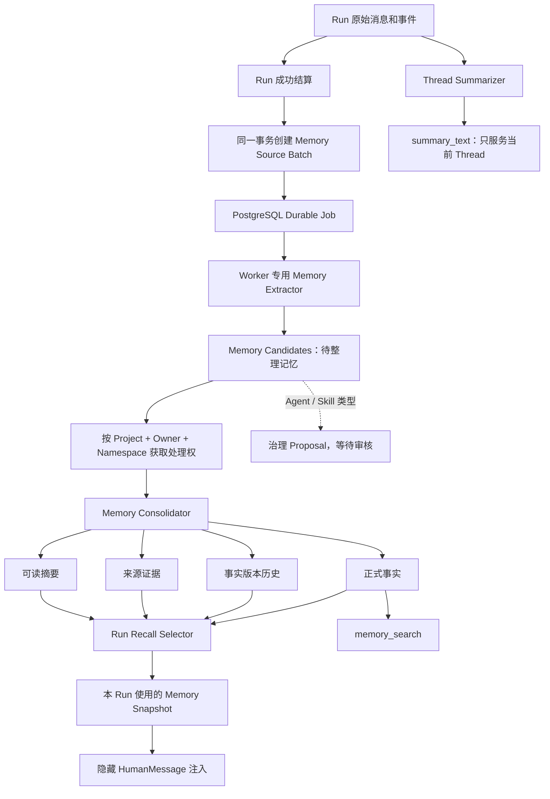

# DeerFlow 记忆系统改造方案

- 日期：2026-08-04
- 状态：提案，尚未实施
- 适用范围：DeerFlow owner-private Project Memory
- 参考设计：现有 DeerFlow Memory、nanobot 两阶段记忆流水线

## 1. 先用一句话理解

这次改造不是把 DeerFlow 的记忆改成 Markdown 文件，也不是先接入向量数据库，而是增加一个可靠的“待整理记忆箱”：

```text
聊天原文
  ↓
数据库里的待整理记忆
  ↓
Worker 后台整理
  ↓
带来源、可修改、可恢复的正式记忆
  ↓
下一次 Run 按需使用
```

需要保留 DeerFlow 现在做得好的部分：

- PostgreSQL 是唯一权威存储；
- 记忆严格绑定项目和用户；
- Gateway 只负责准入，Worker 执行模型任务；
- Memory 作为低权限数据进入模型，不能变成 System 指令；
- Run 使用准入时冻结的策略和模型版本。

需要借鉴 nanobot 的部分只有一条核心思想：

> 聊天内容先成为“候选记忆”，经过整理后才成为“正式记忆”。

### 1.1 如果只看这一页

整个改造分四步：

| 阶段 | 大白话说明 | 是否影响当前召回 |
|---|---|---|
| Phase 0 | 先修现在已经确认的丢更新、错误时间和注入不重试问题 | 不改变产品语义 |
| Phase 1 | 在 PostgreSQL 中增加“候选记忆箱”，Worker 崩溃后还能继续 | 不切换，影子运行 |
| Phase 2 | 正式记忆增加来源、修改历史、纠错和恢复能力 | 准备切换 |
| Phase 3 | 新记忆成为唯一召回来源，并上线候选与历史页面 | 正式切换 |

第一组 Pull Request 只做到 Phase 1：

```text
修复当前问题
  → Source Batch
  → Durable Job
  → Shadow Candidates
```

此时用户仍然使用旧 Memory，新的候选流水线只在后台做对比。只有确认“不丢、不重、不串用户，而且提取质量达标”后，才继续改正式事实和召回。

### 1.2 后文几个词是什么意思

| 词 | 大白话解释 |
|---|---|
| Source Batch | 某次成功聊天中，允许拿来判断“要不要记住”的一包原始证据 |
| Source Item | 这包证据中的一条用户消息或受信工具结果 |
| Extraction Generation | 用某一版模型和规则整理一次 Source Batch |
| Candidate | 可能值得记住，但还没有正式生效的内容 |
| Fact Revision | 一条正式记忆的某个历史版本 |
| Evidence | 这条记忆来自哪次聊天、哪条消息 |
| Suppression | hard delete 后留下的无正文标记，防止以后又把它重新学回来 |
| Recall Snapshot | 某次 Run 实际给模型使用的记忆清单 |

## 2. 为什么要改

当前系统能够工作，但有四个必须优先处理的问题。

### 2.1 Worker 崩溃时，待处理记忆可能丢失

当前 Memory 更新先进入 Worker 进程内的 asyncio 队列。这个队列没有保存到数据库。

如果 Worker 在队列处理前退出，聊天已经结束，但这次聊天产生的记忆可能永远不会写入 PostgreSQL。

### 2.2 两个 Thread 同时更新时，可能丢掉其中一次更新

当前队列按下面的范围串行：

```text
project + owner + namespace + thread
```

但数据库中的一份 Memory 实际按下面的范围保存：

```text
project + owner + namespace
```

因此，同一用户在两个 Thread 中同时聊天时，两边可能读取同一个旧版本。先保存的一边成功，后保存的一边发生版本冲突。当前冲突没有重新读取和重试，而是直接结束。

结果是：数据库没有被错误覆盖，但其中一次记忆更新会被静默丢掉。

### 2.3 系统不知道哪些消息已经处理过

当前没有稳定的 message cursor、source range 或 idempotency key。只要旧消息仍在 Thread checkpoint 中，后续 Run 就可能再次把它们交给 Memory 模型。

这会造成：

- 同一段聊天被重复处理；
- 模型调用成本不断增加；
- 语义相近的重复事实越来越多；
- 旧消息可能被错误标记为来自最新 Run。

### 2.4 正式记忆缺少完整的修改历史和证据

现在一条事实主要保存内容、分类、置信度和来源 Thread/Run。还不能回答：

- 具体来自哪条用户消息；
- 是否经过工具结果验证；
- 哪个模型、哪版提示词提取了它；
- 后来被谁修改；
- 哪条新事实替代了它；
- 为什么被删除；
- 是否包含敏感信息。

## 3. 本次改造的目标和非目标

### 3.1 目标

1. Worker 或机器重启后，待处理记忆仍然存在并可以继续处理。
2. 同一用户的多个 Thread 和多个 Worker 并发执行时，不丢记忆。
3. 同一批消息无论重放多少次，都只产生一份提取结果。
4. 每条正式记忆都能追溯到精确来源和修改历史。
5. Thread 摘要与长期记忆使用不同的提示词、数据结构和生命周期。
6. 候选记忆在正式接受前，不能进入自动注入或 `memory_search`。
7. 用户可以查看、修改、软停用、恢复和导出自己的记忆；hard delete 明确不可恢复。
8. 保持现有 project + owner 隐私隔离和 Worker-only 执行边界。

### 3.2 第一阶段明确不做

- 不引入独立向量数据库；
- 不把 PostgreSQL Memory 改成 Markdown 文件存储；
- 不把当前 Project Memory 自动扩大为跨项目 Personal Memory；
- 不建设项目成员共享知识库；
- 不允许聊天自动修改 Agent Policy 或发布 Skill；
- 不在第一阶段切换现有召回逻辑；
- 不建设新的微服务、Kafka 或 Redis；
- 不支持对旧数据库执行临时 `ALTER` 或修改 schema marker。

### 3.3 从 nanobot 借什么、不借什么

可以借：

- 原始聊天先保存，再生成候选，最后整理成长期记忆；
- 用 Signal、Novel、Important、Persistent 判断是否值得记住，但结果要保存成数据库字段；
- 每批限制大小，并能从上次处理位置继续；
- 压缩时保留完整用户回合和工具调用边界；
- 整理失败时留下可追查状态，不能静默丢失；
- 按真实修改内容生成版本历史，并让用户可以查看和恢复。

不能借：

- 不能用一个 Workspace 和全局 cursor 混合所有项目、用户和群聊成员；
- 不能把候选或长期 Memory 全文放进 System Prompt；
- 不能让普通聊天自动修改 Agent Policy 或发布 Skill；
- 不能用 Markdown 文件、文件锁和业务 Git 代替 PostgreSQL 事务；
- 不能让整理器加载正在维护的旧 Memory，再由旧 Memory 反过来控制整理规则；
- 不能把“关闭整理”实现成推进 cursor 并丢弃 backlog；
- 不能先删除原始 Session，再异步尝试归档。

## 4. 先把五类信息分开

| 信息类型 | 例子 | 作用域 | 能否从聊天自动生效 |
|---|---|---|---|
| Thread Context | 当前做到哪一步、哪个工具失败 | 当前 Thread | 可以，但只影响当前 Thread |
| Owner-private Project Memory | “这个项目统一使用 PostgreSQL” | Project + Owner | 可以经过候选整理后生效 |
| Personal Memory | “我喜欢简短回答” | Owner，跨项目 | 第一阶段不启用，以后必须由用户明确开启 |
| Shared Project Knowledge | 团队架构决策、项目规范 | Project 成员共享 | 不能自动生效，必须审核发布 |
| Agent Policy / Skill | Agent 行为规则、可执行流程 | 系统或项目治理资产 | 不能自动生效，只能生成修改建议 |

第一阶段继续只处理现有的 Owner-private Project Memory，不扩大任何读取范围。

## 5. 目标架构



这张图中最重要的是两条独立线路：

```text
Thread Summarizer → 让当前任务能继续
Memory Pipeline   → 决定什么值得以后继续记住
```

两者可以读取相同原始消息，但不能共用同一份摘要结果。

## 6. 用一个例子理解新流程

用户在聊天中说：

> 这个项目以后统一使用 PostgreSQL。我喜欢你回答得简短一点。

### 第一步：保存原始证据

Run 的消息和事件先按现有机制进入 PostgreSQL。Run 成功结算时，系统创建一条 `memory_source_batch`，记录：

- project、owner、namespace；
- thread、run 和最终成功 attempt；
- 经过确定性过滤的有序 Source Items；
- 每项 message identity、role、内容 HMAC 和可用的 event sequence；
- 该 Run 准入时的 Memory policy；
- 整个来源集合的 `source_identity_digest`。

随后系统创建 Extraction Generation，单独记录这次提取使用的模型、提示词、输出 schema 和 contract digest。这样同一份原始证据以后可以用新版提取器重新评测，但不会伪装成新的聊天来源。

### 第二步：提取候选，而不是直接改正式记忆

专用 Worker 可能生成两条候选：

```text
候选 A
  类型：project_constraint
  内容：当前项目统一使用 PostgreSQL
  作用域：当前 Project + Owner
  来源：这条用户消息

候选 B
  类型：user_preference
  内容：用户喜欢简短回答
  建议作用域：Personal
  来源：这条用户消息
```

第一阶段尚未启用跨项目 Personal Memory，因此候选 B 可以：

- 继续作为当前 Project + Owner 的偏好；或者
- 保持待确认，提示用户以后是否升级为 Personal Memory。

它不能在没有用户同意时自动影响其他项目。

### 第三步：整理和合并

整理器发现候选 A 与已有事实相同，就更新 `last_confirmed_at` 并增加一条证据，而不是再创建一个重复事实。

如果已有事实是“项目使用 MySQL”，新候选与它冲突，系统应创建新 revision，并把旧 revision 标记为已被替代，而不是直接删除旧内容。

### 第四步：下一次 Run 使用

下一次 Run 开始时，系统根据当前问题选择相关的已接受事实，并记录本 Run 实际使用了哪些 revision。

候选、被拒绝事实和已被替代事实都不能进入模型。

## 7. 数据模型

以下是目标概念模型。具体 SQL 名称可以在实现评审时调整，但字段语义不能只交给提示词决定。

所有 owner-private Memory 表都必须显式携带，或通过父记录的复合外键强制继承：

```text
project_id + owner_user_id + namespace
```

单独知道 batch ID、candidate ID、fact ID 或 revision ID 不能构成授权和关联依据。candidate → batch、revision → fact、evidence → revision、Run context → revision 都必须使用复合作用域约束。

### 7.1 `memory_source_batches`

代表“某次成功 Run 中一组不可变的、允许用于 Memory 提取的原始证据”。它描述来源身份，不保存 Worker lease、重试次数或模型版本。

建议字段：

| 字段 | 用途 |
|---|---|
| `id` | Source Batch ID |
| `project_id`、`owner_user_id`、`namespace` | 强制作用域 |
| `thread_id`、`run_id`、`source_attempt_id` | 最终成功 attempt 的来源 |
| `source_identity_digest` | 来源作用域、attempt、顺序化 source item ID 和内容 HMAC 的摘要 |
| `source_hmac_key_version` | 支持 HMAC 安全轮换与 suppression 重算 |
| `source_item_count` | 完整性校验 |
| `admitted_policy_revision` | 该 Run 准入时的 Memory policy |
| `suppressed_at`、`suppression_reason` | 来源被禁止继续处理时的无正文状态 |
| `created_at` | 数据库真实准入时间 |

Source Batch 的唯一身份只描述原始来源，不包含 extractor、prompt 或 model 版本：

```text
project + owner + namespace + run + source_attempt
+ ordered source item identities + input HMAC
```

升级 extractor 时仍然复用同一个 Source Batch，由新的 Extraction Generation 表达“用新版规则重新处理”。

### 7.2 `memory_source_items`

保存 Source Batch 中真正交给 Extractor 的不可变、有序输入。建议包含：

- 完整复合作用域和 `source_batch_id`；
- `ordinal`；
- 来源 message ID、可用时的 RunEvent sequence；
- `source_attempt_id`；
- user/tool 等受限 role；
- 经过确定性过滤的私有正文；
- 内容 HMAC；
- 工具 identity、结果 schema、成功状态和 evidence trust class。

现有 RunJournal flush 失败不会阻止 Run 成功，而且 RunEvent 没有 attempt identity。因此 v2 不能仅在后台根据 `run_id + seq range` 猜测原始证据。最终成功的 Worker attempt 必须在 Run 结算事务中，把经过过滤的 immutable Source Items 与 Batch 一起写入 PostgreSQL；若完整性校验失败，应记录明确的 excluded/admission failure，而不是悄悄生成残缺 Batch。

Source Item 是私有 Memory 领域数据，必须进入 export、retention、hard forget、容量和 tracing 禁止正文规则。

### 7.3 `memory_extraction_generations`

代表“用一套确定的提取 contract 处理某个 Source Batch”。建议字段：

| 字段 | 用途 |
|---|---|
| 完整复合作用域、`source_batch_id` | 强制来源范围 |
| `job_id` | 对应一个通用 `memory_extract` job |
| `contract_digest` | extractor + prompt + model + policy + output schema 的整体摘要 |
| `policy_revision`、`model_snapshot_id` | Exact policy/model |
| `prompt_version`、`extractor_version`、`output_schema_version` | 可复现代码和输出 |
| `credential_version_ref` | Worker-only 物化所需的版本引用，不保存明文 |
| `candidate_committed_at` | Candidate 已原子提交的领域状态 |

唯一键是：

```text
project + owner + namespace + source_batch_id + contract_digest
```

通用 `jobs` 是 pending、leased、running、retry_wait、dead、attempt、available_at、error 和 lease 的唯一执行状态权威。Source Batch 和 Extraction Generation 不镜像这些字段，避免两个状态机漂移。

### 7.4 `memory_candidates`

代表某个 Extraction Generation 提取出的待处理内容。

建议字段：

| 字段 | 用途 |
|---|---|
| `project_id`、`owner_user_id`、`namespace` | 强制作用域 |
| `id`、`source_batch_id`、`extraction_generation_id` | 候选和提取版本 |
| `candidate_type` | preference、constraint、correction、context 等 |
| `content` | 规范化内容 |
| `confidence` | 提取置信度 |
| `retention_class` | permanent、durable、ephemeral |
| `sensitivity` | normal、sensitive、restricted |
| `proposed_kind` | owner-private、Personal Proposal、Shared Proposal、Agent/Skill Proposal |
| `status` | pending、accepted、rejected、superseded |
| `decision_reason` | 接受、拒绝或合并原因 |
| `content_digest` | 候选级幂等和去重 |

候选状态：

```text
pending ──→ accepted ──→ superseded / deleted
    └────→ rejected
```

### 7.5 `memory_facts`

保存完整复合作用域、稳定 Fact ID、当前 revision 和当前状态。第一阶段保持现有 namespace 兼容语义，不借此新增多 Space 产品。不要再把每次修改都表现为“删除全部 facts 后重新插入”。

### 7.6 `memory_fact_revisions`

保存每次事实变化：

- 内容和分类；
- 有效起止时间；
- `last_confirmed_at`；
- 修改者是用户、系统还是候选整理器；
- 来源 candidate；
- 替代了哪个 revision；
- 删除或撤销原因。

Revision 通过 `(project_id, owner_user_id, namespace, fact_id)` 复合父键继承作用域，不能只按 `fact_id` 关联。

### 7.7 `memory_fact_evidence`

一条事实可以对应多条证据。证据至少能定位：

```text
project + owner + thread + run + message sequence
```

必要时再保存内容 hash 或短证据片段。平台通用审计表仍然不能保存 Memory 正文；正文和证据只能放在相同私有作用域的 Memory 领域表中。

Thread/Run retention 与长期 Evidence 必须有明确断链流程。建议数据库继续用复合 `ON DELETE RESTRICT` 防止绕过领域服务：删除来源前，服务先取消 pending job、擦除 evidence excerpt/source item 正文，再把直接 locator 转成带作用域的 source HMAC 和 `source_erased` 状态。这样长期事实可以保留，但 UI 必须明确显示“原始来源已按保留策略擦除”，不能继续声称可以打开原消息。

### 7.8 `memory_context_summaries`

保存供用户阅读和自动注入选择使用的摘要投影。它必须记录由哪些 active fact revisions 生成、使用的 renderer/prompt 版本和更新时间。

Summary 不是权威事实：删除后可以重新生成，生成失败也不能回滚已经提交的 canonical fact revision。

### 7.9 `memory_suppressions`

Hard forget 后保留不含正文的 suppression tombstone，例如：

- 完整复合作用域；
- source identity HMAC / fact lineage HMAC；
- suppression reason；
- HMAC key version；
- 创建时间。

Extractor、Consolidator、重放和升级后的新 Extraction Generation 都必须先检查 suppression。这样即使旧 RunEvent 仍在保留期内，换新版 extractor 也不能把已硬删除内容重新“学回来”。HMAC key 轮换必须同步迁移 suppression；hard forget 不允许恢复，只有 soft disable、archive 或 supersede 才允许恢复。

### 7.10 `run_memory_context_snapshots` 和 `run_memory_context_items`

Snapshot parent 至少保存：

- 完整复合作用域、Thread 和 Run；
- Memory aggregate/fact revision ceiling；
- summary revision；
- ordered selection version；
- renderer/prompt/policy 版本；
- token budget；
- rendered-content digest；
- 创建时间。

Items 按稳定 ordinal 记录 fact revision、排序分数和选择原因。

它们解决两个问题：

- 同一 Run 恢复执行时看到相同的 Memory；
- 出现错误回答时，可以解释当时到底给模型看了什么。

Hard forget 后正文应不可恢复，因此只能保留 ID、digest 和“已擦除”解释，不能再承诺复原当时正文。除权限撤销和 hard delete 外，相同 Run 的 retry/replay 必须使用相同 ordered snapshot。

## 8. 处理规则

### 8.1 什么时候创建 Source Batch

默认只在 Run 成功结算后创建。最终成功 attempt 经过确定性过滤的 Source Batch、Source Items、第一条 Extraction Generation 和 `memory_extract` job，必须与 Run/job 结算处于同一个 PostgreSQL 事务。

第一阶段对失败或取消的 Run 不做自动提取，避免把半完成结果、错误输出和临时状态写成长期记忆。以后如果确有需要，可增加用户显式“记住这条”的入口。

必须区分两种“关闭”：

- 用户或管理员在 Run 准入策略中设置 `memory.enabled=false`：该 Run 不创建 Source Batch/Items，不提取，也不能在以后重新启用时回头学习这段聊天；
- 运营暂停、Worker 不可用或模型暂时故障：已有 job/backlog 原样保留，不能推进 cursor 或标记完成，恢复后继续使用原来冻结的 contract。

现有 `injection_enabled` 和 `search_enabled` 继续分别控制自动注入和显式搜索，不能被 `enabled` 的处理队列语义混在一起。

`memory_extract` 不是第二个 Agent Run。来源 Run 此时已经结束，因此它不能继续复用“Run 必须处于 active”的执行授权。新 job 应通过 Source Batch 与终态 Run 建立来源关系，并在执行前重验：

- Extraction Generation、Source Batch 和 job 的 project + owner + namespace 完全一致；
- 当前 job lease 仍然有效；
- Source Batch 未 suppression，Generation 尚未提交 Candidate，job 仍处于允许执行的权威状态；
- 来源 Run 确实已经成功结算；
- Project、membership 和当前 Memory 能力仍然有效；
- 用户没有删除来源、执行 hard forget 或撤销处理许可。

可以让 `memory_extraction_generations.job_id` 指向通用 jobs 表，从而避免把新的 domain payload 硬塞进普通 Run job 字段。最终 Candidate 写入和 job settlement 必须使用 handler-owned 原子结算。

Extractor Generation 继承来源 Run 已准入的 Memory policy/model；Phase 2 Consolidation Generation 在自己的 job admission 时重新锁定 exact policy、model、prompt、output schema 和 Credential version reference。两次模型调用不能只共用一个含义模糊的 `model_snapshot_id`。

### 8.2 Extractor 可以读取什么

第一阶段采取保守规则：

- 可以读取用户明确陈述；
- 可以读取满足服务端信任规则的工具结果；
- 可以识别用户纠正和明确确认；
- 不能仅凭 assistant 自己的回答创建事实；
- 忽略隐藏框架消息、上传包装、临时 Todo 和内部 reminder；
- 凭据、token、密码和敏感内容默认拒绝进入候选。

在调用模型前先执行确定性的服务端过滤和脱敏；明显的 Credential、token、密码、隐藏框架文本和不允许的上传包装不能依赖模型“自觉忽略”。Extractor tracing 默认不记录输入输出正文。

Extractor 必须使用专用固定 System Prompt 和严格 Pydantic 输出模型。它不能复用普通 Lead Agent 上下文，也不能加载当前 Memory、SOUL 或 Skills 来控制自己的整理规则。

ToolMessage 不天然等于“已验证事实”。只有服务端 allowlist 中、identity 明确、调用成功、结果符合结构化 schema、状态和副作用可验证的工具结果，才可以成为较强证据。网页、MCP、命令输出和其他外部文本仍然属于不可信数据，不能因为它来自 ToolMessage 就自动接受；关键事实需要用户确认或领域 verifier。

### 8.3 如何防止重复和丢更新

- Source Batch 使用数据库唯一键保证重复结算不会重复入队；
- Job 使用现有 lease、heartbeat、retry 和幂等机制；
- Extract Job 可以按 Source Batch 并行，但同一个 Batch 同一时刻只能有一个有效 lease；
- Consolidation Job 按 `project + owner + namespace` 分区，不能按 Thread 分区；
- 写入冲突后重新读取并执行有界重试；
- 超过重试次数进入 dead 状态并产生不含正文的运维告警；
- acknowledgement 与候选落库必须在同一事务中完成。
- 只要 Source Batch 仍有 nonterminal Extraction Generation/job，retention 就不能先删除 Source Items；用户 hard forget、删除来源或权限撤销时，应在同一受权流程中 suppression Batch 并取消相关 generation/job，阻止后续重试重新生成已删除内容。
- Phase 2 启用整理后，Candidate commit 必须在同一事务创建幂等 `memory_consolidate` admission/outbox；Scheduler 或 reconciliation scanner 只负责补偿发现没有 job 的候选，真正的 Consolidator 仍由 Worker 持 lease 执行。
- Extractor 和 Consolidator 在读取正文、调用模型以及提交结果前都检查 suppression，防止换 contract 后复活 hard-forgotten 内容。

### 8.4 如何处理重复、纠正和过期

| 场景 | 处理方式 |
|---|---|
| 内容相同 | 不创建重复事实，增加证据并刷新 `last_confirmed_at` |
| 新内容补充旧事实 | 创建新 revision |
| 用户明确纠正 | 新 revision 替代旧 revision，保留旧历史 |
| 模型判断可能冲突但证据不足 | 保持 pending，等待用户确认 |
| 到达过期时间 | 停止自动召回，不直接物理删除 |
| 用户硬删除 | 删除或加密擦除正文、候选、revision、summary 和检索索引，并保留无正文操作记录 |

事实新鲜度应根据 `last_confirmed_at` 和有效期判断，不能只看第一次创建时间。

### 8.5 哪些内容可以自动接受

第一阶段建议采用白名单：

- 用户明确表达的当前项目偏好；
- 用户明确确认的项目约束；
- 用户对旧事实的明确纠正；
- 具有确定来源且不敏感的稳定事实。

以下内容必须拒绝或等待人工确认：

- 密码、token、Credential 和隐私敏感信息；
- 从 assistant 单方面推断出的内容；
- 项目成员共享知识；
- Agent Policy；
- Skill；
- 无法定位来源消息的内容；
- 一次性任务状态和短期临时信息。

SNIP 中的 Signal、Novel、Important、Persistent 可以作为模型判断维度，但服务器端白名单、作用域和敏感规则拥有最终决定权。

### 8.6 Quota、计费、审计和 Credential

Phase 1 shadow 会在旧 updater 之外增加一次模型调用，因此也必须走正式资源边界：

- 调用前按 Project/Owner 和 purpose 预留预算；Phase 1 shadow 使用单独的 `memory_extract_shadow` 平台预算和限流，记录成本但不能让用户为不可见的双跑重复付费；
- 完成后结算实际 token、调用次数、延迟和成本；
- 失败/重试的重复调用同样计费，UI 和发布评测必须显示 shadow 的额外成本；
- Consolidator 使用独立 purpose=`memory_consolidate` 和独立预算；
- exact Credential version 只在 Worker 通过当前 authority/lease 检查后短暂解密；
- Batch、Job、Candidate、日志和 tracing 都不能保存 Credential 明文或可反推 secret 的原始错误；
- 平台 audit 只记录 batch/job ID、purpose、状态、计数和稳定错误码，不记录 Memory 正文。

Quota 不足时 job 应进入有界 deferred/retry 状态或明确终止，不能绕过配额继续调用，也不能把未调用模型的 batch 标记为成功。

切换为正式权威前，必须明确 `memory_extract`/`memory_consolidate` 是否计入用户 token budget、Project quota 或平台成本，不能由 Worker 实现自行决定。

## 9. 召回设计

### 9.1 自动注入

Worker 在 Run 第一次调用模型前，从已接受事实中选择相关内容，并原子创建 `run_memory_context_snapshot` 和有序 items。

注入继续使用隐藏 HumanMessage，并保留：

- HTML/XML 转义；
- token 上限；
- correction 等保证分类预算；
- project + owner 授权复验。

不要把 Memory 放入 System Prompt。

自动注入必须像显式搜索一样使用 no-create 的 Run-bound authority：在同一事务重验 membership、capability、Run、job、lease、cancel 和 Thread 后读取 Memory。缺少 Memory 行时返回虚拟空 snapshot，不得因为一次读请求创建数据库行。

### 9.2 显式 `memory_search`

`memory_search` 继续使用模型无法伪造的 Run-bound authority，只允许模型提供：

- query；
- category；
- top_k。

第一版先由 PostgreSQL 完成严格 scope filter 和有界分页，再复用当前确定性的 Unicode/CJK char-bigram 词法 ranker，避免切换 SQL 时损失中文能力。现有 facts 数量较小，暂时没有必要先引入独立向量数据库。

如果以后采用 PostgreSQL FTS/`pg_trgm`，必须把 extension 安装权限、`full_schema.sql`、setup/doctor/check-db、索引和降级路径作为新的部署依赖评审，不能在查询代码中悄悄假设扩展已经存在。

只有质量评测证明词法检索不足后，才增加 pgvector 混合检索；任何向量查询都必须先用 project + owner 条件过滤候选集合。

`memory_search` 默认只搜索本 Run snapshot 记录的 fact revision ceiling 以内的 accepted facts，并返回 snapshot/version；同一 Run 中不会因为后台整理完成而漂移，新 revision 从下一个 Run 开始可见。权限撤销、suppression 和 hard delete 仍然立即覆盖冻结结果。

### 9.3 删除与 Run 快照

Run 内可以冻结已选择的 revision，保证恢复和重放一致。但是权限撤销和用户硬删除必须立即生效。

因此模型调用前仍需应用：

- membership/capability 撤销检查；
- fact tombstone；
- hard-delete redaction overlay。

不能因为某个 Run 已经冻结，就继续向模型发送用户已删除的正文。

## 10. API 和管理页面

### 10.1 API 原则

- import/export 使用严格版本化 Pydantic schema，不能继续只接收 `dict[str, Any]`；
- 限制 summary 长度、fact 数量、候选数量和 namespace 数量；
- GET/status/export 不创建空 Memory 行；
- 不存在 Memory 行时返回虚拟 empty snapshot/revision 0，第一次写入再原子 create；
- `updated_at` 以数据库时间为准，不能信任 import 中的客户端时间；
- `/reload` 如果只是重新读取，应删除或改名为“刷新页面”，不能暗示会重新学习；
- 所有写操作继续要求 expected revision 或 If-Match；
- 管理读写的授权检查和实际数据库操作应处于同一事务。

### 10.2 页面建议

Memory 页面最终可以分成三个标签：

1. 正式记忆：当前会被召回的内容；
2. 待确认：pending candidates；
3. 修改历史：fact revisions 和来源。

用户应能执行：

- 查看来源 Thread；
- 接受或拒绝候选；
- 修改事实并生成新 revision；
- 恢复 soft-disabled、archived 或 superseded 的旧 revision；hard-deleted 内容不可恢复；
- 停止召回；
- 硬删除；
- 导出自己的 Memory。

Markdown 可以作为导出和查看格式，但不能成为服务器权威数据源。

## 11. 安全和隐私边界

以下是不允许退化的硬约束：

1. 所有 owner-private Memory 表都显式包含，或通过复合父键强制继承 project + owner + namespace；跨表不能只用单列资源 ID 关联。
2. 不允许客户端提交可信 owner ID；Owner 来自 server-issued context。
3. Worker 执行前重验 membership、capability、Run、job、lease 和 cancel 状态。
4. Candidate 未 accepted 前不能进入自动注入或搜索结果。
5. 用户影响的 Memory 永远不能获得 System 权限。
6. Agent Policy 和 Skill candidate 只能进入治理 Proposal。
7. 平台审计、运维日志和全局管理 API 不返回 Memory 正文、证据、prompt 或模型原始错误。
8. 如果启用 Langfuse/LangSmith，Memory Extractor 的输入输出必须单独配置脱敏和保留策略。
9. 删除 Thread 时必须明确处理派生 Memory；不能假设删除聊天等于删除长期记忆。
10. 群聊来源必须包含 sender identity，不能只使用 channel + chat ID 推断 Owner。

## 12. 分阶段实施

### Phase 0：冻结契约并修复基线

目标：先确定规则，避免一边写表一边改变产品语义。

交付：

- 冻结五类信息及其作用域；
- 定义 candidate、fact、revision、forget 和 disable 状态机；
- 定义哪些候选可以自动接受；
- 将旧进程内队列的串行键临时收紧为 `project + owner + namespace`，先堵住跨 Thread 静默丢更新；
- 为旧 updater 增加有界 CAS 重试；冲突时重新读取并重新计算，不能把基于旧版本的结果直接套到新版本；
- 将 date reminder 和 Memory 注入状态拆开；首次 date-only 降级不能阻止下一个 turn 重试 Memory；
- 自动注入改用 no-create、单事务 Run-bound authority；缺行返回虚拟 empty revision 0；
- 增加严格 import/export schema 和容量上限；
- status 改用数据库真实更新时间；
- GET 不再 create-if-needed；
- 删除或重新定义无实际作用的 reload；
- 明确 `sourceError` 是正式持久化字段还是删除该 contract，不能继续在 PostgreSQL round-trip 中静默丢失；
- 冻结 Thread/Run retention 与长期 evidence 的 RESTRICT、断链、source-erased 和 hard-forget 语义；
- 明确当前 `namespace` 是兼容/隔离坐标；Phase 0–3 不新增用户可见的多 Memory Space 产品；
- 修正仍把 DB-owned Memory leaf 放入 YAML 的过期测试，包括 `test_project_memory_tools.py` 的示例 `memory.search_enabled` 和 `test_runtime_lifecycle_e2e.py` 的 `memory.enabled`；
- 增加现有队列成功、失败、冲突和积压指标。

退出标准：

- 设计决策和 API contract 评审通过；
- 当前 Memory 聚焦测试全部通过且无非预期 skip；
- 两个 Thread 同时更新同一份旧 Memory 时，冲突会重试或明确失败，不再静默返回；
- 首次 Memory 注入超时后，下一 turn 能重新读取；
- 自动注入和显式搜索都不会因为读取创建空行，且授权读取处于单一事务；
- 没有扩大现有 Memory 作用域。

### Phase 1：Durable Candidate Pipeline，保持影子运行

目标：先解决崩溃丢失、重复处理和跨 Thread 并发问题，不切换现有召回。

交付：

- `memory_source_batches`；
- `memory_source_items`；
- `memory_extraction_generations`；
- `memory_candidates`；
- `memory_extract` durable job 和 Worker handler；
- 最终成功 attempt 的 immutable extraction payload 与 Run settlement 同事务 admission；
- 固定模型快照、提示词版本和 typed extractor；
- 幂等键、lease、heartbeat、retry、dead 状态；
- release/job contract fingerprint；Gateway、Scheduler 和 Worker 只有 contract 一致时才允许 admission/claim；
- 同一 Source Batch 只允许一个有效 lease，Candidate append 使用稳定幂等键；
- Candidate 查询和内部诊断 API；
- Memory Extractor 的 quota reservation/settlement、token usage、metadata-only audit 和 Worker-only Credential materialization；
- 影子评测：v1 更新结果与 candidate pipeline 对比。

这一阶段：

- v1 `user_project_memories` 仍是唯一召回权威；
- candidate 不进入模型；
- 不改前端正常 Memory 使用体验；
- 不移除旧队列，直到影子验证完成。
- 如果正式环境已经有存量数据，在全库逻辑迁移工具和切换演练完成前，Phase 1 只能运行在 disposable 测试环境，不能因为“只是影子模式”就把新 schema 直接发布到旧库。

退出标准：

- 重复 settlement 只生成一个 Source Batch；
- Worker 在模型调用前后崩溃都能恢复；
- 两 Thread、两 Worker 并发时无候选丢失；
- 候选全部能定位原始消息范围；
- RunJournal 缺失或混合失败 attempt 不会污染 immutable Source Items；
- Source identity 与 extraction contract 分离；升级 prompt/model 只新增 Generation，不重复 Source Batch；
- shadow 模型调用全部进入 quota、成本和审计统计，Credential 明文不落库；
- 影子结果达到评审确定的准确率和误记上限。

### Phase 2：Fact Revision 和 Consolidation

目标：用有来源、可恢复的正式事实替换整份 aggregate 重写。

交付：

- `memory_facts`；
- `memory_fact_revisions`；
- `memory_fact_evidence`；
- `memory_context_summaries`；
- `memory_suppressions`；
- `memory_consolidation_generations` 和 exact consolidation contract；
- `memory_consolidate` job；
- Candidate commit 与 consolidate admission/outbox 原子交接和 reconciliation 补偿；
- 重复、纠正、冲突、过期和敏感内容规则；
- 从 accepted facts 生成可读 summary；
- 用户修改、恢复、停止召回和硬删除 API；
- v1 export 到 v2 typed import 工具。

退出标准：

- 正式事实不再 delete-all/reinsert；
- 每次修改都有 actor、原因和来源；
- 一条事实可以绑定多条证据；
- 冲突不会静默覆盖；
- hard forget 覆盖所有 Memory 派生数据和索引。
- hard forget 后重放旧 Run、切换 extractor/prompt/model 版本也不会复活内容；
- soft disable/supersede 可以恢复，hard forget 不可恢复。

### Phase 3：切换召回和管理页面

目标：让新事实模型成为唯一召回权威。

交付：

- `run_memory_context_items`；
- `run_memory_context_snapshots`；
- Run 级稳定 Recall Snapshot；
- scope-first SQL 检索和确定性排序；
- 新的自动注入读取路径；
- 新的 `memory_search` 读取路径；
- 正式记忆、待确认、修改历史页面；
- 移除旧 Memory updater 和进程内 queue；
- 移除 summarization rescue hook 对长期 Memory 的依赖。

退出标准：

- Run 恢复时使用相同 revision；
- 同一 Run 的自动注入和 `memory_search` 都遵守相同 revision ceiling；
- 中文/英文 retrieval 相对现有 CJK ranker 不退化，排序稳定且 lexical fallback 可用；
- candidate、rejected 和 superseded 内容不会被召回；
- 权限撤销和硬删除在下一次模型边界立即生效；
- v1 与 v2 双读对比完成后，v1 路径彻底关闭。

### Phase 4：可选产品扩展

只有 Phase 3 稳定后再考虑：

- 用户明确开启的跨项目 Personal Memory；
- 项目成员共享的 Project Knowledge；
- Candidate 到 Agent/Skill 治理 Proposal；
- 用户可见的多 Memory Space、namespace registry/quota；
- pgvector 混合检索；
- 更细的保留期和用户确认策略。

这些是独立产品能力，不能作为 Phase 1 的隐含范围。

## 13. 主要代码改动地图

| 模块 | 预期改动 |
|---|---|
| `backend/packages/harness/deerflow/persistence/full_schema.sql` | 新增完整 v2 表、约束、索引和 job type |
| `backend/packages/harness/deerflow/persistence/private_work/` | Source Batch、Candidate、Fact Revision、Evidence repository |
| `backend/packages/harness/deerflow/persistence/jobs/` | 新 job type、幂等和 claim/settlement 约束 |
| `backend/app/private_work/run_repository.py`、`backend/app/reliability/execution.py` | Run 结算时原子 admission Memory Source Batch/Items |
| `backend/packages/harness/deerflow/runtime/runs/worker.py` | 从最终成功 attempt 提供 immutable filtered source payload |
| `backend/packages/harness/deerflow/runtime/events/store/db.py` | 提供 source locator/retention；不能单靠事后 seq range 重建 Batch |
| `backend/app/worker/` | Memory Extract/Consolidate handlers 和固定执行边界 |
| `backend/app/worker/app.py` | 注册新的 Worker job handlers |
| `backend/app/reliability/workers.py` | release/job contract fingerprint readiness |
| `backend/app/system_runtime_settings/` | Memory extractor/consolidator policy 和 prompt/model 版本 |
| `backend/app/final_schema.py`、schema contract/digest | 新表 readiness、完整 schema 标识和 fail-closed 兼容边界 |
| `backend/app/private_work/memory_service.py` | typed CRUD、candidate decision、revision、forget |
| `backend/app/private_work/privacy_center.py`、`retention_purge.py` | Source Items、Candidate、Evidence、Suppression 的导出/擦除/保留策略 |
| quota/token usage/credential materialization | 后台模型调用预留、结算、归因和 Worker-only 解密 |
| `backend/app/gateway/routers/project_memory.py` | 版本化请求/响应和管理 API |
| `backend/packages/harness/deerflow/agents/memory/` | 提取逻辑迁入 Worker；最终删除旧 queue/updater |
| `backend/packages/harness/deerflow/agents/middlewares/` | 注入改为 Run snapshot；最终删除长期 Memory rescue hook |
| `frontend/src/core/private-work/memory.ts` | v2 typed API contract |
| `frontend/src/components/projects/private-work/` | 候选、正式记忆和历史页面 |
| `backend/tests/`、`frontend/tests/` | 单元、真实 PostgreSQL、并发、安全和 UI 测试 |
| `backend/scripts/` | 全库逻辑 export/import、独立 verifier、dry-run/resume |
| Gateway/部署入口 | 切换期 fail-closed maintenance mode，拒绝写入和新准入 |
| `Makefile` | 把真实 PostgreSQL Memory gate 加入唯一有序 release gate |
| `README.md`、`AGENTS.md` | 同步用户语义、运行边界和开发约束 |

新增 job type 会同时影响 ORM、`full_schema.sql` CHECK 约束、Worker handler allowlist、运维查询和 release gate，不能只新增一个 handler 文件。

## 14. 数据库切换方案

仓库当前没有增量 migration chain。Memory v2 修改 schema 时必须使用新的空 PostgreSQL 数据库完成完整初始化。

### 14.1 首要 Go / No-Go

正式环境不能只迁移 `user_project_memories` 和 `user_project_memory_facts`：

- Memory parent 依赖 users、projects 和 project_memberships；
- facts 还依赖 threads_meta 和 runs；
- v2 evidence 又会依赖更精确的 Run/message 标识。

因此发布前必须在下面两个选择中明确选一个：

1. 目标环境是全新或允许丢弃的环境，不迁移历史业务数据；
2. 建设正式的全库逻辑迁移，按原 ID 迁移 Memory 所依赖的用户、项目、成员、Thread、Run 及其他业务数据。

如果生产环境已有存量数据，而团队又不准备建设和演练全库逻辑迁移，本次 schema 变化就是 **No-Go**，不能发布。

物理 schema 发生变化时，还必须更新新的完整 schema snapshot 标识、canonical signature/digest、runtime readiness、`make check-db`、privacy export、retention purge 和发布测试。

目标状态是：旧程序连接新库、新程序连接旧库、不同 job contract 的 Gateway/Worker/Scheduler 混跑都 fail closed。当前 Worker readiness 还不足以证明所有角色版本一致，因此 Phase 1 必须新增 release/job contract fingerprint，并在 Gateway admission、Scheduler admission 和 Worker claim 前校验；在该机制完成前，只能依靠部署编排执行 stop-all/start-all，不能声称系统已经自动阻止混版本。

### 14.2 切换步骤

1. 冻结目标代码和 v2 schema contract。
2. 对旧库执行只读 preflight，确认 marker、表和 catalog 状态。
3. 使用生产等价的脱敏副本，在 disposable 数据库至少完成一次完整导出、导入、验证和回滚演练。
4. 预建新的空目标数据库，使用当前 checkout 的 `make setup-db` 完整初始化，并确认其中没有用户业务数据。
5. 在维护窗口先停止所有旧 Gateway、Scheduler 和其他 admission/IM 入口，阻止新的 Run、Automation 和外部消息准入；保留旧 Worker 只用于 drain 已存在的 job。
6. 等待 active Run、claimed/leased job 为 0；queued/retry_wait job 必须明确选择“继续 drain”或进入逐表迁移计划，不能要求历史和 terminal job 总数为 0。
7. 停止旧 Worker 前执行旧进程内 Memory queue 的 bounded flush，并验证 pending/active 为 0。任何超时或失败都应 No-Go；如果需要恢复这部分数据，只能从 retained Run messages 按明确范围回填幂等 Source Batch，不能假装 flush 已成功。
8. 对冻结的旧库创建基础设施只读快照，并执行一次最终全库逻辑导出。Manifest 记录 source identity、schema marker/digest、代码 commit、一致性点、各作用域计数和 SHA-256。
9. 在全新的目标库中只导入一次。导入器必须执行评审通过的逐表 migration matrix 和 FK/cycle plan，不能用一条简单顺序盲拷所有表。
10. 在导入过程中对 v1 Memory 执行 typed v1 → v2 transform；未知或有损字段进入 rejection report，不能静默丢弃来源。
11. 独立 verifier 检查 counts、scope counts、ID 集、canonical hashes、FK/orphan、source linkage、时间精度和中文/emoji/长文本样本。任何 count、hash、FK 或 rejection 不达标都应 No-Go。
12. 迁移目标只运行 `make check-db` 和独立 verifier。真实 PostgreSQL release gate 使用专用 `POSTGRES_TEST_URL` 管理库，由测试创建随机 `deerflow_test_*`，绝不能把迁移目标当作测试库。
13. 如果需要启动应用做只读 smoke，必须先实现并验证 fail-closed maintenance gate：只启动 Gateway，保持 Scheduler/Worker 停止，并拒绝所有 mutation、IM admission 和 Run/Automation admission。没有这个 gate 时，只能做离线 verifier/`make check-db`，不能声称应用 smoke 是只读的。
14. 只读验证通过后，再一次性启动 contract 一致的 Gateway、Scheduler 和全部 Worker，执行受控写 smoke，随后开放正常流量。
15. 保留旧数据库只读并设置明确的保留期限；不得由发布脚本自动删除。

当前旧系统没有完整的全库 delta cursor，所以本方案不采用“提前导入大部分数据，停机时再补增量”。如果停机窗口不能接受一次全量导出和导入，必须先建设 durable change log、双写或正式的增量迁移能力。

新 `setup-db` 会创建 packaged catalog、runtime policy 和默认模型/Credential，并执行 default-project bootstrap；如果没有可用 human user，该 bootstrap 可以合法 no-op。全库迁移必须明确旧 catalog、管理员 policy、模型、default project、auth session、channel credential、Credential envelope、audit/quota HMAC 等内容是保留、轮换、重建还是强制失效。任何密钥明文都不能进入导出包；迁移加密 envelope 时必须保留或安全轮换对应 keyring/HMAC 材料。

### 14.3 迁移工具要求

- 导出格式版本化并带 manifest；
- 导出包加密、最小权限并设置 TTL；
- 每张表必须被分类为 preserve、transform、reseed 或 drop，并写明 ID、时间和来源策略；
- worker_nodes、job_attempts、active lease、auth session、catalog/policy、LangGraph store/checkpoint 等不能默认原样复制；循环 FK 必须有显式 staging/deferred-constraint 方案；
- importer 支持 `--dry-run`、`--resume` 和批次事务；
- 相同 manifest 重跑必须幂等，不同 source fingerprint 不能混入同一目标；
- target 在第一次导入前必须是 exact v2 catalog 且没有用户业务数据；
- verifier 独立于 importer，不能由同一段转换逻辑自证正确；
- 错误报告只包含 record ID 和稳定错误码，不记录 Memory 或 Credential 正文。

### 14.4 回滚分界

切换前失败时，新目标库可以隔离或丢弃，旧库和旧服务没有变化。

新版本 Gateway 在 fail-closed maintenance mode 下完成只读 smoke、且尚未启动 Scheduler/Worker 或开放写入时，也可以停止新进程并把所有角色一次性切回旧程序和旧库，此时可以做到 RPO=0。

一旦 v2 已经开放写入，旧库就开始落后。如果没有反向事件日志或双写能力，直接重新连接旧库会丢失切换后的 Run、Memory、Automation 和其他业务状态，不能称为安全回滚。此时只能选择：

- 先实现可逆 event bridge；
- 停机执行受验证的 v2 → v1 反向逻辑迁移；
- 或在变更单中明确接受对应 RPO。

无论正常切换还是回滚，同一时刻只能有一组 Gateway/admission、Scheduler 和 Worker 拥有写权，避免重复执行外部副作用。

如果业务要求在线升级旧库或零停机双写，需要先建设正式 migration subsystem。这是一个独立架构项目，不能隐藏在 Memory 改造中临时实现。

## 15. 测试和发布门禁

### 15.1 单元测试

- Source Batch 幂等键；
- source identity 与 extraction contract digest 分离；
- immutable Source Items 只来自最终成功 attempt，顺序和 HMAC 稳定；
- typed extractor 输出校验；
- candidate 白名单、敏感信息和作用域规则；
- 重复、纠正、supersede 和 staleness；
- revision 和 evidence round-trip；
- token 预算、转义和 prompt injection；
- typed import 的大小、数量和未知字段限制。
- v1 → v2 typed conversion 和 round-trip；
- manifest hash/fingerprint 稳定性；
- importer `--dry-run` 零写入；
- 相同 manifest 重跑幂等、不同 source fingerprint 拒绝；
- verifier 对故意注入的 count、hash、FK 和 source 错误能够报错。
- operational pause 保留 backlog，而 `memory.enabled=false` 的 Run 永久不创建 Source Batch；
- hard-forget suppression 在更换 extractor/prompt/model 后仍阻止重新生成；
- trusted tool evidence allowlist 与 external/untrusted tool output 分类。

### 15.2 真实 PostgreSQL 测试

- settlement 与 Source Batch 原子提交；
- journal flush 缺失或旧失败 attempt 事件存在时，Batch 仍只包含最终成功 attempt 的完整 immutable payload；
- 两 Thread 更新同一 Memory aggregate；
- 两 Worker 竞争同一 batch；
- lease 丢失、retry 和 dead 状态；
- 候选写入成功但 job acknowledgement 前崩溃；
- Candidate commit 后、consolidate admission 前故障不会留下永远无人处理的候选；
- CAS loser 重新读取和合并；
- project、owner、namespace 复合约束；
- hard forget 级联和 redaction；
- retention、privacy export 和 purge；
- schema 缺表、旧 marker、catalog drift 时 fail closed。
- importer 在第 N 批中断后 `--resume`，不产生重复或半条记录；
- 错误 target、错误 source、冲突 ID 和错误 FK 在写入前失败；
- 冻结快照中的 update/delete 能正确收敛，不能把已删除事实重新导入；
- full/delta checkpoint 数据都能保留；当前不支持的 delta → full 方向继续显式 fail closed。
- Source Items、Evidence 与 Thread/Run retention 的 RESTRICT → detach/source-erased 流程；
- 读取空 Memory、自动注入和 `memory_search` 都是 no-create，且在单一事务完成 authority revalidation；
- quota reserve/settle、重试重复计费、Credential version materialization 和正文不落 audit/log。

测试必须使用仓库已有的随机 `deerflow_test_*` 生命周期，不连接正常开发数据库，也不启动第二个长期 PostgreSQL 服务。

### 15.3 进程和安全测试

- Gateway 永远不执行 Memory 模型；
- Scheduler 只负责周期任务准入，Worker 才执行；
- membership 降级、项目暂停、Run cancel 和 lease loss 后立即停止副作用；
- 普通用户不能读取其他用户的候选、事实、revision 或 evidence；
- Memory 内容永远不会成为 SystemMessage；
- Agent/Skill candidate 无法绕过治理发布；
- 日志、审计和系统管理员 API 不泄露 Memory 正文。
- old code + v2 DB、v2 code + old DB 均启动失败；
- 不同 contract 的 Gateway、Scheduler、Worker 混跑时 admission/claim 失败；
- maintenance gate 确实拒绝所有 mutation、IM、Run 和 Automation admission。
- user hard forget 后重放旧 Run 或新增 Extraction Generation，事实仍不会复活；
- `memory.enabled`、`injection_enabled`、`search_enabled` 三种开关语义互不混淆。

### 15.4 模型质量评测

建立版本化、固定 hash 的中文和英文样例集，并冻结 extractor prompt、model snapshot、policy/config digest。样例集至少覆盖：

- 明确偏好；
- 项目约束；
- 用户纠正；
- 一次性临时任务；
- assistant 幻觉；
- 工具成功和工具失败；
- prompt injection；
- Credential 和敏感信息；
- 新旧事实冲突；
- 群聊中不同 sender。

重点指标不是“提取了多少”，而是：

- 不该记住的内容被记住了多少；
- 应记住的内容漏掉了多少；
- 作用域判断错误多少；
- 重复和错误覆盖多少；
- 每个 Source Batch 的模型成本和处理延迟。

建议把下面的初始阈值作为 Phase 1 默认 Go/No-Go；如果评审决定修改，必须先在 Phase 0 文档化，不能看到结果后再调整：

| 指标 | 初始门槛 |
|---|---|
| 跨 project/owner/namespace/sender 错记 | 0 |
| Credential、密码、token 进入候选或 tracing | 0 |
| shadow 模拟自动接受的事实 precision | ≥ 99%，且 95% 置信区间下界 ≥ 98% |
| 应记 durable fact 的 recall | ≥ 90% |
| active duplicate fact rate | ≤ 1% |
| correction 被错误 supersede | 固定 correction 集中为 0 |
| candidate 未 accepted 即被召回 | 0 |
| 中文/英文 retrieval 相对当前 lexical baseline | Recall@K 和排序稳定性不得退化 |
| 每个 Source Batch 平均模型成本 | 不高于冻结的 v1 baseline |

评测至少包含足以计算置信区间的人工标注样本，并记录双人复核分歧。模型、prompt 或规则变化后必须生成新的 eval revision，旧结果不能继续认证新版本。

### 15.5 完整证据命令

后端和静态检查：

```bash
cd backend
uv run pytest -q
uvx ruff check .
uvx ruff format --check .
```

真实 PostgreSQL gate 使用专用测试管理库，由测试创建随机数据库：

```bash
POSTGRES_TEST_URL="$MEMORY_TEST_POSTGRES_URL" \
  make test-project-foundation-postgres
```

迁移目标只能执行只读检查和独立 verifier，例如：

```bash
DATABASE_URL="$MEMORY_V2_DATABASE_URL" make check-db
cd backend
DATABASE_URL="$MEMORY_V2_DATABASE_URL" \
  uv run python scripts/verify_full_schema_v2_import.py \
  --manifest "$MEMORY_MIGRATION_MANIFEST"
```

`verify_full_schema_v2_import.py` 是本方案要求新增的计划脚本，当前仓库尚不存在。数据库密码继续只通过环境变量提供，不能写入命令示例、manifest 或日志。

如果修改了前端/API：

```bash
cd frontend
pnpm test
pnpm check
pnpm test:e2e
pnpm build
```

发布证据必须保存 commit、schema marker/digest、命令、退出码、0 skip 结果、迁移 manifest、verifier 报告、质量评测、故障恢复和回滚演练结果。容器、Helm/Kubernetes、外部模型、Sandbox 和 tracing 仍需分别验证，不能用源码单测代替。

真实 PostgreSQL Memory gate 应加入根 `Makefile` 的唯一 `PROJECT_FOUNDATION_POSTGRES_TESTS` 有序来源；不要新建一套重复的 CI workflow。

## 16. 可观测性

至少提供以下不含正文的指标：

- 按有界 job purpose 聚合的 pending、processing、retry、dead 数量；
- candidate accepted、rejected、superseded 数量；
- 每种有界枚举的拒绝原因；
- 提取和整理耗时；
- 每批 token 用量；
- 重复输入命中次数；
- CAS retry 次数；
- lease loss 次数；
- 不带 project/owner/namespace 标签的 fact/revision 数量 histogram 或 bucket；
- recall 命中数和 token 数；
- hard forget 完成和失败次数。

日志只记录 ID、状态、稳定错误码和计数，不记录聊天、Memory、证据或模型原始响应正文。

project、owner、namespace、fact ID 等高基数或敏感维度不能成为 Prometheus label。逐 Memory Space 的详情只能通过受权、分页并记录操作审计的管理查询查看。

至少配置这些报警和 runbook：oldest pending job age 超过 SLO、dead extract/consolidate job > 0、hard forget 失败、lease loss/CAS retry 突增、候选积压持续增长和 extractor 成本异常。

## 17. 最终验收标准

全部满足以下条件后，才能删除旧 Memory queue/updater：

1. 重复提交同一 Run 不会产生重复候选。
2. Worker 在任意处理阶段退出后都能继续，不丢 source batch；外部模型调用允许因重试重复发生和重复计费，但数据库 Candidate/Fact promotion 必须幂等，不能声称外部调用 exactly-once。
3. 同一用户两个 Thread、两个 Worker 并发时不丢更新。
4. 每条正式事实都能定位到证据和提取版本。
5. 手工修改产生新 revision，不篡改历史来源。
6. 候选、拒绝、过期和被替代事实不会进入召回。
7. Run 恢复时使用同一组 fact revision。
8. 权限撤销和硬删除在下一次模型调用前立即生效。
9. Project、Owner、namespace 和群聊 sender 隔离测试全部通过。
10. malformed/oversized import 不会污染数据库或 Prompt。
11. Agent Policy 和 Skill 只能通过现有治理流程发布。
12. 真实 PostgreSQL release gate 为 0 skip，Gateway、Scheduler、Worker 版本一致。
13. 生产等价的全库迁移、独立验证和回滚至少完整演练一次。
14. 迁移 counts/hash/FK 全部匹配，rejection 为 0 或已经逐项签字接受。
15. v1/v2 shadow 达到冻结的 precision、recall、重复率和 scope violation 门槛。
16. 切换前 candidate backlog、DLQ 和旧 Memory queue 为 0，或有明确、验证过的迁移/处置清单。
17. 性能、模型成本和 backlog oldest-age 达到冻结 SLO。
18. Dashboard、alerts、故障处理 runbook 和 release evidence 完整。
19. fresh setup/check、后端全量测试、ruff、真实 PostgreSQL gate，以及受影响的前端 test/check/E2E/build 全部通过。

## 18. 推荐的第一组 Pull Request

为了控制风险，第一组改动只完成 Phase 0 和 Phase 1 的基础设施：

```text
PR 1：契约和测试基线
  - typed schema
  - 状态机
  - 现有 bug 和测试契约修正

PR 2：Source Batch + durable job
  - full_schema
  - repository
  - Run settlement admission
  - Worker claim/retry

PR 3：Shadow Extractor + Candidates
  - fixed prompt
  - typed output
  - provenance
  - 质量评测

PR 4：正式环境迁移和切换工具
  - 全库 export/import manifest
  - independent verifier
  - maintenance gate
  - rollback rehearsal
```

前三组 PR 完成后，旧 Memory 仍负责正式召回，新流水线只生成影子候选。存在存量业务数据的正式环境还必须完成 PR 4，才能部署包含新 schema 的版本。只有在并发、崩溃恢复、迁移演练和提取质量都通过验收后，才进入 Fact Revision 和召回切换。

## 19. 关键源码入口

以下位置基于 2026-08-04 当前 checkout；开始实现前应重新确认行号和工作树差异。

| 主题 | 当前入口 | 重点位置 |
|---|---|---|
| Run policy/model 准入快照 | `backend/app/private_work/snapshot_repository.py` | 495–564 |
| 当前自动注入 | `backend/packages/harness/deerflow/agents/middlewares/dynamic_context_middleware.py` | 201–254、358–408 |
| 当前被动更新入口 | `backend/packages/harness/deerflow/agents/middlewares/memory_middleware.py` | 77–138 |
| 当前进程内队列 | `backend/packages/harness/deerflow/agents/memory/queue.py` | 20–47、121–224 |
| 当前 LLM updater | `backend/packages/harness/deerflow/agents/memory/updater.py` | 405–504、506–634 |
| 当前存储适配 | `backend/packages/harness/deerflow/agents/memory/storage.py` | 29–45、168–219 |
| 当前 Memory repository | `backend/packages/harness/deerflow/persistence/private_work/memory_repository.py` | 181–248 |
| 当前事实模型 | `backend/packages/harness/deerflow/persistence/private_work/model.py` | 330–388 |
| 当前显式检索 | `backend/packages/harness/deerflow/agents/memory/retrieval.py`、`tools.py` | retrieval 24–55、138–217；tools 88–132 |
| 当前 Run-bound authority | `backend/app/private_work/memory_authority.py` | 28–104 |
| 当前消息事件来源 | `backend/packages/harness/deerflow/runtime/events/store/db.py` | 872–973 |
| RunJournal 最终 flush 降级 | `backend/packages/harness/deerflow/runtime/runs/worker.py` | 1471–1476 |
| 当前 job 类型和幂等 | `backend/packages/harness/deerflow/persistence/jobs/sql.py` | 24–29、50–104、529 起 |
| Worker handler allowlist | `backend/app/worker/service.py` | 204–225 |
| 完整 schema | `backend/packages/harness/deerflow/persistence/full_schema.sql` | jobs 39–81；Memory 1177–1193、1553–1574 |
| PostgreSQL release gate | 根 `Makefile` | 15–35、103–109 |
| nanobot 参考说明 | `docs/nanobot-memory-system-design.zh-CN.md` | 8–28、295–319、498–512 |

## 20. 最终决策摘要

| 问题 | 决策 |
|---|---|
| 是否照搬 nanobot 文件系统 | 否，只借鉴两阶段候选流程 |
| 是否保留 PostgreSQL | 是，继续作为唯一权威存储 |
| 是否先做向量搜索 | 否，先解决可靠性、来源和治理 |
| 第一阶段是否切换召回 | 否，新流水线先影子运行 |
| 是否扩大为跨项目 Personal Memory | 否，后续用户明确开启 |
| 是否自动生成共享项目知识 | 否，必须审核发布 |
| 是否允许聊天修改 Agent/Skill | 否，只能生成治理 Proposal |
| Thread summary 是否复用为 Memory candidate | 否，两套独立产物 |
| Memory 是否进入 System Prompt | 否，继续使用低权限数据注入 |
| 旧库是否原地升级 | 否；存量环境必须新空库 setup-db、全库逻辑迁移、独立验证后整组切换 |

一句话收尾：

> 第一阶段先把“可能丢失的临时记忆队列”升级成“PostgreSQL 中可重试、可追踪的候选记忆流水线”；等这条流水线可靠后，再替换正式事实和召回。
