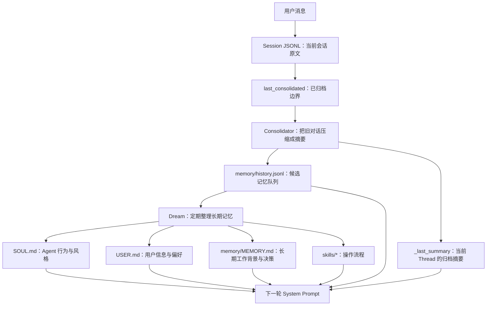
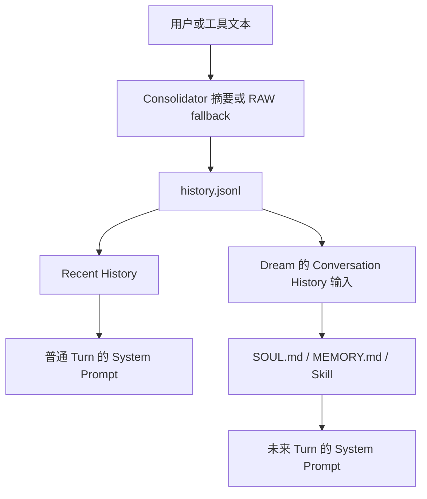

# nanobot 记忆系统设计说明

> 本文只说明 `/Users/jiangfeng/nanobot` 当前代码中的记忆系统。
> 目标是让第一次接触 nanobot 的读者也能看懂：记忆保存在哪里、什么时候产生、怎样进入下一轮对话，以及这套设计的边界是什么。

## 1. 先用一句话理解

nanobot 的记忆不是一个数据库，也不是一个单独的 `MEMORY.md` 文件，而是一条逐步压缩和整理信息的流水线：

```text
当前对话原文
    ↓
Session 会话记录
    ↓
Consolidator 压缩摘要
    ↓
history.jsonl 候选记忆
    ↓
Dream 定期整理
    ↓
SOUL.md / USER.md / MEMORY.md / Skills
    ↓
重新进入后续对话的 System Prompt
```

它最适合的场景是：**一个用户、一个独立 Agent Workspace、一个主要运行进程的本地个人 Agent**。

需要特别注意：就长期记忆加载而言，WebUI 中切换项目只会切换项目工作目录和项目 `AGENTS.md`，不会切换长期记忆。`SOUL.md`、`USER.md`、`MEMORY.md` 和 `history.jsonl` 仍属于同一个 Agent Workspace。

## 阅读前先认识几个词

| 词语 | 本文中的意思 |
|---|---|
| Session | 一份可以持久化和恢复的会话记录 |
| Thread | 用户看到的一段具体对话；本文讨论的主要场景中，它由一个 Session 承载 |
| Agent Workspace | nanobot 保存身份、长期记忆、Skills 和内部文件的根目录 |
| Project Workspace | 当前任务实际操作的项目目录；WebUI 可以在不同项目之间切换 |
| JSONL | 一行一个 JSON 对象的文本文件，便于追加和逐行恢复 |
| cursor | 单调递增的处理位置，用来表示“已经写到或处理到哪里” |
| System Prompt | 模型每轮优先读取的高优先级说明，会影响它怎样理解和执行任务 |

## 2. 它想解决什么问题

大模型一次能读取的上下文是有限的。如果每轮对话都把全部历史重新发送给模型，会出现三个问题：

1. 对话越长，调用成本越高；
2. 历史最终会超过模型上下文窗口；
3. 大量旧消息会干扰当前任务。

nanobot 的解决思路是：

- 最近的消息保留原文；
- 较老的消息压缩成摘要；
- 值得长期保留的内容再整理进稳定文件；
- 后续对话只加载需要的原文、摘要和长期文件。

因此，这套系统的核心不是“无限保存所有聊天”，而是**分层保存、逐步压缩、周期性整理**。

## 3. 总体结构



从代码职责看，它可以分成五层。

| 层 | 保存内容 | 主要位置 | 实际作用域 |
|---|---|---|---|
| Session | 当前会话的原始消息、工具调用、provider 状态 | `sessions/*.jsonl` | 默认 `channel:chat_id` |
| Thread 摘要 | 当前会话旧消息的摘要 | Session metadata 中的 `_last_summary` | 当前 Session |
| 候选记忆 | Consolidator 生成的摘要记录 | `memory/history.jsonl` | 整个 Agent Workspace |
| 长期文件 | 用户、Agent、工作背景等稳定信息 | `SOUL.md`、`USER.md`、`memory/MEMORY.md` | 整个 Agent Workspace |
| 行为资产 | Dream 学到的操作流程 | `skills/*/SKILL.md` | 整个 Agent Workspace |

## 4. 用一个例子看完整过程

假设用户在某次对话中说：

> 以后这个项目统一使用 PostgreSQL。我喜欢你回答得简短一些。

### 第一步：先保存原始消息

消息进入 AgentLoop 后，会在模型开始执行前写入当前 Session。这样即使模型调用或工具执行中断，触发本轮任务的用户消息仍然可以恢复。

Session 默认按 `channel:chat_id` 区分。例如：

```text
telegram:123456
discord:channel-789
websocket:thread-abc
```

这里没有把 `sender_id` 放进默认 Session key，所以同一个群聊中的多个成员通常共享一个 Session。

### 第二步：对话过长时生成摘要

当历史消息开始挤压上下文窗口，Consolidator 会选择最老的一段安全消息，将它压缩成类似下面的内容：

```text
[durable] The project should use PostgreSQL.
[permanent] The user prefers concise responses.
```

摘要会写入 `memory/history.jsonl`。与此同时，Session 的 `last_consolidated` 会向前推进。

这里的“推进”不等于删除原始消息。正常情况下，旧消息仍保存在 Session 文件中，只是 `Session.get_history()` 不再把这部分内容回放给模型。

### 第三步：下一轮临时使用摘要

在 Dream 尚未处理这些摘要之前，最近的 history 条目会作为 `Recent History` 加入下一轮 System Prompt。

当前 Thread 的 `_last_summary` 也可能以 `Archived Context Summary` 的形式进入 System Prompt，用来延续本次对话。

### 第四步：Dream 整理长期记忆

Gateway 启动且 Dream 配置为启用时，默认会每两小时注册一次 Dream；用户也可以通过 `/dream` 手动触发。它会读取：

- 尚未处理的 `history.jsonl` 条目；
- 当前 `SOUL.md`；
- 当前 `USER.md`；
- 当前 `memory/MEMORY.md`；
- 可选的 Dream 指导提示。

按照默认提示词，Dream 可能把例子中的两条信息分别整理到：

```text
USER.md
└── User prefers concise responses.

memory/MEMORY.md
└── This project uses PostgreSQL.
```

Dream 还可以创建或修改 `skills/*/SKILL.md`，用于保存重复出现的操作流程。

### 第五步：长期文件重新进入对话

下一轮构造上下文时，ContextBuilder 会再次读取这些文件。因此刚刚整理出的信息开始影响后续回答。

这解释了 nanobot 所谓的“长期记忆”：它不是从数据库检索某条事实，而是把整理后的 Markdown 文件重新放进模型的 System Prompt。

## 5. Session：短期对话记忆

### 5.1 文件形式

每个 Session 存在一个 JSONL 文件中，文件名由完整 Session key 做 base64url 编码得到。内容包括：

- Session metadata；
- provider continuation/checkpoint 状态；
- user、assistant、tool 等消息。

Session 保存采用临时文件加 `os.replace`。这能保证正常单写者情况下，读取者看到的通常是完整旧版本或完整新版本，而不是写到一半的文件。

### 5.2 模型并不总能看到全部 Session

`Session.get_history()` 从 `last_consolidated` 之后开始读取，并继续执行两层限制：

1. message-count 窗口；
2. token budget 窗口。

它还会尽量从合法的 user/tool 边界截取，避免把孤立的 tool result 交给模型。

所以要区分两个概念：

- **磁盘上仍然保存着消息**；
- **当前模型还能看到消息**。

`last_consolidated` 主要控制第二件事。

### 5.3 Idle AutoCompact

Session 闲置达到配置时间后，AutoCompact 会归档较老的消息并推进 `last_consolidated`。

当前实现不会因为 idle compact 就立即物理删除所有旧消息。只有 Session 达到约 2000 条消息的文件上限时，才会真正裁掉旧前缀；尚未归档的被裁内容会先尝试写入 history。

## 6. Consolidator：从对话到候选记忆

Consolidator 是第一阶段压缩器。它通常在以下时机运行：

- 构造新一轮 prompt 前，发现 token 压力过大；
- 一轮对话保存后，在后台再次检查；
- replay 消息数量窗口即将隐藏较老消息；
- Session 闲置后执行 AutoCompact；
- 用户使用 `/new` 开启新会话时归档旧内容。

### 6.1 它写出的不是最终长期记忆

`history.jsonl` 更像一个候选记忆队列。每行大致如下：

```json
{
  "cursor": 42,
  "timestamp": "2026-08-03 10:30",
  "content": "[durable] The project uses PostgreSQL.",
  "session_key": "websocket:thread-abc"
}
```

其中：

- `cursor` 表示追加顺序，并作为 Dream 的消费高水位；
- `timestamp` 表示归档时间；
- `content` 是摘要文本；
- `session_key` 表示来自哪个 Session。

它没有保存 owner、project、原始 message ID 范围、摘要模型版本、置信度或敏感等级。

### 6.2 摘要失败时的降级

如果调用摘要模型失败，Consolidator 会尽量写入带 `[RAW]` 标记的原始文本片段，而不是直接把对应历史静默丢掉。

这是一个有价值的降级策略，但也意味着普通用户文本或工具输出可能未经充分整理就进入后续记忆链路。

## 7. Dream：从候选记忆到长期文件

Dream 是第二阶段整理器。定时 Dream 只有在 Gateway 启动且 Dream 配置为启用时才会注册，默认间隔为两小时；手动 `/dream` 是另一条入口。

### 7.1 每次处理什么

一次 Dream 默认最多读取 20 条尚未处理的 history，并同时读取当前长期文件。处理完成后，通过 `.dream_cursor` 记录已经消费到哪个 cursor。

> **禁用并不等于暂停。** Gateway 启动时如果 Dream 被禁用，当前代码会把 `.dream_cursor` 直接推进到最新 history。此前尚未整理的 backlog 不会留待以后重新启用时继续处理，也会从 Recent History 中消失。

默认路由规则大致是：

| 内容类型 | 目标文件 |
|---|---|
| Agent 语气、行为、约束 | `SOUL.md` |
| 用户身份、习惯、偏好 | `USER.md` |
| 工作背景、架构、长期决策 | `memory/MEMORY.md` |
| 可复用操作流程 | `skills/*/SKILL.md` |

### 7.2 Dream 的完成语义

只有运行结果为 `completed` 且没有 tool error 时，Dream 才推进 `.dream_cursor`。

但文件编辑并不是事务性的。如果 Dream 先成功修改一个文件，随后才发生错误：

- cursor 不推进；
- 已产生的部分文件修改不会自动回滚；
- finally 阶段仍可能把部分修改提交到 Git；
- 下一次 Dream 会再次处理同一批 history。

因此它属于“允许部分副作用的重试”，不是全部成功或全部失败的原子事务。

### 7.3 Dream 会丢失来源信息

history 记录虽然保存了 `session_key`，但 Dream 构造提示时只展示 timestamp 和 content，没有把 `session_key`、project 或 sender 一起交给模型。

结果是 Dream 看到：

```text
[2026-08-03 10:30] The project uses PostgreSQL.
```

但它不知道这里的“项目”到底是哪一个项目，也不知道这句话由谁提出。

## 8. 长期记忆怎样进入 Prompt

普通一轮对话的 System Prompt 大致按下面的顺序构造：

1. Agent identity 和运行环境；
2. 当前项目的 `AGENTS.md`；
3. Agent Workspace 全局的 `SOUL.md`、`USER.md`；
4. 工具说明；
5. 全局 `memory/MEMORY.md`；
6. 当前激活的 Skills；
7. 尚未被 Dream 消费的 Recent History；
8. 当前 Thread 的 Archived Context Summary。

随后才是当前 Session 的可见消息和本轮用户输入。

这里有两个重要结论：

1. `MEMORY.md` 不是按事实检索，而是整个文件直接进入 System Prompt；
2. history 摘要和 Thread 摘要也会被提升到 System 消息级别，而不是作为普通历史数据传入。

ContextGovernor 在上下文过大时会裁剪普通历史和工具结果，但会优先保留 System 消息。因此长期文件过大时，不能指望最后阶段自动把它安全裁掉。

## 9. Project、User 和 Session 的真实作用域

这是理解 nanobot 记忆系统最关键的一部分。

| 信息 | 当前作用域 |
|---|---|
| Session 原文 | 默认 `channel:chat_id` |
| Thread summary | 当前 Session |
| Recent History | 普通模式下按 Session 过滤 |
| `history.jsonl` 文件 | 整个 Agent Workspace 共用 |
| Dream | 读取整个 Agent Workspace 的 history |
| `USER.md` | 整个 Agent Workspace 共用 |
| `MEMORY.md` | 整个 Agent Workspace 共用 |
| `SOUL.md` | 整个 Agent Workspace 共用 |
| Skills | 整个 Agent Workspace 共用 |
| WebUI selected project | 只影响项目提示和工具工作目录 |

因此，就长期记忆的文件命名空间和加载范围而言，nanobot 的隔离边界是 **Agent Workspace**，不是 Project，也不是 Owner。

这会造成一个两难：

- 一个 Workspace 服务多个项目：用户画像连续，但不同项目的知识会混进同一份 `MEMORY.md`；
- 每个项目使用独立 Workspace：项目知识隔离，但同一用户的 `USER.md` 和 Agent 的 `SOUL.md` 会复制多份并逐渐漂移。

群聊中问题更明显：默认 Session key 不含 sender，同一群成员的偏好可能被归入同一个 `USER.md`。

## 10. 这套设计做得好的地方

### 10.1 简单透明

长期记忆主要是 Markdown 和 JSONL。用户不需要专用管理工具，也能直接查看和理解保存了什么。

### 10.2 分层思路合理

原始消息、压缩摘要和长期知识没有全部塞进一个文件。两阶段整理比“每句话都立即写入永久记忆”更稳妥。

### 10.3 有基本的损坏恢复能力

Session loader 可以跳过损坏 JSONL 行；非法 `last_consolidated` 会回退，倾向于重复归档而不是把全部历史错误隐藏。

### 10.4 对模型失败有降级策略

Consolidator 摘要失败时保留 RAW breadcrumb；Dream 不完整成功时不推进 cursor。

### 10.5 有版本审计意识

Dream 修改长期文件后会尝试记录实际 diff，用户可以通过 `/dream-log` 查看，并通过 `/dream-restore` 恢复历史版本。

## 11. 主要问题与风险

### 11.1 Thread 摘要和长期记忆候选混用了同一份产物

Thread 摘要的目标应该是维持当前任务连续性，例如：

- 当前做到哪一步；
- 哪个工具调用失败；
- 接下来还要完成什么。

长期记忆候选的目标则应该是提取稳定事实，例如：

- 用户长期偏好；
- 已确认的项目约束；
- 经验证的架构决策。

当前 Consolidator 的摘要既被用作当前 Thread 的 `_last_summary`，又进入 history 等待 Dream。一个摘要同时承担两种目的，容易既丢失对话状态，又混入不适合长期保存的临时细节。

### 11.2 普通聊天可能被升级为 System 级指令

history 在这里实际分成两条路径：



这是一条持久化提示注入通道。单用户环境中表现为 Agent 自我污染；多人或群聊环境中，一个成员还可能影响同一 Workspace 后续会话的高优先级提示和持久行为。

尤其是 `SOUL.md`，它控制 Agent 行为和约束，不适合由普通对话自动修改。

### 11.3 跨项目信息会混合

Dream 读取 Workspace 全部 history，构造提示时又丢弃 Session 来源。它无法可靠判断一句“项目以后使用 PostgreSQL”属于哪个项目。

最终这条信息可能进入全局 `MEMORY.md`，并在另一个项目的对话中重新出现。

### 11.4 持久化不是跨文件事务

Consolidator 的关键步骤是：

```text
写 history.jsonl
→ 更新 session.last_consolidated
→ 保存 Session
```

这些操作分布在不同文件中，没有事务 ID 或幂等 chunk ID。进程在中间崩溃时，可能重复归档，也可能出现 Session 已隐藏旧消息但 history 尚未可靠保存的情况。

`history.jsonl` 的高频 append 和 `.cursor` 更新也是两个独立写操作。当前锁主要是单个 Python 对象内的线程锁，不能保护多个进程或多个 `MemoryStore` 实例。

### 11.5 History compaction 可能与 append 竞争

history compaction 会读取全部记录、筛选后重写文件，但没有与 append 共享一个 Workspace 级锁。理论上，新追加的记录可能被基于旧快照的 rewrite 覆盖。

### 11.6 Skill 没有进入完整审计闭环

Dream 可以修改 `skills/*`，但用于判断“长期内容是否变化”的 diff 只覆盖 `SOUL.md`、`USER.md` 和 `MEMORY.md`。`MemoryStore` 配置的 Git 跟踪列表另外包含 `.dream_cursor`，两者都没有包含 Skills。

如果一次 Dream 只修改了 Skill：

- 可能显示没有 memory changes；
- `/dream-log` 看不到；
- `/dream-restore` 无法恢复；
- 修改后的 Skill 却仍会影响未来行为。

### 11.7 删除 Session 不等于遗忘

WebUI 删除 Session 主要删除对应 Session 文件。已经进入以下位置的数据不会自动清理：

- `history.jsonl`；
- `USER.md`；
- `MEMORY.md`；
- `SOUL.md`；
- Skills；
- Dream 内部 Session；
- Git 历史。

当前没有按 user、project 或事实执行完整 `forget` 的能力。

### 11.8 存在容量和信息损失边界

- 普通 Turn 会整体注入 `MEMORY.md`，没有正常的文件大小上限；
- Dream 每次只读取有限数量的 history；
- Dream 对单条 history 只截取有限长度，但处理成功后会确认整条 cursor；
- Consolidator 也可能因 token budget 截断输入，却推进完整的消息范围。

因此系统既可能因为长期文件越来越大而增加固定成本，也可能出现“内容尾部从未被 Dream 看到，但已经被标记为处理完成”。

### 11.9 Git 仓库位置容易被误解

文档中曾把 Git 画在 `memory/.git`，实际 `GitStore` 使用的是 Agent Workspace 根目录 `.git`。

如果 Agent Workspace 本身就是一个现有业务 Git 仓库根目录，Dream 的自动提交可能与业务仓库已有的 staged changes 发生相互影响。

## 12. 哪些场景适合，哪些不适合

| 使用场景 | 适合程度 | 原因 |
|---|---|---|
| 单用户、本地个人 Agent | 适合 | 文件透明，部署简单，长期连续性较好 |
| 单用户、单 Workspace、多个项目 | 勉强可用 | 个人信息连续，但项目知识会混合 |
| 个人记忆要求按项目隔离 | 当前不适合 | MemoryStore 和 Dream 没有 project namespace |
| 项目成员共享知识 | 不适合 | 没有成员权限、来源、版本和显式发布流程 |
| 多用户或群聊 Agent | 风险较高 | Session 默认不含 sender，USER/MEMORY 全局共享 |
| 多进程共享同一 Workspace | 风险较高 | 缺少进程级锁和跨文件事务 |
| 有严格隐私删除要求 | 不适合 | Session 删除不会级联到 history、长期文件和 Git |

## 13. 从领域概念看当前实现

为了避免把所有内容都叫作“Memory”，可以这样理解 nanobot 现有对象：

| 正确概念 | nanobot 当前对应物 | 当前状态 |
|---|---|---|
| Thread Context | Session、`last_consolidated`、`_last_summary` | 已有基础，但摘要和长期候选混用 |
| Personal Memory | `USER.md` | Workspace 全局，不含 owner/project 作用域 |
| Project Knowledge | `MEMORY.md` | 只是全局文本，不是真正项目知识系统 |
| Agent Policy | `SOUL.md` | 可被 Dream 从聊天自动修改，权限过高 |
| Memory Candidate/Event | `history.jsonl` | 有 `session_key` 和全局高水位，但缺 owner/project/message 范围，也没有逐条处理状态 |
| Skill | `skills/*` | 可执行行为资产，不应被普通记忆审计遗漏 |

## 14. 如果继续演进 nanobot，建议的顺序

以下建议仍然可以保持 nanobot 的 local-first 和文件化特点，不要求立刻引入数据库。

### 第一阶段：先修正确性和安全边界

1. 给 history chunk 增加稳定幂等 ID、原始 message 范围和 project/sender 信息；
2. 使用 Workspace 级文件锁串行化 append、compaction 和 Dream；
3. Dream 在临时目录完成编辑，校验成功后再一次性替换正式文件；
4. Dream 失败时不提交部分修改；
5. Skills 纳入完整 diff、审计和恢复；
6. 不再把 RAW 用户内容直接提升为 System 指令。

### 第二阶段：拆开不同领域

1. Thread summary 只服务当前 Session；
2. 用户偏好单独保存，并带 owner/project 作用域；
3. 项目知识使用项目 namespace，保存来源和版本；
4. `SOUL.md` 改为显式治理的 Agent Policy，不从普通聊天自动学习；
5. Skill 使用独立的创建、审批和发布流程。

### 第三阶段：补上用户控制

1. 查看每条记忆及其来源；
2. 修改或删除单条事实；
3. 按 Session、Owner、Project 执行遗忘；
4. 明确 Git 历史的保留和清理策略；
5. 对敏感信息进行检测、脱敏或拒绝持久化。

## 15. 最终评价

nanobot 最有价值的设计是这条两阶段提升链路：

```text
原始会话 → 压缩候选 → 整理后的长期文件
```

它简单、直观，也容易让用户直接检查。但它依靠 Agent Workspace 和提示词承担了过多职责：作用域、权限、来源判断和内容路由都没有进入明确的数据模型。

所以，准确的产品定位应该是：

> nanobot 当前实现的是一个面向本地单用户 Agent 的 Workspace 级连续记忆系统，而不是按用户和项目隔离的记忆平台，也不是项目成员共享的知识系统。

理解这个边界后，它的设计就很容易评价：作为轻量个人 Agent 记忆，它是一个不错的实现基础；作为多项目、多用户或共享知识基础设施，则需要先重构作用域、来源、权限和事务模型。

## 16. 关键源码索引

| 主题 | 入口 |
|---|---|
| MemoryStore 文件布局、history、Dream | [`nanobot/agent/memory.py`](../nanobot/agent/memory.py#L73-L112) |
| 一轮对话的执行顺序 | [`nanobot/agent/loop.py`](../nanobot/agent/loop.py#L1514-L1522) |
| System Prompt 构造 | [`nanobot/agent/context.py`](../nanobot/agent/context.py#L54-L127) |
| Session 数据结构和持久化 | [`nanobot/session/manager.py`](../nanobot/session/manager.py#L149-L314) |
| Idle AutoCompact | [`nanobot/agent/autocompact.py`](../nanobot/agent/autocompact.py#L76-L154) |
| Dream 手动命令 | [`nanobot/command/builtin.py`](../nanobot/command/builtin.py#L417-L501) |
| Dream 定时任务 | [`nanobot/cli/gateway_runtime.py`](../nanobot/cli/gateway_runtime.py#L459-L531) |
| Dream 默认整理规则 | [`nanobot/templates/agent/dream.md`](../nanobot/templates/agent/dream.md#L1-L108) |
| Consolidator 默认摘要规则 | [`nanobot/templates/agent/consolidator_archive.md`](../nanobot/templates/agent/consolidator_archive.md#L1-L23) |
| Git 审计实现 | [`nanobot/utils/gitstore.py`](../nanobot/utils/gitstore.py#L67-L186) |
| Workspace/Project 工具边界 | [`nanobot/security/workspace_access.py`](../nanobot/security/workspace_access.py#L109-L165) |

## 17. 验证范围

本文基于仓库 `main` 分支提交 `44b7e1bf417a` 的源码与测试进行分析。

已运行以下聚焦测试：

```text
tests/agent/test_memory_store.py
tests/agent/test_consolidator.py
tests/agent/test_dream.py
tests/agent/test_auto_compact.py
tests/session/test_session_fsync.py
tests/session/test_consolidated_offset_clamp.py
```

结果：`213 passed`。

这些测试覆盖了主要单实例正常路径，但不等于已经验证：

- 多进程同时共享同一 Workspace；
- 进程崩溃或机器断电；
- 手动 Dream 与定时 Dream 重叠；
- NFS、FUSE、Windows 等文件系统差异；
- 实际模型供应商下的摘要和 Dream 质量；
- 多用户、群聊和项目级隐私隔离。
