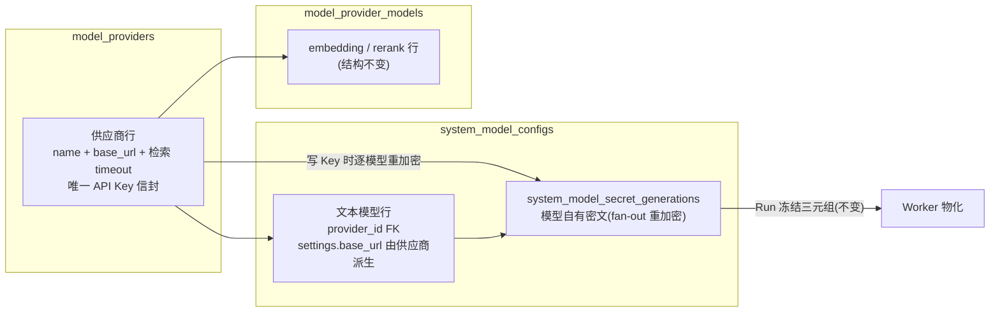

# 模型管理供应商化统一 Implementation Plan

> 状态：已立项（2026-08-31），已按源码评审修订，未实施、未验证新行为。
> 本次修订只更新计划，不授权修改业务代码、部署或重建任何现有数据库。
> 背景：`/admin/settings/models` 当前存在两套管理面——文本模型（`app/system_settings/`，
> 每模型一把 API Key）与检索模型供应商（`app/model_registry/`，供应商级 Key）。
> 同一供应商同时提供 chat/Embedding/Rerank 模型时，Key 需重复配置、交互割裂。
> 本计划把文本模型并入供应商中心制注册表。
> 用户补充：会话仍选择具体模型；一个供应商可管理多个模型；默认初始化 DeepSeek
> 和 SiliconFlow，分别沿用各自之前的 Key，不生成、互换或轮换 Key。
> 前置：M9 模型注册表（`2026-08-30-rag-knowledge-m9-model-registry.md`）已交付。

## 目标与最终形态

- `/admin/settings/models` 只剩一套"模型供应商"管理面：供应商卡片（名称、Base URL、
  检索请求超时、Key 已配置）下挂文本模型（chat）与 Embedding/Rerank 模型。
- 供应商与模型是一对多关系。同一供应商下的每个文本模型保留自己的稳定模型 ID、
  型号、显示名称、能力和 settings；`provider_id` 是普通外键索引，不加唯一约束。
- 会话输入框仍选择具体文本模型，不改成选择供应商，不把同一供应商的多个模型合并
  成一个选项。供应商分组仅用于管理页；会话选择、默认模型和 Run 冻结仍指向模型 ID。
- API Key 只在供应商上配置（write-only、替换式、无清除）；文本模型卡片删除
  "清除 API Key"入口。
- 文本模型行（`system_model_configs`）保留全部执行语义（adapter、settings、能力位、
  `max_input_tokens`、`payload_checksum`、Secret generation），新增必填
  `provider_id`；Run 准入冻结、Worker 三元组重锁解密、幂等重放保持现有契约，
  不为供应商管理改写 Run 执行链。
- 默认初始化 DeepSeek 及当前三个文本模型，同时初始化 SiliconFlow 及现有默认
  Embedding/Rerank 模型；两个供应商分别沿用原有 Key。其他供应商/模型由管理员
  按需添加，不将 SiliconFlow 的检索模型放入会话文本模型选择器。

核心机制：Secret recipient 为 `system-model:{model_id}:api-key:{adapter}:{origin}`，
供应商 Key 写入使用本次校验后的明文；读取已存 Key 时只解密一次，按各模型 recipient
`SecretEnvelope.protect` 生成新 generation 并墓碑旧行——与现有 bootstrap
"一把 Key 变三份密文"（`backend/app/system_settings/bootstrap.py`）和 Skill
Generation 重加密先例同模式。

## 源码核对与修订边界

- 已确认：现有文本模型管理写路径先锁 catalog 再锁模型；Run 按 Lead、委派、辅助
  模型的语义顺序锁行。因此批量 fan-out 只按模型 UUID 排序不能消除死锁路径。
- 已确认：当前安装使用 SiliconFlow Key 或显式 skip，但其种子函数遇到任意供应商
  即跳过；新增 DeepSeek 后须改为按种子身份判断，确保默认初始化两个供应商。
  模型管理与 registry 分别维护缓存；内部 descriptor 同时服务完整 settings 校验及
  物化；KnowledgeModule 当前拥有探活客户端，均需按下文调整。
- 下文是待实现的目标契约。锁冲突、安装组合、候选 Key 测试及 UI 联动必须在实现后
  取得新测试证据，已有仓库门禁结果不代表本改造已通过。

## 本次修订采用的设计决策

1. Schema 直接改 V1 快照，不引入迁移脚本。旧库重建是后续独立操作者动作，详见
   第 10 步；实施和测试不以提前重置开发库为前提。
2. Key 完全供应商级，无模型级覆盖、无清除；文本模型 clear-key 路由删除。供应商
   保存的 Key 与每个模型的 generation 均保持独立信封，Worker 不读取供应商 Key。
3. 文本模型不进 `model_provider_models`；新增
   `system_model_configs.provider_id` 必填外键。允许在文本模型编辑界面更换供应商，
   保留模型身份、状态和默认选择。只要还有文本模型绑定（包括 suspended），就不能
   删除供应商；可先改绑文本模型，再按现有规则移除检索模型，最后删除空供应商。
4. `settings.base_url` 由服务端从供应商派生。外部 authoring 拒绝该字段，响应与
   冻结 payload 保留它。供应商 URL 实际变化必须同请求携带新 Key，且继续遵守
   已被 Knowledge Base 使用的 Embedding 模型所带来的 endpoint 冻结限制。
5. 模型页的连接测试使用选定供应商的存储 Key；供应商弹窗另有明确的候选 Key 测试，
   不先保存、不替换现用 Key。两种请求契约分开，内部复用现有模型构造和测试逻辑。
   保存供应商不自动调用文本模型；Embedding/Rerank 的 freeze→probe→settle 保留。
6. `provider.request_timeout_seconds` 本次继续只控制 Embedding/Rerank 请求和对应
   探活，界面标注“检索请求超时”。文本模型保留各 adapter 原有超时 settings，
   不增加继承或覆盖规则，也不合并请求超时与流式片段超时。
7. 注册表在 Knowledge 关闭时仍可用。knowledge 包导出独立探活客户端工厂和
   `retrieval_model_in_use(session, model_id)`；Gateway lifespan 拥有 registry
   专用客户端，KnowledgeModule 继续拥有自己的客户端，双方不共享关闭责任。
8. Key 轮换、URL/adapter 变化、供应商改绑会销毁受影响模型的旧 generation，
   引用它们的旧 Run 后续物化仍按既有契约返回 `RUN_ASSET_STALE`。不回退读最新 Key，
   不修改已冻结 payload；界面应在保存前说明影响范围。
9. 安装默认创建 DeepSeek（三个现有文本模型）和 SiliconFlow（现有 Embedding/
   Rerank 模型）。分别沿用 `ACT_WEAVE_BOOTSTRAP_DEEPSEEK_API_KEY` 和
   `ACT_WEAVE_BOOTSTRAP_MODEL_PROVIDER_API_KEY` 的原有初始化输入，不新增 Key 来源，
   不把 DeepSeek Key 用于 SiliconFlow，不生成或轮换 Key。保留原有显式 skip 选项
   供其他部署主动使用；本计划默认不启用 skip，Knowledge 关闭也不自动跳过种子。
   本次修订不读取密钥值，也不声称已验证初始化输入与数据库现用值一致；实际重建前
   应在受控预检中确认，两把 Key 均不得写入文档、源码或输出。

## 会话模型选择不变式

- `/api/models` 继续返回可用的具体文本模型及其能力，沿用现有公开契约；不返回供应商
  选项、Key 或供应商连接材料。`name`/`model` 继续是模型 UUID，不能换成供应商 ID。
- 主会话和 sidecar 的 `model_name` 选择值继续指向模型 ID。同一 DeepSeek 供应商的
  Flash、Pro 等模型可分别选择，不能按 `provider_id` 去重，也不由服务端替用户任选
  一个型号。能力过滤、默认模型与每次 Run 的冻结规则保持原行为。
- 管理页更换某模型所属供应商不改变该模型 ID；会话已选模型无需改成供应商选择。
  Key 换代对旧 Run 的影响仍遵循上文契约。Embedding/Rerank 不进入会话文本模型选项。

## 变更行为矩阵

下表的 catalog 递增均为一次成功事务一次，不按绑定模型数量累加；组合变更先形成
最终配置，每个模型最多换代一次、revision 最多递增一次。未改字段不从旧快照写回。

| 操作 | 模型 generation / secret_revision | 文本模型 revision / payload_checksum | catalog revision |
| --- | --- | --- | --- |
| 新建文本模型 | 首 generation，secret_revision=1 | revision=1；派生后计算 checksum | +1 |
| 显式替换供应商 Key（含再次提交相同 Key） | 全部绑定模型换代，各 +1 | 各 revision +1；checksum 不变 | 有绑定文本模型时 +1 |
| 供应商 URL 变化，同时提交 Key | 全部绑定模型换代，各 +1 | 各 revision +1；派生 URL 后重算 checksum | 有绑定文本模型时 +1 |
| 文本模型改绑供应商 | 无论 origin/Key 是否相同均换代，+1 | revision +1；派生后重算，相同 payload 可保持相同 checksum | +1 |
| 文本模型 adapter 变化 | 用选定供应商 Key 换代，+1 | revision +1；重算 checksum | +1 |
| 文本模型显示名称变化 | 不变 | revision +1；checksum 不变 | +1 |
| 文本模型超时、模型名称或其他执行配置变化 | 不变 | revision +1；重算 checksum | +1 |
| 仅供应商显示名称变化 | 不变 | 均不变；响应中的 provider_name 更新 | 有绑定文本模型时 +1 |
| 仅供应商检索请求超时变化 | 不变 | 均不变；保留检索模型的现有探活 | 不变 |
| 文本模型启停 / 设默认 | 不变 | 启停按现有规则递增 revision；默认切换不改模型 payload | 实际状态或默认变化时 +1 |

- fan-out 覆盖当前全部绑定文本模型，包含 suspended，不改模型状态、能力位及默认选择。
- 墓碑原因比较实际 `model_secret_recipient`：adapter 或 origin 改变使用
  `recipient_changed`；仅 URL 路径变化、同 origin 改绑或普通替换使用 `replaced`。
  供应商 ID 不在 recipient 中，不能以 recipient 未变为由跳过改绑后的换代。
- 模型配置、供应商材料、generation、墓碑、revision 和成功审计同事务提交。
  仅名称/超时更新不得触发无关 generation 换代；未受影响的模型与旧 Run 保持原行为。

## 锁顺序与冲突协议

1. 同时涉及供应商和文本模型的管理写事务统一使用
   `admin → catalog state → provider → system_model_configs → generation`。
   模型启停/设默认继续遵循现有 catalog→model 顺序；禁止持有模型或供应商锁后再
   补拿 catalog 锁。纯检索写路径保留原有顺序，不反向调用 catalog 写入。
2. 新建模型先锁 catalog，再对供应商 `FOR SHARE`。改绑时在 catalog 锁下读取当前
   归属，按 UUID 排序锁旧、新供应商，再锁模型并复验归属；派生材料只取自锁内行。
   供应商修改和删除用 `FOR UPDATE`；repository 不 commit。
3. 供应商更新保留检索侧 freeze→事务外 probe→settle。在 settle 内按上述顺序锁定
   catalog、供应商；Key、URL、检索超时等材料变化按原规则复验检索侧冻结材料及
   引用限制，再查询当前全部绑定文本模型。仅改名称不因期间 Key/URL/超时变化而
   冲突，只更新名称，按当前绑定集合判断 catalog 是否递增。
   文本模型不自动探活，不新增其集合的 freeze 比较；锁内当前集合包含期间新建或
   改绑进来的模型，不能沿用 freeze 时的旧成员列表进行 fan-out。
4. fan-out 按 UUID 排序以 `FOR UPDATE NOWAIT` 获取全部目标模型及需要换代的
   generation 锁，全部取得后才修改。任一锁忙则回滚整个 settle，并通过现有域错误
   约定返回 HTTP 409、提示“模型正在使用，请稍后重试”；只将明确的锁忙异常转为
   冲突，不掩盖其他数据库故障。不使用 `SKIP LOCKED`，不产生部分更新。
5. 服务端及浏览器都不自动重试写入或外部探活。用户主动重试重新走完整流程；需要
   复验的冻结材料已变也返回 409。Run 继续按原语义顺序锁模型，不引入新的 Run 锁协议。
6. 网络调用不得持有数据库事务。显式替换使用本次校验后的 Key；新建、改绑或
   adapter 变更读取已存 Key 时每个供应商只解密一次，在事务内按模型 recipient
   重新保护。明文仅存在本次授权操作内存中，不进入日志、审计或响应。

## 连接测试与字段边界

- 文本模型连接测试：提交 `provider_id`、adapter、模型名称、能力和可编辑 settings，
  不接收 `api_key`/`settings.base_url`。服务端在授权短事务内读取供应商、取得当前
  Key 并派生 URL，事务结束后复用现有 `ModelConnectionTester`。结果只表示本次
  测试材料成功或失败，不授予后续保存权限，不表示未来配置始终有效。
- 供应商候选 Key 测试：独立 strict DTO 接收候选 `base_url`、非空 `SecretStr`
  Key 和一个显式选定的文本模型测试配置（新供应商可填写 adapter/模型）。不要求
  先存在供应商行，不创建任何供应商、模型、generation，也不改变当前 Key。
  只支持现有 adapter/能力校验和最小测试请求，不增加第二套 SDK 工厂。
- 候选测试只由用户点击触发，标明可能计费；保存不自动重复文本探活。更改候选 Key、
  URL 或测试模型配置后清除本地成功标记；未测试仍允许保存，但显示影响范围和警告。
  测试一个模型成功不等于该供应商所有模型均已验证。
- 测试期间禁用候选 Key/URL/目标编辑和保存操作；关闭弹窗后清空草稿并丢弃迟到
  响应，不能把旧测试结果标到重新打开的弹窗上。不以取消浏览器请求保证远端免计费。
- Key 通过 imperative 请求发送，仅留在当前弹窗瞬态状态，不放入 query/mutation
  缓存、浏览器存储、响应或错误详情；关闭或保存成功后清空。内部
  `SystemModelConnectionCheck.api_key` 仍是瞬态材料，不能随外部 DTO 一起删除。
- 保留内部 adapter descriptor 的 `base_url` 和完整 settings/物化校验。只在管理
  descriptor 响应中过滤该编辑项；外部 authoring 边界先拒绝用户提交的派生字段，
  再由服务层注入 URL 并做现有完整校验及 checksum 计算。前端读取已存 settings
  时显式剔除这一已知派生字段后构建草稿，不将它标成 incompatible 或 preserve
  后回传；其他未知字段仍按原规则拒绝。

## 实施纪律

1. 涉及 strict DTO/Schema 的变更在功能分支内联调后一起交付，不发布中间不兼容状态。
2. 每步按聚焦失败测试 → 最小实现 → 回归验证推进（TDD）；权限、lease、版本和
   Run 冻结回归不得随重构删除。
3. Run 冻结/物化契约（快照三元组、复合外键、幂等重放）是不变式。允许调整管理
   写路径和外部 authoring 校验，不更改快照结构、Worker 读取方式及执行链锁序。
4. 本计划不引入迁移框架；临时测试库与操作者目标库必须区分，`make reset-db`
   是显式操作者动作。

## 分步实施

### 第 1 步 Schema V1（后端持久化四件套）

- `backend/packages/harness/deerflow/persistence/system_settings/model.py`：
  `SystemModelConfigRow` 加 `provider_id` UUID NOT NULL + FK→`model_providers.id`
  （RESTRICT）+ 索引。
- 同步 `backend/packages/harness/deerflow/persistence/full_schema.sql`
  （DDL + 内嵌注释块）。当前 `system_model_configs` 创建早于 `model_providers`，
  新外键用具名 `ALTER TABLE` 放在供应商表创建之后；ORM 与 SQL 的约束名、
  `ON DELETE RESTRICT` 保持一致，不把 FK 放进引用尚不存在表的早期 DDL。
- `backend/scripts/generate_schema_comments.py`：`_TABLE_COLUMN_PHRASES` 加新列
  中文短语，`_EXPECTED_COLUMN_COUNT` 1352→1353，重新生成 `schema_comments.sql`。
- 装一次性 PG 库，用 `read_schema_v1_catalog_signature()` 实读回填
  `final_schema_contract.py` 签名与 `final_schema_digest.py` 摘要。两张表已经注册，
  本次无新增表，不机械添加 required relation；签名取自全部 DDL 定稿后的实际目录。

### 第 2 步 knowledge 包新导出与 Gateway 资源所有权

- `backend/packages/knowledge/actweave_knowledge/__init__.py` 增加两个模块级入口：
  独立探活客户端工厂（包内 `KnowledgeModelClient` 的受控构造）与不持事务的
  `retrieval_model_in_use(session, model_id)`（现 `KnowledgeModule.model_in_use`
  查询的模块级版本，先例：`purge_knowledge_query_history`）。
- `backend/app/gateway/deps.py`：在现有 `AsyncExitStack` 中创建 registry 专用
  探活客户端，立即注册 `aclose`，通过 `app.state` 提供给请求依赖。请求只借用，
  不按请求构造、不关闭。正常退出和后续启动失败都应释放客户端。
- KnowledgeModule 仍创建和关闭自身客户端，避免共享实例导致双重所有权。
  registry 客户端不依赖 MinIO、Knowledge 开关或 Worker 的模块启动；独立
  `model_in_use` 查询仍检查数据库里已有 Knowledge Base 的引用，不能因开关关闭跳过。
- 更新包公开接口测试与 `docs/knowledge/RAG知识库设计文档.md` 接口清单。

### 第 3 步 注册表服务：解耦 + fan-out

- `backend/app/model_registry/gateway.py`：`get_model_registry_service` 不再依赖
  `get_knowledge_module`，改用 lifespan 客户端及独立引用查询组装；去掉
  KNOWLEDGE_DISABLED 门，保留管理员授权、审计依赖和 schema readiness 的失败关闭。
- `backend/app/model_registry/service.py`：
  - `update_provider` 按“锁顺序与冲突协议”及“变更行为矩阵”实现，不对每次更新
    无条件 fan-out。新增位于 `app/system_settings/` 的窄协作件（如
    `provider_key_fanout.py`），只负责锁内派生配置、重加密和模型审计；调用者拥有
    事务和最终 catalog 递增，不新增通用事务/重试框架。
  - 明确处理 NOWAIT 锁忙为 409，不能落入通用存储异常变为 503；retrieval 冻结
    材料变化继续沿用现有冲突语义。rename-only 不回写 freeze 时的旧 URL/超时/Key。
  - `delete_provider` 在同一锁协议下拒绝任何文本模型绑定；`list_providers` 及
    create/update 返回的 `model_count`、`active_model_count` 都聚合文本与检索模型。
    endpoint_frozen 仍按 Embedding 引用判断，不能把文本模型数量当成冻结依据。
- 审计沿用 `model.secret.configure` / `model.secret.replace` 家族；实际换代才写
  模型 Secret 事件，按实际 recipient 判定墓碑原因，与供应商变更共同提交。

### 第 4 步 系统模型服务与路由

- `backend/app/system_settings/service.py`：`create_model`/`update_model` 收
  `provider_id`、不再收模型级 `api_key`；按统一锁协议派生 `settings.base_url`、
  创建首个 generation。这里的 ready 仅指 Secret Readiness，不代表远端调用成功。
- 编辑允许改绑，按最终供应商/adapter 材料至多换代一次；同 URL 的不同供应商也
  必须替换 generation。保留模型 ID、状态、默认引用和未编辑能力，删除 clear-key
  操作；模型只改显示信息或超时不读取、重加密供应商 Key。
- `backend/app/gateway/routers/admin_model_settings.py`：create/update 请求模型加
  `provider_id` 删 `api_key`；删除 `/api-key/clear` 路由；`test-connection` 请求
  删 `api_key` 加 `provider_id`；`AdminModelItemResponse` 加
  `provider_id`/`provider_name`，相关 service command/view 同步更新。
- `backend/app/model_registry/gateway.py`：新增
  `POST /api/admin/settings/model-providers/test-connection`，接收供应商候选 URL/Key
  及文本模型测试目标，返回安全的 `{status, request_id}`。复用系统模型测试服务与
  materializer，保持管理员鉴权、现有 URL/adapter 校验、错误脱敏；不得创建或修改
  配置。已有检索模型测试和保存时探活保持原接口，本次不新增统一探活框架。
- `backend/app/system_settings/validation.py` 与路由：分开外部 authoring 拒绝检查
  和内部完整 settings 校验；管理 descriptor 响应过滤 `base_url`，内部 descriptor、
  `validate_model_settings` 及 materialized 校验继续接受服务端派生的完整配置。
- Run 冻结链（`app/private_work/snapshot_repository.py`、
  `app/system_settings/execution_adapter.py`、materializer、executor）不动。

### 第 5 步 Bootstrap 与种子

- `backend/app/system_settings/bootstrap.py`：种子改为 1 个 "DeepSeek" 供应商行
  （base_url `https://api.deepseek.com`，供应商级信封）+ 3 个绑定文本模型 +
  3 份模型 generation，固定供应商 ID；供应商先插入并 flush，再插模型/代际。
  三个型号继续为 `deepseek-v4-flash`、`deepseek-v4-pro`、
  `deepseek-v4-flash-vision-exp`，保留原模型 ID、默认 Flash、Vision 选择、能力和
  文本模型超时。用现有 DeepSeek 初始化 Key 生成供应商信封及三份独立模型信封；
  加密随机数各自独立不代表轮换了供应商实际 Key。
- `backend/app/model_registry/bootstrap.py`：保留 SiliconFlow 种子、现有供应商/
  模型固定 ID、`https://api.siliconflow.cn/v1` 及现有参数。初始化
  `Qwen/Qwen3-VL-Embedding-8B`（4096 维）和 `Qwen/Qwen3-VL-Reranker-8B`，
  使用之前的 SiliconFlow Key 保护供应商信封，不使用 DeepSeek Key 替代。
- 修正 SiliconFlow 幂等判断：在现有 advisory lock/事务中按固定供应商 UUID
  判断已安装，不再因 DeepSeek 或其他供应商存在就跳过。固定 ID 已存在则只读返回，
  保留人工改名、URL、超时、Key、模型状态及删除结果；固定 ID 不存在但默认名称被
  另一 ID 占用时显式报 bootstrap conflict，不复用同名行。首次插入按供应商→flush→
  两个检索模型原子完成；模型身份冲突整体失败，不修复既有数据。
- `backend/scripts/setup_postgres.py`、`backend/scripts/reset_postgres.py`：保留
  两套种子的安全预检与材料传递，默认初始化 DeepSeek 后再初始化 SiliconFlow。
  DeepSeek Key、SiliconFlow Key 与 `ACT_WEAVE_SECRET_KEY` 在 DDL/删除前预检。
  保留 `ACT_WEAVE_BOOTSTRAP_MODEL_PROVIDER_SKIP=1` 作为明确的可选部署决定，
  但本计划默认初始化流程不使用它；不得因 Knowledge 关闭或未提供 SiliconFlow
  Key 而静默跳过，默认流程缺 Key 必须在写入/删除前失败。
- 保留 `backend/scripts/run_runtime.py` 对 bootstrap Key/skip 环境变量的安全
  阻断及其负向测试，不能把仅安装使用的 Key 传给 Gateway/Worker；独立质量评测
  的测试供应商 Key 不改成 DeepSeek Key，也不作为安装前置。
- DeepSeek 首次插入检查固定身份及名称冲突，不复用另一身份的同名供应商；完整既有
  schema 的重复 setup 继续只读检查返回，不重新索要初始化 Key、不补种或覆盖现用 Key。
  直接重复 bootstrap 保留已有目录和合法改绑，不恢复默认配置，也不删除任何已有
  供应商或检索模型；追加其他供应商/模型仍由管理员操作。
- 本次不读取 `.env` 或数据库秘密。未来重建分别沿用两个供应商的原有初始化输入；
  若输入与相应供应商现用 Key 不一致，应在重建前完成受控确认，不能从多个模型
  任取一把 Key，或在销毁数据库后才查找现用 Key。运行时不增加环境 Key 回退。
- 测试种子：`backend/tests/support/system_model_seed.py`、
  `backend/tests/knowledge/registry_helpers.py` 统一补供应商行，吸收全仓消费方
  测试的涟漪。

### 第 6 步 后端测试（TDD，先写失败用例）

- 更新：`test_system_model_application_contract.py`（路由契约）、
  `test_default_system_model_bootstrap.py`、`test_system_model_schema_contract.py`
  （+`provider_id` 断言）、`test_schema_comments_contract.py`、
  `test_setup_postgres.py`（签名门）、`test_reset_postgres.py`、
  `test_runtime_environment_security.py`（初始化变量不进入服务环境）、
  `tests/knowledge/test_model_registry_service.py`、
  `tests/knowledge/test_admin_api.py`（解耦后门禁）、
  `tests/knowledge/test_schema_repository.py`（默认两个供应商；显式 skip 时仍有
  DeepSeek）；重置脚本测试覆盖两套种子的删除前预检边界。
- 使用真实 PostgreSQL 和同步屏障验证两位管理员并发 fan-out 与启停、设默认、创建、
  改绑；不能只用同一个管理员，因为 admin 行锁会掩盖锁序问题。构造 Run 按 B→A、
  fan-out 按 A→B 的竞争：fan-out 明确 409 且全部回滚，Run 可继续，主动重试成功。
- 独立持有一个当前 generation 锁、不锁模型行，验证 fan-out 取得模型锁后仍立即
  409、释放已有锁且零提交，避免漏掉代际锁忙处理。仅改供应商名称与 Key 轮换并发
  时保留两者结果，不能因材料快照变化拒绝改名或用旧材料覆盖新 Key。
- 验证当前绑定集合覆盖 suspended 及 probe 期间新建/改绑的模型；第二个模型重加密
  失败时，供应商、全部模型/代际/墓碑/revision/成功审计无部分提交。检索探活失败、
  冻结材料变化和管理员权限撤销也不能提交 chat fan-out。
- 按变更矩阵验证代际、revision 和 checksum；覆盖同 origin 不同 Key 的供应商
  改绑、同 origin URL 路径变化、跨 origin 变化及组合更新只换代一次。Key 换代后的
  旧 Run 物化仍报 `RUN_ASSET_STALE`；仅改名称或超时的旧 Run 仍用冻结材料。
- 连接测试覆盖：存储 Key 路径、未保存供应商候选路径、候选成功/失败均零配置写入、
  候选不得回退读存储 Key、拒绝模型 authoring 注入 Key/URL、现有物化校验回归。
  保持错误及日志不含 Key、完整请求/提供方响应；保存不自动调用文本模型。
- Gateway 生命周期覆盖：Knowledge 关闭且无 MinIO 可管理/探活；请求复用客户端；
  正常停止和后续启动失败均释放；Knowledge 启用时两个客户端各自关闭；关闭开关后
  已有 Knowledge Base 引用仍保护检索模型。
- 完整安装联合验收（不能只分别测两个种子函数）：

  | 场景 | 供应商 | 文本模型 | 检索模型 | 初始模型 generation |
  | --- | --- | --- | --- | --- |
  | 默认全新安装，分别提供原有 DeepSeek/SiliconFlow Key 和系统加密 Key | 2 | 3 | 2 | 3 |
  | 其他部署主动显式 skip SiliconFlow seed（非本计划默认） | 1（DeepSeek） | 3 | 0 | 3 |

  验证三个文本模型绑定 DeepSeek、两个检索模型绑定 SiliconFlow，模型各有独立 ID，
  文本模型仍可分别选择。测试使用两把不同的虚构 Key：DeepSeek 与其三个模型解密
  结果一致，SiliconFlow 仍使用自己的 Key，不调用或输出现用 Key。验证默认 Flash
  与 Vision 引用；DeepSeek 先初始化不会让 SiliconFlow 漏建；Knowledge 关闭时
  默认数量不变；未显式 skip 而缺 SiliconFlow Key 时在 DDL/删除前失败。直接重复
  bootstrap 不覆盖人工修改、不新增代际；同名不同 ID 冲突零写入；完整 schema
  重复 setup 不重新索要 bootstrap Key、不重置数据。
- 公共模型列表和 Run 准入回归：同一供应商的多个文本模型保留独立选项，选择不同
  模型冻结对应模型 ID/能力；不能用供应商 ID 代替模型 ID，检索模型不混入文本选项。
- 从 `backend/` 执行焦点 `uv run pytest`、
  `uv run python scripts/generate_schema_comments.py --check`、`make format`、
  `make test`、ruff 检查和相关 blocking-I/O 门禁。`make test` 使用非生产开发连接
  派生随机隔离测试库，core suite 要求零 skip；不得对命名开发库运行测试 DDL。

### 第 7 步 前端契约层

- `frontend/src/core/admin-settings/models/`：item/create/replace schema 加
  `provider_id`（+`provider_name` 展示），删 `api_key` 与 clear 契约、test 输入
  删 `api_key` 加 `provider_id`；`provider-settings-form.ts` 把 `base_url` 从
  响应 settings 中作为已知派生字段剔除后再构建草稿，禁止序列化回传。
- `frontend/src/core/admin-settings/model-registry/`：去掉
  `isKnowledgeDisabledError` 空态依赖；providers item 聚合数含文本模型；增加候选
  Key 连接测试的 strict schema 和 imperative 请求，不把 Key 放入 TanStack 状态。
- 新建一个共享目录失效函数，配置写入成功后同时失效当前账户的
  `adminModelSettingsRoot`、`adminModelRegistryRoot` 与公共 `modelsQueryKey`。
  供应商创建/更新/删除、文本模型创建/编辑/改绑/启停/设默认、检索模型创建/启停/
  删除均调用；无配置写入的连接测试不失效目录。不要依赖窗口焦点自动刷新。

### 第 8 步 前端统一 UI

- 会话输入框、sidecar 与公共模型契约保持按模型选择；本步供应商卡片只重构管理页，
  不把会话模型选择器改为供应商选择器，不按供应商合并多个模型选项。
- 重构 `frontend/src/components/admin/settings/admin-model-settings-page.tsx` +
  `admin-model-registry-page.tsx` 为单一"模型供应商"区块：供应商卡片
  （编辑/删除/添加模型）内分组渲染文本模型子列表（admin model catalog 按
  `provider_id` 分组，保留 编辑/启停/设为默认/测试，去掉清除 Key）与
  Embedding/Rerank 子列表（现有交互）。
- 文本模型编辑弹窗：删 API Key 字段与 `base_url` 设置项，新建时选供应商；供应商
  选择也适用于编辑改绑，显示对应 endpoint；切换供应商不自动抹掉 adapter、模型名、
  能力、输入上限或其他 settings。保留默认模型身份并提示改绑对旧 Run 的影响。
- 供应商弹窗承接唯一的 Key 输入和显式候选测试；新供应商可填写一个临时文本模型
  目标，已有供应商可用绑定模型预填。测试成功后 Key 仅留在弹窗瞬态内存供随后
  保存，关闭或保存成功清空，不通过缓存保存。再次编辑测试参数会撤销本地测试标记。
- 卡片只显示“Key 已配置”，不得从 `active_model_count > 0` 推断“已验证”。
  `Secret Readiness`、active 状态、本次测试结果分别呈现，不新增持久化测试状态。
  供应商超时文案为“检索请求超时”；只含文本模型时也明确它不作用于文本请求。
- 供应商改 Key/URL 时展示受影响绑定模型数量及旧 Run 失效提示；删除失败说明仍有
  绑定模型，支持通过改绑清空文本模型，检索侧继续使用原有引用限制和删除流程。
- 两组内联双语文案（约 69+58 键）合并为一套；中央 i18n 仅导航标签不动。

### 第 9 步 前端测试

- 更新：`admin-model-settings-page.test.tsx`、`provider-settings-form.test.ts`、
  `admin-contracts.test.ts`、`frontend/tests/e2e/admin-model-registry.spec.ts`
  （统一流程重写）、`admin-system-settings-drafts.spec.ts` 中 4 个 models 用例、
  `frontend/tests/e2e-real-backend/domain-configuration-secrets.spec.ts`
  （Key write-only 生命周期改到供应商级）。
- 回归覆盖三目录双向刷新、供应商模型计数/删除状态变化、编辑含派生 URL 的模型、
  未知 settings 拒绝、候选测试无需先保存、测试失败不改变现用配置、Key 不入缓存/
  存储、关闭弹窗清空 Key、改参数清除成功标记、纯 chat active 不冒充已验证；延迟
  测试响应不能解锁在途保存或污染已关闭/重新打开的弹窗。
- 浏览器流程覆盖新增供应商→候选测试→保存→添加文本模型→测试存储 Key→更换
  供应商→删除空供应商；同时验证检索模型入口和 Knowledge 关闭后的管理页。
- 会话/sidecar 回归覆盖同一供应商下至少两个模型：均可单独选择，发送请求仍携带
  所选模型 ID；切换模型应用对应能力与上下文上限，默认选择仍为具体模型。
- 从 `frontend/` 执行 `pnpm check`、`pnpm test`、`pnpm build` 与相关 mocked/
  static Playwright；real-backend 需活栈，按实际环境执行并分别报告，不能以 mock
  成功代替真实 Provider 或部署验证。

### 第 10 步 文档与收尾

- `backend/AGENTS.md`（system settings/model registry 段落、"Model API keys
  belong to the Model configuration"改述）、`frontend/AGENTS.md`（"Connection
  tests always require a temporary Key"改为存储 Key/候选 Key 双入口与瞬态生命周期）、
  `README.md`、`Install.md`（种子与运维流程）、`CONTEXT.md` 词表（Model Provider、
  System Model Configuration 及 Configuration Secret 的供应商/模型所有权）、
  `docs/knowledge/RAG知识库设计文档.md` M9 段补记。Provider Model 仍专指
  embedding/reranker，不能因 UI 合并混同文本模型身份。
- 安装文档、配置模板及脚本提示明确默认初始化 DeepSeek 与 SiliconFlow，分别沿用
  各自原有 Key；保留显式 skip 作为非默认部署选项，其他供应商从管理页添加。
  同步说明管理页按供应商分组但会话仍按具体模型选择，不修改或输出本机秘密配置；
  历史 M9/M10 执行记录保留当时事实，用新契约说明取代关系，不改写过去的交付记录。
- `frontend/AGENTS.md` 的通用 Secret 草稿“请求后/提交即清空”规则同步明确窄例外：
  供应商候选 Key 可在同一弹窗内连续用于显式测试和随后保存，关闭或保存成功清空，
  禁止缓存或持久化；其他 Secret 流程不变，避免只改模型章节却留下冲突规则。
- 先完成代码、Schema 快照和隔离测试库验收；现有数据库重建另行确认精确目标、
  数据处置及维护窗口，停止访问该库的服务后才执行 `make reset-db`。该命令清空
  目标 public schema 的全部应用数据，不只是模型表；不会自动清理 MinIO 对象。
  不查看或输出环境密钥，也不替操作者猜测确认数据库名。
- 批准、评审或修订计划都不等于授权重置现有库。新空目标可走显式 `make setup-db`；
  实际初始化/重建完成后用只读 `make check-db` 留存证据。若未授权现有库操作，
  交付代码与隔离门禁结果，明确部署尚未执行，不把未部署列为代码测试失败。

## 风险与注意

- 最大风险是 fan-out 与 Run/管理写事务并发；必须通过上述锁序、NOWAIT 整体回滚
  和双管理员 PG 测试，不能只做串行或 mock 验证。409 是可主动重试的确定结果，
  不承诺一次供应商更新必然在并发 Run 准入期间完成。
- 一把错误 Key 会影响供应商全部绑定文本模型。候选测试降低输入错误风险，但不是
  全模型保证；若已错误替换，只能再次提交有效 Key 生成新代，旧墓碑不能恢复。
  因旧 generation 已销毁而失败的 Run 不会随换回 Key 自动恢复。
- catalog 签名/摘要回填是手工流程（装库实读），排在所有 DDL 定稿后一次完成。
- 全仓大量测试经种子工具建系统模型，provider 必填的涟漪集中在两个种子文件消化；
  个别直接建行的测试逐个修。
- real-backend E2E、真实模型调用与活栈验证受环境可用性约束，逐项报告命令、结果及
  未覆盖范围；本计划中的验收清单不是已执行记录。

初步规模仍按后端约 1 周、前端 3–5 天评估；完成 Schema/并发焦点测试后复估，
不把该估算作为已验证工期。
