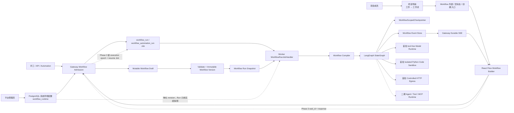
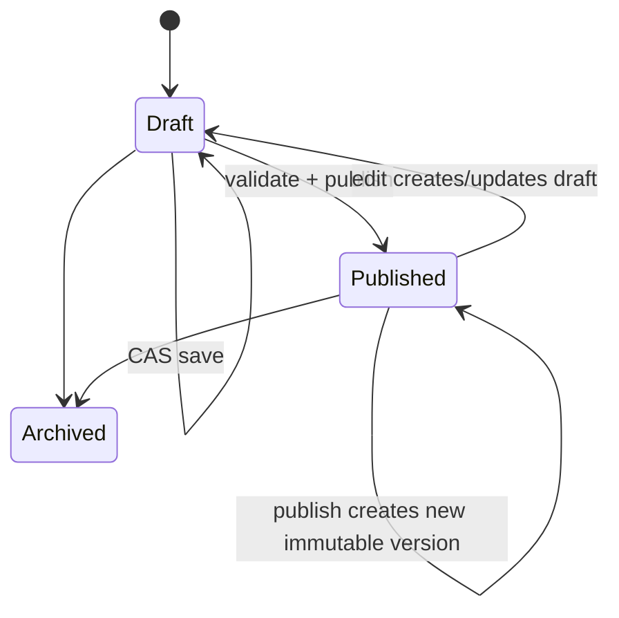
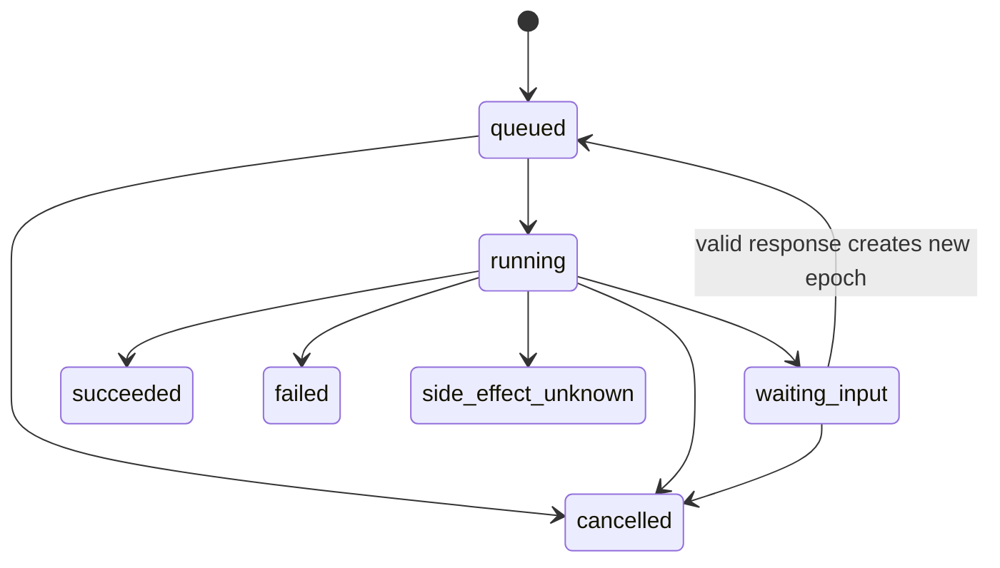
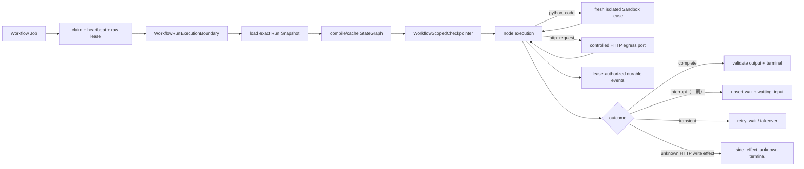
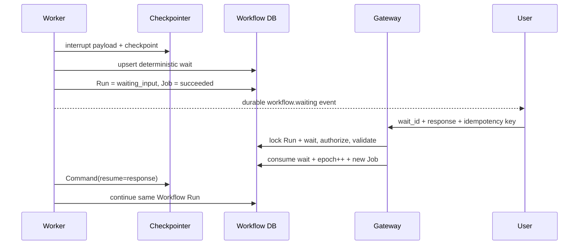

# ActWeave 可视化工作流完整方案（React Flow + LangGraph）

- 方案日期：2026-08-09
- 最近更新：2026-08-10（补充项目“工作 → 工作流”入口与 Codex 执行门禁）
- 状态：提案；尚未实施
- 已冻结决策：采用独立 `WorkflowRun`，不得创建隐藏聊天 `Thread`，不得伪造占位 `Agent`
- 适用范围：前端 Workflow Builder、Gateway Workflow Control Plane、Worker LangGraph
  运行时、隔离 Code Sandbox、受控 HTTP egress、PostgreSQL 持久化、Automation、Human
  Input、SSE、权限、审计与运维
- 当前技术基线：`@xyflow/react 12.10.0`、`langgraph 1.2.9`、PostgreSQL
  `full_schema_v9`
- 关联规范：[仓库指南](../AGENTS.md)、[后端指南](../backend/AGENTS.md)、
  [前端指南](../frontend/AGENTS.md)

> 本文中的 API、Capability、表名、事件名和目录，除明确标为“现状”者外，均为待实现合同。
> 本文不表示仓库已经具备 Workflow 功能，也不以设计评审代替实现、迁移或测试。

## 1. 摘要

React Flow 与 LangGraph 适合作为 ActWeave 可视化工作流的两端基础：

- React Flow 是编辑器画布，负责节点、连线、拖拽、选择、缩放和运行态投影；
- LangGraph 是状态化执行内核，负责状态更新、路由、Checkpoint、恢复、流式输出和
  Human-in-the-loop；
- ActWeave 必须拥有两者之间的 Workflow Control Plane，包括定义协议、节点注册表、
  服务端校验、不可变发布版本、确定性编译器、运行准入、权限、Credential 解析、
  Durable Job、事件重放、审计和配额。

本方案选择 **Standalone Workflow 为核心，Chatflow 为后续适配层**：

1. 项目左侧导航在“工作”分组增加“工作流 / Workflows”，先进入项目级 Workflow 列表，再创建或
   打开独立 Definition；
2. Workflow Definition 是项目共享、可发布的独立资源；
3. `WorkflowRun` 是 owner-private 的独立执行聚合；
4. Workflow 使用独立 Job authority、Checkpoint authority、事件表、Code Sandbox lease 和
   Human Input wait；
5. Gateway 负责准入和读取，Worker 是唯一 LangGraph 执行者，Scheduler 只负责准入；
6. Chatflow 将来把消息映射成 Workflow inputs，再将 outputs 投影为 AI Message，不改变
   Workflow 的独立运行模型；
7. 所有 Workflow 全局配置只由平台管理员在 PostgreSQL“系统配置 → Workflow 运行环境”管理，
   `config.yaml`、env、Compose 和 Helm values 不形成第二权威。

首个产品纵向闭环实现：

```text
开始（Start） -> 大模型（LLM） -> 结束（End）
```

同时必须有一条不依赖 live Model 的确定性隔离烟测：

```text
开始（Start） -> 代码执行（Code） -> 结束（End）
```

先验证“编辑 → 保存 → 校验 → 发布 → 准入 → Job → Worker → Checkpoint → Durable SSE →
结果”的完整链路。首批可用节点限定为**开始、大模型、条件分支、模板转换、变量聚合、
循环、HTTP 请求、代码执行、结束**。变量聚合只承担互斥分支汇合；循环是结构化、有界且
由 Compiler 生成唯一回边；HTTP 请求只能走服务端受控 egress 和 Credential slot。代码执行
首批只支持受限 Python，且只能在通过 capability 证明的独立 Sandbox 中运行。
`LocalSandboxProvider`、Gateway/Worker 宿主 Python、host Bash 和浏览器均不得执行用户代码。
`Agent` 和 `Tool/MCP` 不进入首批 catalog、renderer、compiler、migration 或验收门禁。Human
Input 仍需先通过 native interrupt 跨进程 Spike，不能用前端占位节点代替。

## 2. 范围

### 2.1 目标

- 项目成员从项目导航“工作 → 工作流”进入 Workflow 列表，并按能力查看、创建、编辑、校验和
  发布 Workflow；
- Draft 允许未完成，Published Version 必须完整、不可变、可确定性编译；
- Workflow 支持类型化 inputs、节点 outputs、条件路由、互斥分支聚合、结构化有界循环、
  受控 HTTP 请求和显式结束；
- 手工、API、Automation 使用同一套幂等准入服务；
- Run 固定精确 Workflow Version 和依赖快照，部署后恢复不重新解释旧图；
- Worker 崩溃、租约接管和 SSE 断线后能够从 PostgreSQL 恢复；
- 节点级状态、错误、输出预览、Code Sandbox 运行状态和 Human Input 可在前端可靠投影；
- 权限、Credential、Sandbox、MCP、配额、审计和租户隔离沿用项目现有 fail-closed
  原则；
- Workflow 总开关、Catalog、运行限额、Code/HTTP profile 与保留策略统一进入平台管理员
  PostgreSQL 系统环境配置，配置文件不得覆盖；
- fresh install 与显式数据库升级得到相同 schema catalog。

### 2.2 第一版明确不做

- 隐藏 Thread、占位 Agent 或把 Workflow 塞进现有聊天 `runs`；
- JavaScript、Shell、多文件工程、用户安装依赖或任意宿主命令；首批 Code 只接受合同化
  Python `main(inputs)`，并在隔离 Sandbox 中执行；
- Agent、Tool/MCP、Human Input 节点；HTTP 只允许命中管理员策略批准的固定 origin，不能请求
  任意 URL，也不能由变量控制 scheme/host/port；
- 用户自画回边、无界或嵌套循环、for-each/并行迭代、动态 fan-out、递归子工作流；
- 多人实时协作、CRDT、评论和光标同步；
- 外部副作用的通用 exactly-once 或分布式事务回滚；
- 将 LangGraph Time Travel 宣称为外部系统 rollback；
- 在执行中的 Run 上热替换 Workflow Version、节点实现或依赖；
- 新引入 Temporal 等第二套持久编排引擎。

### 2.3 后续能力

- 智能体（Agent）、工具调用（包括 MCP）和人工输入（Human Input）节点；
- for-each/Iteration、Parallel Map、嵌套 Loop、`Send`、Subworkflow；
- Webhook、服务账号、外部事件触发器；
- Workflow 作为现有 Agent 的受控工具；
- Chatflow 会话适配；
- 自动布局、多人协作、调试 fork 和 Time Travel 产品界面；
- Code 的 JavaScript/多文件/依赖安装/网络访问/持久文件版本；这些能力必须分别扩展
  Sandbox、依赖供应链、文件 authority 和安全评审，不能由首批 Python 节点顺带开放。

## 3. 当前仓库基线与缺口

### 3.1 可以复用的现状

| 能力                     | 当前证据                                                                                                                                                                                                                                           | 复用方式                                                                                      |
| ------------------------ | -------------------------------------------------------------------------------------------------------------------------------------------------------------------------------------------------------------------------------------------------- | --------------------------------------------------------------------------------------------- |
| React Flow               | [`frontend/package.json`](../frontend/package.json) 声明 `@xyflow/react ^12.10.0`                                                                                                                                                                  | 用于 Workflow Builder 画布                                                                    |
| Canvas 基础              | [`frontend/src/components/ai-elements/canvas.tsx`](../frontend/src/components/ai-elements/canvas.tsx)                                                                                                                                              | 参考交互参数和视觉，不作为领域组件修改                                                        |
| LangGraph                | [`backend/packages/harness/pyproject.toml`](../backend/packages/harness/pyproject.toml) 与 [`backend/uv.lock`](../backend/uv.lock)                                                                                                                 | 构建 Workflow `StateGraph`                                                                    |
| Durable Job              | [`backend/packages/harness/deerflow/persistence/jobs/`](../backend/packages/harness/deerflow/persistence/jobs/)                                                                                                                                    | 扩展 Workflow 专用 Job authority                                                              |
| Worker 执行边界          | [`backend/app/worker/`](../backend/app/worker/) 与 [`backend/app/reliability/execution.py`](../backend/app/reliability/execution.py)                                                                                                               | 新增 Workflow handler/executor/boundary                                                       |
| PostgreSQL Checkpointer  | [`backend/app/private_work/checkpointer.py`](../backend/app/private_work/checkpointer.py)                                                                                                                                                          | 复用 raw saver，新增 Workflow-scoped wrapper                                                  |
| Store-first SSE          | [`backend/packages/harness/deerflow/runtime/events/stream.py`](../backend/packages/harness/deerflow/runtime/events/stream.py)                                                                                                                      | 复用协议思想，使用独立 Workflow 事件表                                                        |
| Automation admission     | [`backend/app/automations/`](../backend/app/automations/)                                                                                                                                                                                          | 扩展为 Agent/Workflow target union                                                            |
| 项目权限、审计、配额     | [`backend/app/projects/`](../backend/app/projects/)、[`backend/app/audit/`](../backend/app/audit/)、[`backend/app/quotas/`](../backend/app/quotas/)                                                                                                | 增加精确 Workflow 合同                                                                        |
| 项目“工作”导航           | [`frontend/src/components/projects/project-nav.tsx`](../frontend/src/components/projects/project-nav.tsx) 与 [`frontend/tests/unit/components/projects/project-shell.test.tsx`](../frontend/tests/unit/components/projects/project-shell.test.tsx) | 在同一导航模型中加入 Workflow；桌面展开/折叠与移动端共用                                      |
| 平台系统环境配置         | [`backend/app/system_runtime_settings/`](../backend/app/system_runtime_settings/) 与 [`frontend/src/components/admin/settings/admin-system-settings-page.tsx`](../frontend/src/components/admin/settings/admin-system-settings-page.tsx)           | 扩展独立 `workflow_runtime` section；沿用管理员 API、CAS、不可变版本、审计和 fail-closed 物化 |
| Sandbox Provider         | [`backend/packages/harness/deerflow/sandbox/`](../backend/packages/harness/deerflow/sandbox/) 与 [`backend/packages/harness/deerflow/community/`](../backend/packages/harness/deerflow/community/)                                                 | 复用生命周期基础；新增 Code 专用 capability/结构化执行合同                                    |
| CodeMirror Python        | [`frontend/package.json`](../frontend/package.json) 与 [`frontend/src/components/workspace/code-editor.tsx`](../frontend/src/components/workspace/code-editor.tsx)                                                                                 | 复用依赖/主题经验；新增领域专用编辑器，不直接复用 Thread-bound 组件                           |
| HTTP transport 默认值    | [`backend/packages/harness/deerflow/mcp/http_security.py`](../backend/packages/harness/deerflow/mcp/http_security.py)                                                                                                                              | 复用 no-redirect、trust_env=false、operator timeout 思路                                      |
| Credential exact closure | [`backend/app/shared_assets/credential_closure.py`](../backend/app/shared_assets/credential_closure.py)                                                                                                                                            | 复用 slot→grant→exact version/envelope 锁序；新增 Workflow authority                          |

### 3.2 不能直接复用的现状

1. 现有通用 Node 只有一个左侧 target 和一个右侧 source Handle，无法表达条件多分支和
   稳定端口 ID；而且 `components/ai-elements/` 属于生成组件，不应手工业务化。
2. 现有 `runs` 强制 `thread_id`，包含 message/token/assistant 等聊天字段。
3. 现有 `run_events` 强外键到 private Agent Run，不能承载独立 Workflow Run。
4. 现有 `ProjectScopedCheckpointer` 每次访问都会验证 private Thread，不能用
   `workflow_run_id` 冒充 `thread_id`。
5. 现有 `jobs.run_id` 通过复合外键指向聊天 `runs`；Workflow Job 必须使用新增的
   `workflow_run_id`，不能复用旧列。
6. 现有 Automation 固定为 Agent + prompt + schedule；其 occurrence 的
   `thread_id/run_id` 同样强外键到聊天模型。
7. 现有 clarification 是消息语义的 follow-up Run，并未验证 native LangGraph
   `interrupt()/Command(resume=...)` 在当前 Checkpoint 模式下的完整合同。
8. 现有 `Sandbox.execute_command()` 接受 shell command 并只返回合并后的文本；它没有统一的
   exit code、timeout/resource reason、禁网证明或一次一销毁合同，不能直接作为 Code Node
   执行端口。
9. `LocalSandboxProvider` 的命令运行在 Gateway/Worker 所在宿主或应用容器内；即使
   `allow_host_bash=true` 也只是可信本地便利模式，不是运行项目成员代码的安全边界。
10. 当前 AIO/Provisioner/E2B/BoxLite 的“可执行命令”也不自动等于“满足首批 Code
    profile”；必须分别通过禁网、无挂载、资源上限、结构化结果和销毁的 conformance gate。
11. 现有 MCP endpoint policy 面向管理员配置的 MCP server，并非项目成员 HTTP 节点的固定公网
    origin 合同；现有 URL safety 的“解析后检查”也不能消除 DNS rebinding/TOCTOU，必须新增强制
    egress 与连接层策略。
12. 现有 MCP Credential slot/grant 外键绑定 MCP version，不能直接复用为 Workflow HTTP
    authority；应复用 exact-closure 算法，新增 Workflow 专用 slot/grant/snapshot。
13. 现有 `RuntimePolicySection` 只有 `agent_runtime/auth/memory_document/quotas`，管理员 API、前端
    strict union、SQL CHECK、bootstrap 完整性和 audit section literal 都没有 Workflow；必须作为
    同一 migration 增加 `workflow_runtime`，不能把字段塞进 `agent_runtime`。
14. 现有 `get_sandbox_provider()` 从配置选择并缓存 singleton，AIO 构造也读取 Provisioner
    locator/credential；它不能兑现数据库热切换或 per-Run frozen profile。Workflow Code 必须按
    `workflow_runtime` + Run snapshot 解析 allowlisted adapter/profile；无匹配 Worker 时 fail closed，
    不能回退旧 Sandbox singleton。
15. 现有项目导航“工作”分组只有会话和自动化，没有 Workflow 入口；Workflow API 也尚无供导航
    使用的项目级安全 readiness 合同。实现不能新增浏览器 `PROJECT_WORKFLOW` 常量、build env 或
    localStorage 开关作为第二权威。

### 3.3 Code Sandbox 现状审计结论

截至本文日期，**当前 checkout 没有任何 Provider 可直接认证为首批不可信 Python Code
runtime**。这不是命名问题，而是以下源码合同缺口：

| 现状                                                                                                                                   | 对 Code 的影响                                                                   |
| -------------------------------------------------------------------------------------------------------------------------------------- | -------------------------------------------------------------------------------- |
| `SandboxProvider` capability 只覆盖 Thread mount/文件边界，private root 固定含 `threads/{thread_id}`                                   | 必须新增无 Thread 的 execution scope/profile，不能传伪 Thread                    |
| `Sandbox.execute_command()` 接受 shell string、只返回合并文本；AIO 某些路径不落实 per-call timeout                                     | 必须新增结构化 Python request/result，不能解析 `"Error:"` 文本                   |
| Local 直接启动宿主 shell；`allow_host_bash` 只在 Agent `bash_tool` 层拦截                                                              | Workflow 若直接调 API 会绕过门禁；Local 必须永久 unsupported                     |
| 环境策略从宿主 env 继承后按名称过滤，不能证明所有 secret 都被识别                                                                      | Code 必须从空环境加固定 allowlist，不能复用通用 env builder                      |
| AIO local 使用 `seccomp=unconfined`，注入通用 `sandbox.environment`/config mounts，缺少完整 CPU/memory/PID/read-only-root/network deny | 必须新增 purpose=`workflow_python_code` 的独立 hardening profile                 |
| AIO fresh private lease 当前拒绝 Remote/Provisioner；Helm 默认却使用 Provisioner                                                       | 生产目标必须扩展 Remote/Provisioner 的 fresh Code lease，不能假称已支持          |
| 当前 Provisioner Pod 允许 privilege escalation、挂 Thread 数据、`restartPolicy=Always`，NetworkPolicy/TTL 仍未完成                     | 必须使用专用 Code Pod/label/securityContext/network/reaper，不能复用旧 Pod shape |
| AIO 启动 reconciliation 跳过 private sandbox；Worker 失租后只短暂等待 handler                                                          | Code 必须有 kill-all/destroy-confirmed、cleanup-pending 与 deadline reaper       |
| Worker registration/claim 当前只按 Job type capability                                                                                 | 必须新增 attested runtime profile digest 与 claim-time 精确过滤                  |

可复用的是 fresh acquire/release 的取消补偿模式、AIO private lease 不进 warm pool的方向、
`PrivateResourceScope` 的 project/owner 坐标，以及执行前授权/lease 重验证；不能复用 Thread
identity、Agent `sandbox_id` state、通用 shell、warm pool、mount/env 或现有“能执行命令”判断。

## 4. 架构决策记录

### ADR-01：Standalone Workflow 是核心模型

**决策**：使用独立 `workflow_definitions`、`workflow_versions` 和 `workflow_runs`。

**禁止**：创建隐藏 `threads_meta`、占位 Agent，或者把 Workflow ID 塞入旧 `run_id`。

**理由**：独立 Workflow 的 inputs/outputs、触发器、等待、重试和生命周期均不是聊天
message reducer 语义。隐藏 Thread 会污染权限、Checkpoint、文件、事件和历史列表，并让
API/Automation 依赖不存在的会话身份。

### ADR-02：Spec、Canvas、Editor、Runtime 四层分离

- `WorkflowSpec`：可执行语义；
- `CanvasDocument`：共享布局；
- `EditorSession`：viewport、选择、面板和拖动事务；
- `RuntimeProjection`：Run、节点 attempt、事件 cursor、wait 和错误。

React Flow nodes/edges 是可丢弃的渲染适配层，不是第二份领域真相。

### ADR-03：Draft 可不完整，Publish 必须完整

Transport schema 严格拒绝未知字段，但 Draft 可以缺少必填配置或 binding。只有发布时才
要求全图可执行。这样用户拖入新节点后可以立即保存，不会因为尚未填写模型或输入而丢失
草稿。

### ADR-04：不可变 Version 与 Run Snapshot 分层冻结

- 发布时冻结规范化图、Canvas、节点类型版本；第二批节点启用后才冻结精确
  Agent/Skill/MCP version；
- Model 保留逻辑引用，Run admission 时解析并冻结精确 Model Config version；
- `python_code` source 随不可变 Version 冻结，Run admission 再冻结精确 Python runtime、
  runner contract、image digest、isolation policy 与 required Worker profile digest；
- Run admission 锁定平台管理员当前 effective `workflow_runtime` version，并以独立
  WorkflowRun policy snapshot 冻结其 version/revision/schema/checksum；Code/HTTP 节点快照只能
  从该冻结策略解析，不能读取当前 YAML/env 或后续 System Settings；
- 首批 Version 不保存 Model/HTTP Credential：Model 只保存逻辑 Model ref，HTTP 只保存规范化
  origin/path 模板、egress policy ref 和 Credential slot；第二批工具 Version 同样只保存
  slot/required grant。Run admission 重验证授权并冻结精确 Credential version，任何阶段都
  不把密文写入 Version、Run、Checkpoint 或 Event；
- Run 只执行自己的 snapshot，后续发布、轮换或撤权不重写已准入 Run。

这既保证 Run 可恢复，也允许正常的 Credential 轮换。

### ADR-05：白名单编译，不执行前端实现标识

Gateway 返回节点目录，前端提交 `type + type_version + config`。Worker 只通过服务端
Node Registry 找到 executor。前端不能提交 Python import path、宿主命令或动态 renderer。
Code 的 `source` 是被固定 Code executor 处理的版本化数据，不是 executor/import path；
Compiler 永远不会在 Worker 进程中 `exec/eval/import` 该 source。

### ADR-06：Gateway 准入，Worker 执行

Gateway 在事务内完成权限、版本、依赖、输入、快照、配额、Run、Job 和审计；事务中不做
LLM、MCP、Sandbox provision 或 HTTP/其他外部网络调用。Worker 是唯一编译和执行 LangGraph
的进程，但 Code source 仍只能由 Worker 委派到独立 Sandbox，HTTP 只能委派给受控 egress
port；两者都不能绕过各自的执行边界。

### ADR-07：Workflow 使用独立 Job authority

`jobs` 新增 `workflow_run_id` 与 `workflow_epoch`，并新增两个严格类型：

```text
workflow_run
  workflow_run_id != NULL
  workflow_epoch != NULL
  run_id = NULL
  automation_occurrence_id = NULL

workflow_automation_run
  workflow_run_id != NULL
  workflow_epoch != NULL
  run_id = NULL
  automation_occurrence_id != NULL
```

两个类型使用同一个 Handler，但保留数据库级来源约束和独立审计语义。Job authority
中的 `workflow_epoch` 是 Worker claim/fence 的执行坐标；`workflow_run_jobs` 则保留全部
epoch 与 Job 的历史映射，两者不能互相替代。

分阶段实施时，首批 migration 只增加 `workflow_run`；
`workflow_automation_run` 随 Phase 5 Automation migration 增加。任何应用版本只能声明并
claim 当前 schema 已具备的 Job type。

### ADR-08：Checkpoint 与 Durable Event Log 分离

Checkpoint 用于图状态与恢复；Workflow Event 用于浏览器投影、断线重放、审计友好的
运行观察和唯一 terminal。任何一方都不能替代另一方。

### ADR-09：第二批 Human Input 是同一 Workflow Run 的非终态暂停

Run 进入 `waiting_input`；当前 Job 成功结算并释放 Worker/并发配额；Run 不写 terminal。
有效响应原子消费 wait、增加 execution epoch 并创建新 Job，通过同一 Checkpoint 恢复。

native `interrupt()/Command(resume=...)` 必须先通过跨进程专项 Spike，未通过前不得上线。

### ADR-10：at-least-once，不承诺通用 exactly-once

纯节点依靠 Checkpoint 降低重复执行；首批 LLM 调用在未提交 Checkpoint 的崩溃窗口内可能
重复并产生不同结果/额外用量，retry 必须受节点 policy 限制。首批 HTTP 写方法和第二批
Agent/Tool 外部写都必须使用稳定 activation/operation key 与 effect ledger；无法判断外部调用
是否成功时进入 `SIDE_EFFECT_STATE_UNKNOWN`，不得自动重试，也不得由 cancel 或普通异常
分支掩盖。只有 endpoint policy 明确证明幂等语义时，HTTP 写方法才允许有界自动 retry。

### ADR-11：Automation 固定精确 Workflow Version

Automation 不跟随“最新发布版本”。升级 Workflow target 是一次显式 CAS 更新。
Workflow occurrence 与 Agent occurrence 使用互斥数据库 shape。

### ADR-12：不提供 rollback

第一版对图与模型调用提供 cooperative cancel，对 Code runner 提供强制 kill-all、销毁确认和
orphan reaper；同时提供安全自动 retry 与创建新 Run 的人工 retry。Checkpoint rewind、fork
和外部补偿另行设计，不能把 Time Travel 描述成业务回滚。

### ADR-13：Code 使用专用隔离能力，不复用通用 host Bash

首批新增稳定类型 `python_code`，中文名“代码执行”，节点徽标固定“Python”，只支持固定
`python3.12` 运行合同：

```python
def main(inputs: dict[str, JsonValue]) -> JsonValue:
    ...
```

服务端新增强类型 `IsolatedCodeExecutionProvider`，其 request/result/lease 与现有返回字符串的
`Sandbox.execute_command()` 分离。Provider 必须声明并通过以下 capability：fresh
activation、无宿主/Thread/Skill/custom mount、deny-by-default egress、固定只读 runtime
image、非特权身份、CPU/内存/PID/临时磁盘/墙钟上限、结构化 exit/stdout/stderr/result、
可取消和强制销毁。静态 AST/import 检查只能作为易用性和纵深防御，不能替代 OS/VM 隔离。

类型 ID 不使用泛化的 `code + language`，客户端也不能提交 `language/command/args/env`；未来
JavaScript/Shell 若获批必须使用新的稳定类型和执行合同，不能把历史 Python Version 改义。

`LocalSandboxProvider` 永不声明此 capability；`allow_host_bash` 也不能提升它。AIO、
Provisioner、E2B 或 BoxLite 只有实现新端口并通过 provider conformance 后才能声明。没有
兼容 Worker 时，Code 在 Catalog 中显示为不可用，发布和 Run admission 均 fail closed，
不得降级为 `subprocess`、宿主 Python、普通 `execute_command()` 或浏览器执行。

### ADR-14：首批 Code 是无外部副作用的 JSON 隔离计算

Code 只接收已绑定 JSON 值，只返回严格 JSON；不注入 Model/Tool/MCP Credential，不开放
网络、包安装、持久文件、宿主环境或平台路径。每次 node activation/attempt 获得全新的
Sandbox；候选 JSON output 仅在 destroy-confirmed 且 Job fence 再验证后写入 Checkpoint，
不保存 workspace。销毁不确定时进入持久化 `cleanup_pending`，禁止重叠重试。因此首批 Code
可按 `isolated_compute` 对已完成清理的纯基础设施故障自动重试，但语法错误、用户异常、超时、
资源耗尽和 output schema 失败不自动重试。JavaScript、文件和网络能力另行立项。

### ADR-15：变量聚合是分支汇合，不是通用 reducer

首批稳定类型为 `variable_aggregate`，中文名“变量聚合”。V1 只把互斥 Condition 分支上的
同型候选值汇合为一个输出，必须区分“分支未执行”的内部 `MISSING` 与合法 JSON `null`。
默认要求恰好一个候选 available；零个或多个 available 都返回稳定错误。该节点可以在严格的
join 校验后豁免普通 dominance 规则，但不能被用来覆盖并行写冲突、做隐式类型转换或依赖
数组顺序静默选值。分组模式只是多个独立聚合组的 UI/Schema 简写，不改变上述语义。

### ADR-16：循环是结构化 bounded do-until，不开放任意回边

首批稳定类型为 `loop`，中文名“循环”。Loop body 是 WorkflowSpec 中的显式语义 scope；根图
与每个 body 的用户 authored transitions 各自都必须是 DAG，首批禁止嵌套 Loop。body 至少执行
一次，在 iteration commit 时原子计算下一组循环变量，然后评估受限“终止条件”：为 true 正常
退出；为 false 且达到 `max_iterations` 时以 `WORKFLOW_LOOP_LIMIT_EXCEEDED` 失败；否则只有
Compiler 可以生成 `commit -> body_entry` 回边。LangGraph recursion limit 只是最后保险，不能
替代产品级最大循环次数、总 step、Run timeout 和 cancel 检查。

### ADR-17：HTTP 是独立受控 egress 节点，不是通用 Tool 或 Code 网络

首批稳定类型为 `http_request`，中文名“HTTP 请求”。它调用注入的
`OutboundHttpExecutionPort`，不复用浏览器 fetch、Code Sandbox、MCP session 或任意通用
`httpx` 调用。scheme/host/port 必须是发布时可解析的 HTTPS literal，并命中平台管理员
`workflow_runtime` 中的版本化 endpoint policy；
变量只能进入 path/query/header/body 的类型化位置。生产 readiness 还要求 Worker 只能通过
该 System Settings revision 选择且被基础设施 attestation 证明的 egress profile 出站，应用层 DNS
检查不能单独充当 SSRF 安全边界。

首批固定 TLS 校验开启、redirect/cookie jar/ambient proxy 关闭，拒绝 loopback、private、
link-local、multicast、保留地址、云 metadata、DNS rebinding 和危险 header。认证信息只能来自
项目 Credential slot，Run snapshot 冻结精确 Credential version。GET/HEAD 使用 `read` retry
合同；POST/PUT/PATCH/DELETE 必须先写 effect ledger，非幂等或结果不确定时进入
`side_effect_unknown`。Code Sandbox 继续 `egress=deny_all`，HTTP 节点的存在绝不提升 Code
能力。

### ADR-18：Workflow 全局配置唯一权威是平台管理员系统环境配置

所有 Workflow 全局可变配置必须由平台管理员在“平台配置 → 系统配置 → Workflow
运行环境”（`/admin/settings/system`）管理，并以严格、版本化的
`RuntimePolicySection.WORKFLOW_RUNTIME = "workflow_runtime"` 持久化到 PostgreSQL。沿用
`GET /api/admin/settings/system` 与
`PUT /api/admin/settings/system/workflow_runtime`，不新增 Workflow 配置文件或第二套管理 API。

该 section 是单一原子配置聚合，首批至少覆盖：

```text
workflow_runtime
├── enabled / admission_enabled
├── catalog
│   └── enabled_node_types / allowed_type_versions
├── graph_limits
│   └── node / edge / depth / step / loop / aggregate limits
├── execution
│   └── run/node timeout / retry / payload / preview / retention
├── code
│   └── enabled / provider_adapter_key / execution_profile_id /
│       runtime_contract / image_digest / isolation_profile / resource limits
├── http
│   └── enabled / write_enabled / endpoint policies / injection profiles /
│       egress_profile_id / transport and response limits
└── future
    └── Human Input / Agent / Tool / Automation 启用时再增加严格字段
```

`provider_adapter_key`、`execution_profile_id` 和 endpoint/egress profile 都只能引用代码
allowlist 或平台管理员发布的版本化 profile；数据库不得保存 Python class/import path，也不得让
Workflow 节点提交 control-plane locator。秘密不能写入 policy JSON，只能引用平台加密 System
Credential 的精确版本。项目成员配置的 WorkflowSpec、每节点参数、项目 Credential grant 和每次
Run input 是项目/运行数据，不属于全局配置，仍由各自 authority 管理。
LLM 可选模型及其 provider/Credential 继续使用现有平台管理员 PostgreSQL Model Settings 与
System Credential；项目默认配额继续使用现有 `quotas` section。它们都是数据库管理面，不得因
Workflow 再复制到配置文件或 `workflow_runtime`。

`config.yaml`、`.env`、Docker Compose environment、Helm `values.yaml` 和浏览器 build-time env
不得承载、覆盖或回退任何 Workflow 开关、Catalog、限额、provider/profile 选择、Code
runtime/image/isolation、HTTP endpoint/egress/proxy 或 retention。相关未知键必须在配置 schema/
chart 校验中失败，不能静默接受。唯一保留在 PostgreSQL 之外的是读取 System Settings 之前不可
避免的**通用启动基础设施与信任根**，例如 `DATABASE_URL`、进程角色/端口、Credential envelope
主密钥、JWT/internal-auth trust root，以及 Kubernetes image/Service/RBAC/ServiceAccount/
NetworkPolicy/PVC/Secret reference；这些只供应能力，不能决定 Workflow 产品策略。

`workflow_runtime` 使用 strict schema、expected-revision CAS、append-only version、current pointer、
canonical checksum 和 content-free audit。Catalog/publish 请求读取当前 effective revision；新
Workflow Run admission 原子冻结精确 `policy_version_id + revision + schema_version +
payload_checksum` 以及解析后的 required profile digest，effect scope 为 `new_workflow_runs`。已准入
Run 不被后续修改重写。Gateway/Worker 对同一 revision 物化失败，或管理员期望 profile 与 Worker
attestation 不匹配时，Catalog/publish/admission 必须 fail closed，绝不读取旧 YAML/env 兜底。

## 5. 总体架构



### 5.1 模块边界摘要

```text
backend/app/workflows/                                      # Workflow 业务控制面
backend/app/gateway/                                        # REST、SSE、管理员入口与依赖注入
backend/app/worker/                                         # Workflow Job 执行与恢复
backend/app/system_runtime_settings/                        # workflow_runtime 系统配置
backend/packages/harness/deerflow/workflows/                # Spec、校验、编译与节点协议
backend/packages/harness/deerflow/runtime/workflows/        # LangGraph 运行适配
backend/packages/harness/deerflow/persistence/workflows/    # 独立 Workflow 持久化

frontend/src/core/project-workflows/                        # 类型、API、编辑器和运行投影
frontend/src/components/projects/                           # 现有“工作”导航接入 Workflow
frontend/src/components/projects/workflows/                 # Builder、Inspector、节点和 Run UI
frontend/src/app/projects/[project_slug]/workflows/         # 项目 Workflow 路由
```

依赖方向继续保持 `app.* -> deerflow.*`。Harness 编译器不能 import Gateway、项目业务 ORM
或 `app.*`。`WorkflowRun`、Workflow checkpoint、event 和 snapshot 均属于独立 Workflow
authority，不能借用隐藏聊天线程或 Agent Run。

### 5.2 模块目录图例与范围

下列目录是功能落地后的**模块级目标结构**，用于冻结 ownership、依赖方向和 Epic/阶段边界，
不作为逐文件实施清单：

- `[新增]`：本功能新增模块；
- `[修改]`：现有模块需要接入 Workflow；
- `[复用不改]`：明确复用其能力，但不改造成 Workflow authority；
- `[二期]`：首批不交付的扩展模块；
- `[条件]`：只有实现选择或目标环境验证证明需要时才启用。

本节只展开到可独立承担职责的目录模块。模块内部的文件拆分、命名和测试文件布局在实施 PR
中按 `backend/AGENTS.md`、`frontend/AGENTS.md` 与现有代码风格确定；后文章节继续冻结 API、
数据结构、节点参数、安全约束和验收场景。生成目录、本地数据、日志、上传内容和密钥不属于
设计树，也不得提交。

### 5.3 Monorepo 顶层模块结构

```text
deer-flow/
├── backend/                           [修改] Workflow 控制面、执行面、持久化与系统配置
├── frontend/                          [修改] Builder、Inspector、运行投影与管理员配置 UI
├── docker/                            [修改] Code Sandbox、Provisioner 与本地隔离能力供给
├── deploy/helm/                       [修改] 生产能力、RBAC、NetworkPolicy 与信任根供给
├── scripts/                           [修改] schema、诊断与脱敏 support bundle
├── docs/                              [修改] 设计、部署和运维说明
├── .github/workflows/                 [修改] 复用现有 release/replay/container/chart 门禁
├── contracts/                         [复用不改] 不建立第二份 WorkflowSpec 真相
└── skills/public/                     [复用不改] 二期 Agent/Tool 节点才冻结引用
```

顶层明确**不新增**常驻 `workflow-service`、独立 `workflow-worker`、Temporal、Redis、第二套
Nginx 路由、第二套 Helm chart、`make workflow-*` 命令或单独 Workflow CI。按 node
activation 创建的 Code Sandbox 是短生命周期执行环境，不是常驻应用服务，也不能挂载宿主目录。
Gateway、Worker、Scheduler、Provisioner、PostgreSQL 和现有发布门禁仍是唯一控制拓扑。

PostgreSQL `workflow_runtime` 是 Workflow 产品级全局配置的唯一 authority。根配置文件、环境
变量、Compose、Helm values 和浏览器 build env 均不得保存、覆盖或回退 Workflow 开关、限额、
profile、endpoint policy 或运行参数。Docker/Helm 只在应用读取 PostgreSQL 之前供应镜像、进程、
Service、RBAC、NetworkPolicy、Secret reference 和 trust root；部署能力与 effective revision/
profile attestation 不匹配时，相关 Code/HTTP 节点必须 fail closed。

### 5.4 Backend 模块结构

```text
backend/
├── app/
│   ├── workflows/                     [新增] 生命周期、发布、准入、Run、事件与执行边界
│   ├── gateway/                       [修改] Workflow API、durable SSE、管理员配置与 readiness
│   ├── worker/                        [修改] Job handler、claim/lease fence、恢复与结算
│   ├── scheduler/                     [修改] Workflow Automation 到期准入
│   ├── automations/                   [修改] Agent/Workflow target 联合与 occurrence 结算
│   ├── reliability/                   [修改] Job 路由、Worker capability 与 reconciliation
│   ├── projects/                      [修改] capability、资产计数、生命周期和 usage 归属
│   ├── quotas/                        [修改] WorkflowRun 配额预留与修复
│   ├── audit/                         [修改] Workflow 资源、动作与 workflow_runtime 审计
│   ├── private_work/                  [修改] 隐私中心与保留策略；不成为 WorkflowRun authority
│   ├── system_runtime_settings/       [修改] workflow_runtime 版本、CAS、物化与 fail-closed
│   └── system_settings/               [复用不改] Model/Credential 等既有系统资产边界
├── packages/harness/deerflow/
│   ├── workflows/                     [新增] WorkflowSpec、IR、校验、编译器和节点注册表
│   │   └── nodes/                     [新增] 首批九类节点执行协议
│   ├── runtime/workflows/             [新增] LangGraph/checkpoint/stream 运行适配
│   ├── persistence/workflows/         [新增] Definition、Version、Run、snapshot、event、effect
│   ├── persistence/system_runtime_settings/ [修改] workflow_runtime 版本化持久化
│   ├── persistence/jobs/              [修改] 独立 workflow_run execution reference
│   ├── persistence/scheduled_tasks/   [修改] Workflow Automation target
│   ├── persistence/scheduled_task_runs/ [修改] 独立 workflow_run occurrence reference
│   ├── sandbox/                       [修改] 隔离 Code provider protocol；旧 Local 不能满足
│   └── community/aio_sandbox/         [修改] 仅作为能力供给候选，必须通过隔离认证
├── migrations/                        [修改] 分阶段 schema、约束与回滚边界
├── scripts/                           [修改] bootstrap、schema 检查、诊断与运维工具
└── tests/                             [修改] 合同、真实 PostgreSQL、恢复、安全与 provider 门禁
```

模块 ownership 冻结如下：

- `app/workflows/` 负责项目授权、Draft/Version 生命周期、Run 原子准入、依赖闭包、全局策略
  snapshot、HTTP effect、Code lease、事件和 terminal 映射；它不得把编译器逻辑复制到业务层。
- `deerflow/workflows/` 只处理版本化 Spec、纯校验、IR、LangGraph 编译和节点协议；不能反向
  import `app.*`，也不能查询项目成员、Credential 或数据库业务表。
- `persistence/workflows/` 保存独立 Workflow authority；既有 Agent `runs`、`threads_meta`、
  Run events 和 checkpoint authority 不得混用。
- Gateway 只负责鉴权、命令/API、准入和 durable replay；Worker 是唯一图执行者；Scheduler
  只负责到期 occurrence 准入。
- `workflow_runtime` 通过既有管理员系统配置模块版本化管理，并为每个 WorkflowRun 冻结独立
  policy snapshot；配置文件和部署模块都不是备用 authority。

Agent、Tool/MCP、Human Input、Chatflow、Workflow workspace 和文件输入保持 `[二期]`；首批
模块允许预留稳定扩展点，但不得注册节点、创建依赖表或把隐藏 Thread 引入运行链。

### 5.5 Frontend 模块结构

```text
frontend/
├── src/app/
│   ├── projects/[project_slug]/workflows/ [新增] 列表、Builder 与独立 Run 路由
│   └── admin/settings/system/             [修改] “Workflow 运行环境”管理员入口
├── src/core/
│   ├── project-workflows/                 [新增] DTO、readiness、Catalog、编辑器、校验、迁移与运行投影
│   │   ├── node-types/                    [新增] 首批九类节点 strict config 合同
│   │   ├── editor/                        [新增] Spec/Canvas/Command/history/session 边界
│   │   ├── runtime/                       [新增] Run、SSE、Last Run 和安全日志投影
│   │   └── http/                          [新增] 无网络副作用的 cURL 导入解析
│   ├── admin-settings/system/             [修改] workflow_runtime strict DTO、CAS 与 readiness
│   ├── projects/                          [修改] Workflow capability 闭合枚举与导航集成
│   ├── project-governance/                [修改] Workflow 与系统配置审计投影
│   ├── private-work/                      [修改] owner-private WorkflowRun scope 清理
│   └── i18n/                              [修改] “工作流 / Workflows”、九类节点和系统配置文案
├── src/components/
│   ├── projects/                          [修改] “工作”分组增加 Workflow 入口
│   │   └── workflows/                     [新增] 列表、Workbench、Canvas、Inspector、节点与 Run UI
│   ├── admin/settings/                    [修改] Workflow 运行环境表单与 revision 状态
│   ├── projects/governance/               [修改] Workflow 审计标签
│   ├── ai-elements/                       [复用不改] 仅作视觉参考，不承担 Workflow 语义
│   └── ui/                                [复用不改] 通用表单、对话框和面板 primitives
├── src/content/                           [修改] 部署、升级、恢复和安全运维文档
└── tests/
    ├── fixtures/                          [新增] 九类 Spec、Loop、HTTP effect 与 durable frames
    ├── unit/                              [修改] core、组件、管理员配置和 i18n 合同
    ├── e2e/                               [修改] 编辑、发布、运行与策略禁用路径
    ├── e2e-real-backend/                  [修改] 独立 WorkflowRun 与 durable replay
    └── e2e-static/                        [修改] Workflow/Thread UI authority 隔离
```

前端模块必须维护四份互不混用的状态：

1. `WorkflowSpec`：可发布、可执行的语义真相；
2. `CanvasDocument`：位置、尺寸、折叠等布局投影；
3. Editor session：选择、面板、历史、临时 cURL 输入等本地会话态；
4. Runtime projection：Run、activation、iteration、attempt 和 Last Run 的只读投影。

React Flow 的 nodes/edges 只能由 adapter 从 Spec + Canvas 派生，不能直接成为保存 payload。
Inspector 字段必须通过领域 Command 修改 Spec；运行事件不能污染 dirty/history。`@xyflow/react`
和 Python CodeMirror 已是直接依赖，首批不重复引入画布或编辑器框架。节点 renderer/config 采用
静态 registry；已知但 disabled 的节点仍可只读显示，未知类型 fail closed。

### 5.6 明确保持不变的旧主链

以下模块是架构隔离护栏，不应为了少建表或复用聊天 UI 而修改成 Workflow authority：

```text
backend/packages/harness/deerflow/persistence/run/       [复用不改] 仍只承载 Agent/chat Run
backend/packages/harness/deerflow/persistence/models/    [复用不改] 既有 Run event 仍强绑定 Agent Run
backend/app/private_work/                                [复用不改] 旧 Agent Run 准入/仓储不接收 Workflow
frontend/src/app/projects/[project_slug]/chats/          [复用不改] Workflow 不进入聊天路由
frontend/src/core/threads/                               [复用不改] 不生成隐藏 Thread
frontend/src/core/messages/                              [复用不改] 不以消息序列代替 Workflow event log
```

允许抽取通用 protocol/utility，但迁移完成后仍必须能从数据库约束、API 路由、前端 scope
和 Worker claim 四个层面证明：`WorkflowRun` 不是 `Run` 的别名，也不依赖占位 Agent 或隐藏
聊天线程。

## 6. 领域模型与生命周期

### 6.1 核心对象

| 对象                  | 作用域                | 可变性                                | 说明                                                     |
| --------------------- | --------------------- | ------------------------------------- | -------------------------------------------------------- |
| WorkflowRuntimePolicy | system-global         | append-only version + current pointer | 平台管理员全局 Workflow 环境唯一配置 authority           |
| WorkflowDefinition    | project-shared        | revisioned                            | 名称、描述、状态、当前发布指针                           |
| WorkflowDraft         | project-shared        | CAS mutable                           | 可不完整的 Spec + Canvas                                 |
| WorkflowVersion       | project-shared        | immutable                             | 可执行发布版本                                           |
| WorkflowRun           | project + owner       | 状态机                                | 一次逻辑执行，可跨多个 Job epoch                         |
| WorkflowRunSnapshot   | project + owner + run | immutable                             | 精确运行闭包                                             |
| WorkflowCodeLease     | project + owner + run | fenced state machine                  | Code attempt 内部清理 authority                          |
| WorkflowWait          | project + owner + run | 单次消费                              | Phase 3 Human Input 请求与响应                           |
| WorkflowNodeEffect    | project + owner + run | append/stateful ledger                | 首批 HTTP 写请求及后续 Agent/Tool 的副作用幂等与 unknown |
| WorkflowRunEvent      | project + owner + run | append-only                           | 前端投影和 durable replay                                |

### 6.2 Definition 生命周期



发布不是修改旧 Version，而是：

1. 锁 Definition 与 Draft revision；
2. 规范化并校验 Spec；
3. 解析并冻结发布期依赖（首批逻辑 Model ref、Code config/runtime requirement、HTTP endpoint
   policy ref 与 Credential slot；精确运行版本在 Run admission 冻结；二期再增加 Agent/Tool
   closure）；
4. 计算 semantic checksum；
5. 创建下一不可变 Version；
6. 原子更新 Definition 当前发布指针；
7. 写 content-free audit。

### 6.3 Run 状态机



首批状态集合为
`queued | running | succeeded | failed | cancelled | side_effect_unknown`；`waiting_input`
随 Phase 3 增加。因为首批 `http_request` 支持写方法，无法证明请求是否到达对端时必须进入
`side_effect_unknown`，不能把它伪装为普通失败或自动重试。状态 CHECK、API enum 和前端
reducer 必须在首个 Workflow migration 中同步创建。

约束：

- 首批 terminal 为 `succeeded | failed | cancelled | side_effect_unknown`；
- Phase 3 `waiting_input` 不是 terminal；
- 自动 Job retry 不增加 execution epoch；
- Phase 3 Human Input resume 增加 epoch 并创建新 Job；
- `succeeded/failed/cancelled` 的人工 retry 创建新 Workflow Run，以 `retry_of_run_id` 关联；
  `side_effect_unknown` 首批禁止 retry，必须先由未来的 endpoint-specific reconciliation 合同
  证明外部结果；
- `current_job_id` 仅在 queued/running 时非空；waiting/terminal 时为空。

## 7. WorkflowSpec、Canvas 与类型系统

### 7.1 Proposed `WorkflowSpecV1`

```ts
type WorkflowSpecV1 = {
  schema_version: 1;
  entry_node_id: string;
  nodes: WorkflowNodeSpec[];
  transitions: ControlTransition[];
  workflow_inputs: WorkflowInputDecl[];
  workflow_outputs: WorkflowOutputDecl[];
  credential_slots: WorkflowCredentialSlotDecl[]; // 仅无秘密声明；实际 Credential grant 不进 Spec
};

type JsonValue =
  | null
  | boolean
  | number
  | string
  | JsonValue[]
  | { [key: string]: JsonValue };

type JsonSchema = Record<string, JsonValue>; // 服务端只接受冻结的 strict JSON Schema 子集

type WorkflowNodeKind =
  | "start"
  | "llm"
  | "condition"
  | "transform"
  | "variable_aggregate"
  | "loop"
  | "http_request"
  | "python_code"
  | "end";

type WorkflowInputConstraintsV1 =
  | { kind: "none" }
  | {
      kind: "string";
      min_length?: number;
      max_length?: number;
      pattern?: string;
    }
  | { kind: "number"; minimum?: number; maximum?: number }
  | { kind: "enum"; options: JsonValue[] };

type WorkflowInputDecl = {
  id: string;
  name: string;
  label: string | null;
  description: string | null;
  value_type: WorkflowValueType;
  required: boolean;
  default?: JsonValue;
  constraints: WorkflowInputConstraintsV1;
};

type WorkflowOutputDecl = {
  id: string;
  name: string;
  description: string | null;
  value_type: WorkflowValueType;
  source: ValueBinding | null; // Draft 可空；Publish 必须绑定且在所有到达路径可用
  default?: JsonValue;
};

type WorkflowCredentialSlotDecl = {
  id: string;
  name: string;
  purpose: "http_auth";
  payload_schema: JsonSchema;
  required: true; // 首批 auth 引用永远 fail-closed；无 grant 不省略认证
};

type WorkflowNodeSpecBase = {
  id: string; // stable UUID
  type_version: number;
  scope: WorkflowNodeScope;
  custom_label: string | null; // 仅用户覆盖；默认名称来自 Node Catalog title_i18n
  description: string | null;
  input_bindings: Record<string, ValueBinding | null>;
  execution_policy: NodeExecutionPolicyV1;
};

type WorkflowNodeScope =
  | { kind: "root" }
  | { kind: "loop_body"; loop_node_id: string };

type ControlTransition = {
  id: string;
  source: { node_id: string; port_id: string };
  target: { node_id: string; port_id: string };
};

type NodeExecutionPolicyV1 = {
  retry:
    | { mode: "none" }
    | {
        mode: "bounded";
        max_attempts: number;
        backoff_ms: number;
      };
  on_error:
    | { mode: "fail_workflow" }
    | { mode: "route_error"; output_port_id: "error" }
    | { mode: "continue_with_typed_default"; value: JsonValue };
};

type PredicateAst = {
  op: "and" | "or";
  items: Array<PredicateAst | PredicateClause>;
};

type PredicateClause = {
  left: ValueBinding;
  operator:
    | "eq"
    | "ne"
    | "gt"
    | "gte"
    | "lt"
    | "lte"
    | "contains"
    | "starts_with"
    | "ends_with"
    | "is_null"
    | "is_not_null";
  right?: ValueBinding;
};

type RestrictedTemplate = {
  version: 1;
  segments: Array<
    { kind: "text"; value: string } | { kind: "binding"; value: ValueBinding }
  >;
};

type RestrictedJsonTemplate = {
  version: 1;
  template: JsonValue; // 仅允许受限 binding token，不执行表达式
  bindings: Record<string, ValueBinding>;
};

type HttpKeyValueBinding = {
  id: string;
  name: string; // literal key；不允许变量生成 header/query key
  value: ValueBinding | RestrictedTemplate;
};

type HttpRequestAuthV1 =
  | { mode: "none" }
  | {
      mode: "endpoint_profile";
      injection_profile_id: string; // 版本化 endpoint policy 中的受限注入 profile
      credential_slot_id: string;
    };

type StartNodeConfigV1 = Record<string, never>; // Inspector 编辑顶层 workflow_inputs

type LlmNodeConfigV1 = {
  model_ref: string;
  mode: "chat" | "completion";
  context_input_ids: string[];
  messages: Array<{
    id: string;
    role: "system" | "user" | "assistant";
    content: RestrictedTemplate;
  }>;
  model_parameters: Record<string, JsonValue>; // 必须符合 Catalog 返回的该模型参数 schema
  stream: boolean;
  reasoning_output: "omit" | "provider_summary";
  structured_output: { enabled: boolean; schema: JsonSchema | null };
};

type ConditionNodeConfigV1 = {
  branches: Array<{
    id: string;
    output_port_id: string;
    label: string | null;
    predicate: PredicateAst;
  }>;
  else_output_port_id: string;
};

type TransformNodeConfigV1 = {
  input_variables: Array<{
    id: string;
    name: string;
    value_type: WorkflowValueType;
  }>;
  missing_variable: "error" | "null" | "empty";
} & (
  | { mode: "text"; template: RestrictedTemplate; output_schema: null }
  | {
      mode: "json";
      template: RestrictedJsonTemplate;
      output_schema: JsonSchema;
    }
);

type EndNodeConfigV1 = Record<string, never>; // Inspector 编辑顶层 workflow_outputs

type VariableAggregateNodeConfigV1 = {
  strategy: "exclusive_branch";
  groups: Array<{
    id: string; // stable output port ID
    name: string;
    value_type: WorkflowValueType;
    candidate_input_ids: string[]; // 顺序属于执行语义
  }>;
};

type LoopNodeConfigV1 = {
  mode: "do_until";
  body_entry_node_id: string;
  body_exit_node_id: string;
  max_iterations: number;
  termination_condition: PredicateAst;
  variables: Array<{
    id: string;
    name: string;
    value_type: WorkflowValueType;
    initial_input_id: string;
    next_input_id: string;
    output_port_id: string;
  }>;
};

type HttpRequestNodeConfigV1 = {
  method: "GET" | "HEAD" | "POST" | "PUT" | "PATCH" | "DELETE";
  base_origin: string; // 发布时必须是策略批准的 literal HTTPS origin
  path_template: RestrictedTemplate;
  query: HttpKeyValueBinding[];
  headers: HttpKeyValueBinding[];
  auth: HttpRequestAuthV1;
  body:
    | { kind: "none" }
    | { kind: "json"; template: RestrictedJsonTemplate }
    | { kind: "form_urlencoded"; fields: HttpKeyValueBinding[] }
    | { kind: "multipart_text"; fields: HttpKeyValueBinding[] }
    | {
        kind: "raw_text";
        content_type: string;
        template: RestrictedTemplate;
      };
  timeout: {
    connect_ms: number | null;
    read_ms: number | null;
    write_ms: number | null;
  };
  response: {
    mode: "json" | "text";
    accepted_statuses: Array<{ from: number; to: number }>;
    schema: JsonSchema | null;
  };
};

type PythonCodeNodeConfigV1 = {
  source: string; // UTF-8，受服务端 max_source_bytes 限制
  input_variables: Array<{
    id: string; // stable UUID；input_bindings 使用此 ID
    name: string; // 受限 Python identifier，节点内唯一
    value_type: WorkflowValueType;
  }>;
  output_schema: JsonSchema; // 固定 output port: result
  timeout_ms: number | null; // null 使用 policy 默认值；不能超过服务端上限
};

type WorkflowNodeConfigByKind = {
  start: StartNodeConfigV1;
  llm: LlmNodeConfigV1;
  condition: ConditionNodeConfigV1;
  transform: TransformNodeConfigV1;
  variable_aggregate: VariableAggregateNodeConfigV1;
  loop: LoopNodeConfigV1;
  http_request: HttpRequestNodeConfigV1;
  python_code: PythonCodeNodeConfigV1;
  end: EndNodeConfigV1;
};

type WorkflowNodeSpec = {
  [K in WorkflowNodeKind]: WorkflowNodeSpecBase & {
    type: K;
    config: WorkflowNodeConfigByKind[K];
  };
}[WorkflowNodeKind];
```

`execution_policy.retry` 中的 `max_attempts/backoff_ms` 只是用户请求的上限，客户端不能提交
retryable reason code。Publish/Run 将它与 Node Registry、冻结 runtime policy，以及 HTTP 的
method/endpoint policy 取最严格交集后写入 Snapshot；恶意 Draft 不能扩大可重试集合。每种节点
同样只允许其 definition 声明的 `on_error` 模式，`side_effect_unknown` 永远不进入该分支。

节点和端口 ID 永不因 `custom_label` 改名而变化。`custom_label=null` 时按 locale 展示 Catalog
名称；默认中文名不写入 Spec，语言切换也不改变 checksum。删除一个被下游引用的节点时，
编辑器必须先展示影响范围；确认后将引用变为显式 unbound 并生成校验错误，不能静默重绑
定到其他输出。

`variable_aggregate` 只在编译器证明候选来自同一互斥 Condition 的不同分支时放宽普通
dominance 规则。Runtime 使用内部 `MISSING` sentinel；合法 JSON `null` 表示“值存在”。每组
必须恰好一个候选存在；零个候选以 `WORKFLOW_VARIABLE_AGGREGATE_NO_VALUE` 失败；多个候选以
`WORKFLOW_VARIABLE_AGGREGATE_AMBIGUOUS` fail closed。它不是 reducer，也不按到达先后合并
并行值。

`loop` 首批固定为有界 `do_until`：初始化变量后 body 至少执行一次，Compiler 合成的 commit
同时计算全部 next binding、递增 iteration，再以更新后的变量评估终止条件。条件为假且达到
`max_iterations` 时以 `WORKFLOW_LOOP_LIMIT_EXCEEDED` 失败，不静默完成。根 scope 与每个
Loop body 的用户连线分别必须为 DAG；跨 scope 入口、出口和唯一回边由 Compiler 生成。首批
禁止嵌套 Loop、`break/continue/goto` 和 for-each。成功时每个循环变量映射为稳定 output port，
另有只读 `iteration_count`；达到上限失败时不产生伪成功输出。

`http_request` 的 `base_origin` 不允许变量，变量只允许出现在 path/query/header/body 且按上下文
编码。TLS 校验、redirect=false、cookie jar=false、`trust_env=false` 是服务端固定策略，不是
config 字段；`Host/Content-Length/Transfer-Encoding/Connection/Authorization/Cookie/
Proxy-Authorization/Idempotency-Key` 以及 endpoint policy 指定的幂等 header 不能由用户提交。
`auth.injection_profile_id` 只能引用冻结 endpoint policy 中与 origin/method/slot schema 匹配的
profile；该 profile 决定 header/query 目标、Bearer/Basic/API-key scheme 与编码，用户不能自由
输入 header 名、scheme 或拼接 secret。首批 multipart 仅允许文本字段；binary、
文件上传、client certificate 和自定义 CA 留到后续。

`payload_schema_checksum` 不是 Spec 字段。Gateway 在 Draft save/validate/publish 时对 canonical
`payload_schema` 重算；Version slot、grant intent 和 Run closure 只使用服务端计算值，若 mutation
携带的 expected checksum 不一致则 409。首批被 `auth.mode="endpoint_profile"` 引用的 slot
必须 `required=true`；缺 active grant 时 Version 不可运行，绝不静默省略认证注入。

`python_code` 的 entrypoint 永远是同步 `main(inputs)`，`inputs` 是按声明组装的 JSON object，
返回值必须是严格 JSON 并满足 `output_schema`。客户端 config 不得出现 `language`、
`command`、`args`、`env`、`requirements`、`packages`、`network`、`mounts`、`image`、
`executor` 或 `import_path`；Python runtime、runner contract、镜像 digest 和隔离 policy 只能
由服务端解析并冻结。Code source 参与 semantic checksum，但不得进入 Canvas、Catalog、
Event、Audit 或节点卡片。

### 7.2 Proposed `CanvasDocumentV1`

```ts
type CanvasDocumentV1 = {
  schema_version: 1;
  node_layouts: Array<{
    node_id: string;
    position: { x: number; y: number };
    parent_node_id?: string;
    collapsed?: boolean;
  }>;
  edge_layouts: Array<{
    edge_id: string;
    routing: "bezier" | "smoothstep";
  }>;
};
```

共享 Canvas 不保存 viewport、selection、dragging、resizing、measured、Handle bounds、
Inspector 宽度或 Runtime 状态。Viewport 最多按 account/project/workflow 存
`sessionStorage`。

Loop 的 `parent_node_id` 只是 `WorkflowNodeScope` 的布局投影，不能从矩形包含关系反推出
执行作用域。拖入/拖出 Loop 必须执行 reparent 领域 Command，同时修改 Spec scope、重跑
dominance/跨 scope 校验并原子更新 Canvas；投影到 React Flow 时 parent 必须先于 child。

### 7.3 控制面与数据面

- **Control transition**：React Flow 可见连线，决定调度与条件路由；
- **Data binding**：在 Inspector 中选择上游类型化输出，默认不画成密集连线。

后续若需要 ETL 风格数据流，可增加 `channel=data` 的虚线边，但不能改变现有控制边语义。

### 7.4 值类型

```ts
type WorkflowValueType = {
  kind:
    | "string"
    | "number"
    | "boolean"
    | "json"
    | "messages"
    | "file"
    | "image"
    | "document";
  collection: boolean;
  nullable: boolean;
  schema_ref?: string;
};
```

`file/image/document` 只传服务端 file reference 和安全元数据，不在 Spec、Canvas、Query
cache 或 Event 中保存 data URL/文件内容。

### 7.5 值绑定

```ts
type ValueBinding =
  | { kind: "literal"; value: JsonValue }
  | { kind: "workflow_input"; input_id: string }
  | {
      kind: "loop_variable";
      loop_node_id: string;
      variable_id: string;
    }
  | {
      kind: "node_output";
      node_id: string;
      output_id: string;
      path?: string; // bounded JSON Pointer
    };
```

Credential 不是 ValueBinding。首批 LLM 配置只保存逻辑 Model 引用，HTTP 配置只保存项目
无秘密 slot declaration、`injection_profile_id + credential_slot_id`；Credential ID/version 与
grant 不进入 Spec。Run admission 重验授权并冻结精确 grant/Credential version/schema/profile。
密钥只在 Worker 执行边界按用途解密，绝不进入绑定选择器、Spec、Checkpoint 或 Event。

`loop_variable` 只能在所属 Loop body 与该 Loop 的 next binding/termination condition 中使用；
body 的普通 node output 不得直接逃逸到 root，父 scope 只能读取 Loop 声明的输出。禁止读取未来
iteration、其他 Loop 的变量或跨 scope 任意绑定。

### 7.6 Canonical form 与 checksum

发布时：

1. 按稳定规则排序 nodes、transitions、input/output declarations；保留 Condition branch、
   Variable Aggregate candidate、Loop variable 等有序语义数组的用户顺序；
2. 从执行语义视图删除 Editor/Canvas/Runtime、`custom_label` 和 `description` 字段；
3. 统一 JSON 数字、Unicode 和缺省字段表示；
4. 使用固定 canonical JSON 编码；
5. 计算 SHA-256 `semantic_checksum`。

Canvas 单独保存和冻结，但不进入 semantic checksum。Scope、Loop body entry/exit、终止条件、
最大次数、变量 next binding、Aggregate candidate 顺序、HTTP method/origin/path/response
contract 与 execution policy 都进入 checksum；相同执行语义仅调整位置后 checksum 保持不变。

### 7.7 Schema 迁移

- Draft 打开时允许显式 `v1 -> v2` 迁移，并要求用户保存；
- Published Version 永不原地迁移；旧 compiler contract 必须保留到所有相关非终态 Run
  结束；
- 未支持的历史节点以只读 Unsupported Node 展示，禁止静默替换或重新发布；
- Run Snapshot 保存 `graph_schema_version + compiler_contract_version + checksum`。

## 8. Node Registry 与首批节点

### 8.1 Node Definition

```ts
type NodeTypeDefinition = {
  type: string;
  version: number;
  renderer_key: string;
  title_i18n: {
    "zh-CN": string;
    "en-US": string;
  };
  config_schema: JsonSchema;
  input_ports: PortDefinition[];
  output_ports: PortDefinition[];
  required_capabilities: string[];
  retry_semantics:
    | "pure"
    | "isolated_compute"
    | "read"
    | "idempotent_write"
    | "unsafe_write"
    | "http_method_v1"
    | "loop_body_v1";
  supports_streaming: boolean;
};

type NodeCatalogEntry = {
  definition: NodeTypeDefinition;
  availability: {
    state: "enabled" | "disabled";
    reason_code?: string; // 安全、稳定、可本地化；不暴露 provider/host/sandbox ID
  };
  public_limits?: {
    max_source_bytes?: number;
    max_timeout_ms?: number;
    max_iterations?: number;
    max_aggregate_candidates?: number;
    max_http_request_bytes?: number;
    max_http_response_bytes?: number;
  };
};
```

Gateway Node Catalog 返回当前项目可见的已注册定义及服务端 availability；没有
`workflow.code.use` 的用户可不返回 Code，有该 capability 但没有匹配的隔离 Worker/runtime
时返回 disabled Code 和安全 reason；没有 `workflow.http.use` 的用户可不返回 HTTP，有该
capability 但 egress policy/匹配 Worker 不可用时返回 disabled HTTP 与安全 reason。前端
看到的 enabled 集合必须是“代码内置 Registry 白名单 ∩ 当前 effective `workflow_runtime`
Catalog policy ∩ 项目 capability ∩ Worker attestation”的交集；Policy revision 或 attestation
任一不可读/不匹配就禁用，不从配置文件、provider 名或前端缓存推断。
`catalog_generation` 由服务端根据 Registry contract version 与 exact `workflow_runtime`
policy version/checksum 派生并持久化，管理员和客户端都不能直接填写；Worker readiness 作为
availability 动态投影另行带 generation，不能改写稳定节点定义。
Palette 是“前端 renderer 闭集”和“Gateway
catalog”的交集，只有 enabled entry 可拖入；`renderer_key` 只能匹配静态注册表，不能动态
import。`title_i18n` 必须至少包含中文和英文，前端按当前 locale 显示并以 `type` 兜底。
已知但暂不可用的 `python_code` 仍用静态 renderer 只读展示，不等同于未知类型的
Unsupported Node；保存既有 Draft 可保留 source，但发布/运行必须由 Gateway 再次 fail closed。

### 8.2 节点批次与中文名称

| 稳定类型 ID          | 中文展示名 | 批次              | 说明                                                |
| -------------------- | ---------- | ----------------- | --------------------------------------------------- |
| `start`              | 开始       | 首批              | 校验 Workflow inputs，建立初始 state                |
| `llm`                | 大模型     | 首批              | 受控 prompt + structured output；`tools=[]`         |
| `condition`          | 条件分支   | 首批              | 受控谓词 AST，IF/ELIF 有序且必须有 ELSE             |
| `transform`          | 模板转换   | 首批              | 受限模板/转换 AST，不执行代码                       |
| `variable_aggregate` | 变量聚合   | 首批              | 互斥分支 `exclusive_branch` 汇合；`MISSING != null` |
| `loop`               | 循环       | 首批              | 结构化 bounded do-until；回边仅由 Compiler 生成     |
| `http_request`       | HTTP 请求  | 首批              | 固定 HTTPS origin、Credential slot 与受控 egress    |
| `python_code`        | 代码执行   | 首批              | 固定 Python `main(inputs)`；独立禁网 Sandbox        |
| `end`                | 结束       | 首批              | 映射并校验 Workflow outputs                         |
| `agent`              | 智能体     | 第二批            | 运行冻结 Agent 图并输出结构化结果                   |
| `tool`               | 工具调用   | 第二批            | 只调用冻结、授权的工具/MCP 引用                     |
| `human_input`        | 人工输入   | 第二批且 Spike 后 | native interrupt/resume                             |
| `iteration`          | 迭代       | 后续              | for-each/Parallel Map；与 stateful Loop 分离        |
| `subworkflow`        | 子工作流   | 后续              | 固定精确子 Workflow Version                         |

中文展示名是 Node Catalog/UI 元数据，不是 WorkflowSpec 的语义标识。Spec、Edge、Port、
Compiler 和 checksum 始终使用稳定类型 ID；切换语言不能改变已保存图或重新计算 semantic
checksum。节点实例可另有用户自定义标题，但默认标题来自 `title_i18n`。

首批服务端 registry 只能注册
`start | llm | condition | transform | variable_aggregate | loop | http_request | python_code | end`，
前端也只打包这九种 renderer/config。`python_code` 只有在项目 capability、runtime policy 和
匹配 Worker 的 isolated-code attestation 同时满足时才 enabled；`http_request` 还要求批准的
egress policy 与 HTTP-capable Worker。不得为 `agent`、`tool`、`human_input` 或 `iteration`
注册空壳、“即将推出但可保存”的节点；历史版本遇到未安装类型继续使用 Unsupported Node
fail-closed。

第二批实现 Agent 节点时，才允许在同一 Workflow Job/执行边界内构建受控子图，复用冻结的
Agent、Skill、MCP、Model、Sandbox 安全能力；不能创建并同步等待另一个 Durable Job，避免
低并发 Worker 父子 Job 自锁。

## 9. 前端方案

### 9.1 项目入口、路由与列表页

```text
工作
├── 会话
├── 工作流
└── 自动化

/projects/[project_slug]/workflows
/projects/[project_slug]/workflows/[workflow_id]
```

“工作流”注册在现有项目导航的“工作”分组，中文标签为“工作流”，英文为“Workflows”，位于
“会话”和“自动化”之间。桌面展开、桌面折叠和移动端菜单必须消费同一条导航定义；列表 route
及其所有详情 route 都保持 `aria-current` 激活。菜单先进入 Workflow 列表，不直接创建空白画布。

列表页提供搜索、生命周期/发布状态筛选、排序、空状态和显式创建入口。具有 `workflow.read` 的
成员可以进入列表并以 read-only 方式打开 Definition；创建按钮、首空状态主 CTA、编辑和归档动作
分别按精确 capability 展示，首批创建只提供“空白工作流”，不复制 Dify 的 Chatflow、Agent、
模板市场或 DSL 混合创建。创建成功后进入
`/projects/[project_slug]/workflows/[workflow_id]`。

导航显示谓词固定为：非 Static build、项目包含 `workflow.read`、专用 Workflow 项目 readiness 的
`status == ready`、`workflow_enabled == true` 且 `schema_ready == true`。它不依赖
`admission_ready`、通用 Workflow Worker、Code Sandbox/HTTP egress profile 或单节点
availability；这些状态只控制页内运行按钮和 Catalog 节点。这样执行面暂时离线时，已有 Definition
仍可查看和编辑。前端不得新增 `PROJECT_WORKFLOW` 常量、build env、配置文件或 localStorage
开关。

Route 保持薄层：Static build 先返回 not-found，且不 import 认证 API client；动态模式在服务端用
`workflow.read` 做快速 capability gate，再挂载消费 `useCurrentProject()` 的项目 Workflow 客户端。
项目不可见沿用 404，成员缺少 capability 沿用 403。`status=unavailable` 表示控制面无法安全判断，
直接 URL 显示可重试故障；`status=ready + workflow_enabled=false` 表示服务端已确认功能关闭，显示
稳定的“平台未启用工作流”状态，不冒充故障或空列表。API、Query Key、stream scope 一律使用
account UUID + project UUID，不使用 slug；Gateway 对每个 API 重新鉴权，隐藏菜单不是授权边界。

本地 Dify `main@7522ae14b2` 的源码对照表明，Dify 实际是“Studio → `/apps` →
`category=workflow` 类型筛选”，不是独立 Workflow 菜单。本文只借鉴其“先到列表、按权限显示
创建、创建成功后进入编辑器”的信息架构；ActWeave 保留项目级“工作 → 工作流”、独立
`WorkflowDefinition/WorkflowRun` 和自己的路由/权限模型，不引入 Dify AppMode 或通用 App API。

### 9.2 前端领域模块

```text
frontend/src/core/project-workflows/
├── node-types/
├── http/
├── validation/
├── editor/
└── runtime/

frontend/src/components/projects/workflows/
├── inspector/
├── node-config/
├── nodes/
└── edges/
```

模块级清单与状态标记见 §5.5；本节只表达前端领域分层，不规定具体文件拆分，二者不得演化成
两套目录约定。

### 9.3 Workbench 布局

| 区域 | 内容                                                    |
| ---- | ------------------------------------------------------- |
| 顶部 | 返回、名称、保存状态、Undo/Redo、校验、发布、运行、版本 |
| 左侧 | 节点目录、分类、搜索、拖入入口                          |
| 中间 | React Flow Canvas、MiniMap、Controls、运行状态          |
| 右侧 | 节点配置、输入 binding、重试、错误策略                  |
| 底部 | Run 时间线、节点输出、安全预览、错误；二期 Human Input  |

### 9.4 React Flow 适配原则

- 新建业务 `WorkflowCanvas`，不修改生成式 `components/ai-elements/`；
- 使用 `<ReactFlow<WorkflowFlowNode, WorkflowFlowEdge>>` 类型 union；
- 每个 control Handle 使用稳定 `port_id`；Edge 使用 `sourceHandle/targetHandle`；
- 动态端口改变后调用 `useUpdateNodeInternals(nodeId)`；
- `isValidConnection` 只提供即时反馈，不能替代发布校验；
- `flowNodes/flowEdges` 由 Spec + Canvas 派生，不允许组件直接把 `setNodes` 结果当领域
  真相；
- `nodeTypes`、`edgeTypes` 放在模块顶层，Node/Edge `memo()`，callback `useCallback()`；
- Node 只按自身 `nodeId` selector 读取配置、validation 和 runtime，避免订阅整个数组；
- 默认不对所有边持续播放 SVG 动画。

React Flow 原生支持 Custom Node 和多 Handle，但不理解节点配置 Schema、端口类型、
基数或执行语义。参见 [Custom Nodes](https://reactflow.dev/learn/customization/custom-nodes)
和 [Handles](https://reactflow.dev/learn/customization/handles)。

### 9.5 Inspector 通用壳：参考 Dify 的层次，不复制它的安全语义

九张参考截图统一采用“Header → 设置/上次运行 Tabs → 分段配置 → 下一步”的高密度右侧
Inspector。ActWeave 沿用这套信息架构，但使用项目现有 `Sheet`、`Tabs variant="line"`、
`ScrollArea`、`ResizablePanel`、Form 和设计 token，不复制 Dify 的品牌颜色、圆角、图标或
像素值。

- 桌面端默认宽度建议 `480px`，允许在 `400–600px` 内调整；窄屏改为全高 `Sheet`；
- Header 固定显示节点图标、Catalog 中文名、可编辑实例标题 `custom_label`、描述、validation/
  availability badge、文档、更多菜单和关闭；发布版本或 disabled 节点只读但仍可查看；
- 截图中的单节点播放按钮首批不提供直接执行能力。将来若启用，只能对已保存、已发布的
  Version 创建正常独立 `WorkflowRun`（可带 `stop_after_node_id`），仍经 Gateway → Job →
  Worker 与冻结 Snapshot；浏览器或 Gateway 不能直接调用模型、Sandbox 或外部 HTTP；
- Tab 固定为“设置”和“上次运行”。Tab、section 展开态、滚动位置和 Inspector 宽度属于
  `EditorSession`，不进入 Spec、Canvas、save payload、checksum 或 Undo/Redo；
- 设置页用 `WorkflowInspectorSection` 统一标题、必填、帮助、折叠、错误定位和分隔线。字段
  变更只发领域 Command，组件不能直接 `setNodes`；
- “下一步”是编辑快捷方式，不是执行按钮：从当前 output port 打开经权限、Catalog
  availability 和端口兼容过滤的 Palette，并以一个 Command 原子创建节点和 control edge；
  Condition 每分支各有入口，Loop 分 body/done，HTTP 分 success/error，End 不显示；
- 默认展开核心输入，默认折叠高级参数、Retry/异常处理和长输出 Schema。纯节点不显示虚假的
  Retry 开关；`SIDE_EFFECT_STATE_UNKNOWN`、安全策略失败、取消和 lease loss 不允许路由成
  普通 error branch。

“上次运行”只读投影当前所选 Run 中该节点的精确 activation：

```ts
type SafePreview = {
  format: "text" | "json" | "summary";
  text: string; // 服务端生成、UTF-8 修复、脱敏、转义前纯文本且受 max bytes 限制
  truncated: boolean;
  redacted: boolean;
  original_byte_count?: number; // 仅安全数值元数据，不携带原文
};

type WorkflowNodeLastRunV1 = {
  run_id: string;
  node_id: string;
  activation_id: string;
  iteration_path: number[];
  attempt: number;
  status:
    | "queued"
    | "provisioning"
    | "running"
    | "collecting"
    | "cleanup_pending"
    | "succeeded"
    | "failed"
    | "timed_out"
    | "cancelled";
  started_at?: string;
  duration_ms?: number;
  input_preview?: SafePreview;
  output_preview?: SafePreview;
  error?: {
    code: string;
    safe_message: string;
    line?: number;
    column?: number;
  };
  usage?: {
    model_calls?: number;
    input_tokens?: number;
    output_tokens?: number;
  };
  branch_port_id?: string;
  retry_count?: number;
  truncated?: boolean;
};
```

切换 Run/iteration/attempt 不改变 Draft dirty/history；旧 account/project/workflow/run generation
或旧 attempt 的 SSE 必须丢弃。Credential 明文/payload、密钥和可解密载体在任何情况下都不得
进入 DTO、DOM、Query cache 或浏览器错误上报；已授权 grant picker 只接收 opaque Credential
ID、安全标签与 schema/status 元数据。Code source、prompt 和 HTTP origin/path/query/header/body 只能在已授权
Draft 设置页从 Draft DTO 进入受控 editor state/DOM；不得由 Runtime DTO、Event、Last Run、
telemetry 或错误上报带回。cURL 原文只存在于导入弹窗的临时本地 state，关闭或应用即清空，
不进 Draft DTO、Spec、history 或 Query cache。原始日志、完整运行输入/输出、traceback、主机/
容器路径、env、provider/sandbox ID 始终不进入这些客户端投影。

### 9.6 九类首批节点的参数与 UI 合同

以下字段是 Spec/Inspector 的实现合同。表中“必填”指 Publish/Run 必填；Draft 可暂时 unbound
并显示内联错误。稳定 ID、排序和 branch/candidate 顺序均通过语义 Command 修改。

#### 9.6.1 开始（`start`）

| 参数                              | 类型/必填              | Inspector 控件与规则                                                        |
| --------------------------------- | ---------------------- | --------------------------------------------------------------------------- |
| `workflow_inputs[].id`            | UUID/是                | 隐藏稳定 ID；复制/重命名不改变已有 binding                                  |
| `name`                            | identifier/是          | 变量名输入；节点内唯一，不能用保留名                                        |
| `label`、`description`            | string/否              | 面向运行表单的中文展示与帮助文本                                            |
| `value_type`                      | `WorkflowValueType`/是 | 首批仅 string/number/boolean/json/messages；不开放截图中的 legacy file      |
| `required`、`value_type.nullable` | boolean/是             | 类型感知开关，组合必须可满足                                                |
| `default`                         | JSON/否                | 与类型/schema 一致；required 且无 default 时 Run 输入必须提供               |
| `constraints`                     | tagged object/是       | `none`，或 string `min/maxLength/pattern`、number `min/max`、enum `options` |

输出端口由输入声明只读派生。“上次运行”显示已校验输入的脱敏摘要；单一 control output。
手工/API/Automation 共用此 schema，触发来源不是 Start config。

#### 9.6.2 大模型（`llm`）

| 参数                | 类型/必填                       | Inspector 控件与规则                                                                                 |
| ------------------- | ------------------------------- | ---------------------------------------------------------------------------------------------------- |
| `model_ref`         | logical Model ref/是            | Catalog 选择器；不显示或保存 Credential                                                              |
| `mode`              | chat / completion/是            | 模型 capability 允许的模式；Chat 显示 role rows，Completion 显示单一模板                             |
| `context_input_ids` | ordered stable IDs/否           | 指向通用 `input_bindings` 的类型化变量；不读取隐藏 Thread history                                    |
| `messages`          | role + restricted template[]/是 | Chat 模式支持 system/user/assistant 行；Completion 模式单文本；变量用 token picker，不执行任意 Jinja |
| `model_parameters`  | server schema object/否         | 仅展示所选 Model capability 支持的 temperature/top_p/max tokens/stop 等字段                          |
| `stream`            | boolean/否                      | 仅 capability 支持时显示；不改变最终 output schema                                                   |
| `reasoning_output`  | omit / provider_summary/否      | 不向 Workflow 暴露 raw chain-of-thought                                                              |
| `structured_output` | `{enabled,schema}`/是           | Visual/schema 两种编辑视图；Gateway 重新 strict 校验                                                 |

首批固定 `tools=[]`，无 Agent memory、知识检索、文件、vision 或客户端“AI 自动生成 Schema”。
输出为 `text`、可选结构化 `result` 和安全 usage。“上次运行”只显示冻结模型标签、耗时、token
和脱敏预览；单一 control output。

#### 9.6.3 条件分支（`condition`）

| 参数                  | 类型/必填                         | Inspector 控件与规则                                                         |
| --------------------- | --------------------------------- | ---------------------------------------------------------------------------- |
| `branches`            | ordered branch[]/是               | 固定 IF，可添加/排序 ELIF；每项有 stable branch/port ID 与可编辑 label       |
| `predicate`           | typed Predicate AST/IF、ELIF 必填 | AND/OR 分组；每行是 left binding + 类型感知 operator + typed literal/binding |
| `else_output_port_id` | stable port/是                    | ELSE 永远存在且不可删除，保证 fallback                                       |

禁止 raw expression、Python、`eval` 或 Jinja。分支顺序进入 checksum；每个 IF/ELIF/ELSE 独立
显示“下一步”。“上次运行”只显示命中 branch/port 与安全 operand 摘要。

#### 9.6.4 模板转换（`transform`）

| 参数               | 类型/必填                 | Inspector 控件与规则                                                           |
| ------------------ | ------------------------- | ------------------------------------------------------------------------------ |
| `input_variables`  | stable name/type[]/否     | 左列变量名，右列 ValueBinding；重复名与类型不兼容内联报错                      |
| `mode`             | text / json/是            | 固定受限模板实现；UI 不宣称兼容完整 Jinja2                                     |
| `template`         | restricted template/是    | 变量 token、固定 allowlist filter；禁止对象遍历、函数调用、import 和任意表达式 |
| `missing_variable` | error / null / empty/是   | 默认 `error`；JSON 模式必须保持合法 JSON 类型                                  |
| `output_schema`    | JSON Schema/JSON 模式必填 | 输出大小受服务端限制                                                           |

它是纯节点，不显示 Retry；预览和 Last Run 只以转义后的 text/JSON 呈现，不支持交互 HTML、
表单或 quick reply。单一 control output。

#### 9.6.5 变量聚合（`variable_aggregate`）

| 参数                  | 类型/必填               | Inspector 控件与规则                                                   |
| --------------------- | ----------------------- | ---------------------------------------------------------------------- |
| `groups[].id/name`    | UUID + identifier/是    | “聚合分组”开启后可增加多组；每组派生一个稳定 output port               |
| `value_type`          | WorkflowValueType/是    | 该组所有 candidate 必须同型且 schema 兼容                              |
| `candidate_input_ids` | ordered stable IDs/是   | 变量选择器；发布时证明来自同一互斥 Condition 的不同分支                |
| `strategy`            | `exclusive_branch`/固定 | UI 只读展示“互斥分支、恰好一个可用”，不提供 concat/reduce/到达先后策略 |

Runtime 明确 `MISSING != JSON null`；若多个互斥候选同时 present 则 fail closed，不能悄悄选第
一个。“上次运行”显示命中的 group/source label 和安全结果，不展示所有候选正文；单一
control output。

#### 9.6.6 循环（`loop`）

| 参数                    | 类型/必填                    | Inspector 控件与规则                                                               |
| ----------------------- | ---------------------------- | ---------------------------------------------------------------------------------- |
| `variables[]`           | stable id/name/type/至少一项 | 每行同时编辑 `initial_input_id` 与每轮 `next_input_id` binding                     |
| `termination_condition` | typed Predicate AST/是       | 只可读取已 commit 的循环变量和 `iteration_count`；明确提示“每轮变量原子更新后求值” |
| `max_iterations`        | integer/是                   | `>=1` 且不超过 Catalog/System policy；滑杆必须配可访问数字输入                     |
| `body_entry_node_id`    | UUID/是                      | 通过“进入循环体”或“循环体下一步”设置；首批单入口                                   |
| `body_exit_node_id`     | UUID/是                      | 首批单出口，全部 next variable 在此路径上可产生                                    |

首批是 progressive stateful bounded `do_until`，不是 for-each：body 至少运行一次，commit
同时更新全部变量并递增 iteration，再判断退出；达到上限仍为 false 时以
`WORKFLOW_LOOP_LIMIT_EXCEEDED` 失败。UI 不提供用户回边、Exit Loop 占位节点、嵌套、
break/continue 或静默截断。

Canvas 中 Loop 是可调整大小的 compound container；body 子节点的 React Flow `parentId`
与 `extent="parent"` 从 Spec scope 投影，投影数组中 parent 必须先于 child；尺寸或动态端口
变化后调用 `useUpdateNodeInternals()`。拖入/拖出是 reparent Command，不能靠几何包含反推语义。Inspector 有
“循环体下一步”和外层“完成后下一步”两个入口；Last Run 按 iteration + attempt 折叠显示，
后一轮不能覆盖前一轮。

#### 9.6.7 HTTP 请求（`http_request`）

| 参数                        | 类型/必填                                            | Inspector 控件与规则                                                                     |
| --------------------------- | ---------------------------------------------------- | ---------------------------------------------------------------------------------------- |
| `method`                    | GET/HEAD/POST/PUT/PATCH/DELETE/是                    | 方法选择改变 Retry 与 effect 提示，不能由变量绑定                                        |
| `base_origin`               | literal HTTPS origin/是                              | scheme/host/port 不可插变量；必须命中当前 effective `workflow_runtime` endpoint policy   |
| `path_template`             | restricted template/是                               | 必须以 `/` 开头；变量按 path segment 编码                                                |
| `query`、`headers`          | ordered key/value rows/否                            | key 为受限 literal，value 可 binding/template；危险 header 永远拒绝                      |
| `auth.injection_profile_id` | endpoint policy profile/否                           | 只从管理员在系统环境配置发布且当前可用的版本化 profile 选择；只读展示注入语义            |
| `auth.credential_slot_id`   | Workflow slot/与 profile 同时必填                    | 选择/创建无秘密 slot declaration；另显示该 Published Version 的 Credential grant 状态    |
| `body`                      | none/json/form-urlencoded/multipart_text/raw_text/是 | GET/HEAD 固定 none；form-data 仅文本字段，首批无 file/binary                             |
| `timeout`                   | connect/read/write ms/否                             | 用户值不超过 `workflow_runtime` hard cap；零或负数非法                                   |
| `response`                  | mode/status ranges/schema/是                         | 输出 `status_code/headers/body/duration_ms`，分别限制 wire/decompressed/header/JSON 深度 |

UI 顶部提供“导入 cURL”，但只用无 shell、零网络的纯 parser，应用前展示 diff；原始文本关闭
即清空，不进入 Spec、history、telemetry 或错误日志。拒绝 `-k/--insecure`、redirect、proxy、
resolve/connect-to、Unix socket、interface、netrc、client cert/key、config file、`@file`、上传/
下载文件、URL userinfo、`Cookie/-b/--cookie/-c/--cookie-jar`、`-u/--user`、
`--oauth2-bearer` 和用户 `Idempotency-Key`。Authorization 或 query secret 只能转换为尚未授权的
slot declaration + injection profile 建议；parser 不保存 Credential ID/version，也不自动创建 grant。

Inspector 必须把“slot 声明”和“Credential grant”分开：Draft/Spec 只编辑 slot 的稳定 ID、名称、
purpose 与 payload schema；`required=true` 和服务端计算的 schema checksum 只读。Credential
picker 通过独立授权 mutation 写 grant intent 或 Published Version grant，绝不写入 Spec/history。
endpoint profile 决定 Bearer/Basic/
API-key 的目标、scheme 与编码，用户不能自由编辑 `Authorization` 或 secret header。发布可在
缺 grant 时生成不可变 Version，但该 Version 在 required slot 获得 active grant 前不可运行。

“验证 TLS 证书”只读锁定为开启；redirect、cookie jar、ambient proxy 固定关闭。GET/HEAD 可对
明确 transient reason 有界重试；写方法只有 endpoint policy 明确支持服务端幂等键时才能重试。
缺少 `workflow.http.write` 时 POST/PUT/PATCH/DELETE 在 UI 中禁用并解释原因，Gateway 在
save/publish/run 仍重新授权。
请求发出后结果不可判定必须直接进入 `side_effect_unknown`，不能走普通 error port 或被 cancel
覆盖。Inspector 提供 `success/error` 下一步；Last Run 仅显示批准 endpoint/policy 标签、status、
duration、bytes、retry count 和安全预览，不显示 raw URL 或请求内容。

#### 9.6.8 代码执行（`python_code`）

| 参数              | 类型/必填                | Inspector 控件与规则                                                                            |
| ----------------- | ------------------------ | ----------------------------------------------------------------------------------------------- |
| `input_variables` | stable id/name/type[]/否 | 右侧 ValueBinding；名称必须是受限 Python identifier                                             |
| `runtime`         | `Python 3.12`/固定       | 只读 badge，不提供语言下拉                                                                      |
| `source`          | UTF-8 Python/是          | 领域专用受控 CodeMirror；最大字节数来自 Catalog                                                 |
| `output_schema`   | JSON Schema/是           | `main(inputs)` 返回 JSON object；Inspector 可按属性展示多行输出变量，仍编译为一个 object schema |
| `timeout_ms`      | integer/null/否          | null 使用冻结 policy；节点值不得超过服务端上限                                                  |

不出现 language/command/args/env/packages/requirements/network/mounts/image/executor/import path。
Last Run 只显示 phase/duration、稳定 code、安全 line/column、清洗截断的 stdout/stderr tail、
attempt/truncated/resource outcome；绝不回显 source、完整 I/O、路径或 env。syntax/runtime/timeout/
resource/schema 错误不自动重试，只有 destroy-confirmed 后纯 infrastructure error 才可有界重试。

#### 9.6.9 结束（`end`）

| 参数                          | 类型/必填            | Inspector 控件与规则               |
| ----------------------------- | -------------------- | ---------------------------------- |
| `workflow_outputs[].id/name`  | UUID + identifier/是 | 稳定输出 ID、名称与排序            |
| `value_type`                  | WorkflowValueType/是 | 与 source binding/schema 兼容      |
| `source`                      | ValueBinding/是      | 必须在所有到达路径上可用           |
| `value_type.nullable/default` | typed value/否       | 与输出合同一致；不能掩盖未绑定错误 |
| `description`                 | string/否            | API/运行结果说明                   |

显示最终 output schema 只读预览；Last Run 显示安全 final output preview。End 没有 outgoing Handle
和“下一步”，发布时至少存在一个可达 End。

### 9.7 Python Code 编辑、禁用态与日志

现有 [`workspace/code-editor.tsx`](../frontend/src/components/workspace/code-editor.tsx) 硬绑定
Thread context、同时注册多语言且没有受控 `onChange`，不能直接 import 到独立 Workflow。
首批新增 `workflow-python-editor.tsx`，只加载 CodeMirror Python extension，接收受控
`value/onChange/readOnly/disabled/error/maxBytes`。如果实现时抽取通用 base，必须同时保留
Artifact editor 回归测试，不得让 Workflow 建立 Thread 依赖。

- 节点卡只显示“代码执行”、Python 徽标、端口、validation 和 runtime 状态，不显示源码；
- Inspector 编辑 `source/input_variables/output_schema/timeout_ms`，其他执行字段不能出现；
- 每次键入先留在 editor transaction，按 debounce、blur 或显式快捷键合并成一个 Workflow
  Command；Save/Validate/Publish 前必须 flush；
- 焦点在 CodeMirror 内时 `Cmd/Ctrl+Z` 只撤销文本，焦点在外时才进入 Workflow Undo；
- “测试运行”即使后续提供，也必须创建正常 Workflow Run 并走同一 Worker/Sandbox，不得用
  `eval`、Web Worker、Node/Next server action 或浏览器 Python；
- Catalog disabled reason、项目 capability 撤销或 Sandbox readiness 变化只影响可用性，不得
  删除已保存 source；Gateway 在 save/publish/run 分别按合同重新校验。

Run 面板可显示服务端生成的限长日志尾部，但只能用 React `<pre>{text}</pre>` 纯文本渲染。
禁止 `dangerouslySetInnerHTML`、ANSI-to-HTML 或 raw log 下载。日志 DTO 必须带 attempt 和
`stdout|stderr`，前端丢弃旧 attempt、超限 chunk 和 scope 不匹配事件。

真正实施 capability 时必须同步扩展
[`frontend/src/core/projects/types.ts`](../frontend/src/core/projects/types.ts) 的闭合 enum；否则
Gateway 返回 `workflow.code.use/workflow.http.use/workflow.http.write/
workflow.credential.grant` 任一新值都会让整个 Project DTO strict parse 失败。浏览器不能从
角色、provider class 名或 `allow_host_bash` 自行推断 capability。

### 9.8 前端状态权威

```text
TanStack Server Cache
  └─ 已确认 Draft/Version/Catalog/Run 元数据

WorkflowEditorStore
  ├─ baseline
  ├─ WorkflowSpec
  ├─ CanvasDocument
  ├─ disposable React Flow projection
  ├─ validation
  └─ history

EditorSession
  ├─ viewport / selection
  ├─ inspector / palette state
  └─ drag / connect transaction

WorkflowRuntimeStore
  ├─ exact account/project/workflow/run/version scope
  ├─ canonical decimal cursor
  ├─ per-node attempt/status
  └─ wait/progress/error/output preview
```

复杂 workbench 推荐每实例一个 selector store。若选择 Zustand，必须将其加入前端直接依赖，
通过 Context 注入 vanilla store，禁止 module-level singleton，也不能把 React Flow 内部 store
当领域状态。

新增 `workflowRoot(accountId, projectId)` 必须加入
[`scope-registry.ts`](../frontend/src/core/private-work/scope-registry.ts) 的 scope transition 清理
列表。切换 account/project/workflow 时取消 Query、Mutation 和 SSE，使旧 generation 回调
失效。

### 9.9 编辑命令、保存与冲突

- 所有结构变化通过领域 Command 原子更新 Spec、Canvas 和渲染投影；
- 新增、删除、连接、断开、Inspector 提交各形成一个 Command；
- `onNodeDragStart` 开事务，拖动中只更新 transient position，`onNodeDragStop` 提交一次；
- 删除前计算控制边和数据 binding 影响，要求确认或阻止；
- Draft 保存采用完整替换 `{spec, canvas, expected_revision}`；
- 409 保留本地 Draft，展示服务器 revision，不自动覆盖或自动图合并；
- MVP 使用显式保存；后续 autosave 只能在 settled Command 后 debounce。

### 9.10 Undo/Redo

React Flow 的官方 Undo/Redo 是 Pro 示例，不是核心库内置 API。产品实现采用自研有界快照：

- history 只包含 `{spec, serializedCanvas}`；
- selection、viewport、measurement、Runtime 不进入 history；
- drag 一次只产生一条；
- 文本输入按 blur/Enter 或 debounce 合并；
- 新命令清空 redo；
- 保存更新 baseline，undo 后重新计算 dirty；
- publish 创建新 history epoch；
- 初始上限建议为 100 条，最终值由实现期性能测试确认。

参见 [React Flow Undo/Redo 示例](https://reactflow.dev/examples/interaction/undo-redo)。实现不得
复制未授权的 Pro 示例源码。

### 9.11 本地校验与发布校验

本地校验用于即时体验：

- 节点/端口存在、方向正确；
- control 只能连接 control；
- 无自环、重复边、cardinality 超限；
- 根图与每个 Loop body 的用户 authored transitions 各自必须为 DAG；只允许 Compiler 合成
  Loop commit 到 body entry 的唯一有界回边；
- 跨 Loop scope 连线、嵌套 Loop 和几何包含但语义 scope 不一致均报错；
- Condition 每个 branch port 最多一条出边。

服务端发布校验是唯一权威，完整规则见 §12。后端返回：

```ts
type WorkflowValidationIssue = {
  severity: "error" | "warning";
  code: string;
  message: string;
  path: string[];
  node_id?: string;
  edge_id?: string;
  port_id?: string;
};
```

点击 issue 应选中目标并居中；错误不能只依靠颜色表达。

### 9.12 自动布局与大图性能

React Flow 不内置自动布局；简单 DAG 可后续接 Dagre，多端口、分组和子图再评估 ELK。
参见 [React Flow Layouting](https://reactflow.dev/learn/layouting/layouting)。

上线前至少做一次约 200 节点的专门浏览器性能验证，记录节点移动、缩放、选择、runtime
事件和 Inspector 输入的实测；这个数字是测试场景，不是已承诺的产品容量。

### 9.13 可访问性

- Node、Handle、Toolbar、Inspector、错误、状态均有可读 label；
- 键盘可选择、删除、连接辅助、Undo/Redo、打开 Inspector 和定位错误；
- running/succeeded/failed/waiting 不只用颜色区分；
- 缩放后仍提供可访问的节点名称和状态；
- Human Input 表单保留焦点、错误关联和提交后状态说明。

## 10. PostgreSQL 数据模型

### 10.1 设计原则

- Workflow Definition 项目共享，Workflow Run/input/output/wait 默认 owner-private；
- 所有私有行都携带精确 `project_id + owner_user_id`，不能只靠单列 UUID 推断作用域；
- Published Version、Run Snapshot、Event、Audit 均不可被前端权威字段覆盖；
- JSONB 只承载已经严格验证、带 schema version 的产品数据，不承载权限坐标或秘密；
- current pointer、version number、revision、Job authority、wait consumption、event terminal
  由数据库约束保护；
- 一期为 Workflow 建平行事件表；开放 file/image/document 类型前再建平行 Workflow
  file/artifact 表，任何阶段都不改造 Thread 强绑定表来承载 Workflow。

### 10.2 定义与版本表

| 表                                        | 关键字段                                                                                                                                                                         | 关键约束                                                                      |
| ----------------------------------------- | -------------------------------------------------------------------------------------------------------------------------------------------------------------------------------- | ----------------------------------------------------------------------------- |
| `workflow_definitions`                    | `id, project_id, name, description, status, current_published_version_id, revision, created_by, updated_by, timestamps`                                                          | 项目内名称规则；revision ≥ 1；current version 必须属于自身                    |
| `workflow_drafts`                         | `workflow_id, revision, spec_schema_version, canvas_schema_version, spec_json, canvas_json, draft_checksum, updated_by, updated_at`                                              | 一 Definition 一 Draft；CAS revision；允许语义不完整                          |
| `workflow_versions`                       | `id, workflow_id, version_number, graph_schema_version, canvas_schema_version, compiler_contract_version, spec_json, canvas_json, semantic_checksum, published_by, published_at` | `(workflow_id, version_number)` 唯一；发布后 immutable；checksum 格式校验     |
| `workflow_version_agent_refs`             | `workflow_version_id, node_id, agent_id, agent_version_id, scope, checksum`                                                                                                      | 第二批：精确不可变 Agent version                                              |
| `workflow_version_skill_refs`             | `workflow_version_id, node_id, skill_id, skill_version_id, checksum`                                                                                                             | 第二批：精确 Skill version                                                    |
| `workflow_version_mcp_refs`               | `workflow_version_id, node_id, mcp_id, mcp_version_id, checksum`                                                                                                                 | 第二批：精确 MCP version                                                      |
| `workflow_version_model_refs`             | `workflow_version_id, node_id, logical_model_name, purpose`                                                                                                                      | Run admission 再解析精确 Model Config                                         |
| `workflow_version_code_requirements`      | `workflow_version_id, project_id, node_id, runtime_contract`                                                                                                                     | 首批固定 `python3.12-v1`；Run admission 再冻结 image/runner/isolation closure |
| `workflow_draft_credential_grant_intents` | `workflow_id, slot_id, slot_schema_checksum, credential_id, expected_credential_version_id, updated_by, updated_at`                                                              | `(workflow, slot)` 唯一；不进 Spec/checksum；发布时重验当前 slot，不含 secret |
| `workflow_version_credential_slots`       | `workflow_version_id, slot_id, name, purpose, payload_schema_json, payload_schema_checksum, required`                                                                            | schema checksum 由服务端重算；首批 required=true；可被同 schema 节点复用      |
| `workflow_version_http_requirements`      | `workflow_version_id, project_id, node_id, method, endpoint_policy_id, injection_profile_id, credential_slot_id`                                                                 | 发布期策略引用；复合 FK 到 exact Version/project/slot；不含 secret/header value |
| `workflow_credential_grants`              | `id, project_id, workflow_version_id, slot_id, credential_id, credential_version_id, payload_schema_checksum, status, granted_by, timestamps`                                    | 复合 FK 到 slot/项目 Credential；active slot partial unique；撤权可审计       |

Version 及其 Model/Code/HTTP/slot 子行 immutable 应由数据库 trigger 保护，不能只依赖 ORM
约定。Code/HTTP requirement 是发布期依赖的规范化权威：Version read/history/replay 必须读取这些
冻结子行，不能从届时 current `workflow_runtime` 重算。它们只保存 runtime contract 和策略/slot
引用；精确 image、runner、isolation、endpoint/injection/egress revision/checksum、grant 与
Credential version 仍在 Run admission 冻结，任何 secret、envelope、header value 或最终 URL 都不
进入 Version。

Credential 生命周期固定如下：Draft 保存无秘密 slot declaration，Gateway 对 canonical payload
schema 计算 checksum，客户端不能提交该权威字段；可选 picker 通过独立 mutation 写
`grant_intent`，不改变 Spec/history/checksum；Draft 保存若删除 slot 必须同事务删除对应 intent，
修改 schema 后旧 intent 只保留为不可应用状态并要求重新授权。Publish 事务先创建 Version 并复制 immutable slots，
再锁 intent、项目 Credential 与 exact version；匹配时创建 active grant，不匹配或缺少 intent 仍可
完成发布，但该 Version 在所有 auth slot 获得 active grant 前不可 Run admission；首批不存在
`required=false` 或“无 grant 就匿名发送”的语义。发布后同一
授权 API 可创建、轮换或撤销 grant，不改 Version。数据库必须以
`(workflow_version_id, slot_id)` 复合 FK、`project_id` scope、payload schema checksum 相等和
`WHERE status='active'` partial unique 保护闭包；不能让 Version 尚不存在的行伪装 grant。

### 10.3 Workflow Run 表

| 表                                      | 关键字段                                                                                                                                                                                                                                                                                                            | 说明                                                                                                                                   |
| --------------------------------------- | ------------------------------------------------------------------------------------------------------------------------------------------------------------------------------------------------------------------------------------------------------------------------------------------------------------------- | -------------------------------------------------------------------------------------------------------------------------------------- |
| `workflow_runs`                         | `id, project_id, owner_user_id, workflow_id, workflow_version_id, status, input_json, output_json, input_digest, idempotency_hash, admission_request_digest, trigger_kind, trigger_ref, origin_trace_id, required_worker_profile_digest, execution_epoch, current_job_id, retry_of_run_id, error_code, timestamps`  | 用户可见逻辑执行；request digest 仅覆盖客户端原始版本选择、输入与 trigger/retry 坐标；Code/HTTP 要求规范化为精确 Worker profile digest |
| `workflow_run_jobs`                     | `workflow_run_id, execution_epoch, job_id, cause, created_at`                                                                                                                                                                                                                                                       | `initial/resume` epoch 与 Job 关系；`job_id` 唯一；Job 自动 attempt 不新增 epoch                                                       |
| `workflow_run_snapshots`                | `workflow_run_id, workflow_version_id, semantic_checksum, compiler_contract_version, catalog_generation, snapshot_checksum`                                                                                                                                                                                         | 恢复的总入口；不以无来源 JSON 代替版本化系统策略                                                                                       |
| `workflow_run_runtime_policy_snapshots` | `workflow_run_id, section='workflow_runtime', policy_version_id, revision, schema_version, payload_checksum, value_json`                                                                                                                                                                                            | 独立 WorkflowRun 的精确系统环境配置快照；复合 FK 到 append-only policy version                                                         |
| `workflow_run_code_snapshots`           | Run + node + `python3.12` runtime profile + runner contract + image digest + isolation policy checksum                                                                                                                                                                                                              | 首批：不含 source/secret；证明恢复所需的精确 Code 执行合同                                                                             |
| `workflow_run_http_snapshots`           | Run + node + method + normalized origin + endpoint policy/injection profile revision+checksum + egress profile digest + effective limits + slot/grant/Credential ID+exact version+schema checksum                                                                                                                   | 首批：不存 envelope/secret/最终 URL/proxy locator；恢复时不重新解释策略                                                                |
| `workflow_code_sandbox_leases`          | `id, project_id, owner_user_id, workflow_run_id, node_id, activation_id, activation_attempt, job_id, workflow_epoch, job_attempt_number, worker_id, profile_digest, state, execution_lease_token_hash, reconciliation_key_hash, cleanup_locator_ciphertext, cleanup deadline/claim fence, destroyed_at, timestamps` | 首批内部清理 authority；不进入用户 API/Event/Audit                                                                                     |
| `workflow_run_agent_snapshots`          | Run + node + exact Agent version                                                                                                                                                                                                                                                                                    | 第二批：Agent 节点运行闭包                                                                                                             |
| `workflow_run_skill_snapshots`          | Run + node + exact Skill version                                                                                                                                                                                                                                                                                    | 第二批：Skill 闭包                                                                                                                     |
| `workflow_run_mcp_snapshots`            | Run + node + exact MCP/grant/slot/Credential version                                                                                                                                                                                                                                                                | 第二批：MCP 调用授权                                                                                                                   |
| `workflow_run_model_snapshots`          | Run + node + exact Model Config/Credential version                                                                                                                                                                                                                                                                  | 模型调用授权                                                                                                                           |
| `workflow_waits`                        | `id, run_id, node_id, checkpoint_id, interrupt_id, request_schema_json, request_preview_json, status, wait_generation, response_digest, response_json, expires_at, responded_by, timestamps`                                                                                                                        | 第二批：Human Input 单次消费                                                                                                           |
| `workflow_node_effects`                 | `id, project_id, owner_user_id, workflow_run_id, node_id, activation_key, operation_key, http_method, status, request_hmac, provider_idempotency_key, revision, dispatch Job/epoch/attempt/owner/lease-hash fence, outcome_json/outcome_digest, safe_error_code, timestamps`                                        | 首批 HTTP 写请求；确定响应保存可恢复的 owner-private outcome；二期复用                                                                 |

§10.2 与本表中明确标为“第二批”的 Agent/Skill/MCP/Wait 关系是完整目标模型，不进入首批
migration、required catalog 或 ORM metadata；HTTP slot/grant/snapshot/effect 则必须随首个
Workflow schema head 同时落地，不能先建空表或先开放节点再补恢复/幂等合同。

现有 `run_runtime_policy_snapshots` 强外键到聊天/Agent `runs`，不得写入 WorkflowRun ID。
`workflow_run_runtime_policy_snapshots` 必须使用独立复合 FK，锁定 `workflow_runtime` 的 exact
append-only version、revision、schema 与 checksum；Run snapshot checksum 同时覆盖该行和解析后的
required Worker profile digest。`value_json` 是 admission 时 canonical payload 的恢复副本，不是
第二权威；必须与被引用 policy version checksum 相等。Worker 只读取该冻结快照，不能在恢复时
读取 current pointer、`config.yaml`、ambient env 或 Helm values。

Run HTTP snapshot 不保存 `envelope_id`。调用前必须锁 snapshot 指向的 exact grant、Credential ID+
version、scope 与 schema checksum，再选择该 exact Credential version 当前 active encryption
envelope；因此只轮换 envelope/key 不会破坏恢复。grant 或 Credential 在 dispatch 前被撤销、scope/
schema 不再匹配时 fail closed，不能退回 ambient/current Credential。必须测试 envelope rotation、
grant rotation/revoke 和 Credential revoke-before-dispatch。

写请求收到确定响应后，`settled` 与已校验、限长的私有 typed outcome 必须在一个数据库事务中
提交；outcome 是 `success(result)`、`http_error(status + safe bounded response)` 或
`response_invalid(stable code + safe metadata)` 的 tagged union。它作为 owner-private JSONB
保存在 effect 行或指向同作用域、同 retention 的私有 outcome row，并以 digest 校验，禁止进入
Event/Audit/普通管理员列表。Checkpoint/error route 尚未落地即崩溃时，接管 Worker 从
`settled` effect 重放 outcome 到图状态，绝不能重发请求。数据库 CHECK 必须阻止
`status='settled'` 却没有可恢复 outcome，也不能把 response HMAC 当 outcome。

`workflow_code_sandbox_leases` 在任何 Provider acquire 前创建，且
`(workflow_run_id, node_id, activation_id, activation_attempt)` 唯一，并以 partial unique 保证同一
activation 同时最多一个未销毁 lease。状态至少包含
`provisioning | running | cleanup_pending | destroyed`；所有转移都校验 Job/attempt fence。Provider
acquire 前先插入 `provisioning` 行，此时 cleanup locator 必须为 NULL；acquire 成功后原子转
`running` 并写入 owner-private 加密 locator。`cleanup_pending` 有两种闭合形状：从 `running` 进入时
必须持有 AEAD locator；从 acquire-before-locator 崩溃的 `provisioning` 进入时 locator 必须为 NULL，
但必须持有 server-owned reconciliation hash，并通过 exact provider label reconcile。两者在销毁确认
前都阻断新 attempt；确认销毁后转 `destroyed`、写 `destroyed_at` 并清除 locator。外部资源
只携带不可逆安全 label，Provider 专用清理 locator 加密保存在内部列，不能进入日志、异常、SSE、
Checkpoint、Audit 或普通管理员列表。销毁无法确认时，节点不得提交成功或启动重叠 attempt；只有
reaper 抢占 cleanup lease 并确认所有后代进程/资源消失后，才可标记 `destroyed` 并决定安全重试。
超过 `cleanup_deadline` 仍无法确认时，Run fail closed、告警并等待运维收敛，不能假定 TTL 已生效。

建议 `workflow_runs` 额外保存与当前 Job 双向 fence 所需的 execution lease hash/heartbeat
字段，或者在每个受保护操作中锁 `current_job_id` 并验证 Job lease。最终实现必须选择一种
单一权威并以真实 PostgreSQL 竞态测试证明旧 Worker 无法继续写事件、Checkpoint 或结果。

### 10.4 Workflow Job authority 修正

当前 `jobs.run_id` 已通过
[`full_schema.sql`](../backend/packages/harness/deerflow/persistence/full_schema.sql) 中的
`fk_jobs_private_run` 强外键到聊天 `runs`。因此迁移必须：

1. 为 `jobs` 新增 nullable `workflow_run_id UUID`、`workflow_epoch BIGINT` 和
   `required_worker_profile_digest CHAR(64)`；
2. 新增复合唯一/FK，使
   `jobs(project_id, owner_user_id, workflow_run_id, origin_trace_id)` 精确指向
   `workflow_runs`；
3. 对 Workflow Job 强制 `workflow_epoch >= 1`，并通过
   `workflow_run_jobs(workflow_run_id, execution_epoch, job_id)` 的唯一/复合外键合同证明 Job
   与 epoch 一致；不能把它 FK 到会变化的 `workflow_runs.execution_epoch` 当前值；
4. 扩展 `ck_jobs_type` 和 `ck_jobs_authority_shape`；
5. 强制 Workflow Job 的旧 `run_id` 为 NULL，Agent Job 的两个 Workflow 字段均为 NULL；
6. 含 Code/HTTP 的 Workflow Run/Job 必须保存由全部 Code runtime 与 HTTP egress snapshot
   规范化得到的同一 `required_worker_profile_digest`；没有特殊执行要求时为 NULL。增加复合
   FK/一致性约束，不能由客户端提交；
7. `worker_nodes` 增加内容无关 `runtime_profile_digests_json`；`claim_next` 除 Job type 外还
   过滤精确 profile digest，Handler 入口再次验证，避免普通 Workflow Worker 抢到 Code/HTTP Job；
8. `JobClaim` 增加 `workflow_run_id + workflow_epoch + required_worker_profile_digest`，优先
   升级为严格 execution reference union；
9. 同步 JobType、EnqueueJob、claim capability、Worker allowlist、trace 分支、dead job、
   requeue、admin jobs、audit metadata 和测试合同。

Proposed authority shape：

```text
private_run
  run_id NOT NULL, workflow_run_id NULL, workflow_epoch NULL, occurrence NULL

automation_run
  run_id NOT NULL, workflow_run_id NULL, workflow_epoch NULL, occurrence NOT NULL

workflow_run
  run_id NULL, workflow_run_id NOT NULL, workflow_epoch NOT NULL, occurrence NULL,
  required_worker_profile_digest = Run 的服务端冻结值（可 NULL）

workflow_automation_run
  run_id NULL, workflow_run_id NOT NULL, workflow_epoch NOT NULL, occurrence NOT NULL,
  required_worker_profile_digest = Run 的服务端冻结值（可 NULL）
```

### 10.5 Workflow 事件表

| 表                              | 作用                                         |
| ------------------------------- | -------------------------------------------- |
| `workflow_run_event_invariants` | 全局 event ID、Run seq、唯一 terminal 窄账本 |
| `workflow_run_events`           | 按 UTC 月分区的 append-only 事件正文         |

`workflow_run_events` 的公共 envelope/可索引列至少包含 `node_id, activation_id,
iteration_path, attempt`；`iteration_path` 是服务端生成、受深度/整数范围限制的数值数组，不允许
客户端字符串。Event invariant 层必须拒绝同一 activation 的 attempt 回退与重复 terminal。
`workflow_code_sandbox_leases.activation_id` 和 `workflow_node_effects.activation_key` 使用同一
canonical activation identity，确保 Loop 各轮不会碰撞。

应复用现有事件系统的以下合同：

- store-first，通知只是闹钟；
- project + owner + run 精确 FK；
- 每 Run 严格单调 seq；
- 最多一个 stream terminal；
- `Last-Event-ID` 可重放；
- 数据库已终态但 terminal SSE 丢失时可修复；
- retention 水位阻止已删除月份被重新创建。

第一版不修改现有已分区 `run_events`，减少聊天主链回归风险。公共代码可抽象 Event Store
protocol，但物理表和 FK 保持隔离。

### 10.6 首批 Code Sandbox 与后续文件/Artifact

当前 `files`/`artifacts` 也强绑定 Thread。Standalone Workflow 不得伪造 Thread 来复用它们。

首批 `python_code` 仍是 JSON-only，因此不创建 `workflow_run_files`，也不复用 Thread
workspace。Code source 从不可变 Version 读取，inputs 经内存/结构化请求进入全新 Sandbox，
验证后的 JSON result 先只作为内存候选；Sandbox destroy-confirmed 并重验 Job fence/cancel 后
才写入 Checkpoint。临时 workspace 不是业务 authority、不能跨节点/重试恢复、不能成为
output reference。

建议后续增加：

| 表                       | 作用                                                       |
| ------------------------ | ---------------------------------------------------------- |
| `workflow_run_files`     | Run 输入、workspace/output 文件元数据、版本、SHA-256、状态 |
| `workflow_run_artifacts` | 已验证并向用户呈现的 Workflow 输出 artifact                |

开放 file/image/document 类型前，必须完成：

- owner/project/run-scoped 文件 authority；
- 文件 ID、size、MIME、magic、SHA-256 快照；
- Workflow Run 级文件 workspace，与首批 per-activation Code Sandbox 分离；
- 只有显式文件节点可在同一 Workflow Run 内共享 workspace，不同 Run 完全隔离；
- 输入文件只读恢复，输出 finalization 与 `present` 验证；
- storage quota、retention、删除和审计；
- 不把文件内容或 data URL 写入 Checkpoint/Event/Audit。

### 10.7 Automation schema 扩展

本节属于 Phase 5，不进入首批 migration。届时 `scheduled_tasks` 增加严格 target union：

```text
target_kind = agent_prompt | workflow_version
```

`agent_prompt` 分支保留现有 Agent、prompt、context/thread 字段；`workflow_version` 分支保存：

- 精确 `workflow_version_id`；
- 类型化 input template；
- `human_input_policy = reject | timeout_fail | timeout_default`；
- Agent/thread 字段为 NULL。

`scheduled_task_runs` 新增 `workflow_run_id`：

- Agent occurrence 使用 `thread_id + run_id`；
- Workflow occurrence 使用 `workflow_run_id`，旧 `thread_id/run_id` 为 NULL；
- 数据库 CHECK 禁止两种结果同时出现；
- launch 前允许两类结果都为空，进入 running/terminal 后必须满足目标 shape；
- 现有 `job_id` 仅代表首次 admission Job；resume Jobs 通过 `workflow_run_jobs` 关联；
- Workflow settlement 以 logical Workflow Run 为权威，不能要求最终 Job 等于首次 Job。

现有数据迁移统一回填 `target_kind=agent_prompt`。

### 10.8 关键唯一约束与索引

- `workflow_definitions(project_id, lower(name))` 按产品命名策略唯一；
- `workflow_versions(workflow_id, version_number)` 与
  `(workflow_id, semantic_checksum, compiler_contract_version)` 唯一；
- Definition 当前发布指针使用复合 FK，保证 Version 属于该 Definition；
- `workflow_runs(project_id, owner_user_id, workflow_id, idempotency_hash)` 唯一；
- `workflow_run_jobs(workflow_run_id, execution_epoch)` 与 `job_id` 唯一；
- Phase 3 `workflow_waits(run_id, checkpoint_id, interrupt_id)` 唯一，并使用 partial unique
  保证每个 Run 最多一个 open wait；
- 首批 `workflow_node_effects(workflow_run_id, node_id, activation_key, operation_key)` 唯一；同时
  `(workflow_run_id, node_id, activation_key)` 单独唯一，确保一个 activation 永远只绑定一个
  operation。恢复时规范化请求材料发生漂移必须 conflict，不能用新的 operation key 形成第二次
  dispatch；新循环迭代必须生成新的 activation key；
- `workflow_credential_grants(workflow_version_id, slot_id)` 对 active grant 使用 partial unique；
- `workflow_run_events(project_id, owner_user_id, run_id, seq)` 唯一；
- Run history 使用 `(project_id, owner_user_id, created_at DESC, id DESC)`；
- Definition 列表使用 `(project_id, status, updated_at DESC, id DESC)`；
- open wait、active Run、claim、retention 均有对应 partial/range index。

由于 Workflow Run 与 Job 双向关联，准入写入顺序应为：先插入 `current_job_id=NULL` 的 Run，
再插入引用该 Run 的 Job，随后写 `workflow_run_jobs` 并更新 `current_job_id`；或使用经过真实
PostgreSQL 验证的 deferred constraint。不能临时关闭 FK。

## 11. 权限、API 与 DTO

### 11.1 Proposed capabilities

```text
workflow.read
workflow.edit
workflow.publish
workflow.execute
workflow.code.use           # 允许相应 read/edit/execute 动作涉及 Code；仍分别要求动作 capability 与隔离 readiness
workflow.http.use           # 允许相应 read/edit/execute 动作涉及 GET/HEAD；仍分别要求动作 capability 与 egress readiness
workflow.http.write         # 允许 POST/PUT/PATCH/DELETE；仍受 endpoint policy/effect ledger 约束
workflow.credential.grant   # 允许把可用项目 Credential 授权给 Workflow slot；声明 slot 不要求此能力
workflow.run.read_own
workflow.run.cancel_own
workflow.wait.respond_own   # Phase 3
workflow.trigger.manage     # Phase 5
```

首批在现有服务端 `PROJECT_ROLE_CAPABILITIES` 中冻结以下默认映射；前端仍只能消费 Gateway 返回的
capabilities，不能从角色自行推导：

| 项目角色        | Workflow capabilities                                                                                                                                                                                   |
| --------------- | ------------------------------------------------------------------------------------------------------------------------------------------------------------------------------------------------------- |
| `admin`         | 全部 Workflow capabilities                                                                                                                                                                              |
| `editor`        | `workflow.read`、`workflow.edit`、`workflow.publish`、`workflow.execute`、`workflow.code.use`、`workflow.http.use`、`workflow.http.write`、`workflow.run.read_own`、`workflow.run.cancel_own`           |
| `runner`        | `workflow.read`、`workflow.execute`、`workflow.code.use`、`workflow.http.use`、`workflow.run.read_own`、`workflow.run.cancel_own`；不允许编辑、发布、Credential grant 或执行包含 HTTP 写方法的 Workflow |
| `viewer`        | 仅 `workflow.read`                                                                                                                                                                                      |
| `channel_guest` | 首批无 Workflow capability；Phase 5 Chatflow/外部触发另立身份与准入合同                                                                                                                                 |

`workflow.credential.grant` 默认只属于 `admin`。任何获得 `workflow.edit`、`workflow.publish`、
`workflow.execute`、`workflow.code.use`、`workflow.http.use`、`workflow.http.write`、
`workflow.run.read_own` 或 `workflow.run.cancel_own` 的角色都必须同时获得 `workflow.read`；后端用
角色矩阵测试固定该闭包，并与
前端闭合 capability enum 做 parity 测试。未来如改为可配置 capability policy，也必须由 Gateway
发放且保持上述 implication，不得让前端补权限。

Definitions 是 project-shared；首批 Run/input/output 与 Phase 3 waits 都是
owner-private。项目外部成员与不存在的私有资源继续按邻近路由的 403/404 防枚举合同处理。
grant intent/grant mutation 同时要求 `workflow.credential.grant`、目标 Workflow 权限和现有项目
Credential 的可见/使用权限；普通 editor 只能编辑无秘密 slot declaration、查看安全 readiness，
不能枚举或绑定 Credential。

Workflow 全局配置不使用项目 capability API。它沿用现有 system-admin-only 入口：

```text
GET /api/admin/settings/system
PUT /api/admin/settings/system/workflow_runtime
```

PUT 必须携带 `expected_revision`，服务端返回 stored/effective revision、`new_workflow_runs`
effect scope、pending roles 与安全 readiness；请求/响应使用闭合 `workflow_runtime` DTO，不能用
任意 JSON 透传、不能包含秘密或动态 import path。普通项目 API 只返回经过裁剪的 Node Catalog、
public limits 和 disabled reason，绝不返回 policy payload、System Credential reference 或基础设施
locator。

### 11.2 Definition API

```text
GET    /api/projects/{project_id}/workflows/readiness
GET    /api/projects/{project_id}/workflows/node-catalog
GET    /api/projects/{project_id}/workflows
POST   /api/projects/{project_id}/workflows
GET    /api/projects/{project_id}/workflows/{workflow_id}
PATCH  /api/projects/{project_id}/workflows/{workflow_id}
GET    /api/projects/{project_id}/workflows/{workflow_id}/draft
PUT    /api/projects/{project_id}/workflows/{workflow_id}/draft
POST   /api/projects/{project_id}/workflows/{workflow_id}/validate
POST   /api/projects/{project_id}/workflows/{workflow_id}/publish
GET    /api/projects/{project_id}/workflows/{workflow_id}/versions
GET    /api/projects/{project_id}/workflows/{workflow_id}/versions/{version_id}
PUT    /api/projects/{project_id}/workflows/{workflow_id}/draft/credential-grant-intents/{slot_id}
DELETE /api/projects/{project_id}/workflows/{workflow_id}/draft/credential-grant-intents/{slot_id}
PUT    /api/projects/{project_id}/workflows/{workflow_id}/versions/{version_id}/credential-grants/{slot_id}
DELETE /api/projects/{project_id}/workflows/{workflow_id}/versions/{version_id}/credential-grants/{slot_id}
POST   /api/projects/{project_id}/workflows/{workflow_id}/archive
```

项目级 readiness 是供导航和列表页使用的独立、secret-free、strict DTO：

```ts
interface WorkflowProjectReadinessV1 {
  status: "ready" | "unavailable";
  code:
    | "WORKFLOW_CONTROL_PLANE_READY"
    | "WORKFLOW_DISABLED"
    | "WORKFLOW_SCHEMA_UNAVAILABLE"
    | "WORKFLOW_POLICY_UNAVAILABLE";
  workflow_enabled: boolean;
  schema_ready: boolean;
  admission_ready: boolean;
  request_id: string;
}
```

服务端 schema 与前端 Zod 必须把它实现为下列四种合法组合的 discriminated union，而不是只做
字段级 strict object：

| `status`      | `code`                         | `workflow_enabled` | `schema_ready` | `admission_ready` |
| ------------- | ------------------------------ | ------------------ | -------------- | ----------------- |
| `ready`       | `WORKFLOW_CONTROL_PLANE_READY` | `true`             | `true`         | `true/false`      |
| `ready`       | `WORKFLOW_DISABLED`            | `false`            | `true`         | `false`           |
| `unavailable` | `WORKFLOW_SCHEMA_UNAVAILABLE`  | `false`            | `false`        | `false`           |
| `unavailable` | `WORKFLOW_POLICY_UNAVAILABLE`  | `false`            | `true`         | `false`           |

若 schema 与 policy 同时不可用，稳定采用 `WORKFLOW_SCHEMA_UNAVAILABLE`；所有其他字段组合均拒绝，
不能接受 `status=ready + code=WORKFLOW_SCHEMA_UNAVAILABLE` 之类矛盾的 200 响应。

`status` 只表示 Gateway 能否基于当前 schema 和已物化的 effective policy 安全判断项目 Workflow
控制面状态；关闭产品时可返回 `status=ready + workflow_enabled=false`。导航只使用
`status/workflow_enabled/schema_ready`，不使用 `admission_ready`。`admission_ready` 供列表/Builder
禁用“运行”并解释通用执行面不可用；Code/HTTP 的精确 profile availability 继续由 Catalog 返回。
响应不得包含 policy payload、revision 私有标识、Worker/Provider ID、locator、Credential 或基础设施
拓扑。请求只在调用者已有 `workflow.read` 时发起，Gateway 仍重新授权。

Definition 列表 API 使用严格、游标化查询：可选 `query`、`lifecycle=active|archived`、
`publication=all|draft_only|published`、`sort=updated_desc|name_asc|name_desc`、`cursor` 与服务端有界
`limit`；响应只包含安全列表摘要和 `next_cursor`。客户端不得发送 owner/project 覆盖字段，空查询
与无匹配筛选必须区分，列表失败不得伪装为空状态。

Draft 保存：

```json
{
  "expected_revision": 12,
  "spec": { "schema_version": 1 },
  "canvas": { "schema_version": 1 }
}
```

发布请求至少包含 `expected_revision`、`expected_draft_checksum` 和 `Idempotency-Key`。发布
只能从已锁定 Draft 创建 Version，不能接受另一份独立 Spec payload。

grant intent/grant mutation 的 body 只允许：

```json
{
  "credential_id": "uuid",
  "expected_credential_version_id": "uuid",
  "expected_slot_schema_checksum": "sha256"
}
```

它不接受 secret、header、scheme、injection value 或 envelope ID；Gateway 锁目标 slot、endpoint
injection profile 和项目 Credential 后，从当前 Draft/Version 的 canonical schema 重算 checksum，
只把客户端值作为 optimistic compare，随后重新校验 scope/schema/version。删除 mutation 只将 intent
删除或 active grant 撤销，不删除 Credential/Version。

### 11.3 Run API

```text
POST /api/projects/{project_id}/workflows/{workflow_id}/runs
GET  /api/projects/{project_id}/workflow-runs/{run_id}
GET  /api/projects/{project_id}/workflow-runs/{run_id}/output
GET  /api/projects/{project_id}/workflow-runs/{run_id}/stream
POST /api/projects/{project_id}/workflow-runs/{run_id}/cancel
POST /api/projects/{project_id}/workflow-runs/{run_id}/retry
GET  /api/projects/{project_id}/workflow-runs/{run_id}/waits                       # Phase 3
POST /api/projects/{project_id}/workflow-runs/{run_id}/waits/{wait_id}/responses  # Phase 3
```

Run admission：

```json
{
  "workflow_version_id": "uuid-or-null-use-current-published",
  "inputs": {
    "question": "..."
  }
}
```

客户端只可提供 Workflow Version 选择、类型化 inputs 和 Idempotency-Key。禁止提交：

- raw LangGraph `Command`；
- Checkpoint ID/namespace；
- execution epoch/current job；
- project/owner/scope authority；
- Credential version、密文、HTTP proxy/TLS/DNS/redirect 配置或用户 idempotency key；
- Python executor/renderer/import path，以及 Code 的 language/command/args/env/packages/network/
  mounts/image；`python_code.config.source` 是唯一允许的用户代码字段；
- 服务端 retry/lease 字段。

`POST /runs` 返回 `202 Accepted`、Run ID、状态和 stream URL，不在 HTTP 请求内等待完整图
执行。相同 Idempotency-Key + 相同 request digest 返回原 Run；同 key 不同请求返回 409。
`POST /retry` 对 `side_effect_unknown` 固定返回 409 `WORKFLOW_RUN_RETRY_FORBIDDEN`，UI 不显示
一键重试；首批只能由管理员查看和处置，不能靠创建新 Run 猜测外部结果。

### 11.4 DTO 纪律

- Pydantic 使用 `ConfigDict(extra="forbid", strict=True)`；
- 前端响应使用 strict Zod，拒绝未知 authority/private 字段；
- Query/Mutation 转发 active `AbortSignal`；
- 状态变化请求使用统一 CSRF fetcher；
- Run/Wait/Cancel/Retry/Publish 均使用幂等键；
- BIGINT event cursor 始终序列化为 canonical non-negative decimal string；
- 完整 output 通过单独授权接口获取，SSE 只传限长、脱敏预览；
- error 只返回稳定 public code，不泄漏 SQL、Credential、URL、路径或异常文本。

### 11.5 推荐错误码

```text
WORKFLOW_NOT_FOUND
WORKFLOW_DRAFT_CONFLICT
WORKFLOW_DRAFT_INVALID
WORKFLOW_VERSION_NOT_EXECUTABLE
WORKFLOW_NODE_TYPE_UNAVAILABLE
WORKFLOW_DEPENDENCY_STALE
WORKFLOW_INPUT_INVALID
WORKFLOW_RUN_CONFLICT
WORKFLOW_RUN_NOT_RESUMABLE
WORKFLOW_RUN_RETRY_FORBIDDEN
WORKFLOW_WAIT_CONFLICT
WORKFLOW_WAIT_EXPIRED
WORKFLOW_OUTPUT_INVALID
WORKFLOW_COMPILER_UNAVAILABLE
WORKFLOW_RUNTIME_POLICY_UNAVAILABLE
WORKFLOW_RUNTIME_PROFILE_PENDING
WORKFLOW_CODE_INVALID
WORKFLOW_CODE_SYNTAX_ERROR
WORKFLOW_CODE_SANDBOX_UNAVAILABLE
WORKFLOW_CODE_SANDBOX_CLEANUP_FAILED
WORKFLOW_CODE_INFRASTRUCTURE_ERROR
WORKFLOW_CODE_TIMEOUT
WORKFLOW_CODE_RESOURCE_EXHAUSTED
WORKFLOW_CODE_OUTPUT_LIMIT
WORKFLOW_CODE_OUTPUT_INVALID
WORKFLOW_CODE_RUNTIME_ERROR
WORKFLOW_VARIABLE_AGGREGATE_NO_VALUE
WORKFLOW_VARIABLE_AGGREGATE_AMBIGUOUS
WORKFLOW_LOOP_LIMIT_EXCEEDED
WORKFLOW_HTTP_UNAVAILABLE
WORKFLOW_HTTP_ENDPOINT_FORBIDDEN
WORKFLOW_HTTP_REQUEST_INVALID
WORKFLOW_HTTP_TIMEOUT
WORKFLOW_HTTP_RESPONSE_LIMIT
WORKFLOW_HTTP_RESPONSE_INVALID
WORKFLOW_HTTP_TRANSPORT_ERROR
SIDE_EFFECT_STATE_UNKNOWN
```

首批启用通用 Definition/Run/Compiler/Input/Output 和 Code 错误；语法错误只返回稳定 code 与
安全的 line/column，不返回 source line、traceback、provider/sandbox ID 或绝对路径。
`WORKFLOW_RUNTIME_POLICY_UNAVAILABLE` 覆盖 PostgreSQL policy 缺失、未知 schema、checksum/
materializer 失败；desired profile 已保存但尚无匹配 attestation 时返回
`WORKFLOW_RUNTIME_PROFILE_PENDING`。二者都不能通过配置文件 fallback 消除，也不暴露 policy
payload、revision 差异细节或基础设施 locator。
cleanup-pending 是内部可重试等待态；只有超过清理 deadline 仍无法确认销毁时才向 Run 暴露
`WORKFLOW_CODE_SANDBOX_CLEANUP_FAILED`，且仍不泄漏清理 locator。
HTTP 安全错误只返回稳定 code 和批准 endpoint/policy 的安全标签，不返回 URL、解析 IP、proxy、
Credential 或 transport 原文。`WORKFLOW_RUN_NOT_RESUMABLE` 与 `WORKFLOW_WAIT_*` 在 Phase 3
启用；`SIDE_EFFECT_STATE_UNKNOWN` 自首批启用，并且不能被普通 error edge 捕获。

## 12. 发布校验与 Workflow Compiler

### 12.1 校验阶段

服务端校验按固定顺序执行，并返回稳定 issue code：

1. **Transport**：schema version、未知字段、UUID、大小、枚举；
2. **Structure**：node/edge/port ID 唯一，引用存在；
3. **Topology**：唯一 Start、至少一个 End、可达性、终止可达；根 scope 把每个 Loop region
   折叠为单点后为 DAG，每个 Loop body 也单独为 DAG、单入口、单出口；用户 transition 不得
   跨 scope 或形成回边；
4. **Node config**：使用服务端节点版本 Schema 校验；
5. **Port/type**：方向、cardinality、collection/nullability/schema compatibility；
6. **Dataflow**：output ref 存在、消费者之前可用、跨分支 dominance；只有通过同一互斥
   Condition 证明的 Variable Aggregate candidate 可使用受控 dominance 例外；Loop body output
   不能逃逸，所有出口必须产生 next variables；
7. **Routing**：Condition branch 唯一且有 fallback，无静态 edge + `Command.goto` 歧义；
8. **Reducer**：并行写入不存在未声明冲突；
9. **Dependency**：读取当前 effective `workflow_runtime` exact revision；首批 Model 逻辑引用、
   Python Code runtime profile、HTTP endpoint/egress/injection policy 与无秘密 Credential slot
   declaration 必须被该 revision 允许且用途/schema 合法；Publish 不要求 active grant，Run
   admission 才要求；第二批再校验 Agent/Skill/MCP 版本、项目可见性和 checksum；
10. **Security**：`python_code` 只允许 source/变量/schema/受限 timeout，语法、同步
    `main(inputs)`、import/AST 纵深规则和 source size 合法；Condition/Transform/Loop 表达式 AST
    在白名单；HTTP origin/method/path/header/body/response/Credential slot 满足固定 egress policy，
    无动态 scheme/host/port 或危险 transport 字段；
11. **Runtime policy**：仅按第 9 步锁定的 `workflow_runtime` 计算节点数、边数、深度、step、
    payload、并行、fan-out、每 Loop 次数、Run 总迭代/activation、HTTP 请求响应和累计模型/
    Code/HTTP 预算，不读取配置文件；
12. **Output**：每个声明 output 在所有可结束路径上有值或显式 nullable/default。

首批发布额外强制：节点类型集合是
`start | llm | condition | transform | variable_aggregate | loop | http_request | python_code | end`
的子集且包含 Start/End。Agent/Skill/MCP refs 与 tool bindings 必须为空；Credential slot 只能
由 `http_request` 引用并与 injection profile schema 匹配。缺少 active grant 的 Version 可发布，
但 Catalog/运行入口必须显示不可运行原因。若包含 `python_code`，还
必须存在至少一个宣告精确 runtime contract/image/policy 的 compatible Worker；否则返回
`WORKFLOW_CODE_SANDBOX_UNAVAILABLE`。若包含 HTTP，还必须存在批准 endpoint policy、受控
egress attestation 与 HTTP-capable Worker；否则返回 `WORKFLOW_HTTP_UNAVAILABLE`。任何二期类型返回
`WORKFLOW_NODE_TYPE_UNAVAILABLE`，不能仅因为前端能渲染就通过发布。

前端本地 lint 不得跳过任何服务端阶段，也不能成为发布授权。
发布响应/审计记录使用的 `workflow_runtime` revision 与 catalog generation，但 Published Version
不据此获得永久执行权；Run admission 必须针对届时 current effective revision 重新校验并冻结。

不能依赖 `StateGraph` 的 Pydantic state schema 自动校验每个节点输出。每个 Node Executor
都必须在执行边界验证解析后的 inputs 和 outputs，并把失败映射为稳定节点错误。

### 12.2 Compiler IR

Compiler 不直接在原始 JSON 上拼 LangGraph。先降低为不可变 IR：

```python
@dataclass(frozen=True)
class WorkflowIR:
    graph_schema_version: int
    compiler_contract_version: int
    semantic_checksum: str
    nodes: tuple[CompiledNode, ...]
    static_edges: tuple[CompiledEdge, ...]
    branches: tuple[CompiledBranch, ...]
    loop_regions: tuple[CompiledLoopRegion, ...]
    input_schema: JsonSchema
    output_schema: JsonSchema
```

`CompiledLoopRegion` 至少冻结 loop/body scope、entry/exit、变量 initial/next binding、终止谓词、
最大次数、body nodes/edges，以及静态计算的 `worst_case_supersteps` 和
`worst_case_activations`。HTTP IR 只保留规范化 endpoint policy ref、请求模板与响应合同；
Credential/egress 的精确运行闭包留在 Run Snapshot。

IR 只含规范化、已校验、已解析的节点类型和静态依赖引用，不含密钥、运行输入、用户权限或
动态数据库 session。

### 12.3 WorkflowState

建议使用有限、命名空间化的共享状态：

```python
class WorkflowState(TypedDict):
    inputs: dict[str, JsonValue]
    values: Annotated[dict[ValueAddress, JsonValue], merge_workflow_values]
    presence: Annotated[set[ValueAddress], merge_presence]
    loops: Annotated[dict[str, LoopFrame], merge_loop_frames]
    errors: Annotated[dict[ActivationAddress, SafeNodeError], merge_node_errors]
    control: WorkflowControlState
```

`ValueAddress/ActivationAddress` 必须包含
`workflow_run_id + compiler_contract_version + scope_path + node_id + branch_path +
iteration_path + logical_activation`，不包含 retry attempt；同一 activation 的 attempt 单调增加，
下一 iteration 产生新 activation。每个节点只能写自己的 activation namespace；并行分支不能
任意覆盖全局 dict。
LLM 节点根据 binding/template 在 executor 内局部构造 provider messages，不把聊天 message
reducer 引入 Workflow 共享状态。Loop commit 必须在一个可恢复步骤中同时验证所有 next
variables、替换变量、递增 iteration 和清理本轮临时值；commit checkpoint 前崩溃恢复同一
activation，commit 后崩溃不得重跑已提交轮次。

### 12.4 LangGraph 映射

| Workflow 语义           | LangGraph 映射                                   |
| ----------------------- | ------------------------------------------------ |
| 开始/结束（Start/End）  | `START` / `END`                                  |
| 大模型（LLM）           | Model snapshot 驱动的普通 async node             |
| 条件分支（Condition）   | `add_conditional_edges()`                        |
| 模板转换（Transform）   | 纯节点 state update；不执行用户代码              |
| 变量聚合（Aggregate）   | 互斥分支分别单 source edge；节点用 presence 判定 |
| 循环（Loop）            | Compiler 合成 init/body/commit/route/done region |
| HTTP 请求               | 普通 async node 委派到受控 egress port           |
| 代码执行（Python Code） | 普通 async node 委派到隔离执行 port              |
| 顺序边                  | `add_edge()`                                     |
| 节点更新并跳转          | `Command(update=..., goto=...)`                  |
| 迭代/并行映射           | 后续有界 `Send`；不与首批 Loop 混用              |
| 智能体（Agent）         | 第二批：冻结 Agent subgraph/adapter              |
| 工具调用（Tool）        | 第二批：受控 Tool executor；MCP 是 source        |
| 人工输入（Human Input） | 第二批且 Spike 通过后使用 `interrupt()`          |
| Resume                  | 第二批由服务端构造 `Command(resume=...)`         |

LangGraph 支持 State、Reducer、条件边、Command 和 Send，但不会读取产品 Workflow JSON；
编译器是项目自己的核心资产。参见
[LangGraph Graph API](https://docs.langchain.com/oss/python/langgraph/graph-api)。

后续的 `Send` 只表示图内动态 fan-out/map-reduce，不是 Durable Job queue、租户并发或计费
配额；这些仍由 Admission/Worker/Quota 控制。

### 12.5 编译伪代码

```python
def compile_workflow(
    ir: WorkflowIR,
    *,
    registry: WorkflowNodeRegistry,
    checkpointer: WorkflowScopedCheckpointer,
) -> CompiledStateGraph:
    graph = StateGraph(WorkflowState)

    lowered = lower_loop_regions(ir)  # 唯一允许生成回边的步骤

    for node in lowered.nodes:
        definition = registry.require(node.type, node.type_version)
        executor = definition.build(node)
        graph.add_node(
            node.id,
            executor,
            retry_policy=definition.retry_policy,
        )

    for edge in lowered.static_edges:
        graph.add_edge(edge.source, edge.target)

    for branch in lowered.branches:
        graph.add_conditional_edges(
            branch.node_id,
            branch.router,
            branch.routes,
        )

    return graph.compile(checkpointer=checkpointer)
```

Loop lowering 固定生成：

```text
external predecessor -> loop:init -> body:entry -> body DAG -> loop:commit -> loop:route
loop:route -- condition=true --> loop:done -> external successor
loop:route -- condition=false && iteration<max --> body:entry
loop:route -- condition=false && iteration=max --> WORKFLOW_LOOP_LIMIT_EXCEEDED
```

只有 `loop:route -> body:entry` 是回边，内部节点使用稳定编码并映射回公开 loop node ID，不能
出现在 Catalog。Variable Aggregate 的互斥分支必须分别生成 `branch_exit -> aggregate` 的单
source edge；不能用 `add_edge([all_branch_exits], aggregate)`，否则 LangGraph 会等待未执行的
分支。若普通节点返回 `Command.goto`，Compiler 不同时为它配置会造成重复执行的静态出边；
首批用户节点不得返回任意 goto。

### 12.6 编译缓存与兼容性

缓存键：

```text
(graph_schema_version, compiler_contract_version, semantic_checksum)
```

- 缓存值不包含 owner、Credential、inputs、DB session 或 Sandbox；
- 每次执行仍绑定当前 Run 的 scope/runtime context；
- 同 checksum + contract 跨进程编译必须等价；
- compiler contract 在仍有非终态 Run 引用时不得删除；
- 缺少旧 compiler 时 fail closed 为 `WORKFLOW_COMPILER_UNAVAILABLE`，不能用新版猜测恢复。

## 13. Run Admission 与 Worker 执行链

### 13.1 原子准入事务

新增 `WorkflowRunAdmissionService`，按以下顺序执行：

1. 开启事务，锁 project → membership；
2. 验证 `workflow.execute`；
3. Automation 来源先锁 task/occurrence；
4. 锁 Definition 与精确 Published Version；
5. 验证版本未归档、checksum 和 compiler contract 可用；
6. 按 project/owner/workflow/idempotency hash 查重；
7. 同 key 同 digest 返回原 Run，同 key 不同 digest 返回 409；
8. 使用 Version input schema 校验 inputs；
9. 锁 System Settings catalog 和当前 effective `workflow_runtime` exact version，验证
   revision/schema/checksum，并物化唯一 canonical policy；
10. 重验证该 policy 的 catalog generation、首批 Model 逻辑引用、`python_code` config、HTTP endpoint/
    injection policy，以及每个 required slot 的 active grant、project scope、payload schema 和
    exact Credential version；第二批节点启用后才重验证 Agent/Skill/MCP 版本及项目 binding；
    首批同时断言这些二期 closure 与 tool binding 为空；
11. 首批构造待写入的 `workflow_run_runtime_policy_snapshots`，冻结 policy
    version/revision/schema/checksum/canonical value；再解析并冻结精确 Model Config/Credential、
    每个 Code 节点的 Python
    runtime/runner/image/isolation policy，以及每个 HTTP 节点的 normalized endpoint、method、
    endpoint/injection policy revision+checksum、egress profile、effective limits 与精确
    slot/grant/Credential ID+version/schema closure；不冻结 envelope ID，执行时选择该 exact version
    当前 active envelope；第二批再解析 Agent/MCP 依赖；
12. 按 Version 实际节点读取 Worker readiness，并要求其 attested profile digest 与第 9 步 policy
    期望完全匹配：Code 要求精确 isolated-code capability，HTTP 要求精确 controlled-egress
    capability；该步骤只读，不 provision Sandbox，也不发探测请求；
13. 预留 concurrent-run 配额；
14. 写 Workflow Run 与本版本实际节点类型所需的 snapshot rows；
15. 建 execution epoch 1；
16. 首批写带服务端 `required_worker_profile_digest` 的 `workflow_run` Job；Phase 5 Automation
    才可写 `workflow_automation_run`；
17. 写 `workflow_run_jobs` 与 `current_job_id`；
18. Phase 5 Automation occurrence 同事务关联 Workflow Run 和首次 Job；
19. 写 content-free audit；
20. 提交后返回 202。

事务内不得进行模型调用、MCP discovery、Sandbox provision、DNS 解析、HTTP 探测或任意外部
网络请求。
Run 先以 `current_job_id=NULL` 写入，再创建带 `workflow_run_id` 的 Job，最后更新双向关联，
保持立即 FK 检查可满足。

### 13.2 Worker 执行链



新增：

- `WorkflowRunJobHandler`；
- `WorkflowPrivateExecutor`；
- `WorkflowRunExecutionBoundary`；
- `IsolatedCodeExecutionPort`；
- `OutboundHttpExecutionPort`；
- `WorkflowScopedCheckpointer`；
- `WorkflowStreamBridge`；
- Workflow-specific terminal settlement port。

两个 Workflow Job type 使用同一 Handler，但 Handler 入口必须验证 claim shape。
Handler 随总 Run Snapshot 加载 `workflow_run_runtime_policy_snapshots`，重算 canonical checksum，
并验证 Job `required_worker_profile_digest` 与本 Worker attestation。后续所有 Node Executor 只能接收
该冻结 policy 派生的强类型 context；禁止读取 current System Settings、`get_app_config()`、ambient
env、Helm values 或现有 Agent Sandbox singleton。当前 policy 只用于新请求/readiness，不能改变
已 claim Run 的语义。

### 13.3 WorkflowScopedCheckpointer

复用 raw PostgreSQL saver 和当前 checkpoint representation，但不得复用验证 Thread 的
`ProjectScopedCheckpointer`。推荐配置：

```text
configurable.thread_id = "workflow:" + workflow_run_id
checkpoint_ns = workflow_version_id + ":" + compiler_contract_version
```

`thread_id` 在这里仅是 LangGraph saver 的技术 key，不对应也不创建产品 Thread。

每次 Checkpoint 读写必须重新验证：

- project + owner + workflow_run 精确匹配；
- membership/capability 或已准入执行 authority 仍有效；
- Workflow Run 非终态且 current Job 正确；
- raw lease token/hash、expiry、worker/attempt 有效；
- graph checksum/compiler contract 与 snapshot 匹配。

Worker 接管时重新加载同一 snapshot 和旧 compiler，从最新有效 Checkpoint 以 `input=None`
恢复。不能从当前 Draft/Published pointer 重建。

LangGraph Checkpointer 提供 superstep 状态与恢复，但不是版本库、审计或产品事件表。参见
[LangGraph Persistence](https://docs.langchain.com/oss/python/langgraph/persistence)。

### 13.4 首批 LLM 节点执行

大模型（LLM）是首批唯一外部模型调用节点；HTTP 是独立受控网络节点，不经过 Model Caller：

- 从 Workflow Run snapshot 读取精确 Model Config 与 provider Credential version；
- 通过注入的 Model Caller port 调用，不直接读取 ambient key 或动态 provider 配置；
- 强制 `tools=[]`，不得进入 `make_lead_agent`、Agent middleware、Skill、MCP、Subagent 或
  Sandbox；
- 由已校验 binding/template 在节点局部构造 provider messages，不写聊天 Message 表；
- 调用前、流式批次间和调用后验证 lease/cancel；
- structured output 按节点 output schema 校验后只写 `values[node_id]`；
- token usage、限长 delta、节点 success/failure 通过 Workflow event 投影。

确定性测试使用注入式 fake Model Caller，并断言 tool binding 为空；live provider、模型质量
和特定部署兼容性必须单独验证，不能由离线 fake 测试冒充。

### 13.5 首批 HTTP 请求节点执行

`http_request` executor 只依赖注入的 `OutboundHttpExecutionPort`，不能自行构造未受控的
`httpx` client 或 socket，也不能借用 Code/Tool/MCP 执行网络请求。固定执行顺序：

1. 重验 Run/Job lease、cancel、`workflow.http.use`，写方法再重验 `workflow.http.write`；
2. 从 Run Snapshot 读取 normalized endpoint、method、endpoint policy、egress profile、
   effective limits，以及精确 injection profile/grant/Credential version/schema closure，不读取
   current System Settings、配置文件或 ambient env；只在调用前为该 exact Credential version 选择当前 active envelope，并重验
   grant/Credential revoke、project scope 与 schema；
3. 绑定 path/query/header/body，按上下文编码并再次校验最终 path/大小；scheme/host/port 仍
   必须等于冻结 origin；
4. 写方法在发送前以包含 branch/scope/iteration 的 activation key 创建 `prepared` effect，
   fence 后转 `dispatching`；provider idempotency key 只能由服务端稳定派生；
5. 通过 operator-owned egress 发出请求；TLS verify=true、redirect=false、cookie jar=false、
   `trust_env=false`，实际连接层阻断 private/loopback/link-local/metadata/reserved/multicast、
   DNS rebinding 和 direct path；
6. 流式读取响应并分别限制 header、wire bytes、解压后 bytes、JSON 深度和总时长；只输出小写、
   限数/限长且剔除 `set-cookie/location/auth/proxy` 等敏感项的 headers；
7. 收到确定响应后验证 accepted status、response mode/schema 与 Job fence；无论产生 typed
   success、HTTP status error 还是 response-invalid error，写请求都先在一个数据库事务中提交
   `settled effect + owner-private bounded outcome`，再写 Checkpoint 或普通 error route；若在
   两者之间崩溃，接管者从 effect 重放 outcome，不重新联网；读请求按普通 Checkpoint 路径提交；
8. 请求未发送即可证明安全失败时记 `failed_safe`；发送后遇到失租、超时或无法证明对端结果时
   记 `unknown` 并把 Run 终结为 `side_effect_unknown`，不得普通 retry/error-route/cancel。

GET/HEAD 只对连接失败和批准的 408/429/502/503/504 等 transient reason 有界重试，并遵守
服务端 capped `Retry-After`。POST/PUT/PATCH/DELETE 默认不自动重试；只有 endpoint policy 明确
声明幂等键合同，且 effect ledger 能稳定复用 operation key 时才允许。首批 `request_hmac` 用于
请求身份/诊断，`outcome_digest` 校验已限长 typed outcome；不保存请求或响应正文，也不保留一个
无法由当前 typed dispatch receipt 诚实生成的伪 `response_hmac`。未来若要增加 response HMAC，必须
先扩展 controlled-egress receipt 以携带由服务端密钥计算的 raw-response HMAC。应用层 URL/DNS 校验只是纵深防御，生产可用性
必须由强制 egress proxy/NetworkPolicy attestation 证明。

首批 endpoint injection profile 默认只允许 header-based Credential，并由 profile 固定目标
header、Bearer/Basic/API-key scheme 和编码。只有 egress、upstream 与 operator logging 都证明
query redaction 合同时，policy 才能提供 query profile；任何 Credential 值均不参与可见 URL、
Last Run、事件、审计或 transport exception 文本。profile 与 slot payload schema/用途不匹配时
必须在 publish/admission/dispatch 三处 fail closed。

### 13.6 首批 Python Code 节点执行

`python_code` executor 只依赖注入的 `IsolatedCodeExecutionPort`，不能 import provider class，
也不能调用通用 `Sandbox.execute_command()`，更不能从 `sandbox_config`/env 选择 provider、image、
mount 或 resource limits。强类型内部合同示意：

```python
@dataclass(frozen=True)
class IsolatedCodeExecutionRequest:
    runtime_contract: Literal["python3.12-v1"]
    source: str
    source_digest: str
    inputs: dict[str, JsonValue]
    limits: FrozenCodeLimits
    network_policy: Literal["deny_all"]

@dataclass(frozen=True)
class IsolatedCodeExecutionResult:
    outcome: Literal[
        "succeeded",
        "syntax_error",
        "runtime_error",
        "timeout",
        "resource_exhausted",
        "output_limit",
        "cancelled",
        "infrastructure_error",
    ]
    exit_code: int | None
    result: JsonValue | None
    stdout_tail: str
    stderr_tail: str
    truncated: bool
    duration_ms: int
```

执行顺序必须固定：

1. Worker 重新验证 Run/Job lease、cancel、`workflow.code.use` 的已准入 authority 和 Code
   snapshot；
2. 校验 source digest、input bindings、JSON size 和 runtime policy；
3. Provider 对精确 image digest/runner contract/isolation policy 做 side-effect-free attestation；
4. 以 `project + owner + workflow_run + scope/branch/iteration + node + logical activation + attempt`
   创建全新 opaque lease；retry attempt 不改变 activation，新 iteration 必须产生不同 activation；
   API 不接收 `thread_id`，也不创建 Thread；
5. 无 custom mount、Skill mount、Thread data、Credential、宿主 env、Docker socket、Kubernetes
   token或云 metadata，把 canonical JSON request 通过结构化 RPC/文件写入；source 不进入 shell
   command、argv 或 env；
6. 调用镜像内只读固定 runner；runner 加载 source 后只调用同步 `main(inputs)`，不接受用户
   command/entrypoint；
7. 分别限长采集 stdout/stderr，解析独立 result envelope，拒绝 NaN/Infinity、非 JSON、超限
   output，并按节点 `output_schema` 二次验证；此时只得到内存中的候选结果；
8. 无论成功、失败、cancel、lease loss 或 Worker task cancellation，都进入不可被普通 task
   cancellation 打断的 kill-all/destroy barrier；必须确认 runner、全部后代进程和外部资源均已
   消失，才能继续；
9. 销毁无法确认时把内部 lease fenced 地转为 `cleanup_pending`，不写节点成功、Checkpoint 或
   usage settlement，也不启动重叠 attempt；deadline reaper 接管，超期仍不确定则 Run fail closed；
10. 只有收到 destroy-confirmed 后，才再次验证 Job lease/epoch/cancel，并把成功候选结果写入
    `values[node_id]`，随后由 LangGraph Checkpointer 和 Workflow event 事务提交；旧 lease 或已
    cancel 的 attempt 丢弃候选结果；
11. Worker 进程硬崩溃时由 Provider 安全 label、持久化 Code lease 和 deadline reconciler 清理
    orphan；recovery 必须先收敛旧 lease，不能直接创建新 Sandbox。

现有 Worker 在通用 Job lease 丢失后短暂等待 handler 再放弃的行为不能用于 Code。Code handler
退出、settlement 或 takeover 前必须等待 destroy-confirmed，或先可靠移交已持久化的
`cleanup_pending` 给独立 reaper；任何 detached Code task 都不能继续持有 Sandbox 或写事件。

首批 Provider 支持矩阵不是按 class 名硬编码：

| Provider/模式                | 默认判断                 | 启用条件                                                                      |
| ---------------------------- | ------------------------ | ----------------------------------------------------------------------------- |
| `LocalSandboxProvider`       | 永不支持                 | 无；host Bash 不是隔离边界                                                    |
| AIO local container          | 默认不支持               | 新 Code profile 禁网、无挂载、资源/安全选项和 conformance 全通过              |
| AIO + Provisioner/Kubernetes | 首选生产目标但默认不支持 | fresh Pod、NetworkPolicy、无 SA token、非特权、资源/TTL 与 attestation 全通过 |
| E2B/BoxLite                  | 默认不支持               | 各自实现同一强类型端口并证明禁网/销毁/资源合同后才可 opt in                   |

Code source 可能是恶意的。Python import allowlist、AST 禁止 `subprocess/socket/ctypes` 等仅用于
早期报错和缩小攻击面；安全性仍必须来自容器/微 VM、网络与 cgroup/OS policy。首批不安装
用户 requirements，不继承 `sandbox.environment`，也不读取项目 Model/MCP Credential。

`isolated_compute` 只对 acquire/RPC 控制面暂时失败、Sandbox 被基础设施回收等
`infrastructure_error` 做有界自动重试。cleanup-pending 只有在旧资源确认销毁后才可进入该重试
路径。syntax/runtime/timeout/resource/output/schema 错误均是确定性用户或 policy 失败，不自动
重试；已提交 Checkpoint 的 result 不重新计算。

### 13.7 第二批 Agent 节点执行（非首批）

本节是第二批合同，不进入首批 migration、catalog、compiler 或 DoD。Agent Node 复用已有
安全资产与运行能力，而不是调用 Chat-shaped `run_agent()` 全链：

- 从 Workflow Run snapshot 取得精确 Agent version 和运行闭包；
- 使用 Workflow-scoped Sandbox、Tool/MCP proxy、Model snapshot；
- 作为同一顶层 Workflow graph 的受控 node/subgraph 执行；
- 子图输出通过节点 output schema 回写 `values[node_id]`；
- 不创建独立聊天 Run、Thread 或 Durable child Job；
- 不把 Agent 私有中间消息自动提升为 Workflow 顶层 output/event；
- 节点 token/tool/subtask 观测使用 namespaced、安全事件。

必要时先提取现有 Agent graph factory 的低层复用接口，不能让 Harness compiler import
`app.*`，也不能把 Workflow 硬塞入 `make_lead_agent` middleware chain。

### 13.8 Settlement

Workflow Handler 使用自定义 `JobSettlement` 在同一事务中提交：

- Job/attempt outcome；
- Workflow Run status/current_job_id；
- output/error；
- quota consume/release；
- wait 或 terminal invariant；
- content-free audit。

若数据库已 terminal 但 terminal SSE 丢失，Gateway/Event Store 按 Run 状态补发唯一终态。

### 13.9 取消

- queued：Gateway 标记 Run/Job cancel，Worker claim 前收敛；
- running：标记 cancel，heartbeat、每节点、每次模型/HTTP/工具/Code 调用前检查；Code Provider
  还必须终止 runner 与全部后代进程，并等待 destroy-confirmed 或先可靠移交
  `cleanup_pending`；不得按通用短等待逻辑留下 detached Code task；
- waiting_input：关闭 open waits、写 terminal、释放资源，无需 Worker；
- `side_effect_unknown`：不得被 cancelled 覆盖；HTTP 请求一旦进入无法判定窗口，cancel 只能
  记录意图，不能伪装为已回滚；
- 第一版对图和模型只支持 cooperative cancellation；Code 运行必须有墙钟 kill 和 Sandbox
  销毁能力，但仍不能把 cancel 描述为外部系统事务回滚。

## 14. Durable Event 与前端 Runtime Projection

### 14.1 Proposed 事件类型

```text
# 首批
workflow.run.started
workflow.node.queued
workflow.node.started
workflow.node.delta
workflow.node.log
workflow.node.completed
workflow.node.failed
workflow.run.completed
workflow.run.failed
workflow.run.cancelled
workflow.run.side_effect_unknown

# Phase 3 Human Input
workflow.waiting
workflow.wait.resolved

```

事件 envelope：

```json
{
  "schema_version": 1,
  "run_id": "uuid",
  "workflow_version_id": "uuid",
  "seq": "42",
  "type": "workflow.node.started",
  "node_id": "uuid",
  "activation_id": "opaque-server-owned-id",
  "scope_path_hash": "safe-opaque-hash",
  "iteration_path": [3],
  "attempt": 1,
  "occurred_at": "2026-08-09T12:00:00Z",
  "payload": {}
}
```

### 14.2 事件内容纪律

允许：ID、版本、节点类型、状态、activation、数值 iteration path、attempt、耗时、token/call
计数、HTTP status/bytes/批准 endpoint policy 标签、限长脱敏 preview；Code
日志只允许服务端去 ANSI/C0、UTF-8 修复、脱敏并按 chunk/attempt/Run 总量和速率限制后的
`stdout|stderr` 尾部，带 `truncated` 标记。

禁止：Credential、密钥、Code source、完整 prompt/input/output、原始 stdout/stderr、文件内容、
任意 URL/query/request headers/body、SQL、内部/宿主/容器路径、异常堆栈、env、provider/
sandbox/proxy ID、raw owner/project
authority、origin trace。首批不提供 raw log 下载。

LLM delta 需要批处理和大小上限，避免每 token 一次 PostgreSQL INSERT。完整 output 只经单独
授权 API 获取。

### 14.3 SSE 合同

- 事件先持久化，再通知消费者；
- `Last-Event-ID` 为 canonical decimal string，前端禁止转 JS number；
- 重复或非递增 seq 丢弃；
- reconnect 从已确认 cursor 继续；
- 新挂载优先获取服务端 projection snapshot + 同事务 cursor；
- 若暂未提供 snapshot，则从 `"0"` 重建，而不是相信旧隐藏消费者 cursor；
- terminal 权威且唯一；
- account/project/workflow/run/version scope 不匹配的帧全部拒绝。

LangGraph streaming 是 Python iterator，不等于浏览器所需的鉴权、持久游标和断线重放。
参见 [LangGraph Streaming](https://docs.langchain.com/oss/python/langgraph/streaming)。

### 14.4 Runtime reducer

- 投影主键为 `node_id + activation_id + iteration_path`；attempt 只能前进，旧 iteration/
  activation/attempt 事件不能覆盖新状态；
- 节点 attempt phase 为
  `queued | provisioning | running | collecting | cleanup_pending | succeeded | failed | timed_out | cancelled`；
  `provisioning/collecting/cleanup_pending` 首批只由 Code 使用，都是不含 Provider 标识的安全投影；
- Code 只有在 destroy-confirmed 后才能进入 `succeeded`；`cleanup_pending` 期间 Run 仍非终态，
  前端只显示“正在安全清理”，不能展示 locator、提供强制跳过或允许手工重叠重试；
- Code log 也按 attempt fold；旧 attempt、超限 chunk、非法 stream 或未清洗文本全部丢弃；
- 单个节点事件只更新对应 activation，节点卡再从当前 scope 选择摘要；Inspector 可按 iteration/
  attempt 展开历史，不能把同一 node 的多轮值折成一行覆盖；
- terminal Run 事件覆盖非终态 node projection；
- runtime 不修改 Spec/Canvas、不设置 dirty、不进入 Undo；
- output/error preview 严格限长；
- stream dispose 后的旧 generation callback 不得更新新 scope。

## 15. 第二批 Human Input（Phase 3）

### 15.1 目标语义

Human Input 是 Workflow Run 内的暂停/恢复，不是聊天消息，也不创建新逻辑 Run。



### 15.2 Wait 约束

- `interrupt_id` 和 wait identity 必须可由 Run/node/checkpoint 确定性重建；
- checkpoint 先写、wait 尚未写时，Worker retry 能从 checkpoint 重建同一 wait；
- wait 已存在但 checkpoint 不可恢复时 fail closed；
- 第一份合法响应消费 wait；
- 相同幂等键、相同响应返回已有结果；不同响应返回 409；
- 响应校验绑定 wait generation 和 request schema；
- 取消或过期后旧响应永远不能恢复 Run；
- 浏览器不提交 raw `Command(resume=...)`，由 Gateway 构造；
- waiting 时释放 Worker slot 和 concurrent-run 配额，resume 时重新预留；
- Phase 3 禁止并行多个 Human Input。

### 15.3 Native interrupt 专项 Spike

当前产品 clarification 不是 native interrupt/resume，因此上线前必须用实际
`langgraph 1.2.9`、当前 PostgreSQL saver 和 full/delta checkpoint mode 验证：

1. interrupt 是否先形成完整可恢复 checkpoint；
2. interrupt/task ID 跨 Worker 进程是否稳定；
3. `Command(resume=...)` 是否正确从同一 node/checkpoint 恢复；
4. 包含 interrupt 的节点是否从开头重跑；
5. compiler 重建后是否可恢复；
6. Worker 在 checkpoint/write-wait 任一崩溃窗口是否幂等；
7. Gateway/Worker 重启和 lease takeover；
8. 多 checkpoint mode contract；
9. cancel/expiry 与 response 竞争。

LangGraph 官方明确说明恢复时节点会从开头重新执行，所以 interrupt 前的副作用必须幂等，
或拆成单独节点。参见 [LangGraph Interrupts](https://docs.langchain.com/oss/python/langgraph/interrupts)。

### 15.4 Phase 5 Automation policy

Automation 默认 `human_input_policy=reject`。可选：

- `timeout_fail`：等待到期后 Run 失败；
- `timeout_default`：使用发布时固定、通过 schema 校验的默认值恢复。

无限等待不允许作为 Automation 默认行为。处于 waiting 的 occurrence 继续视为 active，后续
occurrence 按现有 overlap=skip 语义处理。

## 16. Retry、租约、幂等与副作用

### 16.1 两层重试

| 层           | 场景                                  | 身份                                |
| ------------ | ------------------------------------- | ----------------------------------- |
| Node retry   | 模型/HTTP 短暂错误、Code 基础设施失败 | 同一 graph activation               |
| Job retry    | Worker 崩溃、租约过期、基础设施错误   | 同一 Job，attempt + 1               |
| Human resume | 第二批用户输入后继续                  | 同一 Workflow Run，新 epoch、新 Job |
| 人工 retry   | succeeded/failed/cancelled 重新执行   | 新 Workflow Run，`retry_of_run_id`  |

LangGraph `RetryPolicy.max_attempts` 只约束单次进程内 task invocation；Worker 崩溃后重新 invoke
会重新计数，不能充当持久总上限。跨 Worker 的最终上限必须来自 Run Snapshot 中的 policy、持久化
activation attempt 与 Job `max_attempts`，并在 takeover 时继续而不是清零。
`side_effect_unknown` 不在人工 retry 行内：API 固定 409、UI 隐藏动作，直到未来存在
endpoint-specific reconciliation，首批不允许用新 Run 掩盖未知副作用。

### 16.2 节点 retry semantics

| 类别               | 示例                                         | 自动重试                        |
| ------------------ | -------------------------------------------- | ------------------------------- |
| `pure`             | Condition、Template、Aggregate、Loop control | 通常不需要；checkpoint 重放安全 |
| `isolated_compute` | 首批禁网、无持久文件的 Python Code           | 仅销毁确认后的基础设施错误      |
| `read`             | LLM、HTTP GET/HEAD                           | 稳定 transient reason 有界重试  |
| `idempotent_write` | HTTP policy 明确支持服务端幂等键；二期 Tool  | effect ledger 确认后可以        |
| `unsafe_write`     | 未声明幂等能力的 HTTP/后续外部写             | 不盲重试                        |

### 16.3 Activation 与 effect key

本节自首批 HTTP 写方法起适用；Phase 4 Agent/Tool 复用同一合同。

```text
activation_key = hash(
  workflow_run_id,
  node_id,
  branch_path,
  scope_path,
  iteration_path,
  logical_activation
)
```

首批同一 `workflow_run_id + node_id + activation_key` 最多只能存在一个 operation。`operation_key`
仍绑定规范化请求材料并参与复合唯一约束，但它不是绕过 activation fence 的版本号；同一 activation
下请求材料变化必须 fail closed，新 iteration/branch/scope 必须先产生新的 activation key。该约束
同时适用于后续复用 effect ledger 的 Agent/Tool 外部副作用。

外部写状态固定为 `prepared -> dispatching -> settled | failed_safe | unknown`。发出前写
`prepared/dispatching` fence；确定响应后记录 keyed `request_hmac` 与 typed outcome/
`outcome_digest`；首批不伪造或持久化 `response_hmac`。provider 返回不确定或
租约在副作用后丢失时记录 `unknown`，Run 进入 `side_effect_unknown`。`operation_key` 使用域分离
HMAC 绑定规范化请求，provider idempotency key 由服务端稳定派生；用户不能提交该 header。

恢复规则不可含糊：`prepared` 尚未 dispatch 可安全继续；`dispatching` 只有 endpoint policy
证明幂等时才可复用同一 provider key 重放，否则转不可逆 `unknown`；`settled` 必须携带同事务
提交的私有 bounded outcome，接管者只重放 success/error outcome 到 Checkpoint/error route。
HTTP 4xx/5xx 或 schema-invalid 是确定的 `settled` error，不得退化为 `dispatching/unknown`。
`unknown` 与
`side_effect_unknown` 不可被 cancel、error edge、Job retry 或人工 retry 改写。

Job 和节点执行是 at-least-once。Checkpoint 可以避免已提交 superstep 重跑，但不能提供对
外部系统的 exactly-once。LangGraph Retry 也不替代业务幂等。

### 16.4 租约与授权重验证

- claim、heartbeat、Checkpoint、event append、模型/HTTP/工具调用前后和 settlement 都验证 raw
  lease；
- Worker 只在内存持有 raw token，数据库保存 hash；
- 过期 lease 只有 `retry_safety=safe` 才允许 takeover；
- 成员撤权/项目删除/资源撤销按现有 Run snapshot 与 authorization boundary 合同处理；
- 已 dispatch 的外部副作用发生 lease loss，不能按普通 transient error 重试；HTTP unknown 的
  terminal 优先于 cancel。

## 17. Phase 5 Automation、API Trigger 与 Chatflow

### 17.1 Automation

Scheduler 只锁定到期 occurrence，并调用 `WorkflowRunAdmissionService`。它不得 import 或执行
Workflow Compiler。

Workflow Automation 固定：

- 精确 Workflow Version；
- input template；
- Human Input policy；
- overlap policy；
- owner/project authority。

手工 trigger 和计划 trigger 使用相同 admission，区别只在 occurrence 与 Job type。

### 17.2 外部 API/Webhook

MVP API 只支持已登录项目成员异步创建 Run。Webhook/服务账号后续必须另行增加：

- 可撤销的 service principal；
- scope 到 project + workflow + version；
- 请求签名、nonce/replay window、速率限制；
- 独立 audit actor；
- input size/content-type allowlist；
- 网络入口和 secret rotation。

不能把长期 Workflow API key 当普通 Credential 注入节点，也不能复用浏览器 session 合同。

### 17.3 Chatflow 适配

后续 Chatflow 只做协议适配：

```text
HumanMessage
  -> Chatflow Adapter
  -> Workflow inputs
  -> independent WorkflowRun
  -> Workflow outputs
  -> AIMessage projection
```

Chatflow 可以保留自己的 Thread 作为聊天产品资源，但 Workflow Run 仍是独立聚合，二者用
显式关联表/字段关联，不共享主键、Checkpoint authority 或事件表。

现有 Agent 调用 Workflow 时只能选择：

1. 同一执行边界内，将固定 Workflow Version 编译成内联 subgraph；或
2. 异步创建 child Workflow Run，并立即返回 child run reference。

禁止父 Worker Job 同步阻塞等待另一个 Durable child Job，避免 Worker 并发不足时自锁。

## 18. 安全、隐私、配额与审计

### 18.1 威胁模型

| 风险                      | 控制                                                                                            |
| ------------------------- | ----------------------------------------------------------------------------------------------- |
| 前端提交任意执行代码      | 仅 `python_code.config.source`；固定 executor/runner；宿主不 import/exec/eval                   |
| Sandbox 逃逸/宿主访问     | fresh 隔离、无挂载/socket/token、非特权、cap-drop、seccomp、只读 root                           |
| Code 网络/SSRF            | 基础设施层 deny-all egress/DNS；AST/import deny 仅作纵深防御                                    |
| Code 资源耗尽/fork bomb   | CPU/内存/PID/tmpfs/墙钟/stdout/stderr/result 硬上限与强制销毁                                   |
| Code source/日志泄漏      | 节点卡不显示 source；SSE 仅服务端清洗限长 tail；Audit/trace 禁止正文                            |
| 绕过租户权限              | 所有 API、Job、Checkpoint、Event 使用 project + owner 复合 authority                            |
| 前端伪造依赖版本          | Publish/Run admission 由 Gateway 重新解析并冻结                                                 |
| Credential 泄漏           | Spec 只存 Model 逻辑引用/HTTP slot；Run 冻结 exact version；明文不进 DTO/cache/checkpoint/event |
| HTTP SSRF/重定向/代理绕过 | 固定批准 HTTPS origin、强制 egress、连接层 IP/DNS 控制、TLS 开、redirect/cookie/trust_env 关    |
| LLM 输出诱导控制流        | 输出按 schema 解析且视为不可信数据，不能生成 node type/import/任意 goto                         |
| Prompt injection 获取工具 | 第二批 Agent/Tool 才启用；仍受冻结 grants、Sandbox 和调用前重验证                               |
| 重放外部副作用            | 首批 HTTP 写以 activation key、provider idempotency、effect ledger fail-closed                  |
| 无限循环或 fan-out        | 根图/body authored DAG；Compiler-only bounded Loop 回边；Iteration/Map 后续                     |
| 大 payload 压垮 DB/SSE    | transport、state、node output、event preview、文件均有限额                                      |
| 跨项目前端缓存污染        | account/project query root、AbortSignal、generation teardown                                    |
| 旧 Worker 继续写          | raw lease + hash + expiry + current job/epoch 重验证                                            |
| 恶意历史 Workflow type    | renderer/executor 双白名单；Unsupported Node 只读 fail-closed                                   |

### 18.2 平台系统环境配置与 Runtime policy 边界

实现必须在现有 PostgreSQL `system_runtime_settings` catalog 中新增一个严格、secret-free 的
`workflow_runtime` section，并在平台管理员“系统配置”页面提供“Workflow 运行环境”表单。
它是下列所有 Workflow 全局可变值的唯一 authority，并以一个 version 原子发布，避免 Code、
HTTP、Catalog 与限额分 section 更新时出现中间态。至少定义并冻结到 WorkflowRun Snapshot：

- 最大 nodes/edges/depth；
- 最大总 steps/递归，LangGraph recursion limit 只作最终保险；
- 最大并行度和 fan-out；
- 每 Workflow Loop 数、每 Loop/body 节点/边、每 Loop 次数、Run 总 iteration/activation；
- Variable Aggregate 每组/candidate 数；
- 单节点、整 Run 超时；第二批 Human wait 超时；
- input/state/output/event preview、Code source/stdout/stderr/result 大小；
- 最大 retry 次数与退避；
- 首批 LLM token/call、Code activation/duration、HTTP call/request/response/累计 bytes；第二批
  MCP call、文件数/大小；
- 首批 Code CPU、内存、PID、临时磁盘、墙钟、输出和强制 `egress=deny_all`；
- 首批 HTTP connect/read/write/total timeout、header/wire/decompressed body/JSON depth、method/
  retry/Retry-After 上限，以及 approved endpoint/egress profile；
- 第二批 Agent/Tool Sandbox workspace、文件与按需网络策略。

此外，该 section 必须包含总开关、admission 开关、首批 node type/version allowlist、Code
`provider_adapter_key/execution_profile_id/runtime_contract/image_digest/isolation_profile`、HTTP
endpoint/injection/egress profile、retention 与后续能力的显式 disabled 默认。`provider_adapter_key`
只能进入服务端静态 allowlist；System Settings 不接受 import path、任意 executor 或项目成员提交的
locator。HTTP/Code 控制面秘密只保存 exact System Credential reference，密文仍由平台 Credential
envelope 管理，绝不进入 policy value、Run snapshot、readiness 或 support bundle。
管理员 UI 的 profile selector 只能显示服务端静态 allowlist 与 Worker attestation 汇总出的候选，
保存 stable key + expected digest，不能手填 Python 类、Provisioner/proxy control-plane locator 或
可漂移 image tag。HTTP endpoint policy editor 可以录入经严格 SSRF/TLS 校验的固定 HTTPS origin，
但该 origin 不是 egress proxy/provider locator。若某部署确需新基础设施 locator，应先以部署能力/
受控 adapter 注册并上报 digest，再由 System Settings 选择；不能绕回项目节点参数或配置文件。
首批 endpoint/profile/catalog 列表必须各有数量和字符串长度上限，并遵守现有 System Settings
secret-free/JSON payload 大小门禁；若以后容量不足，必须以新的数据库 schema/version 或由同一
管理员页面管理的规范化版本表扩展，不能把溢出部分转移到 YAML、env 或 Helm。

首批建议的保守默认上限如下；它们是安全起点，不是已经压测的容量承诺，管理员只能在
`workflow_runtime` 有界 schema 内调整，Run admission 冻结实际值：

| 项目                          | 建议默认                                                         |
| ----------------------------- | ---------------------------------------------------------------- |
| source                        | 64 KiB UTF-8                                                     |
| canonical input / JSON result | 1 MiB / 512 KiB                                                  |
| stdout / stderr retained tail | 各 64 KiB，另有 chunk/速率/Run 总量限制                          |
| wall timeout                  | 30 秒，节点可请求更小值                                          |
| CPU / memory / PID            | 1 vCPU / 256 MiB / 32                                            |
| writable tmpfs                | 64 MiB；rootfs 只读                                              |
| Code network / DNS            | deny all                                                         |
| HTTP transport                | TLS verify；redirect/cookie/trust_env 关闭；仅 controlled egress |

最终值必须经真实 Provider 的超时、OOM、PID、磁盘、日志洪泛和清理测试调整；所有字段必须有
安全非无限默认值、配置校验和对应测试。

PostgreSQL `workflow_runtime` 是 desired/effective policy 的唯一真相：Workflow feature、Catalog、
provider/profile 选择、Code runtime/image/isolation、HTTP endpoint/egress/proxy、limits 和 retention
均不得在 `config.yaml`、`.env`、Compose、Helm values 或前端 build env 出现覆盖层。Gateway、
Worker 或 Scheduler 读取缺失、未知 schema、checksum 不匹配或过期 revision 时 fail closed；不能使用
启动时文件默认值继续执行。Run Snapshot 冻结实际合同。现有 `sandbox.mounts`、
`sandbox.environment`、`allow_host_bash` 和 Agent Skill/Thread workspace 一律不传播到 Code
profile。

部署层只提供加载 PostgreSQL 前必需的能力与信任根：Database DSN、Credential envelope keyring、
进程/镜像、Service、RBAC、ServiceAccount、NetworkPolicy、PVC 与 Secret reference。它可以部署
Code runner、Provisioner 和 egress proxy，但不能替管理员选择 Workflow profile。Worker 将实际能力
归一化为 attested profile digest；Gateway 只在 effective `workflow_runtime` revision 与该 digest
匹配时启用 publish/admission。Provider/egress control credential 由平台 System Credential 注入
Worker/控制面，不能进入 Sandbox env。若部署目标不能 reconcile/证明该 revision，相关节点保持
disabled，而不是回退 Helm 配置。

HTTP-capable Worker 的网络证明必须是可执行 allow set，而不是笼统“只许 proxy”：至少精确允许
PostgreSQL、集群 DNS、必要的内部 Worker/Provisioner/Model gateway 控制面，以及
operator-owned outbound proxy；除此之外禁止 public direct path。若模型 provider 也在公网，
Model traffic 必须经同一受控 proxy/内部 gateway，或把作业调度到另一个能够证明等价隔离的
复合 profile，不能为了 LLM 放开任意公网而继续宣称 HTTP SSRF 已被 NetworkPolicy 阻断。本地/
部署目标不能证明这组 NetworkPolicy、路由和 proxy attestation 时，`http_request` 必须 disabled。

### 18.3 Quota

- Workflow runtime safety/budget 上限来自 `workflow_runtime`；项目默认并发、存储和用量配额继续
  来自同一管理员 System Settings catalog 的 `quotas` section，任何一项都不读取配置文件；
- queued/running epoch 预留 `concurrent_runs`；
- 第二批 waiting_input 释放，resume 使用 `workflow-run:{id}:epoch:{n}` 重新预留；
- 首批 LLM token、Code activation/duration、HTTP calls/bytes；第二批 MCP daily calls、storage
  复用现有项目维度；
- 图节点/step/fan-out 属于 runtime safety limit，不等同计费 quota；
- 准入、resume、terminal、cancel 任一失败都不能泄漏 reservation；
- reconciliation 必须能从 Workflow Run/Job 状态重算占用。

### 18.4 Audit

平台管理员更新 `workflow_runtime` 复用现有 `system_setting.updated` / `system_setting` audit
action/resource，metadata 只含 section、旧/新 revision、effect scope、request id 和结果，不含
policy payload、Credential/profile locator。审计 section literal 必须加入 `workflow_runtime`。

新增闭合 action：

```text
# 首批
workflow.created
workflow.draft_updated
workflow.published
workflow.archived
workflow.run_admitted
workflow.run_cancel_requested
workflow.run_terminal
workflow.side_effect_unknown

# Phase 3
workflow.run_waiting
workflow.run_resumed

# Phase 5
workflow.trigger_updated
```

Audit metadata 只记录 ID 的安全引用、version/checksum、node type、状态、计数和 outcome；
禁止写 graph prompt、Code source/log、inputs、outputs、wait response、完整错误、Credential、
URL/query/request header/body、env、sandbox/provider/proxy ID 或文件内容。

### 18.5 Retention 与删除

- Published Version 被 Automation、Run Snapshot 或 Subworkflow 引用时不得物理删除；
- Archive 只阻止新发布/准入，不影响已准入 Run 恢复；
- Workflow Run、Event、Code runtime snapshot、内部 Code Sandbox lease、Wait、Effect、
  File/Artifact 纳入项目 retention；未 destroy-confirmed 的 lease 不能被普通 retention 删除；
- Workflow event 月分区使用与现有事件一致的安全 DROP 水位；
- owner/project 删除按依赖顺序清理，保留治理/audit 所需不可变摘要；
- compiler contract 清理必须证明无非终态 Run 引用。

## 19. 可观测性与运维

### 19.1 指标

至少暴露以下内容无关指标：

- admission success/conflict/reject latency；
- queued Run 数、queue age、claim latency；
- running/waiting/terminal Run 数；
- node latency、attempt、retry、timeout；
- graph compile hit/miss/failure；
- checkpoint write/read/recovery/takeover；
- SSE append latency、frames、bytes、reconnect、lag；
- Human wait age、expiry、response conflict；
- 首批 LLM token/call、Code Sandbox acquire/duration/outcome/orphan cleanup；HTTP request/status/
  latency/bytes/retry/policy reject；第二批 MCP call；
- 首批 HTTP 与后续节点的 side-effect unknown；
- quota reserve/release/reconciliation drift；
- `workflow_runtime` stored/effective revision、materializer failure、pending Worker 与 attestation
  mismatch；
- compiler contract/version 引用数。

### 19.2 日志与 trace

- Run admission 生成 server-owned `origin_trace_id`；
- Workflow Run、Job、attempt、node activation 使用结构化关联字段；
- 浏览器/API/Audit 不暴露 raw origin trace；
- operator 日志不包含 prompt、Code source/stdout/stderr、input/output、Credential、env、
  Sandbox 内部 ID/路径或文件内容；用户可见 Code tail 只经 durable event 清洗路径；
- 节点异常映射稳定 public code，原始异常仅按现有 operator logging policy 处理；
- 日志/support bundle 只记录 `workflow_runtime` revision/schema/checksum 与安全 readiness，不记录
  policy payload、System Credential ID、provider/proxy locator；
- 第二批 namespaced Agent/subgraph 事件不能重复写入顶层节点事件。

### 19.3 管理操作

管理员至少需要：

- 在“平台配置 → 系统配置 → Workflow 运行环境”查看、校验并以 expected-revision CAS 发布完整
  `workflow_runtime`；显示 stored/effective revision、effect scope、pending role 和安全 readiness，
  每次 mutation 写 content-free system audit；
- 查看 Workflow Job/attempt/dead 原因的安全投影；
- 通过 PostgreSQL `workflow_runtime.admission_enabled` 停止新 Workflow admission；
- 查看某 compiler contract 是否仍被活跃 Run 引用；
- 取消 queued/running/waiting Run；
- 查看和处置 side-effect unknown，但不能一键盲重试或强制标记成功；
- 第二批检查 wait 超期；首批检查 quota reservation 和 SSE terminal 修复；
- 查看 Workflow-capable Worker readiness，以及 Code runtime contract/image/policy 是否有匹配
  Worker；同时查看 HTTP controlled-egress readiness 与 endpoint policy generation；只显示安全
  摘要，不显示基础设施 ID、proxy locator 或 URL。

### 19.4 告警

- 无 Worker 宣告 `workflow_run`/`workflow_automation_run` capability；
- 含 Code 的 Published Version 无匹配 isolated-code Worker、attestation drift 或 Code Sandbox
  orphan/销毁失败持续增加；含 HTTP 的 Version 无匹配 controlled-egress profile；
- queue age 持续超阈值；
- dead Job、attempt exhausted、side-effect unknown；
- HTTP egress capability 消失、direct-path/SSRF policy 拒绝异常升高、response limit 持续触发；
- 旧 compiler contract 缺失；
- 第二批 wait 大量超期；
- checkpoint recovery/terminal repair 异常增加；
- SSE lag 或事件写入失败；
- quota reservation 长时间未释放。
- `workflow_runtime` 缺失/损坏、Gateway/Worker materialized revision 不一致、desired profile 长时间
  没有匹配 attestation，或检测到 YAML/env/Helm Workflow 覆盖键。

## 20. 数据库迁移与发布

### 20.1 Schema 迁移范围

当前 head 是 `full_schema_v9`。若实现前没有其他 migration，本功能应成为
`full_schema_v10`；若 head 已变化，则使用届时的下一 revision，不能硬套 v10 名称。

每次 schema 变更必须同时更新：

1. SQLAlchemy ORM；
2. `deerflow/persistence/full_schema.sql`；
3. 显式 Alembic migration DDL；
4. schema marker/known revisions；
5. final catalog signature/digest；
6. runtime required relations/sequences；
7. Job type 四方合同、authority CHECK/FK/index；
8. fresh install 与 upgrade catalog parity；
9. retention、partition、audit、admin job 和 readiness；
10. `workflow_runtime` section CHECK、bootstrap version、管理员/审计闭合枚举与
    WorkflowRun policy snapshot exact-version FK。

Migration 不得 import 当前 ORM 模型。

### 20.2 主要 DDL 变更

- 首批新增 Definition/Draft/Version、`workflow_version_model_refs`、HTTP
  `workflow_draft_credential_grant_intents/workflow_version_credential_slots/
workflow_credential_grants`、Run、Run Snapshot、
  `workflow_run_model_snapshots`、`workflow_run_code_snapshots`、
  `workflow_run_http_snapshots`、`workflow_code_sandbox_leases`、`workflow_node_effects` 和
  Workflow Event 表；`workflow_runs.status` 同时包含 `side_effect_unknown`；
- 现有 `system_runtime_policies/system_runtime_policy_versions` section CHECK 加入
  `workflow_runtime`；fresh schema 与 upgrade 都创建默认 `enabled=false` 的 v1 policy version，
  fresh bootstrap 只在空 catalog 中播种，upgrade migration 负责为旧完整 catalog 增加新 section；
  后续 `make setup-db` 只验证完整性，遇到 partial/corrupt catalog fail closed，绝不修补或覆盖平台
  管理员已有 current pointer；
- 新增 `workflow_run_runtime_policy_snapshots`，以独立 WorkflowRun FK 和 exact policy-version
  复合 FK 冻结 `workflow_runtime`；不得复用强绑聊天 `runs` 的
  `run_runtime_policy_snapshots`；
- `jobs.workflow_run_id + workflow_epoch + required_worker_profile_digest`、精确复合 FK 与
  epoch/profile 映射约束；
- `worker_nodes.runtime_profile_digests_json` 与 claim-time 精确 Code/HTTP 组合 profile 过滤；
- 首批只启用 `workflow_run` Job type/authority CHECK；
- Workflow event invariants、月分区、trigger/index/retention；
- Phase 3 单独增加 `workflow_waits` 与 resume 所需约束；
- Phase 4 单独增加 Agent/Skill/MCP refs/snapshots、其专用 grant/slot 扩展，并复用首批 effect
  ledger；文件节点开放前再增加 Workflow file/artifact 表；
- Phase 5 再增加 `workflow_automation_run`、`scheduled_tasks.target_kind`、Workflow target、
  `scheduled_task_runs.workflow_run_id` 和 Agent/Workflow 互斥约束，并回填现有 task 为
  `agent_prompt`。

后续阶段使用届时的下一实际 schema head，不得把示例 v11-v13 当固定名称。所有新增
FK/约束必须评估现有数据量下的锁时间和维护窗口。

### 20.3 发布顺序

当前进程严格接受唯一 schema head，不能假设 v9 应用可继续跑在 v10 schema。因此默认采用
协调维护窗口：

```text
关闭新准入 / 进入维护窗口
-> 备份并完成恢复点确认
-> 停止旧 Gateway / Worker / Scheduler
-> 使用新版本执行 make upgrade-db
-> 执行 make check-db
-> 启动全部新版本进程
-> 平台管理员在系统配置中校验/发布 workflow_runtime desired revision（默认仍关闭）
-> 等待至少一个 Workflow-capable Worker ready
-> 确认 Gateway/Worker effective revision 与 Worker attested profile digest 匹配
-> 对启用 Code 的环境验证 isolated-code contract/image/policy attestation 与真实逃逸门禁
-> 对启用 HTTP 的环境验证 controlled-egress attestation、NetworkPolicy 和真实 SSRF 负向门禁
-> 由平台管理员在 workflow_runtime 中先对内部项目开启 Workflow admission
-> canary 通过后逐步放量
```

除非另行实现并验证双 schema 兼容，不宣称零停机滚动升级。

### 20.4 Feature flag 与 readiness

- PostgreSQL `workflow_runtime.enabled/admission_enabled` 安全默认均为关闭；Gateway 不读取任何
  文件/env feature flag；
- 项目导航只在 non-static、`workflow.read`、专用
  `GET /api/projects/{project_id}/workflows/readiness` 返回 `status=ready`、
  `workflow_enabled=true`、`schema_ready=true` 时显示“工作 → 工作流”；不得使用浏览器
  `PROJECT_WORKFLOW` 常量、env 或 localStorage 开关；
- 导航 readiness 只证明控制面可进入，不绑定 `admission_ready`、通用 Worker、Code/HTTP profile
  或节点 availability；执行面离线时保留列表/Definition 访问，只在页内禁用运行或对应节点；
- Gateway/Worker 必须报告同一 effective `workflow_runtime` version/revision/checksum；不一致、
  pending 或 materialization error 时 publish/admission fail closed；
- Worker readiness 声明当前 schema 已启用的 Workflow Job type 与 compiler contracts；首批只
  要求 `workflow_run`，Phase 5 才要求 `workflow_automation_run`；
- Code-capable Worker 额外声明 `python3.12-v1 + runner contract + image digest + isolation policy
checksum`；Gateway 只用聚合后的安全 readiness，不从 provider 名推断；
- HTTP-capable Worker 额外声明受控 egress contract/policy generation/profile digest；Gateway 不从
  通用联网能力、proxy 配置存在或 provider 名推断；
- 没有一般 Workflow Worker 时 Gateway 不入队；没有精确匹配 Code Worker 时，非 Code
  Workflow 仍可入队，但 Code entry disabled，含 Code 的 publish/admission fail closed；
- 没有精确 HTTP egress readiness 时非 HTTP Workflow 仍可运行，但 HTTP entry disabled，含 HTTP
  的 publish/admission fail closed；
- 已准入含 Code/HTTP 的 Job 只能由匹配 Worker claim；能力暂失时保持可观测 queued/retry_wait，
  不允许不兼容 Worker降级执行；
- 平台管理员更新/关闭 `workflow_runtime` 只影响当前 Catalog/publish 与新 Run 准入，已准入 Run
  继续使用 `workflow_run_runtime_policy_snapshots` drain/cancel；Phase 3 waiting Run 的 resume
  必须使用原 Run 冻结策略，不重新解释 current policy；
- Scheduler 在 Workflow admission 未 ready 时不锁定并丢失 occurrence。

### 20.5 回滚

- schema migration 不提供 downgrade；
- 应用回滚优先关闭 Workflow admission，让新版本 Worker drain；
- schema 升级后若旧应用不兼容，只能前滚修复或从已验证备份恢复；
- 不删除已创建 Version/Run/Event；
- 旧 compiler contract 在非终态 Run 清零前保留；
- 所有回滚步骤先验证不会让旧 Worker 获得 Workflow Job。

## 21. 实施阶段与交付物

### Phase 0：合同冻结与技术 Spike

交付：

- 冻结 WorkflowSpecV1、CanvasV1、Node Definition、Validation Issue、Event V1；
- 冻结 `workflow_runtime` strict/secret-free schema、`new_workflow_runs` effect scope、System
  Credential reference、immutable version/current pointer、desired/effective revision 与
  Worker attestation/reconciliation 合同；
- 冻结首批九种稳定类型 ID、中文/英文名称、Node Catalog `title_i18n/availability` 合同；
- 冻结 Inspector 通用 Header/设置/上次运行/下一步、九类参数、safe preview 与 session-state
  合同；
- 冻结表、Job authority、capability、API/error 状态机；
- LLM structured output、stream 与 Model snapshot 执行合同 Spike；
- `IsolatedCodeExecutionProvider` request/result/lease、Python runner 和 runtime snapshot 合同
  Spike；
- 至少一个 AIO Code profile 在真实容器/Provisioner 中通过禁网、无挂载/env/secret、
  CPU/内存/PID/tmpfs/墙钟/output、cancel/销毁和 orphan cleanup conformance；
- `LocalSandboxProvider` 负向门禁证明永不宣告 Code capability；
- WorkflowScopedCheckpointer 和 compiler cache 原型；
- 用实际 `langgraph 1.2.9 + PostgreSQL` 验证 structured do-until lowering、commit 前后崩溃、
  full/delta checkpoint、Worker takeover、互斥分支 Aggregate convergence 与 recursion guard；
- HTTP `OutboundHttpExecutionPort`、endpoint/egress policy、Credential closure、method retry、
  slot→grant→exact version→active envelope closure、effect typed-outcome recovery/unknown 和浏览器 cURL
  纯 parser Spike；
- 数据库 migration/分区/维护窗口评审；
- 证明 `config.yaml`、env、Compose、Helm values 和浏览器 build env 不存在 Workflow 配置
  authority/fallback；既有 Agent `sandbox_config` 不会被 Workflow Code 复用；
- 风险与 NFR 初始限制评审。

门禁：所有首批 ADR 无阻塞问题；平台管理员 System Settings 是 Workflow 全局配置唯一真相，
缺失/漂移时 fail closed；LLM 节点不绑定工具，Model/Credential snapshot 与恢复
合同通过；至少一个受支持部署模式的 Code Sandbox 真实隔离门禁通过；至少一个部署目标的
HTTP controlled-egress 与 SSRF 负向门禁通过。Agent、Tool/MCP、
Human Input 不得成为首批阻塞项，也不得以空壳进入 catalog。

### Phase 1：Definition Control Plane 与 Builder

交付：

- definition/draft/version 表和服务；
- 扩展现有平台管理员 System Settings API/前端，交付“Workflow 运行环境”全量表单、CAS、
  revision/effect/pending/readiness 与 content-free audit；
- 项目级 Workflow readiness、node catalog、Definition 列表、Draft CAS、validate、publish、version
  read API；
- 在项目导航“工作”分组按“会话 → 工作流 → 自动化”接入“工作流 / Workflows”；入口先到列表，
  包含搜索/筛选/排序、权限化空状态/创建和 read-only 打开 Definition；
- Workflow 列表/详情路由、直接 URL capability gate、Static not-found 与 scope teardown；
- React Flow Canvas、九类首批节点、Loop compound scope 与 Inspector；
- 首批九种节点的中文默认名称、英文回退和用户自定义实例标题；
- 参考 Dify 信息架构的 Header、“设置/上次运行”Tabs、分段参数、分支/Loop/HTTP 多端口
  “下一步”，但沿用 ActWeave token 和安全策略；
- Python-only CodeMirror、变量/output schema/timeout 配置、disabled reason 和已知但不可用
  的只读 renderer；
- Variable Aggregate 分组/candidate、Loop 变量/终止条件/max/body scope、HTTP method/URL/
  injection profile/slot declaration/grant intent+status/body/timeout/response/cURL 安全导入及各自
  disabled reason；
- Spec/Canvas 分层、删除影响、显式保存、Undo/Redo；
- 前后端纯校验器与 canonical checksum；
- Published Version 历史只读展示。

门禁：无效 Draft 可保存但不能发布；版本不可变；管理员以外不能读写敏感环境表单；
`workflow_runtime` CAS/版本/审计与 scope/capability/409 行为通过。

### Phase 2：独立 Workflow Run 纵向闭环

交付：

- `workflow_runs`、Model/Code/HTTP snapshot、HTTP Credential grant/effect、Job authority、
  Workflow event 表；
- `workflow_run_runtime_policy_snapshots`、Gateway/Worker materializer、exact
  `workflow_runtime` lock/freeze 和 profile-attestation drift 门禁；
- `WorkflowRunAdmissionService`；
- Worker handler/executor/boundary/checkpointer/stream bridge；
- 开始（Start）→ 大模型（LLM）→ 结束（End）最小链路编译和执行；
- 开始（Start）→ 代码执行（Code）→ 结束（End）在真实隔离 Provider 的确定性闭环；
- 条件分支 → 变量聚合、bounded Loop、HTTP GET/写请求及模板转换/Python Code 的编译、类型
  校验和运行；
- Code runtime snapshot、持久化 fresh activation lease、结构化 result、限长日志、
  destroy-confirmed/cleanup-pending、取消/强制销毁和 orphan reconciliation；
- HTTP controlled-egress、Credential exact-version/current-envelope snapshot closure、response
  limits、effect ledger+private recoverable typed outcome、method-aware retry 与不可人工 retry 的
  `side_effect_unknown`；
- 手工 Run、status、output、cancel、retry；
- durable SSE、重连、terminal 修复；
- quota、audit、admin job、retention。

门禁：不创建任何 Thread/占位 Agent；Code 不使用 Local/host fallback；Worker/Gateway 重启、
lease takeover、Loop commit 前后恢复、Code Sandbox 崩溃/能力漂移、HTTP dispatch 故障窗、
SSE replay、权限撤销和真实 PostgreSQL
migration parity 通过。
同时证明 current System Settings 变化不改写已准入 Run，且任何 YAML/env/Helm 值都不能改变
Workflow 执行结果。

### Phase 3：第二批 Human Input

交付：

- native interrupt/resume 跨进程 Spike；
- 人工输入（Human Input）Node Catalog、renderer、config 与 compiler；
- wait/resume、单次响应、execution epoch、超时和取消；
- Run timeline 的等待态、表单、错误定位和恢复投影。

门禁：Spike 先通过再注册节点；双响应竞争、崩溃窗口和 cancel/wait/retry 全部收敛。

### Phase 4：第二批 Agent 与工具调用

交付：

- Agent graph 低层复用边界 Spike；
- 智能体（Agent）节点及精确 Agent/Skill snapshot；
- 工具调用（Tool）节点；MCP 仅作为受控 `source_kind`，不形成斜杠型机器 type；
- Tool grant/Credential slot、Sandbox、files/artifacts，并复用/扩展首批 effect ledger；
- Agent/Tool retry、timeout、provider idempotency 与 side-effect unknown；
- 独立的 migration、catalog generation、renderer/compiler 和安全门禁。

门禁：Agent/Tool 不创建 Thread/child Job；无父子 Job 自锁；SSRF、权限、幂等和 unknown
故障窗口通过。

### Phase 5：Automation、API 与 Chatflow

交付：

- Automation target union 与数据回填；
- `workflow_automation_run`、occurrence settlement；
- input template、Human Input policy、overlap；
- 外部 API/service principal 或受控 Webhook；
- Chatflow input/output adapter；
- Agent 异步 child run reference 或内联 subgraph 合同。

门禁：Automation 固定精确 Version；occurrence exactly-once admission；父子执行不自锁。

### Phase 6：高级编排

逐项单独立项：for-each/Iteration、Parallel Map、嵌套 Loop、Subworkflow、自动布局、多人协作、
Time Travel/Fork，
以及 Code 的 JavaScript/多文件/包安装/网络/持久文件扩展。每项都必须扩展
schema/compiler/runtime limits/fault tests，不能只加画布节点。

## 22. 测试策略

### 22.1 通用原则

- 后端和前端遵循 TDD：先观察聚焦失败，再实现最终路径；
- focused/offline 测试不能冒充真实 PostgreSQL、Worker/API 或浏览器验证；
- schema/runtime 改动必须使用 disposable `deerflow_test_*` 数据库并做到零 skip；
- 历史通过数不能证明当前 checkout；
- 不为测试增加生产 fallback 或绕过 authority。

### 22.2 Spec、校验和 Compiler

- strict schema：未知字段、非法 UUID、node version、revision；
- 首批 catalog 精确等于
  `start | llm | condition | transform | variable_aggregate | loop | http_request | python_code |
end`，并提供中文/英文名称、availability 与 public limits；
- `agent | tool | human_input` 无首批 executor/renderer/catalog，发布返回
  `WORKFLOW_NODE_TYPE_UNAVAILABLE`；
- canonical JSON/checksum 跨进程稳定；
- Spec/Canvas migration 与 round trip；
- 唯一 Start、End 可达、悬空边、Condition fallback；根 scope 与各 Loop body authored DAG、
  跨 scope edge/用户 back-edge/嵌套 Loop 拒绝；Compiler-only 回边稳定；
- port 类型、collection、nullable、JSON Pointer；
- 跨分支 dominance、output 全路径赋值；Aggregate 互斥分支受控例外、`MISSING != null`、零个/
  多个 candidate、同型/schema/candidate 顺序；
- reducer 冲突、静态 edge + Command 歧义；
- node/edge/fan-out/step/payload 限制；
- `python_code` config 拒绝 JS/Shell/command/env/packages/network/mount/image/import_path、
  超长 source、重复/非法变量、非法 timeout/output schema；
- Python source 语法、同步 `main(inputs)`、import/AST 纵深规则及 source checksum；
- Loop 一次/第 N 次退出、原子 next variables、更新后判断、达到 max 稳定失败、scope/checksum/
  worst-case budget；recursion limit 不能代替 iteration guard；
- HTTP origin 不可变量化、path/query/header/body 上下文编码、危险 header/body/response limits、
  TLS/redirect/proxy 固定策略、auth injection profile/slot schema 耦合、客户端不可提交 retry
  reason/idempotency header/schema checksum、auth slot 必须 required、method-aware retry/effect
  contract；
- compiler golden：开始 → 大模型 → 结束、开始 → 代码执行 → 结束，以及条件分支 +
  模板转换 → 变量聚合、bounded Loop、HTTP success/error 产生等价 topology；
- property test：ID 排序、输入排列不改变 checksum；
- 旧 compiler contract 恢复与缺失 fail-closed；
- 禁止客户端动态 executor/import path 和 Worker 宿主 import/exec/eval source；未知 executor
  fail closed。

### 22.3 数据库与迁移

- ORM、full schema、migration catalog parity；
- fresh install 与旧 head upgrade；
- `workflow_runtime` section CHECK、默认 disabled bootstrap、append-only version/current pointer、
  canonical checksum、expected-revision CAS、system-admin-only mutation 和 content-free audit；
- bootstrap 只播种空 catalog 或验证完整 catalog，upgrade migration 显式增加 section；二者都不
  覆盖已有管理员 revision。partial/missing、未知 schema、损坏 checksum、DB/materializer failure
  全部 fail closed；
- `workflow_run_runtime_policy_snapshots` exact-version 复合 FK、独立 WorkflowRun scope 与
  value/checksum 一致性；负向证明不能写入 Agent/Thread `run_runtime_policy_snapshots`；
- Workflow Version immutable、version/checksum unique；
- Draft CAS 与并发 publish；
- 首批 `jobs.workflow_run_id + workflow_epoch`、epoch 映射 FK 和三种已启用 authority
  shape；Phase 5 再加入 `workflow_automation_run` 第四种；
- Code/HTTP Run/Job profile digest 一致、Worker runtime profile 注册/heartbeat、claim 精确过滤；
- Workflow Job 的旧 `run_id` 必须为 NULL；
- Phase 5 scheduled task/occurrence Agent/Workflow shape 互斥；
- 首批 Version/Run 不产生 Agent/Skill/MCP ref/snapshot；HTTP Version/Run 正确产生 slot/grant/
  snapshot，只有写 activation 产生 effect row；
- 含 Code 的 Run 产生精确 `workflow_run_code_snapshots`；每个 attempt 的
  `workflow_code_sandbox_leases` 状态机、唯一约束、fence、cleanup reaper 和 retention 均通过，
  但不产生 Thread/file/workspace row；
- HTTP slot declaration → Draft grant intent → Version slot/grant 生命周期、复合 FK、active partial
  unique、服务端 schema checksum 重算/expected mismatch、无 grant admission 拒绝、project/schema/
  profile mismatch、grant/Credential revoke、exact version snapshot 与 active
  envelope rotation；effect prepared/dispatching/settled/failed_safe/unknown、typed outcome 原子保存、
  双 Worker fence、iteration activation 唯一性与 retention；
- Run/current Job/epoch；Phase 3 再验证 wait 单消费；
- event seq/terminal/partition/retention；
- owner/project FK、删除顺序和防枚举；
- 原有 Agent Run/Job/Automation 约束不退化。

### 22.4 Admission 与服务

- `PROJECT_ROLE_CAPABILITIES` 精确矩阵：admin/editor/runner/viewer/channel_guest 与 §11.1 一致；
  所有 Workflow mutation/execute/run capability 都蕴含 `workflow.read`，前后端 capability enum parity；
- Idempotency-Key 同请求返回原 Run，不同请求 409；
- 输入 schema、Draft/Version 状态、依赖 stale；
- 精确 Model Config/provider Credential、Code runtime/image/runner/policy、HTTP endpoint/egress/
  limits/Credential snapshot，且 Agent/Skill/MCP closure 为空；
- publish/admission 锁当前 effective `workflow_runtime`，冻结 exact version/revision/schema/checksum
  与 required profile digest；更新 current pointer 后旧 Run 仍只读旧 snapshot，新 Run 使用新
  revision；desired profile 无匹配 attestation 时保持 pending/disabled；
- 权限撤销、membership 变化、Model/HTTP Credential 撤销与 HTTP grant/policy generation 变化；
  第二批再测工具 grant 撤销；
- Run/snapshot/job/quota/audit 任一写失败整笔回滚；
- Phase 5 Automation occurrence 与 Workflow Run 同事务绑定；
- transaction 内无网络/DNS/HTTP probe/model/MCP/Sandbox provision；Code/HTTP capability 只读
  readiness 与 snapshot 任一失败整笔回滚；
- `config.yaml`、环境变量、Compose、Helm values、浏览器 build env 即使出现同名 Workflow 值也
  不能覆盖 PostgreSQL；未知 Workflow 配置键在 config/chart schema 阶段失败；不得回退旧
  `sandbox_config` singleton；
- 403/404/422/409/429 稳定合同。

### 22.5 Worker、恢复和节点执行

- Job claim/heartbeat/lease loss/attempt exhausted/dead；
- 无精确 Code profile 的 Worker 不能 claim，对应 profile 漂移后不能继续执行；
- safe takeover 使用同一 snapshot/checkpoint；
- Loop body node/commit/route 前后 SIGKILL，未提交轮保持同一 activation，已 commit 轮不得重跑；
  full/delta checkpoint、总 iteration/activation budget、limit/cancel 均收敛；
- deterministic fake Model Caller，断言 `tools=[]` 且不进入 Agent middleware；
- LLM delta batching、usage、output schema、lease loss 和 Checkpoint 恢复；
- `python_code` canonical JSON input、固定 runner、structured result、output schema、
  `isolated_compute` retry 和已提交 Checkpoint 不重复；
- `LocalSandboxProvider`、host Python/Bash、普通 `execute_command()` 全部负向拒绝；
- 至少一个真实 Provider 验证 deny egress/DNS、无 host/Thread/Skill/custom mount、无 env/secret/
  socket/token/metadata、非特权、只读 root 和跨 project/run/attempt 隔离；
- timeout、CPU、memory/OOM、PID/fork、tmpfs/disk、stdout/stderr/result 洪泛均有硬上限和稳定
  public code；
- success/runtime error/timeout/cancel/lease loss 后 destroy-confirmed；Worker SIGKILL 后由持久化
  cleanup-pending/deadline reaper 收敛，不能仅凭 TTL 假定已销毁；
- Code 日志 UTF-8/ANSI/C0/脱敏/截断/速率/attempt 合同且不泄漏 source/path/secret；
- HTTP 真实 controlled egress；private/metadata/IPv4 变体/IPv6/DNS rebind/redirect/proxy/Unix
  socket/direct public path 全部负向拒绝；DB/内部控制面/DNS/批准 proxy 的精确 allow set 可用，
  公网 Model/HTTP 均不能绕开 proxy；压缩炸弹、超大 header/body、非法 JSON/schema 受限；
- HTTP GET/HEAD retry matrix；写请求发送前/后崩溃、双 Worker、稳定 idempotency key、Loop 每轮
  不同 activation；HTTP 4xx/5xx/schema-invalid 后及 `effect=settled` 后、Checkpoint/error route 前
  SIGKILL 只从私有 outcome 恢复而不重发；
  不可判定结果进入 `side_effect_unknown` 且不被 Job/manual retry/cancel/error branch 覆盖；
- queued/running cancel；
- terminal DB 成功但 SSE 写丢失修复；
- Checkpoint 已提交节点不重复，未提交调用可重复的明确边界；
- 整个首批 Workflow 不创建 Thread、占位 Agent、child Job 或 Skill/MCP session；只有
  `python_code` 可创建 per-activation fresh Sandbox，HTTP 只能使用受控 egress，其他节点不能
  隐式进入 Sandbox 或网络；
- 首批 HTTP unsafe lease expiry、activation/effect key、provider idempotency 与 unknown；
- 第二批 Agent node 不创建 Thread/child Job，Sandbox 保持 project/owner/run scope；
- Workflow output schema 失败。

### 22.6 第二批 Human Input 专项

- native interrupt 跨 Worker restart；
- checkpoint 已写、wait 未写重建；
- wait 已写、checkpoint 不可恢复 fail-closed；
- 双响应只有一个成功；
- 相同幂等响应可重放，不同内容 409；
- unauthorized 用户不能读取或响应；
- Gateway 和 Worker 双重 schema 校验；
- waiting cancel 后旧响应不能恢复；
- wait expiry 与 response/cancel 竞态；
- Automation reject/timeout_fail/timeout_default；
- resume 创建新 epoch/Job 但保持同一 logical Run。

### 22.7 Frontend unit/component

- 项目“工作”分组中“会话 → 工作流 → 自动化”的顺序、中文/英文标签、列表/详情 active state、
  桌面展开/折叠与移动端共用同一导航定义；
- Workflow 入口真值表：non-static + `workflow.read` + control-plane readiness + enabled + schema；
  `admission_ready`、通用 Worker 和 Code/HTTP profile 不得隐藏入口；
- `WorkflowProjectReadinessV1` 四种合法组合的 discriminated-union 正负测试、account/project query
  key、AbortSignal、disabled 与 unavailable 分流、错误/重试与 scope teardown；无 `workflow.read`
  时不挂载 readiness query；
- `workflow_runtime` strict section/type union、`new_workflow_runs` effect label、secret/import path/
  locator 拒绝、管理员全量表单、CAS 409、stored/effective revision、pending/readiness 与无权限
  fail closed；
- 普通项目 Builder 只接收安全 Catalog/public limits/disabled reason，不获取 System Credential ID、
  policy payload、provider/proxy locator 或基础设施拓扑；
- Draft/Published/Event strict Zod；
- compatibility、scoped DAG/Compiler-only Loop 回边、本地 lint、删除影响；
- Command reducer、drag 合并、history 上限、redo 清空；
- flow projection 不序列化 selected/dragging/measured/runtime；
- 409 保留本地 Draft；
- runtime cursor 去重/乱序/BIGINT 上界、activation/iteration/attempt authority；
- project/account scope teardown 和旧 callback 失效；
- 多 Handle ID、Unsupported Node、Inspector incomplete state；
- 首批九种默认中文名称、英文切换和自定义实例标题互不污染 Spec/checksum；
- Inspector Header/设置/上次运行/下一步；Tab/section/宽度不进 Spec/Canvas/history；published/
  readOnly/disabled；safe preview 转义/脱敏/截断；Next Step 原子 node+edge 与多端口过滤；
- Start 输入、LLM capability 参数/无 tools、Condition fallback/reorder、Transform 受限模板、
  Aggregate 同型/MISSING/null/歧义、Loop variable/condition/max/reparent/no nested、HTTP SSL 锁定/
  dynamic origin/Body/retry/auth profile/slot declaration/grant status、End 无 outgoing 的
  config/component tests；
- cURL parser/dialog 的 `-k/proxy/resolve/connect-to/unix-socket/client-cert/netrc/redirect/@file/
output/Cookie/-u/oauth2-bearer/userinfo/Idempotency-Key/secret` 攻击向量与零网络副作用；原文在
  应用/取消/关闭/卸载后清空，永不进入 Spec/history/Query cache/telemetry/error report；
- Python-only editor 的 controlled value、max bytes、readOnly/error line、Command 合并、
  Save/Publish flush、CodeMirror Undo 与 Workflow Undo 隔离；
- enabled/disabled Code/HTTP、reason code、capability/readiness 撤销，以及已知禁用 renderer
  不降级为 Unsupported；
- 节点卡不显示 source/log；日志以纯文本转义、截断并按 attempt 隔离；
- validation issue 定位；
- 首批 error/output preview；第二批 Human Input；
- Runtime 更新不改变 dirty/history；
- aria label 和键盘行为。

### 22.8 Browser E2E

- 动态项目导航从“工作 → 工作流”进入列表；零 Definition 时 editor 看见“创建空白工作流”，
  read-only 成员可查看但没有创建/编辑/归档动作，创建成功进入详情 Workbench；
- 缺少 `workflow.read`、功能关闭或 control-plane readiness unavailable 时不显示菜单；直接 URL
  分别得到既有 403、服务端已确认的 disabled 页面、可重试 unavailable 页面，三者不能互相冒充；
  通用 Worker/Code/HTTP 暂时离线时入口仍在但页内运行/节点被禁用；
- 平台管理员在“Workflow 运行环境”以 CAS 保存 policy，revision/effect/readiness 正确；普通成员
  不可访问/修改；无匹配 Worker 的 desired profile 只显示 pending/disabled，不产生可运行 Catalog；
- 管理员切换 policy 后，新 Draft/publish/Run 使用新 revision，已准入 Run 的 Inspector/恢复仍绑定
  旧 snapshot；
- 创建、拖入、连接、保存、刷新还原；
- 无效 Draft 保存、发布拒绝；
- 删除节点和 downstream unbound；
- Undo/Redo、快捷键；
- CAS 409；
- 发布、运行、SSE、terminal；
- Code 拖入、变量绑定、编辑、保存、刷新、Undo/Redo、发布并通过真实 Sandbox 运行；
- Sandbox unavailable disabled、运行中 capability/readiness 撤销后的 fail-closed 行为；
- Code log 转义/截断/attempt、SSE 断线重放且不泄露 source/path/secret；
- Condition 两分支汇合 Variable Aggregate；bounded Loop 正常退出与 limit fail，拖入/拖出 body
  的语义 scope 保存刷新；
- HTTP GET success/error、Credential 绑定、policy unavailable disabled、SSRF 拒绝；写请求
  unknown 故障窗后无 retry CTA，调用 retry API 固定 409；
- 断线 replay 后 Inspector “上次运行”恢复到精确 activation/iteration/attempt，不污染 Draft；
- SSE 重复、断线、重连、snapshot + cursor；
- 首批 cancel、普通 terminal retry 与 unknown terminal 禁止 retry；第二批 Human Input；
- Runtime 不污染 Draft；
- account/project 切换隔离；
- static build 的列表/详情 route 都不可达、不 import 认证 Workflow client 且无 `/api/` 请求。

当前 `pnpm test:e2e` 显式选择少量 spec；新增 Workflow E2E 时必须同步更新 script，避免文件
存在但 CI 未执行。

### 22.9 性能与故障注入

- 约 200 节点 Canvas 交互实测；
- 高频 node delta 微批、SSE bytes/frame；
- 多 Run admission/claim/Checkpoint/Event 并发；
- Worker 在 snapshot load、compile、node、checkpoint、event、wait、settlement 各点崩溃；
- Code Sandbox 在 acquire/start/run/result/destroy 各点失败，Worker SIGKILL 后 orphan TTL 清理；
- Code 网络逃逸、host FS/env/socket/token、CPU/memory/PID/tmpfs/output/log 洪泛负向注入；
- Loop body/commit/route 前后崩溃与 recursion guard；
- HTTP egress/direct-path/DNS rebinding/redirect/响应压缩炸弹、dispatch 前后 lease loss 与双 Worker
  effect race；
- Gateway/Scheduler/PostgreSQL 短暂不可用；
- LISTEN 断开降级轮询；
- 维护窗口 migration 时长和约束建立锁影响；
- quota/reconciliation 和 retention 并发。

### 22.10 建议验证命令

```bash
# Backend focused/full gates（从 backend/ 或根指南指定位置运行）
uv run pytest tests/test_workflow_schema.py -q
uv run pytest tests/test_system_runtime_settings_postgres.py -q
uv run pytest tests/test_admin_system_settings_workflow.py -q
uv run pytest tests/test_workflow_config_authority.py -q
uv run pytest tests/test_workflow_compiler.py -q
uv run pytest tests/test_workflow_admission.py -q
uv run pytest tests/test_workflow_worker.py -q
uv run pytest tests/test_workflow_python_code_node.py -q
uv run pytest tests/test_workflow_loop_node.py -q
uv run pytest tests/test_workflow_variable_aggregate_node.py -q
uv run pytest tests/test_workflow_http_node.py -q
uv run pytest tests/test_workflow_http_security.py -q
uv run pytest tests/test_workflow_side_effect_idempotency_postgres.py -q
uv run pytest tests/test_sandbox_execution_contract.py -q
uv run pytest tests/test_workflow_code_local_denied.py -q
uv run pytest tests/test_workflow_code_aio_lifecycle.py -q
uv run pytest tests/test_workflow_code_sandbox_integration.py -q
make test
uvx ruff format --check .
uvx ruff check .

# Frontend
pnpm test
pnpm check
pnpm test:e2e
pnpm exec playwright test --config playwright.real-backend.config.ts

# Database
make setup-db
make check-db
make upgrade-db
```

命令和文件名是实施建议；最终测试文件应按实际模块拆分。

## 23. 验收标准

### 23.1 架构与独立性

- [ ] Workflow Definition/Version/Run 均为 first-class 独立资源；
- [ ] 所有 Workflow 全局可变配置只存在于平台管理员 PostgreSQL `workflow_runtime`，沿用系统
      配置 API/CAS/版本/审计；没有 Workflow 配置文件、env、Helm values 或浏览器第二权威；
- [ ] 创建和执行 Workflow 不新增 `threads_meta`；
- [ ] 首批 Version/Run 不产生 Agent/Skill/MCP ref/snapshot，且 Agent/Tool/Human Input 不能
      进入 catalog 或成功发布；
- [ ] 不创建占位 Agent；第二批只有显式 Agent Node 才能引用 Agent Version；
- [ ] `jobs.workflow_run_id + workflow_epoch` 和当前阶段已启用的 Workflow Job authority 有
      数据库约束；
- [ ] 首批 Workflow Checkpoint/Event/HTTP effect authority 不依赖 Thread；后续 File authority 同样独立；
- [ ] Gateway/Scheduler 不编译或执行图，Worker 是唯一图执行者；用户 Code 只在独立 Sandbox
      runner 中执行，Worker 宿主不执行 source。

### 23.2 编辑与发布

- [ ] 项目导航“工作”分组按“会话 → 工作流 → 自动化”显示“工作流 / Workflows”，点击先进入
      Workflow 列表；桌面、折叠态和移动端共用同一入口且详情 route 保持 active；
- [ ] `workflow.read` 成员可查看列表/Definition；创建、编辑、发布、归档按精确 capability 控制；
      无执行 Worker 或 Code/HTTP profile 时入口仍可用，页内运行/节点准确 disabled；
- [ ] 缺 capability 的直接 URL 沿用 403；服务端确认关闭显示稳定 disabled，control-plane
      unavailable 显示可重试故障，两者不伪造成空列表；Static 列表/详情 not-found 且不加载认证
      client 或发 API；
- [ ] 开始 → 大模型 → 结束可创建、保存、刷新和还原位置；
- [ ] 开始 → 代码执行 → 结束可创建、保存、刷新、还原、发布和运行；
- [ ] 首批开始/大模型/条件分支/模板转换/变量聚合/循环/HTTP 请求/代码执行/结束显示正确
      中文名，切换语言不改变 Spec；
- [ ] Inspector 参考 Dify 的 Header、设置/上次运行、分段参数和下一步层次，但使用 ActWeave
      组件/token；九类字段、必填、折叠、readOnly/disabled 和多端口行为符合 §9.5–§9.6；
- [ ] 条件分支可经变量聚合确定性汇合；Loop body scope 可保存/刷新且用户不能绘制回边；HTTP
      TLS 永远开启；cURL 安全导入在应用/取消/关闭后清空原文且不进入 Spec/history/cache/
      telemetry/error report；
- [ ] Code editor 只支持 Python，disabled reason、源码 Undo/flush、变量与 output schema 可用，
      节点卡不泄露 source；
- [ ] Draft 可不完整保存，Published Version 必须完整；
- [ ] Spec/Canvas/Editor/Runtime 权威分离；
- [ ] 多端口稳定 ID，删除影响明确；
- [ ] Undo/Redo 不记录 viewport、selection 或 Runtime；
- [ ] CAS 冲突不覆盖本地草稿；
- [ ] Published Version immutable，历史未知节点只读 fail-closed；
- [ ] backend validation issue 能定位 node/edge/port。

### 23.3 执行与恢复

- [ ] Run 固定 Workflow Version、compiler contract、精确 `workflow_runtime`
      version/revision/schema/checksum、required profile digest 和完整 snapshot；
- [ ] Worker restart/lease takeover 从同一 Checkpoint 恢复；
- [ ] Durable SSE 从 cursor 重放且只有一个 terminal；
- [ ] Node 状态、错误和 output preview 正确投影；
- [ ] 首批 queued/running cancel 均收敛；
- [ ] 首批自动 retry 与创建新 Run 的人工 retry 语义互不混淆；
- [ ] 每个 Code activation/attempt 使用 fresh Sandbox；成功、失败、超时、cancel、失租和崩溃
      后均经 destroy-confirmed 或持久化 cleanup-pending/reaper 收敛；成功 Checkpoint 必须发生在
      销毁确认之后，已 checkpoint result 不重复执行；
- [ ] Code structured result、稳定错误、限长日志和 attempt projection 正确；
- [ ] Loop activation/iteration 在 checkpoint/event/Inspector 中精确隔离，commit 前后崩溃恢复
      不重跑已提交轮次，达到上限稳定失败；
- [ ] HTTP GET 经 controlled egress 可恢复运行；写请求具有 effect ledger，无法判定时进入
      `side_effect_unknown`，不被 Job/manual retry/error/cancel 掩盖；确定的 success/4xx/5xx/
      schema-invalid outcome 已 `settled` 但 Checkpoint/error route 未落时只恢复私有 outcome，
      不重新发请求；
- [ ] 第二批 waiting/resume epoch 另行通过对应门禁。

### 23.4 第二批 Human Input

- [ ] native interrupt 专项 Spike 和真实 PostgreSQL/Worker contract 通过；
- [ ] waiting 不占 Worker slot/concurrent-run quota；
- [ ] response 单次消费、幂等重放、冲突拒绝；
- [ ] crash window 可恢复；
- [ ] 取消/过期后不能恢复；
- [ ] Automation 默认不无限等待。

### 23.5 权限与安全

- [ ] Query key 和 API 使用 account/project UUID scope；
- [ ] 浏览器 capability 只控制展示，Gateway 每次重新授权；
- [ ] 仅 `python_code.source` 可承载代码；禁止动态 executor/import path、用户 command/env/
      packages/network/mount/image，以及宿主 import/exec/eval source；
- [ ] `LocalSandboxProvider`/host Bash 永不满足 Code capability；至少一个真实目标 Provider 的
      禁网、无挂载/secret、非特权、只读 root、CPU/内存/PID/tmpfs/墙钟/output 门禁通过；
- [ ] Credential 明文不进入 DTO/DOM cache/history/checkpoint/event/audit；
- [ ] 首批逻辑 Model ref 与精确 Run Model Config/Credential snapshot 分层正确；
- [ ] HTTP Draft/Version 只存无秘密 slot declaration 与 injection profile ref，grant 独立授权；
      Run 冻结精确 grant/Credential version/schema 但不冻结 envelope ID，envelope rotation 可恢复，
      grant/Credential revoke-before-dispatch fail closed；secret sentinel 只到批准目标端，不进入
      DTO/DOM/history/checkpoint/event/audit/log/support bundle；
- [ ] HTTP 固定批准 HTTPS origin，变量不能控制 scheme/host/port；redirect/cookie/ambient proxy
      关闭；Worker 只允许 DB/内部控制面/DNS/批准 proxy 且无 public direct path，真实 egress/
      SSRF/DNS rebinding/response-limit 负向门禁通过；
- [ ] 首批 LLM 强制无 tool binding，不进入 Agent/Skill/MCP/Sandbox；
- [ ] 第二批工具 Credential slot 与精确 Run Credential snapshot 分层正确；
- [ ] Browser 不能提交 raw Command/checkpoint/authority；
- [ ] output/error preview 脱敏且限长；
- [ ] Code log 去 ANSI/C0、脱敏、限块/限速/限总量并用纯文本显示；source、完整 input/output、
      traceback、路径、env、Credential、provider/sandbox ID 不进 SSE/Checkpoint/Audit；
- [ ] static build 不导入认证 Workflow client。

### 23.6 数据库与运维

- [ ] fresh schema 与 upgrade schema catalog 完全一致；
- [ ] `workflow_runtime` 默认关闭、strict/secret-free；仅 system admin 可 CAS 修改，bootstrap 不覆盖
      已有 revision，System Settings 缺失/损坏/漂移时 Catalog/publish/admission fail closed；
- [ ] config/env/Compose/Helm schema 拒绝 Workflow 产品键；部署层只供应能力/信任根且不能覆盖
      System Settings；
- [ ] 真实 PostgreSQL release gate 零 skip；
- [ ] 原有 Agent/Automation/Run/Event 合同不退化；
- [ ] 维护窗口、备份和恢复演练完成；
- [ ] Worker readiness 后才打开 admission；含 Code 的 publish/admission 还要求精确匹配的
      `workflow_runtime` revision 与 runtime/image/runner/policy attestation；含 HTTP 的还要求
      controlled-egress profile；
- [ ] 首批 metrics、alerts、cancel 与 unknown-side-effect runbook 可用；
- [ ] 关闭 feature 后已准入 Run 可以 drain。

## 24. 风险与实施前待确认项

| 风险/问题                                         | 当前建议                                                                                 | 最晚决策点 |
| ------------------------------------------------- | ---------------------------------------------------------------------------------------- | ---------- |
| Workflow 入口绑定执行 Worker/profile readiness    | 导航只信 control-plane enabled/schema；admission/节点能力在页内禁用，避免丢失定义入口    | Phase 1    |
| Workflow 配置形成数据库/文件双重权威              | PostgreSQL `workflow_runtime` 唯一；YAML/env/Helm 产品键校验失败，snapshot 绑定 revision | Phase 0/2  |
| LLM caller 隐式进入 Agent middleware/tool binding | 独立 Model Caller port，强制 `tools=[]` 并做负向合同测试                                 | Phase 0/2  |
| 当前无 Provider 直接满足不可信 Code profile       | 首先加专用强类型端口；AIO/Provisioner 完成 hardening/conformance 后才 opt in             | Phase 0    |
| Local/AIO class 名被误当安全证明                  | readiness 只信精确 attestation；Local 永久拒绝，AIO 默认不支持                           | Phase 0    |
| Code runtime/image 漂移                           | Run 冻结 contract + digest + policy checksum；匹配 Worker 才 claim                       | Phase 0/2  |
| Code 返回后销毁仍不确定                           | destroy-confirmed 后才提交；否则 durable cleanup-pending/reaper，禁止重叠 attempt        | Phase 0/2  |
| Code 日志/异常泄漏 source、secret 或路径          | 服务端清洗限长 tail、稳定错误、无 raw 下载与负向注入测试                                 | Phase 2    |
| Loop 被当作普通 React Flow cycle                  | Spec scope + bounded do-until；用户图 DAG，回边仅 Compiler 生成                          | Phase 0/1  |
| Loop checkpoint/activation 跨轮碰撞               | iteration-aware activation、原子 commit、full/delta + takeover 故障测试                  | Phase 0/2  |
| HTTP SSRF/DNS rebinding/direct path               | 固定批准 HTTPS origin + 强制 egress/NetworkPolicy；应用校验只作纵深防御                  | Phase 0/2  |
| HTTP 写请求重复或结果不确定                       | 首批 effect ledger、稳定幂等键、`side_effect_unknown`；禁止盲重试                        | Phase 0/2  |
| cURL 导入携带密钥/危险传输选项                    | 浏览器纯 parser、危险选项拒绝、secret 转 unresolved Credential slot、原文不持久化        | Phase 1    |
| Native interrupt 与当前 saver/channel mode 兼容性 | Phase 3 实测；失败则不注册 Human Input                                                   | Phase 3    |
| Agent graph 能否脱离 Chat Run 复用                | 提取低层 factory/runtime adapter，不调用 Chat-shaped `run_agent()`                       | Phase 4    |
| Workflow 文件/Artifact                            | 首批 JSON-only；Phase 4 开放前建立独立 authority                                         | Phase 4    |
| Run 可见性                                        | 第一版 owner-private；项目级共享运行历史另立 capability                                  | Phase 1    |
| Model/Credential 冻结时机                         | Version 固定逻辑 Model ref，Run 固定精确版本                                             | Phase 1    |
| Runtime limits 数值                               | 先给有限保守默认，经真实压测调整                                                         | Phase 0/2  |
| Automation waiting 是否占 overlap                 | 视为 active，继续 skip                                                                   | Phase 5    |
| 旧 compiler 生命周期                              | 非终态引用清零才允许清理                                                                 | Phase 2    |
| v9→下一 head 发布方式                             | 默认协调维护窗口，不承诺零停机                                                           | 上线前     |
| 外部 API 身份                                     | 首批仅成员 session；service principal 后续                                               | Phase 5    |

## 25. 方案对比与选择理由

| 方案                                            | 判断     | 原因                                                                                     |
| ----------------------------------------------- | -------- | ---------------------------------------------------------------------------------------- |
| React Flow + LangGraph + ActWeave Control Plane | 采用     | 依赖已存在，能复用前端栈和现有 Worker/LangGraph 能力，边界可控                           |
| 直接嵌入 Dify/Coze                              | 不采用   | 数据、权限、运行、UI 和部署形成第二套平台，难与项目现有资产/租户边界统一                 |
| 复用聊天 Run + 隐藏 Thread                      | 明确拒绝 | 语义错误，污染 Checkpoint/Event/File/History，并阻碍 API/Automation                      |
| FlowGram 等替换 React Flow                      | 暂不采用 | 当前已安装 React Flow；替换不能消除 Control Plane/Compiler 工作                          |
| Temporal 作为首期执行层                         | 暂不采用 | 现有 Durable Job + LangGraph Checkpoint + SSE 已具基础，首期再引入执行引擎会扩大一致性面 |
| 浏览器直接执行 Workflow                         | 明确拒绝 | 无法满足 Credential、Sandbox、租户、恢复、审计和权限边界                                 |

## 26. 首批 Definition of Done

首批只有同时满足以下条件才可称为完成，而不是“画布可以拖节点”：

1. Definition/Draft/Version/Run 的数据库、API 和权限合同完整；
2. 项目“工作 → 工作流”入口、列表/空状态/创建/read-only、直接路由、专用 readiness、
   capability 与 Static 门禁通过；入口不因执行 Worker 或 Code/HTTP profile 离线而消失；
3. 独立 Workflow Run 不创建任何隐藏 Thread 或占位 Agent；
4. WorkflowSpec 能确定性校验、canonicalize、checksum 和编译；
5. Node Catalog/renderer/config 精确包含九类首批节点，并按 §9.5–§9.6 实现参考 Dify 信息架构、
   ActWeave 视觉 token、完整参数、设置/上次运行、多端口下一步和 readOnly/disabled 状态；
6. 开始（Start）→ 大模型（LLM）→ 结束（End）经真实 Gateway → Job → Worker →
   LangGraph → PostgreSQL → SSE 路径成功；
7. 开始（Start）→ 代码执行（Code）→ 结束（End）经同一路径并在真实隔离 Provider 中成功，
   且 Local/host fallback、禁网、资源限制、cancel/销毁、orphan cleanup 与日志安全门禁通过；
8. 开始 → 条件分支 → 模板转换 A/B → 变量聚合 → 结束，及开始 → bounded Loop(body:
   模板转换) → 结束，经真实 checkpoint/takeover 成功；Loop limit 失败和 `MISSING/null` 正确；
9. 开始 → HTTP(GET) → 条件分支 → 结束经真实 controlled egress 成功；Credential sentinel 无
   泄漏；slot/grant/injection profile 与 envelope rotation 合同通过；写请求在远端结果不确定窗口
   中只会安全幂等或进入不可人工 retry 的 `side_effect_unknown`；确定 success/error effect 已
   settled 而 Checkpoint/error route 未落时不会重发；
10. Snapshot、Checkpoint、lease takeover、cancel、允许的 retry、unknown 禁止 retry 与 terminal
    repair 通过故障测试；
11. React Flow 编辑、CAS、Undo/Redo、Python editor/disabled state/日志投影和 scope 隔离通过
    浏览器测试；
12. Model/Credential snapshot 与 tool-free LLM、Code runtime snapshot/隔离、HTTP endpoint/
    egress/Credential/effect snapshot 安全合同通过；Agent/MCP 不进入首批；
13. fresh install、旧 schema 显式升级和 catalog parity 通过真实 PostgreSQL 零 skip 门禁；
14. 全量相关 backend/frontend 检查基于当前 checkout 通过；
15. 运维 readiness、由 `workflow_runtime` 管理的 feature/admission 开关、metrics、alert、
    backup/restore 和 runbook 可用；
16. README 与 backend/frontend `AGENTS.md` 在实现同一变更集内同步更新；
17. 未测试的浏览器、live model provider 和部署目标明确标注，不以 fake Model 或局部测试
    冒充生产认证；
18. Workflow 全局配置全部通过平台管理员“系统配置 → Workflow 运行环境”写入 PostgreSQL；
    strict schema、CAS、不可变版本、审计、System Credential 引用、Gateway/Worker 同 revision、
    Run exact snapshot 和 YAML/env/Compose/Helm 无覆盖层的正负门禁全部通过。

Agent、Tool/MCP、Human Input 使用 Phase 3/4 的独立 migration、catalog generation、测试和
DoD；不得为了宣称“节点齐全”把二期 renderer/executor 空壳注册进首批。

## 27. 官方参考

### React Flow

- [React Flow](https://reactflow.dev/)
- [Custom Nodes](https://reactflow.dev/learn/customization/custom-nodes)
- [Handles and multiple ports](https://reactflow.dev/learn/customization/handles)
- [Connection validation](https://reactflow.dev/examples/interaction/validation)
- [Preventing cycles](https://reactflow.dev/examples/interaction/prevent-cycles)
- [Save and Restore](https://reactflow.dev/examples/interaction/save-and-restore)
- [State Management](https://reactflow.dev/learn/advanced-use/state-management)
- [Performance](https://reactflow.dev/learn/advanced-use/performance)
- [Layouting](https://reactflow.dev/learn/layouting/layouting)
- [Sub Flows](https://reactflow.dev/learn/layouting/sub-flows)
- [Undo/Redo Pro example](https://reactflow.dev/examples/interaction/undo-redo)

### LangGraph

- [Overview](https://docs.langchain.com/oss/python/langgraph/overview)
- [Graph API](https://docs.langchain.com/oss/python/langgraph/graph-api)
- [Persistence](https://docs.langchain.com/oss/python/langgraph/persistence)
- [Streaming](https://docs.langchain.com/oss/python/langgraph/streaming)
- [Interrupts](https://docs.langchain.com/oss/python/langgraph/interrupts)
- [Retry policies](https://docs.langchain.com/oss/python/langgraph/use-graph-api#add-retry-policies)
- [Subgraphs](https://docs.langchain.com/oss/python/langgraph/use-subgraphs)
- [Time Travel](https://docs.langchain.com/oss/python/langgraph/use-time-travel)

### Dify Inspector 信息架构参考（仅 UI，不继承执行/安全语义）

- [Start](https://docs.dify.ai/en/cloud/use-dify/nodes/start)
- [LLM](https://docs.dify.ai/en/cloud/use-dify/nodes/llm)
- [If-Else](https://docs.dify.ai/en/cloud/use-dify/nodes/ifelse)
- [Code](https://docs.dify.ai/en/cloud/use-dify/nodes/code)
- [Output](https://docs.dify.ai/en/cloud/use-dify/nodes/output)
- [Loop](https://docs.dify.ai/en/cloud/use-dify/nodes/loop)
- [Variable Aggregator](https://docs.dify.ai/en/cloud/use-dify/nodes/variable-aggregator)
- [HTTP Request](https://docs.dify.ai/en/cloud/use-dify/nodes/http-request)
- [Template](https://docs.dify.ai/en/cloud/use-dify/nodes/template)
- [Single Node / Last Run](https://docs.dify.ai/en/cloud/use-dify/debug/step-run)
- [Run History](https://docs.dify.ai/en/cloud/use-dify/debug/history-and-logs)

参考范围仅限 Header、设置/上次运行、分段参数和“下一步”的信息层次；TLS、cURL、Credential、
Loop 回边、Code runtime、Retry、单节点运行和持久化行为以本文 ADR/合同为准。

列表入口的设计期本地源码对照使用 Dify `main@7522ae14b2`：`web/app/components/main-nav/routes.ts`
把 Studio 指向 `/apps`，`web/app/components/apps/query-params.ts` 与 `list.tsx` 用
`category=workflow` 过滤 Workflow，创建入口按 capability 显示。该对照只支持 §9.1 的列表/
空状态/创建交互判断，不构成源码依赖，也不改变 ActWeave 的独立 Workflow 领域模型。

## 28. 当前源码锚点

- 现有项目“工作”导航与 active route：
  [`frontend/src/components/projects/project-nav.tsx`](../frontend/src/components/projects/project-nav.tsx)
- 现有项目导航测试：
  [`frontend/tests/unit/components/projects/project-shell.test.tsx`](../frontend/tests/unit/components/projects/project-shell.test.tsx)
- React Flow 依赖：[`frontend/package.json`](../frontend/package.json)
- 现有通用 Canvas：
  [`frontend/src/components/ai-elements/canvas.tsx`](../frontend/src/components/ai-elements/canvas.tsx)
- 现有单 Handle Node：
  [`frontend/src/components/ai-elements/node.tsx`](../frontend/src/components/ai-elements/node.tsx)
- 前端项目 scope teardown：
  [`frontend/src/core/private-work/scope-registry.ts`](../frontend/src/core/private-work/scope-registry.ts)
- LangGraph 依赖：
  [`backend/packages/harness/pyproject.toml`](../backend/packages/harness/pyproject.toml)
- 当前 schema：
  [`backend/packages/harness/deerflow/persistence/full_schema.sql`](../backend/packages/harness/deerflow/persistence/full_schema.sql)
- Job ORM/SQL：
  [`backend/packages/harness/deerflow/persistence/jobs/model.py`](../backend/packages/harness/deerflow/persistence/jobs/model.py)、
  [`backend/packages/harness/deerflow/persistence/jobs/sql.py`](../backend/packages/harness/deerflow/persistence/jobs/sql.py)
- Worker handler 注册：[`backend/app/worker/app.py`](../backend/app/worker/app.py)
- Worker claim/heartbeat/失租取消：
  [`backend/app/worker/service.py`](../backend/app/worker/service.py)
- 当前 Agent executor：
  [`backend/app/reliability/execution.py`](../backend/app/reliability/execution.py)
- 当前 Checkpointer：
  [`backend/app/private_work/checkpointer.py`](../backend/app/private_work/checkpointer.py)
- 当前 store-first stream：
  [`backend/packages/harness/deerflow/runtime/events/stream.py`](../backend/packages/harness/deerflow/runtime/events/stream.py)
- 当前 Automation：[`backend/app/automations/`](../backend/app/automations/)
- 当前 HTTP transport 安全默认：
  [`backend/packages/harness/deerflow/mcp/http_security.py`](../backend/packages/harness/deerflow/mcp/http_security.py)
- 当前 endpoint policy 与 URL safety（仅纵深参考，不直接充当 Workflow HTTP policy）：
  [`backend/packages/harness/deerflow/mcp_endpoint_policy.py`](../backend/packages/harness/deerflow/mcp_endpoint_policy.py)、
  [`backend/packages/harness/deerflow/community/url_safety.py`](../backend/packages/harness/deerflow/community/url_safety.py)
- 当前 Credential exact closure：
  [`backend/app/shared_assets/credential_closure.py`](../backend/app/shared_assets/credential_closure.py)
- Sandbox 抽象与当前文本 command 合同：
  [`backend/packages/harness/deerflow/sandbox/sandbox.py`](../backend/packages/harness/deerflow/sandbox/sandbox.py)、
  [`backend/packages/harness/deerflow/sandbox/sandbox_provider.py`](../backend/packages/harness/deerflow/sandbox/sandbox_provider.py)
- Local host Bash 安全边界：
  [`backend/packages/harness/deerflow/sandbox/security.py`](../backend/packages/harness/deerflow/sandbox/security.py)、
  [`backend/packages/harness/deerflow/sandbox/local/local_sandbox.py`](../backend/packages/harness/deerflow/sandbox/local/local_sandbox.py)
- 当前 Sandbox 环境变量策略：
  [`backend/packages/harness/deerflow/sandbox/env_policy.py`](../backend/packages/harness/deerflow/sandbox/env_policy.py)
- AIO lifecycle、容器与 Provisioner 现状：
  [`backend/packages/harness/deerflow/community/aio_sandbox/aio_sandbox_provider.py`](../backend/packages/harness/deerflow/community/aio_sandbox/aio_sandbox_provider.py)、
  [`backend/packages/harness/deerflow/community/aio_sandbox/local_backend.py`](../backend/packages/harness/deerflow/community/aio_sandbox/local_backend.py)、
  [`docker/provisioner/app.py`](../docker/provisioner/app.py)、
  [`docker/provisioner/README.md`](../docker/provisioner/README.md)
- 现有 Thread-bound CodeMirror：
  [`frontend/src/components/workspace/code-editor.tsx`](../frontend/src/components/workspace/code-editor.tsx)
- 当前闭合 Project capability 类型：
  [`frontend/src/core/projects/types.ts`](../frontend/src/core/projects/types.ts)
- 可复用的 Inspector primitives/pattern：
  [`frontend/src/components/ui/sheet.tsx`](../frontend/src/components/ui/sheet.tsx)、
  [`frontend/src/components/ui/tabs.tsx`](../frontend/src/components/ui/tabs.tsx)、
  [`frontend/src/components/ui/resizable.tsx`](../frontend/src/components/ui/resizable.tsx)、
  [`frontend/src/components/ui/scroll-area.tsx`](../frontend/src/components/ui/scroll-area.tsx)、
  [`frontend/src/components/projects/assets/project-asset-detail-sheet.tsx`](../frontend/src/components/projects/assets/project-asset-detail-sheet.tsx)
- 不适合呈现不可信日志 HTML 的通用 CodeBlock：
  [`frontend/src/components/ai-elements/code-block.tsx`](../frontend/src/components/ai-elements/code-block.tsx)
- 当前 Sandbox 用户文档：
  [`frontend/src/content/zh/harness/sandbox.mdx`](../frontend/src/content/zh/harness/sandbox.mdx)

---

本文是实现基线。任何后续改动如果改变独立 Workflow Run、Worker-only 执行、不可变发布、
服务端白名单编译、独立 Checkpoint/Event authority 或副作用 fail-closed 语义，必须先更新
ADR 并重新评审数据迁移、恢复与安全影响。
