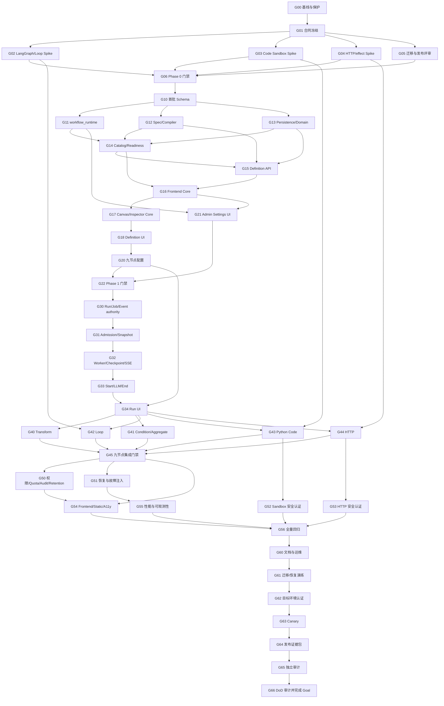

# ActWeave 可视化工作流 Codex Goal 执行计划

> **状态：** `ACTIVE`
>
> **最近更新：** 2026-08-10（Goal 已启动，完成 G00 基线保护）
>
> **方案来源：** [ActWeave 可视化工作流完整方案](./workflow-reactflow-langgraph-design.zh-CN.md)
>
> **主 Goal 范围：** 设计文档 Phase 0–2，即首批九类节点与独立 WorkflowRun 的生产级闭环
>
> **后续 Goal：** Phase 3 Human Input、Phase 4 Agent/Tool、Phase 5 Automation/API/Chatflow、Phase 6 高级编排

本文不是第二份架构设计，也不是逐文件清单。它把设计文档转换成 Codex 可以持续执行、逐项
验证和恢复上下文的任务图。架构、DTO、数据表和安全语义发生冲突时，以设计文档、仓库根
`AGENTS.md`、对应模块 `AGENTS.md` 和当前源码为准；本计划只负责执行顺序与证据闭环。

官方 Codex 指南建议 Goal 聚焦一个耐久目标、一个可验证停止条件，并明确输入材料、验证命令和
checkpoint。因此首批 Phase 0–2 是一个主 Goal，Phase 3–6 分别创建后续 Goal，不能把整个长期
roadmap 当成一个无边界 backlog。

## 0. 可直接用于 Codex Goal 的目标文本

在 Codex 中使用下面的目标。若通过界面创建 Goal，粘贴正文即可；若通过 slash command，前置
`/goal`：

```text
在 /Users/jiangfeng/deer-flow 中，严格依据：
1. docs/workflow-reactflow-langgraph-design.zh-CN.md；
2. docs/workflow-reactflow-langgraph-execution-plan.zh-CN.md；
3. 仓库根 AGENTS.md、backend/AGENTS.md、frontend/AGENTS.md；
持续完成 ActWeave 可视化工作流首批 Phase 0–2。

目标结果：在项目导航“工作”分组增加“工作流 / Workflows”入口，先进入项目级列表，再按权限
创建或打开 first-class Definition/Draft/Version；交付 React Flow Builder、独立 WorkflowRun、
Dify 信息层次的 Inspector，首批 start、llm、condition、transform、variable_aggregate、loop、
http_request、python_code、end 九类节点，以及 Gateway → Job → Worker → LangGraph → PostgreSQL →
durable SSE 的独立运行闭环。

不可违反：
- 不创建隐藏 Thread、占位 Agent 或复用 Agent Run authority；
- Agent、Tool/MCP、Human Input 不进入首批 catalog、migration、renderer、compiler 或 DoD；
- Workflow 全局产品配置只来自 PostgreSQL workflow_runtime 管理员系统配置，不接受
  config.yaml、env、Compose、Helm values 或浏览器 fallback；
- Code 只在 fresh isolated Python Sandbox 中运行，无 host fallback、网络、挂载或秘密；
- HTTP 只经受控 egress，写请求使用 effect ledger；结果不确定进入不可重试的
  side_effect_unknown；
- 用户图保持 root/body DAG，Loop 回边只由 Compiler 生成；
- 保留当前脏工作树中的用户修改，不 reset、checkout、覆盖、暂存、提交或推送未授权内容。

执行方式：以执行计划中的最早 Ready 任务为准，严格 TDD；每完成一个 checkpoint，更新计划的
状态与证据表，记录修改模块、测试命令、结果、未验证边界和下一任务。可以并行只读审计和互不
重叠的实现工作，但 Schema/DTO/稳定 ID/共享状态不得并发产生两套权威。

停止条件：本计划列出的全部任务（G00 至 G66）完成，首批 Definition of Done 逐项有当前
checkout 的证据，
真实 PostgreSQL 零 skip、前后端检查、动态/静态/real-backend E2E、至少一个真实 Code
Sandbox 隔离 profile、至少一个真实 HTTP controlled-egress profile、迁移/恢复演练和文档同步
全部通过；任何未执行的 live model、浏览器或部署目标必须明确列为未认证。不要仅因局部测试、
Mock 链路或代码已编写而停止。
```

## 1. Goal 执行协议

### 1.1 状态标记

| 标记  | 含义                                                      |
| ----- | --------------------------------------------------------- |
| `[ ]` | Pending：前置任务未完成或尚未开始                         |
| `[-]` | In progress：当前唯一主任务                               |
| `[x]` | Complete：交付物和本任务验证均有当前 checkout 证据        |
| `[!]` | Blocked：存在明确外部阻塞；记录原因、已尝试动作和解除条件 |
| `[~]` | Deferred：确认不属于主 Goal，已路由到 Phase 3–6 后续 Goal |

任一时刻只允许一个主任务为 `[-]`。子任务可以并行，但必须由主任务收口，且不得同时修改相同
schema、DTO、stable ID、migration、editor store 或运行状态机。

### 1.2 每次 Goal 续跑的固定顺序

1. 阅读本计划的“当前状态”“证据日志”和最早未完成任务；
2. 阅读根 `AGENTS.md`，涉及后端/前端时完整阅读对应模块指南；
3. 执行 `git status --short`，把现有修改视为用户权威，不清理或重写无关内容；
4. 核对当前 schema head、依赖锁定版本、相关模块源码和测试，不直接信任旧行号或旧测试结果；
5. 选择依赖均为 `[x]` 的最早任务，将其标为 `[-]`；
6. 先添加失败测试并观察预期失败，再实现最小最终路径；
7. 运行聚焦验证；通过后运行该任务规定的受影响门禁；
8. 更新状态、证据、风险和下一任务；没有证据不得标 `[x]`；
9. 未经用户明确授权，不创建分支、暂存、提交、推送、PR 或修改外部系统；
10. 只有 G66 审计通过才完成主 Goal。困难、耗时或预算临近都不是完成条件。

### 1.3 完成证据格式

每完成一个任务，在 §11 追加一行：

```text
YYYY-MM-DD HH:mm | Gxx | complete/blocked | 修改模块 | 验证命令与结果 | 未验证边界 | 下一任务
```

测试结果必须来自当前 checkout。focused/offline 测试不能替代真实 PostgreSQL、Worker/API、浏览器、
容器、Kubernetes、Code Sandbox、HTTP egress 或 live provider 证据。

### 1.4 变更集边界

- 每个任务形成可独立审阅的变更集，但不要求自动提交；
- 数据表变更必须同时闭合 ORM、full schema、显式 migration、schema marker、catalog
  signature/digest、required relations、fresh/upgrade parity；
- Backend 遵循 `app.* -> deerflow.*`，Harness 不 import `app.*`；
- Gateway 只做鉴权、命令、准入和读取，Worker 是唯一图执行者，Scheduler 只做到期准入；
- Frontend API 响应使用 strict Zod，Query key 绑定 account UUID + project UUID，所有请求转发
  AbortSignal，scope 切换清理旧 generation；
- 不为测试增加生产 fallback，不用 TODO 空壳冒充 catalog/executor/renderer；
- README、相关 `AGENTS.md`、部署与运维文档在对应实现变更集中同步。

## 2. 冻结范围与非目标

### 2.1 主 Goal 必须交付

| 领域      | 冻结结果                                                                             |
| --------- | ------------------------------------------------------------------------------------ |
| 资源模型  | 独立 Definition、Draft、Version、WorkflowRun、Snapshot、Event、Effect                |
| 节点      | `start/llm/condition/transform/variable_aggregate/loop/http_request/python_code/end` |
| 入口      | 项目“工作 → 工作流”导航、列表/空状态/创建/read-only、直接路由与 Static 门禁          |
| 编辑器    | React Flow Canvas、Spec/Canvas/Session/Runtime 四层、CAS、Undo/Redo                  |
| Inspector | Header、设置、上次运行、下一步、九类参数、readOnly/disabled                          |
| 编译运行  | strict Spec、canonical checksum、Compiler IR、LangGraph、Checkpoint                  |
| 控制面    | Project API、Catalog、发布、Run、cancel/retry、durable SSE                           |
| 全局配置  | 管理员 PostgreSQL `workflow_runtime` 唯一 authority 与 Run 精确 snapshot             |
| Code      | Python 3.12、JSON-only、fresh isolated activation、资源/日志/销毁门禁                |
| HTTP      | 固定批准 HTTPS origin、Credential slot/grant、controlled egress、effect              |
| 运维      | migration、readiness、metrics、alerts、retention、backup/restore/canary              |

### 2.2 主 Goal 明确不做

- Agent、Tool/MCP、Human Input、Chatflow、外部 service principal；
- 隐藏 Thread、占位 Agent、Agent `runs`/`run_events`/checkpoint authority 复用；
- 文件输入、Workflow workspace、Artifact authority；
- for-each、Parallel Map、嵌套 Loop、Subworkflow、多人协作、Time Travel；
- JavaScript/Shell Code、多文件、包安装、网络、持久文件或浏览器执行；
- 动态 executor/import path、任意表达式/eval、通用 Jinja2；
- 通用 HTTP 直连、动态 scheme/host/port、redirect、cookie、ambient proxy；
- Temporal、第二个 Workflow 服务/Worker、Redis 或第二套部署/CI；
- schema downgrade 或未经验证的零停机发布承诺。

## 3. 依赖图与并行策略



可以并行：

- G02、G03、G04、G05 的 Spike；
- G11、G12、G13 在 G10 的 schema/稳定合同冻结后；
- G20 Builder 与 G21 Admin Settings UI；
- G40–G44 的节点实现，但共享 state/registry/compiler 修改必须由一个 owner 串行合并；
- G50–G55 的只读审计和互不重叠测试。

禁止并行产生双重权威：

- `WorkflowSpecV1`、Node type/port ID、Event/Error enum、`workflow_runtime` schema；
- full schema、ORM、migration、schema marker 与 catalog digest；
- Run/Job/lease/effect 状态机；
- Editor command/store、Runtime reducer、SSE cursor；
- Code/HTTP profile digest 和 readiness 语义；
- 最终发布、迁移、恢复与 DoD 结论。

## 4. Wave 0：合同冻结与技术门禁

### [x] G00 当前 checkout 基线与保护

**依赖：** 无。

**模块：** 仓库根、`backend/`、`frontend/`、`docker/`、`deploy/helm/`、现有 CI。

**工作：**

- 记录 branch、`git status --short`、schema head、Python/Node/pnpm/PostgreSQL 版本；
- 确认 `@xyflow/react`、LangGraph、CodeMirror 的实际锁定版本；
- 确认正常开发只使用既有 `deerflow:5432`，测试仅创建 disposable `deerflow_test_*`；
- 建立本计划的第一条证据日志，标记哪些脏工作树内容与 Workflow 无关；
- 复核设计文档链接、ADR 和 Phase 0–2 DoD，无擅自扩大范围；
- 用户已明确授权并完成创建 `dev` 分支；除该分支外不自动创建 branch/commit/PR，不清理用户文件。

**验证：** `git status --short`、`make check-db`（只读）、依赖清单与 schema marker 读取。

**完成：** 基线证据可复现，所有现有修改已被保护，后续任务的真实版本与环境已记录。

### [x] G01 冻结跨端公共合同

**依赖：** G00。

**模块：** `backend/packages/harness/deerflow/workflows/`、`backend/app/workflows/`、
`frontend/src/core/project-workflows/`、合同测试。

**工作：**

- 冻结 Spec/Canvas、九类 Node config、Value/Binding、Loop scope、Credential slot declaration；
- 冻结项目级 `WorkflowProjectReadinessV1` 四种合法组合、disabled/unavailable 语义、导航显示谓词、
  Node Catalog、availability/public limits、Validation Issue、safe preview；
- 冻结 WorkflowRun/Job/Event/activation/iteration/attempt、Error code 与 HTTP outcome；
- 冻结 server-private `origin_trace_id`、Agent/Workflow execution-reference strict union、Run/Job epoch
  mapping 与公共 DTO/Audit 脱敏边界；
- 冻结 `workflow_runtime` secret-free schema、effect scope、desired/effective/readiness；
- 建立 Python/TypeScript golden fixtures，拒绝未知字段和 authority 字段；
- 明确 schema version、canonical JSON、checksum、migration 和 compatibility 规则。

**验证：** 双端 strict schema/fixture round-trip、unknown-field 负测、checksum property tests。

**完成：** 稳定 ID/字段只有一份定义；后续不得在实现阶段临时改名绕过 migration。

### [x] G02 LangGraph、Checkpoint、Loop 与 Aggregate Spike

**依赖：** G01。

**模块：** Harness Workflow compiler/runtime、真实 PostgreSQL checkpointer、Spike tests。

**工作：**

- 用锁定 LangGraph 版本验证 StateGraph 编译、full/delta checkpoint 与 compiler cache；
- 验证 structured bounded do-until：body 至少一次、原子 commit、更新后判断、limit fail；
- 验证根图和 body authored DAG，唯一回边仅由 Compiler 生成；
- 验证 Worker takeover 在 body/commit/route 前后不重跑已提交轮次；
- 验证 Variable Aggregate 的互斥分支 convergence、`MISSING != null` 和歧义失败；
- 证明 recursion limit 只做纵深保护，不替代 max iterations。

**验证：** 真实 PostgreSQL、两种 checkpoint mode、SIGKILL/takeover fault matrix。

**停止门禁：** 无法证明 iteration-aware activation/checkpoint 唯一性时，不进入正式 Compiler。

### [x] G03 Isolated Python Code Sandbox Spike

**依赖：** G01。

**模块：** Harness sandbox protocol、AIO/Provisioner、Code runner、容器/Helm 能力供给。

**工作：**

- 定义强类型 `IsolatedCodeExecutionProvider` request/result/lease/cleanup 合同；
- 固定 Python 3.12、同步 `main(inputs)->dict`、canonical JSON stdin/out；
- 每 activation 创建 fresh environment，无网络、host/Thread/Skill mount、env、secret、socket；
- 加 CPU、memory、PID、tmpfs/disk、wall、stdout/stderr/result 限制；
- success/error/timeout/cancel/lease loss 必须 destroy-confirmed，崩溃进入持久 cleanup-pending；
- Local/host Bash/普通 `execute_command()` 永久负向拒绝；
- 至少一个真实容器或 Provisioner profile 完成逃逸、资源和 orphan cleanup conformance。

**验证：** 真实 provider security suite，不以 mock、class 名或 TTL 代替销毁证据。

**停止门禁：** 没有至少一个真实可认证 profile，主 Goal 保持 blocked，不实现假 Sandbox fallback。

### [x] G04 HTTP controlled-egress 与 effect Spike

**依赖：** G01。

**模块：** Workflow HTTP execution/policy/Credential/effect、egress proxy/NetworkPolicy、前端 cURL parser。

**工作：**

- 定义固定批准 HTTPS origin、变量编码、TLS、no redirect/cookie/ambient proxy 合同；
- 定义 endpoint injection profile、required slot、Draft grant intent、Version grant、Run exact snapshot；
- 冻结 active envelope rotation/revoke-before-dispatch 语义，不在 Run 冻结 envelope ID；
- 定义 GET/HEAD retry 与写方法 effect ledger/idempotency key；
- 定义 `prepared/dispatching/settled/failed_safe/unknown` 及 typed outcome 原子恢复；
- 验证已收到 success/4xx/5xx/schema-invalid 后、Checkpoint 前崩溃不会重发；
- 验证不可判定写结果进入 `side_effect_unknown`，API/UI 无人工 retry；
- cURL 只做纯解析，拒绝危险 transport/file/secret 选项，原文不持久化。

**验证：** 真实 controlled egress、SSRF/DNS rebind/direct-path 负测、双 Worker/fault window。

**停止门禁：** 不能证明公网无 direct path 或 settled outcome 可恢复时，不开放 HTTP 节点。

### [x] G05 Schema、发布与运维评审

**依赖：** G01。

**模块：** persistence、migrations、system settings、jobs/events、release/Helm/operations。

**工作：**

- 确认当前实际 schema head 与下一 revision，不硬编码设计时示例版本；
- 评审首批单一 schema 变更范围、分区、FK/index、锁时间与维护窗口；
- 明确 fresh install、known-head upgrade、catalog parity、不可 downgrade；
- 明确旧 Gateway/Worker/Scheduler 停止、新 schema 升级、新进程启动和默认关闭顺序；
- 明确 `workflow_runtime` desired/effective 与 Worker attestation reconciliation；
- 设计 backup/restore、drain、feature disable、old compiler retention 和 forward-fix runbook。

**验证：** 设计评审记录、DDL dry-run/EXPLAIN 或 disposable DB 原型、发布/恢复清单。

### [x] G06 Phase 0 总门禁

**依赖：** G02、G03、G04、G05。

**工作与完成条件：**

- 所有首批 ADR、DTO、ID、状态机和 public error 已冻结；
- LLM 独立 Model Caller 强制 `tools=[]` 的原型通过；
- Code 至少一个真实 profile 与 HTTP 至少一个真实 controlled-egress profile 通过；
- Loop/full-delta/takeover、HTTP effect crash recovery 和 migration 方案可执行；
- `workflow_runtime` 是唯一产品配置 authority，所有文件/env/Helm fallback 已被否定；
- Agent、Tool/MCP、Human Input 没有首批空壳；
- 未满足任一项则保持 `[!]`，不得以“后面再补”进入 Phase 1。

## 5. Wave 1：Schema、系统配置与纯领域内核

### [x] G10 首批 Workflow Schema 原子变更

**依赖：** G06。

**模块：** Workflow persistence、jobs、system runtime settings、migrations、final schema、DB tests。

**工作：**

- 以实施时的真实 schema head 创建下一 revision，不硬套设计时示例名称；
- 一次性落地首批 Definition/Draft/Version、Model refs、Credential intents/slots/grants；
- 落地 WorkflowRun、Run-job epoch、Run snapshot、Model/Code/HTTP/runtime-policy snapshots；
- 落地 Code sandbox leases、HTTP effects、Workflow events/invariants/month partitions；
- 扩展 jobs 的独立 `workflow_run_id/workflow_epoch/required_worker_profile_digest` authority；
- 扩展 Worker attested profile digest；Schema/闭合 Job type 合同只允许表示 `workflow_run`，但在
  G32 真 Handler 与 execution boundary 完成前，任何 Worker 都不得宣告 capability 或 claim；
- 扩展 system runtime policy section CHECK，播种默认关闭的 `workflow_runtime` v1；
- 为 WorkflowRun/Job 的同一 server-owned `origin_trace_id`、execution epoch mapping 与 required
  profile digest 建立复合约束；raw trace 永不进入公共 DTO；
- 以数据库 CHECK 强制 settled HTTP effect 携带可恢复 typed outcome + digest；Code lease 必须在
  Provider acquire 前先写入，且 `(workflow_run_id,node_id,activation_id,attempt)` 唯一；
- 同步 ORM、full schema、显式 migration、marker/known revisions、catalog signature/digest、
  required relations/sequences、Job 四方 enum/CHECK/FK/index；
- 不加入 waits、Agent/Skill/MCP refs、Automation target 或 Workflow file/artifact 表。

**验证：**

- fresh install 与旧 head upgrade 的 catalog parity；
- 默认 policy 只在空 catalog 播种，upgrade 不覆盖已有管理员 pointer；
- partial/corrupt catalog、未知 schema/checksum 全部 fail closed；
- Agent/Workflow Job authority 互斥，Workflow Job 的旧 Agent `run_id` 为 NULL；
- Version immutable、Run/current-job/epoch/profile 一致、event 单序列/单 terminal/partition；
- 原有 Agent Run、Job、Automation 和 event 合同不退化。

**完成：** Schema 变更作为一个原子可审阅单元；任何 ORM/SQL/migration/digest/parity 缺口都
不得进入 G11。G10–G32 是同一首批不可拆分的发布单元，禁止用只抛错的空 Handler 提前宣告
Workflow Job readiness。

### [x] G11 `workflow_runtime` 后端唯一权威

**依赖：** G10。

**模块：** Backend system runtime settings、admin Gateway、audit、Gateway/Worker materializer、
配置与部署负向验证。

**工作：**

- 实现 strict、secret-free、bounded 的 Workflow policy 和安全默认；
- 纳入节点 allowlist、图/Run/Loop/activation 上限、LLM/Code/HTTP 预算、profile refs、retry、
  preview 与 retention；
- 扩展既有管理员系统配置 GET/PUT、expected-revision CAS、append-only version/current pointer；
- 增加 `new_workflow_runs` effect scope、stored/effective revision、pending roles、readiness；
- Gateway/Worker 从同一 revision/materialized checksum 工作，漂移或不可用时 fail closed；
- 为 WorkflowRun 提供独立 exact policy snapshot materialization；
- Audit 只记录 section/revision/effect/request outcome，不记录 policy payload 或 locator；
- 根 config、env、Compose、Helm schema 和前端 build env 对 Workflow 产品键做拒绝/无效化负测；
- deployment 只提供 profile capability/trust root，不成为 policy fallback。

**验证：** system-admin-only、CAS 409、unknown/secret/import path/locator 拒绝、materializer/DB
故障、desired 无 matching Worker、current pointer 变化不改写旧 Run snapshot、无文件配置覆盖。

**完成：** 后端默认仍关闭 Workflow；缺失/损坏/pending policy 不产生可执行 Catalog 或 Job。

### [x] G12 Spec、Validation、IR 与 Compiler 内核

**依赖：** G10。

**模块：** Harness Workflow schema/validation/compiler/nodes/runtime tests。

**工作：**

- 实现 strict Spec/Canvas、Value Type/Binding、Predicate AST、受限 Template；
- 实现 canonical form、semantic checksum、schema migration 与 round-trip；
- 实现 Node Registry/Executor protocol、immutable IR、compiler contract/versioned cache key；
- 实现唯一 Start、End 可达、端口/类型/cardinality/dominance/全路径 output 校验；
- 实现 root/body authored DAG、Loop scope、Compiler-only 回边和最坏步数预算；
- 为 Condition/Transform/Aggregate/Loop 冻结 IR lowering、route/commit 协议与纯语义测试；正式
  runtime executor 由 G40–G42 实现并在此前保持不可执行；
- LLM/Code/HTTP 仅依赖注入端口，不在 Harness 查询项目、Credential 或业务 ORM；
- 未知/旧 compiler contract fail closed，非终态 Run 清零前保留旧实现。

**验证：** strict/property/golden tests，九类精确 allowlist，跨进程 checksum，Condition/Aggregate/
Loop IR lowering golden、MISSING/null/歧义校验、禁止 back-edge/cross-scope/nested Loop，以及 G02
Spike 合同回归；最终 1/N/limit 和 full/delta runtime 由 G41/G42 验证。

**完成：** Harness 不 import `app.*`；纯编译测试可在无 Gateway/Worker 时确定性通过。

### [x] G13 Workflow Persistence 与领域状态机

**依赖：** G10。

**模块：** Workflow persistence、`app/workflows/`、authorization/error/state repositories。

**工作：**

- 实现 project + owner scoped repositories 和复合 FK/查询条件；
- 实现 Definition/Draft/Version、WorkflowRun、epoch/current Job、snapshot/event/effect/lease 状态机；
- 固定 Project → Membership → resource 锁顺序，repository 不越权 commit；
- 实现 Domain error 到 API/Job terminal 的稳定映射；
- 实现 Version immutable、Draft CAS、Run terminal 单向、unknown terminal 不可逆；
- WorkflowRun 永不写入 Agent `runs`、`threads_meta`、Agent event/checkpoint 表；
- 建立 owner-private read/cancel/retry 和防枚举 404/能力不足 403 的服务边界。

**验证：** 并发 CAS/publish、跨项目/owner 负测、状态 CHECK、删除/retention 顺序、旧 Agent
repository 负向证明。

**完成：** 数据库约束和 repository API 均能证明 WorkflowRun 不是 Agent Run 别名。

### [x] G14 Capability、Catalog 与 Readiness

**依赖：** G11、G12、G13。

**模块：** Projects capability、Workflow Catalog、Gateway/Worker readiness、admin safe projection。

**工作：**

- 增加 Workflow read/edit/publish/execute、Code/HTTP/use/write/grant、Run read/cancel 能力；
- Capability 只由 Gateway 返回，前端不得从 role 推导；
- 冻结设计 §11.1 的 `PROJECT_ROLE_CAPABILITIES` 精确矩阵：admin 全部；editor 获得
  read/edit/publish/execute/code.use/http.use/http.write/own-run；runner 获得
  read/execute/code.use/http.use/own-run；viewer 仅 read；channel_guest 首批无 Workflow
  capability；grant 仅 admin；所有 mutation/execute/run capability 必须蕴含 `workflow.read`；
- Catalog 精确返回九类 title_i18n、version、ports、config/output schema、public limits；
- availability 组合 project capability、effective policy、node allowlist 和 profile readiness；
- 已知但 disabled 返回安全 reason code；未知类型不可执行；
- 实现 `GET /api/projects/{project_id}/workflows/readiness`：返回 strict、secret-free 的
  control-plane status、enabled、schema、admission 与 request ID；导航判断不折叠 Worker 或节点
  profile 状态；
- Gateway/Worker readiness 对 schema、compiler、Job type、effective revision、profile digest 一致；
- G32 完成前 `workflow_run` execution capability 必须保持 unavailable；Schema 中存在 closed type
  不等于 Worker 已具备 Handler；
- Code/HTTP 不 ready 只禁对应节点，普通 Workflow 仍可用；没有通用 Workflow Worker 时不入队。

**验证：** 后端角色矩阵/implication、前后端 closed enum parity、四种 readiness 合法组合与矛盾组合
拒绝、无 capability/无 policy/无 Worker/错 digest/恢复后的状态矩阵；安全响应不泄漏 Credential、
policy payload、proxy/provider locator 或基础设施拓扑。

### [x] G15 Definition Control Plane 与 Publish API

**依赖：** G12、G13、G14。

**模块：** `app/workflows/`、Gateway、projects/audit、Workflow persistence。

**工作：**

- 实现 Definition cursor list/create/read/archive、Draft get/save/validate、publish、Version
  read/history；列表支持服务端有界 search/lifecycle/publication/sort，失败与空结果严格区分；
- 所有 request/response strict，拒绝 owner/project/authority/runtime/executor 字段；
- Draft 可不完整但 transport 合法；publish 必须锁 Draft revision 并通过完整服务器校验；
- Publish 从锁定 Draft 创建 immutable Version，不接受另一份 Spec 绕过 CAS；
- 固定逻辑 Model ref、Code/HTTP requirements，以及无秘密 Credential slot declaration、payload
  schema 和服务端 canonical slot-schema checksum；grant intent/active grant 不进入 Spec 或
  semantic checksum；
- Publish 可从匹配 Draft intent 创建 active Version grant，但缺 grant 仍可发布；发布后 grant 可
  创建、轮换、撤销而不改变 Version；Run admission 才冻结 exact grant/Credential version/schema，
  永不冻结 envelope ID；
- 实现 Draft grant-intent 与 Published Version grant 的 PUT/DELETE，服务端重算 canonical slot schema
  checksum、重验 scope/version/capability；请求永不接受 secret、scheme、header value 或 envelope；
- 发布事务中禁止模型、DNS、HTTP、Sandbox provision 等外部副作用；
- Code/HTTP 只读取 readiness；缺 grant 可发布但 Version 不可执行；
- 完成稳定 403/404/409/422、Idempotency-Key 与 content-free audit。

**验证：** outsider/member capability、Draft CAS、并发 publish、immutable Version、依赖 stale、
未知节点/Agent/Tool/Human Input 拒绝、事务失败整笔回滚。

**完成：** Definition/Builder 后端控制面可用，但 Run admission 仍由关闭的 policy 阻断。

### [x] G16 Frontend Transport、Scope 与合同基础

**依赖：** G14、G15。

**模块：** Frontend project-workflows contracts/client、project capability、scope registry、fixtures/tests。

**工作：**

- 用 strict Zod 实现 Catalog/Draft/Version/Issue/Run/Event/`workflow_runtime` DTO；
- 用 strict Zod 实现 `WorkflowProjectReadinessV1`，建立 account/project-scoped query key、hook、
  AbortSignal、错误/重试和 scope teardown；无 `workflow.read` 时不挂载 readiness query；
- 扩展 Project capability 闭合 enum，未知 authority/private 字段拒绝；
- 建立 account UUID + project UUID query root、API/hooks、AbortSignal 和 scope teardown；
- 导航只由 non-static + `workflow.read` + control-plane readiness + effective enabled + schema ready
  决定；不使用 `admission_ready`、Worker/Code/HTTP readiness，也不新增浏览器
  `PROJECT_WORKFLOW`、build env 或 localStorage feature flag；
- 冻结 Spec、Canvas、Editor Session、Runtime Projection 四层 TypeScript 边界和不变量，但不在本
  任务实现编辑器 store、Command/history 或 React Flow adapter；
- `@xyflow/react` 与 Python CodeMirror 复用现有直接依赖；若选择 Zustand 等 store，必须作为
  正式直接依赖并通过 Context 创建 per-Workbench instance，禁止 module singleton；
- 冻结 static-safe module boundary：纯 DTO/predicate 可被 Static 测试导入，认证 Workflow client 不得
  被 Static shell 传递依赖；列表/详情 route、`notFound()` 与动态导入由 G18 实现。

**验证：** strict fixture/readiness cross-field、query key/scope、late callback、static module-boundary、
四层 type boundary、Project DTO 新 capability parity。

**完成：** 无 UI 节点也能验证 strict transport、scope 和四层合同；编辑状态实现只由 G17 拥有。

## 6. Wave 2：Definition Builder 与管理员 UI

### [x] G17 React Flow Canvas 与 Inspector 基础

**依赖：** G16。

**模块：** Frontend Project Workflow Workbench、Canvas/commands/store、Inspector shell、unit tests。

**工作：**

- 实现 Workbench 顶部/左侧/Canvas/Inspector/Run panel 布局和 per-instance store 装配；
- static nodeTypes/edgeTypes registry，稳定 Handle `port_id`，动态端口后更新 internals；
- 实现领域 Command、drag/connect/delete/reparent、baseline/dirty/history 和 React Flow adapter；
- 实现本地结构校验：端口方向/cardinality、自环/重复边、root/body DAG、Loop scope/no nested、
  Condition branch/fallback；Issue 可选择节点/边/端口并居中；
- 实现 Dify 信息层次的 Header、“设置/上次运行”、折叠 section、readOnly/disabled、“下一步”；
- “下一步”以一个 Command 原子创建 node + edge，并按 capability/availability/port 过滤；
- Inspector/session/runtime 状态不写 Spec/Canvas，未知类型 Unsupported/fail closed；
- 不修改生成式 `components/ui`/`components/ai-elements`，不提供单节点直接执行。

**验证：** 多 Workbench 隔离、Command/history/drag/connect/reparent、dynamic handles、本地 validator/
issue 定位、Inspector session、scope teardown、runtime update 不污染 dirty/history、a11y。

### [x] G18 Definition 控制面 UI

**依赖：** G17。

**模块：** Frontend Project navigation/i18n、Workflow routes、list/workbench、Definition/Draft/Version
clients、tests。

**工作：**

- 在既有项目导航“工作”分组注册“工作流 / Workflows”，顺序固定为“会话 → 工作流 → 自动化”；
  桌面展开/折叠和移动端共用同一导航项，列表与详情 route 都保持 active；
- 实现 Workflow list/create/read/archive，菜单先进入列表而不是空画布；列表包含搜索、生命周期/
  发布状态筛选、排序和权限化空状态，`workflow.read` 可查看，`workflow.edit` 才显示创建/编辑/
  归档；首批只创建空白 Workflow；
- Route 继续使用既有 project scope registry，不自行解析 slug；列表/详情在 Static 先
  `notFound()`，检查完成后才动态导入认证 client，保证零 API；动态直接 URL 经服务端
  `workflow.read` 快速 gate，再把 confirmed disabled 与可重试 readiness unavailable 分开呈现；
- Workbench 加载 G17 store 的单一 Draft baseline，并实现 save/validate/publish/version
  history/readOnly；
- 将服务端 Validation Issue 映射到 G17 的 node/edge/port 选择与居中；
- Draft save、publish、archive 和 grant mutation 统一转发 AbortSignal、CSRF、Idempotency/CAS；
- 409 保留本地 Draft 与 Canvas，不自动覆盖，并提供显式 reload/compare 动作；
- 实现 Draft grant-intent 与 Published Version grant 的 PUT/DELETE：只处理 opaque Credential
  metadata、scope key、expected Credential version 与服务端 slot schema checksum；
- grant intent/grant readiness 是独立 Query/Mutation 状态，不进入 Spec、Canvas、dirty 或 Undo；
- 普通 editor 只能看安全 readiness；没有 `workflow.credential.grant` 时不得枚举或绑定 Credential；
- Static build 不导入认证 client，路由 not-found 且无 `/api/` 请求。

**验证：** 导航顺序/标签/active/桌面/移动端、入口真值表、list/create/archive/read-only、Draft
load/save/validate/publish/version、Issue mapping、CAS/409、grant CRUD/撤销/轮换、direct route 的
403/disabled/unavailable、scope teardown、Static not-found/auth-client import/零 API 负测。

### [x] G20 九类节点 Renderer 与 Inspector 配置

**依赖：** G18。

**模块：** Frontend Project Workflow node types/configs/renderers、Inspector sections、unit tests。

**工作：**

- 按以下五个可独立审阅、逐项留证的子 checkpoint 实现，任一未完成时 G20 不得标 `[x]`：
  - `[x] G20-A` 基础节点：Start、LLM、Transform、End；
  - `[x] G20-B` 分支汇合：Condition、Variable Aggregate 与动态多端口；
  - `[x] G20-C` 结构化 Loop 容器、scope/reparent 与 body/done 操作；
  - `[x] G20-D` HTTP request editor、Credential slot/grant readiness 与 cURL dialog；
  - `[x] G20-E` Python Code editor、output schema、Sandbox availability/limits；
- Loop 使用 compound/reparent semantic command，不能从几何 containment 反推 scope；
- HTTP cURL parser 零网络、危险参数拒绝、diff preview、原文关闭即清空；
- Code 使用专用 Python-only controlled editor，保存/发布前 flush，CodeMirror/Workflow Undo 隔离；
- 卡片不展示 Code source、HTTP raw request 或日志；safe preview 只显示服务器安全投影；
- 已知 disabled 使用对应 renderer，未知类型 Unsupported/fail closed；
- 默认中文名、英文回退来自 `title_i18n`，用户 `custom_label` 只改变实例展示；语言切换和
  `custom_label` 都不得改写 stable type/ID、Spec semantic checksum 或 Canvas identity；

**验证：** 九类 strict config、multi-port、Loop scope、cURL 攻击向量、Python editor、禁用态、
中文/英文/custom label 与 checksum 隔离、node renderer a11y。

### [ ] G21 管理员“Workflow 运行环境”UI

**依赖：** G11、G16。

G21 可与 G20 并行。

**模块：** Frontend admin system settings、admin shell/i18n、governance audit tests。

**工作：**

- 在既有 `/admin/settings/system` 增加唯一“Workflow 运行环境”卡片，不创建第二入口；
- 覆盖总开关、admission、node allowlist、limits、Code/HTTP profiles、retry/preview/retention；
- profile 只选服务端安全 key/digest，不允许手填 import path/image/provider/proxy locator；
- 显示 stored/effective revision、effect scope、pending roles、readiness 和 disabled reason；
- 409 保留本地草稿，不自动覆盖；畸形/不可用/无权限状态独立；
- 非 system admin 不挂载 query，也不读取 policy 表单；
- 不使用 localStorage、env 或本地默认值作为 authority；
- 既有 Agent Runtime/Auth/Memory/Quota 设置行为保持不变。

**验证：** strict schema、CAS、admin-only、pending/recovery、跨 section 不污染、中文/英文 key parity。

### [ ] G22 Phase 1 控制面门禁

**依赖：** G20、G21。

**工作与完成条件：**

- 管理员可 CAS 保存 `workflow_runtime`，默认仍关闭且 pending/readiness 准确；
- 项目“工作”分组按“会话 → 工作流 → 自动化”显示入口；点击进入列表，read-only 用户可查看，
  editor 可从空状态或列表创建空白 Workflow，再进入 Workbench；
- 入口只依赖 non-static、`workflow.read` 和 control-plane enabled/schema readiness；通用 Worker 或
  Code/HTTP profile 离线只禁用页内运行/节点，不隐藏 Definition 入口；
- admin/editor/runner/viewer/channel_guest 的 Workflow capability 矩阵与设计 §11.1 完全一致，
  implication 与前后端 enum parity 通过；
- 项目用户可创建 Workflow、编辑九类节点、保存不完整 Draft、刷新恢复 Canvas；
- 本地/服务器校验可定位 node/edge/port，未通过时 publish 拒绝；
- publish 创建 immutable Version，Version 历史只读，纯布局变化不改变 semantic checksum；
- Undo/Redo 不记录 viewport/selection/runtime，409 不丢本地草稿；
- Loop scope、Aggregate、HTTP slots/grant status、Code disabled state 均可编辑并严格序列化；
- Draft grant intent 与 Published Version grant 可独立创建/撤销/轮换且不污染 Spec/history；
- 九类中文默认名、英文切换/回退与用户 `custom_label` 正确，locale/label 不改变 semantic checksum；
- 缺 capability 的 403、confirmed disabled、可重试 readiness unavailable 三种直接 URL 状态稳定且
  互不冒充；Static 列表/详情不可达、无认证 client import 且零 API；
- Agent/Tool/Human Input 无 Catalog/renderer 空壳；
- 后端/前端聚焦测试、`pnpm check` 与受影响完整单元测试通过。

## 7. Wave 3：独立 WorkflowRun 纵向闭环

### [ ] G30 Run、Job、Event 与执行 fencing

**依赖：** G22。

**模块：** Workflow domain/persistence、reliability jobs、Worker/Gateway、quota/audit。

**工作：**

- 实现 `workflow_run` enqueue/claim/heartbeat/requeue/dead/terminal 全链；
- Run 与 Job 通过 current_job + epoch mapping + raw Job lease 形成唯一执行 authority；
- Gateway 生成 server-owned `origin_trace_id`，客户端不得指定；Run 与首次/后续 Job 保存同值，
  并受 `project_id + owner_user_id + workflow_run_id + origin_trace_id` 复合 FK 约束；
- `JobClaim` 使用严格 Agent Run / WorkflowRun execution-reference union，禁止 nullable 字段拼出
  第三种 authority；公共 DTO/浏览器不返回 raw trace，Audit 只保存域分离 HMAC；
- 不另造与 Job 冲突的第二套 Workflow execution lease；Code cleanup lease 保持独立；
- 实现按已知 `run_id` 的 owner-private Run read/output、admin safe job projection；首批不新增设计
  文档未冻结的 Workflow Run list API；
- 实现 append-only Workflow Event、monotonic seq、single terminal、partition/read API；
- 所有 event/settlement 事务重验 project/membership/Run/current Job/epoch/lease；
- stale Worker 在 lease loss 后不能 checkpoint、event、effect 或 settlement；
- 实现 terminal repair、quota reserve/release 和 content-free audit 基础。

**验证：** 双 Worker claim、lease loss、heartbeat expiry、old epoch、event seq/terminal、Agent Job
回归、Run/Job 任一写失败回滚。

### [ ] G31 原子 Run Admission 与完整 Snapshot

**依赖：** G30。

**模块：** Workflow admission、dependency resolver、snapshots、Gateway run API、readiness/quota。

**工作：**

- 在一个短事务内按固定顺序锁 Project → Membership → Definition → 精确 Published Version →
  System Settings catalog/current exact `workflow_runtime` version → 依赖/grant/Credential/配额；
- 校验 inputs、Version 可执行、Catalog/compiler contract、权限和当前 readiness；
- 冻结 exact Version/checksum、compiler contract、`workflow_runtime` version/value/checksum；
- 冻结 exact Model Config/Credential、Code runtime/profile，以及 HTTP normalized endpoint、
  endpoint/injection/egress revision + checksum、limits、exact grant/Credential version；不冻结 envelope ID；
- 计算 required Worker profile digest；
- 生成 server-owned `origin_trace_id`，让 Run 与 Job 共享，并在所有 execution reference 上写入；
- 按 `WorkflowRun(current_job_id=NULL) → exact Run snapshot rows → Job →
workflow_run_jobs(run,epoch,job) → WorkflowRun.current_job_id` 的顺序原子写入，再写 quota/audit；
  Job epoch FK 指向不可变 mapping，不能指向 Run 上会变化的 current epoch；
- 强制 Run/Job required profile digest 一致；Workflow runtime snapshot 使用独立 WorkflowRun FK 和
  exact policy-version 复合 FK，canonical `value_json` checksum 必须等于所引用版本；不得写 Agent
  `run_runtime_policy_snapshots`；
- Idempotency-Key 同语义返回原 Run，不同语义 409；
- 事务内禁止 model/DNS/HTTP/Sandbox provision/MCP 或文件 I/O；
- current policy 变更只影响新准入，既有 Run 永远使用 frozen snapshot。

**验证：** 每一步失败注入整笔回滚、stale/revoked dependency、capability/membership 撤销、wrong
profile、config/env/Helm 同名值无效、403/404/409/422/429 稳定。

### [ ] G32 Worker、Checkpoint、Compiler Cache 与 Durable SSE

**依赖：** G31。

**模块：** Worker handler/execution boundary、Harness runtime/checkpointer/events、Gateway SSE。

**工作：**

- 注册唯一 Workflow Job handler，入口再次验证 job type/epoch/profile/lease/snapshot；
- 只有真实 Handler、closed claim shape、allowlist 和 execution boundary 全部就绪后，Worker 才宣告
  `workflow_run` capability 并开始 claim；禁止空 Handler 或“先 claim 再 fail”占位；
- 实现独立 WorkflowScopedCheckpointer，authority 不依赖 Thread；
- 只从 frozen Spec/compiler/runtime snapshot 编译或命中版本化 cache；
- Worker 执行节点前后重验 lease/cancel/profile，需要时停止并安全结算；
- Worker 在 Model、HTTP、Code、Checkpoint、Event、Effect 与 Settlement 前重验 Workflow execution
  reference、同一 origin trace、epoch mapping 与 raw Job lease；
- durable event 采用 store-first，再以 NOTIFY/轮询唤醒 Gateway；
- SSE 支持 snapshot + canonical decimal cursor、Last-Event-ID、dedup、single terminal；
- Gateway/Worker restart 与 safe takeover 使用同一 checkpoint/snapshot；
- terminal DB 已提交但 SSE 丢失时可修复；
- 非终态 Run 存在时旧 compiler contract 不清理。

**验证：** snapshot load/compile/node/checkpoint/event/settlement 各点 SIGKILL；full/delta mode；
LISTEN 断开降级；stale Worker 不再写；断线 replay 与 terminal dedup。

### [ ] G33 Start → LLM → End 与运行治理

**依赖：** G32。

**模块：** Base node executors、Model Caller、Workflow state/output、Run/cancel/retry/settlement API。

**工作：**

- 实现 Start input validation/output、End final output schema；
- 实现独立 Model Caller，精确使用 Run Model snapshot，强制 `tools=[]`；
- 不进入 Agent graph/middleware、Skill/MCP、Sandbox、Thread 或 child Job；
- 实现 LLM chat/completion、structured output、usage、stream batching、timeout/error；
- 实现 queued/running cancel、允许的 node/job retry、terminal 新 Run retry；
- 明确自动 retry 不创建新 Run，人工 retry 创建 `retry_of_run_id`；
- terminal 状态、output、usage、quota 和 audit 原子结算；
- `side_effect_unknown` 已存在但只能由 G44 的 HTTP effect 产生且永不人工 retry。

**验证：** fake deterministic Model 只验证协议；真实 Model 另列目标环境 smoke。Start→LLM→End
必须经 Gateway→Job→Worker→LangGraph→PostgreSQL→SSE；restart/takeover/cancel/retry 可恢复；
数据库确认零 Thread/Agent Run/Message/Skill/MCP row。

### [ ] G34 Frontend Run、Timeline、Last Run 与 SSE 投影

**依赖：** G33、G20。

**模块：** Frontend Workflow runtime store/client、Run panel、Inspector Last Run、node overlay/E2E。

**工作：**

- 从 Start schema 生成 typed Run input；请求只含 Version/inputs/Idempotency-Key；
- 建立独立 Workflow SSE client，不复用 Thread SDK projection；
- runtime store scope 固定为 account + project + workflow + run + version；activation projection 主键
  使用 node + activation + iteration path，不包含 attempt；`current_attempt` 只能单调前进，旧
  attempt 不得覆盖新状态，日志与历史仍在 activation 下按 attempt 分桶；
- 新挂载优先读取原子 projection snapshot + cursor；服务端尚无 snapshot 时必须从 cursor `"0"`
  重建，不能相信旧隐藏消费者推进过的 cursor；
- canonical decimal cursor 去重/乱序/溢出拒绝，scope/generation/version 不匹配事件丢弃；
- node card 只显示状态摘要，Inspector 上次运行显示精确安全投影；
- Run panel 只从 admission 返回或既有明确引用的 `run_id` 进入，提供 timeline、safe preview、cancel
  和合法 retry；首批不暗造 Run list/history API；
- 完整 final output 只在用户显式打开结果时通过独立授权 `/output` 接口按需获取、strict parse 和
  安全渲染；缓存绑定精确 runtime scope 并在 teardown 清理；SSE/Last Run 只携带限长脱敏 preview；
- Runtime event 不修改 Draft/Canvas/dirty/history；
- Code source、完整 prompt/input、HTTP raw URL/header/body、Credential、path、原始日志不得由
  Event/Last Run 回传或进入运行态 cache/DOM；当前 Run input 表单、显式授权的 final output 和已
  授权 Draft 设置页可在各自受控 scope 中显示自身数据；
- account/project/workflow/run/version 切换终止旧 stream 并清理旧投影与 output cache。

**验证：** duplicate/out-of-order/reconnect/terminal repair、旧 callback、runtime-vs-editor checksum、
无聊天跳转或 Thread UI、a11y。

## 8. Wave 4：九类节点运行闭环

### [ ] G40 模板转换（Transform）

**依赖：** G34。

**模块：** Transform validator/runtime executor、checkpoint/Last Run integration、tests。G20 已拥有
authoring config/preview，本任务不再建立第二套 UI schema。

**工作：** 实现受限 text/JSON 模板、typed inputs、missing policy、output schema/limit；禁止任意
Jinja2 filter/function/import、HTML interaction 或 eval；preview 只按纯文本/JSON 转义。

**验证：** missing/null/type、输出超限、危险模板、checksum、checkpoint/takeover。

### [ ] G41 条件分支与变量聚合

**依赖：** G34。

**模块：** Predicate、Condition/Aggregate runtime executors、port/runtime projection、compiler/runtime
tests。G20 已拥有 branch/aggregate authoring UI。

**工作：**

- Condition 使用 ordered IF/ELIF + 固定 ELSE、typed operator/operand、稳定 branch/port ID；
- 禁止 raw expression/Jinja/eval，fallback 必须存在；
- Aggregate 只支持互斥分支 reconciliation，candidate 同型且顺序冻结；
- `MISSING` 与 JSON null 分离；恰好一个 available，零个或多个均稳定失败；
- Compiler 不等待未执行分支，Last Run 显示命中 branch 和选中 source 的安全摘要。

**验证：** branch reorder/port stability、AND/OR、all type operators、0/1/N candidate、dominance
受控例外、Condition→Transform A/B→Aggregate→End 完整恢复。

### [ ] G42 Structured Bounded Loop

**依赖：** G34、G02。

**模块：** Loop Compiler/runtime/checkpoint、既有 Canvas/Inspector runtime integration、tests。Spec 与
authoring UI 分别由 G12/G20 拥有。

**工作：**

- 固定 progressive stateful `do-until`，不是 foreach/Iteration；
- body 至少一次，commit 原子写 next variables 与 iteration，再评估 termination；
- condition false 且达到 max 时稳定失败 `WORKFLOW_LOOP_LIMIT_EXCEEDED`；
- root 与每个 body authored transitions 各自 DAG；用户不可画回边、跨 scope 或嵌套 Loop；
- activation identity/checkpoint/event/Last Run 都包含 iteration path；
- body/commit/route 前后崩溃遵守同轮重做、已提交轮不重做；
- cancel、worst-case step budget、recursion guard 与 profile limits 收敛。

**验证：** 1/N/limit、变量更新顺序、full/delta、Worker takeover、reparent save/refresh、200-node
含 Loop 性能。

### [ ] G43 Python Code 正式运行

**依赖：** G34、G03。

**模块：** Code executor/policy/provider/leases/reaper、Worker、frontend runtime logs、真实环境 tests。

**工作：**

- 只接受 source/input bindings/output schema/bounded timeout；固定 Python 3.12 和 `main(inputs)`；
- source checksum、canonical JSON request/result、strict output schema；
- 每 activation/attempt fresh Sandbox，Worker/claim 双重 profile digest 验证；
- 在任何外部 Provider acquire 前先持久化 lease；persistence 覆盖
  provisioning/running/cleanup-pending/destroyed/fence，并强制
  `(workflow_run_id,node_id,activation_id,attempt)` 唯一；
- Provider cleanup locator 只加密保存在内部列，不进 Event/Audit/log/error/普通管理员列表；未
  destroy-confirmed 的 lease 不得被普通 retention 删除；
- destroy-confirmed 后才 checkpoint；崩溃由 reaper 收敛，不以 TTL 猜测销毁；
- cleanup 未收敛时不得提交成功、Checkpoint 或启动重叠 attempt；
- 只有 destroy-confirmed 后的纯 infrastructure error 可 bounded retry；
- syntax/runtime/timeout/resource/output/schema 不自动 retry；
- 日志服务端 UTF-8、ANSI/C0 清洗、脱敏、限块/速率/总量，前端纯文本按 attempt 显示；
- 永久拒绝 Local/host Python/Bash/execute_command、network/mount/env/packages/image/import path。

**验证：** Start→Code→End 真实 provider；network/FS/env/socket/token/metadata 逃逸负测；
CPU/memory/PID/tmpfs/output/log 洪泛；success/error/timeout/cancel/lease loss/SIGKILL cleanup；
源码/路径/secret 不泄漏。

**完成门禁：** 真实 conformance 未通过只能保持 Code disabled，G45 不得完成。

### [ ] G44 HTTP、Credential Closure 与 Effect Ledger

**依赖：** G34、G04。

**模块：** HTTP executor/policy/credentials/effects、Worker、controlled egress、frontend Run/error。

**工作：**

- 执行 frozen literal HTTPS origin、restricted path/query/header/body 模板和 limits；
- TLS verify=true、redirect/cookie/trust_env/direct public path 固定关闭；
- 在 Worker 内从 Run snapshot 的 exact slot/grant/Credential version 解析该版本当前 active envelope
  并安全注入；新 active grant 或新 Credential version 不得替换 Run snapshot；
- dispatch 只使用并校验 Run 冻结的 `workflow_runtime`、endpoint/injection/egress revision +
  checksum、limits 和 required profile digest，不读取 current System Settings、当前 endpoint pointer、
  配置文件或 ambient env；
- dispatch 时可变重验仅限 Run/Job lease、membership/capability、snapshot 指向的 exact grant 状态、
  exact Credential version 状态及该版本当前 active envelope；
- GET/HEAD transient retry；写方法只按 frozen server policy 和稳定 idempotency key 重试；
- 写方法只有冻结 endpoint policy 明确提供 idempotency-key 合同，且 effect ledger 可复用同一
  operation key 时才允许重试；
- effect 记录 prepared/dispatching/settled/failed_safe/unknown 和 bounded typed outcome；
- 确定 response 后 effect+outcome 原子落库；Checkpoint/error route 前崩溃只重放 outcome；
- 无法判定对端结果时进入 Run `side_effect_unknown`，不走 error edge/cancel/Job/manual retry；
- success/error ports 只承载确定 outcome；retry API 对 unknown 固定 409。

**验证：** 真实 egress GET/success/error；写请求双 Worker与发送前后 crash；settled 后 SIGKILL；
4xx/5xx/schema-invalid replay；SSRF/DNS rebind/redirect/proxy/Unix socket/direct path；压缩炸弹和
limits；grant/Credential revoke、envelope rotation；secret sentinel 零泄漏。

**完成门禁：** controlled egress/NetworkPolicy 不能证明公网无直连时 HTTP 保持 disabled，G45
不得完成。

### [ ] G45 九节点集成门禁

**依赖：** G40、G41、G42、G43、G44。

**必须通过的真实链路：**

1. Start → LLM → End；
2. Start → Code → End；
3. Start → Condition → Transform A/B → Variable Aggregate → End；
4. Start → bounded Loop（body: Transform）→ End，含正常退出与 limit fail；
5. Start → HTTP GET → Condition → End；
6. HTTP 写请求的 settled recovery 与 `side_effect_unknown` 故障窗。

**横向断言：**

- 每条链均经真实 Gateway→Job→Worker→LangGraph→PostgreSQL→SSE；
- Version/policy/dependency/profile snapshots 不随 current pointer 改变；
- restart/lease takeover/cancel/replay 后状态收敛；
- 前端 Last Run 定位精确 activation/iteration/attempt，Runtime 不污染 Draft；
- 无 Thread、占位 Agent、child Job、Skill/MCP session；
- 只有 Code 创建 fresh Sandbox，只有 HTTP 使用受控 egress；
- Agent、Tool/MCP、Human Input 仍未注册。

## 9. Wave 5：安全、恢复、治理与全量回归

### [ ] G50 Authorization、Quota、Audit 与 Retention

**依赖：** G45。

**模块：** Projects/private-work/quotas/audit/operations、Workflow retention/reconciliation。

**工作：**

- 所有项目/owner authority 由 server-issued context 派生，request 不接受 scope/role/capability；
- 每个 side-effect boundary 重锁 project/membership/Run/Job/lease/capability；
- outsiders、wrong owner、missing private resource 收敛到 404，能力不足为 403；
- admission reservation、settlement consume/release、失租/terminal reconciliation；
- WorkflowRun/Version/Event/Effect/Code lease 的 project lifecycle、privacy export/delete/retention；
- audit 使用 closed action/target/outcome 与 action-specific metadata，只记录 content-free 信息；
- admin job/readiness/operations 不返回 prompt、input/output、URL、Credential、locator、raw error；
- `side_effect_unknown` 保留治理壳且禁止普通 retry/requeue；
- feature 关闭后已准入 Run 可 drain/cancel，新 admission 关闭。

**验证：** 跨项目/owner/capability/membership race、quota 并发/reconciliation、retention 删除顺序、
audit secret/source/URL/path 注入、privacy scope、unknown recovery 操作 409。

### [ ] G51 Worker 恢复与故障注入矩阵

**依赖：** G45。

**模块：** Worker/reliability/runtime/persistence、Gateway SSE、fault-injection tests。

**工作：**

- 在 admission、snapshot load、compile、node start/end、checkpoint、event、effect、settlement
  各边界注入进程崩溃、DB failure、lease loss、cancel；
- 验证已 checkpoint 节点不重做，未提交的无副作用/已声明可重复节点按合同重做；
- Loop commit 前后、Code destroy barrier、HTTP dispatch/settled 窗口单独验证；
- 双 Worker takeover 不产生双 terminal、双 effect 或 overlapping Sandbox；
- Gateway/PostgreSQL/NOTIFY 暂失后 SSE cursor/terminal 可恢复；
- 逐项验证 frozen/current 边界：System Settings/endpoint/injection/egress/Model config 与 exact
  Credential version 固定；grant/Credential revoke 和 exact version 当前 active envelope 在 dispatch
  前重验；Worker attestation 必须匹配 frozen required profile digest；任何 current pointer 都不得
  偷偷替换 Run snapshot；
- cancel 与 terminal/expiry/cleanup race 最终收敛。

**验证：** 确定性 crash matrix，记录每个注入点预期状态、可否重试、实际结果和残留资源。

### [ ] G52 Code Sandbox 目标环境安全认证

**依赖：** G43。

**模块：** Docker/Provisioner/Helm、真实 Code profile、security conformance、operations。

**工作：**

- 用目标部署镜像 digest、runner contract、isolation policy checksum 生成 attestation；
- 验证 non-root、no privilege escalation、read-only root、seccomp/cap drop、deny-all egress；
- 验证无 host/PVC/Thread/Skill mount、Docker socket、service-account token、cloud metadata；
- 验证 CPU/memory/PID/tmpfs/wall/output/log 和进程树强制终止；
- 验证跨 project/run/activation/attempt 隔离及每次 fresh lease；
- Worker SIGKILL 后 cleanup-pending/reaper 真实收敛，operator 可观察但看不到 locator；
- Local 与未认证 AIO profile 永久不宣告 isolated-code capability。

**完成：** 保存真实命令、环境、镜像 digest、policy checksum、通过/失败矩阵；mock 结果不计。

### [ ] G53 HTTP Egress 目标环境安全认证

**依赖：** G44。

**模块：** HTTP Worker profile、egress proxy/NetworkPolicy、endpoint policy、security tests/runbook。

**工作：**

- 证明 Worker 允许 DB/控制面/DNS/批准 proxy 的精确集合且公网无 direct path；
- 验证 HTTPS/TLS/SNI、DNS pinning/rebinding、IPv4/IPv6/metadata/reserved address 拒绝；
- 验证 redirect、cookie、ambient proxy、userinfo、Unix socket、危险 headers/idempotency override；
- 验证 response header/wire/decompressed/JSON-depth/timeout limits 和日志 query/header 脱敏；
- 验证 endpoint/injection/egress policy digest attestation 与 Worker claim；
- 验证 Credential sentinel 只到批准端点，Event/Audit/Checkpoint/UI/support bundle 均为零泄漏；
- 验证 write effect 的 settled/unknown、envelope rotation 和 revoke-before-dispatch。

**完成：** 保存真实目标、profile digest、NetworkPolicy/proxy 证据和攻击矩阵；应用层 URL 校验
本身不能作为 egress 认证。

### [ ] G54 Frontend 安全、Static、A11y 与 Browser E2E

**依赖：** G50、G45。

**模块：** Frontend unit/component/E2E/static/real-backend、project/admin UI。

**工作：**

- 覆盖“工作 → 工作流”导航顺序、中文/英文标签、nested active、桌面展开/折叠与移动端一致；
- 覆盖入口真值表和 direct route：`workflow.read`、四种 readiness 合法组合、矛盾组合拒绝、
  enabled/schema、admission/Worker/Code/HTTP 离线不隐藏入口、403/confirmed-disabled/
  retryable-unavailable/static 边界；
- 覆盖 admin/editor/runner/viewer/channel_guest 的 Workflow capability 矩阵、所有高阶能力蕴含
  `workflow.read` 及前后端 enum parity；
- 覆盖 Workflow 列表搜索/筛选/排序、权限化空状态、read-only 无创建/编辑/归档以及创建后进入
  Workbench；
- 覆盖创建/拖入/连接/保存/刷新、无效 Draft、publish、CAS、Undo/Redo；
- 覆盖九类节点关键配置、Loop reparent、Aggregate、cURL、Python editor、disabled/readOnly；
- 覆盖 admin policy CAS/revision/pending、普通成员拒绝、policy 切换 frozen Run；
- 覆盖 Run/SSE/replay/Last Run、cancel/retry/unknown 无 CTA、scope 切换与 Runtime 隔离；
- 覆盖 safe preview/log 文本转义、旧 attempt 丢弃和 secret/source/path 不进 DOM/cache；
- 覆盖键盘、焦点、aria label、非颜色状态和窄屏 Inspector；
- Static 列表/详情 route not-found、static bundle 不 import auth client、零 `/api/` 请求；
- 修改当前 `pnpm test:e2e` 显式 spec 清单，以及 real-backend `replay-e2e.yml`/相关脚本的显式 spec
  清单，使 Workflow E2E 真正进入现有 CI；不能只新增未被调用的测试文件。

**验证：** unit/component、dynamic mocked、static、real-backend 四层分开报告；mock 浏览器不能
冒充真实 Code/HTTP/provider 认证。

### [ ] G55 性能、可观测性与告警

**依赖：** G51。

**模块：** Canvas/runtime、Gateway/Worker metrics/logging、DB queries/partitions、operations、
doctor/support bundle。

**工作：**

- 约 200 节点 Canvas 的 drag/zoom/select/Inspector 输入/runtime delta 实测；
- 高频 node delta/log 微批、SSE frame/bytes、cursor replay 压测；
- 多 Run admission/claim/checkpoint/event/effect 并发与 DB index/lock 检查；
- 记录 queue/admission/node/checkpoint/SSE/Code acquire-run-destroy/HTTP/effect/unknown 指标；
- 日志只携带安全 correlation，禁止 policy payload、source、HTTP/Credential/locator；
- 建立 no Worker、profile drift、cleanup backlog、unknown effects、event lag、partition/readiness 告警；
- support bundle 只输出 revision/checksum/profile readiness/计数和稳定错误码；
- 同步 doctor/support bundle 的 Workflow readiness/cleanup/effect 只读诊断并加入 secret/locator/
  content 注入负测；
- 形成容量默认值与尚未认证的上限清单。

**完成：** 指标/告警/runbook 可操作；性能结果是测量值，不把建议默认冒充生产容量保证。

### [ ] G56 当前 checkout 全量回归

**依赖：** G52、G53、G54、G55。

**工作：**

- 运行 §12 的 Backend、Frontend、Database、Replay、Container/Helm 和安全门禁；
- 真实 PostgreSQL 用 disposable `deerflow_test_*`，完整 suite 零 skip；
- 检查旧 Agent/Memory/MCP/Automation/Chat/Static 路径无退化；
- 检查格式、类型、lint、blocking-I/O、安全 schema、dependency audit；
- 将失败分成 baseline、环境、回归或新功能，不通过删除测试/加 fallback 消除失败；
- 记录未运行的浏览器、live model、容器/K8s/Provider 目标。

**完成：** 所有主 Goal 要求的当前 checkout 门禁通过；任何目标环境缺口保持 `[!]`，不进入发布。
G56 完成后如 G60–G65 产生任何代码、Schema、migration、CI、部署或可执行脚本修改，G56 立即
重新打开，受影响门禁和后续证据必须重跑。

## 10. Wave 6：发布、迁移、Canary 与 Goal 完成

### [ ] G60 文档、运维与支持材料

**依赖：** G56。

**模块：** README、根/Backend/Frontend AGENTS、用户/部署/运维文档。

**工作：**

- 同步项目“工作 → 工作流”入口、列表/空状态/read-only/创建、九类节点、权限、项目 readiness、
  管理员 Workflow 运行环境与启用/禁用语义；
- 同步独立 WorkflowRun、Gateway/Worker、schema/Job、Code/HTTP 安全和测试不变量；
- 编写 migration、backup/restore、drain、feature disable、profile attestation、canary runbook；
- 编写 Code cleanup backlog、HTTP unknown、SSE lag、Worker unavailable 的诊断/处置；
- 清楚区分已测试、未测试、目标环境认证和未来 Phase 3–6。

**验证：** 文档链接/格式与 AGENTS 文档/常量测试。G60 只允许文档变更；若发现必须修改可执行
代码或测试，退回相应任务并重新执行 G56。

### [ ] G61 Fresh/Upgrade/Backup/Restore 演练

**依赖：** G60。

**模块：** PostgreSQL schema/migrations/scripts、release runbook。

**工作：**

- 在新空数据库执行 fresh setup/check；
- 从当前已知旧 head 的 disposable 备份执行显式 upgrade/check；
- 比较 fresh/upgrade catalog signature 完全一致；
- 测量 migration/constraint/index 锁时间和维护窗口；
- 验证 `workflow_runtime` 默认关闭、upgrade 不覆盖已有管理员 revision；
- 从已验证备份恢复并重新 check，确认失败时可 forward-fix 或 restore；
- 证明旧 Worker 在升级后不能 claim Workflow Job，且无 schema downgrade 路径。

**完成：** 记录 DB 名/版本、命令、耗时、parity、恢复点和结果；不得在开发数据库上做破坏性演练。

### [ ] G62 目标部署能力认证

**依赖：** G61。

**模块：** Container/Provisioner/Helm/Worker readiness、目标环境 operations。

**工作：**

- 构建并锁定应用/runner/Provisioner 镜像 digest；
- 校验 Helm、RBAC、ServiceAccount、NetworkPolicy、Secret references 和 deny-by-default；
- 部署层不出现 Workflow 产品开关/限额/profile/endpoint；
- 启动 Gateway/Worker 后比对 schema、effective policy、compiler、Job type 和 profile attestations；
- 重跑真实 Code/HTTP 安全 smoke；
- 可选运行真实 LLM provider smoke；未执行时明确标注，不以 fake Model 代替；
- readiness 只公开安全状态，不返回 PIDs、DB URL、private IDs 或 locator。

**完成：** 至少一个受支持部署目标同时认证通用 Workflow、Code 和 HTTP profile。

### [ ] G63 内部项目 Canary 与渐进启用

**依赖：** G62。

**顺序：**

1. 关闭新准入并完成备份/恢复点；
2. 停止旧 Gateway/Worker/Scheduler；
3. 使用新版本 `make upgrade-db`，随后 `make check-db`；
4. 启动全部新进程，确认 `workflow_runtime` 仍默认关闭；
5. 管理员保存 desired policy，等待 effective revision 与 attestation 收敛；
6. 只对内部项目开放 capability/admission；
7. 执行 G45 六条真实 canary；
8. 验证 restart、cancel、Code cleanup、HTTP unknown、SSE replay；
9. 监控 queue/error/cleanup/effect/event 指标；
10. Canary 稳定后再逐步放量。

**停止条件：** migration/check-db、revision/profile drift、direct egress、Sandbox 隔离、unknown
recovery、旧 Worker claim 或 secret leak 任一失败，立即关闭新 admission；已准入 Run 只 drain/cancel。

### [ ] G64 发布证据包

**依赖：** G63。

**工作：** 汇总 schema/parity、Backend/Frontend/E2E、Code/HTTP conformance、性能、迁移/恢复、
canary、metrics/alerts、文档、未认证目标和工作树范围；每项含日期、命令、环境、结果与 artifact。

**完成：** 证据包可以让另一位维护者在不相信历史对话的情况下复核首批 DoD。

### [ ] G65 独立交叉审计

**依赖：** G64。

**工作：** 使用独立上下文按设计文档 §23、§26 和本计划逐项审计：代码、数据库、API、UI、
安全、测试和部署证据；重点搜索隐藏 Thread/Agent authority、配置第二权威、Local/host fallback、
HTTP direct path、unknown retry、strict DTO 放宽、E2E 未接入脚本等静默退化。

**完成：** 所有 blocker 修复并重新运行受影响门禁；只读审计结论本身不能替代测试。
G63 Canary 或 G65 审计产生任何代码/Schema/migration/CI/部署修复时，必须重新打开 G56，重跑
受影响目标环境门禁，再重新执行 G60–G65；不得沿用修复前证据完成 G66。

### [ ] G66 首批 Definition of Done 与 Goal 完成

**依赖：** G65。

只有以下全部成立才能完成主 Goal：

- G00–G65 全部 `[x]`，无未解释 `[!]`；
- 设计文档 §23 验收标准和 §26 首批 DoD 每一项都有当前证据；
- 项目“工作 → 工作流”入口、列表/空状态/创建/read-only、直接路由、专用 readiness、权限与
  Static 门禁完整，执行 Worker 或 Code/HTTP profile 离线不隐藏已有 Definition 入口；
- 首批九类 Catalog/Builder/Compiler/Runtime 完整，Agent/Tool/Human Input 无空壳；
- 独立 WorkflowRun 全链不创建隐藏 Thread/占位 Agent；
- PostgreSQL `workflow_runtime` 是唯一全局产品配置 authority；
- 真实 Code Sandbox 与真实 HTTP controlled egress 至少各一个 profile 通过；
- fresh/upgrade parity、真实 PostgreSQL零 skip、前后端/浏览器/部署门禁通过；
- migration/backup/restore/canary/runbook 可复现；
- 用户文档与三个 `AGENTS.md` 已同步；
- 未运行的 live model、浏览器或其他部署目标已明确标注，未被描述为认证完成；
- 工作树中无本 Goal 意外覆盖的用户修改；
- 若用户未授权 Git 发布，保持未暂存/未提交并清楚交接；若已授权，则按明确范围另行执行。

完成报告必须以结果和证据为主，并列出剩余 Phase 3–6，不得把后续路线称为首批缺陷。

## 11. 当前状态、Checkpoint 与证据日志

### 11.1 当前状态

| 字段             | 当前值                                         |
| ---------------- | ---------------------------------------------- |
| Goal 状态        | `PAUSED`（用户要求停在 G20，2026-08-10）       |
| 当前 checkpoint  | `G00–G20 complete；暂停在 G21 之前`            |
| 下一可执行任务   | `暂停；用户恢复后从 G21 开始`                  |
| 主 Goal 范围     | Phase 0–2                                      |
| 设计文档         | `workflow-reactflow-langgraph-design.zh-CN.md` |
| 计划最后整理日期 | 2026-08-10                                     |
| Git 发布授权     | 仅授权创建 `dev`；未授权 stage/commit/push/PR  |
| 实现证据         | G00–G20 已闭合；G21 未启动                     |

任务标题中的 checkbox 是任务状态 authority。Codex 每次续跑同时更新上表的 Goal 状态、当前
checkpoint、下一任务和日期；不要另外创建第二份进度文件。

#### 恢复基线（2026-08-10）

- 已正式闭合：G00–G10；`dev` 分支保持未暂存、未提交、未推送。
- G11 已闭合：`workflow_runtime` 控制面 effective 与 Worker admission pending 分离、策略集合不可变
  投影、Worker exact identity 三值约束与 PostgreSQL 时钟收敛均已落地；Python authority DTO 的
  tuple array ingress 仅允许私有 sentinel/factory 重验证内部 tuple，外部入口只接受 JSON
  array/list。独立对抗复核覆盖 sentinel、subclass、`model_construct`、factory、secret scan；pure
  `254 passed`、真实 PostgreSQL `11 passed/0 skipped`、fresh/v9→v10/G10/G13 parity
  `26 passed/0 skipped`、前端 `19 passed`，catalog digest 精确为 `b64298f3…a1088a`。
- G12 已闭合：七组 Compiler 审计整改及追加的 Aggregate `Condition.error` provenance 缺口均已
  修复；另一代理逐项复核 root/Loop、typed lowering、bitset reachability 与跨端 Registry，无
  blocker。跨里程碑 pure `324 passed`、真实 PostgreSQL Spike `2 passed/0 skipped`、前端 Catalog
  `32 passed/0 skipped`，Registry checksum `a667832d…5c24`。
- G13 已闭合：显式 Version identity、Event payload 深冻结、Definition/Draft/Credential Slot JSON
  TOCTOU、Draft schema label 四项修复由另一代理独立复核；扩展 pure `305 passed`、G10+G13
  disposable PostgreSQL `39 passed/0 skipped`，Ruff/format/diff-check 通过。
- G14 已闭合：精确 10 capability/五角色矩阵、两条 Gateway API、四态 readiness、generic/code/http
  独立 facet 与 exact 九节点 Catalog 已实现并独立复核；共享 Registry/Resolved authority 使用 tuple +
  递归只读 Mapping 真冻结。Workflow pure `684 passed`、真实 PostgreSQL `15 passed/0 skipped`、前端
  `276 passed/0 skipped`，Registry checksum 保持 `a667832d…5c24`。
- G15 已闭合：`full_schema_v11`、Definition/Draft/Version/Grant/Idempotency persistence 与完整
  Gateway façade 已完成；Code/HTTP publication requirements 作为 immutable Version 子表持久化，
  audit、并发 publish、回放、回滚、partial Draft grant-intent 和 history 404/empty 语义均经真实
  PostgreSQL + ASGI 验证。最终 catalog digest 为 `41ab7a…f540`。
- G16 已闭合：strict Definition/Version/Run/Event/Policy DTO、认证 readiness client、account/project
  query scope、Abort/teardown、导航 predicate 与 Spec/Canvas/Editor Session/Runtime 四层边界已完成；
  postfix 审计修复 partial Draft 保存边界、nested union 前后端 parity、HTTP status/error-code 闭包。
  独立复核前端 `335 passed/0 skipped`，`pnpm check` 零错误。
- G17 已闭合：per-Workbench Editor store、领域 Command/有界 history/drag、React Flow 九类静态
  adapter、稳定/动态 Handle、root/Loop 本地校验、Workbench/Inspector/Last Run/下一步均已实现；两轮
  独立审计修复 canonical NFC、动态端口类型、递归 binding 删除、cardinality、完整 Command 通道、
  issue 选择/居中/真实 DOM focus、快捷键隔离、滚动/实例 ID 和 Draft 版本分类等 11 组缺口。最终
  G17 focused `62 passed/0 skipped`，G16–G17 组合 `397 passed/0 skipped`，`pnpm check` 零错误。
- G18 已闭合：项目导航、Static-safe 列表/详情 route、Definition/Draft/Version/grant façade、CAS/409
  保留本地 Draft 与持久 mutation idempotency 已实现；`full_schema_v12` 将 control receipt 泛化为
  operation-specific scalar authority，scope 由 Service/Repository/数据库三层独立派生。独立审计
  `PASS`：前端集成 `64 passed/0 skipped`，disposable PostgreSQL + Gateway + migration parity
  `64 passed/0 skipped`，Ruff/format/diff-check 通过，测试库残留为 0；最终 catalog digest
  `ad476334…dc502`。
- G20 已闭合：A–E 九类节点专用 Renderer/Inspector 配置、动态端口、Loop semantic command、HTTP
  安全 authoring/cURL、Python Code controlled editor/flush barrier 与服务端 Model authoring capability
  已实现。独立审计发现并闭合“flush 后 Validate/Publish 使用旧 Draft”及“partial Draft
  `config:null` 永久只读”两项缺口；复验 G20 focused `179 passed/0 skipped`，完整 Project Workflow
  前端 `536 passed/0 skipped`，Backend Workflow pure `771 passed`、HTTP/Catalog disposable PostgreSQL
  `2 passed/0 skipped`，`pnpm check` 零错误（仅 5 条既有 warning），Ruff/Prettier/diff-check 通过。
- 当前顺序固定为：按用户要求暂停在 G20，不启动 G21。G32 前不得用伪 Worker 行或空
  Handler 宣告 Workflow admission ready。
- G21–G66 尚未完成；管理员 Workflow 运行环境 UI、Run API、Worker executor、九节点真实执行、E2E、
  部署与发布门禁仍未完成。

### 11.2 Wave 汇总

| Wave | 范围                                            | 状态     | Exit gate |
| ---- | ----------------------------------------------- | -------- | --------- |
| 0    | 合同与 Spike，G00–G06                           | Complete | G06       |
| 1    | Schema/系统配置/领域内核，G10–G16               | Complete | G16       |
| 2    | Control Plane/Builder/Admin UI，G17/G18/G20–G22 | Paused   | G22       |
| 3    | 独立 Run 纵向闭环，G30–G34                      | Pending  | G34       |
| 4    | 九类节点运行，G40–G45                           | Pending  | G45       |
| 5    | 安全/恢复/治理/回归，G50–G56                    | Pending  | G56       |
| 6    | 发布/迁移/Canary/DoD，G60–G66                   | Pending  | G66       |

### 11.3 证据日志

| 时间       | 任务        | 状态     | 修改模块                                                                                                                                                                                                                                         | 验证命令与结果                                                                                                                                                                                                                                                                                                                                                                                                                                                                                       | 未验证边界                                                                                                                                                                 | 下一任务    |
| ---------- | ----------- | -------- | ------------------------------------------------------------------------------------------------------------------------------------------------------------------------------------------------------------------------------------------------ | ---------------------------------------------------------------------------------------------------------------------------------------------------------------------------------------------------------------------------------------------------------------------------------------------------------------------------------------------------------------------------------------------------------------------------------------------------------------------------------------------------- | -------------------------------------------------------------------------------------------------------------------------------------------------------------------------- | ----------- |
| 2026-08-10 | Plan        | complete | `docs/`                                                                                                                                                                                                                                          | Prettier 2/2；链接 104/0 缺失；44 ID 唯一；依赖 DAG 44/44；28 围栏                                                                                                                                                                                                                                                                                                                                                                                                                                   | 无实现、无运行测试                                                                                                                                                         | G00         |
| 2026-08-10 | Plan Audit  | complete | 只读审计                                                                                                                                                                                                                                         | Backend/Frontend 独立复核通过，无剩余硬冲突                                                                                                                                                                                                                                                                                                                                                                                                                                                          | 无目标环境认证                                                                                                                                                             | G00         |
| 2026-08-10 | Plan Delta  | complete | `docs/`                                                                                                                                                                                                                                          | 工作流入口合同；Prettier 2/2；链接 108/0；44 ID/DAG；128 围栏                                                                                                                                                                                                                                                                                                                                                                                                                                        | 无实现、无运行测试                                                                                                                                                         | G00         |
| 2026-08-10 | Delta Audit | complete | 只读审计                                                                                                                                                                                                                                         | 导航/readiness/capability/Static/E2E 定点复核，无 blocker                                                                                                                                                                                                                                                                                                                                                                                                                                            | 无实现、无运行测试                                                                                                                                                         | G00         |
| 2026-08-10 | G00         | complete | 基线保护                                                                                                                                                                                                                                         | `dev@2103697e`；`make check-db` ready/full_schema_v9；Python 3.12.11、Node 23.11.1、pnpm 10.32.1；React Flow 12.10.0、CodeMirror Python 6.2.1、LangGraph 1.2.9；Prettier 2/2、相对链接 69/0 缺失                                                                                                                                                                                                                                                                                                     | 本机 pnpm 与仓库声明 10.26.2 不同；未运行产品测试或目标环境认证；既有 dirty worktree 全部保留                                                                              | G01         |
| 2026-08-10 | G01         | complete | Workflow 跨端合同、生成式 Registry、公共/私有 DTO 边界                                                                                                                                                                                           | Backend 313 passed；Frontend 237 passed/0 skipped；动态端口 1019 个合法计数属性探针与 4 个 cap+1 负例；Registry `--check`、Ruff、Prettier、TypeScript、`pnpm check` 均通过（仅 5 条既有 warning）；独立 postfix 审计无 blocker                                                                                                                                                                                                                                                                       | 仅完成合同/fixture/生成 authority；尚无 ORM、DDL、Gateway、Worker、真实 PostgreSQL takeover、Sandbox 或 controlled-egress 认证                                             | G02–G05     |
| 2026-08-10 | G02         | complete | LangGraph/compiler template、Loop/Aggregate、full/delta Checkpoint 与 takeover Spike                                                                                                                                                             | 真实 PostgreSQL + LangGraph `1.2.9`：15 passed/0 skipped；覆盖六个 body/commit/route fault window、真实子进程 SIGKILL、full/delta、`durability=sync`、稳定 activation/独立 attempt、`MISSING != null`、版本化无 authority compiler cache；Ruff check/format 通过                                                                                                                                                                                                                                     | Spike 只证明结构化 Loop 子集；正式九节点 IR、Run/Job lease fence、事件与 Worker execution boundary 由 G12/G32/G40–G44 完成                                                 | G03–G04     |
| 2026-08-10 | G03         | complete | 独立 Python Code contract、purpose-built Docker provider/runner、PostgreSQL durable lease journal 与 reaper                                                                                                                                      | 主线程与独立审计均通过真实 Docker+disposable PostgreSQL+SIGKILL conformance `14 passed/0 skipped`；覆盖 locator 写入前后崩溃、跨进程 operation/session flock、Job/Run/attempt/profile/token fence、AES-GCM locator、取消/失租/probe/execute error destroy barrier；G03+G05 PG `28 passed`、contracts `18 passed`、Ruff/format 通过；最终受管容器 0                                                                                                                                                   | Phase 0 只认证本机/shared-POSIX Docker profile；生产 ORM/full schema/migration 属 G10，多主机/Provisioner/Kubernetes 等价 operation authority、cleanup deadline 告警属 G43 | G10         |
| 2026-08-10 | G04         | complete | HTTP controlled-egress、Credential/effect 合同、Job execution fence、cURL pure parser                                                                                                                                                            | 纯合同 47 passed；真实 disposable PostgreSQL effect/G05 30 passed；前端 cURL 30 passed；真实 Docker+TLS+PG conformance 通过，镜像 ID `sha256:8f958b…038`，SSRF/DNS-rebind/direct path blocked，typed outcome/settled recovery/双 Worker 单次 origin/旧 Worker fence passed；Ruff/Prettier clean                                                                                                                                                                                                      | Phase0 只认证本地 Docker egress/effect/fault-window；G44 仍需接 live capability 与 exact Credential closure；生产 migration 属 G10，Compose/Kubernetes 未认证              | G03         |
| 2026-08-10 | G06-LLM     | complete | 独立 Workflow Model Caller 无工具原型                                                                                                                                                                                                            | `test_workflow_model_caller_spike.py` 3 passed；直接对注入模型 `bind_tools([])`，调用前后 lease fence，任何 tool/invalid-tool response fail closed；Ruff check/format 通过                                                                                                                                                                                                                                                                                                                           | 仅 deterministic fake 协议；精确 Model snapshot materialization、stream/usage/structured output 与 live provider smoke 属 G33                                              | G10         |
| 2026-08-10 | G06-config  | complete | AppConfig、Compose、Helm、前端环境与 PostgreSQL `workflow_runtime` 唯一权威门禁                                                                                                                                                                  | 独立复验后端配置/策略 99 passed、前端策略/环境 18 passed/0 skipped；Helm 正常 lint/template 通过；顶层 Workflow value 与嵌入 `config.yaml` 的 Workflow key 均被拒绝；Ruff/TypeScript/ESLint/Prettier 由聚焦门禁通过                                                                                                                                                                                                                                                                                  | 这里只证明文件、环境变量和 Helm 不能成为第二份产品策略；生产管理员 System Settings section、revision、materialization、Run snapshot 与 readiness 仍由 G10–G12 完成         | G10         |
| 2026-08-10 | G06         | complete | Phase 0 聚合门禁                                                                                                                                                                                                                                 | Backend pure `449 passed/0 skipped`；Frontend `270 passed/0 skipped`；真实 disposable PostgreSQL `57 passed/0 skipped`；真实 Docker+PG+SIGKILL `14 passed/0 skipped`；Registry generator、Ruff/format、TypeScript/ESLint 通过；受管容器 0；独立审计无 blocker                                                                                                                                                                                                                                        | 只证明合同与 Spike 可进入生产实现；G05 SQL 仍是原型，管理员 System Settings、生产 persistence、API/UI/Worker、live Model/Credential/部署 profile 尚未实现                  | G10         |
| 2026-08-10 | G05         | complete | Schema/发布运维评审、disposable PostgreSQL DDL 原型                                                                                                                                                                                              | 当前 head=`full_schema_v9`；`test_workflow_schema_g05_postgres.py` 3 passed/0 skipped；证明 Run↔Job epoch/trace fence、effect settled outcome、Code lease 唯一性、事件单序列/单终态、`workflow_runtime` section 与 claim index；Ruff/Prettier 通过                                                                                                                                                                                                                                                   | 非生产 migration；未验证完整 G10 catalog parity、目标数据量锁时长、备份恢复和 Kubernetes；正式 revision 由 G10 按届时 head 生成                                            | G03–G04     |
| 2026-08-10 | G10         | complete | 正式 Workflow ORM、`full_schema_v10`、显式 migration、独立 WorkflowRun/Job authority、五节 System Settings                                                                                                                                       | 主线程真实 PostgreSQL `13 passed/0 skipped` 与 System Settings `10 passed/0 skipped`；独立审计真实 PG `56 passed/0 skipped`、setup/Worker/Scheduler/event `98 passed/0 skipped`、Agent 私有 Run/Event `18 passed/0 skipped`；fresh 与 v9→v10 catalog parity、Alembic offline SQL、Ruff/format/diff clean；最终 catalog 102 relations/1257 columns/3 sequences/916 constraints/345 indexes/32 functions/109 triggers，digest `ff2c6992…0196`                                                          | 只完成正式 Schema 与第五节默认/物化入口；Gateway/Worker policy convergence、正式 Compiler 与领域 repository/API 由 G11–G16 完成；G32 前 Workflow Job 仍不可 claim          | G11–G13     |
| 2026-08-10 | G11         | complete | System Settings、admin Gateway、Worker/Gateway convergence、Workflow policy frontend mirror                                                                                                                                                      | 独立复核 G11/settings/config/Worker pure `254 passed`、strict 子集 `66 passed`；真实 PostgreSQL CAS/convergence/snapshot/settings `11 passed/0 skipped`，fresh/v9→v10/G10/G13 parity `26 passed/0 skipped`；前端 `19 passed`；tuple/set/generator/string 外部 ingress、sentinel/subclass/model_construct/factory/secret 对抗探针通过；catalog 102 relations/1263 columns/3 sequences/919 constraints/346 indexes/32 functions/109 triggers，digest `b64298f3…a1088a`                                 | Docker/Helm/K8s/E2E 未认证；G32 前生产 `workflow_run` Handler 仍故意未安装，G14 只能报告 control-plane ready 而不得宣告 admission ready                                    | G14         |
| 2026-08-10 | G12         | complete | Harness Workflow schema/validation/compiler/IR、app policy adapter、前端 Registry/Catalog                                                                                                                                                        | 实现者 G01/G02/G12 focused `205 passed`、Workflow pure `621 passed/82 PostgreSQL deselected`；独立 postfix 复核跨里程碑 pure `324 passed`、真实 PostgreSQL Spike `2 passed/0 skipped`、前端 Catalog `32 passed/0 skipped`；root/Loop Aggregate error provenance、typed lowering、bitset reachability 均通过；generator `--check`、Ruff/format、Prettier 通过；Registry checksum `a667832d…5c24`                                                                                                      | 未实现生产 runtime executor，LLM/Code/HTTP 仍为 DI protocol；九节点 runtime 与外部 Provider 认证由 G32/G40–G44 完成                                                        | G14         |
| 2026-08-10 | G13         | complete | Workflow persistence、领域 command/event authority、owner-private service                                                                                                                                                                        | 实现者 focused pure/Event/Transport `141 passed`、G13 PostgreSQL `3 passed`；独立复核扩展 pure `305 passed`、G10 schema + G13 PostgreSQL `39 passed/0 skipped`；B1–B4、唯一 JSON authority、project+owner 404/403、锁序、WorkflowRun 非 Agent 边界通过；Ruff/format/diff-check 通过                                                                                                                                                                                                                  | API、真实 Gateway/Worker admission/runtime settlement、浏览器、Compose/K8s 与外部 Provider 分别属于 G14/G15/G30/G32 及后续 Wave                                            | G14         |
| 2026-08-10 | G14         | complete | Project capability、Workflow readiness/Catalog、Gateway API、前端 strict mirror                                                                                                                                                                  | 独立复核 Workflow pure `684 passed/84 PostgreSQL deselected`、真实 disposable PostgreSQL `15 passed/0 skipped`、前端 `276 passed/0 skipped`；主线程复跑后端 focused `195 passed`、G11/G13/G14 PostgreSQL `13 passed/0 skipped`、前端 `113 passed/0 skipped`；exact 10 capability/五角色、四态 readiness、三 facet、exact 9/closed 7 reason、真实 immutable Registry、404/403/422/503/no-leak 通过；generator、Ruff/format、Prettier、pnpm check 通过                                                 | G32 前 `workflow_run`/Code/HTTP Handler gate 仍预期关闭；Definition CRUD/publish、浏览器 hooks/UI、Worker execution、Compose/K8s 分属 G15–G44                              | G15         |
| 2026-08-10 | G15         | complete | `full_schema_v11`、Definition/Draft/Version/Grant/Idempotency persistence、Gateway façade                                                                                                                                                        | G15 focused `55 passed/0 skipped`；fresh/migration/catalog/setup/check `58 passed`；独立 persistence PG `7 passed/0 skipped`、service/Gateway 组合 `20 passed`；并发 publish 单 Version/单 audit、事务回滚、partial Draft grant-intent、history 404/empty、immutable Code/HTTP requirements 均通过；Ruff/format/diff clean；catalog 105 relations/1282 columns/938 constraints/351 indexes/112 triggers，digest `41ab7a…f540`                                                                        | 不执行 Workflow Run；浏览器 Definition UI、React Flow store/adapter、Worker/Provider 与部署目标分别属于 G16–G44                                                            | G16         |
| 2026-08-10 | G16         | complete | 前端 strict Definition/Run/Event/Policy DTO、readiness client、query scope、四层编辑边界                                                                                                                                                         | 主线程与独立审计同一冻结快照：17 files、`335 passed/0 skipped`；`pnpm check` 0 errors（仅 5 条既有 admin warning）；G16 scoped ESLint/Prettier、diff-check 通过；partial Draft save、nested union parity、12 组 HTTP error status/code 与 mismatch no-leak 原始反例均通过                                                                                                                                                                                                                            | 全仓 `pnpm format` 仍只被既有用户修改 `components/landing/header.tsx` 阻挡；实际 Workbench/store/React Flow/Inspector 与 route/nav 集成由 G17/G18 完成                     | G17         |
| 2026-08-10 | G17         | complete | per-Workbench Editor store/Command/history、本地 validator、React Flow Canvas/adapter、Workbench/Inspector                                                                                                                                       | 两轮独立审计最终 PASS；G17 focused `62 passed/0 skipped`，G16–G17 组合 `397 passed/0 skipped`；覆盖多实例隔离、canonical NFC、drag/connect/delete/reparent、动态类型 Handle、root/Loop/Condition/cardinality、递归 binding、原子下一步、Issue node/edge/port 选择/相机/真实 DOM focus、stale focus cleanup、Undo/Redo/CodeMirror 隔离、session/runtime 不污染 history、Unsupported/null/future 分类；`pnpm check` 0 errors（5 条既有 warning），scoped ESLint/Prettier、diff-check 通过              | 尚未接 Definition route/list/load/save/validate/publish/grant/CAS（G18），九类完整 Renderer/配置（G20），浏览器 E2E/200 节点性能和目标部署（G54–G66）                      | G18         |
| 2026-08-10 | G18         | complete | Definition 导航/list/detail、Draft/Version/grant 客户端、Gateway mutation idempotency、`full_schema_v12`                                                                                                                                         | 独立审计 PASS；前端集成 `64 passed/0 skipped`；pure focused `37 passed`、Gateway pure `46 passed`（1 个 PG 条件项由真实门禁覆盖）；disposable PostgreSQL + Gateway + migration parity `64 passed/0 skipped`；scope/receipt/并发单写单 audit/回滚、Static 路由、CAS/409/local Draft、grant CRUD 均通过；Ruff/format/diff-check 通过，测试库残留 0；catalog digest `ad476334…dc502`                                                                                                                    | 未运行浏览器 Static production build/E2E、Compose/K8s；不执行 Workflow Run                                                                                                 | G20         |
| 2026-08-10 | G20         | complete | 九类节点 Renderer/Inspector、共享 store/flush、HTTP/cURL、Python Code、Model authoring                                                                                                                                                           | 独立审计 postfix PASS；G20 focused `179 passed/0 skipped`，完整 Project Workflow 前端 `536 passed/0 skipped`，Backend Workflow pure `771 passed/92 PostgreSQL deselected`、Model/Catalog focused `176 passed`、HTTP/Catalog disposable PostgreSQL `2 passed/0 skipped`；pre-debounce Code flush、partial `config:null`、Loop 原子性、HTTP write/`:443`、secret-free Catalog、server-declared Model 参数反例均通过；`pnpm check` 0 errors（5 条既有 warning），Ruff/Prettier/Registry/diff-check 通过 | 九类节点尚未真实执行；浏览器矩阵、200 节点性能、真实 Provider/Sandbox/egress 与部署认证属于 G32/G40–G66                                                                    | 暂停（G21） |
| 2026-08-11 | 维护修复    | complete | G00–G20 只读审计后闭合两偏差：`code_lease_store` SQL 对齐 v10+ schema（移除原型 `wr.cancel_requested_at`，取消请求以 `jobs.cancel_requested_at` 为准）、G03 code-lease PG 测试改种生产 schema 行、`frontend/AGENTS.md` 补 Project Workflows 章节 | code-lease PG `25 passed/0 skipped`；真实 Docker+PG conformance `14 passed/0 skipped`；全量 Workflow disposable PostgreSQL `92 passed/0 skipped`；Workflow pure `771 passed`；AGENTS 守卫/品牌边界 `49 passed`；Ruff/Prettier/diff-check 通过                                                                                                                                                                                                                                                        | 不改变 G21–G66 未完成状态；浏览器 E2E、部署与 Provider 认证仍属后续里程碑                                                                                                  | 暂停（G21） |

### 11.4 阻塞记录模板

只有具体外部条件才写 `[!]`：缺少批准、目标 Provider/egress 环境不存在、权限失败、无法安全合并
用户修改、真实 DB/容器/K8s 不可用等。记录：

```text
任务：Gxx
首次出现：YYYY-MM-DD HH:mm
阻塞条件：
已完成的三次独立尝试/复核：
1.
2.
3.
仍可继续的安全工作：
解除条件/需要用户决定：
```

复杂、测试慢、实现量大、会受益于澄清或 token 临近都不是 blocker。若尚有独立任务可推进，先
推进；不要因一个 Provider gate 阻断所有纯合同或 UI 工作。

## 12. 验证矩阵与命令

命令必须从当前 checkout 执行，并根据最终模块选择真实测试路径。下列 `<focused-tests>` 是占位，
不能原样运行，也不能为了匹配计划强行采用预设文件名。

### 12.1 Backend

```bash
cd backend
uv run pytest <focused-tests> -q
uvx ruff format --check .
uvx ruff check .
make detect-blocking-io
```

每个任务先运行其聚焦测试；阶段 exit gate 再从仓库根运行：

```bash
make test
```

`make test` 使用开发 `DATABASE_URL` 作为连接来源，但数据库 case 必须只创建/删除随机
`deerflow_test_*`。完整 core suite 必须零 skip；缺少 `DATABASE_URL` 的 focused/offline 通过不是
发布证据。

### 12.2 Frontend

```bash
cd frontend
pnpm format
pnpm test
pnpm check
pnpm test:e2e
pnpm test:e2e:static
pnpm exec playwright test --config playwright.real-backend.config.ts
pnpm build:production
pnpm build:static
```

当前 `pnpm test:e2e` 只显式选择少量既有 spec。G54 必须把 Workflow spec 纳入脚本或现有 CI
明确执行列表，否则“测试文件存在”不算门禁。

### 12.3 Database

正常开发数据库只做只读检查：

```bash
make check-db
```

Fresh、upgrade、restore 必须使用三个独立、显式的 disposable 目标；下面的 URI 是必须先替换并
核对数据库名的占位符，禁止原样执行，也禁止依赖根 `.env`：

```bash
# Fresh：全新 deerflow_test_*_fresh
DATABASE_URL='<app-dsn/deerflow_test_<unique>_fresh>' POSTGRES_ADMIN_URL='<admin-dsn/postgres>' make setup-db
DATABASE_URL='<app-dsn/deerflow_test_<unique>_fresh>' make check-db

# Upgrade：先把“精确已知祖先 head”的已验证备份恢复到不同的 deerflow_test_*_upgrade，核对旧 marker
DATABASE_URL='<app-dsn/deerflow_test_<unique>_upgrade>' make upgrade-db
DATABASE_URL='<app-dsn/deerflow_test_<unique>_upgrade>' make check-db

# Restore：把待验证备份恢复到第三个 deerflow_test_*_restore，再只读检查
DATABASE_URL='<app-dsn/deerflow_test_<unique>_restore>' make check-db
```

Fresh 和 upgrade 不能使用同一个已经 setup 到当前 head 的数据库；后者只会得到 no-op，不能证明
迁移链。每次在命令前解析并核对精确 database name，记录目标 DB、备份来源、起始/结束 marker、
catalog signature、耗时和零 skip 结果。不得手工 stamp、自动 repair、运行时 migration、依赖
downgrade，或在日常开发数据库执行 upgrade/restore 演练。

### 12.4 Container、Helm 与部署目标

```bash
helm lint deploy/helm/deer-flow
```

同时按现有 `container.yaml`、`chart.yaml` 和 `replay-e2e.yml` 的真实命令执行：

- Backend、Frontend、Provisioner/runner image build；
- Helm render/lint 与 RBAC/NetworkPolicy assertions；
- real-backend replay；
- Code Sandbox conformance；
- HTTP controlled-egress/SSRF conformance。

本地没有 Docker/Kubernetes/目标 Provider 时必须标为未验证，不能用 unit test 替代。

### 12.5 文档

```bash
cd frontend
pnpm exec prettier --check ../docs/workflow-reactflow-langgraph-design.zh-CN.md
pnpm exec prettier --check ../docs/workflow-reactflow-langgraph-execution-plan.zh-CN.md
```

同时检查 Markdown 围栏、相对链接和设计/计划的任务 ID/Phase/节点集合一致。

### 12.6 证据矩阵

| 结论                          | 最低证据                                                                  |
| ----------------------------- | ------------------------------------------------------------------------- |
| Spec/Compiler 正确            | strict/property/golden + full/delta PostgreSQL checkpoint                 |
| Definition Control Plane 正确 | API/DB 并发/CAS/immutable/integration tests                               |
| 独立 WorkflowRun              | 实际 DB 证明无 Thread/Agent Run row + Worker/SSE E2E                      |
| `workflow_runtime` 唯一权威   | Admin CAS + snapshot + config/env/Helm 负向门禁                           |
| LLM 节点                      | tool-free adapter contract；live provider smoke 单独标记                  |
| Loop                          | iteration-aware checkpoint + commit 前后 crash takeover                   |
| Code                          | 真实隔离 profile、逃逸/资源/销毁/orphan tests                             |
| HTTP                          | 真实 egress/NetworkPolicy、SSRF、effect crash/unknown tests               |
| Durable SSE                   | Gateway restart、cursor replay、single terminal real-backend E2E          |
| Frontend                      | 导航/readiness/list + Unit/component + dynamic/static/real-backend + a11y |
| Database release              | fresh/upgrade catalog parity + backup/restore rehearsal                   |
| Production readiness          | attestation convergence + internal canary + metrics/alerts                |

## 13. 后续能力的独立 Codex Goals

主 Goal 完成后再创建以下 Goal。每个 Goal 都应复制同样的基线保护、TDD、证据日志和目标环境门禁，
并以届时的真实 schema head 为准。

### 13.1 Phase 3：Human Input Goal

```text
完成 ActWeave Workflow Phase 3 Human Input，不停止直到 native LangGraph interrupt/resume 在真实
PostgreSQL、跨 Worker restart、full/delta checkpoint 下通过；workflow_waits 独立 migration、
Human Input Catalog/Inspector、waiting 非终态、单次响应、幂等重放、双响应冲突、cancel/expiry、
同一 WorkflowRun 新 epoch/new Job 和 UI 恢复全部通过。若 native interrupt Spike 失败，不注册
节点并以证据报告 blocker。不得创建隐藏 Thread 或把 Human Input 塞回聊天消息 authority。
```

### 13.2 Phase 4：Agent 与 Tool Goal

```text
完成 ActWeave Workflow Phase 4 Agent 与工具调用，不停止直到 Agent graph 可经低层 runtime port
在同一 Workflow Job 中执行，Agent/Skill/MCP 精确 Version/Run snapshots、Tool Credential grants、
Sandbox/files/artifacts 独立 authority、effect ledger、retry/timeout/idempotency/unknown 和安全门禁
全部通过。不得创建 Thread、聊天 Run、durable child Job 或父子 Job 自锁；MCP 只是 tool_call 的
受控 source_kind，不创建斜杠型稳定节点 type。
```

### 13.3 Phase 5：Automation、API 与 Chatflow Goal

```text
完成 ActWeave Workflow Phase 5 Automation/API/Chatflow，不停止直到 Automation target strict union、
旧数据回填、workflow_automation_run Job type、occurrence+WorkflowRun+首次 Job 原子准入、精确 Version、
overlap/Human Input policy、service principal/Webhook 与 Chatflow input/output adapter 通过真实数据库、
Scheduler/Worker 和 E2E。不得让 Chatflow 改变独立 WorkflowRun authority，父子执行不得自锁。
```

### 13.4 Phase 6：高级编排 Goals

Phase 6 不创建一个总 Goal。下列每项单独立项、单独停止条件和 schema/compiler/runtime/fault gate：

- for-each/Iteration；
- Parallel Map；
- 嵌套 Loop；
- Subworkflow；
- 自动布局；
- 多人协作；
- Time Travel/Fork；
- Code JavaScript、多文件、包安装、网络或持久文件。

## 14. Goal 创建前最终检查

- [ ] 用户确认要启动主 Goal，而不只是保留计划；
- [ ] Goal objective 使用 §0，未擅自设置 token budget；
- [ ] 当前脏工作树和不相关修改已在 G00 保护；
- [ ] 真实 Code Sandbox 与 HTTP egress 环境具备可认证路径，或接受 Goal 会在相应门禁阻塞；
- [ ] 数据库 maintenance/backup/restore 权限和 disposable test DB 能力可用；
- [ ] 用户理解首批主 Goal 不含 Human Input、Agent、Tool/MCP；
- [ ] 未授权 Git 发布时，Goal 只实现和验证，不提交/推送；
- [ ] 计划文件是唯一进度账本，后续续跑先更新 §11。

官方 Goal 使用参考：[Follow a goal](https://learn.chatgpt.com/use-cases/follow-goals)。
